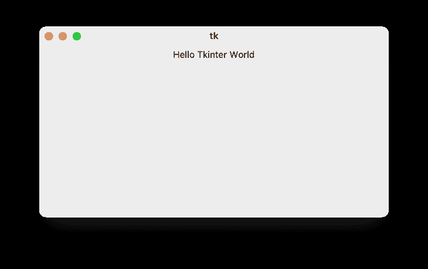
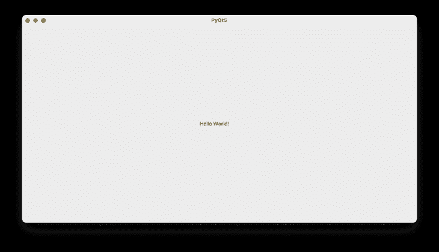
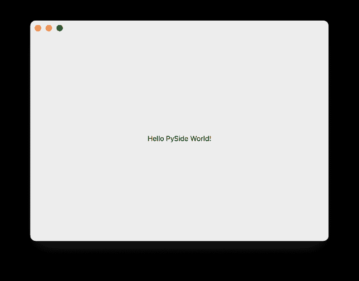
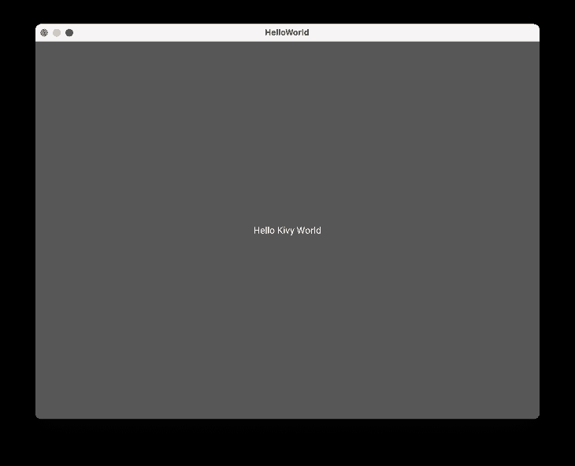

# 比较顶级 Python GUI 框架

> 原文：<https://blog.logrocket.com/comparing-top-python-gui-frameworks/>

在本文中，您将了解顶级 Python GUI 框架，如何使用它们，以及它们之间的比较。但是首先，让我们快速讨论一下什么是 GUI 框架，为什么它是编程的一个重要方面。

## 什么是 GUI？

GUI 是图形用户界面的缩写。它是允许用户通过图形元素与电子设备交互的界面。

这是软件编程的一个重要方面，因为它允许人和计算机/电子设备之间的交互。简而言之，它用用户友好的操作取代了基于文本的命令，目的是为用户提供易于使用的决策点和界面，从而在软件应用程序中产生良好的用户体验。

## 顶级 Python GUI 框架

我们将在本文中讨论的顶级 Python GUI 框架有:

这些 Python GUI 框架是 Python 软件开发人员最常用的框架。每一种都有其优点和缺点，我们将在下面讨论。

要继续这篇文章，您需要从官方 Python 网站安装 Python 3 解释器。

## Python Tkinter

[Tkinter](https://docs.python.org/3/library/tkinter.html) 是 Python 的标准内置 GUI 库，而且，凭借 GitHub 上超过 41，000 颗星的[，它是最受欢迎的 Python GUI 框架。这是一个快速易用的 Python GUI 库，是构建 Python GUI 应用程序的首选库。](https://github.com/python/cpython/tree/main/Lib/tkinter)

### 安装 Tkinter

Tkinter 是一个内置的 Python 库，因此它会预安装在您的计算机上的 Python 安装中。没必要单独安装。

### Tkinter 一览

Tkinter 提供了 GUI 应用程序中经常使用的许多小部件，如标签、按钮、复选框、文本框和画布(用于绘制三角形、矩形、多边形等形状)。).

下面是一个例子:

```
import Tkinter
mainApp = Tkinter.Tk()
# Add the codes for the widget here..
mainApp.mainloop()
```

当您运行上面的 Python 代码时，您将看到以下内容:



#### 在 Python 中使用 Tkinter 的好处

*   它是 Python 的一部分，这意味着不需要额外下载
*   它使用简单的语法
*   文本和画布部件非常强大且易于使用
*   它使用 Mac 和 Windows 上的本地小部件

#### 使用 Tkinter 的缺点

*   有时很难调试
*   不像其他框架，它看起来并不漂亮

## PyQT 5

PyQT 是一个 Python GUI 框架，它是围绕流行的 QT 应用程序框架构建的。它可以在许多平台上运行，包括 Windows、macOS、Linux、iOS 和 Android。

### 安装 PyQT

安装 PyQT 5 也很简单。首先，我们创建一个虚拟环境。在构建新的 Python 应用程序时，这是一个非常重要且值得推荐的步骤。

要创建 Python 虚拟环境，请打开您的终端，并在您喜欢的目录中运行下面的命令。

```
​​Python -m virtualenv pyqt_venv
```

要激活虚拟环境，请运行以下命令:

```
source pyqt_venv/bin/activate
```

激活虚拟环境后，使用 [Python pip](https://pip.pypa.io/en/stable/) 在虚拟环境中安装 PyQT。为此，请在您的终端中运行以下命令:

```
pip install pyqt5
```

### 使用 PyQT

在成功安装 PyQT 5 之后，我们将继续编写一个具有设定高度和宽度的小型 PyQT GUI 应用程序。下面是我们的代码的样子:

```
import sys
from PyQt5.QtWidgets import QApplication, QWidget, QLabel

def PyQT5App():
   app = QApplication(sys.argv)
   w = QWidget()
   b = QLabel(w)
   b.setText("Hello World!")
   w.setGeometry(500, 500, 1000, 500)
   b.move(450, 240)
   w.setWindowTitle("PyQt5")
   w.show()
   sys.exit(app.exec_())

if __name__ == '__main__':
   PyQT5App()
```

运行上面的代码后，您应该看到以下内容:



#### 使用 PyQT 的优点

*   更好的文档
*   它更人性化
*   提供更多 UI 组件

#### PyQT 的缺点

*   陡峭的学习曲线，因为它有组件，需要时间来学习
*   如果你的应用程序不是开源的，你必须支付商业许可费

## PySide6

[PySide6](https://www.qt.io/qt-for-python) ，在 Python 中被称为 QT，是一个绑定 QT 框架的 Python GUI 框架。PySide 提供了对 QT 提供的所有 GUI 组件和工具的访问。

### PySide 安装

Pyside 可以使用 Python pip 轻松安装。就像我们对其他框架所做的一样，我们首先需要创建一个虚拟环境。

打开您的终端，在您喜欢的目录中运行以下命令:

```
​​Python -m virtualenv pyside_venv
```

要激活虚拟环境，请运行以下命令:

```
source pyside_venv/bin/activate
```

现在，通过在您的终端中运行以下命令，使用 Python pip 在虚拟环境中安装 PySide6:

```
pip install PySide6
```

### PySide 示例

让我们看一个简单的 PySide 应用程序:

```
import sys
from PySide.QtCore import Qt
from PySide6.QtWidgets import (QApplication, QLabel,
                              QVBoxLayout, QWidget)
from __feature__ import snake_case, true_property

class PySideApp(QWidget):
   def __init__(self):
       QWidget.__init__(self)

       self.message = QLabel("Hello PySide World!")
       self.message.alignment = Qt.AlignCenter

       self.layout = QVBoxLayout(self)
       self.layout.add_widget(self.message)

if __name__ == "__main__":
   app = QApplication(sys.argv)

   widget = PySideApp()
   widget.show()

   sys.exit(app.exec())
```

运行上面的代码以获得以下输出:



#### 派赛德的优点

*   PySide 可以跨平台使用，比其他 Python GUI 框架有更广泛的社区支持
*   它提供了比其他框架更好的文档，包括教程、例子、视频指南等。
*   由大型组织使用，包括梅赛德斯、TomTom 和诺基亚

#### 皮赛德的缺点

*   需要商业许可证

## Kivy

Kivy 是一个开源的 Python GUI 框架，可以在 Linux、Windows、OS X、Android、iOS 和 Raspberry Pi 上运行。Kivy 是最稳定的 Python GUI 框架之一，提供了一个 [API 和全面的文档和指南](https://kivy.org/doc/stable/)，便于使用和设置。需要注意的是，Kivy 是用 Python 和 Cython 编写的。

### 安装 Kivy

有多种方法可以安装 Kivy，这取决于您使用的平台。对于本文，我们将使用 [Python pip](https://pip.pypa.io/en/stable/) 安装 Kivy。要了解安装 Kivy 的其他方法，你可以查看安装页面[这里](https://kivy.org/doc/stable/gettingstarted/installation.html)。

在安装 Kivy 之前，让我们为 Kivy 项目创建一个虚拟环境。

为此，请打开您的终端，并在您喜欢的目录中运行以下命令:

```
​​Python -m virtualenv kivy_venv
```

要激活虚拟环境，请运行以下命令:

```
source kivy_venv/bin/activate
```

激活我们的虚拟环境后，您可以使用 Python pip 在您的虚拟环境中安装 Kivy 预编译的轮子。为此，请在您的终端中运行以下命令:

```
pip install kivy
```

### 在你的应用中使用 Kivy

至此，您已经成功安装了 Kivy。就像 Tkinter 一样，Kivy 也提供了许多小部件。下面是一个简单的 Kivy 应用程序的例子。

```
from kivy.app import App
from kivy.uix.button import Button

class HelloWorldApp(App):
   def build(self):
       return Button(text="Hello Kivy World")

HelloWorldApp().run()
```

运行上面的代码后，您会看到下面的窗口:



#### Pros of Kivy

*   支持多种平台，包括移动平台
*   使用 Kivy，您只需要编写一次代码，因为您可以在多个设备上使用它
*   这些小工具易于使用，支持多点触控

#### 使用 Kivy 的缺点

*   它不提供看起来像本地人的用户界面
*   相对较小的社区和采用率
*   因为包含了 Python 解释器，所以它的包总是很大

## 结论

关于这些 Python GUI 框架，注意一些事情是很重要的。Tkinter 和 Kivy 是免费的库，因此您可以在任何 Python 项目中使用它们。

然而，PyQT 和 PySide 要求您获得许可才能将项目商业化。此外，Tkinter 是一个内置的 Python 库，而其他三个库需要您安装它们才能使用它们。

了解了一些常见的 Python GUI 框架，如 PySide、PyQT、Kivy 和 Tkinter，现在您应该能够为您的 Python 项目决定最佳框架了。

我很乐意在下面的评论区听到你对 Python GUI 框架和你经常使用的框架的想法。