# 比较 Vue.js 日期选择器- LogRocket 博客

> 原文：<https://blog.logrocket.com/comparing-vue-js-date-pickers/>

无论是用 Vue.js 构建下一个 Airbnb、Wizz Air，还是任何其他预订或物流应用，为用户提供一种在前端提交日期和时间信息的方式，而不使 UX 变得复杂，都是必不可少的。

日期选择器组件提供了这种急需的功能。

日期选择器允许应用程序将日期和时间信息发送到后端，同时确保选择的日期和时间符合应用程序的目的，例如禁止用户选择早于当前日期的日期。

对于 Vue.js，Vue 生态系统中有很多日期选择器库。在这篇文章中，我们将讨论哪些库是最好的，以及它们的特点。

在审查这些库时，我们将考虑每个库的以下方面:

*   支持与`v-model`的双向数据绑定
*   本地化支持
*   服务器端呈现(SSR)/Nuxt 支持
*   多范围日期选择
*   Vue 3 支持
*   黑暗模式支持

事不宜迟，让我们看看 Vue 生态系统中一些最好的日期选择器库。

## 最佳独立 Vue.js 日期选择器

在本节中，我们将了解 Vue 生态系统中一些顶级的独立日期选择器库。

### `vuejs-datepicker`

是一个轻量级的零依赖日期选择器组件，用于 Vue 2 应用程序。这是迄今为止 Vue 生态系统中最受欢迎的日期选择器库之一，在发布的时候，npm 上大约有 12 万的周下载量。

在撰写本文时，它还支持 50 种语言，如果没有新的语言，用户可以贡献新的语言。

一个突出的`vuejs-datepicker`特性是能够内联或不使用`inline`属性呈现日期选择器组件。当以内联方式呈现时，日期选取器组件出现，无需单击输入字段或按钮。

这非常有用，因为它符合大多数网络应用的用户界面设计需求。

要使用`inline`属性，添加以下代码块:

```
<template>
  <datepicker :value="date" :inline="true"></datepicker>
</template>

<script>
export default {
  data() {
    return {
      date: new Date(2016, 9, 16),
    };
  },
};
</script>

```

注意:不要忘记导入日期选择器组件！

当`inline`属性被设置为`true`时，它呈现以下内容:

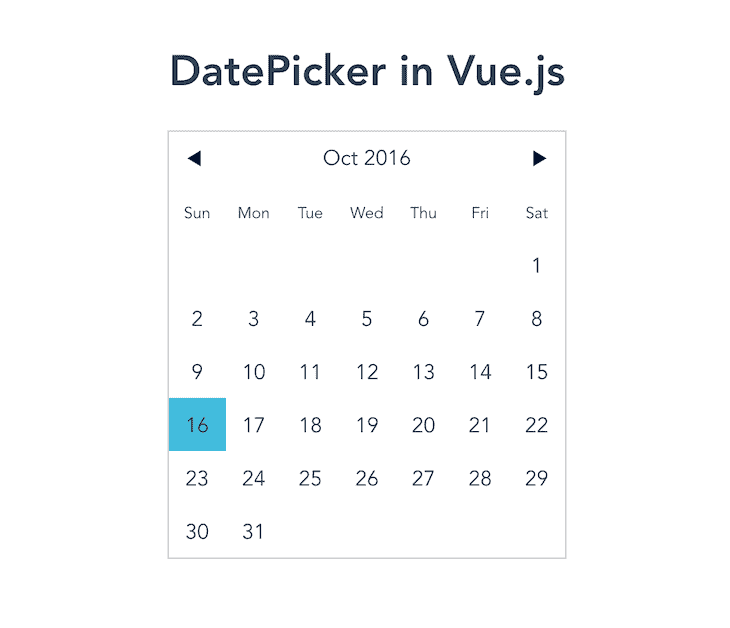

然而，如果不使用`inline`属性，日期选择器就不会显示完整的日历，留下一个不太直观的界面。

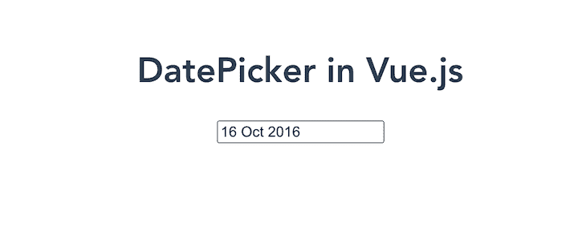

`vuejs-datepicker`还完全支持与`v-model`的双向数据绑定，这使得 Vue 开发者很容易获得用户的输入。

值得注意的是，即使导入一个语言环境，这个包也可以在支持 SSR 的 Nuxt 中工作。

虽然该包上次更新是在 2019 年，但它仍然是 Vue 生态系统中可用的顶级日期选择器组件库之一。

`vuejs-datepicker`的总体特征包括:

*   支持与`v-model`的双向数据绑定
*   本地化和国际化支持
*   SSR/Nuxt 支持

然而，`vuejs-datepicker`不幸的是不支持 Vue 3 或多范围日期选择。

### `vue2-datepicker`

[`vue2-datepicker`组件](https://github.com/mengxiong10/vue2-datepicker)有很多现成的特性，比如多范围日期选择、`disabledDate`和`disabledTime`，使得定制日期选择器组件变得非常容易。尽管它是为 Vue 2 构建的，但它目前支持 Vue 3。

虽然默认的日期选择器，如下所示，可能看起来很简单，但它提供了更多的功能。

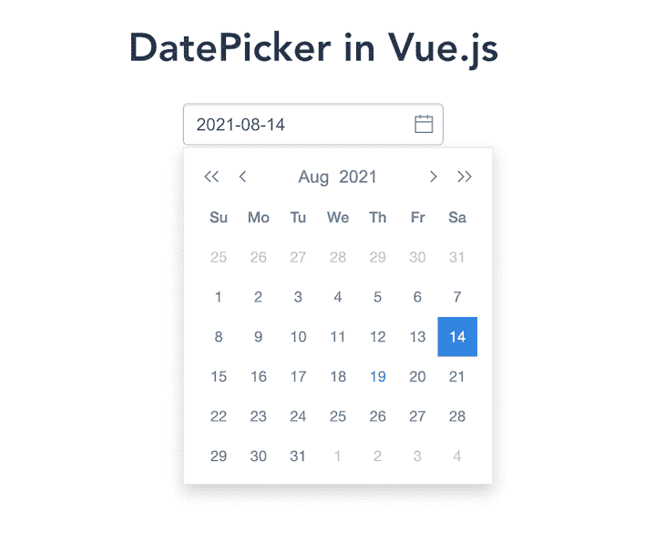

`vue2-datepicker`提供的最独特的特性是`ValueType` prop，它让您可以选择配置日期选择器来返回一个`Date`对象、时间戳或格式。

这很有用，因为您可能不必转换日期选取器组件中的用户数据来满足您的应用程序需求。

另一个值得讨论的很酷的特性是`vue2-datepicker`支持选择日期范围。这是大多数带有日期选择器的 web 应用程序所需要的特性，可以节省开发人员编写定制代码的时间。

然后，用户可以选择一个日期范围并验证它，以确保它符合应用程序的需求。

它还有几个类似`shortcuts`和`showTimePanel`的功能，可以极大地改善用户体验。

总体而言，`vue2-datepicker`具有以下特点:

*   支持与`v-model`的双向数据绑定
*   本地化和国际化支持
*   无 SSR 支持的 Nuxt 支持
*   多范围日期选择
*   视图 3 支持

如果感兴趣，我创建了一个 [GitHub Gist，你可以用它在 Nuxt 应用](https://gist.github.com/ejirocodes/90dfb4e4083957da5cc9cc29e429d028)中设置这个组件。

### DatePicker 视图

[Vue 日期选择器是一个更健壮的日期选择器组件](https://vue-datepicker.netlify.app/)。这是迄今为止最容易定制的一个，它支持 RTL 模式、无输入的内联支持以及`minDate`和`maxDate`属性，这些属性以编程方式设置用户可以选择的最小和最大日期。

这个组件[是根据材料设计指南](https://material.io/design/guidelines-overview)设计的，带有一些花哨的悬停效果、过渡和可触摸的反馈。在 web 应用程序中使用感觉很自然，并且提供了很好的用户体验！

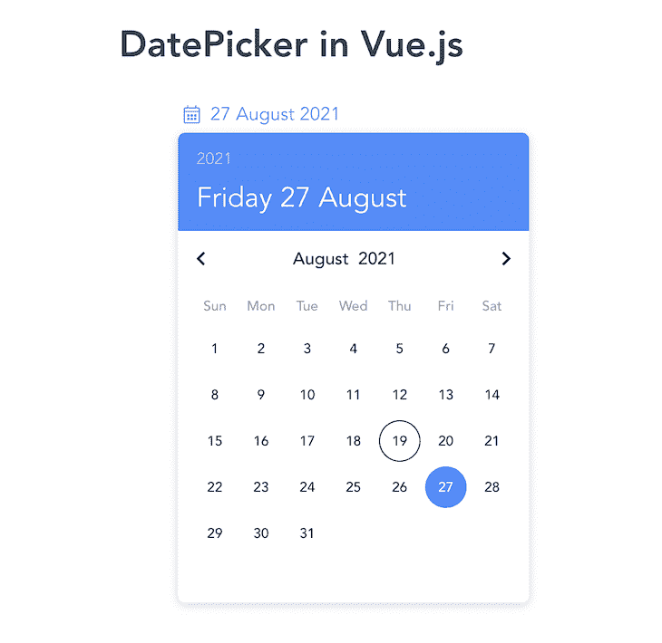

总体而言，Vue DatePicker 具有以下特点:

*   支持与`v-model`的双向数据绑定
*   本地化和国际化支持
*   SSR/Nuxt 支持

然而，它不支持多范围日期选择或 Vue 3。

## `V-Calendar`

根据其官方文档，这是一个优雅的 Vue.js 日历和日期选择器插件。这个包的一个伟大之处是文档，这使得插件易于集成和使用。

`V-Calendar`全面支持 Vue 3，颜色，深色模式，可以真正自定义格式和解析日期。使用`inputEvents`，您可以在鼠标悬停或任何其他输入事件时显示日期选择器组件。

下面是`V-calendar`在黑暗模式下的截图:

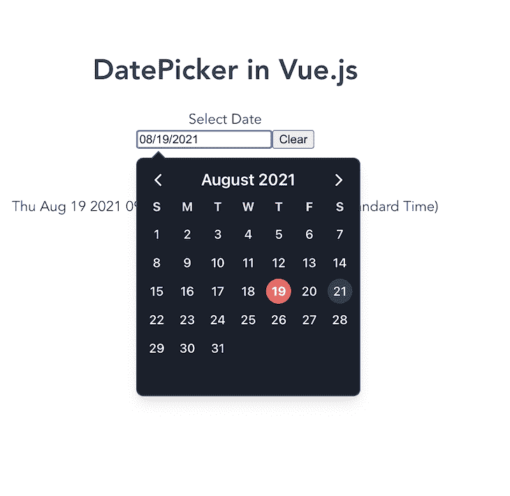

`V-calendar`也有许多属性，有助于为用户构建真正优雅的体验。您可以在带有验证消息的自定义输入的表单中使用它。

这是迄今为止 Vue 生态系统中最完整的日期选择器组件库。如果你正在为你的 Vue 应用寻找一个强大的日期选择器组件，并且有强大的社区支持，考虑这个插件。

GitHub 上有相当数量的贡献者，发布时发布了 84 个版本，最近的版本于 2021 年 7 月 13 日发布，这是一个活跃的社区。

然而，它的健壮本质是有代价的，因为它有一个 [16.7 MB 的包大小](https://www.npmjs.com/package/v-calendar)。所以，如果你的应用程序不需要那么大的重量，那就选择更轻量级的解决方案。

总体而言，`V-calendar`具有以下特点:

*   支持与`v-model`的双向数据绑定
*   本地化和国际化支持
*   支持 Nuxt，但没有服务器端渲染(SSR)
*   多范围日期选择
*   Vue 3 支持
*   黑暗模式支持

### `CtkDatetimePicker`

[`CtkDatetimePicker`是一个 Vue.js 组件](https://chronotruck.github.io/vue-ctk-date-time-picker/)，选择日期和时间，包括范围模式和黑暗模式支持。这个组件也有一个不错的 UI，因为它提供了比其他日期选择器更多的可视化功能:

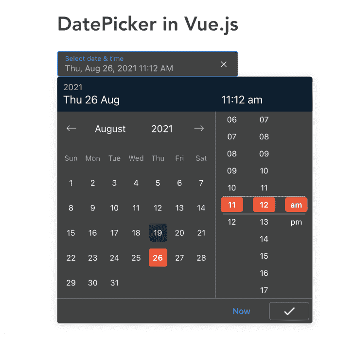

对于上面的截图，我用下面的自定义颜色:

```
<style scoped>
::v-deep .header-picker {
  background-color: #082032 !important;
}
::v-deep .time-picker-column-item.active .time-picker-column-item-effect,
::v-deep
  .datepicker-container
  .datepicker-days
  .datepicker-day.selected
  .datepicker-day-effect {
  background-color: #ff4c29 !important;
}
</style>

```

注意，作用域属性必须出现在`style`标签中，这样才能工作！

通过使用`VueCtkDateTimePicker`提供的`locale`道具，添加本地化支持非常简单。在这个代码示例中，我们将区域设置为俄罗斯。

```
  <VueCtkDateTimePicker v-model="date" dark locale="ru" />

```

总体而言，`CtkDatetimePicker`具有以下特点:

*   支持与`v-model`的双向数据绑定
*   本地化和国际化支持
*   SSR/Nuxt 支持
*   多范围日期选择
*   不支持 Vue 3，但是，这是一项正在进行中的工作
*   黑暗模式支持

虽然`CtkDatetimePicker`有很好的特性，但是文档并不总是有用的，因为它没有涵盖如何定制组件来满足您的应用程序需求。

### Datepicker 视图酒店

[Vue Hotel Datepicker 是 Vue.js](https://krystalcampioni.github.io/vue-hotel-datepicker/) 的一个响应日期范围选择器，它显示所选的夜数，并带有几个有用的选项，如自定义入住和退房规则、本地化支持等。

签到和签出规则包括`maxNights`、`minNights`和`disabledDaysOfWeek`道具。

`maxNights`属性接受一个数字，该数字以编程方式设置用户可以预订服务的最大天数。因此，当用户从日期选择器中选择最多五天时，它会禁用日历中的其他日期:

```
<HotelDatePicker :maxNights="5" />

```

下面是`maxHeight`道具设置为`5`的渲染图:

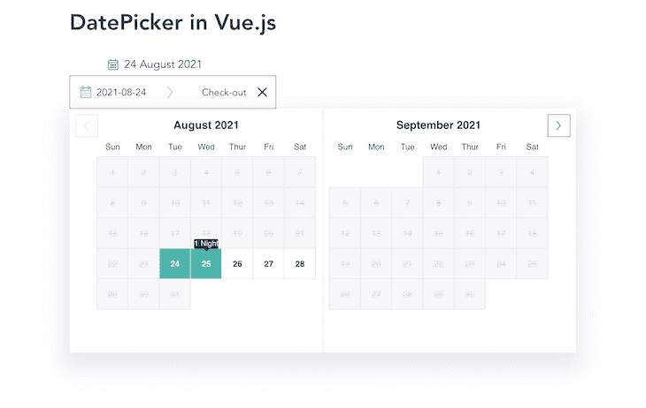

属性还接受一个数字来指定用户可以预订服务的最少天数。

在下面的演示中，`minNights`被设置为`8`，因此入住规则要求至少预订八晚。

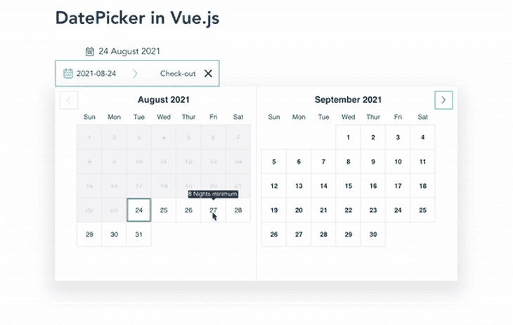

请注意上面的工具提示，通知我们最少可以预订多少晚。

属性接受一个字符串数组，其中包含您希望阻止用户预订您的服务的星期几。

这是禁用了星期二和星期六的日期选择器组件:

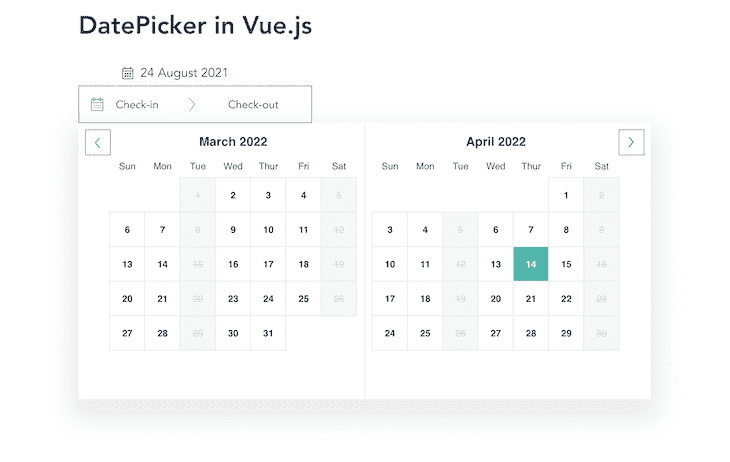

如果您正在构建一个酒店或某种形式的住宿预订应用程序，Vue Hotel Datepicker 非常适合，因为它解决了酒店 web 应用程序的大多数常见日期选择器需求。

该组件在移动和桌面屏幕上看起来都很棒，提供了很好的用户体验。

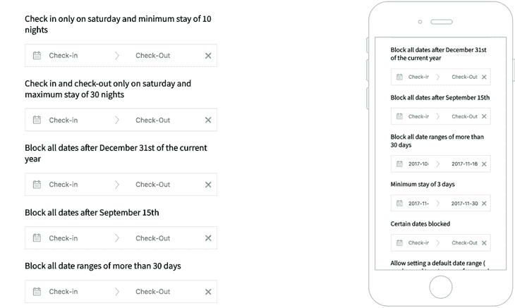

From `vue-hotel-datepicker` GitHub repository.

然而，这个组件的一个缺点是文档；他们没有涉及如何使用这个包，即使是从用户那里获得日期输入这样的基本情况。另一个大缺点是不支持与`v-model`的双向数据绑定。

总体而言，Vue Hotel Datepicker 具有以下特点:

*   本地化和国际化支持
*   这个包可以在 Nuxt 中运行，但是不支持服务器端渲染(SSR)
*   多范围日期选择

虽然没有对 Vue 3 的支持，但它目前正在开发中。它也不支持与`v-model`的双向数据绑定。

### `vue-airbnb-style-datepicker`

[`vue-airbnb-style-datepicker`组件](https://github.com/MikaelEdebro/vue-airbnb-style-datepicker)是 [airbnb/react-dates](https://github.com/airbnb/react-dates) 的 Vue 实现，具有类似的外观和功能。它的用户界面干净、现代，收集日期信息时考虑了用户体验。

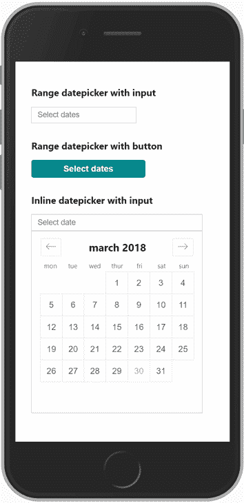

From `vue-airbnb-style-datepicker` GitHub repository.

虽然它有一个漂亮的外观和感觉，但我不建议在一个真正大的项目中使用它，因为它没有得到积极的维护。

总体而言，`vue-airbnb-style-datepicker`具有以下特点:

*   SSR/Nuxt 支持
*   多范围日期选择

它不支持与`v-model`、本地化和国际化或 Vue 3 的双向数据绑定。

## 关联的 Vue.js UI 库日期选择器

在这一节中，我们将看看日期选择器组件以及相关的 Vue UI 组件库，如 Vuetify、Quasar framework 和 Element UI。

### 元素`DatePicker`

[元素`DatePicker`组件](https://element.eleme.io/#/en-US/component/date-picker)打包在[元素 UI 组件库自身](https://blog.logrocket.com/top-10-vue-component-libraries-for-2020/#element-ui)中。这意味着要使用这个组件，您必须安装元素 UI。

它的属性使得以编程方式定制和设置日期和时间变得容易。与`DatePicker`并排的是`DateTimePicker`组件，它允许用户在一个选择器中选择日期和时间。

这很酷，因为它有一些常见的用例，比如防止用户从`DatePicker`组件中选择开始日期之前的结束日期。

`DatePicker`还支持双向数据，日期时间带`shortcuts`，日期时间范围一次输入，支持 Vue 3。

一般来说，使用元素 UI 的一个缺点是它的一些组件不是移动响应的，包括`DatePicker`组件。

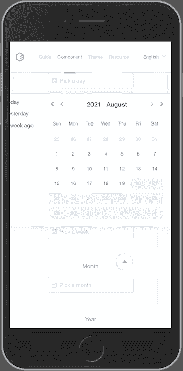

总的来说，元素`DatePicker`具有以下特点:

*   与`v-model`的双向数据绑定
*   本地化和国际化支持
*   SSR/Nuxt 支持
*   多范围日期选择
*   视图 3 支持

### 虚拟化的`v-date-picker`

`[v-date-picker](https://vuetifyjs.com/en/components/date-pickers/)`是 [Vuetify 附带的众多组件之一，这是一个 Vue UI 库，包含精美的手工材质组件](https://blog.logrocket.com/vue-component-frameworks-compared-is-vuetify-right-for-you/)。

`v-date-picker`组件支持国际化、动态定向、多日期选择、日期事件，以使用数组、对象、函数和`v-model`支持来指定事件。

下面是默认`v-date-picker`组件的截图:

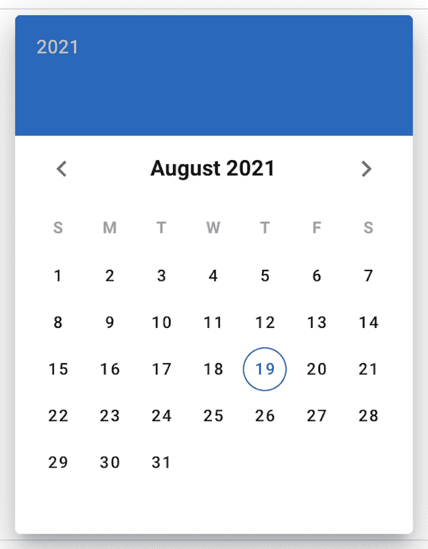

使用 Vuetify 的日期选择器的最大优势之一是社区支持和编写良好的文档。

但是，当您需要的只是一个日期选择器组件时，我不建议安装 Vuetify。这很大程度上是因为它的 18.2 MB 大小会影响你的应用程序的性能。但是，如果您将它用作整个 Vue/Nuxt 应用程序的 UI 库，那么日期选择器组件值得一看。

总体而言，`v-date-picker`具有以下特点:

*   与`v-model`的双向数据绑定
*   本地化和国际化支持
*   SSR/Nuxt 支持
*   多范围日期选择
*   视图 3 支持

### 类星体的`QDate`日期选择器

就像 Vuetify 和 Element UI 日期选择器组件一样， [Quasar `QDate`日期和时间选择器组件](https://quasar.dev/vue-components/date)与整个 [Quasar UI 组件框架本身](https://blog.logrocket.com/applications-with-quasar/)打包在一起。

它遵循材料设计模式，因此非常注重设计的一致性，以提供更好的用户体验。这意味着，只有在使用整个 UI 组件库的情况下，您才能获得使用该组件的全部好处。

`Qdate`组件与 Vuetify 的日期选择器实现非常相似；虽然两者都遵循材料设计指南，但它们可以自定义。然而，与 Vuetify 不同，用`QDate`获得黑暗模式支持非常简单。

在`Qdate`中，黑暗模式只是通过`dark`属性来启用，不像在 Vuetify 中，在那里[你必须配置你的主题](https://vuetifyjs.com/en/features/theme/)来启用`v-date-picker`组件中的黑暗模式。

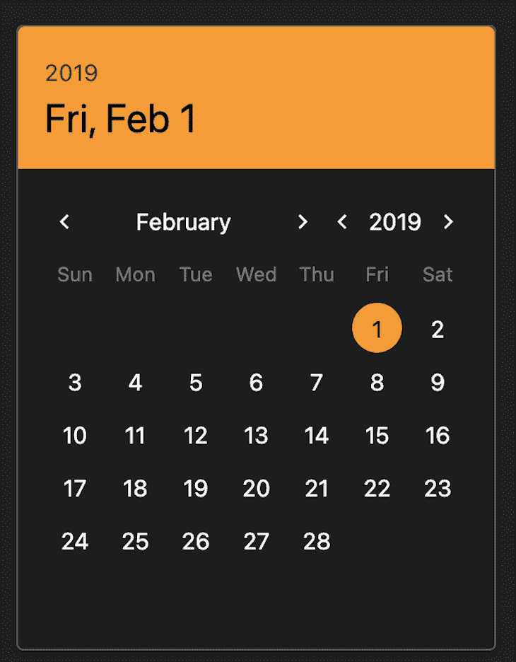

总体而言，`Qdate`具有以下特点:

*   与`v-model`的双向数据绑定
*   本地化和国际化支持
*   SSR/Nuxt 支持
*   多范围日期选择
*   Vue 3 支持

## 结论

我们已经介绍了 Vue 生态系统中相当多的日期选择器组件。在为您的下一个 Vue/Nuxt 应用程序决定日期选择器组件时，请考虑项目的大小、从您的用户收集的日期数据的格式、用户体验、用户区域设置和 SSR 支持。

在考虑这些方面时，你可以做出明智的决定。

我希望这篇文章对你有用。请随意对您在 Vue 项目中使用的任何优秀的日期选择器组件发表评论。你可以在 GitHub 上找到我对所有日期选择器库[的实现。](https://github.com/ejirocodes/vue-datepicker-demo)

你也可以在 [Twitter](https://twitter.com/ejirocodes) 和 [LinkedIn](https://www.linkedin.com/in/ejiro-asiuwhu/) 上找到我。感谢您的阅读！

## 像用户一样体验您的 Vue 应用

调试 Vue.js 应用程序可能会很困难，尤其是当用户会话期间有几十个(如果不是几百个)突变时。如果您对监视和跟踪生产中所有用户的 Vue 突变感兴趣，

[try LogRocket](https://lp.logrocket.com/blg/vue-signup)

.

[](https://lp.logrocket.com/blg/vue-signup)[https://logrocket.com/signup/](https://lp.logrocket.com/blg/vue-signup)

LogRocket 就像是网络和移动应用程序的 DVR，记录你的 Vue 应用程序中发生的一切，包括网络请求、JavaScript 错误、性能问题等等。您可以汇总并报告问题发生时应用程序的状态，而不是猜测问题发生的原因。

LogRocket Vuex 插件将 Vuex 突变记录到 LogRocket 控制台，为您提供导致错误的环境，以及出现问题时应用程序的状态。

现代化您调试 Vue 应用的方式- [开始免费监控](https://lp.logrocket.com/blg/vue-signup)。