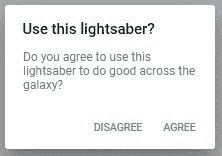
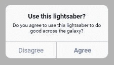
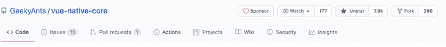
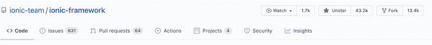
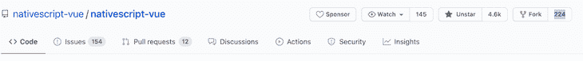
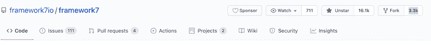
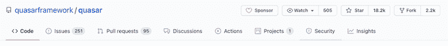
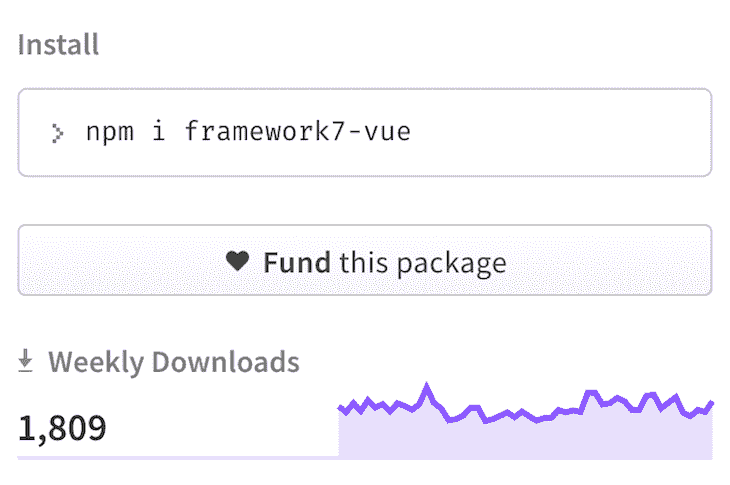
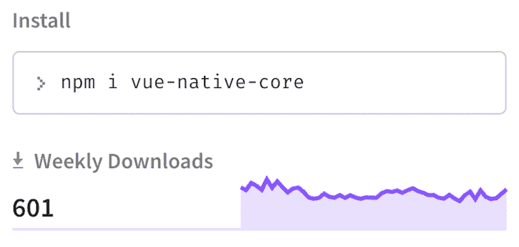
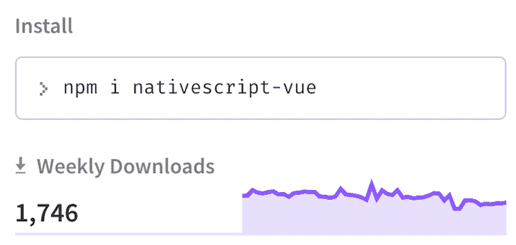

# 比较 Vue.js 移动应用程序开发框架- LogRocket 博客

> 原文：<https://blog.logrocket.com/comparing-vue-js-mobile-app-development-frameworks/>

用 Vue.js 构建移动应用并非不可能。事实上，您可以使用 Vue.js 构建外观和感觉都像原生移动应用的生产就绪型应用。

在本教程中，我们将向您展示如何使用 [Vue.js](https://blog.logrocket.com/vue-js-simplified-components-props-and-slots/) 开发移动应用程序。我们将讨论使用 Vue.js 构建移动应用的优点，讨论如何为您的移动项目选择正确的 [Vue.js 框架](https://blog.logrocket.com/comparison-of-vue-js-build-tools/)，并评估整体开发人员体验。

以下是我们将要介绍的内容:

## 为什么要用 Vue.js 来构建移动 app？

以下是您应该考虑在下一个移动应用程序开发项目中使用 Vue.js 的一些原因。

### 跨平台

[跨平台应用开发](https://blog.logrocket.com/comparing-developer-experience-for-cross-platform-frameworks/)就是构建一个可以在各种 Android 和 iOS 操作系统上运行的单一应用，而不是为每个平台开发不同的应用版本。这将节省你学习一门编程语言的时间，比如 Android 版的 Java 或者 iOS 版的[Swift](https://blog.logrocket.com/understanding-the-swiftui-grid-layout/)。你只需要专注于你已经拥有的技能(Vue.js)。

### 简单易学

Vue.js 使您能够使用您已经熟悉的技能，即 HTML、CSS 和 JavaScript，通过单个代码库来构建高质量、生产就绪的 Android 和 iOS 应用程序。

### 出色的文档

Vue.js 拥有一些前端开发人员社区中最好的文档。浏览这些文档感觉就像在和你自己的私人老师对话。出色的文档当然会提高你构建移动应用的效率和生产力。

## 用于移动应用开发的 Vue.js 框架

以下是使用 Vue.js 构建移动应用的顶级框架，排名不分先后:

让我们仔细看看每个 Vue.js 移动框架。

### 离子 Vue

[Ionic](https://ionicframework.com/docs) 是一个开源的移动 UI 工具包，用于使用 web 技术(HTML、CSS 和 JavaScript)构建高质量、跨平台的本地 web 应用体验和桌面应用，并集成了流行的框架，如 [Angular](https://ionicframework.com/docs/angular/overview) 、 [React](https://ionicframework.com/react) 和 [Vue](https://ionicframework.com/docs/vue/overview) 。

[Ionic 是真正的框架](https://blog.logrocket.com/react-native-vs-ionic/)[–](https://blog.logrocket.com/react-native-vs-ionic/)[不可知的](https://blog.logrocket.com/react-native-vs-ionic/)，因为它允许你使用你最熟悉的 JavaScript 框架。这意味着你可以决定使用 React、Vue、Angular、Vanilla JavaScript，甚至是[模板](https://stenciljs.com/)。事实上，可以说“人人爱离子”运动现在是成功的。有了 Ionic，你可以在一个代码库中构建 web、移动(Android 和 iOS)、PWA 和[桌面](https://ionicframework.com/docs/deployment/desktop-app)应用。

您应该考虑使用 [Ionic Vue](https://ionicframework.com/docs/vue/overview) 的一个主要原因是，它有大量预制的 UI 组件，可以轻松快速地构建原生 iOS、原生 Android 和 web 应用程序。

Ionic 组件根据运行应用程序的平台而呈现不同的效果。例如，当您的应用程序在 Android 设备上运行时，Material 设计模式用于呈现 UI 组件。也就是说，用 Vue 构建 web 应用和用原生 Android 和 iOS 应用之间的转变并不惊人。

让我们来看看 Ionic Vue 应用程序中的 Ionic alert 组件在 Android 和 iOS 平台上的不同呈现方式:



ion-alert component on an Android device



ion-alert component on an iOS device

继 2019 年初发布 Ionic Vue beta 之后，Ionic Vue 于 2020 年 10 月正式上线。这个测试版是为 Vue 2 设计的，而当前的稳定版是为支持 Vue 3 而设计的。它是基于类型脚本的，尽管您可以更改项目的设置来使用 JavaScript。

由于 Vue.js 是一个 web 框架，它本身并不支持移动应用程序开发。那么，我们如何访问本机移动功能，如摄像头和地理定位？Ionic 有一个官方的本机运行时，称为[电容器](https://capacitorjs.com/)。使用 Capacitor 的插件，您可以访问运行应用程序的设备的原生 API，并使用 Ionic Vue 构建真正的原生移动应用程序。

以下是如何使用 Ionic Vue 应用程序中的[电容地理定位插件](https://capacitorjs.com/docs/v3/apis/geolocation)从用户的设备获取用户的位置:

```
import { Plugins } from '@capacitor/core';

async getLocation() {
    const { Geolocation } = Plugins;

    const coordinates = await Geolocation.getCurrentPosition();
    this.coords.lat = coordinates.coords.latitude;
    this.coords.lng = coordinates.coords.longitude;
  }

```

虽然 Ionic Vue 是新的，但如果你对 Vue 3 有基本的了解，并没有太多的学习曲线。如果你已经熟悉 Vue，用 Ionic Vue 构建应该很容易。

### 框架 7 Vue

Framework7 是一个免费的开源框架，用于开发具有本地外观的移动、桌面和网络应用。它也是一个不可或缺的原型工具。

与 Ionic 类似，Framework7 允许您使用 Vue.js、React、Svelte 或 vanilla JavaScript 构建移动应用程序。

Framework7 Vue 提供了令人惊叹的 UI 套件，外观和感觉都很自然。为了充分利用 Framework7 Vue，我建议尽可能使用它的组件来构建移动应用程序的用户界面。例如，避免使用普通的 HTML 按钮元素来创建按钮；相反，使用`f7-button`。这将使您的移动应用程序看起来和感觉起来都是本地的，并且在编译到 Android 和 iOS 时可以正常工作。

开始使用 Framework7 Vue 最简单的方法是使用[这个模板](https://github.com/caiobiodere/cordova-template-framework7-vue-webpack)，这样你所要关注的就是你的应用程序逻辑；已经安装并配置了 webpack、Cordova、Framework7 图标、Material Design 图标和 Vue.js。该模板还带有路由系统以及用于状态管理的[Vuex](https://blog.logrocket.com/using-vuex-4-with-vue-3/)。

Framework7 不使用 Vue 路由器没什么价值；[路由和导航](https://framework7.io/vue/navigation-router.html)使用`f7router` (Framework7 路由器)完成。API 和官方的 Vue 路由器很像。

官方的[framework 7 Vue](https://framework7.io/vue/)文档相当不错，尽管它缺少一些关键信息，这可能会非常令人沮丧。

为了访问移动设备的原生 API，Framework7 Vue 使用了 [Apache Cordova](https://cordova.apache.org/) ，这是一个运行时，它为使用 Framework7 Vue 构建的 web 应用程序提供了一个包装器，用于原生 Android 和 iOS 应用程序。这就是 Ionic Vue 团队真正做对的地方:有了[电容器](https://capacitorjs.com/)作为它的官方运行时，你不需要担心 Cordova 过时或不支持关键功能。

### Vue 本地

Vue Native 是一个 JavaScript 框架，旨在帮助你用 JavaScript 构建跨平台的移动应用。Vue Native 是围绕 [React Native](https://reactnative.dev/) 的一个包装器，使您能够使用 Vue.js 构建移动应用程序。使用 Vue Native，您可以使用 React Native 做任何事情，并且您的代码被编译成 React Native。

开始使用 Vue Native 最简单的方法是使用 [Vue Native CLI](https://github.com/GeekyAnts/vue-native-cli) 。CLI 使用 [Expo CLI](https://docs.expo.io/workflow/expo-cli/) 或 [React Native CLI](https://github.com/react-native-community/cli) 生成一个简单的单页应用程序。这意味着您必须安装 Expo 或 React Native CLI 才能使用 Vue Native CLI。

要全局安装 Expo CLI，请在您的终端中运行以下命令:

```
npm install -g expo-cli

```

或者，您可以通过安装 CLI 生成带有基本 React Native 的项目:

```
npm install -g react-native-cli

```

下一步是全局安装 Vue 本机 CLI:

```
npm install -g vue-native-cli

```

对于 Expo 用户，运行以下命令来生成一个带有 Vue Native 的项目:

```
vue-native init <projectName>

```

对于 React Native，使用以下命令:

```
vue-native init <projectName> --no-expo

```

为了访问移动设备 API，Vue Native 使用 Expo 和 React Native 社区中的包。这是考虑在你的下一个项目中使用 Vue Native 的一个很好的理由，因为你已经被 React Native 社区覆盖了。此外，在 Vue 本地项目中，您可以利用 [NativeBase](https://github.com/GeekyAnts/NativeBase) React 本地组件来构建您的移动应用程序的 UI。

注意整个 Vue 原生生态系统如何依赖 React 原生和 Expo 生态系统？Vue Native 的成长与 React Native 紧密相连，这可能是负面的，也可能是正面的，取决于你的观点。依赖 React Native 限制了 Expo 团队创新的灵活性，但这也意味着 Vue Native 的增长与 React Native 息息相关，React Native 是迄今为止用 JavaScript 开发移动应用程序最流行、最活跃的项目。此外，Vue Native 允许您使用 React 本地库。

与 Framework7 Vue 和 Ionic Vue 相比，使用 Vue Native 的一个缺点是您[不能在浏览器](https://github.com/GeekyAnts/vue-native-core/issues/268)中运行 Vue Native 项目。你必须安装 [Android Studio](https://developer.android.com/studio) 或 [Xcode](https://developer.apple.com/xcode/) 才能预览你正在构建的东西。

另一个缺点是，与 Framework7 Vue 和 Ionic Vue 不同，Vue 原生组件不能用于 web 开发，因为它是一个移动框架。

### NativeScript 视图

[NativeScript](https://nativescript.org/) 是一个开源的 JavaScript 框架，它以帮助你用 JavaScript 构建真正的原生 Android 和 iOS 应用而自豪。NativeScript 的美妙之处在于，您可以使用 Angular、Vue.js 或普通 JavaScript 构建原生移动应用程序。

[NativeScript Vue](https://nativescript-vue.org/) 是一个将 [Vue](https://vuejs.org/) 和 [NativeScript](https://www.nativescript.org/) 结合在一个包中的框架，允许你使用 Vue 构建跨平台的 iOS 和 Android 应用。

与 Ionic Vue 和 Framework7 Vue 中允许使用常规 HTML 元素不同，在 NativeScript Vue 中，`<div>`等元素并不存在。为了构建你的应用程序的用户界面，你必须使用 [NativeScript UI 组件](https://docs.nativescript.org/ui/overview)。

NativeScript Playground 是一款由 NativeScript 开发者开发的工具，它可以让你修补并了解 NativeScript 是如何工作的。通过选择 Vue 模板，您可以使用这个 playground 轻松构建一个 NativeScript Vue 应用程序。

### 类星体框架

[Quasar Framework](https://quasar.dev/) 是一个 UI 库，用于在 Vue.js 应用中构建跨平台的用户界面。它使您能够为 web、移动和桌面应用程序构建组件。

当[用 Quasar](https://quasar.dev/quasar-cli/developing-mobile-apps) 开发手机应用时，你可以选择使用[电容](https://capacitorjs.com/)或者 [Cordova](https://cordova.apache.org/) 。这两个工具都允许您通过 WebView 将 web 应用程序作为本地移动应用程序运行。

Quasar 与 Ionic 的相似之处在于，两种 UI 框架都带有预制的漂亮、周到的 UI 组件，可以帮助您快速构建移动应用程序的用户界面。此外，Quasar 和 Ionic 都可以让您灵活地使用 Cordova 或 Capacitor 来访问原生设备 API，并为 Android 和 iOS 捆绑您的应用程序。

有一个主要的区别:Ionic 团队让用 Ionic Vue 开始构建移动应用变得非常简单。自举你的 Ionic Vue 应用就像在公园里散步，因为大部分配置已经完成。另一方面，当您使用 Quasar 时，您必须安装 Cordova 和 Capacitor，设置您的配置，并手动安装 Quasar 框架本身。

使用 Quasar 的一个主要好处是社区支持。在撰写本文时，在本指南提到的所有工具中，只有 Quasar 和 Ionic Vue 支持 Vue 3。这意味着您可以构建 Vue 3 的所有花哨功能。

一个缺点是，与 Ionic Vue、Framework7 Vue、NativeScript 和 Vue Native 不同，它们根据平台不同呈现组件，Quasar 没有内置的支持。对于移动开发用户体验来说，这一点尤为重要。类星体框架使用材料设计风格的组成部分。虽然 Android 用户熟悉这种风格，但例如，一个材料设计警告组件在 iOS 设备上看起来并不合适。

Quasar 因其种类繁多的预建 UI 组件而脱颖而出。这使得开发者体验变得轻而易举。您所要关注的是构建您的应用程序逻辑和定制您的组件。

* * *

### 更多来自 LogRocket 的精彩文章:

* * *

## 选择正确的 Vue.js 移动框架

现在，您已经了解了使用 Vue.js 构建移动应用程序的顶级框架，让我们考虑一些在为您的项目选择框架时要考虑的关键因素。这一点非常重要，尤其是在为生产而构建时，因为您希望避免在花费大量时间编写了数千行代码之后，选择一个可能会给项目带来不可预见的限制的框架。

### 社区支持

社区支持是选择框架时要考虑的最重要的因素之一。这影响了找到修复代码中错误的答案的容易程度，进而影响了您的生产率。

让我们看看来自 GitHub 的指标，看看每个框架的开发者生态系统有多活跃。

截至发稿时，Vue Native 已有 [15 位贡献者](https://github.com/GeekyAnts/vue-native-core/graphs/contributors)、[八个版本](https://github.com/GeekyAnts/vue-native-core/releases)、 [7.9k 明星](https://github.com/GeekyAnts/vue-native-core/stargazers)并已在 GitHub 上被 [291 位用户](https://github.com/GeekyAnts/vue-native-core/network/members)分叉。



Vue Native GitHub stats

Ionic framework 有 [401 贡献者](https://github.com/ionic-team/ionic-framework/graphs/contributors)， [284 在 npm 上发布](https://www.npmjs.com/package/@ionic/vue?activeTab=versions)， [43.2k 明星](https://github.com/ionic-team/ionic-framework/stargazers)并在 GitHub 上被 [13.4k 用户](https://github.com/ionic-team/ionic-framework/network/members)分叉。



Ionic GitHub stats

NativeScript Vue 有 [43 个投稿人](https://github.com/nativescript-vue/nativescript-vue/graphs/contributors)， [95 发行](https://github.com/nativescript-vue/nativescript-vue/releases)， [4.6k 明星](https://github.com/nativescript-vue/nativescript-vue/stargazers)，在 GitHub 上已经被 [224 个用户](https://github.com/nativescript-vue/nativescript-vue/network/members)分叉。



NativeScript Vue GitHub stats

Framework7 在 npm 上有 [134 贡献者](https://github.com/framework7io/framework7/graphs/contributors)， [222 版本](https://www.npmjs.com/package/framework7-vue?activeTab=versions)， [16.1k 明星](https://github.com/framework7io/framework7/stargazers)，在 GitHub 上被 [3.3k](https://github.com/framework7io/framework7/network/members) 用户分叉。



Framework7 GitHub stats

类星体框架有 [412 贡献者](https://github.com/quasarframework/quasar/graphs/contributors)， [436 在 npm 上发布](https://github.com/quasarframework/quasar/releases)， [18.2k 星](https://github.com/quasarframework/quasar/stargazers)，在 GitHub 上被 [2.2k](https://github.com/quasarframework/quasar/network/members) 用户分叉。



另一个要考虑的因素是这些框架相对于采用率已经存在了多长时间。虽然 Ionic 自 AngularJS 时代(大约 2013 年)就已经存在，但 Ionic Vue 的稳定版本于 2020 年 10 月发布，并享有相当快的采用率。截至本文撰写之时，它在 npm 上的周下载量已经超过了[6651 次](https://www.npmjs.com/package/@ionic/vue)。


Ionic Vue weekly download on npm

[Framework7 Vue](https://www.npmjs.com/package/framework7-vue) 发布于 2016 年。与 Ionic Vue 相比，采用率相当低:



Framework7 Vue weekly download on npm

因此，社区相对较小。你可能会发现自己花了很多时间去寻找错误的答案。其实在[论坛](https://forum.framework7.io/)的问题回复，大部分都是创作者本人的。

Vue 原生的第一个版本是[发布](https://github.com/GeekyAnts/vue-native-core/releases) [o](https://github.com/GeekyAnts/vue-native-core/releases) [n Aug](https://github.com/GeekyAnts/vue-native-core/releases) [。](https://github.com/GeekyAnts/vue-native-core/releases)[2018 年 1 月](https://github.com/GeekyAnts/vue-native-core/releases)。同样，它的 [601 周下载量](https://www.npmjs.com/package/vue-native-core)与 Ionic Vue 相比相形见绌:



Vue Native weekly download on npm

NativeScript Vue 的[首版于 2017 年 7 月 9 日发布。虽然在周下载量方面不如 Ionic Vue 受欢迎，但在撰写本文时，它的 1746 次下载量也不容小觑:](https://github.com/nativescript-vue/nativescript-vue/releases?after=v0.1.7)



NativeScript Vue weekly download on npm

这显示了开发人员对框架的兴趣，反映了开源社区在改进和修复 bug 方面的活跃性。

Quasar 框架的第一个[版本](https://github.com/quasarframework/quasar/releases?after=v0.8.2)于 2016 年 8 月 14 日发布，在 npm 上有 3741 次每周下载。尽管大多数下载是基于网络的应用程序，这个数字仍然证明了 Quasar 有一个活跃的开发者社区，他们对使用 Vue.js 框架感兴趣。

如果你没有注意到，如果你纯粹是从数字上看，Ionic Vue 是 Vue.js 移动应用开发最流行的框架。

这是构建移动应用程序时需要考虑的一个重要因素。比方说，你正在开发一款通过指纹扫描进行生物认证的手机应用。您需要寻找一个能够提供该工具的框架。

在 Framework7 Vue、Quasar Framework 和 Ionic Vue 应用程序中，Cordova 可用于访问设备的本机 API。Ionic Vue 和 Quasar 还允许您使用电容器来实现原生功能。这意味着您可以使用 Cordova 和电容器生态系统中的原生工具。

Vue Native 在这里非常有价值，因为你可以使用 Expo 和 React Native 工具来访问[设备 API](https://vue-native.io/docs/device-apis.html) 。

[NativeScript Vue](https://nativescript-vue.org/) 允许你使用 [NativeScript 插件](https://nativescript.org/native-api-access/)访问本地设备 API。这是一个很大的优势，特别是因为 NativeScript 社区相当大而且非常活跃。2021 年 2 月， [NativeScript 宣布支持电容](https://twitter.com/NativeScript/status/1362197933261692932)。

### UI 组件

Ionic Vue 有 100 多套[漂亮的](https://ionicframework.com/vue#components)[优雅的 UI 组件](https://ionicframework.com/vue#components)。这些组件很容易使用；如果你对 Vue 3 有足够的了解，使用 Ionic Vue 中的组件将是轻而易举的事情。

Framework7 Vue 有大量预制的 UI 组件，最棒的是你仍然可以在你的 Framework7 Vue 移动应用中使用[核心组件](https://framework7.io/docs/)。尽管实现可能不同，但核心组件通常在 Vue.js 应用程序中无缝工作。

NativeScript Vue 有一些 UI 组件。虽然它提供的组件没有 Ionic Vue 和 Framework 7 Vue 多，但它们很优雅，并根据设备平台(Android、iOS 等)呈现不同的效果。).

Quasar Framework 有大量预制的 Vue.js 组件，可用于构建外观优雅的移动应用程序。组件是有用的，但与其他基于平台呈现组件设计的框架不同，Quasar UI 组件在 Android 和 iOS 应用程序中都具有材质设计外观。

### 开发者体验

现在来说说开发者体验。我们会考虑诸如热重装、在网上运行应用的能力等因素。

我们 Vue.js 开发人员通常在浏览器中运行我们的应用程序，并主要通过浏览器控制台进行调试。在 Framework7 Vue、Ionic Vue 或 Quasar 项目中，您可以在 web 浏览器上运行您的移动应用程序，并且仍然可以获得特定于平台的风格。Ionic 还有一个名为 [Ionic Lab](https://ionicframework.com/blog/ionic-lab/) 的功能，可以让你查看你的应用程序，看看它在 Android、iOS 和 Windows 上是什么样子。但是 Vue Native 不支持这个特性。

NativeScript 有一个[游乐场](https://play.nativescript.org/)，你可以用它来开发和预览你的应用。通过在[应用商店](https://apps.apple.com/us/app/nativescript-playground/id1263543946?ls=1)或 [Google Play](https://play.google.com/store/apps/details?id=org.nativescript.play) 下载手机应用，你可以通过扫描二维码在你的设备上预览你的应用。

### 证明文件

Ionic Vue 的官方文档太棒了。它们包括您的组件在 Android 和 iOS 上的预览，您可以构建您的应用程序，而无需在 Ionic 和 Capacitor 文档之外寻找资源。

[框架 7 Vue 文档](https://framework7.io/vue/introduction.html)大部分都很棒，但是不完整。例如，如何用`f7-router`编程导航在官方文档中没有。

NativeScript Vue 有相当不错的文档。虽然没有 Ionic Vue 那么精致，但还是很全面的。

Vue 原生文档不如其他的有用。网上也没有很多关于 Vue Native 的教程或文章。

Quasar 框架的[文档清晰易用。它包括你的组件的预览，你可以构建你的移动应用程序的用户界面，而不需要在 Quasar 文档之外寻找资源。](https://quasar.dev/start/pick-quasar-flavour)

### 学习曲线

Ionic Vue 使用 [Vue 3](https://blog.logrocket.com/new-features-in-vue-3-and-how-to-use-them-2/) ，这意味着如果你不习惯 Vue 3 中的工作方式，你将不得不采取额外的步骤来学习它。除此之外，大多数事情都像在 Vue web 应用程序中一样正常工作。

NativeScript Vue 和 Vue Native 将需要一点学习曲线，因为它的工作方式与传统的 Vue.js 应用程序非常不同。例如，下面是一个带有点击(单击)事件的 NativeScript 按钮:

```
<Button text="Button" @tap="onButtonTap" />

```

在常规的 Vue 应用程序中，会使用`@click`事件。

下面是 Vue 本机应用程序中的一个点击事件:

```
 <button
        :on-press="onPressLearnMore"
        title="Learn More"
    />

```

在 Framework7 Vue 中，事情非常标准，就像在普通的 Vue.js 应用程序中一样。在 Vue.js 应用中使用 Framework7 组件就像使用 [Bootstrap](https://getbootstrap.com/) 组件一样。这很简单。

在 Quasar Framework 中，事情非常标准，就像在普通的 Vue.js 应用程序中一样。大多数时候，您可能会从官方文档中复制代码，并根据自己的需要进行修改。

## 结论

选择一个 Vue.js 框架来构建移动应用取决于很多因素，包括学习曲线、应用需求、框架的生态系统、性能和受欢迎程度。

在本教程中，我们介绍了使用 Vue.js 构建移动应用程序的顶级框架，并比较了每种框架的优缺点。归根结底，每个 Vue.js 移动应用程序开发框架都有自己的优点。当决定在您的下一个移动项目中使用哪个框架时，请检查我们讨论过的指标，并根据您的应用程序的独特目标和要求进行权衡。

## 像用户一样体验您的 Vue 应用

调试 Vue.js 应用程序可能会很困难，尤其是当用户会话期间有几十个(如果不是几百个)突变时。如果您对监视和跟踪生产中所有用户的 Vue 突变感兴趣，

[try LogRocket](https://lp.logrocket.com/blg/vue-signup)

.

[](https://lp.logrocket.com/blg/vue-signup)[https://logrocket.com/signup/](https://lp.logrocket.com/blg/vue-signup)

LogRocket 就像是网络和移动应用程序的 DVR，记录你的 Vue 应用程序中发生的一切，包括网络请求、JavaScript 错误、性能问题等等。您可以汇总并报告问题发生时应用程序的状态，而不是猜测问题发生的原因。

LogRocket Vuex 插件将 Vuex 突变记录到 LogRocket 控制台，为您提供导致错误的环境，以及出现问题时应用程序的状态。

现代化您调试 Vue 应用的方式- [开始免费监控](https://lp.logrocket.com/blg/vue-signup)。