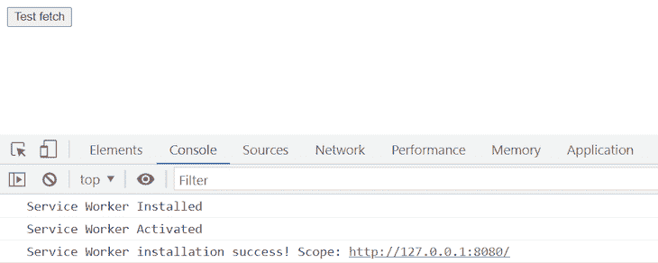

# Wayne.js 与 Express.js 在服务人员路由方面的比较

> 原文：<https://blog.logrocket.com/comparing-wayne-js-express-js-service-worker-routing/>

在本文中，我们将描述如何将一个简单的 REST API 从 Express.js 导出到 Wayne.js，我们不会仅仅改变一个框架；我们将从云范式转换到边缘范式。 [Express.js](https://blog.logrocket.com/express-js-5-migration-guide/) 是一个简单的 web 服务器，旨在容纳一个 [REST API](https://blog.logrocket.com/10-best-practices-for-rest-api-design/) ，在较小的规模上，它再现了在云环境中的服务器上执行 REST API 的工作负载的概念。 [Wayne.js](https://github.com/jcubic/wayne) 是一个小工具包，允许你在浏览器中组装 REST API。

令人惊讶的是，这些天你可以看到不同的设计范例在两个不同的方向推动精化。有可能理解这两种截然不同的观点为何仍然有意义。我指的是[边缘计算](https://blog.logrocket.com/demystifying-edge-functions/)和[云计算](https://en.wikipedia.org/wiki/Cloud_computing)的概念，它们是决定系统的大部分计算在哪里进行的完全不同的方法。在云计算中，计算是在云中进行的。在边缘计算中，工作负载在边缘设备上执行，如运行在用户 PC、手机等设备上的浏览器。

为了更好地理解这些机制，我准备了一个包含三个目录的 [GitHub 库](https://github.com/rosdec/wayne)。首先，`basic`目录包含了服务工作者的基本实现，这将让我们探索它提供的简单机制。第二个目录是`simple-express`，这是一个使用 Express.js 和 Node.js 实现的简单 REST API。它将是我们的参考实现，我将向您展示如何将其迁移到 Wayne.js。第三个目录是`Wayne`目录，其中包含 REST API 的 Wayne.js 版本。

*向前跳转:*

## Wayne.js 是什么？

Wayne.js 被设计成在浏览器中运行的服务工作者中实现 HTTP 服务器。服务人员在浏览器中托管简单的代理机制，以控制浏览器和云之间的流量，尤其是在没有或无法访问互联网的情况下。Wayne.js 利用[服务工作者](https://blog.logrocket.com/every-website-deserves-a-service-worker/)的概念来托管比简单的代理机制更具表现力的东西。

Wayne.js 在服务工作器中使用 Express.js 的精确语义来实现一个可以在浏览器中运行的 REST API。使用服务人员很简单，它由安装服务人员的代码和它实现的逻辑组成。安装 Wayne.js 的代码非常简单。

### 安装 Wayne.js

首先，检查`navigator`对象中`serviceWorker`容器的可用性。这是必要的，因为它可能无法在较旧的浏览器上或在私人浏览模式下使用:

```
if ('serviceWorker' in navigator) {
 navigator.serviceWorker.register('/sw.js').then(function (registration) { 
  console.log('Service Worker installation success! Scope:',
   registration.scope);
 }).catch(function (error) {
  console.log('Service Worker installation failed:', error);
 });
}

```

`serviceWorker`引入了`register`方法来告诉浏览器为服务工作者的逻辑实现哪个 JavaScript 文件。这里有一个显示`sw.js`文件的例子:

```
self.addEventListener('install', event => {
    console.log("Service Worker Installed");
});

self.addEventListener('activate', event => {
    console.log("Service Worker Activated");
});

self.addEventListener('fetch', event => {
    console.log("Requested URL: " + event.request.url);
});

```

如您所见，它将打印一条关于服务人员生命周期中每个事件的消息。第一个事件是`install`，做一个你的服务人员需要的一次性初始化是有帮助的。

### 激活 Wayne.js

第二件事在服务人员的一生中只会发生一次。这与`install`不同，因为`activate`仅在第一次安装服务工作程序时触发，而不是每次安装新版本的服务工作程序时触发。这是因为先前版本的服务工作程序已经在运行。

要强制激活服务人员的新版本，您可以要求您的浏览器在每个页面上安装并激活，重新加载以始终运行最新版本。例如，Google Chrome 中的“重新加载时更新”复选框位于开发人员窗口的“应用程序”选项卡中。对于开发服务人员来说，一个很好的经验法则是始终检查您运行的是不是最新版本，甚至卸载并重新安装它，以确保万无一失。当事情不顺利的时候，这将省去很多麻烦。

为了检查一切是否正常，使用您选择的 web 服务器(我通常使用 [http-server](https://www.npmjs.com/package/http-server) )提供页面，您将在控制台窗口中看到正确触发的事件:



## 从 Express.js 到 Wayne.js 的 REST API

在资源库的目录`simple-express`中，您会发现一个简单的 REST API。这不是非常令人兴奋，但它不仅仅是一句“你好，世界！”显示 API 基础的 API。它有两个`GET`服务:一个获取`query`字符串的参数，另一个没有参数。此外，API 的主体中有一个接受参数的`POST`服务。

这是一个 Express.js 项目，所以您将能够用一个简单的执行`simple-express.js`的`node.`来执行它。这将在`index.html`文件中分配 API 服务并服务于 web 应用程序 UI。通过摆弄 web 应用程序，您将能够理解您可以做什么——只需向数组中添加元素并列出它们。

### 搬迁至 Wayne.js

至此，你应该明白 Wayne.js 的神奇之处在哪里了。Wayne.js 是一个特殊的服务工作者，它通过将通常位于服务器端点的`fetch`操作重定向到服务工作者文件中实现的方法来模仿 REST API 的结构。

如果你把`simple-express/simple-express.js`和`wayne/wayne-service-worker.js`放在一起看，你会发现它们几乎是一样的。别担心。我们将很快讨论它们的细微差别，但是这里有一个范式的转变。

## 比较 Wayne.js 和 Express.js

Express.js 版本在服务器上执行，而 Wayne.js 版本驻留在浏览器中。澄清一下，Wayne.js API 版本是由`http-server`执行的。这是从服务器的角度来看的，这表明 API 和前端是服务于浏览器的静态文件。整个 API 逻辑只在浏览器中执行。这可以通过检查 HTTP 服务器日志来轻松验证:


一旦`index.html`和`wayne-service-worker.js`被提供给浏览器，与前端的每一次后续交互都将发生在浏览器中，不会在`http-server`上产生日志。这显示了这种方法的真正潜力，因为您甚至可以关闭服务器。因此，交互和 API 调用永远不会离开浏览器，使您的应用程序即使在脱机模式下也能运行:


Wayne.js 和 Express.js 对于服务工作者路由的区别之一在于如何处理`query`字符串参数。在 Express.js(右)中，参数用冒号指定，而在 Wayne.js 中，每个参数用花括号定义(右边的第 19 行和左边的第 11 行)。

另一个区别是请求`body`是立即可用的，而在 Wayne.js 中，它是通过一个承诺来访问的(左边的第 32 行和右边的第 24 行)。在这个机制上，[文档](https://github.com/jcubic/wayne#api-reference)更深入一点。它为`body`提供了不同的访问器，以不同的格式返回它:

*   `arrayBuffer()`:对于一个 [`ArrayBuffer`](https://developer.mozilla.org/en-US/docs/Web/JavaScript/Reference/Global_Objects/ArrayBuffer) 表示
*   `blob()`:获取请求体的非结构化 [`Blob`](https://developer.mozilla.org/en-US/docs/Web/API/Blob) 表示
*   `formData()`:用于`[`FormData`](https://developer.mozilla.org/en-US/docs/Web/API/FormData)` 处理结构化的基于表单的请求
*   `json()`:让你把身体当作 [`JSON`](https://developer.mozilla.org/en-US/docs/Web/API/Request/json)
*   请求体最直接的表示，任何进一步的解析都留给你

正如您所看到的，通过这些方法，您将能够处理您期望在 REST API 中处理的所有标准格式。Wayne 提供的附加功能是`redirect()`操作，它允许您将 API 调用重定向到其他端点。它的工作原理与 Express 相同，但是考虑到浏览器内 API 的不同架构，您可以使用这种机制来做一些聪明的事情。

假设您的本地 API 可以在浏览器离线时提供近似的结果，并可以在浏览器再次在线时重定向到同一 API 的更强大版本，这可以通过重定向调用来实现。

这是实现[渐进式 Web 应用](https://blog.logrocket.com/why-you-should-turn-your-app-into-a-pwa/) (PWA)的正确方式。这些网络应用将在有限或没有互联网接入的情况下继续工作，并在连接重新建立时无缝工作。

如果您一直关注我，那么通过查看代码，应该可以清楚地看到，为 Express.js 或 Wayne.js 编写 REST API 之间没有(显著的)区别，主要区别在于 Wayne.js 允许您直接在浏览器中迁移 REST API，为您的 web 应用程序/API 组合提供完全不同的架构支持。这意味着更多的代码在浏览器中执行，将计算推到边缘，并且在极端情况下可以提供更多的灵活性，其中您的 web 应用程序可以在极端条件下保持工作(即，没有或不可靠的互联网连接)。

## 结论

Wayne.js 是一种设计 REST API 及其前端的智能方法，它让您无需(太多)修改就可以将任何 REST API 移植到浏览器中运行。本文描述了如何将一个简单的 REST API 从 Express.js 导出到 Wayne.js，目的是展示如何在浏览器中运行的 Wayne.js 服务工作器中实现 REST API。从更具战略性的角度来看，Wayne.js 可能是朝着开发一个在有限的互联网连接下继续工作的 PWA 迈出的一步。

## 200 只显示器出现故障，生产中网络请求缓慢

部署基于节点的 web 应用程序或网站是容易的部分。确保您的节点实例继续为您的应用程序提供资源是事情变得更加困难的地方。如果您对确保对后端或第三方服务的请求成功感兴趣，

[try LogRocket](https://lp.logrocket.com/blg/node-signup)

.

[](https://lp.logrocket.com/blg/node-signup)[https://logrocket.com/signup/](https://lp.logrocket.com/blg/node-signup)

LogRocket 就像是网络和移动应用程序的 DVR，记录下用户与你的应用程序交互时发生的一切。您可以汇总并报告有问题的网络请求，以快速了解根本原因，而不是猜测问题发生的原因。

LogRocket 检测您的应用程序以记录基线性能计时，如页面加载时间、到达第一个字节的时间、慢速网络请求，还记录 Redux、NgRx 和 Vuex 操作/状态。

[Start monitoring for free](https://lp.logrocket.com/blg/node-signup)

.