# Vue.js 构建工具对比

> 原文：<https://blog.logrocket.com/comparison-of-vue-js-build-tools/>

构建工具是开发人员工作流程中不可或缺的一部分，JavaScript 构建工具随着单页面应用程序(SPAs)和现代 JavaScript (ES6)的兴起而激增。

术语“构建工具”用于描述使用包、工具、库和预设模板自动执行简单的重复性任务的结果过程。

构建工具包括各种不同的工具，例如:

*   任务执行者
*   运输工人
*   模块捆扎机
*   棉短绒
*   包管理器
*   开发服务器
*   脚手架工具

这些工具帮助开发人员高效地构建，并使开发过程更加顺畅。

在本文中，我将对 Vue.js 生态系统中用于高效构建项目的脚手架构建工具进行比较，它们提供了什么，它们如何改进您的开发工作流，以及如何开始使用它们。

## 先决条件

本教程假设读者具备以下条件:

## 脚手架工具

脚手架工具是构建在几个构建工具之上的抽象，尤其是开发服务器/模块捆绑器，它们消除了配置和使用构建工具的麻烦。

脚手架工具帮助你快速启动新项目。您不必担心配置，就可以开始使用引导项目。

脚手架工具还包括项目的配置选项、为将来的项目保存配置预置的能力以及升级用它们构建的项目的依赖性的机制。

我们将比较的 Vue 社区中可用于支架应用程序和库的工具有:

## Vite 是什么？

Vite 最初只是作为 Vue 单文件组件(SFC)的开发服务器，它是一个无捆绑的 JavaScript 开发服务器，利用本地 es 模块导入。

根据其官方[文档](https://github.com/vitejs/vite):

> Vite 是一个固执己见的 web 开发构建工具，它在开发过程中通过原生 es 模块导入为您的代码提供服务，并将其与用于生产的 [Rollup](https://rollupjs.org/) 捆绑在一起。

[create-vite-app](https://github.com/vitejs/create-vite-app) 是引导新 vite 项目的样板文件，有了 [create-vite-app](https://github.com/vitejs/create-vite-app) 你不必安装 Vue 包，因为它作为默认启动器与 Vue 捆绑在一起，然后你可以安装其他应用依赖项。 [create-vite-app](https://github.com/vitejs/create-vite-app) 还支持 React、Preact 等其他框架。用户还可以配置使用什么样的模板和`--template`标志。

值得注意的是，Vite 在很大程度上仍然是实验性的，并且正在进行使其适合生产的工作。最好不要在关键项目上使用它，直到它变得稳定。

Vite 也不是向后兼容的，所以除了 Vue 2 之外，它不支持任何其他的 Vue.js 版本。

Vite 包括一个令人难以置信的快速热模块替换(HMR)，您的文件更改几乎立即反映在浏览器中，它还支持开箱即用的 TypeScript、`.tsx`和`.jsx`文件，使用 [esbuild](https://github.com/evanw/esbuild) 进行编译、CSS 预处理程序、PostCSS 和 CSS 模块。

### Vite 的其他功能包括:

*   资产 URL 处理
*   支持 CSS 前处理器、后 CSS 和 CSS 模块
*   支持模式选项和环境变量
*   在项目的基/根目录或当前工作目录中使用一个`vite.config.js`或`vite.config.ts`文件来扩展默认值
*   支持插件
*   支持自定义文件转换

你可以在这里阅读更多关于 Vite 的信息。

## 什么是 Vue CLI？

Vue CLI 是用于项目的官方 Vue.js 搭建工具，构建在 [webpack](https://webpack.js.org/) 之上，它是一个为开发人员省去配置和设置项目构建过程的麻烦的工具。它给出了一个有组织的代码结构，并帮助你挑选你想要在你的应用程序中使用的工具，同时它负责配置，并让你专注于编写支持你的项目的代码。

它还支持 Babel、TypeScript、ESLint、PostCSS 和 CSS 预处理程序、渐进式 web 应用程序(pwa)、单元测试和端到端测试。它还有一个可扩展的基于插件的架构，允许开发人员构建、共享和使用插件来解决特定的问题。

在项目搭建过程中，您还可以使用 [Vue 路由器](http://router.vuejs.org/)添加路由，使用 [Vuex](http://vuex.vuejs.org/) 添加状态管理，并且开箱即可获得热模块更换(HMR)。其他一些值得注意的特点是:

*   支持模式和环境变量
*   具有修改默认 webpack 配置的`vue.config.js`或`vue.config.ts`配置文件的可扩展性
*   为喜欢使用 GUI 的开发人员提供的图形用户界面

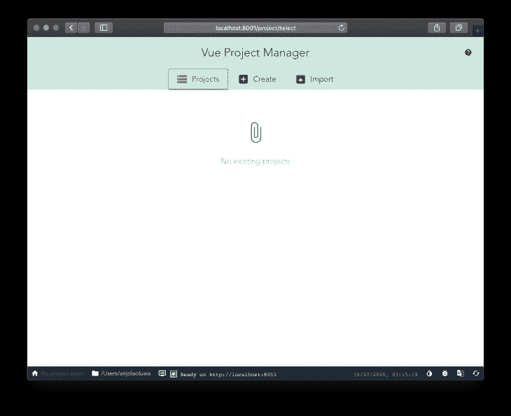

## 什么是 Poi？

Poi 是一个基于 webpack 构建的零配置捆绑器，它旨在通过使用预先配置的预设，使开发和捆绑 webpack 应用程序尽可能简单。Poi 与框架无关，可以与任何 JavaScript 框架一起工作。Poi 优先考虑性能，并通过缩小和篡改代码来加速应用程序的加载。

Poi 更适合构建 web 应用程序。

[创建兴趣点应用](https://github.com/egoist/poi/tree/master/create-poi-app)是一个用于交互式创建新兴趣点项目的脚手架工具。

Poi 提供了很好的开发体验，同时还提供了一个选项，可以通过配置文件来扩展您的应用程序。

它还有几个显著的特点，例如:

*   对 JS、CSS、文件资产等的现成支持
*   Poi 是框架不可知的
*   无需配置即可支持 JSX、Vue 等
*   使用插件扩展功能

## 什么是毕丽？

毕丽在其官方文件中被描述为一个令人愉快的图书馆捆绑者。

毕丽是 Poi 的替代产品，它是一个基于 Rollup 的零配置捆绑器，它使开发设置变得轻而易举，它更适合构建库而不是 web 应用。

毕丽帮助库作者将库捆绑成 JavaScript 多种格式，如 CommonJS、UMD 和 es 模块。

> 注意:没有适用于毕丽的 CLI 交互式 shell。

该工具提供了命令行和 Node.js API，因此开发人员可以选择哪个最适合他们的用例，它是面向未来的，因为它是由 Babel 使用 [babel-preset-env](https://babeljs.io/docs/en/babel-preset-env) 和 [babel-preset-typescript](https://babeljs.io/docs/en/babel-preset-typescript) 传输的，所以您可以自由使用现代 JavaScript 功能，正如其[文档](https://bili.egoist.sh/#/)中所述，它的一些功能包括:

*   默认快速零配置
*   使用引擎盖下的卷
*   使用 Buble/Babel/TypeScript 自动转换 JS 文件
*   内置对`CSS`、`Sass`、`Stylus`、`Less`、`CSS modules`的支持
*   使用汇总插件扩展功能
*   友好的错误记录体验
*   用 TypeScript 编写，自动生成 API 文档

## 安装和使用

### Vue CLI

开始使用 Vue CLI 工具。使用以下命令之一安装 CLI 工具:

```
npm install -g @vue/cli
# OR
yarn global add @vue/cli
```

全局安装 CLI 包使我们能够在终端中访问`vue`命令，而`vue create`命令帮助我们创建一个新项目:
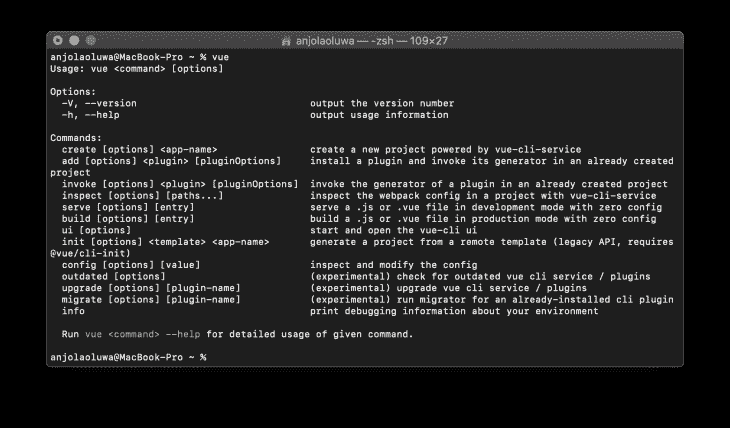

Next, create a new project with the `vue create` command:

```
vue create testing-vue-cli
```

我使用名称“testing-vue-cli”作为本教程的项目名称，它可以替换为您认为合适的任何名称。

运行此命令可为您提供交互式搭建体验，您可以在其中选择应用程序将需要的包，还可以决定将配置存储为未来项目的预设:

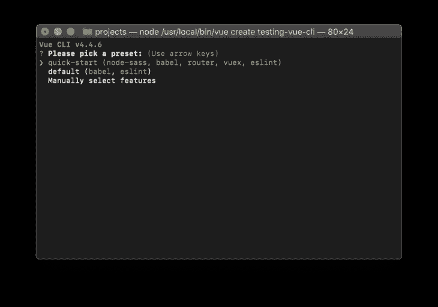

接下来，将目录更改为您的项目文件夹:

```
cd testing-vue-cli
```

通过运行以下命令之一为您的应用提供服务:

```
yarn serve
or
npm run serve
```

运行以下命令后，默认情况下，您的应用程序应该在 [http://localhost:8080](http://localhost:8080/) 上运行:

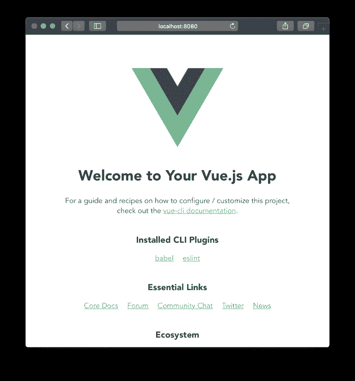

### 轻快地

运行这个命令，用样板文件创建一个新的 Vite 应用程序:

```
#Using NPX
npx create-vite-app testing-vite

OR

#Using Yarn
yarn create vite-app testing-vite
```

现在，使用命令切换到创建的项目目录:

```
cd testing-vite
```

然后继续安装我们的项目运行所需的必要包:

```
#Using NPM
npm install

OR
#Using Yarn
yarn
```

然后，您可以通过运行以下命令在浏览器中启动开发服务器:

```
#Using NPM
npm run dev

OR 
#Using Yarn
yarn dev
```

在运行`dev`命令后，您应该会在 [http://localhost:3000](http://localhost:3000/) 上看到类似这样的内容:

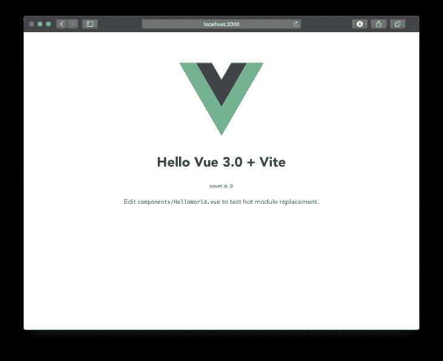

### 创建兴趣点应用程序

要开始使用 Poi 引导您的项目，首先安装创建 Poi 应用程序 CLI 工具:

```
yarn global add create-poi-app    
# OR
npm i -g create-poi-app
```

该命令使 create-poi-app 可在全球范围内使用。您现在可以访问`cpa`命令来创建新项目:

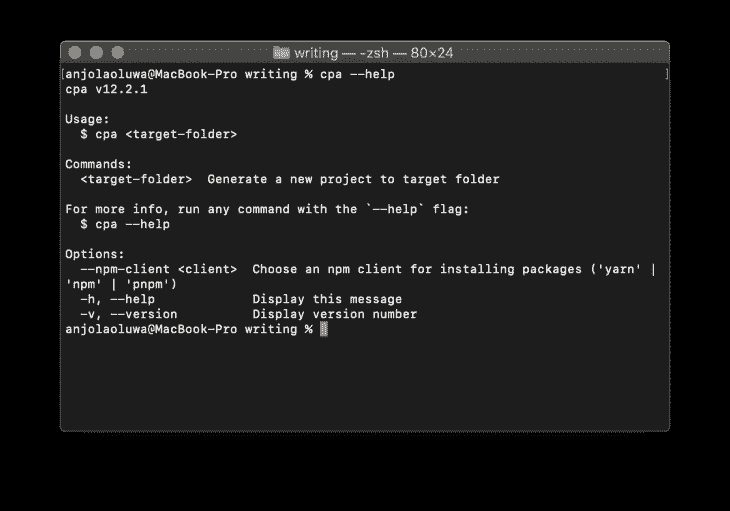

使用命令创建一个新项目:

```
cpa testing-poi
```

运行这个命令将给出一个 shell，您可以在其中决定在您的项目中包含哪些工具:
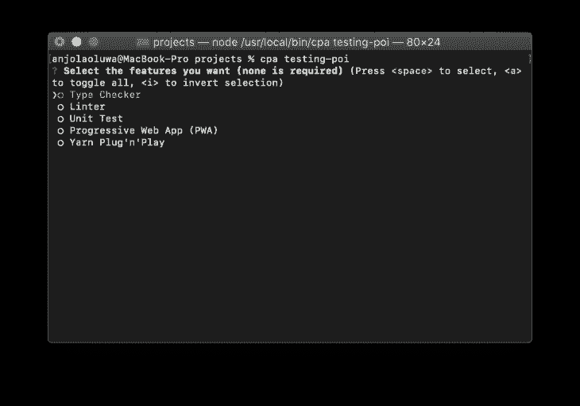

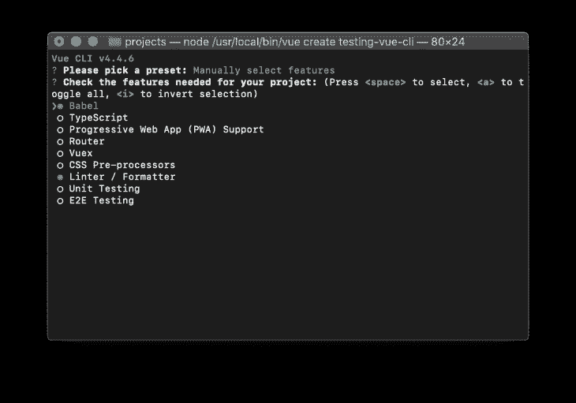

接下来，使用以下命令切换到您的项目目录:

```
cd testing-poi
```

继续安装 Vue，也安装 Vue 模板编译器，作为开发依赖，Vue 模板编译器编译下模板来渲染函数:

```
yarn add vue && yarn add vue-template-compiler --dev
```

打开位于`src` finder 中的`index.js`文件，包括以下内容:

```
import Vue from 'vue'
import App from './App.vue'
new Vue( {
  el: "#app",
  render: h => h( App )
} );
```

接下来，在`src`文件夹中创建一个`App.vue`文件，在文件中包含以下内容:

```
<template>
  <div id="app">
   helloooo
  </div>
</template>
```

现在，您可以通过运行以下命令在浏览器中运行开发服务器:

```
yarn dev
```

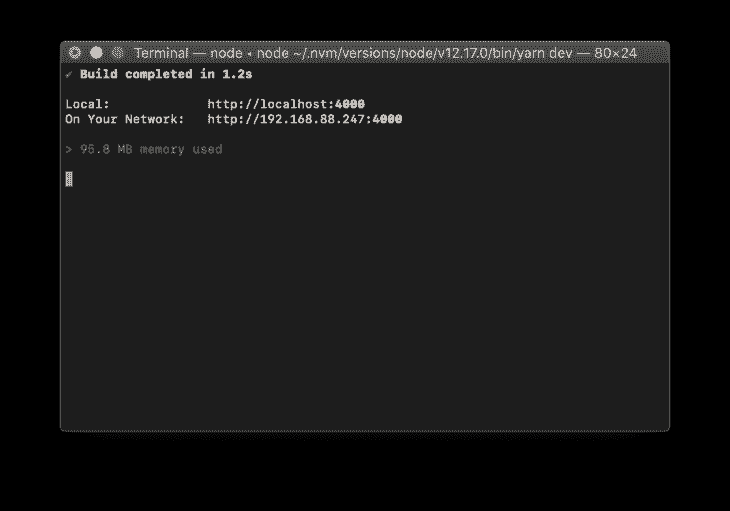

在运行 dev 命令后，您应该会在 [http://localhost:4000](http://localhost:4000) 上看到类似这样的内容:


## 胆红素

要使用毕丽引导您的 Vue 项目，首先为项目创建一个新目录:

```
mkdir testing-bili
```

将您的工作目录更改为创建的文件夹:

```
cd testing-bili
```

然后在目录中初始化一个新的`package.json`文件，使用:

```
npm init -y
or using Yarn
yarn init -y
```

接下来，将毕丽作为开发依赖项进行安装:

```
yarn add bili --dev
```

接下来，安装 Vue 和 Vue 模板编译器:

```
yarn add vue && yarn add vue-template-compiler --dev
```

通过用以下内容替换`package.json`中的`main`键的值，为您的项目添加一个条目文件:

```
"main": "./dist/index.js",
```

接下来，为 Vue 安装 [Rollup 插件，这使得将单个文件组件与毕丽捆绑在一起成为可能:](https://rollup-plugin-vue.vuejs.org/)

```
yarn add [email protected]
```

然后配置 npm 脚本以使用毕丽来运行项目，将以下内容添加到 package.json 文件中:

```
"scripts": {
  "build": "bili App.vue --plugin.vue"
},
```

接下来，创建一个`App.vue`文件，包括以下内容:

```
<template>
  <h1>hello</h1>
</template>
<script>
export default {
  name: 'App'
}
</script>
<!-- let's add some style too :) -->
<style scoped>
h1 {
  color: red
}
</style>
```

接下来，创建一个`bili.config.js`文件，并在文件中包含以下内容:

```
const vue = require('rollup-plugin-vue');
module.exports = {
    input: 'App.vue',
    format: ['umd-min'],
    plugins: {
        vue: true
    },
    outDir: 'dist'
}
```

然后，您可以使用以下命令构建项目:

```
yarn build
```

编译后的文件应该位于项目的`dist`文件夹中。

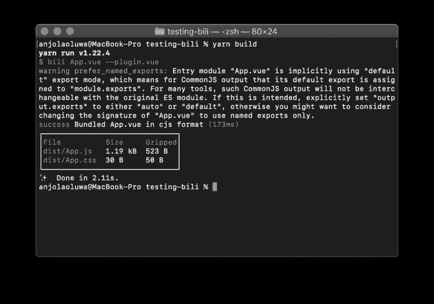

## 易用性和插件

Vue CLI 的优势之一是插件几乎可用于任何目的，这使得使用第三方[插件](https://tailwindcss.com/docs/plugins/)或构建自己的插件来扩展项目的功能变得容易。

虽然所有四个库都是为了实现几乎相似的结果而构建的，但是 Vue CLI 和 Poi 的文档几乎具有相同的标准，而 Vite 目前还没有完整的文档。Vite 仍在积极开发中，人们需要阅读库的代码库的[文档部分](https://github.com/vitejs/vite/blob/master/src/node/config.ts)来执行一些高级操作。另一方面，毕丽的文档是最基本的，新用户在试图在 Vue 项目中使用它时可能会感到困惑(正如我通读时所做的那样)并遇到错误。

Vue CLI 是 Vue.js 团队推荐的工具，是许多开发人员的默认选择。

## 社区

尽管是一个相对较新的图书馆，Vite 已经积累了 91k 颗星星，并被 755 个存储库使用，它还有 54 个贡献者，在 NPM 上每周下载[5863 次:](https://www.npmjs.com/package/vite)

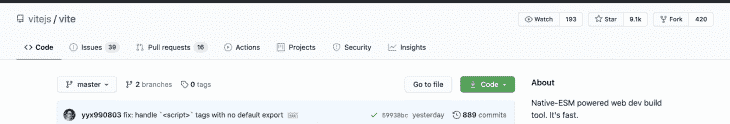

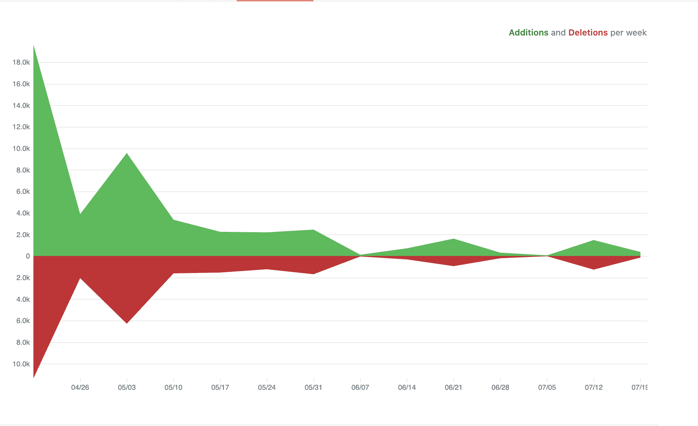

Poi 在 GitHub 上有 5000 颗星，在 GitHub 上有 57 个贡献者，在 NPM 上每周有[1760 次下载](https://www.npmjs.com/package/poi):

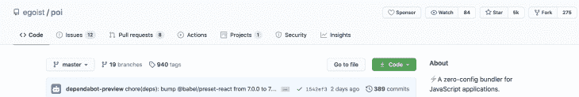

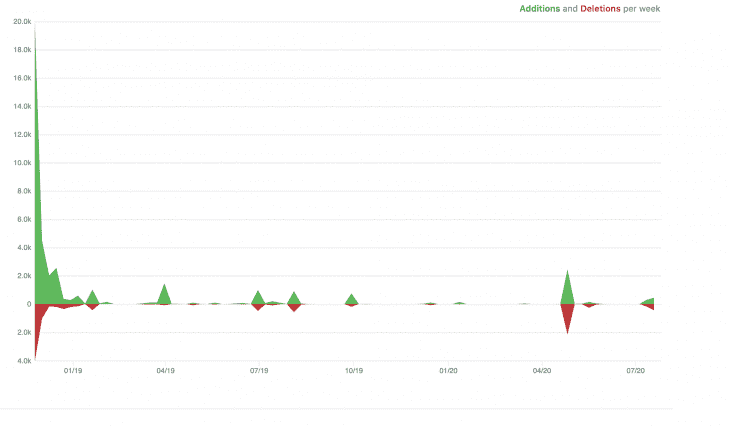

Vue CLI 拥有最高的统计数据，在 [NPM](https://www.npmjs.com/package/@vue/cli) 上每周下载 24，236 次，它也被超过 400，000 个存储库使用，它有 370 个贡献者，并在 GitHub 上获得了 25.9k 颗星:

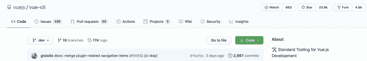

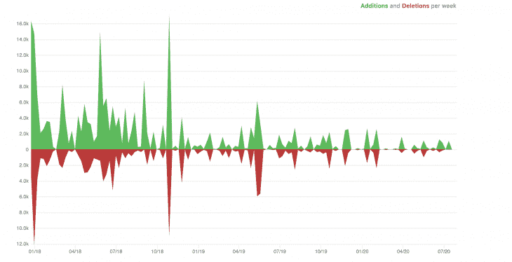

毕丽在 GitHub 上管理了 878 颗星星，它被 1529 个知识库使用，有 20 个贡献者: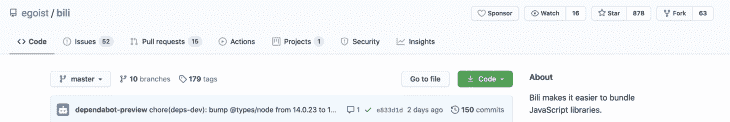

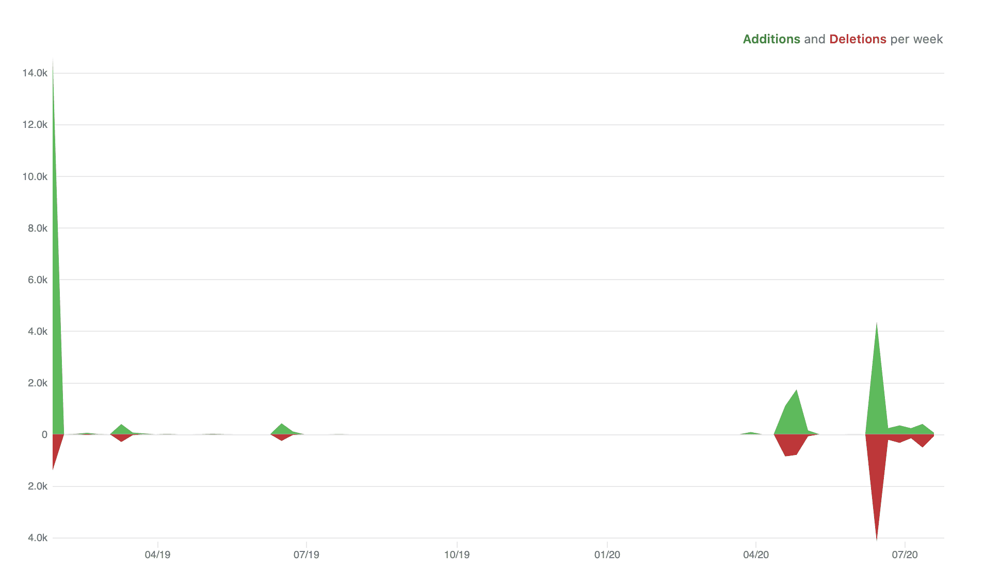

## 结论

在本文中，我们已经了解了在四个用于引导 Vue 项目的出色构建工具中脱颖而出的一些特性，Vue CLI 是许多开发人员的默认选择，因为它使引导和管理项目变得轻而易举，并且也很容易通过插件扩展其功能。Vue CLI 还拥有比脚手架项目可用的任何其他工具更多的功能。

我们今天看到的四个搭建工具是相似的，只有一些基本的区别，主要是定制选项和无缝使用它们。

虽然 Vite 仍然是实验性的，但我们可以看到它是如何反映 Vue CLI 的无缝性的(两者都是由同一个人构建的)。

你更喜欢哪一个，为什么？请在评论区告诉我你的想法，或者如果你想让我写一些其他的比较，请告诉我。

## 像用户一样体验您的 Vue 应用

调试 Vue.js 应用程序可能会很困难，尤其是当用户会话期间有几十个(如果不是几百个)突变时。如果您对监视和跟踪生产中所有用户的 Vue 突变感兴趣，

[try LogRocket](https://lp.logrocket.com/blg/vue-signup)

.

[](https://lp.logrocket.com/blg/vue-signup)[https://logrocket.com/signup/](https://lp.logrocket.com/blg/vue-signup)

LogRocket 就像是网络和移动应用程序的 DVR，记录你的 Vue 应用程序中发生的一切，包括网络请求、JavaScript 错误、性能问题等等。您可以汇总并报告问题发生时应用程序的状态，而不是猜测问题发生的原因。

LogRocket Vuex 插件将 Vuex 突变记录到 LogRocket 控制台，为您提供导致错误的环境，以及出现问题时应用程序的状态。

现代化您调试 Vue 应用的方式- [开始免费监控](https://lp.logrocket.com/blg/vue-signup)。