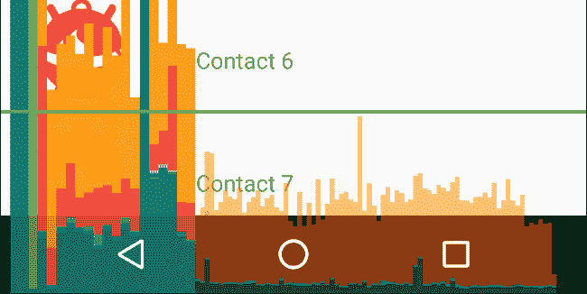
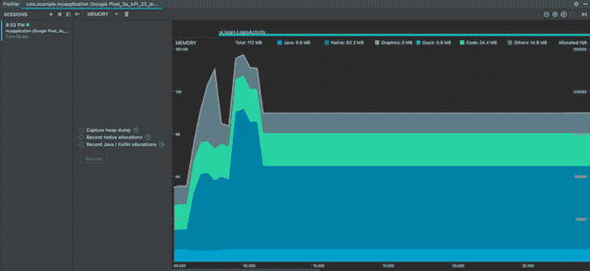
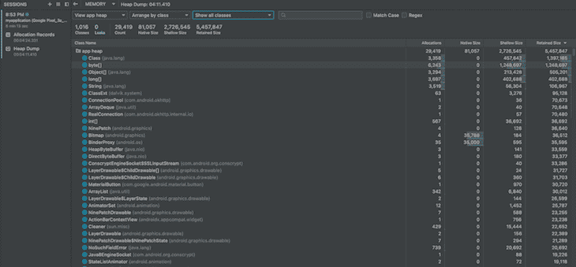
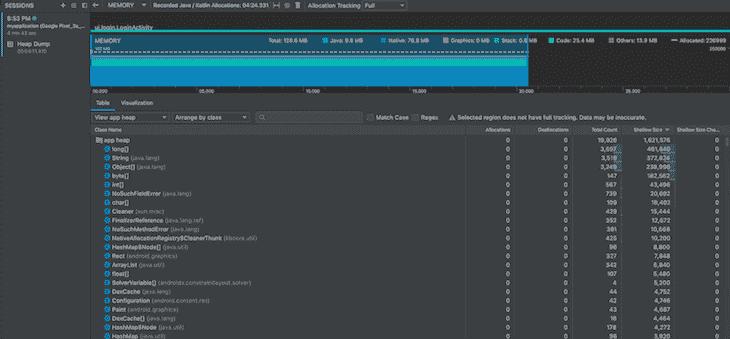
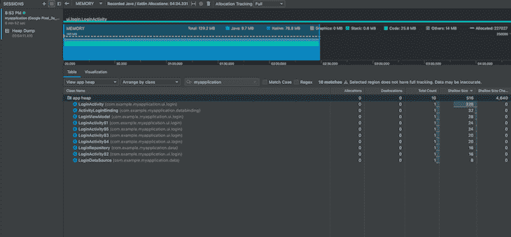
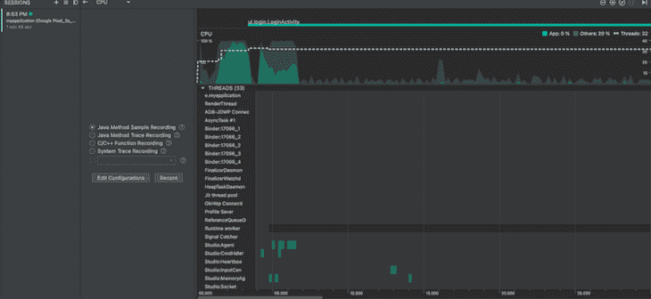
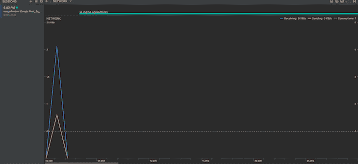
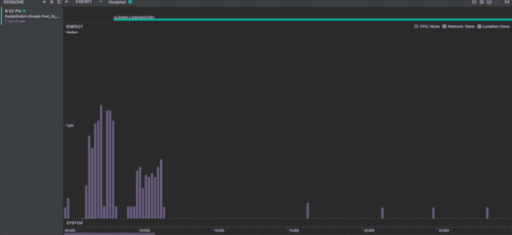

# Android 评测完全指南

> 原文：<https://blog.logrocket.com/complete-guide-android-profiling/>

如果没有适当的性能监控，您的应用程序可能会不必要地耗尽宝贵的资源，潜在地导致本来可以轻松避免的收入损失。虽然有很多工具和平台可以用来对托管应用进行基准测试，但移动应用经常被忽视。

在本指南中，我们将介绍分析 Android 应用程序的基础知识。我们将讨论在分析 Android 应用程序时需要注意什么，如何开始使用流行的工具，以及如何减少资源过度使用。我们开始吧！

### 目录

## 什么是 Android profiling？

概要分析是一种软件开发实践，有助于识别应用程序中的性能和资源管理瓶颈。

Android 应用程序应该在 Android 设备上运行，而 Android 设备通常具有有限的硬件资源。因此，您必须优化应用的资源消耗，以便为用户提供最佳体验。如果没有 Android 评测，性能优化几乎是不可能的。

## Android 评测应该关注什么？

在分析你的 Android 应用时，你可以关注多个方面，比如内存。作为移动设备上最重要但有限的资源之一，不当的内存管理会导致[应用程序不响应错误](https://developer.android.com/topic/performance/vitals/anr) (ANRs)和应用程序崩溃。

处理是控制用户在应用中导航体验的关键。不当的管理会导致落后的用户界面，应用程序变慢，在最糟糕的情况下，完全冻结。

大多数 Android 应用程序依赖远程服务器来提供内容和信息。不当的网络管理会增加内容加载时间的不必要的延迟，给用户带来不好的体验。

最后，由于所有移动设备都依靠某种形式的电池运行，所以你需要优化你的应用程序，以尽可能少地消耗电池。消耗大量电池的应用程序通常会被用户快速卸载。

## 如何分析 Android 应用程序

有多种方法可以用来分析 Android 应用程序，但是在本节中，我们将讨论三种方法。

您可以使用每部 Android 手机上提供的开发人员工具来动态分析 GPU 性能。您首先需要完成以下工作:

1.  在手机上启用开发者选项
2.  进入**设置** > **开发者选项**
3.  在**监控**部分，选择 **Profile GPU 渲染**选项
4.  在弹出的对话框中，选择屏幕上的**为条**选项
5.  打开您想要分析的应用程序

您会注意到屏幕底部有如下所示的栏:



Image source: Android Developers

此图中的每个竖条代表应用程序 UI 的一个框架。条形的高度表示设备在屏幕上呈现该帧所用的时间。该图还包含渲染生命周期的每个组件所花费的时间等信息，用不同颜色的条表示。可以在官方[安卓开发者网站](https://developer.android.com/topic/performance/rendering/inspect-gpu-rendering#profile_rendering)了解更多。

### 安卓工作室

Android Studio 是 Android 应用程序开发的事实上的 IDE，所以它提供了大量的分析功能。使用 Android Studio，您可以分析从内存到电池的几乎所有东西。每个指标都有一个单独的概要分析部分，并提供了一系列的调整和定制。我们将在后面的章节中深入探讨 Android Studio 的更多细节。

### 达尔维克调试监控服务器(DDMS)

如果你不使用 Android Studio，或者你对 Android 自带的设备上概要功能不满意，还有另一个选择。Android SDK 包含一个独立的 Java 应用程序，可以用来实时监控 Android 应用程序的性能。

称为 [Dalvik Debug Monitor Server](http://www.dre.vanderbilt.edu/~schmidt/android/android-4.0/out/target/common/docs/doc-comment-check/guide/developing/tools/ddms.html) 的剖析工具可以直接从命令行启动。DDMS 充当你的应用程序和命令行之间的桥梁，直接连接到你手机里的虚拟机。DDMS 运行应用程序，将应用程序调试器的输出直接传输到你的命令行。

DDMS 是一个非常先进的工具，但是，值得注意的是，这个工具在 Android Studio v3.0 中被否决了。推荐 DDMS 的替代品是新的 Android Profiler，我们将在后面讨论。无论如何，如果你正在使用 Android Studio 的早期版本，或者如果你正在寻找一种手动调试 Android 应用程序的方法，DDMS 可以派上用场。

你可以用 DDMS 完成很多事情，包括屏幕捕捉，端口转发，来电和短信欺骗，位置数据欺骗，以及访问 Logcat，进程和其他应用程序信息。

## 基本概要分析入门

Android Studio 是一个非常详细的 Android 开发和调试工具。在这一节中，我们将提供一些基本的见解，让您了解如何使用 Android Studio 提供的分析工具来分析 Android 应用程序的各个方面。

### Android 评测器

[Android Profiler](https://developer.android.com/studio/profile/android-profiler) 是 Android Studio 提供的一套工具，用于剖析 Android 应用程序。进入菜单栏上的**视图** > **工具窗口** > **Profiler** 即可访问。或者，您也可以点击工具栏中的**轮廓**图标。

当您打开 Android Profiler 时，它看起来像下面的代码:


有一个共享的时间表，可以同时分析您的应用程序的 CPU、内存、网络和能源。要开始详细分析每个资源，您可以单击每个单独的时间线。

请注意，要访问这些时间线，您需要将 Android Profiler 连接到正在运行的会话。为此，您需要在启用调试的情况下将物理或虚拟 Android 设备连接到您的系统，然后启动一个应用程序。Android Studio 将识别正在运行的应用程序，并生成其实时时间线。

### 内存分析

[内存分析器](https://developer.android.com/topic/performance/memory)是 Android Studio 中最常用的分析工具之一。观察应用程序如何利用可用内存对于防止内存泄漏和膨胀至关重要。

您还可以使用内存分析器来查找内存分配模式，这些模式可能表明您的应用程序性能存在问题。此外，您可以转储应用程序的堆，以了解哪些对象占用了您设备的内存。相关堆转储的集合可以帮助您查明内存泄漏。

记录各种类型的用户交互期间的内存分配活动可以帮助您了解您的应用程序在哪里一次分配了太多的对象，以及您是否忘记了释放内存，从而导致内存膨胀。

内存分析部分如下图所示:



该工具为您提供了显示各种属性的时间线，例如:

*   每个类别使用的内存，用颜色表示，如 Java、Native、Graphics 等。
*   用 y 轴上的数字表示的已分配对象的数量
*   使用垃圾箱图标表示的垃圾收集事件

当您获得应用程序完成的内存分配的高级概述时，您还可以使用中间窗格中的三个可用选项来查明单个内存相关活动。

堆转储显示在记录堆转储时哪些对象已经被创建并且正在占用内存。您可以了解内存中分配的对象类型、它们的数量、它们正在使用的内存等等。

示例堆转储如下所示:



如果您选择记录 Java 或 Kotlin 对象分配以供进一步分析，该工具将按如下方式显示记录的数据:



使用搜索工具，您可以在这个列表中进行搜索，以确定一个类是否已经被分配，这在调试特定代码段的行为时非常有用。

当您搜索应用程序的名称时，它看起来像下面这样:



Android Studio 为您提供了这些选项来分析您的应用程序的内存使用情况。然而，为了充分利用这些工具，您需要开发一个分析策略。

我建议以固定的时间间隔记录和比较几个堆转储，以了解您的应用程序在哪里泄漏内存。此外，您应该记录应用程序大量使用和少量使用期间的对象分配，以观察数量是否过高，这可能表明您的代码中存在内存管理问题。

### CPU 分析

记录 Android 应用程序的 CPU 活动可以帮助您了解您的应用程序是否很好地管理其工作负载。 [CPU Profiler](https://developer.android.com/studio/profile/cpu-profiler) 工具列出了应用中的活动线程，并绘制出它们随时间变化的活动图。以下是 CPU Profiler 工具如何显示结果的示例:



绿色横条用于指示线程的 CPU 活动。如果线程暂停应用程序的流程以接收输入，条形将变为黄色，如果线程处于睡眠状态，条形将变为灰色。

您可以使用这些数据来确定线程是否使用了过多的 CPU 时间。您还可以直观地看到每一帧在屏幕上渲染需要多长时间，这将指出需要返工以提高性能的活动。

### 网络剖析

当您的应用程序处理大量网络交互时，网络分析器工具就派上了用场。您可能需要确定哪个请求失败了，或者哪个端点花费了比平常更长的时间来服务您的请求。

使用网络概述，您可以记录发送和接收网络请求的顺序、交换的数据以及交互发生时的网络速度。

在下面的示例中，当登录活动开始时，从 [Unsplash](https://unsplash.com) 下载了一个图像文件:



蓝色线表示下载速度，橙色线表示上传速度。如果您使用了`HttpURLConnection`或`okHTTP libraries`来发送和接收请求，您还可以在这个时间线上查看单个请求的详细信息，这在调试网络响应时非常有用。

### 电池剖析

Android Profiler 还包含一个名为 [Energy Profiler](https://developer.android.com/studio/profile/energy-profiler) 的电池使用情况分析工具，可以可视化应用程序随着时间的推移对设备电池使用情况的影响。你可以尝试在你的应用程序中执行繁重的任务，以检查它对设备的电池消耗是否有较大的影响。

在下面的例子中，应用程序在运行时的前五秒钟保持唤醒锁。您可以观察到在那段时间内电池的使用量很高，尽管没有进行任何实际的繁重处理。按照这种方法，能源分析器有助于识别 Android 应用程序的过度能源使用:



## Android 资源管理最佳实践

虽然我们可以使用评测来识别 Android 应用程序的问题，但最好从一开始就尽量减少或避免这些问题。在本节中，我们将确定一些最佳实践，帮助您合理管理应用的资源使用。

### 技巧 1:通过委托给后台线程来减轻 UI 线程的负担

Android 运行时支持多线程编程。根据其架构，Android 应用程序的 UI 是在主线程上呈现的，这就是为什么它被称为 UI 线程。

如果您试图在 UI 线程上执行资源密集型活动，如下载文件或处理图像，这将减少 UI 渲染活动可用的处理器时间，从而使您的应用程序的 UI 滞后和缓慢。

为了避免这种情况，您应该始终将一个可以在后台安全运行的工作线程专用于繁重的任务，以减轻 UI 线程的任何滞后或变慢。Android 运行时提供了多个本地库，您应该考虑在您的应用程序中使用这些库。

### 技巧 2:避免嵌套布局超过两到三层

Android UI 是膨胀的，或者呈现为`views`和`viewgroups`的层次结构。`views`是你在屏幕上看到的视觉元素，比如按钮、开关等。，而`viewgroups`是用来容纳和排列`views`的容器。

正如您所猜测的，所有的`views`和`viewgroups`都会消耗运行时内存中的空间，并且必须经过处理才能呈现在屏幕上。此外，在一个`view`或`viewgroup`对象上运行的处理也在它的所有子对象上运行。如果你的应用程序的用户界面是深度嵌套的，这会给设备增加惊人的工作量，降低用户界面的速度并影响用户。

为了避免这种情况，请尝试使用尽可能简单的层次结构来设计您的 UI。避免使用太多的`LinearLayouts`，这会限制你在里面安排`views`的自由。相反，我更喜欢`ConstraintLayout`，它可以帮助你构建复杂的 UI 排列，而不需要深度嵌套。

### 技巧 3:尽可能多地重用 UI 元素

许多 UI 元素，如导航栏和侧栏，在整个应用程序中都被重用。许多开发新手忽略了这一点，并在需要的地方重新创建这些组件。例如，假设下面的代码是我们的`Title`栏:

```
<FrameLayout
    android:layout_width="match_parent"
    android:layout_height="wrap_content" >

    <ImageView android:layout_width="wrap_content"
               android:layout_height="wrap_content"
               android:src="@drawable/app_logo" />
</FrameLayout>

```

虽然您可以将`Title`栏直接包含在您的活动中，如下面的代码片段所示，但就资源管理而言，这样做并不是最佳选择:

```
<!-- MainActivity.xml -->
<LinearLayout
    android:orientation="vertical"
    android:layout_width="match_parent"
    android:layout_height="match_parent">

    <!-- Title bar here -->
    <FrameLayout
        android:layout_width="match_parent"
        android:layout_height="wrap_content">

         <ImageView android:layout_width="wrap_content"
                   android:layout_height="wrap_content"
                   android:src="@drawable/app_logo" />
    </FrameLayout>

    <!-- Rest of the activity.. -->
    <TextView android:layout_width="match_parent"
              android:layout_height="wrap_content"
              android:text="@string/hello"
              android:padding="10dp" />

    ...

</LinearLayout>

```

相反，您应该为`Title` bar UI 创建一个单独的 XML 文件，并在您的代码中需要的地方包含它:

```
<!-- MainActivity.xml -->
<LinearLayout
    android:orientation="vertical"
    android:layout_width="match_parent"
    android:layout_height="match_parent">

    <!-- Title bar here -->
    <include layout="@layout/title_bar" />

    <!-- Rest of the activity.. -->
    <TextView android:layout_width="match_parent"
              android:layout_height="wrap_content"
              android:text="@string/hello"
              android:padding="10dp" />

    ...

</LinearLayout>

```

虽然这极大地提高了代码的可读性，但是您可以通过使用`merge`标签来减少布局中不必要的父容器，从而使代码的可读性更上一层楼。为了更好地理解这一点，让我们以包含两个`TextViews`的布局为例:

```
<!-- @layout/banner.xml -->
<LinearLayout
    android:layout_width="match_parent"
    android:layout_height="wrap_content" >

    <TextView
        android:layout_width="match_parent"
        android:layout_height="wrap_content"
       android:text="@string/hello" /> 

    <TextView
        android:layout_width="match_parent"
        android:layout_height="wrap_content"
        android:text="@string/world" />

</ LinearLayout>

```

如果你要在另一个布局中包含它，你将总是有一个不必要的`LinearLayout`包裹在`TextViews`周围。因为 XML 布局文件总是需要一个根父节点`viewgroup`，所以你不能去掉它，不必要地增加了 UI 布局中的嵌套。要解决这个问题，您可以使用`merge`标签来删除您的`banner.xml`文件中的父文件`LinearLayout`:

```
<!-- @layout/banner.xml -->
<merge xmlns:android="http://schemas.android.com/apk/res/android">

    <TextView
        android:layout_width="match_parent"
        android:layout_height="wrap_content"
        android:text="@string/hello" /> 

    <TextView
        android:layout_width="match_parent"
        android:layout_height="wrap_content"
        android:text="@string/world" />

</merge>

```

现在，当您在主布局中包含这个布局时，系统将忽略`merge`元素，并将两个`TextViews`直接放置在 include 标签的位置，从而使 UI 布局的层次变得平坦，并提高 UI 的性能。

### 技巧 4:充分利用上下文来减少不必要的内存泄漏

Android 资源通过一个名为 [Context](https://developer.android.com/reference/android/content/Context) 的接口进行聚合和访问。每个活动都有自己的上下文，允许访问特定于活动生命周期的资源。除此之外，Android 应用程序也有自己的上下文，与应用程序的生命周期相关联，本质上更加全球化。

这些上下文用于访问 Android 资源，如`SharedPreferences`、设备上的数据库等等。然而，为了避免资源泄漏，无论何时在内存中创建资源访问对象，都必须记住使用适当的上下文。

例如，如果您使用活动上下文初始化数据库访问对象，则该对象的范围将仅限于该活动。如果您试图在活动之外使用它，您将不得不不必要地在内存中保留该活动的上下文。相反，您应该考虑使用应用程序上下文来初始化本质上是全局的资源对象。

## 结论

开发 Android 应用程序需要创新和优化的完美平衡。与任何类型的开发一样，您需要确保不会因为编写糟糕的代码而浪费资源。Android profiling 可以帮助您识别和解决此类案例。

在本指南中，我们详细讨论了 Android 评测，讨论了可以监控 Android 应用程序性能的各个方面。我们还研究了一些最流行的开始分析应用程序的方法，以及一些在开发下一个 Android 应用程序时需要记住的最佳实践。

我希望这个指南能帮助你打破 Android 的剖析，让你的 Android 应用开发技能更上一层楼。编码快乐！

## 使用 [LogRocket](https://lp.logrocket.com/blg/signup) 消除传统错误报告的干扰

[](https://lp.logrocket.com/blg/signup)

[LogRocket](https://lp.logrocket.com/blg/signup) 是一个数字体验分析解决方案，它可以保护您免受数百个假阳性错误警报的影响，只针对几个真正重要的项目。LogRocket 会告诉您应用程序中实际影响用户的最具影响力的 bug 和 UX 问题。

然后，使用具有深层技术遥测的会话重放来确切地查看用户看到了什么以及是什么导致了问题，就像你在他们身后看一样。

LogRocket 自动聚合客户端错误、JS 异常、前端性能指标和用户交互。然后 LogRocket 使用机器学习来告诉你哪些问题正在影响大多数用户，并提供你需要修复它的上下文。

关注重要的 bug—[今天就试试 LogRocket】。](https://lp.logrocket.com/blg/signup-issue-free)