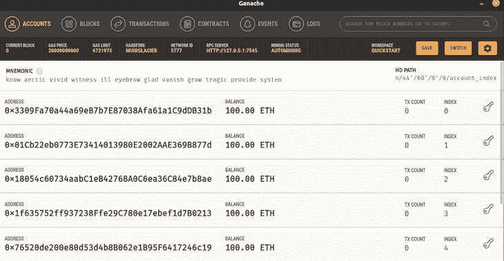
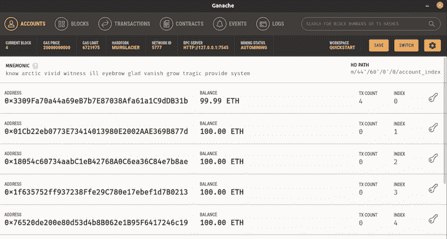

# 区块链测试完全指南

> 原文：<https://blog.logrocket.com/complete-guide-blockchain-testing/>

世界各地的组织都在求助于区块链技术来改善数据存储、安全性和管理。这导致需要确保在区块链网络上建立的应用程序得到彻底的测试。

在这篇文章中，我们将讨论什么是区块链测试，包括优点和缺点，区块链测试的类型，阶段和一些有用的工具。我们还将使用一些推荐的测试工具来创建和测试智能合约。

## 区块链在测试什么？

区块链测试是对区块链各种功能组件(如智能合同)的系统评估。与传统的软件测试不同，区块链测试涉及几个组件，如块、挖掘、事务、钱包等等，所有这些都需要特殊的工具来测试。

区块链测试有助于各种质量阶段的开发，从系统性能到区块链应用的安全性。

根据 IBM 的企业架构师 Santu Maity 的说法，区块链测试的最佳方法包括整个环境。这包括基于区块链的移动和 web 应用程序，它们与区块链系统的功能组件(如 API、智能合约和节点)进行交互。

## 区块链测试的优势

区块链测试确保区块链网络中涉及的所有实体都经过了适当的操作验证。因此，它为组织提供了一个安全且实用的基础架构。

区块链测试有助于交付优质产品，从而改善用户体验。它还消除了分散系统中的缺陷，在分散系统中，为了防止金融损害，涉及到金钱。

## 区块链测试的挑战

最大的挑战之一是缺乏测试工具。目前，很少有测试工具可以用于每个区块链框架；因此，使用错误的工具会导致问题。

区块链生态系统的另一个问题是缺乏专业知识。因为区块链技术在技术领域仍然相对较新，它还没有在软件开发人员中被广泛采用。

另一个挑战是测试策略。区块链测试需要彻底了解和理解区块链是如何工作的。

区块链网络的安全也很困难。区块链应用现在正被用于各种经济领域。因此，数据安全性对于防止恶意活动至关重要。

无法提供足够的性能和负载测试很少或根本不了解区块链应用程序在特定条件下的性能。

## 区块链测试的类型

以下是可以在区块链上执行的测试类型的综合列表:

1.  功能测试确定区块链系统各种功能组件的有效性
2.  节点测试有助于对网络上的每个节点进行独立测试，以确保连接没有问题
3.  性能测试确定系统流量限制，并推荐最佳解决方案
4.  API 测试有助于区块链网络中应用程序之间的清晰交互，确保这些应用程序之间的请求和响应正常运行

## 区块链测试的阶段

### 初始阶段

初始阶段是测试区块链系统的第一阶段。在这里，测试人员通过分析和理解系统的功能来熟悉系统的生命周期，允许他们更好地理解所有涉及的组件。生成一个详细的图，包括所有的系统组件和子组件，以及所有的接口，以提供对系统如何整体工作的良好理解。

### 设计阶段

在设计阶段，确定必须测试的系统的关键组件，并制定适合区块链系统的详细测试策略。这个测试策略描述了系统的测试用例以及测试环境规范。

### 规划阶段

在这个阶段，决定如何执行每种类型的测试，并估计每个级别将执行多少测试以及执行到什么程度。

如果系统不可用，必须设计替代的测试策略。设置专用区块链进行测试是另一种测试策略。API 测试、功能测试、性能测试、安全测试等等都是这些测试的例子。

### 结果阶段

这是最后一个阶段，包括一份系统整体测试报告。系统性能、低级检查以及块、交易和智能合约的验证是此阶段必须执行的基本练习。

## 区块链测试工具

### 以太坊测试仪

[以太坊测试器](https://github.com/ethereum/eth-tester)是一个以太坊测试工具，包括 Web3 集成、API 和智能合约。这使得开发团队可以再造一个类似以太坊区块链的产品。

这是一个开源的测试库，实现起来很简单，并且为各种测试需求提供了可管理的 API 支持。

### 加纳切

[该工具](https://blog.logrocket.com/develop-test-deploy-smart-contracts-ganache/)主要用于本地测试以太坊合约。它生成一个区块链模拟，允许任何人测试多个账户。

### exonum 测试套件

[exon um Test](https://exonum.com/doc/version/latest/advanced/service-testing/)[K](https://exonum.com/doc/version/latest/advanced/service-testing/)[it](https://exonum.com/doc/version/latest/advanced/service-testing/)专门测试区块链应用的整个服务的活动。我们可以使用该工具来执行 API 测试和事务执行，而不必担心网络操作或一致性算法。

### Corda 测试工具

Corda 是一个基于区块链技术的开源分布式分类帐平台。契约测试、集成测试、流程测试和负载测试都通过内置的测试工具变得更加容易。

### 松露

松露是一个区块链测试工具，它的功能超越了基本测试，比如与柴和摩卡一起工作。在以太坊开发者中，它是一个众所周知的名字，用于识别令人惊奇的测试特性，例如自动化契约测试。

### 杨属

Populus 框架包含了以太坊的测试功能，它被很好地集成为一组面向合同部署测试的属性。这些框架大多是围绕 [pytest](https://docs.pytest.org/en/6.2.x/) 框架构建的，允许其非常简单的实现。

## 测试智能合同

现在让我们转到本文的教程部分。现在，您已经掌握了区块链测试的基本知识，我们将使用 Truffle 开发并测试一个智能合约样本。

在这个例子中，我们将为一家汽车商店创建一个汽车跟踪系统。我们将涵盖以下内容:

*   设置开发环境
*   创建松露项目
*   撰写智能合同
*   编译智能合同
*   迁移智能合同
*   测试智能合约

### 设置环境

要使用 Truffle，您需要在计算机上安装以下软件:

成功安装后，在您的终端中运行以下命令:

```
npm install -g truffle

```

上面的命令将在你的计算机上全局安装 Truffle。在终端中键入“truffle version”，查看 truffle 是否安装正确。

### 创建一个新的松露项目

使用以下内容创建一个新的项目目录:

```
mkdir truffle-project

```

像这样迁移到新的项目目录中:

```
cd truffle-project

```

然后，初始化 Truffle:

```
truffle init

```

以上命令将为 Truffle 生成以下目录结构:

`contracts/`，包含智能合约源代码，用 Solidity 编写。在这个目录中有一个名为`Migrations.sol`的重要契约。

`migrations/`。智能合同的部署由迁移系统管理。它用于监控智能合同中的变化。

`test/`是保存智能合同的测试代码和文件的地方。测试可以用 Solidity 或者 JavaScript 编写。

`truffle-config.js`是 Truffle 配置文件，您可以在其中定义用于部署智能合同的部署网络。

## 创建智能合同

在`contracts/`目录中，创建一个名为`Auto.sol`的新文件，并添加以下内容:

```
// SPDX-License-Identifier: MIT
pragma solidity ^0.8.9;

contract Purchase {
  address[20] public buyers;
}

```

`pragma solidity ^0.8.9;`表示所需的最低版本的坚固性。`pragma`命令意味着“只有编译器关心的附加信息”，而脱字符号(^)意味着“指示的版本或更高版本”

写 Solidity 的时候，必须声明数组、字符串之类的数据类型。Solidity 提供了一种称为 address 的特殊数据类型，这也是一种以太坊地址，存储为 20 字节值。这个地址可以用来发送和接收以太网。

在`contract Purchase{`范围内，我们定义了一个名为`borrower`的公共变量，类型为`address`，长度为`20`，这是一个以太坊地址数组。永远记得加一个分号(；)放在每条语句的末尾，以避免错误。

现在，让我们创建一个允许用户发出借书请求的函数。在变量声明下，添加以下内容:

```
// buying a car
function buy (uint carId) public returns (uint) {
    require(carId >= 0 && carId <= 19);

    buyer[carId] = msg.sender;

    return carId;
  }

```

根据上面的代码，该函数接受一个整数(`uint`)参数`carId`，并期望返回一个整数作为输出。`require()`语句用于确保`carId`在买方数组的范围内。因为 Solidity 中的数组是从零开始索引的，所以`carId`值必须在 0 到 19 之间。

如果`carId`在该范围内，则发出调用的地址被添加到我们的`buyer`数组中，用`msg.sender`表示。然后我们返回被传递的`carId`。

接下来我们写一个函数，得到所有的买家，就像这样:

```
// get all buyers
  function getBuyers() public view returns (address[20] memory) {
    return buyers;
  }

```

我们将`buyer`作为包含变量数据位置的类型`address[20] memory`返回。`view`在函数声明中表明该函数不会改变契约的状态。

### 编译智能合同

接下来，我们必须编译我们的 Solidity 代码，以便以太坊虚拟机(EVM)能够理解它。

在项目的根目录中打开终端，并键入以下命令:

```
truffle compile

```

上面的命令将编译 contracts 文件夹中的所有智能合同，并创建一个包含带有`artifacts`的 contracts 文件夹的`build`目录。

工件是用作 JavaScript 包装器的`.json`文件，用于与相应的智能合约进行交互。

### 迁移智能合同

既然合同已经成功编译，是时候将它迁移到区块链了。

迁移是一个部署脚本，用于更改应用程序契约的状态，将它们从一种状态转移到下一种状态。

要在区块链上部署智能合约，我们将首先创建迁移配置文件。这是一个 JavaScript 文件，用于处理区块链上智能合约的部署。

然而，为了部署带有迁移的智能契约，我们必须首先访问它们的工件，这些工件是由 Truffle compile 命令生成的。在`migration`目录中有一个默认的迁移文件`1_initial_migration.js`，它处理`Migration.sol`文件的部署。

让我们用下面的代码创建我们自己的迁移配置文件`2_deploy_contract.js`:

```
const PurchaseContract = artifacts.require('Purchase');

module.exports = function(deployer) {
  deployer.deploy(PurchaseContract);
};

```

`artifacts.require()`方法用于指定用于与区块链交互的智能契约。因为一个源文件可能包含多个契约，所以我们指定了契约定义的名称，而不是`.sol`文件的名称。在这种情况下，我们使用`Purchase`而不是`Auto`。

然后将迁移导出为带有参数的函数(部署者)。对象`deployer`负责暂存部署。接下来，我们部署`PurchaseContract`。

接下来，我们将使用另一个名为 Ganache 的区块链测试工具来提供部署我们的智能合约和执行测试的接口。你可以选择[下载](https://www.trufflesuite.com/ganache)或者使用命令行`npm i -g ganache-cli`。

> 如果你使用的是 Ubuntu 操作系统，你可能会发现很难运行 Ganache 应用程序。只需右击应用程序文件，转到属性，然后权限，并勾选允许执行文件作为程序。然后重新运行应用程序。

在本教程中，我将使用 Ganache GUI。运行应用程序并选择**快速启动**。屏幕上将显示以下图像:



现在，让我们迁移我们的智能合同:

```
truffle migrate

```

成功迁移后，您将看到以下内容:

```
Compiling your contracts...
===========================
> Everything is up to date, there is nothing to compile.

Starting migrations...
======================
> Network name:    'ganache'
> Network id:      5777
> Block gas limit: 6721975 (0x6691b7)

1_initial_migration.js
======================

   Replacing 'Migrations'
   ----------------------
   > transaction hash:    0x7f4ad90e465b3e6501e8a49f3af1692ba39df66cbb6e014061b9e7e592167c02
   > Blocks: 0            Seconds: 0
   > contract address:    0x5A61A1989d92Fb349fAcd409Fdc8A4C640853fD9
   > block number:        1
   > block timestamp:     1636840180
   > account:             0x3309Fa70a44a69eB7b7E87038Afa61a1C9dDB31b
   > balance:             99.99502316
   > gas used:            248842 (0x3cc0a)
   > gas price:           20 gwei
   > value sent:          0 ETH
   > total cost:          0.00497684 ETH

   > Saving migration to chain.
   > Saving artifacts
   -------------------------------------
   > Total cost:          0.00497684 ETH

2_deploy_contract.js
====================

   Replacing 'Purchase'
   --------------------
   > transaction hash:    0x039224bded1eec1272e422d79ea146aa0026d13252fa7c495628829dbf7d5e42
   > Blocks: 0            Seconds: 0
   > contract address:    0xA89fdCd07E195be4555E07025b8613224e312F97
   > block number:        3
   > block timestamp:     1636840182
   > account:             0x3309Fa70a44a69eB7b7E87038Afa61a1C9dDB31b
   > balance:             99.98848808
   > gas used:            284241 (0x45651)
   > gas price:           20 gwei
   > value sent:          0 ETH
   > total cost:          0.00568482 ETH

   > Saving migration to chain.
   > Saving artifacts
   -------------------------------------
   > Total cost:          0.00568482 ETH

Summary
=======
> Total deployments:   2
> Final cost:          0.01066166 ETH

```

现在回到您的 Ganache 应用程序:



你会注意到当前的块，之前是 0，现在是 4。还有，第一个地址以 100 以太开始，现在有 99.99 以太。这是由于迁移的交易成本。

我们已经在本地区块链上成功创建并部署了智能合同。现在，我们可以测试我们的智能合约，以确保它做了它应该做的事情。

### 测试智能合同

在 Truffle 中有两种测试智能合约的方法。第一种是使用 Solidity，第二种是使用 JavaScript。对于本教程，我们将使用 JavaScript 方法。

在`test`目录中，创建一个新文件`purchase.test.js`并编写以下内容:

```
const Purchase = artifacts.require("Purchase");
contract("Purchase", (accounts) => {
 let purchase;
 let expectedBuyer;
 before(async () => {
     purchase = await Purchase.deployed();
 });
 describe("get account addresses for every purchase", async () => {
  before("buy a car using accounts[0]", async () => {
    await purchase.buy(4, { from: accounts[0] });
    expectedBuyer = accounts[0];
  });
  it("can retrieve buyer's address by car id", async () => {
    const buyer = await purchase.buyers(4);
    assert.equal(buyer, expectedBuyer, "Expected to return buyer's account.");
  });
  it("can retrieve addresses of every buyers", async () => {
    const buyers = await purchase.getBuyers();
    assert.equal(buyers[4], expectedBuyer, "Buyer should be included.");
  });
 });
});

```

首先，我们使用`artifacts.require()`方法导入我们的`Purchase`契约。然后，我们声明一个契约，并传入我们的`Purchase`实例作为第一个参数，然后传入一个回调函数作为第二个参数。

回调函数的参数是`accounts`。`accounts`提供网络的可用账户。我们使用`before`来确保 ID 为`4`的所购汽车被分配给第一个账户。

然后我们运行一个测试，看看哪个地址购买了 ID 为`4`的汽车。为了比较实际值(`buyer`)和期望值(`expectedBuyer`)，我们使用`assert.equal`方法。如果测试失败，错误消息将打印到控制台。

最后，我们检查它是否返回了所有买家的地址。然后我们检查带有 UD `4`的地址是否在返回的买家地址中。

现在，我们通过运行以下命令来测试我们的契约:

```
truffle test

```

如果测试通过，您应该会看到下面类似的结果:

```
Using network 'test'.

Compiling your contracts...
===========================
> Everything is up to date, there is nothing to compile.

  Contract: Purchase
    get account addresses for every purchase
      ✓ can retrieve buyer's address by car id (102ms)
      ✓ can retrieve addresses of every buyers (429ms)

  2 passing (2s)

```

## 结论

随着区块链采用率的增长，如果不投资区块链和区块链的测试专业知识，就无法满足交付高质量产品的需求。

区块链测试确保系统中的所有组件都正常工作，并且所有应用程序都以可信的方式与之交互。

## 加入像 Bitso 和 Coinsquare 这样的组织，他们使用 LogRocket 主动监控他们的 Web3 应用

影响用户在您的应用中激活和交易的能力的客户端问题会极大地影响您的底线。如果您对监控 UX 问题、自动显示 JavaScript 错误、跟踪缓慢的网络请求和组件加载时间感兴趣，

[try LogRocket](https://lp.logrocket.com/blg/web3-signup)

.

[](https://lp.logrocket.com/blg/web3-signup)[https://logrocket.com/signup/](https://lp.logrocket.com/blg/web3-signup)

LogRocket 就像是网络和移动应用的 DVR，记录你的网络应用或网站上发生的一切。您可以汇总和报告关键的前端性能指标，重放用户会话和应用程序状态，记录网络请求，并自动显示所有错误，而不是猜测问题发生的原因。

现代化您调试 web 和移动应用的方式— [开始免费监控](https://lp.logrocket.com/blg/web3-signup)。