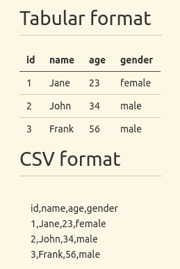

# Node.js 中 CSV 文件的完整指南

> 原文：<https://blog.logrocket.com/complete-guide-csv-files-node-js/>

## 介绍

逗号分隔值也称为 CSV，是统计分析工具和电子表格应用程序存储和交换表格数据集的最常见和最基本的格式之一。由于其受欢迎程度，管理机构和其他重要组织共享 CSV 格式的官方数据集并不少见。

尽管简单、受欢迎且使用广泛，但使用一个应用程序创建的 CSV 文件在另一个应用程序中显示不正确是很常见的。这是因为没有应用程序必须遵守的官方通用 CSV 规范。因此，存在几种略有不同的实现。

大多数现代操作系统和编程语言，包括 JavaScript 和 Node.js 运行时环境，都有用于读取、写入和解析 CSV 文件的应用程序和包。

在本文中，我们将学习如何在 Node 中管理 CSV 文件。我们还将强调不同 CSV 实现中的细微差异。我们将看到的一些流行的包包括 [csv 解析器](https://github.com/mafintosh/csv-parser)、 [Papa 解析器](https://www.papaparse.com/)和 [Fast-CSV](https://c2fo.github.io/fast-csv/) 。

我们还将进一步强调非官方的 [RFC 4180 技术标准](https://datatracker.ietf.org/doc/html/rfc4180.html)，它试图记录大多数 CSV 实现所使用的格式。

## 什么是 CSV 文件？

CSV 文件是普通的文本文件，由以矩形形式排列的数据组成。当您以 CSV 格式保存表格数据集时，换行符将分隔连续的行，而逗号将分隔一行中的连续条目。下图显示了一个表格数据集及其相应的 CSV 格式。



在上面的 CSV 数据中，第一行由字段名称组成，尽管情况可能并不总是如此。因此，在开始读取和解析数据集之前，有必要对其进行调查。

虽然逗号分隔值这个名称似乎表明逗号应该总是分隔每个记录中的后续条目，但是一些应用程序生成的 CSV 文件使用分号而不是逗号作为分隔符。

如前所述，尽管存在非官方的 RFC 4180 技术标准，但没有 CSV 实现应该遵循的官方通用标准。然而，这个标准是在 CSV 格式流行多年后才出现的。

## 如何在 Node.js 中管理 CSV 文件

在上一节中，我们简要介绍了 CSV 文件。在本节中，您将学习如何使用内置和第三方包在 Node 中读取、写入和解析 CSV 文件。

### 使用`fs`模块

`fs`模块是处理 Node 中文件的实际模块。下面的代码使用了`fs`模块的`readFile`函数来读取`data.csv`文件:

```
const fs = require("fs");
fs.readFile("data.csv", "utf-8", (err, data) => {
  if (err) console.log(err);
  else console.log(data);
});

```

下面的相应示例使用`fs`模块的`writeFile`函数写入 CSV 文件:

```
const fs = require("fs");
const data = `
id,name,age
1,Johny,45
2,Mary,20
`;

fs.writeFile("data.csv", data, "utf-8", (err) => {
  if (err) console.log(err);
  else console.log("Data saved");
});

```

如果你不熟悉在 Node 中读写文件，可以看看我的[完整教程在 Node](https://blog.logrocket.com/reading-writing-json-files-nodejs-complete-tutorial/) 中读写 JSON 文件。

如果您使用`fs.readFile`、`fs.writeFile`或上面例子中的同步对应物，Node 将在处理文件之前将整个文件读入内存。通过`fs`模块的`createReadStream`和`createWriteStream`功能，[可以使用流代替](https://blog.logrocket.com/working-node-js-streams/)来减少内存占用和数据处理时间。

下面的例子使用了`createReadStream`函数来读取一个`data.csv`文件:

```
const fs = require("fs");
fs.createReadStream("data.csv", { encoding: "utf-8" })
  .on("data", (chunk) => {
    console.log(chunk);
  })
  .on("error", (error) => {
    console.log(error);
  });

```

此外，我们将在接下来的小节中看到的大多数第三方包也使用流。

### 使用 csv 解析器包

这是一个相对较小的第三方软件包，您可以从 npm 软件包注册表中安装。它能够解析 CSV 文件并将其转换为 JSON。

下面的代码演示了如何从 CSV 文件中读取数据，并使用 csv-parser 将其转换为 JSON。我们正在使用`fs`模块的`createReadStream`方法创建一个可读的流，并通过管道将其传递给`csv-parser()`的返回值:

```
const fs = require("fs");
const csvParser = require("csv-parser");

const result = [];

fs.createReadStream("./data.csv")
  .pipe(csvParser())
  .on("data", (data) => {
    result.push(data);
  })
  .on("end", () => {
    console.log(result);
  });

```

有一个可选的配置对象可以传递给 csv-parser。默认情况下，`csv-parser`将数据集的第一行视为`field names(headers)`。

如果数据集没有标题，或者连续的数据点不是以逗号分隔的，则可以使用可选的配置对象来传递信息。该对象有额外的配置键，您可以在文档中读到。

在上面的例子中，我们从文件中读取 CSV 数据。您也可以使用像 Axios 或 [Needle](https://blog.logrocket.com/using-needle-send-http-requests-nodejs/) 这样的 HTTP 客户端从服务器获取数据。下面的代码说明了如何去做:

```
const csvParser = require("csv-parser");
const needle = require("needle");

const result = [];

const url = "https://people.sc.fsu.edu/~jburkardt/data/csv/deniro.csv";

needle
  .get(url)
  .pipe(csvParser())
  .on("data", (data) => {
    result.push(data);
  })
  .on("done", (err) => {
    if (err) console.log("An error has occurred");
    else console.log(result);
  });

```

在执行上面的代码之前，您需要首先安装 Needle。`get`请求方法返回一个流，您可以通过管道将它传递给`csv-parser()`。如果针头不适合您，您也可以使用另一个包装。

上面的例子只强调了 csv-parser 所能做的一小部分。如前所述，一个 CSV 文档的实现可能与另一个不同。Csv-parser 具有处理这些差异的内置功能。

虽然 csv-parser 是为了与 Node 一起工作而创建的，但是您可以在浏览器中使用诸如 [Browserify](https://browserify.org/) 这样的工具来使用它。

### 使用 Papa 解析包

Papa Parse 是另一个在 Node 中解析 CSV 文件的包。与 csv-parser 不同，Papa Parse 是为浏览器创建的。因此，如果您打算在 Node 中使用它，它的功能是有限的。

我们在下面的例子中说明了如何使用 Papa Parse 来解析 CSV 文件。和以前一样，我们必须使用`fs`模块的`createReadStream`方法来创建一个读取流，然后我们通过管道将它传递给`papaparse.parse()`的返回值。

用于解析的`papaparse.parse`函数带有可选的第二个参数。在下面的例子中，我们用属性`header`传递第二个参数。如果`header`属性的值是`true`，`papaparse`会将我们 CSV 文件中的第一行视为`column(field) names`。

* * *

### 更多来自 LogRocket 的精彩文章:

* * *

该对象还有其他字段，您可以在文档中查找。不幸的是，有些属性仍然仅限于浏览器，在 Node 中还不可用。

```
const fs = require("fs");
const Papa = require("papaparse");

const results = [];

const options = { header: true };

fs.createReadStream("data.csv")
  .pipe(Papa.parse(Papa.NODE_STREAM_INPUT, options))
  .on("data", (data) => {
    results.push(data);
  })
  .on("end", () => {
    console.log(results);
  });

```

类似地，您还可以使用 Axios 或 Needle 之类的 HTTP 客户端从远程服务器获取 CSV 数据集作为可读流，并像以前一样将其传输到`papa-parse.parse()`的返回值。

在下面的例子中，我演示了如何使用 Needle 从服务器获取数据。值得注意的是，使用类似于`needle.get`的 HTTP 方法之一发出网络请求会返回一个可读的流:

```
const needle = require("needle");
const Papa = require("papaparse");

const results = [];
const options = { header: true };

const csvDatasetUrl = "https://people.sc.fsu.edu/~jburkardt/data/csv/deniro.csv";

needle
  .get(csvDatasetUrl)
  .pipe(Papa.parse(Papa.NODE_STREAM_INPUT, options))
  .on("data", (data) => {
    results.push(data);
  })
  .on("end", () => {
    console.log(results);
  });

```

### 使用 Fast-CSV 包

这是一个灵活的第三方包，用于解析和格式化 CSV 数据集，将`@fast-csv/format`和`@fast-csv/parse`包组合成一个包。您可以使用`@fast-csv/format`和`@fast-csv/parse`分别格式化和解析 CSV 数据集。

以下示例说明了如何使用 Fast-CSV 读取 CSV 文件并将其解析为 JSON:

```
const fs = require("fs");
const fastCsv = require("fast-csv");

const options = {
  objectMode: true,
  delimiter: ";",
  quote: null,
  headers: true,
  renameHeaders: false,
};

const data = [];

fs.createReadStream("data.csv")
  .pipe(fastCsv.parse(options))
  .on("error", (error) => {
    console.log(error);
  })
  .on("data", (row) => {
    data.push(row);
  })
  .on("end", (rowCount) => {
    console.log(rowCount);
    console.log(data);
  });

```

上面，我们将可选参数传递给了`fast-csv.parse`函数。`options`对象主要用于处理 CSV 文件之间的变化。如果没有通过，`csv-parser`将使用缺省值。对于这个例子，我对大多数选项使用默认值。

在大多数 CSV 数据集中，第一行包含列标题。默认情况下，Fast-CSV 将第一行视为数据记录。如果数据集中的第一行包含列标题，您需要将`headers`选项设置为`true`，如上例所示。

同样，正如我们在开始部分提到的，一些 CSV 文件可能不是逗号分隔的。您可以使用`delimiter`选项来更改默认分隔符，就像我们在上面的例子中所做的那样。

我们可以不像前面的例子那样通过管道传递可读流，而是将它作为参数传递给`parseStream`函数，如下例所示:

```
const fs = require("fs");
const fastCsv = require("fast-csv");

const options = {
  objectMode: true,
  delimiter: ",",
  quote: null,
  headers: true,
  renameHeaders: false,
};

const data = [];

const readableStream = fs.createReadStream("data.csv");

fastCsv
  .parseStream(readableStream, options)
  .on("error", (error) => {
    console.log(error);
  })
  .on("data", (row) => {
    data.push(row);
  })
  .on("end", (rowCount) => {
    console.log(rowCount);
    console.log(data);
  });

```

上面的函数是您可以使用 Fast-CSV 解析 CSV 文件的主要函数。您也可以使用`parseFile`和`parseString`函数，但我们不会在这里介绍它们。关于它们的更多信息，你应该去阅读文档。

## 结论

逗号分隔值格式是最流行的数据交换格式之一。CSV 数据集由人类和机器都可读的简单文本文件组成。尽管它很受欢迎，但没有通用的标准。

非官方的 RFC 4180 技术标准试图标准化这种格式，但是在不同的 CSV 实现之间存在一些细微的差异。这些差异的存在是因为 CSV 格式是在 RFC 4180 技术标准出现之前开始的。因此，一个应用程序生成的 CSV 数据集在另一个应用程序中显示不正确是很常见的。

您可以使用内置功能或第三方包来读取、写入和解析 Node 中的简单 CSV 数据集。我们看到的大多数 CSV 包都足够灵活，可以处理不同 CSV 实现产生的细微差异。

## 200 只显示器出现故障，生产中网络请求缓慢

部署基于节点的 web 应用程序或网站是容易的部分。确保您的节点实例继续为您的应用程序提供资源是事情变得更加困难的地方。如果您对确保对后端或第三方服务的请求成功感兴趣，

[try LogRocket](https://lp.logrocket.com/blg/node-signup)

.

[](https://lp.logrocket.com/blg/node-signup)[https://logrocket.com/signup/](https://lp.logrocket.com/blg/node-signup)

LogRocket 就像是网络和移动应用程序的 DVR，记录下用户与你的应用程序交互时发生的一切。您可以汇总并报告有问题的网络请求，以快速了解根本原因，而不是猜测问题发生的原因。

LogRocket 检测您的应用程序以记录基线性能计时，如页面加载时间、到达第一个字节的时间、慢速网络请求，还记录 Redux、NgRx 和 Vuex 操作/状态。

[Start monitoring for free](https://lp.logrocket.com/blg/node-signup)

.