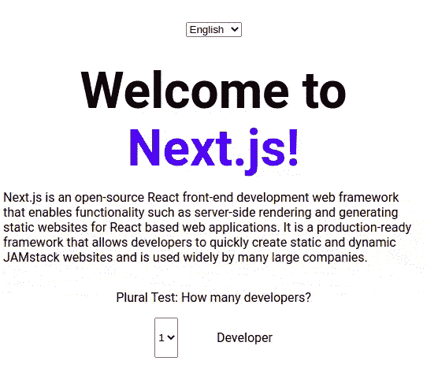

# Next.js 中的国际化完整指南

> 原文：<https://blog.logrocket.com/complete-guide-internationalization-nextjs/>

将 web 应用程序翻译成多种语言是一种常见的需求。在过去，创建多语言应用程序不是一件容易的事情，但是最近(多亏了 [Next.js](https://blog.logrocket.com/new-features-in-next-js-11/) 框架和 [Lingui.js](https://blog.logrocket.com/how-to-set-up-internationalization-in-react-using-lingui-js/) 库背后的人们),这项任务变得容易多了。

在这篇文章中，我将向您展示如何用前面提到的工具构建国际化的应用程序。我们将创建一个支持静态呈现和按需语言切换的示例应用程序。



你可以[在这里查看演示](https://linguijs-translation-demo.vercel.app/)和[分叉库](https://github.com/ivandotv/nextjs-translation-demo)。

## 设置

首先，我们需要用 TypeScript 创建 Next.js 应用程序。在终端中输入以下内容:

```
npx create-next-app --ts

```

接下来，我们需要安装所有需要的模块:

```
npm install --save-dev @lingui/cli @lingui/loader @lingui/macro babel-plugin-macros @babel/core
npm install --save @lingui/react make-plural

```

## Next.js 中的国际化路由

国际化 Next.js 应用程序的一个基本方面是国际化路由功能，因此具有不同语言偏好的用户可以进入不同的页面，并能够链接到这些页面。

此外，通过在网站头部添加适当的链接标签，你可以告诉谷歌在哪里可以找到所有其他语言版本的网页，以便进行正确的索引。

Next.js 支持两种国际化路由场景。

第一个是子路径路由，其中第一个子路径(www.myapp.com/{language}/blog)标记将要使用的语言。比如`[http://www.myapp.com/en/tasks](http://www.myapp.com/en/tasks)`或者`[http://www.myapp.com/es/tasks](http://www.myapp.com/es/tasks)`。在第一个例子中，用户将使用英语版本的应用程序(`en`)，在第二个例子中，用户将使用西班牙语版本(`es`)。

第二个是域路由。通过域路由，您可以拥有同一个应用程序的多个域，每个域将服务于不同的语言。比如`en.myapp.com/tasks`或者`es.myapp.com/tasks`。

### Next.js 如何检测用户的语言

当用户访问应用程序的根页面或索引页面时，Next.js 将尝试根据`Accept-Language`头自动检测用户喜欢的位置。如果设置了语言的位置(通过 Next.js 配置文件)，用户将被重定向到该路由。

如果不支持该位置，将为用户提供默认语言路线。该框架还可以使用 cookie 来确定用户的语言。

如果用户的浏览器中存在`NEXT_LOCALE` cookie，那么框架将使用该值来决定向用户提供哪种语言路由，而`Accept-Language`头将被忽略。

## 配置我们的示例 Next.js 应用程序

我们的演示将使用三种语言:默认英语(`en`)、西班牙语(`es`)和我的母语塞尔维亚语(`sr`)。

因为默认语言是英语，所以任何其他不支持的语言都将默认为英语。

我们还将使用`subpath`路由来传递页面，就像这样:

```
//next.config.js

module.exports = {
  i18n: {
    locales: ['en', 'sr', 'es', 'pseudo'],
    defaultLocale: 'en'
  }
}

```

在这个代码块中，`locales`是我们想要支持的所有语言，`defaultLocale`是默认语言。

你会注意到，在配置中，还有第四种语言:`pseudo`。我们稍后将对此进行更多讨论。

如您所见，这个 Next.js 配置很简单，因为该框架仅用于路由，没有其他用途。如何翻译你的应用取决于你自己。

## 配置 Lingui.js

对于实际的翻译，我们将使用 [Lingui.js](https://lingui.js.org/) 。

让我们设置配置文件:

```
// lingui.config.js

module.exports = {
  locales: ['en', 'sr', 'es', 'pseudo'],
  pseudoLocale: 'pseudo',
  sourceLocale: 'en',
  fallbackLocales: {
    default: 'en'
  },
  catalogs: [
    {
      path: 'src/translations/locales/{locale}/messages',
      include: ['src/pages', 'src/components']
    }
  ],
  format: 'po'
}

```

Lingui.js 的配置比 Next.js 更复杂，所以让我们一个一个地检查每个部分。

`locales`和`pseudoLocale`都是我们要生成的位置，哪些位置会分别作为伪位置。

`sourceLocale`后面跟有`en`,因为生成翻译文件时，默认字符串是英文的。这意味着，如果您不翻译某个字符串，它将保留默认或源语言。

`fallbackLocales`属性与 Next.js 的默认语言环境无关，它只是意味着如果你试图加载一个不存在的语言文件，Lingui.js 将退回到`default`语言(在我们的例子中是英语)。

`catalogs:path`是保存生成文件的路径。`catalogs:include`指示 Lingui.js 在哪里寻找需要翻译的文件。在我们的例子中，这是`src/pages`目录，我们所有的 React 组件都位于`src/components`中。

`format`是生成文件的格式。我们使用推荐的`po`格式，但也有其他格式，如`json`。

## Lingui.js 如何使用 React

有两种方法可以将 Lingui.js 与 React 一起使用。我们可以使用库提供的常规 React 组件，也可以使用库提供的 Babel 宏。

* * *

### 更多来自 LogRocket 的精彩文章:

* * *

Linqui.js 有专门的 React 组件和 Babel 宏。在 Babel 处理代码生成最终的 JavaScript 代码之前，宏会对代码进行转换。

如果你想知道这两者之间的区别，看看这些例子:

```
//Macro
import { Trans } from '@lingui/macro'

function Hello({ name }: { name: string }) {
  return <Trans>Hello {name}</Trans>
}

//Regular React component
import { Trans } from '@lingui/react'

function Hello({ name }: { name: string }) {
  return <Trans id="Hello {name}" values={{ name }} />
}

```

可以看到，宏和生成的 React 组件之间的代码非常相似。宏使我们能够省略`id`属性并编写更干净的组件。

现在让我们为其中一个组件设置翻译:

```
// src/components/AboutText.jsx

import { Trans } from '@lingui/macro'

function AboutText() {
  return (
    <p>
      <Trans id="next-explanation">My text to be translated</Trans>
    </p>
  )
}

```

在我们完成组件之后，下一步是从源代码中提取文本，这些文本需要被翻译成称为消息目录的外部文件。

消息目录是您希望交给翻译人员进行翻译的文件。每种语言都会生成一个文件。

为了提取所有消息，我们将通过命令行使用 Lingui.js 并运行:

```
npm run lingui extract

```

输出应该如下所示:

```
Catalog statistics:
┌──────────┬─────────────┬─────────┐
│ Language │ Total count │ Missing │
├──────────┼─────────────┼─────────┤
│ es       │      1      │    1    │
│ en       │      1      │    0    │
│ sr       │      1      │    1    │
└──────────┴─────────────┴─────────┘

(use "lingui extract" to update catalogs with new messages)
(use "lingui compile" to compile catalogs for production)

```

`Total count`是需要翻译的消息总数，在我们的代码中只有一条来自`AboutText.jsx` (ID: `next-explanation`)的消息。

`Missing`是需要翻译的消息数量。因为英语是默认语言，所以`en`版本没有丢失消息。但是，我们缺少塞尔维亚语和西班牙语的翻译。

`en`生成的文件的内容将是这样的:

```
#: src/components/AboutText.jsx:5
msgid "next-explanation"
msgstr "My text to be translated"

```

`es`文件的内容如下:

```
#: src/components/AboutText.jsx:5
msgid "next-explanation"
msgstr ""

```

您会注意到`msgstr`是空的。这是我们需要添加翻译的地方。如果我们将该字段留空，那么在运行时，引用这个`msgid`的所有组件都将用默认语言文件中的字符串填充。

让我们翻译西班牙文文件:

```
#: src/components/AboutText.jsx:5
msgid "next-explanation"
msgstr "Mi texto para ser traducido"

```

现在，如果我们再次运行`extract`命令，输出如下:

```
Catalog statistics:
┌──────────┬─────────────┬─────────┐
│ Language │ Total count │ Missing │
├──────────┼─────────────┼─────────┤
│ es       │      1      │    0    │
│ en       │      1      │    0    │
│ sr       │      1      │    1    │
└──────────┴─────────────┴─────────┘

(use "lingui extract" to update catalogs with new messages)
(use "lingui compile" to compile catalogs for production)

```

注意，西班牙语的`Missing`字段是`0`，这意味着我们已经翻译了西班牙语文件中所有缺失的字符串。

这是翻译的要旨，现在让我们开始将 Lingui.js 与 Next.js 整合。

### 编译消息

为了让应用程序使用带翻译的文件(`.po`文件)，需要将它们编译成 JavaScript。为此，我们需要使用`lingui compile` CLI 命令。

命令运行完毕后，您会注意到在`locale/translations`目录中有每个地区的新文件(`es.js`、`en.js`和`sr.js`):

```
├── en
│   ├── messages.js
│   └── messages.po
├── es
│   ├── messages.js
│   └── messages.po
└── sr
    ├── messages.js
    └── messages.po

```

这些是将要加载到应用程序中的文件。将这些文件视为构建工件，不要用源代码管理来管理它们；只有`.po`文件应该添加到源代码控制中。

### 使用复数

另一件肯定会出现的事情是处理单数或复数单词(在演示中，您可以用 **Developers** dropdown 元素来测试)。

Lingui.js 让这变得非常简单:

```
import { Plural } from '@lingui/macro'

function Developers({ developerCount }) {
  return (
    <p>
      <Plural
        value={developerCount}
        one="Whe have # Developer"
        other="We have # Developers"
      />
    </p>
  )
}

```

当`developerCount`值为`1`时，`Plural`组件会呈现“我们有 1 个开发者”

你可以在 Lingui.js 文档中阅读更多关于复数的内容。

现在，不同的语言有不同的多元化规则。为了适应这些规则，我们稍后将使用一个名为 [`make-plural`](https://www.npmjs.com/package/make-plural) 的附加包。

## Next.js 和 Lingui.js 集成

现在是最难的部分:将 Lingui.js 与 Next.js 框架集成。

首先，我们要初始化 Lingui.js:

```
// utils.ts

import type { I18n } from '@lingui/core'
import { en, es, sr } from 'make-plural/plurals'

//anounce which locales we are going to use and connect them to approprite plural rules
export function initTranslation(i18n: I18n): void {
  i18n.loadLocaleData({
    en: { plurals: en },
    sr: { plurals: sr },
    es: { plurals: es },
    pseudo: { plurals: en }
  })
}

```

因为整个应用程序只需初始化一次，所以我们将从 Next.js `[_app](https://nextjs.org/docs/advanced-features/custom-app)`组件调用该函数，该组件按照设计包装了所有其他组件:

```
// _app.tsx

import { i18n } from '@lingui/core'
import { initTranslation } from '../utils'

//initialization function
initTranslation(i18n)

function MyApp({ Component, pageProps }) {
  // code ommited
}

```

Lingui.js 代码初始化后，我们需要加载并激活适当的语言。

同样，我们将使用`_app`来表示，就像这样:

```
// _app.tsx

function MyApp({ Component, pageProps }) {
  const router = useRouter()
  const locale = router.locale || router.defaultLocale
  const firstRender = useRef(true)

  if (pageProps.translation && firstRender.current) {
    //load the translations for the locale
    i18n.load(locale, pageProps.translation)
    i18n.activate(locale)
    // render only once
    firstRender.current = false
  }

  return (
    <I18nProvider i18n={i18n}>
      <Component {...pageProps} />
    </I18nProvider>
  )
}

```

所有使用翻译的组件都需要在 Lingui.js `<I18Provider>`组件下。为了确定加载哪种语言，我们将研究 Next.js 路由器`locale`的属性。

翻译通过`pageProps.translation`传递给组件。如果您想知道`pageProps.translation`属性是如何创建的，我们接下来将解决这个问题。

在呈现之前，`src/pages`中的每个页面都需要加载适当的翻译文件，该文件位于`src/translations/locales/{locale}`中。

因为我们的页面是静态生成的，所以我们将通过 Next.js `getStatisProps`函数来完成:

```
// src/pages/index.tsx

export const getStaticProps: GetStaticProps = async (ctx) => {
  const translation = await loadTranslation(
    ctx.locale!,
    process.env.NODE_ENV === 'production'
  )

  return {
    props: {
      translation
    }
  }
}

```

如您所见，我们正在用`loadTranslation`函数加载翻译文件。看起来是这样的:

```
// src/utils.ts

async function loadTranslation(locale: string, isProduction = true) {
  let data
  if (isProduction) {
    data = await import(`./translations/locales/${locale}/messages`)
  } else {
    data = await import(
      `@lingui/loader!./translations/locales/${locale}/messages.po`
    )
  }

  return data.messages
}

```

这个函数有趣的地方在于，它根据我们是否在生产中运行 Next.js 项目来有条件地加载文件。

这是 Lingui.js 的伟大之处之一；当我们在生产中时，我们将加载编译的(`.js`)文件，但是当我们在开发模式中时，我们将加载源文件(`.po`)。一旦我们改变了`.po`文件中的代码，它将立即反映在我们的应用程序中。

记住，`.po`文件是我们编写翻译的源文件，然后编译成普通的`.js`文件，用常规的 JavaScript `import`语句加载到产品中。要不是专门的 [`@lingui/loader!`](https://lingui.js.org/ref/loader.html?highlight=loader#api-reference-webpack-loader-lingui-loader) webpack 插件，我们就要不断手动编译翻译文件，才能在开发的同时看到变化。

## 动态改变语言

到目前为止，我们处理了静态生成，但是我们还希望能够在运行时通过下拉菜单动态地更改语言。

首先，我们需要修改`_app`组件来观察位置变化，并在`router.locale`值变化时开始加载适当的翻译。这非常简单；我们需要做的就是使用`useEffect`钩子。

这是最后一个`_app`组件:

```
// _app.tsx
// import statements omitted

initTranslation(i18n)

function MyApp({ Component, pageProps }) {
  const router = useRouter()
  const locale = router.locale || router.defaultLocale
  const firstRender = useRef(true)

  // run only once on the first render (for server side)
  if (pageProps.translation && firstRender.current) {
    i18n.load(locale, pageProps.translation)
    i18n.activate(locale)
    firstRender.current = false
  }

  // listen for the locale changes
  useEffect(() => {
    if (pageProps.translation) {
      i18n.load(locale, pageProps.translation)
      i18n.activate(locale)
    }
  }, [locale, pageProps.translation])

  return (
    <I18nProvider i18n={i18n}>
      <Component {...pageProps} />
    </I18nProvider>
  )
}

```

接下来，我们需要构建下拉组件。每次用户从下拉菜单中选择不同的语言时，我们都要加载相应的页面。

为此，我们将使用 Next.js `[router.push](https://nextjs.org/docs/api-reference/next/router#routerpush)`方法来指示 Next.js 更改页面的区域设置(这将依次被我们在`_app`组件中创建的`useEffect`获取):

```
// src/components/Switcher.tsx

import { useRouter } from 'next/router'
import { useState, useEffect } from 'react'
import { t } from '@lingui/macro'

type LOCALES = 'en' | 'sr' | 'es' | 'pseudo'

export function Switcher() {
  const router = useRouter()
  const [locale, setLocale] = useState<LOCALES>(
    router.locale!.split('-')[0] as LOCALES
  )

  const languages: { [key: string]: string } = {
    en: t`English`,
    sr: t`Serbian`,
    es: t`Spanish`
  }

  // enable 'pseudo' locale only for development environment
  if (process.env.NEXT_PUBLIC_NODE_ENV !== 'production') {
    languages['pseudo'] = t`Pseudo`
  }

  useEffect(() => {
    router.push(router.pathname, router.pathname, { locale })
  }, [locale, router])

  return (
    <select
      value={locale}
      onChange={(evt) => setLocale(evt.target.value as LOCALES)}
    >
      {Object.keys(languages).map((locale) => {
        return (
          <option value={locale} key={locale}>
            {languages[locale as unknown as LOCALES]}
          </option>
        )
      })}
    </select>
  )
}

```

## 假定位

现在，我将处理您在示例中看到的所有`pseudo`代码。

伪本地化是一种软件测试方法，它用改变的版本替换文本字符串，同时仍然保持字符串的可见性。这使得我们很容易发现 Lingui.js 组件或宏中遗漏了哪些字符串。

因此，当用户切换到`pseudo`语言环境时，应用程序中的所有文本都应该像这样修改:

```
Account Settings --> [!!! Àççôûñţ Šéţţîñĝš !!!]

```

如果有任何文本没有被修改，这意味着我们可能忘记这样做。当谈到 Next.js 时，框架没有特殊的`pseudo`本地化的概念，它只是另一种要路由到的语言。但是，Lingui.js 需要特殊的配置。

除此之外，`pseudo`只是我们可以切换到的另一种语言。`pseudo`区域设置只能在`development`模式下启用。

## 结论

在本文中，我向您展示了如何翻译和国际化 Next.js 应用程序。我们已经完成了多种语言的静态渲染和按需语言切换。我们还创建了一个很好的开发工作流程，在这个流程中，我们不必在每次更改时手动编译翻译字符串。接下来，我们实现了一个`pseudo`语言环境，以便直观地检查是否有遗漏的翻译。

如果您有任何问题，请在评论中发表，或者如果您发现演示中的代码有任何问题，请确保在 [github 库](https://github.com/ivandotv/nextjs-translation-demo)上打开一个问题。

## [LogRocket](https://lp.logrocket.com/blg/nextjs-signup) :全面了解生产 Next.js 应用

调试下一个应用程序可能会很困难，尤其是当用户遇到难以重现的问题时。如果您对监视和跟踪状态、自动显示 JavaScript 错误、跟踪缓慢的网络请求和组件加载时间感兴趣，

[try LogRocket](https://lp.logrocket.com/blg/nextjs-signup)

.

[](https://lp.logrocket.com/blg/nextjs-signup)[](https://lp.logrocket.com/blg/nextjs-signup)

LogRocket 就像是网络和移动应用的 DVR，记录下你的 Next.js 应用上发生的一切。您可以汇总并报告问题发生时应用程序的状态，而不是猜测问题发生的原因。LogRocket 还可以监控应用程序的性能，报告客户端 CPU 负载、客户端内存使用等指标。

LogRocket Redux 中间件包为您的用户会话增加了一层额外的可见性。LogRocket 记录 Redux 存储中的所有操作和状态。

让您调试 Next.js 应用的方式现代化— [开始免费监控](https://lp.logrocket.com/blg/nextjs-signup)。