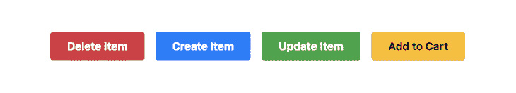
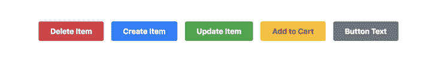

# 反应默认道具的完整指南

> 原文：<https://blog.logrocket.com/complete-guide-react-default-props/>

***编者按**:本文最后更新于 2022 年 6 月 6 日，旨在解决一个不再有效维护的包。*

React 是一个非常强大的基于组件的 JavaScript 库，用于构建可以在不同平台上运行的可伸缩应用程序，如服务器、web、移动和桌面。如今，在这些平台上运行的数千个应用程序都是基于 React 构建的。

在本文中，我们将讨论为 React 组件设置默认属性。本指南中的截图显示了使用一些基本的 Bootstrap 4 CSS 样式呈现的视图。为了获得类似的结果，您必须运行带有一些附加引导样式的代码片段。我们开始吧！

## 什么是 React 组件？

React 应用程序通常由几个独立的组件组成，这些组件构成了应用程序的 UI。React 组件只是一个 JavaScript 函数，它接受一个称为 props 的任意输入对象，并返回 React 元素，这些元素描述了应该在 UI 上呈现的内容:

```
// Simple React Component
function ReactHeader(props) {
  return <h1>React {props.version} Documentation</h1>
}

```

上面的例子定义了一个非常简单的`ReactHeader`组件，该组件呈现一个包含指定 React 版本文档标题的`<h1>`元素。它使用 JSX 语法以声明的方式创建组件的 DOM 元素层次结构。你可以在官方文档中了解更多关于使用 [JSX 和 React](https://reactjs.org/docs/introducing-jsx.html) 的信息。

如果没有 JSX，前面的代码片段将如下所示:

```
// Simple React Component (without JSX)
function ReactHeader(props) {
  return React.createElement('h1', null, `React ${props.version} Documentation`);
}

```

使用 React 不需要 JSX。例如，如果您打算在没有任何形式的编译的情况下使用 React，那么 JSX 就不是合适的选择。事实上，React 组件中的每一个 JSX 在组件呈现之前都会被编译成它的`createElement`等价物。然而，在本指南中，我们将尽可能在所有组件中使用 JSX。

从前面的代码片段来看，很明显,`ReactHeader`组件需要向其传递一个`version`属性。`ReactHeader`组件可以呈现在 DOM 上的任意元素中，如下所示:

```
// Render a React Component
ReactDOM.render(, document.getElementById('root'));

```

请注意，`ReactHeader`组件已经被渲染，并且`version`属性被设置为`16`。目前，在`ReactHeader`组件中一切似乎都工作正常，如下面的截图所示:


## React 中的默认道具是什么？

当`ReactHeader`组件在没有`version`属性的情况下被渲染时，`version`属性不会被传递:

```
// Render the ReactHeader Component
ReactDOM.render(, document.getElementById('root'));

```

因此，组件中对`props.version`的引用是`undefined`，如下图所示:


你可以通过[应用条件渲染](https://blog.logrocket.com/conditional-rendering-in-react-c6b0e5af381e/)来处理这个问题。每当所需的属性未被传递或无效时，您可以阻止组件进行渲染，而不进行任何渲染:

```
// Simple React Component
function ReactHeader(props) {
  return (
    Number.isFinite(props.version)
      ? <h1>React {props.version} Documentation</h1>
      : null
  );
}

```

或者，您可以为组件设置默认属性。默认属性是为组件不需要的属性提供默认值的一种方式。例如，如果您有一个接受用户名的组件，您可以使用一个默认属性来提供一个名称，如果该用户没有该属性的话:

```
const UserName = ({ name = 'User' }) => <h3 className="username">{name}</h3>

```

默认属性可用于定义您想要为组件设置的任何属性，不管值是否实际上是从父组件传入的。使用默认属性时，当您从父组件传入值时，仍然可以覆盖默认属性对象中指定的值。

例如，`<UserName name="John Doe" />`将呈现`John Doe`，即使默认值被指定为`User`。从父组件传递的值优先于默认值。

根据 [React 文档](https://reactjs.org/docs/react-component.html)，`defaultProps`可以定义为组件类本身上的一个属性来设置该类的默认属性。在我们前面的例子中，只要没有传递，您就可以调整组件来使用默认的`version`属性值:

```
// With JSX
function ReactHeader(props) {
  return <h1>React {props.version || 16} Documentation</h1>
}

// OR
// Without JSX
function ReactHeader(props) {
  return React.createElement('h1', null, `React ${props.version || 16} Documentation`);
}

```

逻辑`OR`操作符`||`用于在`version`道具未通过时设置回退值。`version`道具的默认值为`16`。有了这个改变，现在一切都按预期工作了。

## 如何在 React 中设置默认道具

如果渲染组件时没有指定属性，那么将使用默认属性。设置默认道具的一种方法是析构 props 对象，如下所示:

```
const Text = (props) => {
  const {fontSize = "20px"} = props;
  return <p style={{ fontSize }}>{props.children}</p>
}

```

当你想在用户没有指定的情况下有一个后备道具时，缺省道具是有用的。例如，您可能希望段落组件具有默认字体大小。如果用户没有指定字体大小，那么文本的字体大小将回到默认值。

在本指南中，我们将介绍为不同类型的 React 组件设置默认属性的三种方式。

## 在 React 中使用`React.createClass()`

在 React 中，类最适合于构建有状态组件，在这种情况下，您需要在组件内部维护状态，或者在您希望利用组件的生命周期方法的情况下。

React 最初发布时，类还没有成为 JavaScript 中的一个东西。然而，React 提供了用于创建类组件的`React.createClass()` API。随着时间的推移，这个 API 被弃用，并最终从 React 中移除以支持 ES6 类。

如果您使用的是早于 15.5.0 的 React 版本，您可以使用`React.createClass()` API 创建一个简单的 React 组件，如下所示:

```
import React from 'react';

/**
 * ThemedButton Component
 * Using React.createClass()
 *
 * Renders a Bootstrap themed button element.
 */

const ThemedButton = React.createClass({

  // Component display name
  displayName: 'ThemedButton',

  // render() method
  render() {
    const { theme, label, ...props } = this.props;
    return { label }
  }

});

```

上面的代码片段使用`React.createClass()` API 创建了一个非常简单的`ThemedButton`组件。`ThemedButton`组件基本上根据传递给它的道具呈现一个引导主题的按钮。

为了让`ThemedButton`组件正确呈现按钮，需要传递一个 `theme` 道具和一个 `label` 道具。现在，您可以在 React 应用程序中渲染一组主题按钮，如下所示:

```
import React from 'react';
import ReactDOM from 'react-dom';

// [...ThemedButton component here]

function App(props) {
  return (
    <div>
      <ThemedButton theme="danger" label="Delete Item" />
      <ThemedButton theme="primary" label="Create Item" />
      <ThemedButton theme="success" label="Update Item" />
      <ThemedButton theme="warning" label="Add to Cart" />
      <ThemedButton />
    </div>
  );
}

const rootElement = document.getElementById('root');
ReactDOM.render(<App />, rootElement);

```

请注意，`ThemedButton`组件已经在应用程序中呈现了五次。第五次，`ThemedButton`没有通过任何道具。该应用程序看起来像下面的截图:



从上面的截图中，您会注意到第五个按钮没有在视图中显示出来，因为它没有使用`theme`和`label`道具。因此，我们需要为`ThemedButton`组件设置默认道具。

对于使用`React.createClass()` API 创建的组件，您可以通过向对象文字添加一个名为`getDefaultProps`的方法来设置默认属性。`getDefaultProps()`方法应该返回一个代表组件默认属性集的对象:

```
const ThemedButton = React.createClass({

  // Component display name
  displayName: 'ThemedButton',

  // render() method
  render() {
    const { theme, label, ...props } = this.props;
    return <button className={`btn btn-${theme}`} {...props}>{ label }</button>
  },

  // Set default props
  getDefaultProps() {
    return {
      theme: "secondary",
      label: "Button Text"
    };
  }

})

```

在上面的代码片段中，已经为`ThemedButton`组件设置了默认属性。`theme`道具不通过默认为`"secondary"`，而`label`道具默认为`"Button Text"`。使用默认的道具设置，应用程序现在应该看起来像下面的截图:



## React 类组件中的默认属性

在 React 15 . 5 . 0 以后的版本中，您可以通过利用 ES6 类语法来创建类组件。使用 ES6 类语法，`ThemedButton`组件将如下所示:

```
import React, { Component } from 'react';

class ThemedButton extends Component {

  // render() method
  render() {
    const { theme, label, ...props } = this.props;
    return <button className={`btn btn-${theme}`} {...props}>{ label }</button>
  }

}

```

对于使用 ES6 类语法创建的 React 组件，您可以通过向 component 类添加一个名为`defaultProps`的静态属性来设置默认属性。静态属性应该被设置为一个代表组件默认属性的对象。您可以通过在类体之外的组件类本身上定义`defaultProps`来做到这一点，如下面的代码片段所示:

```
class ThemedButton extends React.Component {
  render() {
    // ...implement render method
  }
}

// Set default props
ThemedButton.defaultProps = {
  theme: "secondary",
  label: "Button Text"
};

```

通过将静态类属性和方法添加到 ECMAScript 规范中，您可以选择指定`defaultProps`，如以下代码所示:

```
class ThemedButton extends React.Component {
  render() {
    // ...implement render method
  }

  // Set default props
  static defaultProps = {
    theme: "secondary",
    label: "Button Text"
  }
}

```

## React 功能组件中的默认属性

在 React 中，函数语法适用于只呈现元素而不跟踪其状态或生命周期的组件。这些组件通常被称为功能组件或无状态功能组件。

当被重写为无状态功能组件时，`ThemedButton`组件将类似于下面的代码:

```
import React from 'react';

function ThemedButton(props) {
  const { theme, label, ...restProps } = props;
  return <button className={`btn btn-${theme}`} {...restProps}>{ label }</button>
}

```

与类组件一样，通过向组件函数本身添加一个名为`defaultProps`的静态属性，可以在功能组件上设置默认属性:

```
function ThemedButton(props) {
  // ...render component
}

// Set default props
ThemedButton.defaultProps = {
  theme: "secondary",
  label: "Button Text"
};

```

或者，使用 ES6 对象析构语法，您可以用默认值析构功能组件的属性。对于析构的 props，`ThemedButton`组件看起来像下面的代码:

```
import React from 'react';

// METHOD 1:
// Default Props with destructuring
function ThemedButton(props) {
  const { theme = 'secondary', label = 'Button Text', ...restProps } = props;
  return <button className={`btn btn-${theme}`} {...restProps}>{ label }</button>
}

// METHOD 2:
// More compact destructured props
function ThemedButton({ theme = 'secondary', label = 'Button Text', ...restProps }) {
  return <button className={`btn btn-${theme}`} {...restProps}>{ label }</button>
}

```

## 结论

默认属性是使 React 组件可重用且更易于维护的好方法。在本指南中，我们已经介绍了什么是默认属性，探索了为不同类型的 React 组件设置默认属性的三种方法。

我们还学习了如何使用默认属性为可选属性提供后备值。记住这些提示，您应该能够在自己的 React 项目中充分利用默认道具。

## 使用 LogRocket 消除传统反应错误报告的噪音

[LogRocket](https://lp.logrocket.com/blg/react-signup-issue-free)

是一款 React analytics 解决方案，可保护您免受数百个误报错误警报的影响，只针对少数真正重要的项目。LogRocket 告诉您 React 应用程序中实际影响用户的最具影响力的 bug 和 UX 问题。

[ ](https://lp.logrocket.com/blg/react-signup-general) [  ](https://lp.logrocket.com/blg/react-signup-general) [LogRocket](https://lp.logrocket.com/blg/react-signup-issue-free)

自动聚合客户端错误、反应错误边界、还原状态、缓慢的组件加载时间、JS 异常、前端性能指标和用户交互。然后，LogRocket 使用机器学习来通知您影响大多数用户的最具影响力的问题，并提供您修复它所需的上下文。

关注重要的 React bug—[今天就试试 LogRocket】。](https://lp.logrocket.com/blg/react-signup-issue-free)