# React Native 中的文本输入完整指南

> 原文：<https://blog.logrocket.com/complete-guide-textinput-react-native/>

考虑这样一种情况，您想要检索用户的登录凭证。对于这个用例，有一个允许客户端在应用程序中输入文本数据的组件是合适的。

这就是 React Native 的`[TextInput](https://reactnative.dev/docs/textinput)`组件的用武之地。除了字符串，我们甚至可以定制它来接受密码和数字。

在本文中，您将学习 React Native 的`TextInput`组件的基础知识。随后，我们还将根据我们的需要定制它的属性。

这将是本指南的结果:

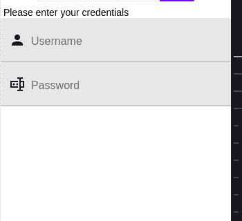

## 开始使用 TextInput

要使用 Expo 具体化一个应用程序，请运行以下终端命令:

```
expo init textinput-tutorial

```

在您的项目目录中，安装`react-native-paper`依赖项，如下所示:

```
npm install react-native-paper

```

## 文本输入基础

以下代码片段呈现了一个基本文本框:

```
import { StyleSheet, Text, View, TextInput } from "react-native";
export default function App() {
  return (
    <View style={styles.container}>
      <TextInput style={styles.input} />
    </View>
  );
}
const styles = StyleSheet.create({
   input: {
    backgroundColor: "white"
  },
//...
});

```

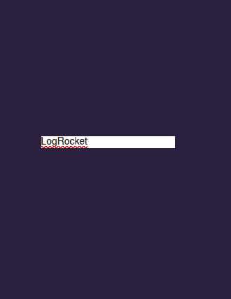

你可以让你的元素看起来更好，就像这样:

```
const styles = StyleSheet.create({
  input: {
    borderColor: "gray",
    width: "100%",
    borderWidth: 1,
    borderRadius: 10,
    padding: 10,
  },
});

```

在上面这段代码中，我们设计了文本框的边框，并给了它一些填充。此外，我们使用了`borderRadius`属性。这告诉 React 添加圆角边框。

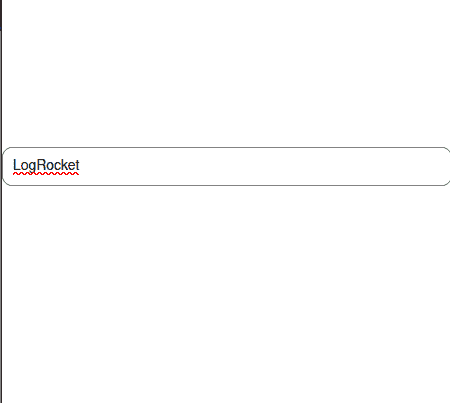

现在看起来肯定更吸引人了！

## 用户化

### 添加占位符

当您希望提供提示和说明来帮助用户填写数据时，添加占位符非常有用。
为此，使用`placeholder`道具:

```
<TextInput style={styles.input} placeholder="John" />

```

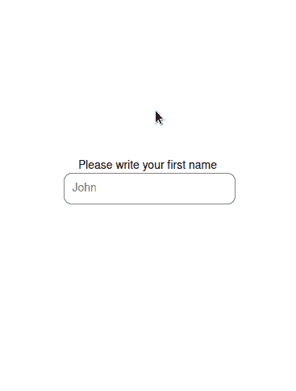

### 多行

`TextInput`组件也可以接受多行文本。这对于获取用户反馈等情况非常有用:

```
<TextInput style={styles.input} multiline={true} />

```

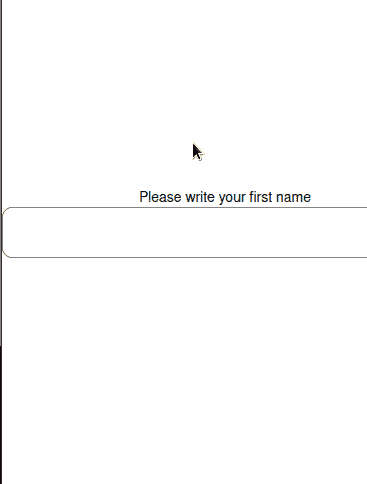

### 最大长度

想限制用户的输入长度？这可以通过`maxLength`道具实现:

```
<TextInput style={styles.input} maxLength={4} />

```

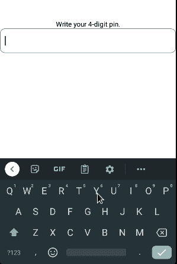

### 不可更改的文本框

您可以使用`editable`属性阻止元素的输入:

```
<TextInput
  style={styles.input}
  editable={false}
  value="This cannot be edited"
/>

```

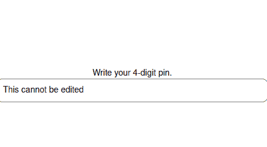

### 更改键盘类型

考虑这样一种情况，你正在询问客户的电话号码。在这里，显示数字键盘而不是默认键盘是明智的。

要更改键盘类型，请像这样使用`keyboardType`:

```
<TextInput style={styles.input} keyboardType="phone-pad"/>

```

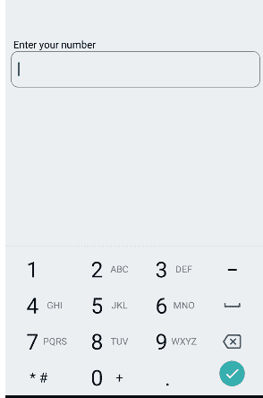

要获得用户的电子邮件地址，合适的`keyboardType`应该是`email-address`:

```
<TextInput style={styles.input} keyboardType="email-address"/>

```

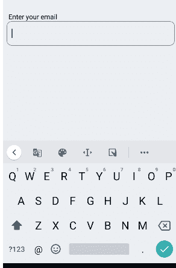

### 获取密码

当涉及到密码时，我们可以定制我们的文本字段，以便输入的数据是模糊的。为此，我们将像这样使用`secureTextEntry`属性:

```
<TextInput style={styles.input} secureTextEntry={true}/>

```


## 记录用户的输入

### 每次文本更改后

假设您有一个作为搜索栏的文本框。在这种情况下，您可能希望在每次输入值发生变化时捕获数据。

你可以通过`onChangeText`道具来实现。它是一个回调函数，在文本字段检测到更改时运行:

```
export default function App() {
  const [name, setName] = useState("");
  return (
    <View style={styles.container}>
      <Text>Write name.</Text>
      <TextInput
        style={styles.input}
        placeholder="John Doe"
        onChangeText={(value) => setName(value)}
      />
      <Text>Welcome: {name}</Text>
    </View>
  );
}

```

在这段代码中，我们告诉 React Native 将`name`钩子更新为`TextInput`的值。最后，我们显示了`name`变量的值。

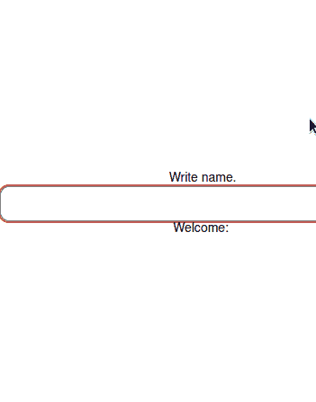

### 当用户提交时

假设您有一个表单，并且希望仅在用户提交表单时保存数据。

要实现这一点，您可以使用`onSubmitEditing`回调:

```
export default function App() {
  const [name, setName] = useState("");
  return (
    <View style={styles.container}>
      <Text>Write name.</Text>
      <TextInput
        style={styles.input}
        onSubmitEditing={(value) => setName(value.nativeEvent.text)}
      />
      <Text>Welcome, {name}!</Text>
    </View>
  );
}

```

在上面这段代码中，如果用户按下 return 键，React Native 会将`name`钩子变量更新为输入值。

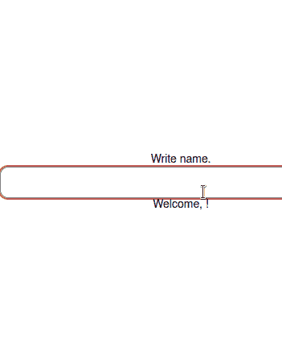

## 使用 React Native Paper 的文本字段

React 本地库允许我们在文本框的任何一侧显示图标。这会让你的界面看起来更现代。

以下代码片段呈现了一个带有文本字段的图形:

```
import { TextInput } from "react-native-paper";
//extra code removed...
return (
  <View>
    <Text> Please enter your credentials</Text>
    <TextInput label="Username" left={<TextInput.Icon name="account" />} />
    <TextInput
      label="Password"
      secureTextEntry
      left={<TextInput.Icon name="form-textbox-password" />}
    />
  </View>
);

```

属性告诉 React Native 在左边显示想要的图标。
这将是输出:

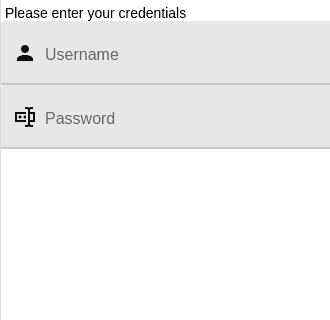

### 设计模式

React Native Paper 提供了两种有助于主题化的设计模式:

*   `flat`:创建一个平面文本输入，在书写文本下加下划线。
*   `outlined`:生成一个带有轮廓的`TextInput`组件:

```
<View>
  <Text>Outlined TextInput:</Text>
  <TextInput
    label="Username"
    left={<TextInput.Icon name="account" />}
    mode="outlined"
    style={{ margin: 10 }}
  />
  <Text>Flat TextInput:</Text>
  <TextInput
    label="Email"
    left={<TextInput.Icon name="email" />}
    mode="flat"
    style={{ margin: 10 }}
  />
</View>

```

这里，我们创建了两个`TextInput`实例。其中一个有一个`outlined`模式，后者使用一个`flat`模式。

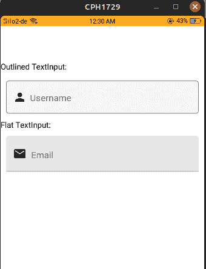

### 错误样式

该库还提供了一个用错误样式修饰我们的`TextInput`的`error`道具。这对于应用程序必须在用户输入错误时通知用户的情况非常有用:

```
const [userError, setUserError] = useState(false);
return (
  <View>
    <TextInput
      label="Email"
      left={<TextInput.Icon name="email" />}
      style={{ margin: 10 }}
      error={userError} //the error prop will depend on our userError Hook
    />
    {/*If the user presses this button, the userError Hook's value will reset.*/}
    <Button onPress={() => setUserError((value) => !value)}>Press</Button>
    <StatusBar />
  </View>
);

```

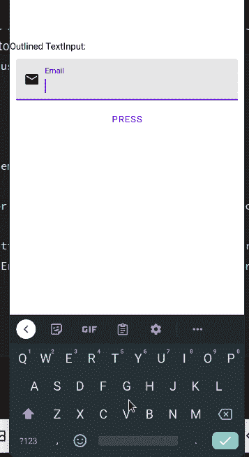

### 活动下划线颜色

`activeUnderlineColor`和`inactiveUnderlineColor`道具修改我们输入的颜色。这对增强应用程序的外观和主题非常有用:

```
<View>
  <Text style={{ paddingTop: 80 }}>Outlined TextInput:</Text>
  <TextInput
    label="Email"
    left={<TextInput.Icon name="email" />}
    style={{ margin: 10 }}
    activeUnderlineColor="green" //when this TextInput is active, change its accent color to green
    underlineColor="purple" //when inactive, set color to purple
  />
  <TextInput
    label="Email"
    left={<TextInput.Icon name="email" />}
    style={{ margin: 10 }}
    activeUnderlineColor="yellow"
    underlineColor="red"
  />
</View>

```

## 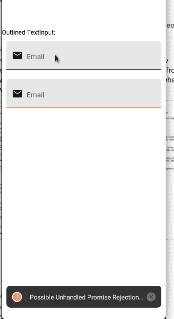

## 结论

在本指南中，您学习了如何在 React 本地库中使用和记录`TextInput`。在我自己的应用程序中，我使用 React Native Paper，因为它开箱后在所有平台上都很好看。

非常感谢您的阅读！

## [LogRocket](https://lp.logrocket.com/blg/react-native-signup) :即时重现 React 原生应用中的问题。

[](https://lp.logrocket.com/blg/react-native-signup)

[LogRocket](https://lp.logrocket.com/blg/react-native-signup) 是一款 React 原生监控解决方案，可帮助您即时重现问题、确定 bug 的优先级并了解 React 原生应用的性能。

LogRocket 还可以向你展示用户是如何与你的应用程序互动的，从而帮助你提高转化率和产品使用率。LogRocket 的产品分析功能揭示了用户不完成特定流程或不采用新功能的原因。

开始主动监控您的 React 原生应用— [免费试用 LogRocket】。](https://lp.logrocket.com/blg/react-native-signup)