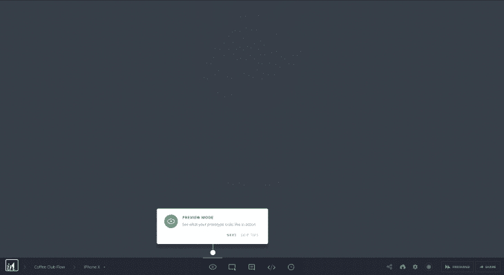
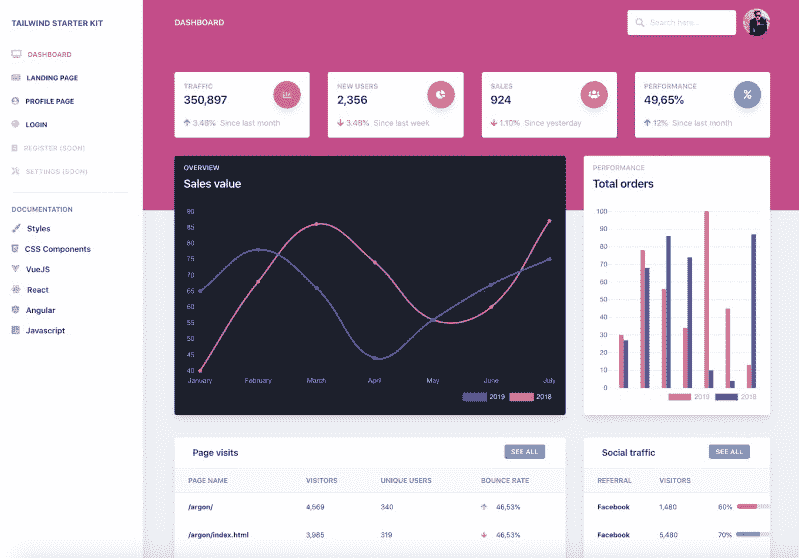

# 在 React apps - LogRocket 博客上构建产品之旅的完整指南

> 原文：<https://blog.logrocket.com/complete-guide-to-build-product-tours-on-your-react-apps/>

### 介绍

听说过产品 UI 中的旅游吗？



> 产品之旅是自我解释的提示用户界面，帮助网站用户分解复杂的 UX，使其易于使用。

产品游览在 B2B 产品用户界面中起着至关重要的作用。它有助于节省客户支持时间，避免重复询问有关 UX 的“使用方法”问题。

## 产品之旅解决了哪些问题？

产品之旅帮助用户了解新的复杂的 UX，并帮助用户熟悉 UI 功能。它们对于在产品 UI 上展示新的更新也很有用，并且可以为客户成功团队节省时间。

Slack、Trello、Asana 和 Invision 是一些大型产品，它们使用产品旅游来满足不同的 UX 需求。

产品参观的间接替代方案，包括关于产品功能的常见问题解答、产品视频演示和参观，以及按需提示 UI。

然而，视频参观或常见问题解答的影响程度不如在线产品参观。

大多数用户不会在用户界面之外寻找教程。

另一方面，按需提示 UI 类似于产品游览，可以产生类似的影响。

在本文中，您将学习如何为 React 应用程序构建一个简单的产品之旅。在构建之前，您首先需要了解现有的 React 库。

### 现有的 React 产品导览库

尽管很多公司都使用产品游览，但是基于 React 的游览 ui 并不多。一些图书馆是 React Tour 和 React Joyride。

## React 旅游图书馆

[React Tour](https://github.com/elrumordelaluz/reactour) 在 Github 上约有 1.4k 颗星，活跃程度中等。

如果你需要一个简单的没有太多定制的产品之旅，它有非常好的用户界面。如果是这样的话，React Tour UI 就足够好了。

你可以点击查看 React Tour [的演示。](https://reactour.js.org/)

### 它是如何工作的

使用 React Tour，您可以将每个步骤的类名选择器和内容传递给组件。

它将基于按钮点击或者在安装组件之后呈现游览 UI。对于静态页面和 UI 来说很简单:

```
const steps = [
  {
    selector: '.tour-first-step',
    content: 'This is the first Step',
  },
  {
    selector: '.tour-second-step',
    content: 'This is the second Step',
  }
  // ...
]
```

然而，如果你需要为一个自定义行为进行自定义，那么它就不会很好地工作。该组件非常死板，并且样式暴露得不够好，无法重用。

一个缺点是，如果你不在你的项目中使用`styled-components`，那么你在使用这个组件时就不会有任何运气。没有其他方法——库对样式化的组件有一个硬依赖。

此外，如果类名选择器不在当前屏幕中，那么 React Tour 只在屏幕中央显示不匹配的内容。没有办法隐瞒。

覆盖这种行为的唯一方法是通过我们自己的逻辑触发接下来的步骤，但是这违背了组件的目的。

这几乎和为产品之旅编写自己的组件一样复杂。

* * *

### 更多来自 LogRocket 的精彩文章:

* * *

当你不想定制太多，或者你想要有漂亮的用户界面和 UX 的基本旅游功能时，React Tour 真的会大放异彩。

它也适用于静态内容或动态内容，其中选择器标签总是存在于 UI 上。

## React Joyride 库

下一个著名的 React 产品游览库是 [React Joyride](https://react-joyride.com/) 。它在 [Github](https://github.com/gilbarbara/react-joyride) 上有 3k 颗星，也在积极开发中。

UI 没有 React Tours 那么优雅，但是 API 也没有那么死板。它允许某种程度的定制。

当然，它也有自己的局限性。

如果您需要在基本 React tour 功能的基础上定制解决方案，这些文档还不够好。props API 也不是很直观或简单。

唯一的区别是，它为产品之旅中的大多数用例提供了解决方案。它们向最终用户公开所有的事件和动作，因此您可以捕获这些动作并进行任何您想要的定制。

### 在 React 应用程序中构建简单的产品之旅

首先，让我们构建一个没有任何自定义功能的简单 React 游览。

我们将使用[创意蒂姆](https://www.creative-tim.com/)的`react-dashboard`作为我们的基本应用。

这将在它的顶部加载产品游览。

这是仪表板用户界面的外观:



我们将在这个用户界面上进行产品参观。你可以在这里看到最终的产品导览 UI [。](https://product-tours.netlify.com/)

让我们创建简单的产品游览组件:

```
// tour.js

import React from "react";
import JoyRide from "react-joyride";

// Tour steps
const TOUR_STEPS = [
  {
    target: ".tour-search",
    content: "This is where you can search the dashboard."
  },
  {
    target: ".tour-orders",
    content:
      "Bar chart for total order. You can see beautiful graphs here, thanks to creative tim for such UI."
  },
  {
    target: ".tour-external-links",
    content: "This is where you can find the external links."
  },
  {
    target: ".tour-footer",
    content: "This is where you can see the footer links."
  }
];

// Tour component
const Tour = () => {
  return (
    <>
      <JoyRide steps={TOUR_STEPS} continuous={true} />
    </>
  );
};

export default Tour;
```

将这个 tour 组件加载到页面上的任意位置，以加载闪烁的`beacon` UI。如果你点击那个信号灯，它将打开游览。“下一步”按钮可让您导航至旅程结束。

### 它是如何工作的

Joyride 组件需要很多道具。最重要的是`steps`道具。它接受带有目标选择器元素和内容的对象数组。

`Continuous`道具用于显示每一步的下一步按钮。

你可以在这里看到这个简单旅游组件[的](https://deploy-preview-1--product-tours.netlify.com/)[演示](https://deploy-preview-1--product-tours.netlify.com/)。

现在让我们添加更多的功能，使我们的产品之旅更加定制化。简单的功能有:

*   每步跳过选项
*   更改区域设置文本标签
*   隐藏/显示按钮(下一步、跳过、后退按钮)
*   自定义样式，如按钮颜色和文本对齐方式

然后，我们将添加自定义功能，如:

*   自动开始旅程
*   通过手动触发器(即，通过链接或按钮点击)开始旅程
*   隐藏闪烁的信号灯
*   自动开始游览一次，下次手动触发时仅显示游览

大部分基本功能都可以通过 Joyride [docs](https://docs.react-joyride.com/props) 提供的`props`来实现。

### 每步跳过选项

给 true 加上`showSkipButton`就可以了。跳过链接将跳过本教程的剩余步骤。

```
const Tour = () => {
  return (
    <>
      <JoyRide steps={TOUR_STEPS} continuous={true} showSkipButton={true} />
    </>
  );
};
```

### 如何更改按钮和链接的文本标签

让我们将最后一个按钮文本改为`end tour`，并跳过按钮文本为`close tour`。

```
const Tour = () => {
  return (
    <>
      <JoyRide
        steps={TOUR_STEPS}
        continuous={true}
        showSkipButton={true}
        locale={{
          last: "End tour",
          skip: "Close tour"
        }}
      />
    </>
  );
};
```

### 如何隐藏后退、前进和跳过按钮

*   对于跳过按钮，使用`*showSkipButton*`道具
*   对于后退按钮，使用`hideBackButton`
*   对于下一个按钮，使用`continuous`道具

与其他道具不同，`continuous`道具的作用不同。它们要么显示“下一步”按钮，要么显示“关闭”按钮，这取决于传递给 props 的布尔值。

可以看到 props API 命名是多么的不一致。除非你多次阅读 Joyride 的完整文档，否则很难发现大量隐藏的功能😅

## 自定义样式，如按钮颜色和文本对齐方式

样式作为对象公开。因此，如果您将一个样式对象传递给组件，组件会将其与默认样式合并。

```
const Tour = () => {
  return (
    <>
      <JoyRide
        steps={TOUR_STEPS}
        continuous={true}
        showSkipButton={true}
        styles={{
          tooltipContainer: {
            textAlign: "left"
          },
          buttonNext: {
            backgroundColor: "green"
          },
          buttonBack: {
            marginRight: 10
          }
        }}
        locale={{
          last: "End tour",
          skip: "Close tour"
        }}
      />
    </>
  );
};
```

这种样式的一个注意事项是，它只支持少数对象样式，这些样式已经在组件上定义了。

它不允许您在元素级别上定制任何东西。此外，呈现元素中使用的类名不太容易定制。

但是，库公开了 props 来使用您自己的元素，而不是默认元素。

一些组件包括:

*   信标组件(`beaconComponent`道具)
*   tooltip component ( `tooltipComponent` prop)

### 受控产品之旅

到目前为止，您已经学习了如何使用 Joyride 库来创建基本的产品游览，并使用道具对其进行定制。

您还看到了对组件进行样式化的一些限制。

直到现在，游览一直被控制在图书馆里。你只需通过步骤和调整一些道具。

可以通过点击按钮直接控制旅程和触发`goto`特定步骤，但这需要一些编码。

我们将通过实现一些特性来看看如何做到这一点。

Joyride 组件通过回调公开一些动作和事件。您需要捕获回调，并且基于该函数，您可以定制您的功能。

通过传递一个道具`stepIndex`就可以很简单的让组件被控制。

`stepIndex`是索引号，从 0 开始。一旦传递了这些值，下一步和上一步按钮的点击就需要由您来处理。

我们开始吧。首先，我们将定义步骤:

```
const TOUR_STEPS = [
  {
    target: ".tour-search",
    content: "This is where you can search the dashboard.",
    disableBeacon: true // This makes the tour to start automatically without click
  },
  {
    target: ".tour-orders",
    content:
      "Bar chart for total order. You can see beautiful graphs here, thanks to creative tim for such UI."
  },
  {
    target: ".tour-external-links",
    content: "This is where you can find the external links."
  },
  {
    target: ".tour-footer",
    content: "This is where you can see the footer links."
  },
  {
    target: ".tour-link",
    content: "This is where you can start the tour again in future."
  }
];
```

以下是使组件受控的初始状态:

```
// Initial state for the tour component
const INITIAL_STATE = {
  key: new Date(), // This field makes the tour to re-render when we restart the tour
  run: false,
  continuous: true, // Show next button
  loading: false,
  stepIndex: 0, // Make the component controlled
  steps: TOUR_STEPS
};
```

要自动开始旅程，您需要在第一步通过`disableBeacon: true`。这只会使信标失效。但是您需要通过改变状态`run: true`来触发 start:

```
// Reducer will manage updating the local state
const reducer = (state = INITIAL_STATE, action) => {
  // TODO: Implement reducer  
};

// Tour component
const Tour = () => {
  // Tour state is the state which control the JoyRide component
  const [tourState, dispatch] = useReducer(reducer, INITIAL_STATE);

  useEffect(() => {
    // TODO: Auto start the tour
  }, []);

  const callback = data => {
    const { action, index, type, status } = data;

    // TODO: Capture close, skip, next / prev action
  };

  const startTour = () => {
    // TODO: Start the tour manually
  };

  return (
    <>
      <JoyRide
        {...tourState}
        // Callback will pass all the actions
        callback={callback}
        showSkipButton={true}
      />
    </>
  );
};
```

实现该功能的重要操作是关闭按钮点击、跳过按钮点击、下一步和后退按钮点击。

让我们实现减速器功能:

```
// Reducer will manage updating the local state
const reducer = (state = INITIAL_STATE, action) => {
  switch (action.type) {
    // start the tour
    case "START":
      return { ...state, run: true };
    // Reset to 0th step
    case "RESET":
      return { ...state, stepIndex: 0 };
    // Stop the tour
    case "STOP":
      return { ...state, run: false };
    // Update the steps for next / back button click
    case "NEXT_OR_PREV":
      return { ...state, ...action.payload };
    // Restart the tour - reset go to 1st step, restart create new tour
    case "RESTART":
      return {
        ...state,
        stepIndex: 0,
        run: true,
        loading: false,
        key: new Date()
      };
    default:
      return state;
  }
};
```

现在，我们将监听事件并分派适当的状态更改来管理旅程:

```
import JoyRide, { ACTIONS, EVENTS, STATUS } from "react-joyride";

// Listen to callback and dispatch state changes
const callback = data => {
    const { action, index, type, status } = data;

    if (
      // If close button clicked then close the tour
      action === ACTIONS.CLOSE ||
      // If skipped or end tour, then close the tour
      (status === STATUS.SKIPPED && tourState.run) ||
      status === STATUS.FINISHED
    ) {
      dispatch({ type: "STOP" });
    } else if (type === EVENTS.STEP_AFTER || type === EVENTS.TARGET_NOT_FOUND) {
      // Check whether next or back button click and update the step
      dispatch({
        type: "NEXT_OR_PREV",
        payload: { stepIndex: index + (action === ACTIONS.PREV ? -1 : 1) }
      });
    }
};
```

以下是每个动作、事件和状态更新如何工作的快速概述:

如果单击关闭按钮、跳过按钮或结束旅程按钮，则停止旅程。同时，如果单击了 Next 或 Back 按钮，则检查目标元素是否出现在页面中。

如果目标元素存在，则转到该步骤。如果不存在，找到下一步目标并迭代。

Joyride 显示事件、状态和动作标签。您可以使用它们来监听回调事件，而无需对其进行硬编码。

让我们在页面加载时自动开始浏览:

```
useEffect(() => {
    // Auto start the tour if the tour is not viewed before
    dispatch({ type: "START" });
  }, []);
```

您甚至可以通过点击按钮来启动旅程:

```
// Call startTour to start the tour
const startTour = () => {
    // Start the tour manually
    dispatch({ type: "RESTART" });
};
```

现在，我们已经对它进行了设置，以便在您每次刷新页面时都会显示该旅程。

如果您只想显示一次旅程，然后仅通过手动点击来触发它，您可以使用`localStorage`来实现。

你可以在这里找到工作示例代码[，在这里](https://github.com/learnwithparam/logrocket-product-tours)找到演示[。](https://product-tours.netlify.com/)

## 在 React 中构建定制产品参观的步骤

我们已经使用 Joyride 库完成了产品之旅。

但是如果我们需要创造我们自己的呢？

让我们来看一下如何构建一个旅游组件。

构建旅游组件的最大挑战包括找到目标元素并显示弹出组件，以及确保弹出组件计算可用的窗口空间并根据目标元素自动显示。

也很难确保旅游组件是可重用的，并且样式很容易扩展。

要在 React 中构建一个定制的 tour 组件，最简单的方法是用这些 React 挂钩来隔离功能和组件 UI:

*   `useTour`–在功能的基础上构建自己的 UI 的定制钩子
*   `Tour`–一个哑 UI 组件，它使用`useTour`来加载旅游门户 UI

这个模拟代码展示了`useTour`是如何工作的:

```
/*
  targetPosition - top, left position of the target element with respect to window
  gotoIndex - function that accepts stepNumber
  endTour - function to end tour
  restartTour - function to restart tour
  nextStep - function to update the state tonext step
  prevStep - function to update the state to previous step
*/

const { targetPosition, gotoIndex, currentStep, endTour, restartTour, nextStep, prevStep  } = useTour({
  steps,
  // ... props
})
```

## 结论

我希望这篇文章能够帮助您学习在 React 应用程序中创建产品游览组件的技巧。请在评论中告诉我你的 UX 之旅经历🤗

## 使用 LogRocket 消除传统反应错误报告的噪音

[LogRocket](https://lp.logrocket.com/blg/react-signup-issue-free)

是一款 React analytics 解决方案，可保护您免受数百个误报错误警报的影响，只针对少数真正重要的项目。LogRocket 告诉您 React 应用程序中实际影响用户的最具影响力的 bug 和 UX 问题。

[ ](https://lp.logrocket.com/blg/react-signup-general) [  ](https://lp.logrocket.com/blg/react-signup-general) [LogRocket](https://lp.logrocket.com/blg/react-signup-issue-free)

自动聚合客户端错误、反应错误边界、还原状态、缓慢的组件加载时间、JS 异常、前端性能指标和用户交互。然后，LogRocket 使用机器学习来通知您影响大多数用户的最具影响力的问题，并提供您修复它所需的上下文。

关注重要的 React bug—[今天就试试 LogRocket】。](https://lp.logrocket.com/blg/react-signup-issue-free)