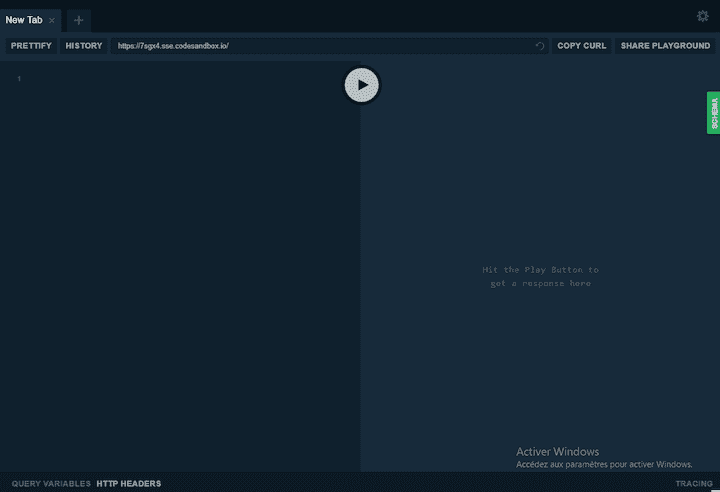
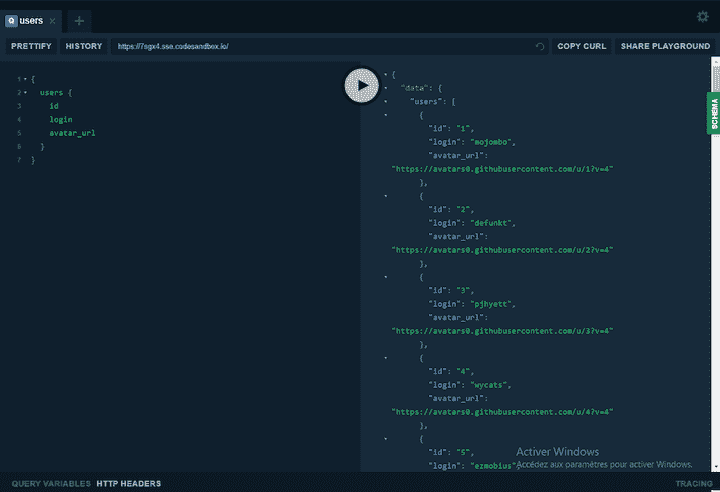
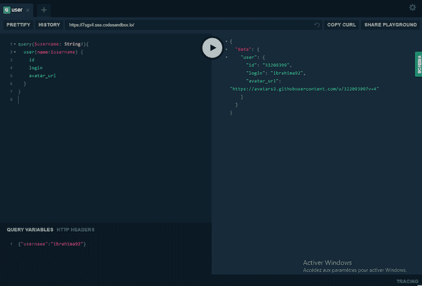
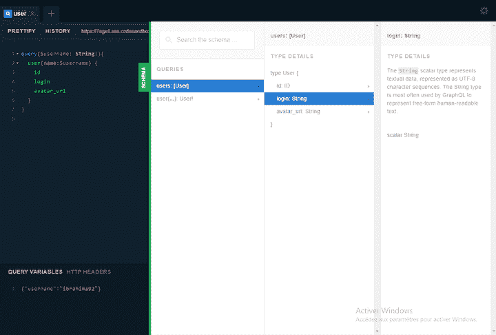
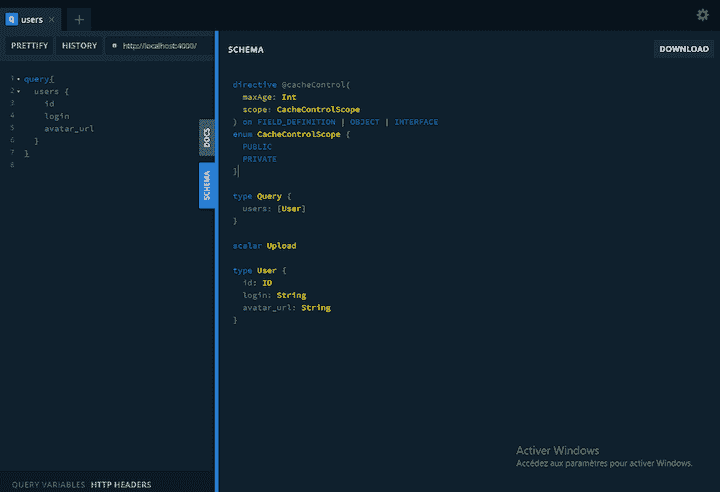
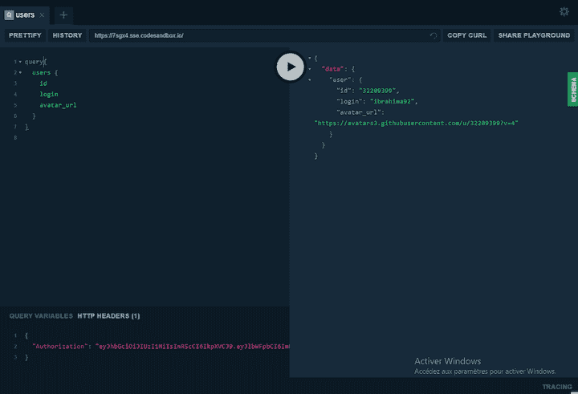
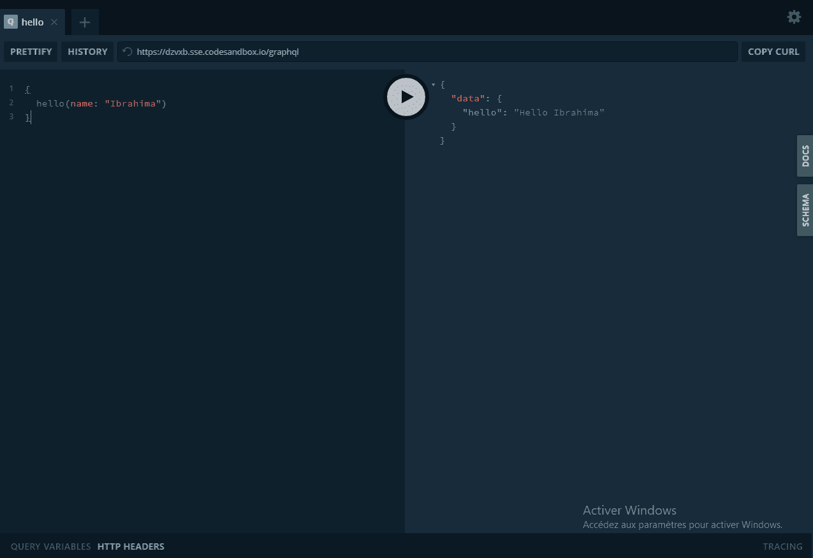

# GraphQL Playground - LogRocket 博客完全指南

> 原文：<https://blog.logrocket.com/complete-guide-to-graphql-playground/>

GraphQL 是一种流行的、广泛使用的查询语言，它自称是 REST 方法的替代者。GraphQL 在开发人员社区中如此受欢迎的原因之一是它蓬勃发展的生态系统。有很多工具可以让学习和使用 GraphQL 变得更加容易。其中一个工具是 GraphQL Playground，这是一个 GraphQL 集成开发环境(IDE)，有助于改进开发工作流。

在本指南中，我将向您介绍 GraphQL Playground，并向您介绍一些基本概念，以帮助您充分利用 GraphQL 开发经验。

让我们开始吧！

## GraphQL 游乐场是什么？

GraphQL Playground 是由 [Prisma](https://www.prisma.io/) 创建和维护的 GraphQL IDE。它构建在 GraphiQL 之上，具有额外的特性，比如自动模式重载、对[GraphiQL 订阅](https://blog.logrocket.com/graphql-subscriptions-with-node-js/)的支持、配置 HTTP 头的能力等等。

GraphQL Playground 附带了一些基本功能，如语法高亮显示、字段前面的智能类型、查询和变量的实时错误高亮显示和报告、文档浏览器、搜索、降价支持等等。

## 设置 GraphQL 操场

GraphQL 操场极其灵活。它可以在你的电脑上作为一个桌面应用程序，在你的前端或后端项目中作为一个模块，或者与网络版本在线。我们将深入下面的每个用例。

### 作为桌面应用程序安装

GraphQL Playground 桌面应用程序需要安装在您的计算机上。如果你用的是 Windows，可以直接下载。如果您使用的是 Mac 或 Linux，您可以通过在终端上运行以下命令来安装它。

```
    brew cask install graphql-playground

```

### 作为模块安装到项目中

GraphQL Playground 也可以用作项目中的 npm 模块。安装该包将使您能够在开发过程中与 GraphQL API 进行交互。稍后，我们将演示如何将其作为一个组件添加到 React 应用程序中，或者作为一个节点项目中的中间件。

通过执行以下命令，将 GraphQL Playground 添加到您的项目中。

```
    yarn add graphql-playground

```

或者，如果您使用 npm:

```
    npm install graphql-playground

```

### 使用网络版

桌面版和网页版是有区别的。GraphQL Playground 的网络版不支持双击扩展名为`.graphql`的文件。网络版[可以在网上](https://legacy.graphqlbin.com/new)访问，也有一种方法可以分享你当地的 GraphQL 游乐场作为网络版。



## 特征

对于本教程，我们将使用[这个 GraphQL 服务器](https://codesandbox.io/s/node-apollo-graphql-7sgx4)与 GitHub API 进行交互。这里是终点:`[https://7sgx4.sse.codesandbox.io/](https://7sgx4.sse.codesandbox.io/)`

### 运行 GraphQL 查询

您可以使用 GraphQL Playground 发送一个 GraphQL 查询或变异。后者有一个自动补全特性，可以帮助您浏览您的模式。



正如您所看到的，GraphQL Playground 有助于向 GraphQL 服务器发送请求，也有助于检索数据。

### **用变量查询**

GraphQL Playground 可以像 GraphQL 一样用来发送带有变量的查询。



这里，我们使用“QUERY VARIABLES”选项卡添加变量`username`，将其作为参数传递给 GraphQL 查询，并使用它来获取数据。

### 文档和模式选项卡

API 文档选项卡是 GraphQl Playground 最激动人心的特性之一。它使您能够预览 GraphQL 查询、GraphQL 类型细节和给定模式的单个字段。



上面的例子是用网页版制作的。然而，作为模块安装的 GraphQL Playground 提供了一个 schema 选项卡，使您能够预览整个 GraphQL 模式并将其作为文件下载。



当您有几个嵌套的 GraphQL 模式时，这尤其方便。

### 发送 HTTP 标头

与 GraphQL 不同，GraphQL Playground 允许您发送带有 HTTP 头的请求，例如认证用户所需的令牌或其他类型的授权。



确保首先将选项卡切换到“HTTP HEADERS”，然后将您的标题作为 JSON 对象添加。顺便说一下，您可以添加多个字段。

## 用 React 在前端嵌入 GraphQL Playground

您可以使用 GraphQL Playground 作为 React 组件来与您的 GraphQL API 进行交互。

首先，通过在终端上执行以下命令来创建一个新的 React 应用程序。

```
    npx create-react-app react-gql-playground

```

接下来，安装`graphql-playground-react`库，它允许您将工具作为组件使用。您还需要`react-redux`，它是 GraphQL Playground 库和 React 应用程序之间的粘合剂。

但是首先，一定要浏览存放 React 应用程序的文件夹。

```
    cd react-gql-playground

```

进入正确的文件夹后，运行以下命令来安装软件包。

```
    yarn add graphql-playground-react react-redux

```

或者，如果您使用 npm:

```
    npm install graphql-playground-react react-redux

```

在 IDE 或文本编辑器上打开文件夹，并将以下代码添加到`index.js`文件中。

```
import React from 'react'
import ReactDOM from 'react-dom'
import { Provider } from 'react-redux'
import { Playground, store } from 'graphql-playground-react'

import App from './App'

const rootElement = document.getElementById('root')
ReactDOM.render(
<React.StrictMode>
<Provider store={store}>
<Playground endpoint='https://7sgx4.sse.codesandbox.io/' />
<App />
</Provider>
</React.StrictMode>,
rootElement
)
```

这里我们从从`react-redux`导入`Provider`组件开始，这使我们能够将 GraphQL Playground 的商店连接到 Redux——或者准确地说，React 应用程序。

有了这些，我们现在可以显示`Playground`组件，并将我们想要使用的 API 的端点作为道具传递。

在终端上运行以下命令。

```

```
    yarn start

```

或者，如果使用 npm:

```
    npm start

```

你应该可以在浏览器中看到你的操场开始运行了。

如果运行 start 命令后出现错误，只需安装这个`graphql-playground-react`的依赖项。

```
    yarn add lru-cache

```

或者:

```
    npm install lru-cache

```

将 GraphQL Playground 作为一个组件来预览您的 API 是很好的，但在开发 GraphQL 服务器或 API 时，将它放在后端会更有用。
用 Node 在后端嵌入 GraphQL Playground
GraphQL Playground 可以嵌入到很多 Node.js 框架上。对于本教程，我们将重点关注 Express，但是对于其他框架来说过程是相同的。
要在 Express 上嵌入工具，我们需要安装`graphql-playground-middleware-express`包，并将其用作 API 的中间件。
首先，初始化一个新的节点项目。

```
    yarn init

```

或者:

```
    npm init

```

接下来，在终端上运行以下命令来安装该软件包。

```
    yarn graphql-playground-middleware-express

```

或者:

```
    npm graphql-playground-middleware-express

```

一旦安装了库，为您的服务器创建一个条目文件。我们给它起名叫`index.js`(你想怎么叫都行)。
用下面的代码更新`index.js`。

```
const express = require('express')
const graphqlHTTP = require('express-graphql')
const { buildSchema } = require('graphql')
const expressPlayground = require('graphql-playground-middleware-express')
    .default

const schema = buildSchema(`
  type Query {
    hello(name: String!): String!
  }
`)

const resolvers = {
    hello: (args) => `Hello ${args.name}`,
}

const app = express()

app.use(
    '/graphql',
    graphqlHTTP((req) => ({
        schema,
        rootValue: resolvers,
    }))
)

const port = 8080

app.get('/', expressPlayground({ endpoint: '/graphql' }))

app.listen({ port }, () => {
    console.log(`🚀 Server ready at http://localhost:${port}/graphql`)
})

```

这里我们有一个非常简单的 GraphQL API，它返回一个字符串。但是，最重要的是`expressPlayground`，是需要作为中间件使用的游乐场。一旦页面加载，它将向用户显示 GraphQL Playground。

结论
GraphQL Playground 是一个很棒的工具，它可以帮助您的应用程序与 GraphQL API 进行交互，并提供更好的工作流程。虽然与 GraphiQL 相比，它是一个不同的怪兽，但它绝对是您下一个 GraphQL API 项目中使用的工具。

## 监控生产中失败和缓慢的 GraphQL 请求

虽然 GraphQL 有一些调试请求和响应的特性，但确保 GraphQL 可靠地为您的生产应用程序提供资源是一件比较困难的事情。如果您对确保对后端或第三方服务的网络请求成功感兴趣，

[try LogRocket](https://lp.logrocket.com/blg/graphql-signup)

.

[](https://lp.logrocket.com/blg/graphql-signup)[https://logrocket.com/signup/](https://lp.logrocket.com/blg/graphql-signup)

LogRocket 就像是网络和移动应用的 DVR，记录下你网站上发生的每一件事。您可以汇总并报告有问题的 GraphQL 请求，以快速了解根本原因，而不是猜测问题发生的原因。此外，您可以跟踪 Apollo 客户机状态并检查 GraphQL 查询的键值对。

LogRocket 检测您的应用程序以记录基线性能计时，如页面加载时间、到达第一个字节的时间、慢速网络请求，还记录 Redux、NgRx 和 Vuex 操作/状态。

[Start monitoring for free](https://lp.logrocket.com/blg/graphql-signup)

.

```