# 在 SVGs 中使用 CSS 过滤器的完整指南

> 原文：<https://blog.logrocket.com/complete-guide-using-css-filters-svgs/>

滤镜在摄影中极为流行。你可以在几乎所有的照片编辑应用程序或网站上找到它们，有些相机内置了滤镜选项，所以你不必在以后编辑照片。

CSS 有几个过滤器，帮助改善网站的视觉效果。您可以使用`filter`属性将它们直接应用到 web 元素，也可以使用`backdrop-filter`属性将它们应用到元素后面的区域。

使用这些滤镜，您可以模糊图像、调整对比度和饱和度、更改色调、降低不透明度等等！

在这篇文章中，我们将专门学习一套独特而强大的工具:SVG 过滤器。但是在我们继续之前，让我们对 SVG 有一个简单的介绍。

## 什么是 SVG？

SVG 或可缩放矢量图形是一种基于 XML 的矢量图像格式，用于显示二维图形。XML 是另一个奇特的缩写，代表可扩展标记语言。XML 用于存储和传输数据，并定义您的标签。

回到 SVGs。SVG 兼有图像和文档格式的双重功能。JPEG 和 PNG 等常规图像格式是由像素组成的，当它们被放大时，通常会失去质量。

SVG 的不同之处在于，无论你放大多少倍，它们都能保持质量。这是可能的，因为它们是由数学公式组成的。

让我们看看 SVG 的内部是什么。

首先，在代码编辑器中打开一个 SVG 图像。下面是您可能会发现的内容的截图:

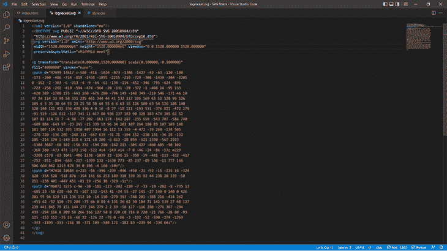

这个代码组成了一个复杂的形状。我们可以在代码行内控制图像的颜色、大小和其他特征。让我们创建一个更简单的形状，一个圆形:

```
<body>
  <svg width="400" height="400">
    <circle cx="200" cy="200" r="100" fill="#553c9a">
  </svg>
</body>
```

我们有一个紫色的圆圈！

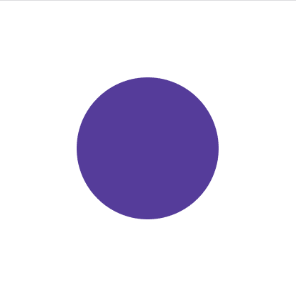

我们可以通过添加一个`stroke`值将这个圆变成一个环。一个笔画就是边框，我们可以将`fill`颜色设置为`transparent`。

```
<body>
  <svg width="400" height="400">
    <circle cx="200" cy="200" r="100" fill="transparent"
    stroke="#553c9a" stroke-width="20px">
  </svg>
</body>

```

结果是这样的:

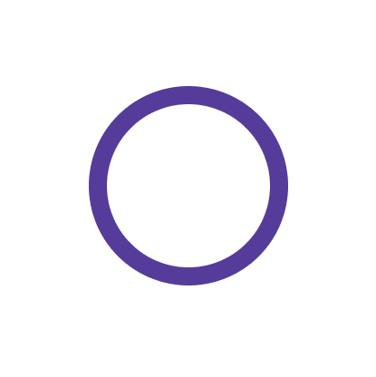

可以通过组合不同的 SVG 来创建复杂的图像。SVG 用于图标、徽标或背景图像。它们也可以是动画！

## 对 SVG 使用 CSS 过滤器

CSS 过滤器大多限于图像，并且相当容易使用。另一方面，SVG 过滤器可以应用于图像(SVG 和其他格式)、文本和所有其他 HTML 元素。CSS 过滤器实际上是 SVG 过滤器的一个子集。

SVG 过滤器使用`<filter>`元素和一组称为过滤器原语的函数。这些函数是创建效果的子元素。

CSS `filter`属性将通过`id`引用`<filter>`元素。

## 过滤原语

首先，创建一个内部嵌套了一个`filter`元素的`svg`元素。然后，将图元添加到图像(或您希望滤镜应用到的任何元素)之前。

共有 17 种过滤原语，它们是:

1.  `feGaussianBlur`
2.  `feDropShadow`
3.  `feMorphology`
4.  `feTurbulence`
5.  `feDisplacementMap`
6.  `feColorMatrix`
7.  `feConvolveMatrix`
8.  `feComponentTransfer`
9.  `feOffset`
10.  `feMerge`
11.  `feFlood`
12.  `feComposite`
13.  `feImage`
14.  `feBlend`
15.  `feDiffuseLighting`
16.  `feSpecularLighting`
17.  `feTile`

“fe”代表滤镜效果。从名字中，我们可以知道它们会产生什么样的效果。让我们来看一个基本的 SVG 过滤器语法:

```
<svg>
   <filter id="">
   <!--Filter Primitives go in here-->
   </filter>
</svg>

```

每个 SVG 原语都有自己独特的属性集，用于创建效果。这些过滤器原语中的一些可以独立工作，但是一些必须与其他原语结合使用。

有很多内容要讲，所以让我们开始吧。

### `feGaussianBlur`

SVG 是基于数学公式的，所以使用高斯模糊滤镜是正确的。这种滤镜以已故数学家卡尔·弗里德里希·高斯(Carl Friedrich Gauss)的名字命名，并应用数学函数来模糊图像。

首先，你需要一张图片。这是来自 freepik.com 的一首歌:


接下来，我们将在 HTML 文件中创建 SVG 语法:

```
<svg>
  <filter id="blur">
    <feGaussianBlur stdDeviation="5" in="SourceGraphic" result="BLUR"></feGaussianBlur>
  </filter>
    <image
       xlink:href="2833.jpg" filter="url(#blur)"></image>
</svg>

```

现在，我们将在`filter`元素中使用 SVG 过滤器原语`feGaussianBlur`。图元中有一些属性会对产生的模糊产生影响。

第一个属性是`stdDeviation`，调节模糊量。

接下来是用于输入的`in`，它定义了应用过滤器的位置。在这种情况下，它是`SourceGraphic`，这是我们的图像。`SourceGraphic`也可以是文字。

本例中的最后一个属性是`result`。我们用它来命名过滤器。当使用多个过滤器时，这对于`in`是有用的参考。

以下是应用滤镜后的结果图像:

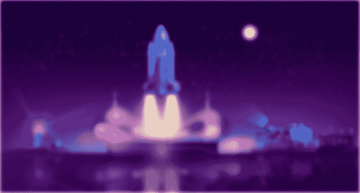

如前所述，可以使用`filter`属性和一个指向`id`的`url`从外部应用 SVG 过滤器:

```
<svg>
    <filter id="blur">
      <feGaussianBlur stdDeviation="5"></feGaussianBlur>
    </filter>
</svg>

```

最后，用`filter` CSS 属性应用它:

```
img{
  width: 1000px;
  height: auto;
  filter: url(#blur);
}
```

### `feDropShadow`

这个滤镜非常简单，在元素后面添加一个阴影。

从语法开始:

```
<svg >
  <filter id="blur">
    <feDropShadow in="SourceGraphic" dx="10" dy="10"></feDropShadow>
  </filter>
</svg>

```

`dx`和`dy`属性分别定义阴影沿 x 轴和 y 轴的位置。结果是图像后面有一个非常暗的阴影:

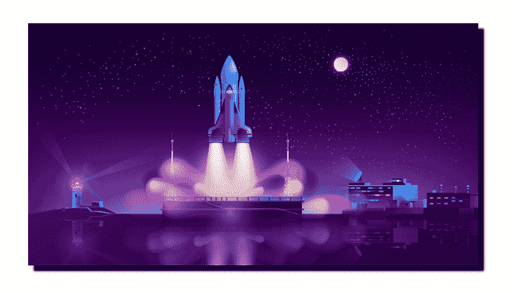

### `feMorphology`

形态学是对形态、形状和结构的研究。`feMorphology`原语用于改变元素的形式。

它使用接受两个值`dilate`或`erode`中任意一个的`operator`属性，以及定义膨胀或腐蚀量的`radius`。对于`dilate`，`SourceGraphic`的像素向外扩展。`erode`适得其反。

我们来对比一下两者。首先出场的是`dilate`:

```
<svg>
  <filter id="blur">
   <feMorphology in="SourceGraphic" operator="dilate" radius="5">
   </feMorphology>    
  </filter>
</svg>

```

结果是:

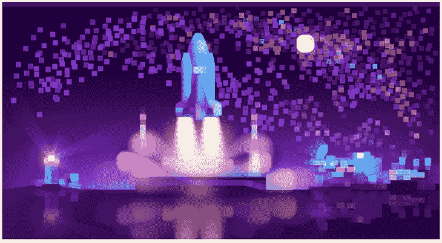

现在我们来看看`erode`:

```
<svg>
  <filter id="blur">
   <feMorphology in="SourceGraphic" operator="erode" radius="5">
   </feMorphology>    
  </filter>
</svg>

```

结果是:

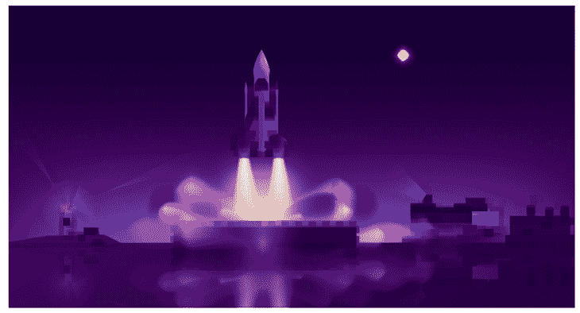

星星都去哪了？🤔

从这些结果中，我们可以看到，与来自`erode`的变暗且柔和的图像相比，`dilate`产生了更鲜明的图像。亮度是由于图像的像素扩大，反之亦然。

### `feTurbulence`

唯一真实的解释就是这个过滤器的名字:湍流。它使用了两个属性:`baseFrequency`和`numOctaves`。

```
<feTurbulence in="SourceGRaphic" baseFrequency="0.01 0.02" 
              numOctaves="1" result="NOISE">
</feTurbulence>

```

结果是图像上的噪声效果:


我们来解释一下属性。

`baseFrequency`控制 x 和 y 方向的失真或噪声量。高`baseFrequency`值会减小失真图案的大小。它可以包含两个值，如果使用一个值，它将覆盖 x 轴和 y 轴。

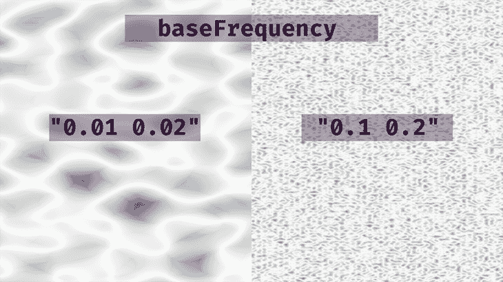

`numOctaves`也是一个噪声函数，控制滤镜效果中的八度音程数。使用`"0.01 0.02"`的一个`baseFrequency`，我们得到如下:

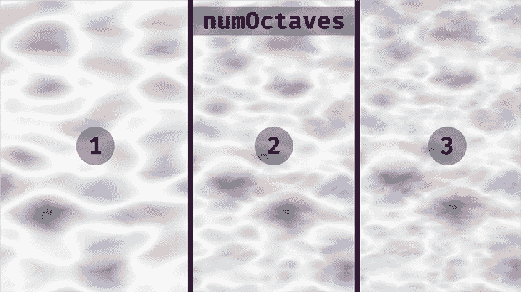

最终，由你来决定八度音阶的数量和频率。玩玩这些值，看看你能想出什么。请记住，他们不接受负值。

### `feDisplacementMap`

置换图是用于改变另一个元素的内容的图像。一个元素的纹理可以应用到另一个元素。

对于这个 SVG 过滤器原语，我们需要两个输入:`in`和`in2`。一个将保存原始图形，另一个将作为置换贴图的图像。

```
<svg>
 <filter id="turbulence">
   <feTurbulence type="turbulence" baseFrequency="0.01 0.02" numOctaves="1" result="NOISE"></feTurbulence>
   <feDisplacementMap in="SourceGraphic" in2="NOISE" scale="50">
   </feDisplacementMap>
 </filter>
</svg>

```

现在看结果。图像遵循由`feTurbulence`滤镜创建的失真模式:

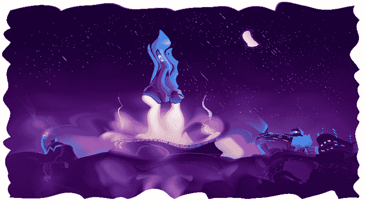

我们可以更进一步，添加一些波浪动画来完成水的外观:

```
<svg>
  <filter id="wavy">
  <feTurbulence id="turbulence" type="turbulence" numOctaves="1" 
  result="NOISE"></feTurbulence>
   <feDisplacementMap in="SourceGraphic" in2="NOISE" scale="50">
   </feDisplacementMap>
  <animate xlink:href="#turbulence" attributeName="baseFrequency" dur="60s" keyTimes="0;0.5;1"
values="0.01 0.02;0.02 0.04;0.01 0.02" repeatCount="indefinite"></animate>
 </filter>
</svg>

```

注意，第一个过滤器原语现在有了一个`id`。这就是我们正在制作的动画。

接下来，我们将使用`<animate>`元素来定义动画。该元素将包含`xlink:href`，指向将被激活的过滤器。之后是`attributeName`，我们正在制作动画的基本属性是`baseFrequency`。

接下来，我们用`dur`和`keyTimes`设置持续时间。这些本质上都是`@keyframes`。

`values`包含用`keyTimes`设置的停止点的新`baseFrequency`值。

最后，我们将`repeatCount`设置为`indefinite`，这样效果会循环运行。

这就是结果:

参见 [CodePen](https://codepen.io) 上 Oscar-Jite([@ Oscar-Jite](https://codepen.io/oscar-jite))
的笔[、水/波浪效果湍流与位移图](https://codepen.io/oscar-jite/pen/XWZgYBP)。

我们也可以使用常规的`animation`和`transition` CSS 属性或者一些 JavaScript 来制作动画。

### `feColorMatrix`

这个 SVG 滤镜用于修改元素的色调和饱和度。它使用一个`type`属性和四个可能的值:`matrix`、`saturate`、`hueRotate`和`luminaceToAlpha`。

对于`matrix`，使用 RGBA 颜色矩阵或网格为其`value`应用滤镜效果。

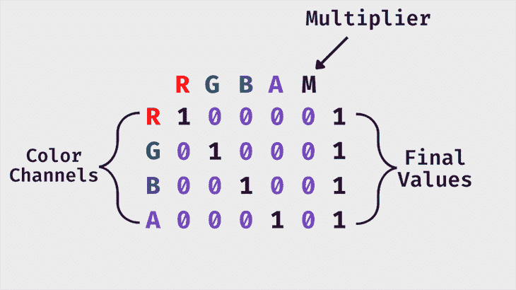

```
<svg>
<filter>
  <feColorMatrix in="SourceGraphic" type="matrix" 
                   values="1 0 0 0 0
                           0 1 0 0 0
                           0 0 1 0 0
                           0 0 0 1 0">
</filter>
</svg>

```

上面的语法不会改变图像的颜色。让我们看看每个颜色通道。

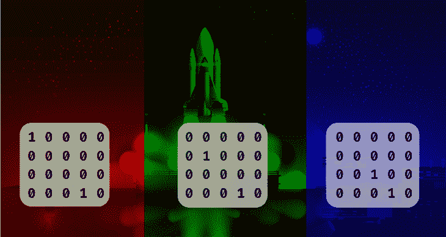

玩玩这些值，看看你能想出什么样的色调、阴影和色彩！

接下来，我们有`saturate`。这使用 0 和 1 之间的`values`来控制图像中的黑白数量。

```
<svg>
  <filter id="saturate">
      <feColorMatrix in="SourceGraphic" type="saturate" values="0.5"/>
    </filter>
</svg>

```

结果是:

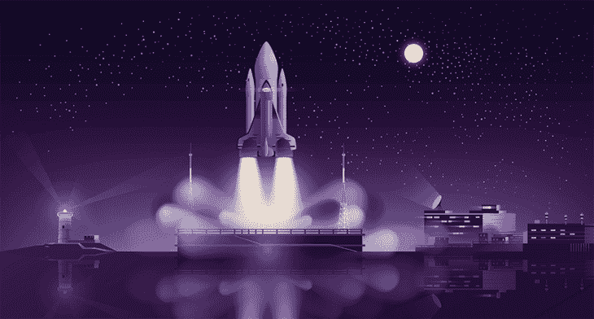

接下来是`hueRotate`。该属性将图像的颜色围绕色轮旋转特定的角度。让我们从展示色轮开始:

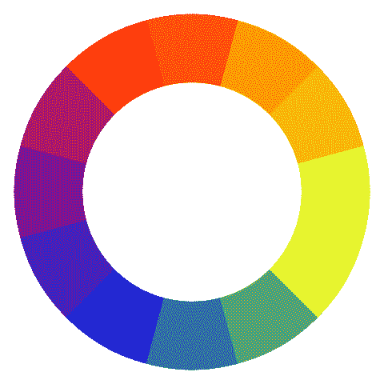

现在让我们使用属性:

```
<feColorMatrix in="SourceGraphic" type="hueRotate" values="60"/>

```

浏览器检测图像中的每种颜色，并沿着色轮将每种颜色旋转 60 度。这将是生成的图像:

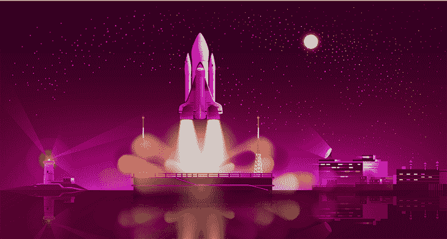

最后的`type`是`luminaceToAlpha`。这基本上是通过移除 alpha 通道将图像变成半透明的底片。

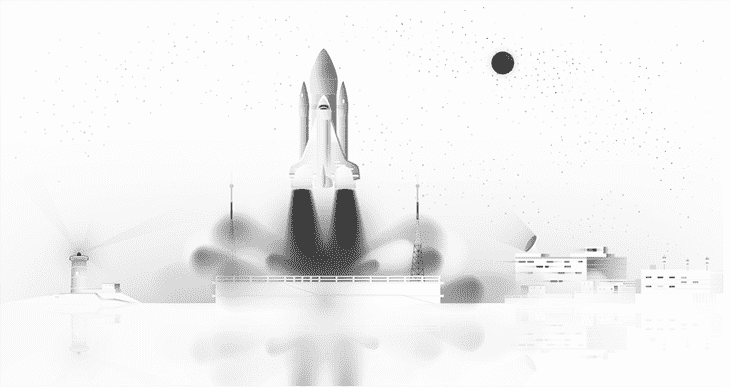

如果给网格赋予正确的值，`matrix`可以获得与其他相同的效果。

### `feConvolveMatrix`

从一个矩阵到下一个矩阵！此滤镜图元向图像添加卷积效果或内核。它用于模糊、边缘检测、锐化、浮雕和使用像素组合的斜面。

我们可以使用网格中的一些随机值来演示一个微妙的毛刺效应:

```
<svg>
      <filter id="convolve">
        <feConvolveMatrix kernelMatrix
        ="1 -4 1 
          1 0 -8 
          1 0 -4" />
    </filter>
</svg>

```

结果是:

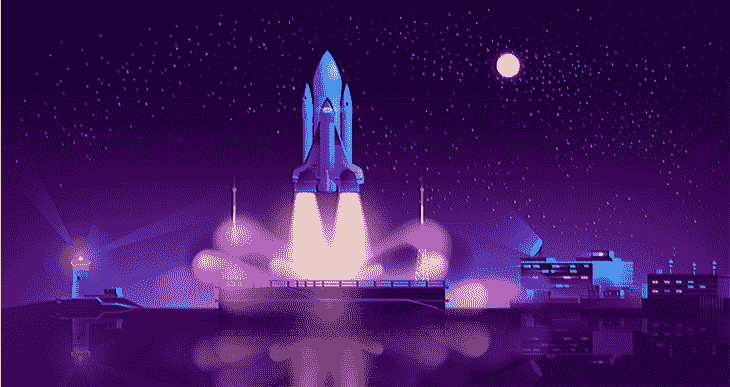

让我们和原作对比一下，看清楚效果:

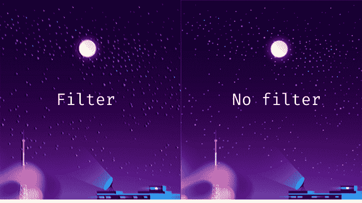

### `feComponentTransfer`

这个原语类似于`feColorMatrix`，但是，代替网格，每个颜色通道(RGBA)是一个独立的函数。就像矩阵一样，我们可以通过控制这些通道的颜色强度来调整图像的对比度。

看起来是这样的:

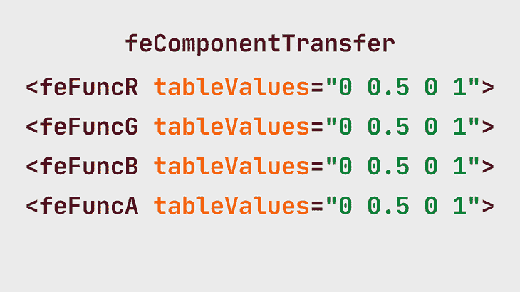

下面是使用本例中给出的值的工作原理:

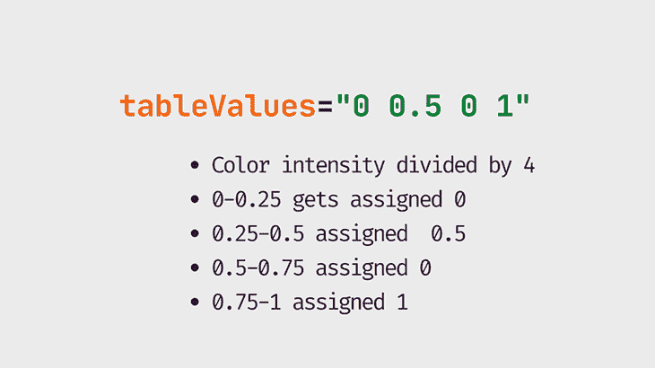

例如，在红色通道中，颜色强度的范围从 0 到 1。我们有四个值，所以 1 除以 4。现在我们有四个相等的红色范围:0-0.25、0.25-0.5、0.5-0.75 和 0.75-1。

0–0.25 之间的任何红色值都被赋予`tableValues`中的第一个值，依此类推。相同的原则用于多达 10 个值。

这个 filter 原语可以使用各种函数，我们要看的第一个函数是`discrete`。这会减少图像中的颜色数量。

```
<svg>
      <filter id="discrete">
        <feComponentTransfer>
          <feFuncR type="discrete" tableValues="0 0.5 0 1"/>
          <feFuncG type="discrete" tableValues="0 0.5 0 1"/>
          <feFuncB type="discrete" tableValues="0 0.5 0 1"/>
          <feFuncA type="discrete" tableValues="0 0.5 0 1"/>
      </feComponentTransfer>
    </filter>
</svg>

```

结果是:

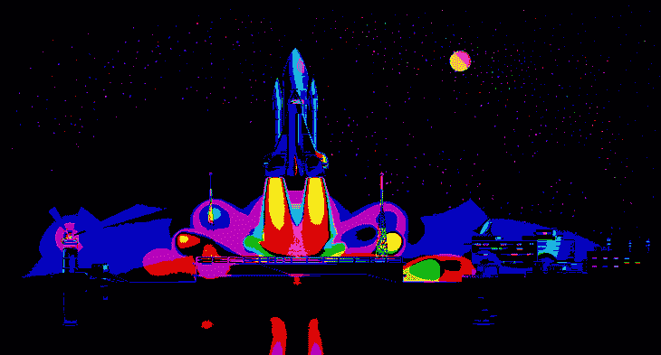

下一个`type`是`table`，对图像的对比度进行更细微的改变。所以，使用与上面相同的`tableValues`…

```
<svg>
   <filter id="convolve">
      <feComponentTransfer>
          <feFuncR type="table" tableValues="0 0.5 0 1" />
          <feFuncG type="table" tableValues="0 0.5 0 1" />
          <feFuncB type="table" tableValues="0 0.5 0 1" />
          <feFuncA type="table" tableValues="0 0.5 0 1" />
      </feComponentTransfer>
   </filter>
</svg>

```

…我们得到了这个:

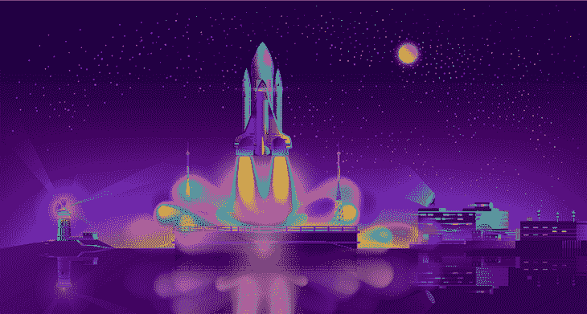

我们可以使用这个图元创建一个双色调效果。Duo 表示两个，所以我们在`tableValues`中为每个通道使用两个颜色值。

我们需要两种颜色，用`#A91C93`和`#8EE3FF`吧。现在，我们需要 RGB 颜色值— `#A91C93`相当于`(169,28,147)`,`#8EE3FF`相当于`(255,142,227)`。

接下来，我们需要将红色、绿色和蓝色通道中的值除以 255，以获得 0–1 范围内的值。这进入`tableValues`。

```
<svg>
    <filter id="duotone">
       <feComponentTransfer>
          <feFuncR type="table" tableValues="0.662745098 1" />
          <feFuncG type="table" tableValues="0.109803922 0.556862745" />
          <feFuncB type="table" tableValues="0.576470588 0.890196078" />
       </feComponentTransfer>
    </filter>
</svg>

```

我们得到了这个:

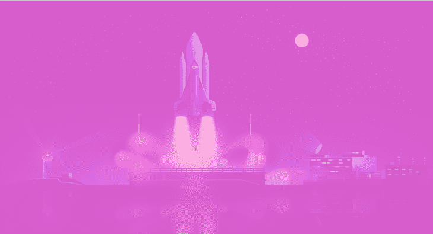

还有第三种方法来控制图像的对比度，那就是`type`、`gamma`。这附带了另外三个属性:`exponent`、`amplitude`和`offset`。

增加`exponent`会使图像变暗的区域变得更暗。与`amplitude`相反，使图像已经很亮的区域变亮。

`offset`给图像添加白色，其值介于 0 和 1 之间。

```
<svg>
  <filter id="amplify">
    <feComponentTransfer>
       <feFuncR type="gamma" exponent="1.9" amplitude="1.9" offset="0" />
       <feFuncG type="gamma" exponent="1.9" amplitude="1.9" offset="0" />
       <feFuncB type="gamma" exponent="1.9" amplitude="1.9" offset="0" />
    </feComponentTransfer>
   </filter>
</svg>

```

我们来对比一下原图:

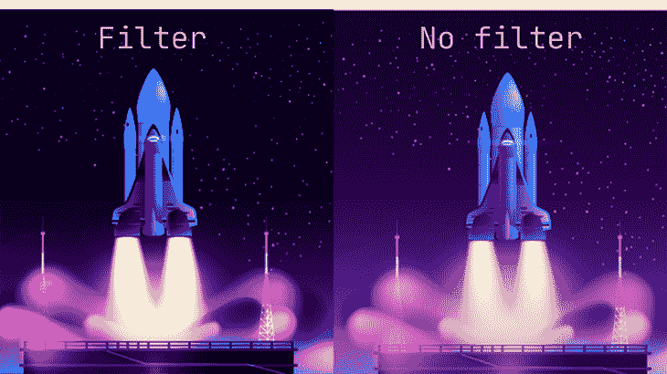

尝试其他值，找到更多增加元素趣味的方法。有了这个 SVG 过滤器原语，您就有了许多可能性！

### `feOffset`

这个原语非常简单。我们沿着 x 和 y 方向偏移图像，类似于我们对阴影所做的。

```
<svg>
    <filter id="convolve">
      <feOffset in="SourceGraphic" dx="10" dy="10"></feOffset>
    </filter>
</svg>

```

### `feMerge`

这个 SVG 过滤器让我们将两个或更多的元素分层。每一层都是主`feMerge`图元中的一个`feMergeNode`。

现在是介绍`SourceAlpha`的最佳时机，它是`SourceGraphic`的黑色复制品。因此，使用我们的图像，`SourceAlpha`是一个黑色的矩形，尺寸与图像相同。我们可以用这个来创建一个更好的投影。

我们将从偏移`SourceAlpha`开始:

```
<svg>
    <filter id="drop-shadow">
      <feOffset in="SourceAlpha" dx="10" dy="10"></feOffset>
    </filter>
</svg>

```

接下来，我们将使用`feColorMatrix`应用模糊并降低不透明度:

```
<svg>
    <filter id="drop-shadow">
      <feOffset in="SourceAlpha" dx="10" dy="10"></feOffset>
      <feGaussianBlur stdDeviation="10" result="BLUR"></feGaussianBlur>
      <feColorMatrix
          type="matrix"
          in="BLUR"
          result="DROPSHADOW"
          values="1 0 0 0 0
                  0 1 0 0 0
                  0 0 1 0 0
                  0 0 0 0.5 0"></feColorMatrix>
    </filter>
</svg>

```

此时，我们有一个模糊的半透明矩形:

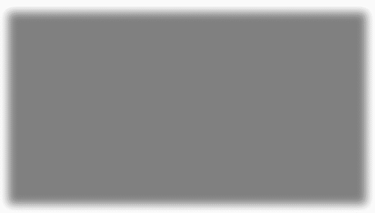

现在，我们将使用`feMerge`把我们的图像叠加在这个阴影之上。第一个`feMergeNode`将是顶层，其他将按此顺序排列。

```
<feMerge>
    <feMergeNode in="FINALSHADOW"></feMergeNode>
    <feMergeNode in="SourceGraphic"></feMergeNode>
</feMerge>

```

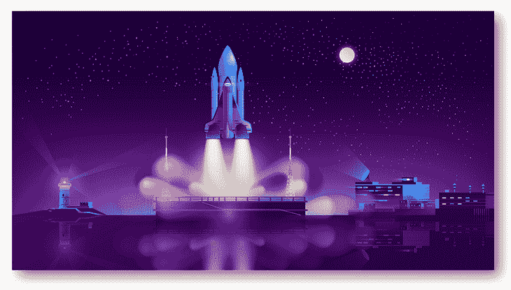

现在，我们通过组合四个 SVG 滤镜获得了更好的投影效果！

### `feFlood`

使用这个滤镜原语，我们可以简单地用颜色淹没滤镜区域。

```
<svg>
      <filter id="convolve">
        <feflood flood-color="#00c2cb" flood-opacity="0.1" />
      </filter>
</svg>

```

结果是:

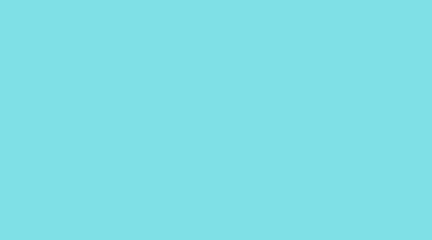

### `feComposite`

此滤镜将图像与其背景相结合。我们将切换到文本来演示这个过滤器原语的效果。

我们还将使用另外两个 SVG 过滤器，`feFlood`和`feMorphology`，来创建一些挖空文本。

这是我们的`h1`文字:


下面是 SVG 语法:

```
<body>
  <svg>
    <filter id="knockout">
      <feMorphology operator="dilate" radius="2" in="sourceGraphic" 
      result="DILATE" />
      <feFlood flood-color="#301934" flood-opacity="0.5" result="FLOOD" />
        <feComposite operator="out" in="FLOOD" in2="DILATE" />
      </filter>
  </svg>
    <h1>HELLO! I'M A KNOCKOUT...</h1>
</body>

```

这是结果:

首先，我们使用`feMorphology`和`operator`作为`dilate`来扩展文本。接下来，我们用颜色淹没文本区域。最后，我们使用`feComposite`将文本与白色背景融合在一起。

我们使用`out`作为合成`operator`的值。你能猜到当我们使用`in`时会发生什么吗？

让我们看看:


它恰恰相反！这一次，洪水的颜色停留在文字的字母。

### `feImage`

这个原语用图像填充过滤器区域。这正是我们对`feFlood`所做的。我们坚持使用文本示例，所以让我们看看这个 SVG 过滤器是如何工作的。

```
<feImage xlink:href="2833.jpg" x="0" y="0"
        width="100%" height="100%"
        preserveAspectRatio="none" result="IMAGE">
</feImage>

```

现在，这是结果:

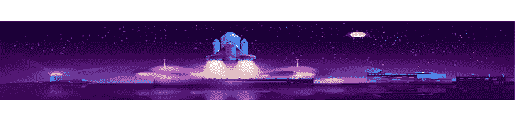

现在，我们可以使用`feComposite`将这个图像添加到文本中。

```
<svg>
  <filter id="knockout">
    <feImage xlink:href="2833.jpg" x="0" y="0"
       width="100%" height="100%"
       preserveAspectRatio="none" result="IMAGE"></feImage>
    <feComposite operator="in" in="IMAGE" in2="SourceGraphic" /> 
  </filter>
</svg>

```


### `feBlend`

顾名思义，[这个图元将图像与其背景](https://blog.logrocket.com/advanced-effects-with-css-background-blend-modes-4b750198522a/)融合在一起。为了演示这一点，我们将使用`feTurbulence`创建一个噪声效果，并将其与图像相结合。

```
<svg>
  <filter id="blend">
     <feTurbulence in="SourceGraphic" type="turbulence" 
     baseFrequency="0.01 0.02" numOctaves="1" result="NOISE">
     </feTurbulence>
    <feBlend in="SourceGraphic" in2="NOISE" mode="multiply" result="BLEND">     </feBlend>
  </filter>
</svg>

```

结果是一个模糊的图像:

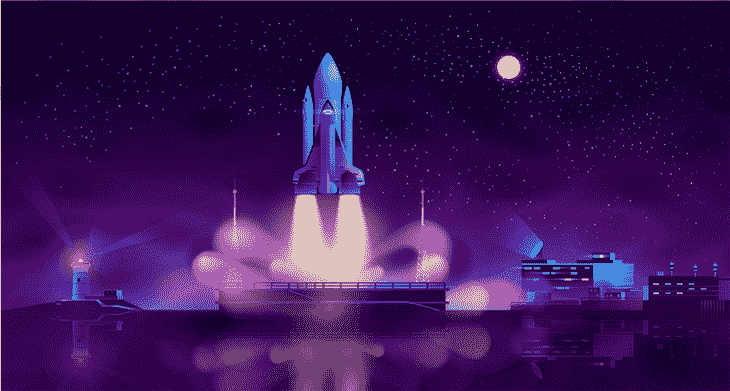

让我们来看一个动画演示:

请看 [CodePen](https://codepen.io) 上 Oscar-Jite([@ Oscar-Jite](https://codepen.io/oscar-jite))
的笔 [feBlend 与 feTurbulence](https://codepen.io/oscar-jite/pen/MWQOYzg) 。

`feDiffuseLighting`

### 漫射照明是来自大型外部光源的光。它使用图像的 alpha 通道作为凹凸贴图。凹凸贴图是一种向图像添加纹理的图形化方法。

有三个光源与这个原语一起工作:`feDistantLight`、`fePointLight`和`feSpotLight`。

`feDistant`定义从远处来的光源。

从这个片段来看，光源是蓝色的。`diffuseConstant`定义光线的漫反射常数，这就是光线从表面反射的方式。较低的值会使光线变暗。

```
<svg>
  <filter id="knockout">
     <feDiffuseLighting in="SourceGraphic" lighting-color="#00c2cb" 
     diffuseConstant="2">
      <feDistantLight azimuth="100" elevation="15" />
     </feDiffuseLighting>
     <feComposite in="SourceGraphic" operator="arithmetic" k1="1" k2="0"
          k3="0" k4="0" />
  </filter>
</svg>

```

对于`feDistantLight`属性，`azimuth`是光线在 xy 平面上的顺时针方向，`elevation`是 z 轴上的角度方向。

这是使用上面的代码产生的效果:

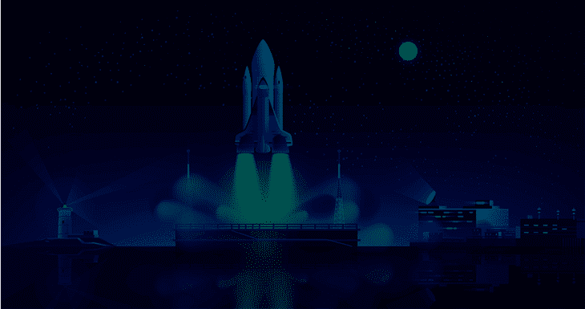

接下来是。我们实际上是将光线指向图像中的特定点。看着我们的图像，月亮似乎是最好的光照点。

为了得到这个，我们沿着 x，y，z 轴移动光线。

现在我们在布满星星的夜空中有一轮美丽的蓝月亮:

```
<svg>
<filter id="point">
  <feDiffuseLighting in="SourceGraphic" lighting-color="#00c2cb" diffuseConstant="2">
     <fePointLight x="580" y="100" z="40"/>
  </feDiffuseLighting>
  <feComposite in="SourceGraphic" operator="arithmetic" k1="1" k2="0"
          k3="0" k4="0" />
</filter>
</svg>

```

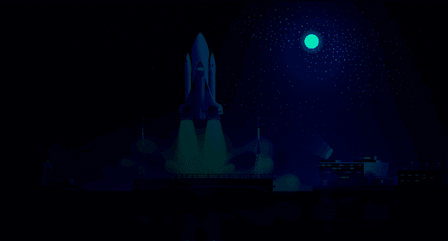

最后，对于这个 SVG 过滤器，我们有`feSpotLight`。它的名字就在那里，有一个看不见的聚光灯把一束光指向图像。至于我们，我们可以控制位置、角度和强度。

`limitingConeAngle`控制聚光灯的宽度。`pointsAtX`、`pointsAtY`和`pointsAtZ`控制聚光灯指向的方向。

```
<svg>
<filter id="point">
 <feDiffuseLighting in="SourceGraphic" lighting-color="#00c2cb" 
 diffuseConstant="5">
    <feSpotLight x="680" y="20" z="30" 
              limitingConeAngle="60" 
              pointsAtX="100" pointsAtY="100"
              pointsAtZ="0" />
        </feDiffuseLighting>
  <feComposite in="SourceGraphic" operator="arithmetic" k1="1" k2="0"
          k3="0" k4="0" />
</filter>
</svg>

```

结果是:

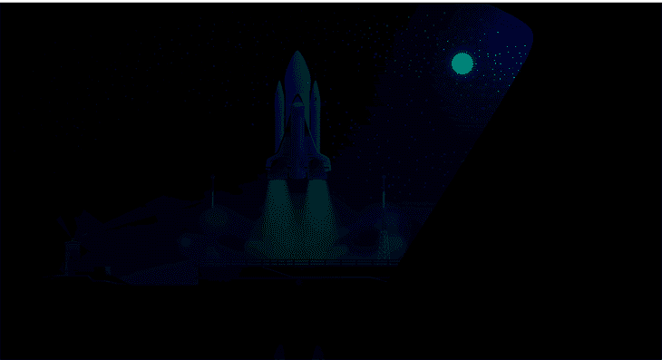

`feSpecularLighting`

### 高光用于高亮显示。这个滤镜原语使用与`feDiffuseLighting`相同的光源。

我们来看属性。`specularExponent`控制高光的亮度，`surfaceScale`是图像表面的高度。`specularConstant`做与`diffuseConstant`相同的事情，并使光的颜色变亮或变暗。

```
<svg>
<filter id="point">
<feSpecularLighting specularExponent="5" lighting-color="#00c2cb"
          surfaceScale="1" in="SourceGraphic" specularConstant="1.5">
          <fePointLight x="570" y="100" z="200" />
        </feSpecularLighting>
  <feComposite in="SourceGraphic" operator="arithmetic" k1="1" k2="0"
          k3="0" k4="0" />
</filter>
</svg>

```

结果是:

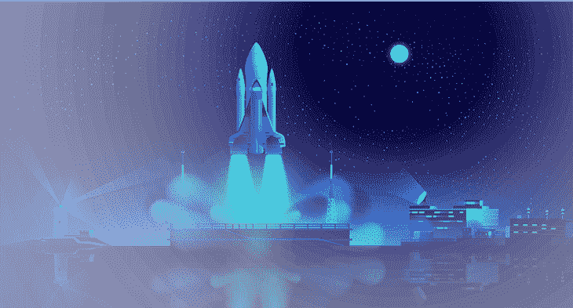

我们用了`fePointLight`，但是和其他人一起试一下，看看你能想出什么！

`feTile`

### 我们已经到达了终点，即最后一个 SVG 过滤器`feTile`。这个过滤器原语在元素上创建一个重复的模式，就像地板上的瓷砖一样。

在这个片段中，我们在 x 和 y 轴上选择图像的一部分，它将显示在每个图块上。我们所要做的就是设置图块的`width`和`height`。

```
<svg>
  <filter id="tiles">
     <feTile in="SourceGraphic" x="50" y="50" width="50" height="50" />
      <feTile />
  </filter>
</svg>

```

瞧啊。


我们有了它，所有 17 个 SVG 过滤器原语。如果可以在旅途中编辑，谁还需要 Photoshop 呢？您可以组合许多图元来获得更复杂的效果。

浏览器支持

## SVG 过滤器在所有现代浏览器中都有很好的支持。这里有一张[can use](https://caniuse.com/)的截图，展示了它们的兼容范围。

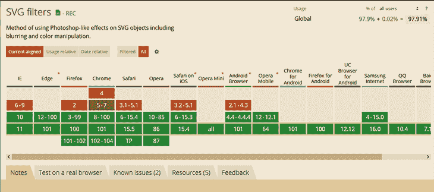

结论

## SVG 可以做很多不可思议的事情，我们刚刚讨论了如何使用 SVG 滤镜增强图像以及其他图形元素。

我们还演示了 SVG 过滤器可用的 17 种原语。失真、色彩处理、模糊、色彩反转——只要你说得出，你只需轻轻几下就能实现这些效果！

现在，要记住几件事:

小心驼色字体

*   属性区分大小写，所以要注意拼写错误
*   值应该全部大写，以区别于原始属性
*   向前迈进，一次一个代码、一行、一个像素地创造奇迹！

你的前端是否占用了用户的 CPU？

## 随着 web 前端变得越来越复杂，资源贪婪的特性对浏览器的要求越来越高。如果您对监控和跟踪生产环境中所有用户的客户端 CPU 使用、内存使用等感兴趣，

.

[try LogRocket](https://lp.logrocket.com/blg/css-signup)

LogRocket 就像是网络和移动应用的 DVR，记录你的网络应用或网站上发生的一切。您可以汇总和报告关键的前端性能指标，重放用户会话和应用程序状态，记录网络请求，并自动显示所有错误，而不是猜测问题发生的原因。

[](https://lp.logrocket.com/blg/css-signup)[https://logrocket.com/signup/](https://lp.logrocket.com/blg/css-signup)

现代化您调试 web 和移动应用的方式— [开始免费监控](https://lp.logrocket.com/blg/css-signup)。

Modernize how you debug web and mobile apps — [Start monitoring for free](https://lp.logrocket.com/blg/css-signup).