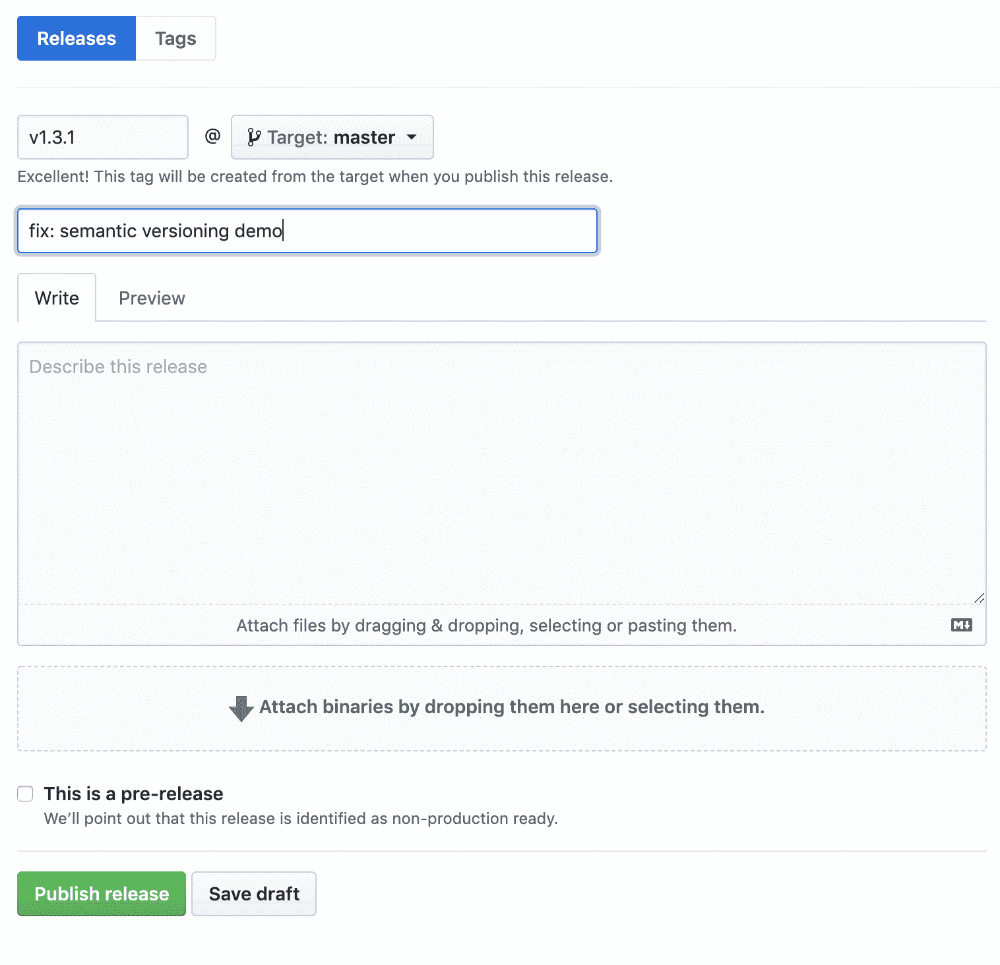
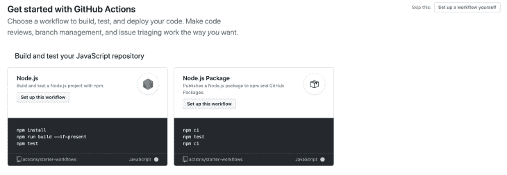
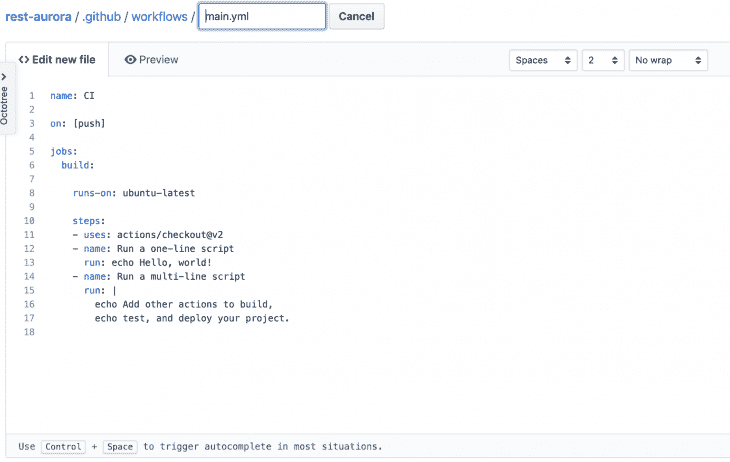
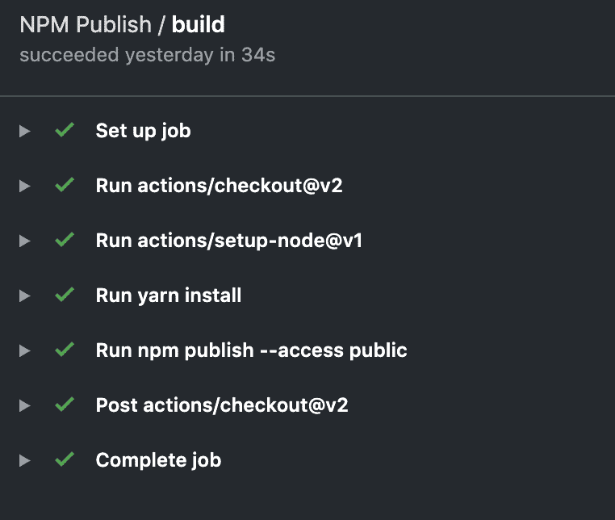
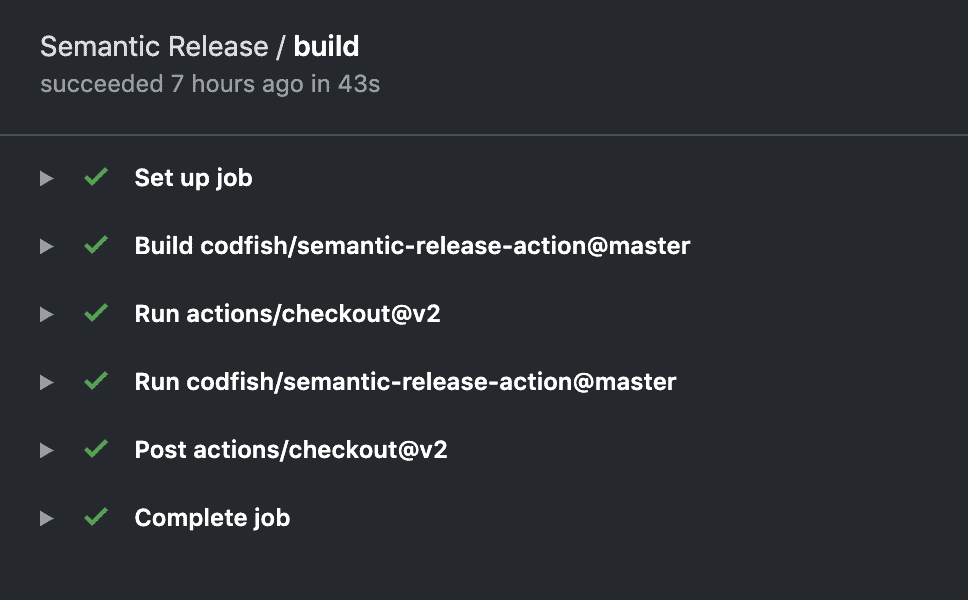
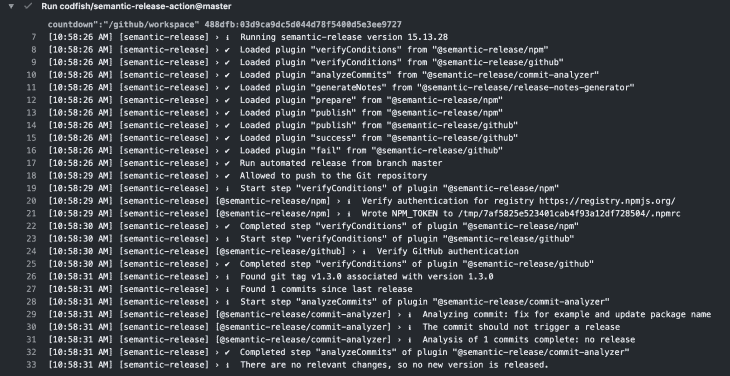

# 使用 Github actions 将 React 库发布到 NPM 的完整工作流指南

> 原文：<https://blog.logrocket.com/complete-workflow-guide-to-publish-a-react-library-to-npm-using-github-actions/>

出版一个 NPM 包总是一项令人生畏的任务。初始设置可能会很痛苦，因为要使它正常工作，您需要做很多事情。

这些任务包括:

*   将包编译成支持的 JS 版本
*   版本控制
*   出版
*   自动化下次发布的工作流程

今天，我们将使用 Github 操作来自动化 NPM 出版工作流程。

我们来看三种不同的方法:

*   手动发布到 NPM
*   基于 Github 版本的半自动发布
*   通过 Github push to master 实现全自动发布

所有的方法都各有利弊。本文将让您对 Github 动作的工作原理以及如何使用 Github 动作自动化一些代码有一个坚实的理解。

### 介绍

在我上一篇[博客文章](https://blog.logrocket.com/the-complete-guide-to-building-headless-interface-components-in-react/)中，我创建了一个无头 React 组件。我想把它发布到 NPM，这样任何人都可以在他们的 React 应用程序中使用它。

今天，我们将把组件发布到 NPM，并自动化工作流程，在更新的版本中一次又一次地发布它。

### 手动发布到 NPM

首先，我们将创建库并手动发布它。我已经有了组件——你可以在我之前的[博客文章](https://blog.logrocket.com/the-complete-guide-to-building-headless-interface-components-in-react/)中看到我是如何构建它的。

这是一个简单的基于日期的倒计时组件。代码将如下所示:

```
// index.js
import { useState, useEffect, useRef } from "react";
import { calculateTimeLeft } from "./utils";
const Countdown = ({ date, children }) => {
  const initialTimeLeft = calculateTimeLeft(date);
  const [timeLeft, setTimeLeft] = useState(initialTimeLeft);
  const timer = useRef();
  useEffect(() => {
    timer.current = setInterval(() => {
      setTimeLeft(calculateTimeLeft(date));
    }, 1000);
    return () => {
      if (timer.current !== undefined) {
        clearInterval(timer.current);
      }
    };
  }, [date]);
  let isValidDate = true,
    isValidFutureDate = true;
  if (timeLeft === null) isValidDate = false;
  if (timeLeft && timeLeft.seconds === undefined) isValidFutureDate = false;
  return children({
    isValidDate,
    isValidFutureDate,
    timeLeft
  });
};
export default Countdown;
```

所使用的实用函数可以在名为`utils.js`的单独文件中找到:

```
import isValid from "date-fns/isValid";
export const calculateTimeLeft = date => {
  if (!isValid(date)) return null;
  const difference = new Date(date) - new Date();
  let timeLeft = {};
  if (difference > 0) {
    timeLeft = {
      days: Math.floor(difference / (1000 * 60 * 60 * 24)),
      hours: Math.floor((difference / (1000 * 60 * 60)) % 24),
      minutes: Math.floor((difference / 1000 / 60) % 60),
      seconds: Math.floor((difference / 1000) % 60)
    };
  }
  return timeLeft;
};
```

你可以在这里找到 React 组件[的完整 repo，以及一个展示如何使用该组件的工作示例文件夹。](https://github.com/learnwithparam/react-headless-countdown)

我已经使用 `create-react-library` 来构建组件，并使用 rollup 为不同的 JS 版本编译它。这不是一次顺利的经历，所以我升级了 `create-react-library` 为 `react-hooks` 工作。

您可以查看基本参考的代码库，以创建一个简单的 React 库。

对于手动发布到 NPM，步骤非常简单:

*   编译成不同的支持的 JS 版本(例如，`npm run build`)
*   在`package.json`中添加默认的源条目文件

```
// Example config
"main": "dist/index.js",
"module": "dist/index.es.js",
"jsnext:main": "dist/index.es.js"
```

*   升级版本(主要版本、次要版本、补丁等。,)
*   发布到 NPM

这里，编译和默认路径因项目而异。在我们只有一个组件的简单项目中，这非常简单。但是对于较大的组件、库或包来说，这可能有些棘手。

### 升级版本

NPM 有自己的命令来升级这个包:

```
npm version major | minor | patch
```

NPM 版本中有更多的值，但最常见的有:

*   少校:有什么重大变化吗
*   次要:任何功能更新

*   补丁:现有功能的任何错误修复或热更新

版本号示例:

**v 1 . 2 . 3**——这里，`1`表示主版本号，`2`表示次版本号，`3`表示补丁版本号。

首先，我们需要在`package.json`中手动更新版本号，或者使用`npm version`命令。

然后，我们需要运行 publish 命令将其发布到 NPM 注册表:

```
npm publish
```

要发布到 NPM 注册表，您需要一个 NPM 帐户。然后，在您的命令行中，您需要在运行 publish 命令之前使用`npm login`登录。

但是 NPM 怎么知道这个包的名字呢？

NPM 直接从`package.json`文件中获取包名和版本。如果您已经使用了包名，那么`npm publish`命令将抛出一个错误。

在这种情况下，您需要更改名称并再次尝试发布。

需要记住的是，默认情况下，如果这个包以您的帐户名称命名，那么它就不是公共的。

比如我的账号用户名是`learnwithparam`。如果我把我的包命名为`learnwithparam/react-headless-countdown`，那么`npm publish`会把它作为私有包发布。

为了使其成为公共包，您需要明确提供访问详细信息:

```
npm publish --access=public
```

这将使包公开。

如果软件包没有名称空间，这将取决于您的 NPM 设置。它要么是公共的，要么是私人的。因此，总是将访问值与命令一起传递，以使其显式公开。

现在，我们已经通过全手工过程成功地将我们的包发布到 NPM 注册中心。这种方法的主要优点是你可以随时发布。

* * *

### 更多来自 LogRocket 的精彩文章:

* * *

最大的缺点是，如果有很多人参与项目，很难遵循标准的过程来发布它并对版本进行更改。

决定版本号和何时发布它将永远困扰着你，并且如果它是通过手工过程发布的，将会减慢软件包的主动开发。

我们如何纠正这种情况？让我们找出答案。

### 使用 Github 动作自动化发布

自动化发布流程的步骤:

*   使用`npm version`命令更新软件包版本
*   推送至 Github 并发布新闻稿
*   Github actions 将负责编译并发布到 NPM

`npm version`不仅更新了`package.json`版本，还创建了一个新的提交，并在 Git 中添加了一个新的版本标签。

因此，您可以使用`git push`将更新提交到 Github，还可以使用`git push` `--` `tags`推送标签。

这将创建一个草稿版本。

Github 默认不发布。您需要手动转到 Github repo 中的发布，并编辑发布以发布它。



Sample screen for publishing a release

我们需要为释放事件设置一个 Github 动作来触发`npm publish`。

在深入研究 Github 动作之前，让我们试着理解它是什么，然后编写我们的第一个 Github 动作。

### 什么是 Github actions？

Github actions 是 Github 事件的一个钩子，比如 push、release，以及在这些事件之上的 do 自动化。每当这些事件发生时，Github 将调用这些动作，并运行我们在这些动作中运行的任何操作。

让我们从一个示例动作开始。如果你点击 Github repo 中的 action 选项卡，它会显示一些预先存在的操作。我们将跳过这一步，创建我们自己的动作



Github action screen on a repo

如果我们点击`setup a workflow yourself`，它将显示一个 Github 动作示例:



Sample action by Github

代码将如下所示:

```
name: CI

on: [push]

jobs:
  build:

    runs-on: ubuntu-latest

    steps:
    - uses: actions/[email protected]
    - name: Run a one-line script
      run: echo Hello, world!
    - name: Run a multi-line script
      run: |
        echo Add other actions to build,
        echo test, and deploy your project.
```

如果您熟悉其他 CI 配置 yaml 文件，这将是不言自明的。让我们一步一步地检查代码:

```
# Create a github action and give a name
name: CI

# `on` is event listener which listens to github events. Here the github action gets triggered whenever you push to github
on: [push]

# Create jobs whenever the `on` event is triggered - You can run multiple jobs.
jobs:
  build:
    # This job will run on a ubuntu instance
    runs-on: ubuntu-latest

    # These are the steps it runs in sequence
    steps:
    # Uses is the keyword to use other github actions. Here we are cloning the project using github's own checkout action
    - uses: actions/[email protected]
    # Give a name for the next steps (It is optional, it will be useful to see thee name in github CI)
    - name: Run a one-line script
      # `run` command will run the command on the ubuntu instance we created before  
      run: echo Hello, world!
    # This is a sample to create multi line script
    - name: Run a multi-line script
      run: |
        echo Add other actions to build,
        echo test, and deploy your project.
```

如果您仔细阅读代码中的注释，您会理解 Github 操作的基本步骤。

首先，为 Github 动作设置一个名称，并指明何时运行该动作(即触发点)。

然后，您将创建希望在这个 Github 操作中运行的作业。

每个作业可以有多个步骤，每个步骤可以有一个`name`和`run`命令。你也可以用`uses`命令运行其他 Github 动作。

让我们创建我们的第一个 Github 操作来构建并发布到 NPM:

```
# NPM Publish is the name for this action
name: NPM Publish

# This action will trigger on every release get created
on:
  release:
    types: [created]

# Job will run on a ubuntu instance
jobs:
  build:
    runs-on: ubuntu-latest
    steps:
      # Checkout the code
      - uses: actions/[email protected]
      # Setup node with version 12.x and NPM registry url
      - uses: actions/[email protected]
        with:
          node-version: "12.x"
          registry-url: "https://registry.npmjs.org"
      # Run yarn install to install project packages
      - run: yarn install
      # yarn build to build the project
      - run: yarn build
      # publish the files to NPM
      - run: npm publish --access public
      # for publishing, npm need authorization. We add the NPM token to the environment which will take care of authorization to publish to the package
        env:
          NODE_AUTH_TOKEN: ${{secrets.NPM_TOKEN}}
```

对于这个 Github 动作，我们有一个动作名称(即`NPM Publish`)，并且我们设置了一个`on`监听器来监听任何新创建的发布事件。

然后，我们在一个 Ubuntu 实例上运行我们的构建，并使用一个`checkout`动作来检查 Ubuntu 实例中的代码。

由于我们的代码是一个节点项目，我们将使用另一个名为`setup-node`的动作来安装运行节点项目所需的依赖项。

然后，我们将在 Ubuntu 实例中安装并构建我们的项目，并运行 publish 命令`npm publish`。

我们需要授权才能发布到 NPM。因为我们是通过机器发布的，所以 NPM 提供了一个读取和发布的令牌。

您可以转到“设置”,创建新的身份验证令牌，并将该令牌添加到 Github secrets。

[参考本指南](https://docs.npmjs.com/creating-and-viewing-authentication-tokens)了解如何在 NPM 创建授权令牌。[参考本指南](https://help.github.com/en/actions/automating-your-workflow-with-github-actions/creating-and-using-encrypted-secrets)了解如何将秘密添加到 Github repo。

在我们的回购协议中，我们添加了名为`NPM_TOKEN`的秘密，并添加了 NPM 认证令牌的值。

这保证了 auth 令牌的安全，并通过 secrets 变量在运行时呈现它。

这就是你如何在动作 yaml 文件`${{secrets.NPM_TOKEN}}`中呈现秘密

现在我们一切都准备好了。如果你通过 Github UI 创建一个新版本，那么它会自动触发 Github 动作，并发布新版本到 NPM。

这种方法的优点是我们可以随时发布——我们只需要创建并发布一个新版本。

此外，开发人员无需担心 NPM 登录或从本地机器发布。

这种方法是半自动的。它需要人类来创造释放。

它在大多数情况下都可以工作，但是对于更大的项目，最好是完全基于提交消息进行自动化。接下来，我们将了解如何采用全自动方法。

> 注意:如果你想了解更多关于 Github 动作的信息，请查阅 Github 的文档。这是一个非常广泛和优秀的学习如何配置项工作。



Publish to NPM when you create a new release

### 使用语义发布和 Github 动作完全自动化发布

有一个[包](https://github.com/semantic-release/semantic-release)叫`semantic-release`。它自动化了整个出版和发行过程。

您可以将更新推送到 master，然后运行 Github 动作，它将在幕后运行`semantic-release`并创建一个新版本。

它将基于提交发布文档，然后将包推送到 NPM。

这是从包中语义发布的定义:

> **semantic-release** 自动化整个包发布工作流，包括:确定下一个版本号、生成发布说明和发布包。

我们将为`semantic-release`使用现有的 [Github 动作](https://github.com/codfish/semantic-release-action)。动作是语义发布的一个非常基本的用例:

```
# Name for the github action
name: Push to Master

# Trigger this action when we push to master or merge a pull-request to master
on:
  push:
    branches:
      - master

# runs the jobs
jobs:
  build:
    # runs on ubuntu
    runs-on: ubuntu-latest
    steps:
      # checkout to github
      - uses: actions/[email protected]
      # semantic release action from third party
      - uses: codfish/[email protected]
    # Add the environment variable for NPM and github. Github is needed because semantic-release will create a new release and release notes automatically
    env:
      GITHUB_TOKEN: ${{ secrets.GH_TOKEN }}
      NPM_TOKEN: ${{ secrets.NPM_TOKEN }}
```

### 它是如何工作的

当您向 master 推送时:

*   基于提交消息，它将创建一个新版本
*   提交消息应遵循标准格式(即[角度提交消息约定](https://github.com/angular/angular.js/blob/master/DEVELOPERS.md#-git-commit-guidelines))
*   语义版本创建发行说明并发布新版本
*   发布后，它将发布到 NPM

语义发布包非常强大，除了简单地发布到 NPM 之外，还有许多其他选项来自动化您的工作流。

但是正如编程中的每一个巧妙的技巧一样，总会有缺点。

语义版本控制将帮助您实现自动化，但有时它并不适合您的用例。

确保仅在需要时完全自动化该过程。大多数小包装不需要完全自动化，半自动就足够了。



Semantic release steps using Github actions

下面是运行我的包中的`semantic-release`的 Github 动作示例:



Step which push to NPM using Github actions

语义发布的唯一问题是它不会更新`package.json`。

它创建了一个新版本，也创建了一个发布版本，但是它没有更新`package.json`版本号。

您需要手动更新它以供参考。也有一些方法可以更新它，但是我将把它留给您作为一个练习。

对于不喜欢这些技巧的人来说，你也可以自己完成这些自动化操作，并在任何需要的地方控制这个过程。

您可以检查提交消息，创建新版本，并将新版本推送到主服务器。然后添加一个新的 Github 动作，在发布时运行以推送到 NPM。

### Github 操作的力量

Github 的动作非常强大。是 Github 的一个 CI。Github 操作帮助您:

*   对每个 Github 推送到任何分支进行测试
*   推送到主服务器时部署到服务器
*   发布到 NPM 或任何其他注册表

还有更多。

探索 Github 操作。它们几乎是为你能想到的任何事情而创建的第三方行为。

### 结论

您现在已经学习了如何通过 Github 自动发布 NPM 包。

希望你喜欢这篇文章。在评论里说说你用 Github actions 的体验吧！

## 使用 LogRocket 消除传统反应错误报告的噪音

[LogRocket](https://lp.logrocket.com/blg/react-signup-issue-free)

是一款 React analytics 解决方案，可保护您免受数百个误报错误警报的影响，只针对少数真正重要的项目。LogRocket 告诉您 React 应用程序中实际影响用户的最具影响力的 bug 和 UX 问题。

[ ](https://lp.logrocket.com/blg/react-signup-general) [  ](https://lp.logrocket.com/blg/react-signup-general) [LogRocket](https://lp.logrocket.com/blg/react-signup-issue-free)

自动聚合客户端错误、反应错误边界、还原状态、缓慢的组件加载时间、JS 异常、前端性能指标和用户交互。然后，LogRocket 使用机器学习来通知您影响大多数用户的最具影响力的问题，并提供您修复它所需的上下文。

关注重要的 React bug—[今天就试试 LogRocket】。](https://lp.logrocket.com/blg/react-signup-issue-free)