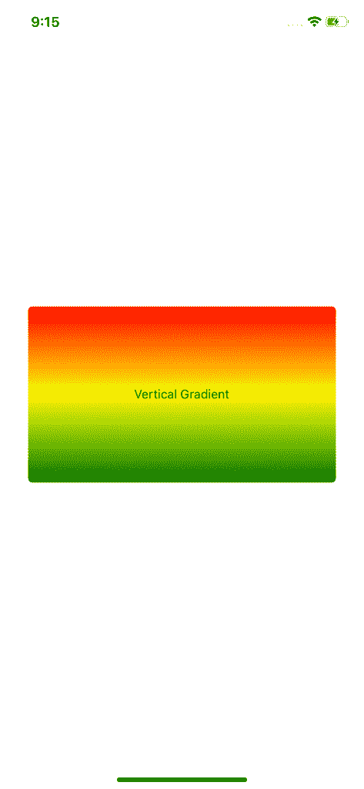
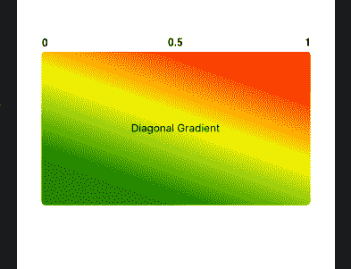
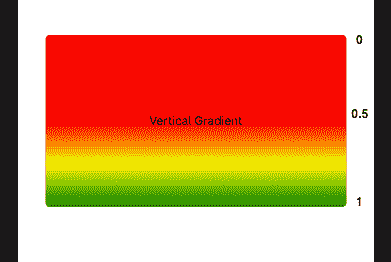
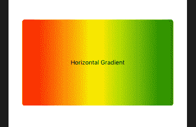
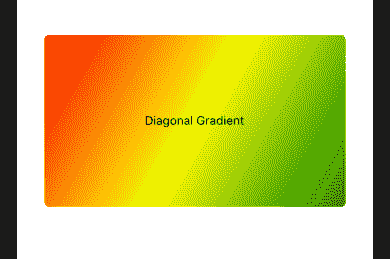
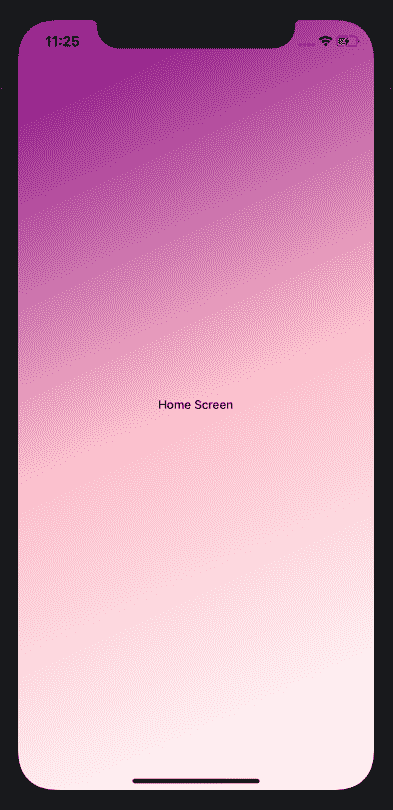
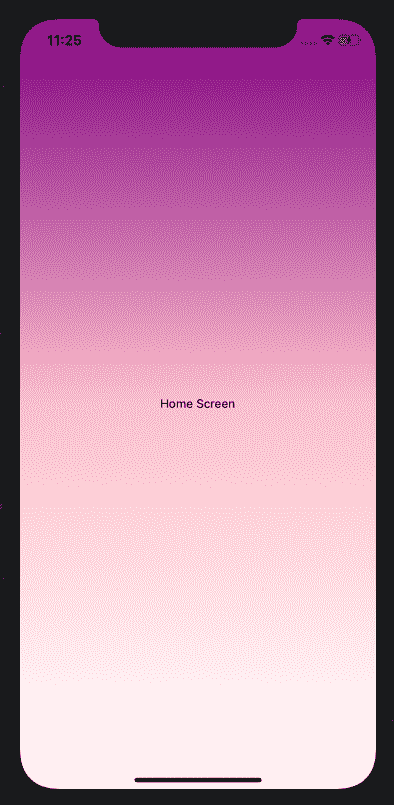
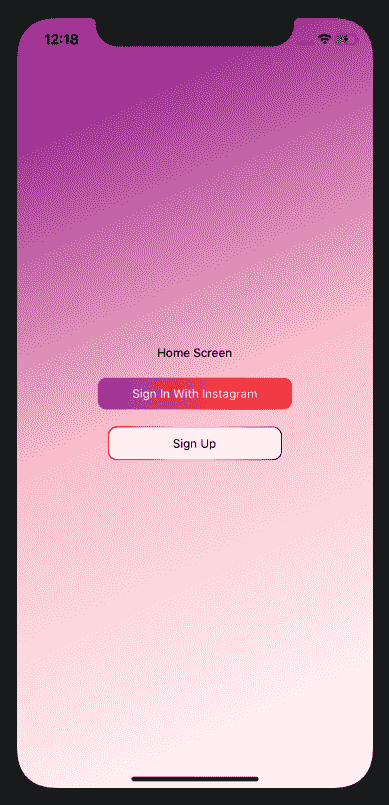

# 使用 react-native-linear-gradient-log rocket 博客创建复杂渐变

> 原文：<https://blog.logrocket.com/complex-gradients-react-native-linear-gradient/>

***编者按**:这篇文章最后一次更新是在 2022 年 4 月 27 日，以反映教程中使用的基于类的组件的变化。*

渐变是一种将多种颜色以平滑过渡的方式混合在一起的设计技术。比如想到 [Instagram 的 logo](https://upload.wikimedia.org/wikipedia/commons/thumb/e/e7/Instagram_logo_2016.svg/1024px-Instagram_logo_2016.svg.png) 。当您想要创建多色背景或自定义按钮时，渐变可以派上用场，为您的 UI 增加视觉趣味并引导用户的注意力。

在本文中，我们将探索水平、垂直和对角线线性渐变，学习如何将它们添加到我们的 React 本机应用程序中。为了跟进，您需要对 React Native 有一个基本的了解。您还需要在您的开发机器上设置 React Native。我们开始吧！

## 反应-自然-线性-渐变入门

在本教程中，我们将使用[react-native-linear-gradient](https://github.com/react-native-community/react-native-linear-gradient)，一个用于将渐变添加到我们的应用程序中的库。首先，让我们建立一个新的 React 原生项目:

```
npx react-native init LinearGradientExample

cd LinearGradientExample
yarn start

```

然后，我们将运行我们的应用程序，在设备或模拟器上显示 React 本机欢迎屏幕。随着我们的 React Native 应用程序的运行，我们可以添加 react-native-linear-gradient。react-native-linear-gradient 的设置取决于您使用的 React Native 版本。在本教程中，我使用的是 v0.6+。如果你使用的是旧版本的 React Native，请查看设置:

```
yarn add react-native-linear-gradient

```

要特别完成 iOS 的设置，请安装 pods:

```
npx pod-install

```

## 线性渐变

我们将从从库中导入`LinearGradient`组件开始:

```
import LinearGradient from 'react-native-linear-gradient'

```

`LinearGradient`组件接受一些决定渐变如何显示的属性，包括颜色、开始位置和结束位置。在我们开始使用道具建立复杂的渐变之前，我们应该分解并回顾每一个。

### `colors`

`colors`，这是必需的，是我们传递想要显示的颜色的方式。颜色可以以不同的格式传递，如 name、rgba、hex 等。您应该按照想要显示的顺序来排列颜色。比如用`colors={["purple","white"]}`，渐变会从紫色移动到白色。

### `start`

`start`通过向 x 轴和 y 轴传递坐标来指示渐变开始的位置。坐标作为整个视图的一部分传递，值的范围从`0 – 1`开始。默认为`{ x: 0.5, y: 0 }`，从顶部中心开始。

### `end`

`end`类似于`start`，但它表示渐变结束的位置。它像`start`一样接受坐标，如前所述，这是整个视图的一部分。默认为`{ x: 0.5, y: 1 }`，结束于底部中心。

### `locations`

`locations`是一个数字数组，定义每种颜色在渐变中的终止位置。这些值也作为整个渐变的一部分从`0 – 1`传递，并且必须映射在长度和位置上传递的相应颜色。

例如，假设我们有颜色`= {["red","yellow","green"}]`。然后，我们将有位置`={[0, 0.5, 0.6]}`，第一种颜色`red`覆盖`0 – 0.5`，第二种颜色`yellow`从`0.5 – 0.6`开始，最后，`green`从`0.6 – 1`开始。

现在我们了解了基本原理，让我们建立一些不同类型的梯度。

## 垂直渐变

如前所述，您可以创建不同方向的渐变。让我们先试试垂直渐变，这是 react-native-linear-gradient 的默认设置。渐变从顶部中心开始，一直向下到底部中心。我们来试试吧！

首先，清除`App.js`中的所有东西，这样你就可以从头开始。添加以下代码:

```
import React from 'react'
import { StyleSheet, View, Text } from 'react-native'
import LinearGradient from 'react-native-linear-gradient'. // import LinearGradient

function App() {
    return (
      <View style={styles.container}>
        <LinearGradient
          colors={['red', 'yellow', 'green' ]}
          style={styles.linearGradient}
        >
          <Text>Vertical Gradient</Text>
        </LinearGradient>
      </View>
    )
}

const styles = StyleSheet.create({
  container: {
    flex: 1,
    alignItems: 'center',
    justifyContent: 'center',
  },
  linearGradient: {
    alignItems: 'center',
    justifyContent: 'center',
    borderRadius: 5,
    height: 200,
    width: 350,
  },
})
export default App

```

从顶部的导入开始，我们从 React 导入 React，从 React Native 导入一些组件，然后为`LinearGradient`添加导入。

接下来，我们添加一个带有样式的`View`,将所有东西放置在我们添加渐变的中心。在`LinearGradient`组件中，我们传递了`colors`，这是必需的道具，如前所述。我们增加了三种颜色；我们的渐变会从`red`移动到`yellow`，最后是`green`。默认情况下，渐变将从顶部中心移动到底部中心。

重新加载应用程序，你应该会看到渐变:



React Native vertical gradient background

很好，我们的梯度像预期的那样出现了。为了更好地理解我们之前谈到的道具，让我们稍微使用一下我们目前拥有的渐变。

如上所述，`start`的默认属性是`start={{ x: 0.5, y: 0 }}`，这意味着渐变将从顶部中心开始。但是我们所说的顶部中心到底是什么意思呢？

想象渐变的整个宽度，即 x 轴从`0 – 1`开始校准。中心应该是`0.5`，如下图。改变这个值应该会改变我们渐变开始的顶点，创建一个对角线渐变。让我们更新当前的`LinearGradient`，为`start`添加值，如下所示:

```
...
      <LinearGradient
        colors={['red', 'yellow', 'green' ]}
        style={styles.linearGradient}
        start={{ x: 0.7, y: 0 }}
      >
        <Text>Diagonal Gradient</Text>
      </LinearGradient>
...

```



Diagonal gradient

正如你在上面的截图中看到的，渐变变成了对角线，从`0.5`和`1`之间的某处开始向下移动。如果值为`0`或`1`，对角线渐变将从各自的角开始，右或左。

调整 y 轴值将决定渐变开始的位置。渐变之前的空间将被第一种颜色覆盖。将道具更新为`start={{ x: 0.5, y: 0.5}}`将使渐变从我们视图的中心开始，上半部分被红色覆盖:



Vertical gradient with more red

## 水平渐变

现在我们已经了解了如何在 x 和 y 轴上更新我们的起点，让我们将它与`end`属性结合起来创建水平渐变。

如前所述，`end`决定了我们的梯度将在哪里结束。对于水平渐变，理想情况下，我们希望它从左中心开始，在右中心结束。让我们试试这个:

```
...
      <LinearGradient
        colors={['red', 'yellow', 'green' ]}
        style={styles.linearGradient}
        start={{ x: 0, y: 0.5 }}
        end={{ x: 1, y: 0.5 }}
      >
        <Text>Horizontal Gradient</Text>
      </LinearGradient>
...

```

如您所见，y 轴从开始到结束保持不变，而 x 轴从`0 – 1`开始移动，创建了以下渐变:



Horizontal gradient

我们可以进一步调整，以创建一个接近水平对齐的对角线渐变。更新`start={{ x: 0, y: 0 }}`和`end={{ x: 1, y: 1 }}`应该创建这样的梯度:



Diagonal gradient

## `locations`

随着其他大部分道具投入使用，我们只剩下`locations`道具尚未使用。简单回顾一下，`locations`决定了颜色在渐变中的终止位置，并映射到相应的`color`值。

与其他颜色相比，当您希望一种或多种颜色在渐变视图中覆盖更多空间时，通常会使用位置。范围较大的颜色将覆盖更多空间:

```
...
      <LinearGradient
        colors={['red', 'yellow', 'green' ]}
        style={styles.linearGradient}
        start={{ x: 0, y: 0.5 }}
        end={{ x: 1, y: 0.5 }}
        locations={[0, 0.7, 0.9]}
      >
        <Text>H. Location Gradient</Text>
      </LinearGradient>
      <LinearGradient
        colors={['red', 'yellow', 'green' ]}
        style={styles.linearGradient}
        locations={[0, 0.3, 0.9]}
      >
        <Text>V. Location Gradient</Text>
      </LinearGradient>
...

```

让我们看看实际情况:


H. location gradient


V. location gradient

随意摆弄颜色，改变它们，添加更多颜色，调整`start`、`end`和`locations`的值，看看它们的表现如何。

## 奖金

在本节中，我们将回顾上面提到的`LinearGradients`的几个用例:

*   全屏多色背景
*   带有渐变背景的按钮
*   带渐变边框的按钮

对于这些例子，我们重新开始吧！创建一个名为`Home.js`的新文件，并更新`index.js`使其指向根文件:

```
// index.js
...
// import App from './App'  // comment this out
import App from './Home'  // add this
...
```

现在，我们的应用程序应该呈现主屏幕，所以我们可以在那里进行更新。然后，让我们跳到新的`Home.js`文件，创建一些东西，比如，全屏，多色背景:

```
// Home.js
import React from 'react'
import { StyleSheet, Text } from 'react-native'
import LinearGradient from 'react-native-linear-gradient'
function Home() {
    return (
      <LinearGradient
        colors={['purple', 'white']}
        style={styles.container}
        start={{ x: 0, y: 0 }}
        end={{ x: 1, y: 1 }}
      >
        <Text>Home Screen</Text>
      </LinearGradient>
    )
}
const styles = StyleSheet.create({
  container: {
    flex: 1,
    alignItems: 'center',
    justifyContent: 'center',
  },
})
export default Home

```

您可以选择是否使用`start`和`end`道具来创建垂直或对角线背景:



Home screen purple gradient background



Home screen gradient

最后，对于我们的两个按钮，让我们跳回到**主屏幕**文本下面的`Home.js`并添加这两个按钮。我都使用了水平背景。第一个是渐变背景，试图模仿 Instagram 的配色方案，而另一个则创造了边框渐变效果:

```
// Home.js

...
      <Text>Home Screen</Text>
      <TouchableOpacity onPress={() => {}}>
        <LinearGradient
          start={{ x: 0, y: 0 }}
          end={{x: 1, y: 1 }}
          colors={['#5851DB', '#C13584', '#E1306C', '#FD1D1D', '#F77737']}
          style={styles.instagramButton}
          >
          <Text style={{ color: 'white' }}>
            Sign In With Instagram
          </Text>
        </LinearGradient>
      </TouchableOpacity>
      <LinearGradient
        start={{ x: 0, y: 0 }}
        end={{x: 1, y: 1 }}
        colors={[ 'red', 'yellow', 'green' ]}
        style={{
          alignItems: 'center',
          justifyContent: 'center',
          borderRadius: 10,
        }}
      >
        <TouchableOpacity
          onPress={() => {}}
          style={styles.signUpButton}
        >
          <Text>Sign Up</Text>
        </TouchableOpacity>
      </LinearGradient>

...

// styles
  instagramButton: {
    paddingHorizontal: 40,
    paddingVertical: 10,
    borderRadius: 10,
    margin: 20
  },
  signUpButton: {
    margin: 1,
    width: 200,
    borderRadius: 10,
    paddingVertical: 10,
    alignItems: 'center',
    justifyContent: 'center',
    backgroundColor: 'white',
  },

```

上面的代码应该给我们一个最终的输出，如下所示:



React Native home screen with Instagram button

## 结论

像往常一样，熟能生巧，所以玩不同的道具，直到你找到窍门。提醒一句，说到颜色，尽量不要过度使用。屏幕上有太多的颜色会对用户界面和体验产生负面影响。我希望你喜欢这篇文章。编码快乐！

## [LogRocket](https://lp.logrocket.com/blg/react-native-signup) :即时重现 React 原生应用中的问题。

[](https://lp.logrocket.com/blg/react-native-signup)

[LogRocket](https://lp.logrocket.com/blg/react-native-signup) 是一款 React 原生监控解决方案，可帮助您即时重现问题、确定 bug 的优先级并了解 React 原生应用的性能。

LogRocket 还可以向你展示用户是如何与你的应用程序互动的，从而帮助你提高转化率和产品使用率。LogRocket 的产品分析功能揭示了用户不完成特定流程或不采用新功能的原因。

开始主动监控您的 React 原生应用— [免费试用 LogRocket】。](https://lp.logrocket.com/blg/react-native-signup)