# 使用 CSS 渐变的复杂模式

> 原文：<https://blog.logrocket.com/complex-patterns-using-css-gradients/>

## 媒体的重要性

在现代网站开发中，为你的网站增加视觉效果是最重要的，这样才能抓住访问者的注意力，提高用户的忠诚度和参与度。网站由横跨整个页面的大量文本构成的时代已经一去不复返了。如今，如果没有迷人的背景来欢迎你，网页是相当不完整的。

但是其中一些伴随着额外的成本。将图像添加到您的站点意味着添加额外的字节(准确地说是兆字节),以便通过网络获取该媒体。但是，有一个折中的办法，一个两全其美的解决方案。这个解决方案是使用 CSS(特别是 CSS 渐变)来生成你的背景图片，如果可能的话。

一旦你知道如何以正确的方式使用这些属性，你可能会惊讶地发现几行 CSS 就能在设计和模式方面实现什么。如果你仍然持怀疑态度，请查看 [cssgradient.io](https://cssgradient.io/) ，你会发现大多数吸引眼球的设计图案是如何通过几行代码实现的。

## 了解线性梯度

为了使用 CSS 创建图案，首先需要掌握的是 CSS3 提供的[线性渐变](https://developer.mozilla.org/en-US/docs/Web/CSS/linear-gradient)函数。让我们学习它的正确用法，并创建几个基本示例。

## 使用

通过调整多个属性，线性渐变函数可以以多种方式使用，但最基本的用法是指定开始颜色和结束颜色，如下所示:

```
background: linear-gradient(<starting-color>, <ending-color>, ...<other-colors>);
```

跟随或者随意使用这个 [代码笔](https://codepen.io/kokanek/pen/NWGJENL) :

参见 [CodePen](https://codepen.io) 上 kape El koka ne([@ koka nek](https://codepen.io/kokanek))
的笔 [NWGJENL](https://codepen.io/kokanek/pen/NWGJENL) 。

基本模式

## 双色对称渐变

### 根据 div 的大小，中间颜色填充在两者之间。我们在这里没有指定任何尺寸，所以这两种颜色在中心相遇:

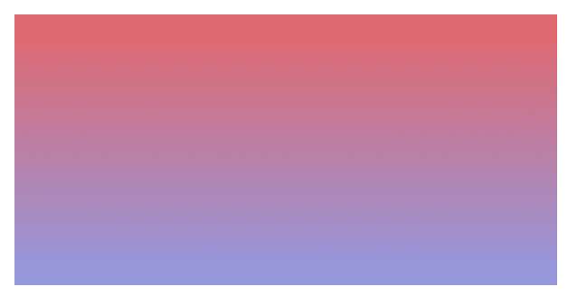

```
background: linear-gradient(#e66465, #9198e5);
```

双色不对称渐变

### 除了颜色值，我们还可以提供一个百分比值，以百分比单位表示该颜色的颜色停止点。在这种情况下，大部分区域被纯色占据，剩下的区域被其他颜色占据。

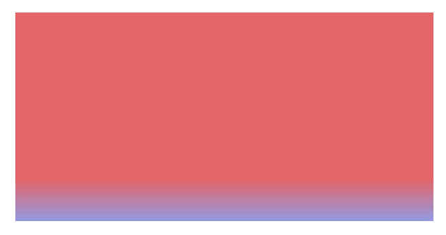

```
background: linear-gradient(#e66465 80%, #9198e5);
```

双色实心图案

### 如果我们为这两种颜色提供百分比值，而不是渐变，我们会得到这种纯色组合。其中第一种纯色的范围从 *0 到 80%*，第二种纯色的范围从 *80 到 100* 。

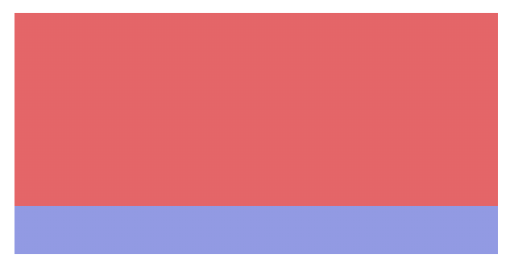

```
background: linear-gradient(#e66465 80%, #9198e5 80%);
```

双色方向图案

### 这个函数有一个微小的变化，它也允许我们配置模式生成的方向。例如，提供一个`to right`值作为第一个参数会使模式从左到右显示，而不是默认的从上到下。其他有效值有:`to left`、`to top`、`to bottom`、 `to bottom left`等。

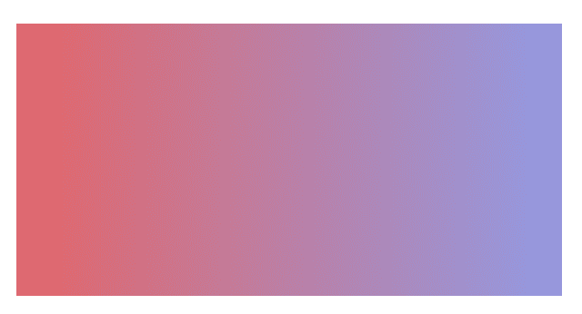

```
background: linear-gradient(to right, #e66465, #9198e5);
```

多色图案

### 就像前面使用两种颜色的例子一样，我们可以提供尽可能多的我们喜欢的颜色，并同样容易地获得那些美丽的渐变。这里有一个例子:

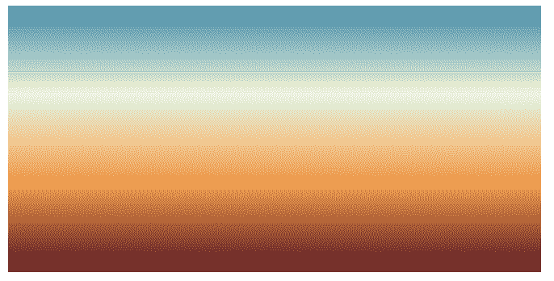

```
background: linear-gradient(#3f87a6, #ebf8e1, #f69d3c, #561423);
```

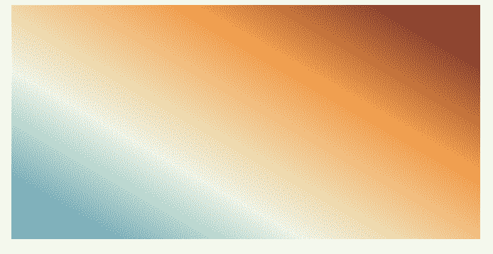

Also, in addition to specifying the direction using the `to` syntax that we used before, there are other ways of achieving the same result.
Supplying an angular value as the first argument means the gradient gets rotated accordingly. Supplying an angular value of 180 degrees keeps the pattern as is.

```
background: linear-gradient(30deg, #3f87a6, #ebf8e1, #f69d3c, #561423);
```

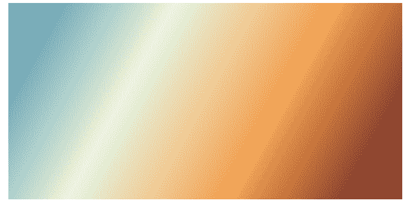

The second method is a fraction to the `turn` units, like `0.25turn`.

```
background: linear-gradient(0.33turn, #3f87a6, #ebf8e1, #f69d3c, #561423);
```

中间模式

## 既然我们已经熟悉了线性梯度函数的基本语法，那么让我们来探索一些可以通过使用几个 CSS 属性的组合来创建的中间模式。

垂直条

### 一旦你知道幕后发生了什么，实现竖条效果就很容易了。让我们一步一步地探索这个问题。首先，让我们设置一个线性梯度:

在此示例中，渐变的前半部分应该是透明的，而后半部分是白色，alpha 或透明度为 50%。现在，我们给背景添加一种颜色:`background-color: #00ccd6;`。这给了我们结果:

```
background-image: linear-gradient(90deg, transparent 50%, rgba(255,255,255,.5) 50%);
```

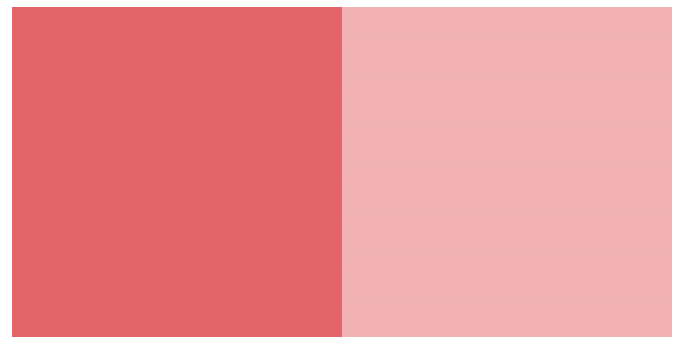

这里，前半部分显示原始颜色，后半部分为 50%透明。现在，剩下的就是重复这个图案，为此，我们将背景图像的宽度设置为 20px。`background-size: 20px;`:

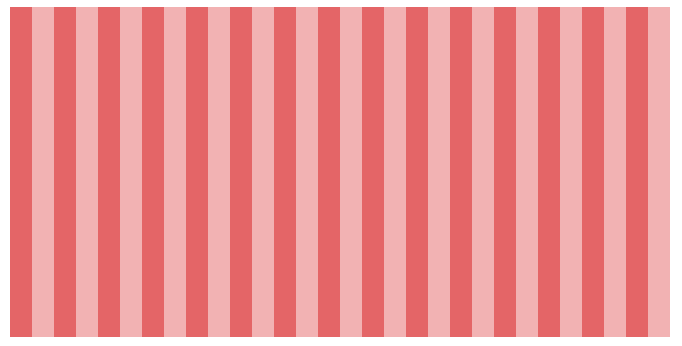

我们用三行 CSS 实现了竖条模式:

棋盘形图案

```
background-color: #00ccd6;
background-image: linear-gradient(90deg, transparent 50%, rgba(255,255,255,.5) 50%);
background-size: 20px;
```

### 基于与上一个例子相同的模式，现在让我们通过将条形的概念扩展到水平轴来做一个类似棋盘的模式。这样，当它们与竖条重叠时，就创建了图案。令人惊奇的是，只需添加另一个带有`to bottom`方向的线性渐变就可以实现我们想要的结果:

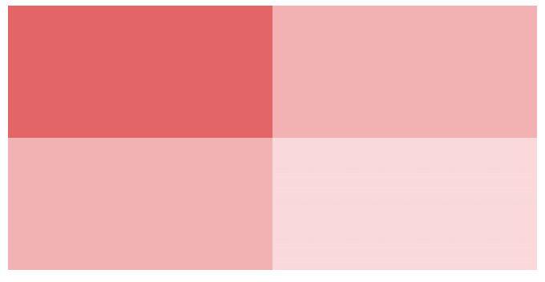

这一次，我们需要在两个方向上重复相同的图案，我们通过设置宽度和高度来做到这一点，以便在两个方向上重复:

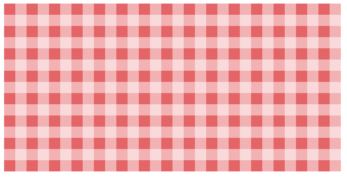

这是那个神话般的棋盘模式的综合 CSS:

高级模式

```
background-color: #e66464;
background-image: linear-gradient(to right, transparent 50%, rgba(255, 255, 255, 0.5) 50%),
linear-gradient(to bottom, transparent 50%, rgba(255, 255, 255, 0.5) 50%);
background-size: 20px 20px;

```

## 现在让我们转到一些高级模式。这些图案是通过使用多种线性梯度形成的，然后将它们叠加在一起形成基本形状。重复这个形状为我们创造了一个图案。让我们从菱形图案开始。

菱形图案

### 从 CSS 的角度来考虑一个菱形，我们可以看到它有四条边以直角相互连接。我们可以通过使用以特定角度旋转的双色实心渐变来模拟这些边的创建。为此，首先，我们设置一个背景颜色。`background-color: #782345;`。然后是第一个线性梯度，`linear-gradient(135deg, #eceddc 25%, transparent 25%)`，它给出了这个结果:

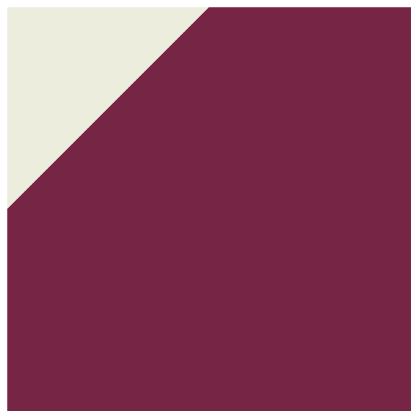

我们可以看到它充当了菱形的左上侧。类似地，创建右上侧。`linear-gradient(225deg, #eceddc 25%, transparent 25%)`这给了我们这个:

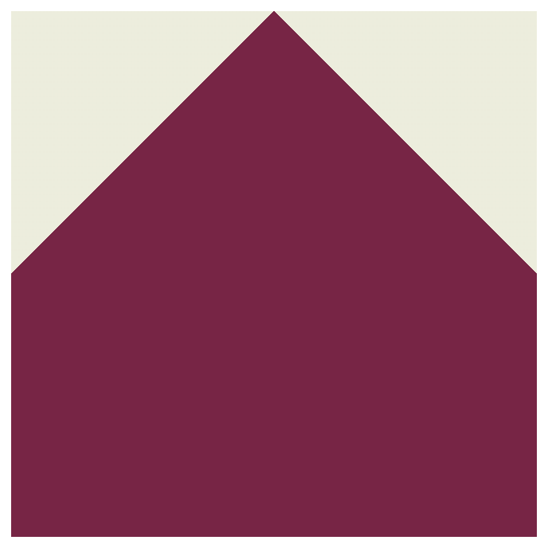

我们的钻石现在准备好了。困难的部分完成了。现在剩下的就是复制这个模式。我们知道如何做到这一点，通过指定宽度和高度，使模式复制。最后，我们的 CSS 看起来像这样:

We proceed in the same manner to add the remaining two sides of the diamond too and adding two more linear gradients gives us this structure:
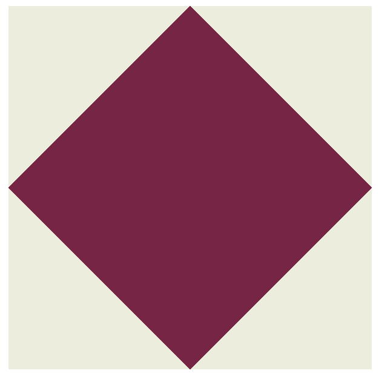

而最终的结果就是这个壮观的菱形图案:
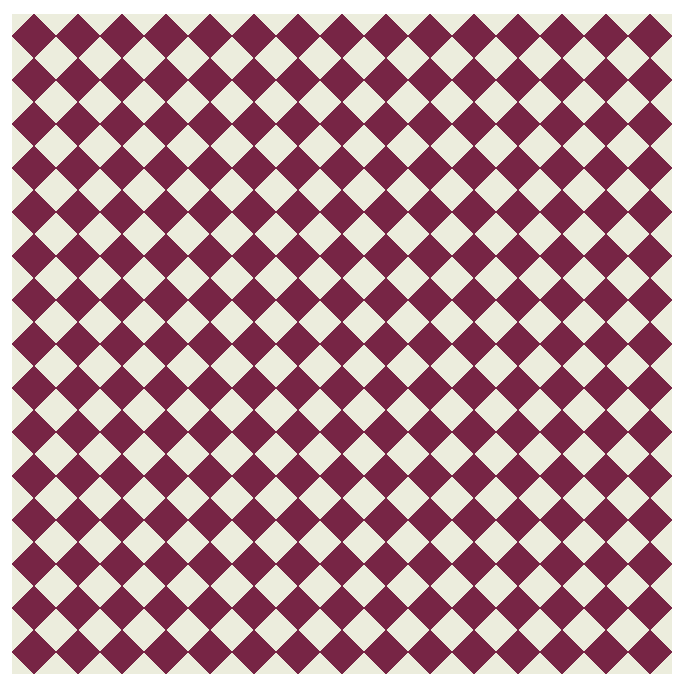

```
background: linear-gradient(135deg, #eceddc 25%, transparent 25%),
linear-gradient(225deg, #eceddc 25%, transparent 25%),
linear-gradient(315deg, #eceddc 25%, transparent 25%),
linear-gradient(45deg, #eceddc 25%, transparent 25%); 
background-size: 20px 20px;
background-color: #782345;
```

曲折图形

### 线条以特定角度上下移动的锯齿形图案不同于菱形图案。但是，您可能会惊讶地发现，当涉及到 CSS 时，只需稍微调整一下我们前面的例子就可以实现这种模式。

想象菱形由两个三角形组成。一个上三角形和一个下三角形。将上面的三角形水平偏移一个特定的量，可以创建出我们正在寻找的完全相同的图案。

为了抵消梯度，我们添加一个 50px 的 x 偏移和一个 0 的 y 偏移到上面三角形的线性梯度，就像这样:`linear-gradient(135deg, #eceddc 25%, transparent 25%) 50px 0`令人惊讶的是，这就是得到这个锯齿形图案所要做的一切:

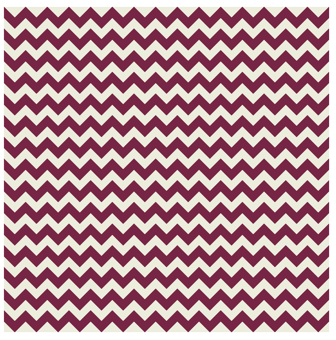

下面是最终的 CSS:

结论

```
background: linear-gradient(135deg, #eceddc 25%, transparent 25%) 50px 0,
linear-gradient(225deg, #eceddc 25%, transparent 25%) 50px 0,
linear-gradient(315deg, #eceddc 25%, transparent 25%),
linear-gradient(45deg, #eceddc 25%, transparent 25%);
background-size: 20px 20px;
background-color: #782345;

```

## 这就对了。这就是我们创造复杂图案的方式。首先构建基础结构，然后在水平轴和垂直轴上重复构建，并根据需要偏移它们。通过这样做，我们获得了比使用图像背景更多的优势。优势包括节省带宽、响应速度和无限大小的无损扩展。如果三到四行的 CSS 能给我们带来这些好处，那就值得深入研究和学习这种创建媒体资产的替代方法。

你的前端是否占用了用户的 CPU？

## 随着 web 前端变得越来越复杂，资源贪婪的特性对浏览器的要求越来越高。如果您对监控和跟踪生产中所有用户的客户端 CPU 使用、内存使用等感兴趣，请尝试 LogRocket 。[](https://logrocket.com/signup/)[https://logrocket.com/signup/](https://logrocket.com/signup/)

LogRocket 就像是网络应用的 DVR，记录你的网络应用或网站上发生的一切。您可以汇总和报告关键的前端性能指标，重放用户会话和应用程序状态，记录网络请求，并自动显示所有错误，而不是猜测问题发生的原因。

现代化您调试 web 应用的方式— [开始免费监控](https://logrocket.com/signup/)。

Modernize how you debug web apps — [Start monitoring for free](https://logrocket.com/signup/).