# 通过 Pinia 简化复杂的 Vue 3 状态管理

> 原文：<https://blog.logrocket.com/complex-vue-3-state-management-pinia/>

状态管理是 web 应用程序开发的基石之一；任何重要的应用程序都需要某种状态管理。多年来，Vuex 是 Vue 应用程序事实上的状态管理工具。

不过，新的 Vue docs 官方推荐了另一个工具:Pinia。但在你说“哦，不，不是另一个学习工具”之前，你应该知道皮尼亚实际上是 Vuex 5，正如[尤雨溪在这条推特](https://twitter.com/youyuxi/status/1463429442076745730?s=20&t=5UaGmw4TJTPWS2hxE1a5Zw)中写道:

[](https://blog.logrocket.com/?attachment_id=102947)

在本教程中，我们将通过学习如何创建、使用和检查数据存储来研究 Pinia 最重要的特性，包括:

我们将在此过程中构建的项目将演示构建具有复杂状态的应用程序的基础。但首先，我们来看看皮尼亚和 Vuex 有什么不同。

## pinia 诉 Vuex 案

虽然 Pinia 可以被视为 Vuex 5，但您应该记住两者之间的一些重要差异:

*   在皮尼亚，突变被删除，因为它们极其冗长
*   Pinia 完全支持 TypeScript 并为 JavaScript 代码提供自动补全功能
*   Pinia 不需要嵌套模块，但是如果一个存储使用另一个存储，这可以被认为是隐式嵌套
*   在 Pinia 中，不需要像 Vuex 模块那样命名应用商店
*   Pinia 使用组合 API，但也可以与选项 API 一起使用
*   Pinia 提供服务器端渲染(SSR)支持
*   Vue 2 或 Vue 3 可以使用 Pinia(都有 devtools 支持)

## 使用基本的 Pinia 商店

Pinia API 得到了最大程度的简化。下面是一个基本的 Pinia 商店示例:

```
import { defineStore } from 'pinia'

export const useCounterStore = defineStore({
  id: 'counter',
  state: () => ({
    counter: 0
  }),
  getters: {
    doubleCount: (state) => state.counter * 2
  },
  actions: {
    increment() {
      this.counter++
    }
  }
})

```

为了定义一个商店，我们使用了`defineStore`函数。这里使用了单词`define`而不是`create`,因为商店直到在组件/页面中实际使用时才被创建。

以`use`开头的商店名称是整个[组件](https://vuejs.org/guide/reusability/composables.html)的惯例。每个商店必须提供一个惟一的`id`来将商店挂载到 devtools。

皮尼亚还使用了`state`、`getters`和`actions`的概念，在部件上相当于`data`、`computed`和`methods`:

*   `state`被定义为返回初始状态的函数
*   `getters`是接收`state`作为第一个参数的函数
*   `actions`是可以异步的函数

这几乎是你定义 Pinia 商店所需要知道的一切。在本教程的剩余部分，我们将会看到商店是如何在组件/页面中实际使用的。

在了解了 Pinia API 有多简单之后，让我们开始构建我们的项目。

## Pinia 入门

为了展示 Pinia 的特性，我们将构建一个具有以下特性的基本博客引擎:

*   所有帖子的列表
*   带有帖子评论的单个帖子页面
*   所有帖子作者的列表
*   一个包含作者文章的作者页面

首先，让我们通过运行以下命令创建一个新的 Vue 项目:

```
npm init [email protected]

```

这将安装并执行官方的 Vue 项目搭建工具`[create-vue](https://github.com/vuejs/create-vue)`，用 Vue 和 [Vite](https://blog.logrocket.com/whats-new-in-vite-2-0/) 建立一个新项目。在此过程中，您必须选择项目所需的工具:

[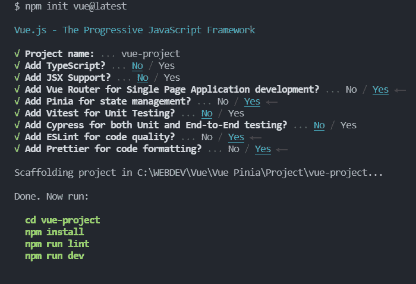](https://blog.logrocket.com/?attachment_id=102950)

选择所有标有红色箭头的工具:Router、Pinia、 [ESLint 和 Prettier。](https://blog.logrocket.com/using-prettier-eslint-automate-formatting-fixing-javascript/)安装完成后，导航到项目并安装依赖项:

```
cd vue-project
npm install

```

现在，您可以通过运行以下命令在浏览器中打开项目:

```
npm run dev

```

您的新 Vue 应用程序将在 [http://localhost:3000](http://localhost:3000) 提供。以下是您应该看到的内容:

[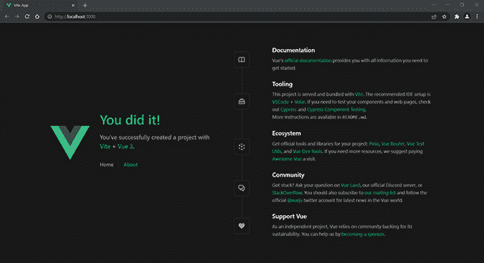](https://blog.logrocket.com/?attachment_id=102953)

现在，为了适应我们的需求，我们将清理默认的项目结构。这是它现在的样子和我们要删除的内容。

[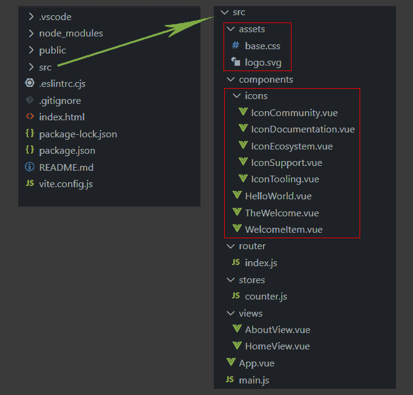](https://blog.logrocket.com/?attachment_id=102956)

为此，首先，关闭您的终端并删除红色边框内的所有文件/文件夹。

现在，我们准备开始编写项目的代码。

让我们首先打开`main.js`文件，看看 Pinia 根存储是如何创建并包含在项目中的:

```
import { createApp } from 'vue'
import { createPinia } from 'pinia' // Import

import App from './App.vue'
import router from './router'

const app = createApp(App)

app.use(createPinia()) // Create the root store
app.use(router)

app.mount('#app')

```

如您所见，`createPinia`函数被导入，创建 Pinia 商店，并将其传递给应用程序。

现在，打开`App.vue`文件并用以下内容替换其内容:

```
<script setup>
import { RouterLink, RouterView } from 'vue-router'
</script>

<template>
   <header class="navbar">
    <div>
      <nav>
        <RouterLink to="/">Posts</RouterLink> - 
        <RouterLink to="/authors">Authors</RouterLink>
      </nav>
    </div>
  </header> 

  <RouterView />
</template>

<style>
  .navbar {
    background-color: lightgreen;
    padding: 1.2rem;
  }
</style>

```

在这里，我们通过用帖子替换**主页** **，用**作者**替换关于**的**来改变链接标签。**

我们还将**作者**链接从`/about`更改为`/authors`，移除了所有默认样式，并为`navbar`类添加了我们自己的样式，我们添加这些样式是为了区分导航和文章。

好了，现在我们准备深入 Pinia 并定义必要的应用商店。

## 在皮尼亚定义应用商店

对于我们的小应用程序，我们将使用 [JSONPlaceholder](https://jsonplaceholder.typicode.com/) 服务作为数据源和这三个资源:`users`、`posts`和`comments`。

为了理解我们如何更好地创建应用商店，让我们看看这些资源是如何相互关联的。请看下图:

[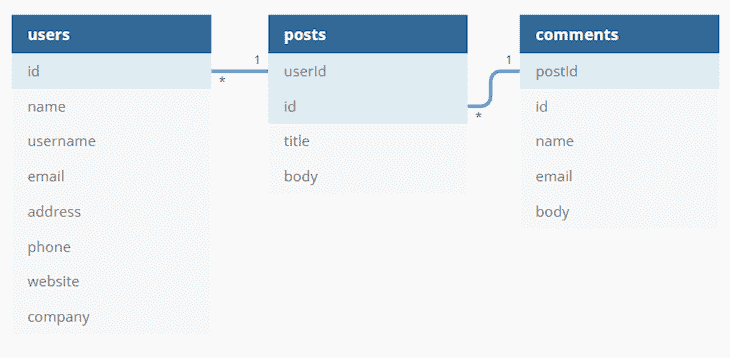](https://blog.logrocket.com/?attachment_id=102959)

如你所见，**用户**通过其`id`连接到帖子，**帖子**以同样的方式连接到**评论**。因此，要获得一篇文章的作者，我们可以使用`userId`，要获得一篇文章的评论，我们可以使用`postId`。

有了这些知识，我们就可以开始将数据映射到我们的商店。

### 定义文章存储

我们将定义的第一个商店是博客文章商店。在`stores`目录中，将`counter.js`重命名为`post.js`，并将其内容替换为以下内容:

```
import { defineStore } from 'pinia'

export const usePostStore = defineStore({
  id: 'post',
  state: () => ({
    posts: [],
    post: null,
    loading: false,
    error: null
  }),
  getters: {
    getPostsPerAuthor: (state) => {
      return (authorId) => state.posts.filter((post) => post.userId === authorId)
    }
  }, 
  actions: {
    async fetchPosts() {
      this.posts = []
      this.loading = true
      try {
        this.posts = await fetch('https://jsonplaceholder.typicode.com/posts')
        .then((response) => response.json()) 
      } catch (error) {
        this.error = error
      } finally {
        this.loading = false
      }
    },
    async fetchPost(id) {
      this.post = null
      this.loading = true
      try {
        this.post = await fetch(`https://jsonplaceholder.typicode.com/posts/${id}`)
        .then((response) => response.json())
      } catch (error) {
        this.error = error
      } finally {
        this.loading = false
      }
    }
  }
})

```

让我们把它分成小块，解释一下发生了什么。首先，我们用`post`的`id`定义一个`usePostStore`。

其次，我们用四个属性定义我们的`state`:

*   `posts`用于保存提取的帖子
*   `post`担任现任职务
*   `loading`用于保持装载状态
*   `error`用于保存错误，如果存在的话

第三，我们创建一个 getter 来获取一个作者写了多少文章。默认情况下，getter 将`state`作为参数，并使用它来访问`posts`数组。Getters 不能接受自定义参数，但是我们可以返回一个可以接受自定义参数的函数。

因此，在我们的 getter 函数中，我们过滤`posts`来查找具有特定用户 ID 的所有帖子。稍后在组件中使用时，我们将提供该 ID。

但是，请注意，当我们从 getter 返回带有参数的函数时，getter 不再被缓存。

最后，让我们创建两个异步动作来获取所有帖子和一个帖子。

在`fetchPosts()`动作中，我们首先复位`posts`并将`loading`设置为`true`。然后，我们通过使用 [FetchAPI](https://blog.logrocket.com/intercepting-javascript-fetch-api-requests-responses/) 和来自 JSONPlaceholder 的帖子资源来获取帖子。如果有错误，我们将该错误分配给 error 属性。最后，我们将`loading`设置回`false`。

`fetchPost(id)`动作几乎是相同的，但是这次我们使用了`post`属性并提供了一个`id`来获得一个帖子；确保在获取文章时使用反引号而不是单引号。

在这里，我们还重置了`post`属性，因为如果我们不这样做，当前的帖子将显示前一个帖子的数据，新获取的帖子将被分配给`post`。

我们已经发布了帖子，现在是时候听取一些评论了。

在`stores`目录下，创建一个包含以下内容的`comment.js`文件:

```
import { defineStore } from 'pinia'
import { usePostStore } from './post'

export const useCommentStore = defineStore({
  id: 'comment',
  state: () => ({
    comments: []
  }),
  getters: {
    getPostComments: (state) => {
      const postSore = usePostStore()
      return state.comments.filter((post) => post.postId === postSore.post.id)
    }
  },
  actions: {
    async fetchComments() {
      this.comments = await fetch('https://jsonplaceholder.typicode.com/comments')
      .then((response) => response.json())
    }
  }
})

```

这里，我们在`state`中创建一个`comments`数组属性来保存获取的注释。我们借助`fetchComments()`行动来获取它们。

这里有趣的部分是`getPostComments` getter。为了获得帖子的评论，我们需要一个当前帖子的 ID。既然我们在邮局已经有了，我们能从那里得到它吗？

是的，幸运的是，Pinia 允许我们在一个商店使用另一个商店，反之亦然。因此，为了获得文章的 ID，我们导入了`usePostStore`并在`getPostComments` getter 中使用它。

好了，现在我们有了评论；最后一件事是得到作者。

### 定义作者存储

在`stores`目录下，创建一个包含以下内容的`author.js`文件:

```
import { defineStore } from 'pinia'
import { usePostStore } from './post'

export const useAuthorStore = defineStore({
  id: 'author',
  state: () => ({
    authors: []
  }),
  getters: {
    getPostAuthor: (state) => {
      const postStore = usePostStore()
      return state.authors.find((author) => author.id === postStore.post.userId)
    }
  },
  actions: {
    async fetchAuthors() {
      this.authors = await fetch('https://jsonplaceholder.typicode.com/users')
      .then((response) => response.json())
    }
  }
})

```

这和`commentStore`很像。我们再次导入`usePostStore`,并使用它在`getPostAuthor` getter 中提供所需的作者 ID。

仅此而已。你会发现，使用 Pinia 这一简单而优雅的解决方案创建商店是多么简单。

现在，让我们看看如何在实践中使用商店。

## 在 Pinia 中创建视图和组件

在本节中，我们将创建必要的视图和组件来应用我们刚刚创建的 Pinia 商店。先说所有帖子的列表。

注意，我使用 Pinia 和[组合 API](https://blog.logrocket.com/how-to-build-applications-with-vues-composition-api/) 和`[<script setup>](https://vuejs.org/api/sfc-script-setup.html)` [语法](https://vuejs.org/api/sfc-script-setup.html)。如果您想使用[选项 API，请查看本指南](https://pinia.vuejs.org/cookbook/options-api.html)。

### 创建帖子视图

在`views`目录中，将`HomeView.vue`重命名为`PostsView.vue`，并将其内容替换为以下内容:

```
<script setup>
  import { RouterLink } from 'vue-router'
  import { storeToRefs } from 'pinia'
  import { usePostStore } from '../stores/post'

  const { posts, loading, error } = storeToRefs(usePostStore())
  const { fetchPosts } = usePostStore()

  fetchPosts()
</script>

<template>
  <main>
    <p v-if="loading">Loading posts...</p>
    <p v-if="error">{{ error.message }}</p>
    <p v-if="posts" v-for="post in posts" :key="post.id">
      <RouterLink :to="`/post/${post.id}`">{{ post.title }}</RouterLink>
      <p>{{ post.body }}</p>
    </p>
  </main>
</template>

```

请注意，如果您收到一个通知，说您已经重命名了该文件，请忽略它。

在这里，我们从 post store 导入和提取所有必要的数据。

我们不能对状态属性和吸气剂使用[析构](https://developer.mozilla.org/en-US/docs/Web/JavaScript/Reference/Operators/Destructuring_assignment)，因为它们会失去反应性。为了解决这个问题，Pinia 提供了`storeToRefs`实用程序，为每个属性创建一个 ref。可以毫无问题地直接提取动作。

我们调用`fetchPosts()`来获取邮件。当使用组合 API 并调用`setup()`函数内部的函数时，相当于使用了`created()`钩子。因此，在组件安装之前，我们将有帖子。

模板中还有一系列的`v-if`指令。首先，如果加载是`true`，我们显示加载消息。然后，如果出现错误，我们会显示错误消息。

最后，我们遍历帖子并显示每个帖子的标题和正文。我们使用`RouterLink`组件向标题添加一个链接，这样当用户点击它时，他们将导航到 single post 视图，我们稍后将创建这个视图。

现在，让我们修改`router.js`文件。打开它并用以下内容替换其内容:

```
import { createRouter, createWebHistory } from 'vue-router'
import PostsView from '../views/PostsView.vue'

const router = createRouter({
  history: createWebHistory(), 
  routes: [
    {
      path: '/',
      name: 'posts',
      component: PostsView
    },
    {
      path: '/about',
      name: 'about',
      // route level code-splitting
      // this generates a separate chunk (About.[hash].js) for this route
      // which is lazy-loaded when the route is visited.
      component: () => import('../views/AboutView.vue')
    }
  ]
})

export default router

```

在这里，我们导入`PostsView.vue`并将其作为第一条路线中的一个组件。我们也把名字从**家**改成**岗**。

#### 测试文章视图

好了，现在是时候检验我们目前所取得的成绩了。运行应用程序(`npm run dev`)并在浏览器中查看结果:

[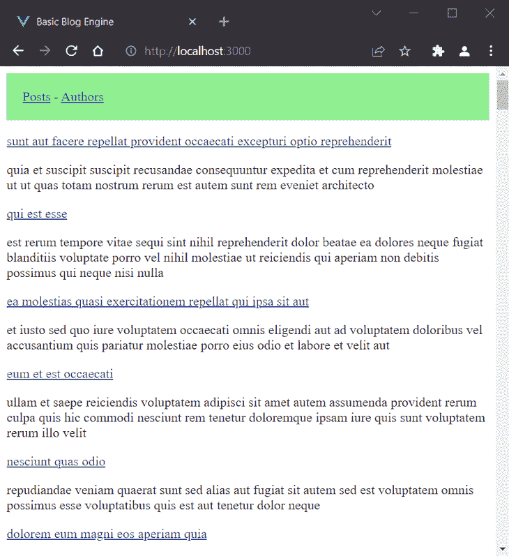](https://blog.logrocket.com/?attachment_id=102962)

您可能会在控制台中收到一些 Vue 警告，以“没有找到匹配项…”开始，这是因为我们还没有创建必要的组件，您可以放心地忽略它们。

如果帖子没有显示，您可能还需要重新加载页面。

让我们继续创建单篇文章视图。关闭终端以避免任何不必要的错误消息。

### 创建单个帖子视图

在`views`目录下，创建一个包含以下内容的`PostView.vue`文件:

```
<script setup>
  import { useRoute } from 'vue-router'
  import { storeToRefs } from 'pinia'
  import { useAuthorStore } from '../stores/author'
  import { usePostStore } from '../stores/post'
  import Post from '../components/Post.vue'

  const route = useRoute() 
  const { getPostAuthor } = storeToRefs(useAuthorStore())
  const { fetchAuthors} = useAuthorStore()
  const { post, loading, error } = storeToRefs(usePostStore())
  const { fetchPost } = usePostStore()

  fetchAuthors()
  fetchPost(route.params.id)
</script>

<template>
  <div>
    <p v-if="loading">Loading post...</p>
    <p v-if="error">{{ error.message }}</p>
    <p v-if="post">
      <post :post="post" :author="getPostAuthor"></post>
    </p>
  </div> 
</template>

```

在设置中，我们从作者存储中提取`getPostAuthor`和`fetchAuthors`，从发布存储中提取必要的数据。我们还调用`fetchAuthors()`来获取现有的作者。

接下来，我们使用在`route`对象的帮助下提供的 ID 调用`fetchPost(route.params.id)`动作。这更新了`getPostAuthor`，我们可以在模板中有效地使用它。

为了提供实际的帖子，我们使用一个带有两个道具的`post`组件:`post`和`author`。现在让我们创建组件。

#### 创建`post`组件

在`components`目录下，创建一个包含以下内容的`Post.vue`文件:

```
<script setup>
  import { RouterLink } from 'vue-router'
  import { storeToRefs } from 'pinia'
  import { useCommentStore } from '../stores/comment'
  import Comment from '../components/Comment.vue'

  defineProps(['post', 'author'])

  const { getPostComments } = storeToRefs(useCommentStore())
  const { fetchComments } = useCommentStore()

  fetchComments()
</script>

<template>
  <div>
    <div>
      <h2>{{ post.title }}</h2>
      <p v-if="author">Written by: <RouterLink :to="`/author/${author.username}`">{{ author.name }}</RouterLink>
        | <span>Comments: {{ getPostComments.length }}</span>
      </p>
      <p>{{ post.body }}</p>
    </div>
    <hr>
    <h3>Comments:</h3>
    <comment :comments="getPostComments"></comment>
  </div>
</template>

```

这里，我们通过使用`defineProps`函数定义所需的道具，并从评论存储中提取必要的数据。然后，我们获取注释，这样就可以正确地更新`getPostComments`。

在模板中，我们首先显示文章标题，然后，在署名中，我们添加一个作者姓名，该作者的页面链接以及文章中的评论数量。然后我们在下面添加文章主体和评论部分。

为了显示评论，我们将使用单独的组件并将帖子评论传递给`comments` prop。

在`components`目录下，创建一个包含以下内容的`Comment.vue`文件:

```
<script setup>
  defineProps(['comments'])
</script>

<template>
  <div>
    <div v-for="comment in comments" :key="comment.id">
      <h3>{{ comment.name }}</h3>
      <p>{{ comment.body }}</p>
    </div>
  </div>
</template>

```

这很简单。我们定义了`comments` prop，并用它来遍历帖子的评论。

在我们再次测试应用程序之前，将以下内容添加到`router.js`:

```
import PostView from '../views/PostView.vue'
// ...
routes: [
// ...
{ path: '/post/:id', name: 'post', component: PostView },
]

```

再次运行应用程序。当您导航到一篇文章时，应该会看到类似的视图: [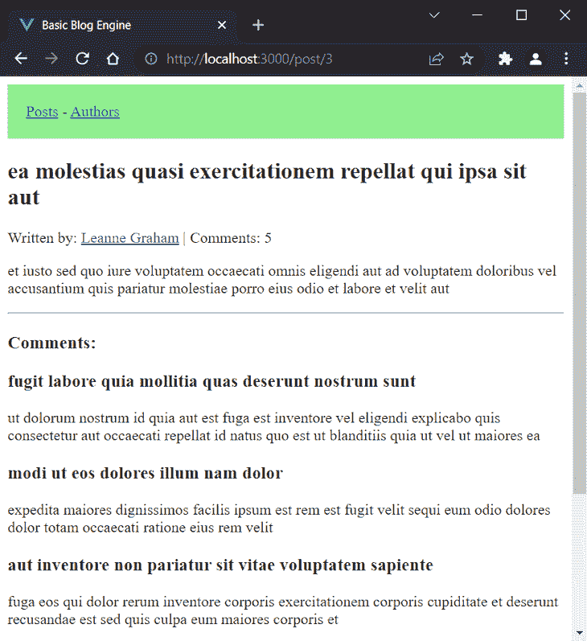](https://blog.logrocket.com/?attachment_id=102965)

现在是展示作者的时候了。再次关闭终端。

### 创建作者视图

在`views`目录中，将`AboutView.vue`文件重命名为`AuthorsView.vue`，并将内容替换为:

```
<script setup>
  import { RouterLink } from 'vue-router'
  import { storeToRefs } from 'pinia'
  import { useAuthorStore } from '../stores/author'

  const { authors } = storeToRefs(useAuthorStore())
  const { fetchAuthors } = useAuthorStore()

  fetchAuthors()
</script>

<template>
  <div>
    <p v-if="authors" v-for="author in authors" :key="author.id">
      <RouterLink :to="`/author/${author.username}`">{{ author.name }}</RouterLink>
    </p>
  </div>
</template>

```

这里，我们使用作者存储来获取作者，并让作者在模板中遍历它们。对于每个作者，我们提供了一个链接到他们的网页。

再次打开`router.js`文件，将**关于**页面的路线修改为:

```
    {
      path: '/authors',
      name: 'authors',
      // route level code-splitting
      // this generates a separate chunk (About.[hash].js) for this route
      // which is lazy-loaded when the route is visited.
      component: () => import('../views/AuthorsView.vue')
    },

```

这里我们把路径和名称分别改成`/authors`和`authors`，用[懒加载](https://blog.logrocket.com/understanding-lazy-loading-in-javascript/)导入`AuthorsView.vue`。

再次运行应用程序。当您访问作者视图时，应该会看到以下内容:

[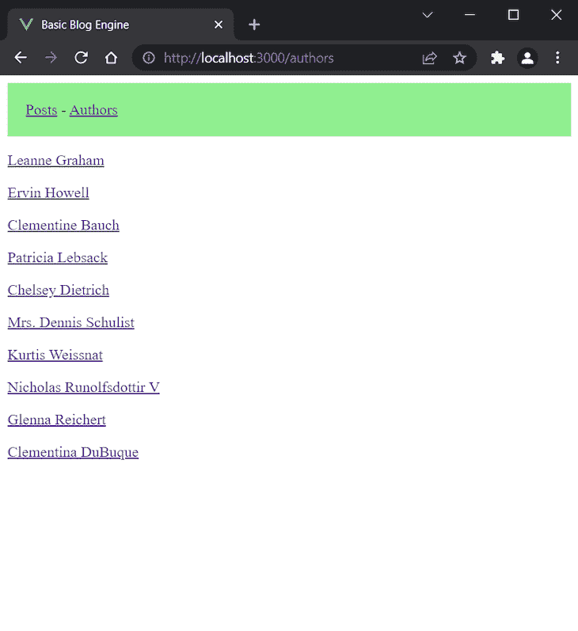](https://blog.logrocket.com/?attachment_id=102967)

现在让我们创建单作者视图。再次关闭终端。

### 创建单个作者视图

在`views`目录下，创建一个包含以下内容的`AuthorView.vue`文件:

```
<script setup>
  import { computed } from 'vue'
  import { useRoute } from 'vue-router'
  import { storeToRefs } from 'pinia'
  import { useAuthorStore } from '../stores/author'
  import { usePostStore } from '../stores/post'
  import Author from '../components/Author.vue'

  const route = useRoute() 
  const { authors } = storeToRefs(useAuthorStore())
  const { getPostsPerAuthor } = storeToRefs(usePostStore())
  const { fetchPosts } = usePostStore()

  const getAuthorByUserName = computed(() => {
    return authors.value.find((author) => author.username === route.params.username)
  })

  fetchPosts()
</script>

<template>
  <div>
    <author 
    :author="getAuthorByUserName" 
    :posts="getPostsPerAuthor(getAuthorByUserName.id)">
    </author>
  </div> 
</template>

```

在这里，为了找到当前作者是谁，我们使用他们的用户名从路由中获取。因此，我们创建一个为此目的计算的`getAuthorByUserName`;我们将`author`和`posts`道具传递给一个`author`组件，我们现在将创建这个组件。

#### 创建`author`组件

在`components`目录下，创建包含以下内容的`Author.vue`文件:

```
<script setup>
  import { RouterLink } from 'vue-router'

  defineProps(['author', 'posts'])
</script>

<template>
  <div>
    <h1>{{author.name}}</h1>
    <p>{{posts.length}} posts written.</p>
    <p v-for="post in posts" :key="post.id">
      <RouterLink :to="`/post/${post.id}`">{{ post.title }}</RouterLink>
    </p>
  </div>
</template>

```

该组件显示作者姓名、作者写了多少文章以及文章本身。

接下来，将以下内容添加到`router.js`文件中:

```
import AuthorView from '../views/AuthorView.vue'
// ...
routes: [
// ... 
{ path: '/author/:username', name: 'author', component: AuthorView }
]

```

再次运行应用程序。当您转到作者视图时，应该会看到以下内容:

[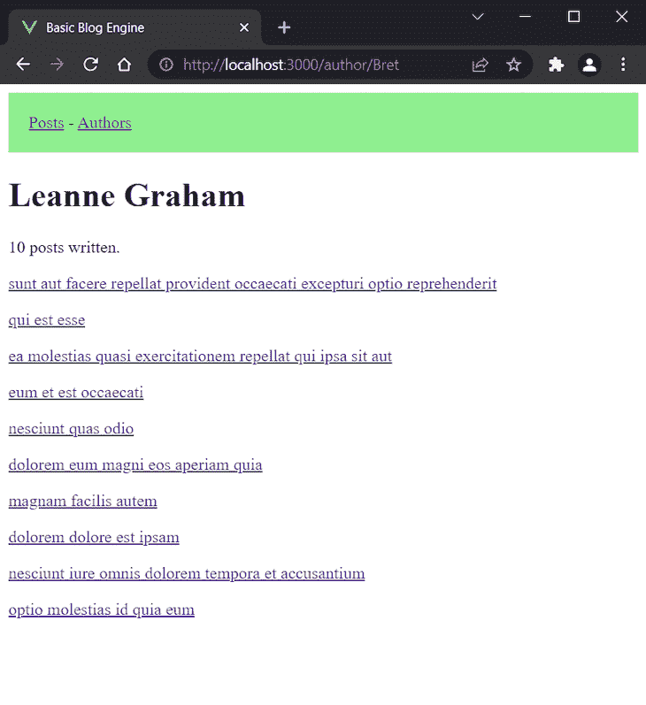](https://blog.logrocket.com/?attachment_id=102969)

## 配置路由器

最终的`router.js`文件应该是这样的:

```
import { createRouter, createWebHistory } from 'vue-router'
import PostsView from '../views/PostsView.vue'
import PostView from '../views/PostView.vue'
import AuthorView from '../views/AuthorView.vue'

const router = createRouter({
  history: createWebHistory(), 
  routes: [
    {
      path: '/',
      name: 'posts',
      component: PostsView
    },
    {
      path: '/authors',
      name: 'authors',
      // route level code-splitting
      // this generates a separate chunk (About.[hash].js) for this route
      // which is lazy-loaded when the route is visited.
      component: () => import('../views/AuthorsView.vue')
    },
    { path: '/post/:id', name: 'post', component: PostView },
    { path: '/author/:username', name: 'author', component: AuthorView },
  ]
})

export default router

```

现在，所有关于缺少资源/组件的 Vue 警告都应该消失了。

仅此而已。我们成功地在一个相当复杂的应用程序中创建和使用了 Pinia 商店。

最后，让我们看看如何在 [Vue devtools](https://blog.logrocket.com/5-vue-devtools-hacks/) 中检查应用程序。

在接下来的截图中，我们打开了一个 ID 为 2 的帖子。以下是该应用程序的路线在**路线**选项卡中的列出方式:

[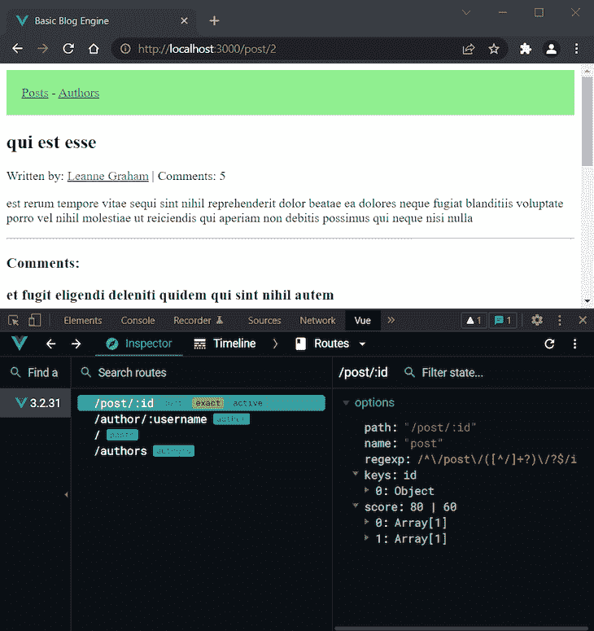](https://blog.logrocket.com/?attachment_id=102971)

我们可以看到，我们创建的所有路线都在这里，单个帖子的路线是活动的，因为它当前正在使用。

现在，让我们切换到**组件**选项卡，这样我们就可以浏览 post 视图的应用组件树:

[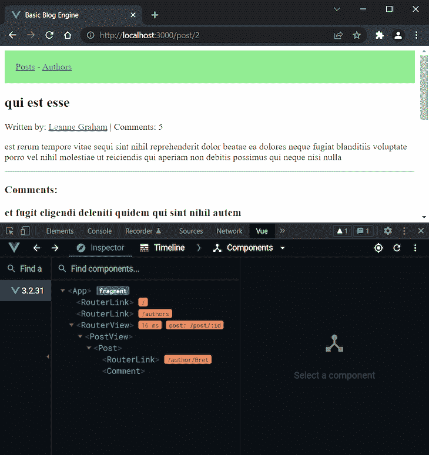](https://blog.logrocket.com/?attachment_id=102973)

正如我们所见，应用程序从两个`RouretLink`组件开始，在`App.vue`中定义了`RouterView`组件。然后，我们有单个 post 视图，后面跟着`post`组件。最后，还有另一个`RouterLink`和评论组件。

现在让我们看看商店，这是有趣的部分。Pinia 显示活动组件中使用的所有商店。在我们的例子中，我们有所有三个，因为当我们打开一个帖子时，我们使用它们。

这里是邮局:

[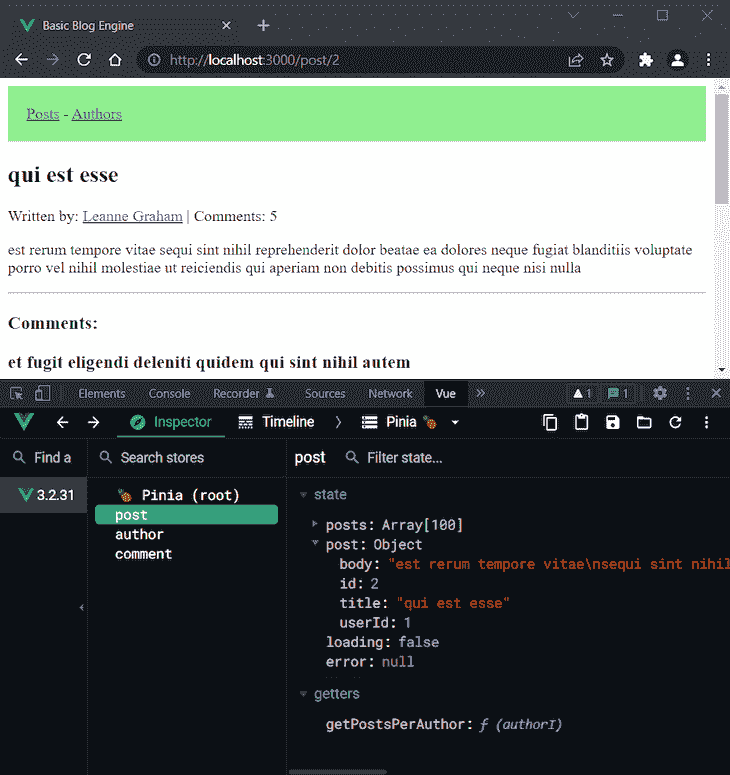](https://blog.logrocket.com/?attachment_id=102976)

我们可以看到，皮尼亚显示正确的开放职位。作者商店也是如此:

[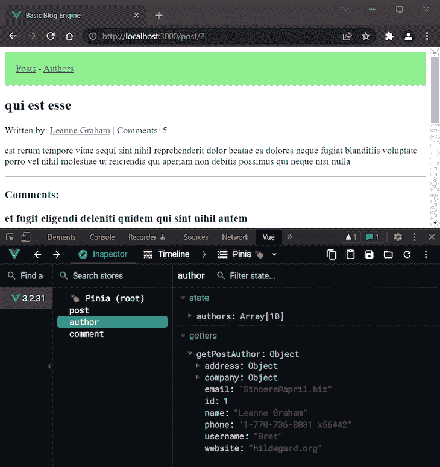](https://blog.logrocket.com/?attachment_id=102978)

最后，评论商店显示评论:

[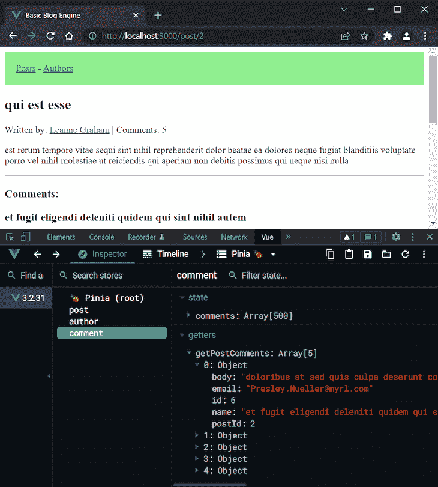](https://blog.logrocket.com/?attachment_id=102980)

同样，我们可以看到第一个评论的名称与浏览器中显示的名称相匹配。所以，一切都如预期的那样。

现在您知道如何创建、使用和检查 Pinia 商店。

## 结论

我对新的官方 Vue 状态管理工具非常满意。正如我们所见，它是模块化设计，易于使用，占地面积小，最后但同样重要的是，它简单、灵活、功能强大。和皮尼亚一起创建商店真的很享受。

在本教程中，我们构建了一个基本的博客引擎，整合了 Pinia 提供的主要特性(状态、getters 和动作)。当然，可以通过为作者、文章和评论添加 CRUD 功能来进一步扩展这个项目，但是这超出了本教程的范围。

如果你愿意，你可以试着自己实现这样一个功能来实践你所学到的东西。JSONPlaceholder 指南可以帮助您完成这项工作。

关于 Pinia 使用的更复杂和真实的例子，您可以探索一下 [Directus 项目的代码](https://github.com/directus/directus)。

最后，请务必查看 [Pinia 文档](https://pinia.vuejs.org/introduction.html)以了解更高级的使用方法。

## 像用户一样体验您的 Vue 应用

调试 Vue.js 应用程序可能会很困难，尤其是当用户会话期间有几十个(如果不是几百个)突变时。如果您对监视和跟踪生产中所有用户的 Vue 突变感兴趣，

[try LogRocket](https://lp.logrocket.com/blg/vue-signup)

.

[](https://lp.logrocket.com/blg/vue-signup)[https://logrocket.com/signup/](https://lp.logrocket.com/blg/vue-signup)

LogRocket 就像是网络和移动应用程序的 DVR，记录你的 Vue 应用程序中发生的一切，包括网络请求、JavaScript 错误、性能问题等等。您可以汇总并报告问题发生时应用程序的状态，而不是猜测问题发生的原因。

LogRocket Vuex 插件将 Vuex 突变记录到 LogRocket 控制台，为您提供导致错误的环境，以及出现问题时应用程序的状态。

现代化您调试 Vue 应用的方式- [开始免费监控](https://lp.logrocket.com/blg/vue-signup)。