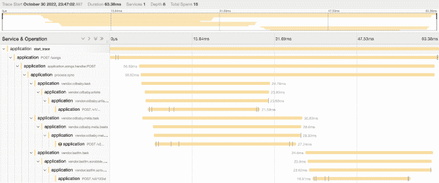

# 编写一个可观察的 Rust 应用程序

> 原文：<https://blog.logrocket.com/composing-underpinnings-observable-rust-application/>

当今复杂的动态系统的可观测性是基于领域知识，或者更确切地说，是基于由不完整的领域知识产生的[未知的“未知数”](https://charity.wtf/2020/03/03/observability-is-a-many-splendored-thing/)。换句话说，正如下面的引用所阐明的那样，处于夹缝之间并让我们感到惊讶的案例:

> 我们花了不到一个小时就想出了恢复网络的方法；需要额外的几个小时，因为我们花了很长时间来控制行为不端的小鬼，让他们恢复正常。一个内置的软件警报系统(当然，假设它不会受到假警报的影响)可能会使我们更快地恢复网络，从而大大减少中断的持续时间。这并不是说一个更好的报警和控制系统可以取代仔细的研究和设计，仔细的研究和设计试图合理地分配重要资源的使用，而只是说它是一个必要的附件，用来处理不可避免地落入即使是最仔细的设计的裂缝之间的情况

本质上，可观察性是我们如何暴露一个系统的行为(希望是以某种规范的方式)并理解这种行为。

在本文中，我们将讨论可观测性的重要性，并研究如何构建可观测 Rust 应用程序的基础。

*向前跳转:*

## 为什么可观察性很重要？

由于微服务部署和编排引擎的激增，我们的系统变得越来越复杂，其中主要公司正在运行数千个微服务，甚至初创公司也在运行数百个。

> 微服务的残酷现实是，它们突然迫使每个开发人员成为云/分布式系统工程师，处理分布式系统固有的复杂性。特别是部分故障，其中一个或多个服务的不可用性会以未知的方式对系统产生负面影响。–(meikle John 等人。艾尔。，[服务级故障注入测试](https://dl.acm.org/doi/abs/10.1145/3472883.3487005)

在这个复杂的时代，要实现可观测性，需要对我们的系统进行长期的架构设计、故障排除和基准测试。交付可观测性始于在正确的抽象层次上从我们运行的系统收集我们的输出数据(遥测和仪器),通常是围绕请求路径组织的，这样我们就可以[探索和剖析数据模式并找到交叉相关性](https://charity.wtf/2020/03/03/observability-is-a-many-splendored-thing/)。

理论上，这听起来有些容易实现。我们收集了我们的三个支柱——日志、指标和跟踪——我们就完成了。然而，这三个支柱本身[只是比特](https://softwareengineeringdaily.com/2021/02/04/debunking-the-three-pillars-of-observability-myth/)，而收集最有用的比特种类并一起分析比特集合是最复杂的。

形成正确的抽象是困难的部分。它可以是非常特定于领域的，依赖于[为我们的系统行为](https://www.akitasoftware.com/blog-posts/observability-isnt-about-logs-metrics-and-traces)建立一个模型，这个模型对变化是开放的，并为惊喜做好准备。它涉及到开发人员必须更多地参与他们的应用程序和系统中的事件是如何生成和诊断的。

到处扔日志语句和收集每一个可能的指标会失去长期价值，并导致其他问题。我们需要公开和增加有意义的输出，这样数据关联甚至是可能的。

这毕竟是一篇 Rust 的文章，虽然 Rust 的设计考虑了安全、速度和效率，但揭露系统行为并不是它的基本原则之一。

## 我们如何让 Rust 应用程序更容易被观察到？

从第一个原则开始，我们如何检测代码，收集有意义的跟踪信息，并导出数据来帮助我们探索未知的“未知”？如果一切都是由事件驱动的，并且我们有捕获一系列事件/操作的跟踪，包括请求/响应、数据库读/写和/或缓存未命中等。对于一个为了实现端到端的可观察性而必须与外界通信的 Rust 应用程序来说，从无到有的诀窍是什么？积木是什么样子的？

可悲的是，这里没有一个窍门或银弹，尤其是在编写 Rust 服务时，这给开发人员留下了很多拼凑的东西。首先，我们唯一可以真正依靠来理解和调试未知的“未知”[的是遥测数据](https://www.lpalmieri.com/posts/2020-09-27-zero-to-production-4-are-we-observable-yet/)，并且我们应该确保我们呈现有意义的、上下文相关的遥测数据(例如，`request_path`、`parent_span`、`trace_id`、`category`和`subject`等相关字段)。第二，我们需要一种方法来探索这种输出，并在系统和服务之间进行关联。

在本文中，我们将主要关注收集有意义的上下文输出数据，但我们也将讨论如何最好地连接到提供进一步处理、分析和可视化的平台。幸运的是,[核心工具已经存在,](https://blog.logrocket.com/comparing-logging-tracing-rust/)用于检测 Rust 程序，以收集结构化事件数据，处理并发出跟踪信息，用于异步和同步通信。

我们将关注最标准和最灵活的框架，[跟踪](https://docs.rs/tracing/latest/tracing/index.html)，它位于[跨度](https://docs.rs/tracing/latest/tracing/struct.Span.html)、[事件](https://docs.rs/tracing/latest/tracing/struct.Event.html)和[订户](https://docs.rs/tracing/latest/tracing/trait.Subscriber.html)周围，以及我们如何利用它的可组合性和可定制性。

然而，即使我们有一个广泛的框架，如 [tracing](https://docs.rs/tracing/latest/tracing/index.html) 来帮助我们编写 Rust 中可观察服务的基础，有意义的遥测技术不会“开箱即用”或“免费提供”

在 Rust 中获得正确的抽象不像在其他语言中那样简单。相反，一个健壮的应用程序必须建立在分层行为的基础上，所有这些行为都为有经验的开发人员提供了示例性的控制，但是对于那些没有经验的开发人员来说可能很麻烦。

我们将把我们的问题空间分解成一系列可组合的层，这些层在四个不同的行为单元上发挥作用:

*   为未来存储上下文信息
*   用上下文信息扩充结构化日志
*   通过工具和跨度持续时间驱动指标
*   分布式跟踪的开放式遥测互操作性

类似于基于属性的测试的最初的 QuickCheck paper 依赖于用户指定属性并为用户定义的类型提供实例，构建端到端可观察的 Rust 服务需要对如何生成跟踪、如何指定和维护数据以及随着应用程序的增长什么样的遥测有意义有所了解。当需要调试和/或探索不一致、部分失败和可疑的性能特征时，尤其如此。

痕迹收集将驱动本文示例中的一切，其中[跨越](https://docs.newrelic.com/docs/new-relic-solutions/get-started/glossary/#span)，事件将是我们将已知数量的完整图像联系在一起的镜头。我们会有日志，但我们会将它们视为结构化事件。我们将收集指标，但通过仪器和跨度使它们自动化，我们将导出 [OpenTelemetry 兼容的跟踪数据](https://github.com/open-telemetry/opentelemetry-specification/blob/main/specification/overview.md)以发送到像 [Jaeger](https://www.jaegertracing.io/) 这样的分布式跟踪平台。

## 跨度、事件和轨迹

在我们进入实现细节之前，让我们从一些我们需要熟悉的术语和概念开始，比如跨度、跟踪和事件。

### 跨度

范围表示作为跟踪一部分的操作或段，并充当分布式跟踪的主要构造块。对于任何给定的请求，初始范围(没有父范围)称为根范围。它通常表示为给定分布式跟踪的整个用户请求的端到端延迟。

还可以有后续的子跨度，这些子跨度可以嵌套在其他各种父跨度之下。一个 span 的总执行时间包括在该 span 中花费的时间以及其子节点所代表的整个子树。

下面是一个针对新请求的有意压缩的父跨度日志的示例:

```
level=INFO span name="HTTP request" span=9008298766368774 parent_span=9008298766368773 span_event=new_span timestamp=2022-10-30T22:30:28.798564Z http.client_ip=127.0.0.1:61033 http.host=127.0.0.1:3030 http.method=POST http.route=/songs trace_id=b2b32ad7414392aedde4177572b3fea3

```

这个 span 日志包含重要的信息和元数据，如请求路径(`http.route`)、时间戳(`2022-10-30T22:30:28.798564Z`)、请求方法(`http.method`)和跟踪标识符(分别为`span`、`parent_span`和`trace_id`)。我们将使用这些信息来演示一个跟踪从开始到完成是如何联系在一起的。

为什么叫跨度？本·西格曼(Ben Sigelman)是[谷歌整洁的追踪基础设施论文的作者，](https://research.google/pubs/pub36356/)在 [*《跨度简史》中考虑了这些因素:难以爱，难以杀*](https://lightstep.com/blog/a-brief-history-of-the-span-hard-to-love-hard-to-kill) :

> *   在代码本身中，API 感觉就像一个计时器
> *   当一个人把轨迹看作一个有向图时，数据结构就像一个节点或顶点
> *   在结构化、多进程日志记录的上下文中(附注:归根结底，这就是分布式跟踪)，人们可能会认为一个跨度是两个事件
> *   给定一个简单的时序图，很容易将这个概念称为持续时间或窗口

### 事件

事件表示时间上的单个操作，其中在某个任意程序的执行期间发生了一些事情。与带外的非结构化日志记录相比，我们将事件视为在给定范围的上下文中发生的核心摄取单元，并使用键值字段进行结构化(类似于上面的范围日志)。更准确地说，这些事件被称为跨度事件:

```
level=INFO msg="finished processing vendor request" subject=vendor.response category=http.response vendor.status=200 vendor.response_headers="{\"content-type\": \"application/json\", \"vary\": \"Accept-Encoding, User-Agent\", \"transfer-encoding\": \"chunked\"}" vendor.url=http://localhost:8080/.well-known/jwks.json vendor.request_path=/.well-known/jwks.json target="application::middleware::logging" location="src/middleware/logging.rs:354" timestamp=2022-10-31T02:45:30.683888Z

```

我们的应用程序还可以拥有发生在 span 上下文之外的任意结构化日志事件。例如，在启动时显示配置设置或在缓存刷新时进行监控。

### 跟踪

跟踪是表示某些工作流的范围的集合，比如服务器请求或某个项目的队列/流处理步骤。本质上，轨迹是跨度的[有向无环图](https://en.wikipedia.org/wiki/Directed_acyclic_graph)，其中连接跨度的边指示跨度和它们的父跨度之间的因果关系。

下面是一个在 Jaeger UI 中可视化的轨迹示例:



如果这个应用程序是一个更大的分布式跟踪的一部分，我们会看到它嵌套在一个更大的父跨度中。

现在，没有术语了，我们如何开始实现一个可观察性就绪的 Rust 应用程序的框架呢？

## 组合多个跟踪层以构建订阅服务器

[跟踪](https://docs.rs/tracing/latest/tracing/index.html)框架被分割成不同的组件(如板条箱)。出于我们的目的，我们将关注这组`.toml`依赖关系:

```
opentelemetry = { version = "0.17", features = ["rt-tokio", "trace"] }
opentelemetry-otlp = { version = "0.10", features = ["metrics", "tokio", "tonic", "tonic-build", "prost", "tls", "tls-roots"], default-features = false}
opentelemetry-semantic-conventions = "0.9"
tracing = "0.1"
tracing-appender = "0.2"
tracing-opentelemetry = "0.17"
tracing-subscriber = {version = "0.3", features = ["env-filter", "json", "registry"]}

```

通过`tracing_subscriber` crate，我们能够从更小的行为单元(称为[层](https://docs.rs/tracing-subscriber/latest/tracing_subscriber/layer/index.html))组成跟踪订阅者，用于收集和增加跟踪数据。

`Subscriber`本身负责在创建时注册新的跨度(用一个跨度`id`)，记录并附加字段值和后续注释到跨度，并过滤掉跨度和事件。

当与订阅者组合时，层进入在整个 [span 的生命周期](https://docs.rs/tracing/latest/tracing/span/index.html#the-span-lifecycle)中触发的钩子:

```
fn on_new_span(&self, _attrs: &Attributes<'_>, _id: &span::Id, _ctx: Context<'_, C>) {...} 
fn on_record(&self, _span: &Id, _values: &Record<'_>, _ctx: Context<'_, S>) { ... }
fn on_follows_from(&self, _span: &Id, _follows: &Id, _ctx: Context<'_, S>) { ... }
fn event_enabled(&self, _event: &Event<'_>, _ctx: Context<'_, S>) -> bool { ... }
fn on_event(&self, _event: &Event<'_>, _ctx: Context<'_, S>) { ... }
fn on_enter(&self, _id: &Id, _ctx: Context<'_, S>) { ... }
fn on_exit(&self, _id: &Id, _ctx: Context<'_, S>) { ... }
fn on_close(&self, _id: Id, _ctx: Context<'_, S>) { ... }

```

代码中的层是如何组成的？让我们从一个设置方法开始，产生一个用四个`with`组合子或层定义的[注册表](https://docs.rs/tracing-subscriber/latest/tracing_subscriber/registry/struct.Registry.html):

```
fn setup_tracing(
    writer: tracing_appender::non_blocking::NonBlocking,
    settings_otel: &Otel,
) -> Result<()> {
    let tracer = init_tracer(settings_otel)?;
    let registry = tracing_subscriber::Registry::default()
        .with(StorageLayer.with_filter(LevelFilter::TRACE))
        .with(tracing_opentelemetry::layer()...                
        .with(LogFmtLayer::new(writer).with_target(true)...
        .with(MetricsLayer)...
        ); 
     ...

```

在`main.rs`中初始化服务器的`main()`方法时，通常会调用`setup_tracing`函数。存储层本身不提供任何输出，而是充当一个信息库，用于收集上下文跟踪信息，以增加和扩展管道中其他层的下游输出。

`with_filter`方法控制该层启用哪些范围和事件，我们想要捕获基本上所有的内容，因为`LevelFilter::TRACE`是最冗长的选项。

让我们检查每一层，看看每一层是如何操作收集到的跟踪数据并与 span 生命周期挂钩的。定制每一层的行为包括实现与`Layer`特征相关的生命周期挂钩，就像下面的`on_new_span`。

在这一过程中，我们将展示这些行为单元如何扩大范围和事件日志格式，自动导出一些指标，并将我们收集的信息发送到下游的分布式跟踪平台，如 Jaeger、Honeycomb 或 Datadog。我们将从我们的`StorageLayer`开始，它提供了其他层可以从中受益的上下文信息。

## 为未来存储上下文信息

### 在新跨度上

```
impl<S> Layer<S> for StorageLayer
where
    S: Subscriber + for<'span> LookupSpan<'span>,
{
    fn on_new_span(&self, attrs: &Attributes<'_>, id: &Id, ctx: Context<'_, S>) {
        let span = ctx.span(id).expect("Span not found");
        // We want to inherit the fields from the parent span, if there is one.
        let mut visitor = if let Some(parent_span) = span.parent() {
            let mut extensions = parent_span.extensions_mut();
            let mut inner = extensions
                .get_mut::<Storage>()
                .map(|v| v.to_owned())
                .unwrap_or_default();

            inner.values.insert(
                PARENT_SPAN, // "parent_span"
                Cow::from(parent_span.id().into_u64().to_string()),
            );
            inner
        } else {
            Storage::default()
        };

        let mut extensions = span.extensions_mut();
        attrs.record(&mut visitor);
        extensions.insert(visitor);
    }
...

```

当一个新的 span(通过`on_new_span`)被启动时，例如，一个`POST`请求进入我们的应用程序到一个像`/songs`这样的端点，我们的代码检查我们是否已经在一个父 span 中。否则，它将默认为一个新创建的空的`Hashmap`，这就是`Storage::default()`所包装的。

为简单起见，我们默认映射到字符串引用的键和字符串引用周围的写时复制( [Cow](https://doc.rust-lang.org/std/borrow/enum.Cow.html) )智能指针的值:

```
#[derive(Clone, Debug, Default)]
pub(crate) struct Storage<'a> {
    values: HashMap<&'a str, Cow<'a, str>>,
}

```

由于 span 的`extensions`,存储在 span 的生命周期内在注册表中跨层持久化字段，这使我们能够可变地将任意数据关联到一个 span，或者从持久化数据中不变地读取数据，包括我们自己的数据结构。

* * *

### 更多来自 LogRocket 的精彩文章:

* * *

这些生命周期钩子中的许多都涉及到与`extensions`的搏斗，这可能有点冗长。注册中心实际上收集和存储 span 数据，这些数据可以通过`LookupSpan`的实现到达其他层。

另一个需要强调的代码是`attrs.record(&mut visitor)`，它将通过访问每种类型的值来记录各种类型的字段值，这是一个必须实现的特性:

```
// Just a sample of the implemented methods
impl Visit for Storage<'_> {
    /// Visit a signed 64-bit integer value.
    fn record_i64(&mut self, field: &Field, value: i64) {
        self.values
            .insert(field.name(), Cow::from(value.to_string()));
    }
    ... // elided for brevity
    fn record_debug(&mut self, field: &Field, value: &dyn fmt::Debug) {
        // Note: this is invoked via `debug!` and `info! macros
​​        let debug_formatted = format!("{:?}", value);
        self.values.insert(field.name(), Cow::from(debug_formatted));    
    }
...

```

一旦我们记录了每种类型的所有值，所有这些都由访问者存储在存储器`Hashmap`中，这将可供下游层在将来用于生命周期触发器。

### 公开发表的

```
impl<S> Layer<S> for StorageLayer
where
    S: Subscriber + for<'span> LookupSpan<'span>,
{
... // elided for brevity
    fn on_record(&self, span: &Id, values: &Record<'_>, ctx: Context<'_, S>) {
        let span = ctx.span(span).expect("Span not found");
        let mut extensions = span.extensions_mut();
        let visitor = extensions
            .get_mut::<Storage>()
            .expect("Visitor not found on 'record'!");
        values.record(visitor);
    }
... // elided for brevity

```

当我们继续每个生命周期触发器时，我们会注意到模式是相似的。我们在 span 的存储扩展中获得一个可变的、有作用域的句柄，并在它们到达时记录值。

这个钩子通过像`debug_span!`或`info_span!`这样的调用通知一个层，具有给定标识符的 span 已经记录了给定值:

```
let span = info_span!(
    "vendor.cdbaby.task",
    subject = "vendor.cdbaby",
    category = "vendor"
);

```

### 事件发生时

```
impl<S> Layer<S> for StorageLayer
where
    S: Subscriber + for<'span> LookupSpan<'span>,
{
... // elided for brevity
    fn on_event(&self, event: &Event<'_>, ctx: Context<'_, S>) {
        ctx.lookup_current().map(|current_span| {
            let mut extensions = current_span.extensions_mut();
            extensions.get_mut::<Storage>().map(|visitor| {
                if event
                    .fields()
                    .any(|f| ON_EVENT_KEEP_FIELDS.contains(&f.name()))
                {
                    event.record(visitor);
                }
            })
        });
    }
... // elided for brevity

```

对于我们的上下文存储层，挂钩到事件，如`[tracing::error!](https://docs.rs/tracing/latest/tracing/macro.error.html)`消息，通常是不必要的。但是，这对于存储我们希望保留的事件字段的信息来说是很有价值的，这些信息可能会在管道中的另一个层中有用。

一个例子是存储一个归因于错误的事件，以便我们可以在度量层跟踪错误(例如，`ON_EVENT_KEEP_FIELDS`是一个与错误关键字相关的字段数组)。

### 进入和关闭时

```
impl<S> Layer<S> for StorageLayer
where
    S: Subscriber + for<'span> LookupSpan<'span>,
{
... // elided for brevity
    fn on_enter(&self, span: &Id, ctx: Context<'_, S>) {
        let span = ctx.span(span).expect("Span not found");
        let mut extensions = span.extensions_mut();
        if extensions.get_mut::<Instant>().is_none() {
            extensions.insert(Instant::now);
        }
    }

    fn on_close(&self, id: Id, ctx: Context<'_, S>) {
        let span = ctx.span(&id).expect("Span not found");
        let mut extensions = span.extensions_mut();
        let elapsed_milliseconds = extensions
            .get_mut::<Instant>()
            .map(|i| i.elapsed().as_millis())
            .unwrap_or(0);

        let visitor = extensions
            .get_mut::<Storage>()
            .expect("Visitor not found on 'record'");

        visitor.values.insert(
            LATENCY_FIELD, // "latency_ms"
            Cow::from(format!("{}", elapsed_milliseconds)),
        );
    }
... // elided for brevity

```

跨度是内在标记的时间间隔，有明确的开始和结束。对于一个 span 的范围，我们希望捕获从进入具有给定`id`的 span(`Instant::now`)到它对于给定的操作关闭之间所经过的时间。

在我们的扩展中存储每个跨度的延迟使其他层能够自动获得指标，并有利于在调试给定跨度的事件日志时进行探索。下面，我们可以看到`id=452612587184455697`的供应商任务/流程跨度的开始和结束，从开始到结束用了 18ms:

```
level=INFO span_name=vendor.lastfm.task span=452612587184455697 parent_span=span=452612587184455696 span_event=new_span timestamp=2022-10-31T12:35:36.913335Z trace_id=c53cb20e4ab4fa42aa5836d26e974de2 http.client_ip=127.0.0.1:51029 subject=vendor.lastfm application.request_path=/songs http.method=POST category=vendor http.host=127.0.0.1:3030 http.route=/songs request_id=01GGQ0MJ94E24YYZ6FEXFPKVFP
```

```
level=INFO span_name=vendor.lastfm.task span=452612587184455697 parent_span=span=452612587184455696 span_event=close_span timestamp=2022-10-31T12:35:36.931975Z trace_id=c53cb20e4ab4fa42aa5836d26e974de2 latency_ms=18 http.client_ip=127.0.0.1:51029 subject=vendor.lastfm application.request_path=/songs http.method=POST category=vendor http.host=127.0.0.1:3030 http.route=/songs request_id=01GGQ0MJ94E24YYZ6FEXFPKVFP

```

## 用上下文信息扩充结构化日志

现在，我们将通过查看事件日志格式化层来了解如何将存储数据用于实际遥测输出:

```
.with(LogFmtLayer::new(writer).with_target(true)...

```

当涉及到编写自定义层和订户实现时，许多示例都倾向于自定义格式化程序:

***注意，**上面的日志示例使用了[这种相同的格式](https://brandur.org/logfmt)，灵感来自 [InfluxDB](https://github.com/influxdata/influxdb_iox/blob/main/logfmt/src/lib.rs) )* 的一个实现

我们建议使用已发布的图层或库，或者按照上面列出的教程深入了解以首选格式生成数据的细节。

本文构建了我们自己的自定义格式化程序层，对于这篇文章，我们将重新熟悉 span 生命周期，特别是 span 和事件日志，它们现在将利用我们的存储图。

### 在新跨度上

```
impl<S, Wr, W> Layer<S> for LogFmtLayer<Wr, W>
where
    Wr: Write + 'static,
    W: for<'writer> MakeWriter<'writer> + 'static,
    S: Subscriber + for<'span> LookupSpan<'span>,
{
    fn on_new_span(&self, _attrs: &Attributes<'_>, id: &Id, ctx: Context<'_, S>) {
        let mut p = self.printer.write();
        let metadata = ctx.metadata(id).expect("Span missing metadata");
        p.write_level(metadata.level());
        p.write_span_name(metadata.name());
        p.write_span_id(id);
        p.write_span_event("new_span");
        p.write_timestamp();

        let span = ctx.span(id).expect("Span not found");
        let extensions = span.extensions();
        if let Some(visitor) = extensions.get::<Storage>() {
            for (key, value) in visitor.values() {               
                ​​p.write_kv(
                    decorate_field_name(translate_field_name(key)),
                    value.to_string(),
                )
            }
        }
        p.write_newline();
    }
... // elided for brevity

```

上面的代码使用了`[MakeWriter](https://docs.rs/tracing-subscriber/latest/tracing_subscriber/fmt/trait.MakeWriter.html)`特征来打印 span 事件的格式化文本表示。对`decorate_field_name`和所有打印机`write`方法的调用在幕后执行特定的格式化属性(同样，在本例中是`[logfmt](https://brandur.org/logfmt)`)。

回到我们之前的 span log 示例，现在可以更清楚地看到像`level`、`span`和`span_name`这样的键是在哪里设置的。这里要调用的一段代码是我们如何对从我们的存储图中读取的值进行循环，`for (key, value)`，提升我们在前一层中观察和收集的信息。

我们使用它来提供上下文，以在另一层中增加我们的结构化日志事件。换句话说，我们通过层在跟踪数据上组合特定的子行为，以便为整个跟踪构建一个单一的订户。例如，像`http.route`和`http.host`这样的字段键就是从这个存储层中提取的。

### 事件发生时

```
impl<S, Wr, W> Layer<S> for LogFmtLayer<Wr, W>
where
    Wr: Write + 'static,
    W: for<'writer> MakeWriter<'writer> + 'static,
    S: Subscriber + for<'span> LookupSpan<'span>,
{
... // elided for brevity
    fn on_event(&self, event: &Event<'_>, ctx: Context<'_, S>) {
        let mut p = self.printer.write();
        p.write_level(event.metadata().level());
        event.record(&mut *p);
        //record source information
        p.write_source_info(event);
        p.write_timestamp();

        ctx.lookup_current().map(|current_span| {
            p.write_span_id(&current_span.id());
            let extensions = current_span.extensions();
            extensions.get::<Storage>().map(|visitor| {
                for (key, value) in visitor.values() {
                    if !ON_EVENT_SKIP_FIELDS.contains(key) {
                        p.write_kv(
                            decorate_field_name(translate_field_name(key)),
                            value.to_string(),
                        )
                    }
                }
            })
        });
        p.write_newline();
    }
... // elided for brevity

```

虽然有些乏味，但是实现这些跨度生命周期方法的模式变得越来越容易理解。像 target 和 location 这样的字段键值对是从源信息格式化而来的，给我们之前看到的`target="application::middleware::logging"`和`location="src/middleware/logging.rs:354"`。像`vendor.request_path`和`vendor.url`这样的键也是从上下文存储中提取的。

虽然正确实现任何格式规范可能需要更多的工作，但我们现在可以看到跟踪框架提供的粒度控制和定制。这些上下文信息是我们最终能够在请求生命周期中形成关联的方式。

## 通过工具和跨度持续时间驱动指标

度量，特别是[本身实际上对可观察性](https://charity.wtf/2020/03/03/observability-is-a-many-splendored-thing/)非常不利，度量的基数，度量名称和维度值的唯一组合的数量，很容易被滥用。

> 事件是度量、日志和跟踪的结缔组织，因为您可以从事件中获得前两个，并且可以从事件中可视化第三个。但是它不会反向进行:您永远无法从度量、日志和/或跟踪中反向工作来取回您的事件。

我们已经展示了如何从事件中导出结构化日志。指标本身应该由包含它们的事件或跨度形成。

我们仍然需要带外指标，比如那些与进程收集相关的指标(例如，CPU 使用率、写入/读取的磁盘字节)。然而，如果我们已经能够在函数级检测我们的代码来确定什么时候发生了什么，那么一些度量标准难道不能“免费掉出来”吗如前所述，我们有工具，但我们只需要穿过它。

跟踪提供了可访问的方法来注释用户想要[装备](https://docs.rs/tracing/latest/tracing/attr.instrument.html)的函数，这意味着每次注释函数执行时创建、输入和关闭一个跨度。 [rust 编译器本身](https://rustc-dev-guide.rust-lang.org/tracing.html)在整个代码库中大量使用了这些带注释的工具:

```
#[instrument(skip(self, op), level = "trace")]
pub(super) fn fully_perform_op<R: fmt::Debug, Op>(
    &mut self,
    locations: Locations,
    category: ConstraintCategory<'tcx>,
    op: Op) -> Fallible<R>

```

出于我们的目的，让我们来看一个简单的异步数据库`save_event`函数，它使用了一些非常具体的字段定义:

```
#[instrument(
    level = "info",
    name = "record.save_event",
    skip_all,
    fields(category="db", subject="aws_db", event_id = %event.event_id,
           event_type=%event.event_type, otel.kind="client", db.system="aws_db",
           metric_name="db_event", metric_label_event_table=%self.event_table_name,
           metric_label_event_type=%event.event_type)
​​        err(Display)
)]
pub async fn save_event(&self, event: &Event) -> anyhow::Result<()> {
    self.db_client
        .put_item()
        .table_name(&self.event_table_name)
        .set(Some(event))
        .send()
        .await...
}

```

我们的插装函数有像`name`、`event_type`和`event_table`这样的`metric`前缀字段。这些键对应于 [Prometheus 监控设置](https://prometheus.io/docs/practices/naming/#metric-and-label-naming)中常见的指标名称和标签。我们稍后将回到这些前缀字段。首先，让我们用一些额外的过滤器扩展我们最初设置的`MetricsLayer`。

本质上，这些过滤器做两件事:1)为所有跟踪日志级别或更高级别的事件产生度量(即使基于配置的日志级别它们可能没有被记录到 stdout 以及 2)传递带有前缀`record`的被检测函数的事件，如上面的`name = "record.save_event"`所示。

在此之后，为了自动化指标推导，剩下的工作就是返回到我们的指标层实现。

### 关闭时

```
const PREFIX_LABEL: &str = "metric_label_";
const METRIC_NAME: &str = "metric_name";
const OK: &str = "ok";
const ERROR: &str = "error";
const LABEL: &str = "label";
const RESULT_LABEL: &str = "result";

impl<S> Layer<S> for MetricsLayer
where
    S: Subscriber + for<'span> LookupSpan<'span>,
{
    fn on_close(&self, id: Id, ctx: Context<'_, S>) {
        let span = ctx.span(&id).expect("Span not found");
        let mut extensions = span.extensions_mut();
        let elapsed_secs_f64 = extensions
            .get_mut::<Instant>()
            .map(|i| i.elapsed().as_secs_f64())
            .unwrap_or(0.0);
        if let Some(visitor) = extensions.get_mut::<Storage>() {
            let mut labels = vec![];
            for (key, value) in visitor.values() {
                if key.starts_with(PREFIX_LABEL) {
                    labels.push((
                        key.strip_prefix(PREFIX_LABEL).unwrap_or(LABEL),
                        value.to_string(),
                    ))
                }
            }
            ... // elided for brevity
            let name = visitor
                .values()
                .get(METRIC_NAME)
                .unwrap_or(&Cow::from(span_name))
                .to_string();
            if visitor.values().contains_key(ERROR)
                labels.push((RESULT_LABEL, String::from(ERROR)))
            } else {
                labels.push((RESULT_LABEL, String::from(OK)))
            }
            ... // elided for brevity
            metrics::increment_counter!(format!("{}_total", name), &labels);
            metrics::histogram!(
                format!("{}_duration_seconds", name),
                elapsed_secs_f64,
                &labels
            );
            ... // elided for brevity

```

在这个例子中有很多位被推来推去，其中一些被省略了。尽管如此，`on_close`，我们总是可以通过`elapsed_secs_f64`访问跨度间隔的末端，这可以通过`metrics::histogram!`宏驱动我们的直方图计算。

注意，我们在这里利用了 [metrics-rs](https://github.com/metrics-rs/metrics) 项目。任何人都可以用另一个提供计数器和[直方图](https://en.wikipedia.org/wiki/Histogram)支持的度量库以同样的方式对这个函数建模。从我们的存储映射中，我们取出所有标有`metric_*`的键，并使用它们为自动派生的递增计数器和直方图生成标签。

同样，如果我们已经存储了一个出错的事件，我们可以将它作为标签的一部分，根据`ok` / `error`来区分我们的结果函数。给定任何插装的函数，我们将从它那里用同样的代码行为得到度量。

我们将从 Prometheus 端点看到的输出将显示一个类似如下的计数器:

```
db_event_total{event_table="events",event_type="Song",result="ok",span_name="save_event\"} 8

```

## 检测异步闭包和间接跨度关系

不时会出现的一个问题是，如何使用引用间接的、非父子关系的范围来检测代码，或者引用之后的[。](https://opentelemetry.io/docs/reference/specification/compatibility/opentracing/#span-references)

这将在异步操作中发挥作用，异步操作产生的请求会对向服务总线发送数据的下游服务或流程产生副作用，而直接响应或返回的输出对产生它的操作本身没有影响。

对于这些情况，我们可以通过在每次轮询时进入与我们的异步期货相关联的给定跨度(捕获为下面的`follows_from`引用)来[检测异步闭包(或期货)](https://www.lpalmieri.com/posts/2020-09-27-zero-to-production-4-are-we-observable-yet/#5-4-instrumenting-futures)，并在每次[期货停止](https://fasterthanli.me/articles/understanding-rust-futures-by-going-way-too-deep)时退出，如下面的`.[instrument](https://docs.rs/tracing/latest/tracing/trait.Instrument.html#method.instrument)(process_span)`所示:

```
// Start a span around the context process spawn
let process_span = debug_span!(
    parent: None,
    "process.async",
    subject = "songs.async",
    category = "songs"
);
process_span.follows_from(Span::current());

tokio::spawn(
    async move {
        match context.process().await {
            Ok(r) => debug!(song=?r, "successfully processed"),
            Err(e) => warn!(error=?e, "failed processing"),
        }
    }
    .instrument(process_span),
);

```

## 分布式跟踪的开放式遥测互操作性

可观察性的大部分用处来自于这样一个事实，即今天的大多数服务实际上是由许多微服务组成的。我们都应该考虑分布式。

如果所有类型的服务都必须跨网络、供应商、云，甚至是面向边缘或本地优先的对等体相互连接，那么就应该实施一些标准和与供应商无关的工具。这就是 [OpenTelemetry](https://opentelemetry.io/docs/concepts/what-is-opentelemetry/) (OTel)发挥作用的地方，许多已知的可观测性平台非常乐意接收符合 OTel 的遥测数据。

虽然有一整套开源 Rust 工具可以在 OTel 生态系统中工作，但许多著名的 Rust web 框架并没有以一种固定的方式采纳 OTel 标准。

像 [Actix](https://actix.rs/) 和 Tokio 的 [axum](https://github.com/tokio-rs/axum) 这样受欢迎的包含 web 框架依赖于定制实现和外部库来提供集成(分别是 [actix-web-opentelemetry](https://github.com/OutThereLabs/actix-web-opentelemetry) 和[axum-tracing-open telemetry](https://github.com/davidB/axum-tracing-opentelemetry))。到目前为止，第三方集成[一直是最受青睐的选择](https://github.com/tokio-rs/axum/pull/769#issuecomment-1147360090)，虽然这促进了灵活性和用户控制，但对于那些期望几乎无缝地添加[集成的人来说，这可能会更加困难。](https://github.com/open-telemetry/opentelemetry-erlang-contrib/tree/main/instrumentation/opentelemetry_phoenix)

我们不会在这里详细介绍如何编写自定义实现，但是规范的 HTTP 中间件，如 [Tower](https://github.com/tower-rs/tower-http) 允许在请求时覆盖默认的 span creation 的[实现。如果按照规范实施，这些字段应该在 span 的元数据上设置:](https://docs.rs/tower-http/latest/tower_http/trace/trait.MakeSpan.html)

*   `http.client_ip`:客户端的 IP 地址
*   `http.flavor`:使用的协议版本(HTTP/1.1，HTTP/2.0 等。)
*   `http.host`:表头`Host`的值
*   `http.method`:请求方式
*   `http.route`:匹配的路线
*   `http.request_content_length`:请求内容长度
*   `http.response_content_length`:响应内容长度
*   `http.scheme`:使用的 URI 方案(`HTTP`或`HTTPS`)
*   `http.status_code`:响应状态码
*   `http.target`:完整的请求目标，包括路径和查询参数
*   `http.user_agent`:表头`User-Agent`的值
*   `otel.kind`:典型的`server`，在这里找到更多的
*   `otel.name`:由`http.method`和`http.route`组成的名称
*   `otel.status_code` : `OK`如果响应成功；`ERROR`如果是 5xx
*   `trace_id`:跟踪的标识符，用于跨进程将特定跟踪的所有跨度分组在一起

### 初始化跟踪器

通过`[tracing-opentelemetry](https://docs.rs/tracing-opentelemetry/latest/tracing_opentelemetry/)`和`[rust-opentelemetry](https://docs.rs/opentelemetry/latest/opentelemetry/index.html)`的跟踪暴露了另一层，我们可以用它来组成我们的订户，以便将 OTel 上下文信息添加到所有跨度，并将这些跨度连接和发送到可观察性平台，如 Datadog 或 Honeycomb，或者直接发送到 Jaeger 或 [Tempo](https://grafana.com/oss/tempo/) 的运行实例，[可以对跟踪数据](https://docs.honeycomb.io/getting-data-in/tracing/sampling/)进行采样，以便进行可管理的消费。

初始化一个`[Tracer]()`来产生和管理跨度非常简单:

```
pub fn init_tracer(settings: &Otel) -> Result<Tracer> {
    global::set_text_map_propagator(TraceContextPropagator::new());

    let resource = Resource::new(vec![
        otel_semcov::resource::SERVICE_NAME.string(PKG_NAME),
        otel_semcov::resource::SERVICE_VERSION.string(VERSION),
        otel_semcov::resource::TELEMETRY_SDK_LANGUAGE.string(LANG),
    ]);

    let api_token = MetadataValue::from_str(&settings.api_token)?;
    let endpoint = &settings.exporter_otlp_endpoint;

    let mut map = MetadataMap::with_capacity(1);
    map.insert("x-tracing-service-header", api_token);

    let trace = opentelemetry_otlp::new_pipeline()
        .tracing()
        .with_exporter(exporter(map, endpoint)?)
        .with_trace_config(sdk::trace::config().with_resource(resource))
        .install_batch(runtime::Tokio)
        .map_err(|e| anyhow!("failed to intialize tracer: {:#?}", e))?;

    Ok(trace)
}

```

将它包含在我们的层管道中也很简单。我们还可以基于级别进行过滤，并使用动态过滤器来跳过我们希望在跟踪中避免的事件:

```
.with(
    tracing_opentelemetry::layer()
        .with_tracer(tracer)
        .with_filter(LevelFilter::DEBUG)​​
        .with_filter(dynamic_filter_fn(|_metadata, ctx| {
            !ctx.lookup_current()
                // Exclude the rustls session "Connection" events
                // which don't have a parent span
                .map(|s| s.parent().is_none() && s.name() == "Connection")
                .unwrap_or_default()
        })),
)

```

通过这种管道初始化，我们所有的应用程序跟踪都可以被 Jaeger 这样的工具获取，正如我们在本文前面所演示的。然后，剩下的就是数据关联、切片和切割。

## 结论

通过将这些跟踪层组合在一起，我们可以以一种精细的方式公开系统行为信息，同时获得足够的输出和足够的上下文来开始理解这种行为。所有这些定制仍然是有代价的:它并不是完全自动的，但模式是惯用的，并且有许多正常用例可以使用的开源层。

最重要的是，这篇文章将有助于让用户更容易地尝试定制应用程序与跟踪收集的交互，并展示它在让我们的应用程序准备好处理不可避免的情况方面可以走多远。这仅仅是我们美好友谊的开始，伴随着我们的事件和事件发生的时间，以及由此而来的可观察性。从长远来看，我们如何去调试和解决它的问题，将永远是正在进行的工作。

## 特别感谢

我想对 [Paul Cleary](https://github.com/pauljamescleary) 、 [Daniel Jin](https://github.com/drunkirishcoder) 、 [Lukas Jorgensen](https://github.com/glitchy) 、 [Jonathan Whittle](https://github.com/jwhittle933) 、 [Jared Morrow](https://github.com/jaredmorrow) 、 [John Mumm](http://jtfmumm.com/) 、 [Sean Cribbs](https://seancribbs.com/) 、 [Scott Fritchie](http://www.snookles.com/slf-blog/) 和 [Cuyler Jones](https://github.com/cuyler) 对本文的所有帮助、编辑和合作表示诚挚的感谢。

再次感谢我在[裂变代码](https://fission.codes/)的团队，特别是[布莱恩·金斯伯格](https://brianginsburg.com/)和[奎因·威尔顿](https://quinnwilton.com/)，感谢他们对此的支持，也感谢我的顾问[弗兰克·芬宁](http://www.cs.cmu.edu/~fp/)在我做一些非研究工作时对我的包容！

## [log rocket](https://lp.logrocket.com/blg/rust-signup):Rust 应用的 web 前端的全面可见性

调试 Rust 应用程序可能很困难，尤其是当用户遇到难以重现的问题时。如果您对监控和跟踪 Rust 应用程序的性能、自动显示错误、跟踪缓慢的网络请求和加载时间感兴趣，

[try LogRocket](https://lp.logrocket.com/blg/rust-signup)

.

[](https://lp.logrocket.com/blg/rust-signup)

LogRocket 就像是网络和移动应用程序的 DVR，记录你的 Rust 应用程序上发生的一切。您可以汇总并报告问题发生时应用程序的状态，而不是猜测问题发生的原因。LogRocket 还可以监控应用的性能，报告客户端 CPU 负载、客户端内存使用等指标。

现代化调试 Rust 应用的方式— [开始免费监控](https://lp.logrocket.com/blg/rust-signup)。