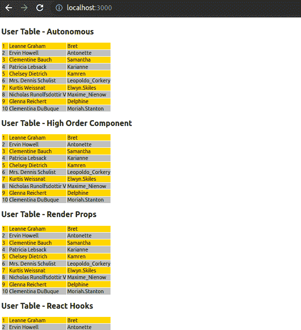
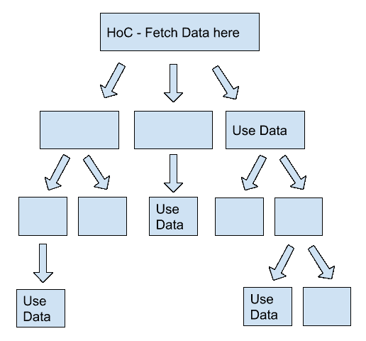

# React - LogRocket 博客中的数据获取综合指南

> 原文：<https://blog.logrocket.com/comprehensive-guide-data-fetching-react/>

***编者按:*** *本 React 数据抓取教程于 2022 年 8 月 9 日更新，增加了关于什么是数据抓取、如何显示抓取的数据、如何通过缓存库抓取数据以及更新过时链接和代码演示的章节。*

现代应用程序处理大量数据。React 尤其擅长在分层组件视图中显示数据，但是组件如何获取数据呢？有许多方法去做这件事，每一种都有它自己的优点和缺点。

在本教程中，我们将关注 React 中的数据获取。我们将演示如何在 React 中获取数据，包括代码示例，并介绍一些方法来帮助您确定 React 项目的最佳数据获取方法。

我们将详细介绍以下内容:

## React 中的数据获取是什么？

现代的全栈应用包括两个主要模块:前端和后端。我们通常通过用 React 构建的应用前端来显示交互式 UI 元素。另一方面，后端保存并检索远程服务器计算机中的数据。

正因为如此，我们经常需要从后端获取数据并在前端显示。我们可以通过各种数据传输机制做到这一点，最流行的机制通常是 RESTful 接口、WebSockets、GraphQL 接口、XML 消息和 gRPC 实现。

如今，RESTful 方法无疑是 React 应用程序最流行的数据传输机制之一。在本教程中，我们将主要关注基于 RESTful 的数据获取。

React RESTful 数据获取流程很简单。在组件中，我们通常通过调用 RESTful 端点并让浏览器执行 HTTP 调用来请求网络客户端获取数据。一旦浏览器从 RESTful 服务器接收到特定端点的数据，我们就可以将这些数据转换成 React 组件或 HTML 元素，并将它们显示给用户。

让我们用一个实用的 React app 来理解数据抓取吧！

## 设置示例数据获取应用程序

为了展示如何在 React 中获取数据，我们将使用从 [JSONPlaceholder](https://jsonplaceholder.typicode.com/users) 获取用户的组件构建一个简单的 React 应用程序。所有组件呈现相同的数据，看起来也一样。我使用传统的`<table>` HTML 元素来显示表格数据，以保持教程的简单性，并且只关注数据获取。您可以在 React 应用程序中使用任何首选的数据表组件。

下面是我们的示例应用程序的样子:



首先，从 [GitHub](https://github.com/codezri/react-data-patterns-demo) 下载或克隆预先开发好的样例 app。使用以下命令安装依赖项:

```
npm install
# --- or ---
yarn install

```

我们不需要设置任何本地 web API，因为我们使用远程 [JSONPlaceholder](https://jsonplaceholder.typicode.com/) 服务作为数据源。照常运行 React 应用程序:

```
npm start
# --- or ---
yarn start

```

现在，您将看到预览截图中显示的数据表。

在深入研究数据获取实现的具体细节之前，让我们研究一下主要的`App`组件结构。主`App`组件只是一个功能组件。它呈现了各种数据模式组件，这些组件说明了每种数据获取方法:

```
import React from 'react';
import UserTableAutonomous from './components/UserTableAutonomous';
import UserTableHOC from './components/UserTableHOC';
import UserTableReactHooks from './components/UserTableReactHooks';
import UserTableRenderProps from './components/UserTableRenderProps';
import SimpleUserTable from './components/SimpleUserTable';

import './App.css';

function App() {
    return (
        <div className='App'>
            <h2> User Table - Autonomous</h2>
            <UserTableAutonomous/>
            <h2> User Table - Higher Order Component</h2>
            <UserTableHOC/>
            <h2> User Table - Render Props</h2>
            <UserTableRenderProps children={SimpleUserTable}/>
            <h2> User Table - React Hooks</h2>
            <UserTableReactHooks/>
        </div>
    );
}

export default App;

```

事不宜迟，让我们从 React 中的数据获取开始。

## 如何在 React 中提取数据概述

如果您刚刚开始使用 React，您可能只从事过简单的初级项目，不需要访问或处理数据。随着您开始 React 之旅并学习如何构建更复杂的项目，您的应用程序几乎肯定会需要这一功能。事实上，数据获取是几乎每个 React 应用程序的核心需求。

在 React 中获取数据有多种方式，包括使用内置的 Fetch API、Axios 等等。我们将详细讨论所有这些方法。您还可以从 GraphQL 后端获取高阶组件中的数据并呈现道具，等等。继续阅读，了解如何做到这一点。

## 获取服务器提供的数据

这是为你的应用程序获取数据的传统方式。数据嵌入在从服务器发送的 HTML 中。如果需要新数据，需要手动刷新页面或定期刷新页面。还记得这个吗？

```
<meta http-equiv="refresh" content="30">

```

这与 React 应用程序并不特别相关，React 应用程序有更动态、更细粒度的方式来更新自身，但这仍然是从服务器向浏览器获取数据的合法方式。许多遗留的 web 应用程序仍然在使用它，如果 JavaScript 被禁用或者您必须处理古老的浏览器，它甚至可能是最好的方法，因为非常简单明了。

## React 组件如何获取数据

React 组件可以获取自己的数据。最大的问题是何时获取数据。有几个选项:

*   从无数据开始，根据用户操作(如单击按钮)获取数据
*   加载一次数据
*   定期加载数据

由于组件是完全自治的，没有其他组件可以告诉它是时候加载数据了。在这种情况下，我选择在`componentDidMount()`中第一次加载数据，并且还设置了一个计时器，该计时器将每五秒钟读取一次数据。

我们来看一下`UserTableAutonmous`组件，一片一片的解剖。这是一个标准的基于类的 React 组件。它的状态包括两个字段:一个初始化为`false`的布尔值`isFetching`，因为它还没有获取，以及一个空的用户列表(它想要获取的数据)。

```
class UserTableAutonomous extends Component {
    constructor(props) {
        super(props);
        this.state = {
            isFetching: false,
            users: []
        };
    }

```

首先，`render()`方法呈现一个 HTML `<table>`元素。然后，它通过使用`map`函数将`users`数组转换为`<tr>`元素来显示表中的数据记录。如果正在获取，也会显示“获取用户…”消息。

这是非常初级的进度报告，所以你可以考虑根据你的应用程序的 UI/UX 原则添加专业的 CSS 加载器/旋转器。HTML table 元素将只显示每个用户的 id、name 和 username 字段，尽管还有其他几个字段。

```
render() {
    return (
        <div>
            <table>
                <tbody>
                    {this.state.users.map((user, index) => (
                    <tr key={index} className={rowClassNameFormat(index)}>
                            <td>{user.id}</td>
                            <td>{user.name}</td>
                            <td>{user.username}</td>
                    </tr>
                    ))}
                </tbody>
            </table>
            <p>{this.state.isFetching ? 'Fetching users...' : ''}</p>
        </div>
    )
}

```

正如我之前所讨论的，实际的数据获取发生在`componentDidMount()`中，React 生命周期方法在组件被挂载并准备就绪时被调用。有些人可能认为最好使用`componentWillMount()`,它在组件将要安装时被调用，并且更早地开始获取数据以节省时间。然而，有两个重要的理由反对它。

首先，[从 React 17 开始已经弃用](https://reactjs.org/docs/react-component.html#unsafe_componentwillmount)。第二，当你在`componentWillMount()`中使用 Fetch API 或 Axios 时，React 会在没有等待它完成的情况下进行渲染，并且会导致第一次空渲染——所以你并没有真正节省任何时间。

注意`componentDidMount()`是在第一次渲染之后调用的，所以您仍然需要处理第一次空渲染。在我们的演示中，我使用了“获取用户…”消息。

* * *

### 更多来自 LogRocket 的精彩文章:

* * *

另一种选择是在构造函数中进行初始数据获取，但这会延迟组件的首次呈现。

好的，就这么定了——我们将在`componentDidMount()`获取我们的数据。这段代码简单地调用了`fetchUsers()`方法，并启动了一个每五秒钟调用一次`fetchUsers()`的计时器。

```
componentDidMount() {
    this.fetchUsers();
    this.timer = setInterval(() => this.fetchUsers(), 5000);
}

```

当我们的组件离开时，调用`componentWillUnmount()`方法，这是通过调用`clearInterval()`并将其设置为 null 来停止计时器的好时机。

```
componentWillUnmount() {
    clearInterval(this.timer);
    this.timer = null;
}

```

`fetchUsers()`将`isFetching`状态变量设置为`true`，因此在获取新数据时，组件在数据表后的`<p>`标记中呈现“获取用户…”消息。然后它通过一些“魔法”得到用户，并将`isFetching`设置回`false`。

```
async fetchUsers() {
    try {
        this.setState({...this.state, isFetching: true});
        // fetch data ....
        this.setState({users: response.data, isFetching: false});
    } catch (e) {
        // error handling
    }
}

```

我不太喜欢自主组件；他们太像一个黑箱了。它们混合了两种非常不同的数据获取和数据显示，并且更难测试。

有多种方法可以实现`fetchUsers()`功能。我在不同的组件中使用了三种不同的实现。所有三种实现都完成相同的任务:

*   内置的获取 API
*   Axios
*   Axios 异步/等待

我也可以在 Fetch API 中使用 async/await。我在不同的组件中任意使用了不同的实现；它们都是可以互换的。利弊更多的是人体工程学而非功能性。

让我们仔细看看这些替代实现。

## 在 React 中使用 Fetch API 的示例

Fetch API 是传统的`XMLHttpRequest` API 的现代替代品。如今，所有现代浏览器通常都支持 Fetch API，所以我们可以在 React 中使用它来获取数据，而无需向您的`package.json`添加另一个依赖项。

我已经在`UserTableHOC`组件中使用了 Fetch。我实际上调用了函数`fetchUsersWithFetchAPI()`，但是将它赋给了一个名为`fetchUsers`的变量，所以组件只调用了`fetchUsers()`。

该函数首先将变量`isFetching`设置为`true`，然后调用 fetch。Fetch 返回一个承诺，该承诺解析为一个响应。响应的`json()`方法返回一个 JavaScript 对象。然后，它将用户设置为状态，并将`isFetching`重置为`false`。

如果出现问题，catch 处理程序会将错误记录到控制台，并在获取完成后重置`isFetching`变量。

```
fetchUsersWithFetchAPI = () => {
    this.setState({...this.state, isFetching: true});
    fetch(USER_SERVICE_URL)
        .then(response => response.json())
        .then(result => {
            this.setState({users: result, isFetching: false})
        })
        .catch(e => {
            console.log(e);
            this.setState({...this.state, isFetching: false});
        });
};

fetchUsers = this.fetchUsersWithFetchAPI;

```

### 使用 Fetch 调用 API

我们之前已经使用`fetch`函数调用了 JSONPlaceholder 用户 API。`fetchUsersWithFetchAPI`触发了一个`GET` API 请求，因为我们在没有特定 HTTP 方法的情况下调用了`fetch`(即`PATCH`、`POST`等)。).

调用 web API 是指进行 [CRUD](https://en.wikipedia.org/wiki/Create,_read,_update_and_delete) 操作，而不仅仅是 R(读)操作。例如，如果我们需要通过 RESTful 后端插入一个新用户，我们可能需要用一个`POST` HTTP 请求和一个包含新用户数据的 JSON 有效负载来调用 API。类似地，我们也经常需要用`PATCH`和`DELETE` HTTP 方法调用 API。

我们可以使用`fetch`函数的`method`选项来调用具有不同 HTTP 方法的 API。以下代码片段插入一个新用户:

```
const user = { username: 'John100' };

fetch(USER_SERVICE_URL, {
  method: 'POST',
  headers: {
    'Content-Type': 'application/json',
  },
  body: JSON.stringify(user),
})
  .then((response) => response.json())
  .then((user) => {
    console.log('New user:', user);
  })
  .catch((e) => {
    console.error(e);
  });

```

在这里，我们一直使用`USER_SERVICE_URL`，但是一个真实的 API 可能包含多个端点(即`[http://www.example.com/api/users](http://www.example.com/api/users)`、`[http://www.example.com/api/orders](http://www.example.com/api/orders)`等)。).然后，您可以使用多种策略，以可读性更好的方式调用 Fetch API。

一种方法是对基本 URL 使用一个常量，并将其与`fetch`调用连接起来:

```
const BASE_URL = 'https://www.example.com/api';

fetch(`${BASE_URL}/users`)
// ...

fetch(`${BASE_URL}/orders`)
// ...

```

通过[为`fetch`函数](https://blog.logrocket.com/intercepting-javascript-fetch-api-requests-responses/)创建一个拦截器，我们可以让上面的代码更加易读:

```
function fetchWithBase(fetch, baseURL) {
    return (url, ...params) => {
      if(url.startsWith('/')) 
        return fetch(baseURL + url, ...params)
      else 
        return fetch(url, ...params);
    }
}
const fetch = fetchWithBase(window.fetch, BASE_URL);

fetch('/users')
// ...

fetch('/orders')
// ...

```

Fetch API 相当冗长和麻烦，但是它是标准的，没有外部依赖性——这是 Fetch API 的卖点。话说回来，这是 JavaScript 许许多多的依赖是这片土地的法则。输入 Axios。

## 如何用 Axios 获取数据

我已经为`UserTableRenderProps`组件使用了 Axios。Axios 也有一个类似于 Fetch 的基于 promise 的 API，但是 Axios 省去了 JSON 解析阶段，处理所有错误。例如，Fetch API 返回 404 作为正常响应，因此您需要在代码中检查响应，并在需要时自己抛出一个错误。

```
fetchUsersWithAxios = () => {
        this.setState({...this.state, isFetching: true});
        axios.get(USER_SERVICE_URL)
            .then(response => {
                this.setState({data: response.data, isFetching: false})
            })
            .catch(e => {
                console.log(e);
                this.setState({...this.state, isFetching: false});
            });
    };
fetchUsers = this.fetchUsersWithAxios

```

代码几乎与 Fetch API 版本相同，少了一个步骤，开发人员友好的代码和更健壮的错误处理。

### Fetch 比 Axios 好吗？

您可以使用 Fetch API 或 Axios 通过 HTTP 协议[与服务器通信。有什么区别？](https://www.geeksforgeeks.org/difference-between-fetch-and-axios-js-for-making-http-requests/)

Fetch API 提供了一个在 window 对象上定义的`fetch()`方法，以及一个用于访问和操作 HTTP 请求和响应的 JavaScript 接口。`fetch()`只有一个强制参数:要获取的资源的 URL。它返回一个承诺，可用于检索请求的响应。

另一方面，Axios 是一个 JavaScript 库，使您能够从浏览器和 Node.js 环境发出 HTTP 请求。它支持 JavaScript ES6 中的 Promise API。Axios 使您能够拦截 HTTP 请求和响应，保护客户端免受跨站点请求伪造( [XSRF](https://en.wikipedia.org/wiki/Cross-site_request_forgery) )，并且能够取消请求。

[那么 React 取数据方式哪个更好:`fetch`还是 Axios](https://blog.logrocket.com/axios-or-fetch-api/) ？这取决于您的项目的特定需求以及您在使用内置 API 时的舒适程度。

Axios 在一个紧凑的包中提供了一个易于使用的 API，可以满足您的大多数 HTTP 通信需求。但是，如果您更喜欢使用原生 API，没有什么可以阻止您实现 Axios 特性。使用 web 浏览器提供的`fetch()`方法来重现 Axios 库的关键特性当然是可能的。

最终，是否值得加载客户端 HTTP API 取决于您是否习惯使用内置 API。

## 如何在 React 中用 async/await 获取数据

我在`UserTableAutonomous`组件中使用了 async/await 语法。这些承诺链是对旧的回调地狱的巨大改进，但它可以变得更好。看看使用 async/await 时，相同的代码看起来是多么漂亮和自然:

```
async fetchUsers() {
    try {
        this.setState({...this.state, isFetching: true});
        const response = await axios.get(USER_SERVICE_URL);
        this.setState({users: response.data, isFetching: false});
    } catch (e) {
        console.log(e);
        this.setState({...this.state, isFetching: false});
    }
}

```

毫无疑问，这是我最喜欢的变体。

## 如何在 React 中从 GraphQL API 获取数据

用户 API 是一个 REST API。GraphQL 后端怎么样？GraphQL 服务器通常也通过 HTTP 返回 JSON。

主要区别在于，只有一个查询端点来获取数据(忽略突变和订阅)，请求和返回的实际数据遵循 GraphQL 模式。数据获取策略和战术并不区分 REST 和 GraphQL，它们在两者上都同样适用。

现在，WebSockets 与 gRPC 是一个不同的故事——我们将把它留到另一天。

## 如何在高阶组件中获取数据

高阶组件是复合组件，其中顶层组件负责获取数据并将其传播给子组件。高阶组件可以任意嵌套。

几个后代组件可能接收提取数据的不同部分，而层次结构中的其他组件可能根本不使用这些数据。这里有一个小图表来说明这一点:



基本思想是将获取和分发数据的考虑与实际处理数据的考虑分离开来。在多个组件需要不同方面的数据的情况下，这也更有效，因为您只需获取一次数据。让我们看看结果如何。

组件对服务器、生命周期方法、数据获取或错误处理一无所知；它所做的只是在 props 中接收用户列表，并使用 HTML `<table>`元素呈现它们。它理解用户对象的属性，并期望一个 id、名称和用户名。

```
import React from 'react';
import '../css/Table.css';

function rowClassNameFormat(index) {
    return index % 2 === 0 ? 'Gold-Row' : 'Silver-Row';
}

const SimpleUserTable = (props) => {
    return (
        <div>
            <table>
                <tbody>
                {props.data.map((user, index) => (
                   <tr key={index} className={rowClassNameFormat(index)}>
                        <td>{user.id}</td>
                        <td>{user.name}</td>
                        <td>{user.username}</td>
                   </tr>
                ))}
                </tbody>
            </table>
            <p>{props.isFetching ? 'Fetching users...' : ''}</p>
        </div>
    )
};

export default SimpleUserTable;

```

有趣的是，关于用户对象的知识只是一个局部视图。从 JSONPlaceholder 返回的实际用户对象包含更多信息:

```
{
    "id": 1,
    "name": "Leanne Graham",
    "username": "Bret",
    "email": "\[[email protected]\](mailto:[email protected])",
    "address": {
      "street": "Kulas Light",
      "suite": "Apt. 556",
      "city": "Gwenborough",
      "zipcode": "92998-3874",
      "geo": {
        "lat": "-37.3159",
        "lng": "81.1496"
      }
    },
    "phone": "1-770-736-8031 x56442",
    "website": "hildegard.org",
    "company": {
      "name": "Romaguera-Crona",
      "catchPhrase": "Multi-layered client-server neural-net",
      "bs": "harness real-time e-markets"
    }
  }

```

`SimpleUserTable`只关心 id、名称和用户名。如果后端服务器添加更多的信息或删除/重命名一些未使用的字段，这完全没问题。为了更加熟悉呈现数据，您可以尝试更新`SimpleUserTable`来呈现串联的地址字段和公司详细信息。我们将在下一节讨论如何完整地呈现获取的数据！

那么，什么获取实际数据呢？那就是`UserTableHOC`。它通过调用更新用户的`fetchUsers()`方法在它的`componentDidMount`中获取用户，`isFetching`是状态。`render()`方法只是将状态传递给子节点`SimpleUserTable`。

```
import React, { Component } from 'react';
import SimpleUserTable from './SimpleUserTable';

const USER_SERVICE_URL = 'https://jsonplaceholder.typicode.com/users';

class UserTableHOC extends Component {
    constructor(props) {
        super(props);
        this.state = {
            isFetching: false,
            users: []
        };
    }

    render = () => <SimpleUserTable data={this.state.users}
                                    isFetching={this.state.isFetching}
    />;

    componentDidMount() {
        this.fetchUsers();
    }

    fetchUsersWithFetchAPI = () => {
        this.setState({...this.state, isFetching: true});
        fetch(USER_SERVICE_URL)
            .then(response => response.json())
            .then(result => {
                this.setState({users: result, isFetching: false});
            })
            .catch(e => {
                console.log(e);
                this.setState({...this.state, isFetching: false});
            });
    };

    fetchUsers = this.fetchUsersWithFetchAPI;
}

export default UserTableHOC;

```

在实践中，我们将`UserTableAutonomous`分成两个嵌套的组件；代码基本相同，但是更简洁。我们已经做好了准备，以防我们需要多个组件以不同的方式显示用户数据。

例如，如果我们想启用用户选择，然后在另一个组件(如`FullUserInfo`)中显示所选用户的完整信息，那么`UserTableHOC`可以将相关的用户信息传递给`FullUserInfo`组件。

这听起来很棒，但是在这些情况下有很多工作要做，比如通知 HOC 关于子组件中的选择，以及通过深度嵌套的组件层次结构来传递提取的数据。

因此，HOC 不仅负责获取数据，还负责呈现层次结构中直接位于它下面的组件，并可能响应来自这些子组件的事件。

我们的下一个数据模式解决了这些问题，但是它也有自己的权衡。

## 如何在渲染道具中获取数据

如果我们可以实现一个通用的数据提取器，它完全不知道应该如何处理数据，那会怎么样？事实证明这是一种常见的做法。诀窍是使用间接层。

俗话说，“你可以用一个[附加的间接层](https://en.wikipedia.org/wiki/Indirection)来解决计算机科学中的任何问题……除了太多间接层的问题。”

反应模式通常被称为渲染道具。其思想是将一个属性传递给一个组件，该组件是一个函数，而不是一个静态值或对象。接收对象将执行这个道具，它经常在`render()`方法中使用——因此命名为 render prop。

这为您带来的是通过用您的函数替换部分逻辑来深度定制目标组件工作方式的能力。如果你熟悉面向对象的设计模式，它类似于策略模式或模板方法模式。

`UserTableRenderProps`的代码和`UserTableHOC`很像。最大的区别在于调用其`props.children()`函数的`render()`方法。这增加了抽象层次，因为组件不需要知道任何关于其子组件的信息。

```
import React, { Component } from 'react';
import axios from 'axios';

const USER_SERVICE_URL = 'https://jsonplaceholder.typicode.com/users';

class UserTableRenderProps extends Component {
    constructor(props) {
        super(props);
        this.state = {
            isFetching: false,
            data: []
        };
    }

    render = () => this.props.children(this.state);

    componentDidMount() {
        this.fetchUsers();
    }

    fetchUsersWithAxios = () => {
        this.setState({...this.state, isFetching: true});
        axios.get(USER_SERVICE_URL)
            .then(response => {
                this.setState({data: response.data, isFetching: false});
            })
            .catch(e => {
                console.log(e);
                this.setState({...this.state, isFetching: false});
            });
    };

    fetchUsers = this.fetchUsersWithAxios;
}
export default UserTableRenderProps;

```

这很酷，但这意味着无论传递什么，渲染支柱都需要知道内部结构。

什么时候使用渲染道具才有意义？一个很好的例子是在深层次结构中，数据获取组件可以共享一个缓存。在这种情况下，让多个数据提取器拥有不同的子对象是有意义的，这与 HOC 相反，HOC 的子对象是固定的(在 HOC 组件的`render()`方法中硬编码)。

让我们再来看看 App.js 中的`App()`功能组件，它将`children`渲染道具传递给`UserTableRenderProps`。如您所见，它需要知道`SimpleUserTable`并传递它。

```
function App() {
    return (
        <div className='App'>
            <h2> User Table - Autonomous</h2>
            <UserTableAutonomous/>
            <h2> User Table - Higher Order Component</h2>
            <UserTableHOC/>
            <h2> User Table - Render Props</h2>
            <UserTableRenderProps children={SimpleUserTable}/>
            <h2> User Table - React Hooks</h2>
            <UserTableReactHooks/>
        </div>
    );
}

```

## 用 React 钩子获取数据

React 中的数据获取过去需要一个具有状态和生命周期方法的基于类的组件。但是 [React 16.8 带给我们的是钩子](https://reactjs.org/docs/hooks-intro.html)。

诸如高阶组件和渲染道具之类的模式要求您重新构建组件层次结构和/或通过层次结构传播大量状态(直接使用道具或者使用各种包装器、提供者和消费者)。此外，人们还纠结于类及其实现方式。

React Hooks 的思想是将状态管理分解成独立的功能，不需要将状态的圆栓放入类生命周期方法的方孔中。

React 的所有特性都可以在功能组件中使用，并且不需要类。特别是，我们可以使用 React 钩子来获取数据。

让我们检查一下`UserTableReactHooks`功能组件的代码。首先，用初始状态调用`useState()`状态钩子。这类似于构造函数。钩子返回两个值:当前状态和更新它的函数。请注意，您可以拥有多个状态挂钩，如果您需要独立更新状态的不同部分，这可能会很有用。

```
import React, {useEffect, useState} from 'react';
import axios from 'axios';
import SimpleUserTable from './SimpleUserTable';

const USER_SERVICE_URL = 'https://jsonplaceholder.typicode.com/users';

function UserTableReactHooks() {
    const [data, setData] = useState({users: [], isFetching: false});

```

到目前为止，一切顺利。为了执行像数据获取这样的副作用，我们将使用一个效果钩子。默认情况下，效果挂钩接受一个函数并在每次渲染后运行它。

在本例中，我希望它只运行一次，所以我传递了一个函数和一个空数组。数组参数告诉钩子只在数组中列出的状态变量改变时才应用效果(即运行函数)。因为我传递了一个空数组，所以不需要观察状态变量，效果只运行一次。

```
useEffect(() => {
    const fetchUsers = async () => {
        try {
            setData((data) => ({users: data.users, isFetching: true}));
            const response = await axios.get(USER_SERVICE_URL);
            setData({users: response.data, isFetching: false});
        } catch (e) {
            console.log(e);
            setData((data) => ({users: data.users, isFetching: false}));
        }
    };
    fetchUsers();
}, []);

```

你可以把效果想象成基于类的组件的`componentDidMount()`和`componentDidUpdate()`的组合。

最后，它只是返回带有本地状态的`SimpleUserTable`进行渲染。

```
return <SimpleUserTable data={data.users}
                            isFetching={data.isFetching}
    />;
}

export default UserTableReactHooks;

```

挂钩是一个很酷的和符合人体工程学的额外反应。我强烈建议你[熟悉他们](https://blog.logrocket.com/react-hooks-cheat-sheet-unlock-solutions-to-common-problems-af4caf699e70/)。

## 通过缓存库获取数据

在前面的例子中，我们使用了一个简单的通用流程来显示来自 web 服务的数据。首先，我们用网络客户机调用 RESTful API。接下来，我们将数据临时存储在一个状态变量中。最后，我们的 React 组件用花括号语法呈现获取的数据。这个流程简单且易于实现，但是它有几个缺点:

*   如果我们多次使用数据获取组件，我们的 React 应用程序将多次发送相同的网络请求
*   我们必须自己定义状态变量来跟踪加载状态和错误
*   没有缓存层——组件最初会在呈现或重新呈现时显示加载指示器，直到数据获取请求完成。

我们可以在数据呈现和获取之间实现一个缓存层来解决上述问题。缓存库帮助我们更有效地获取数据，并且以一种更加用户友好的方式。 [React SWR](https://github.com/vercel/swr) 和 [TanStack Query](https://github.com/TanStack/query) 是 React 生态系统中流行的缓存库。

你可以[在这里](https://blog.logrocket.com/useswr-vs-react-query/)了解更多关于缓存库、反应 SWR 和转移查询的信息。

## 如何显示提取的数据

前面，我们讨论了使用 Fetch API 和 Axios 获取数据。我们还将获取的数据传递给`SimpleUserTable`组件进行渲染。在本教程的示例应用程序中，我们必须显示一组用户。类似地，在 React 应用程序中，您可能需要显示一系列产品、一个销售订单信息、一个来自 URL 的图像以及其他类似的内容。

React 让我们可以使用 [JSX 表达式](https://reactjs.org/docs/introducing-jsx.html#embedding-expressions-in-jsx)语法(也称为花括号语法)动态呈现数据。

看`SimpleUserTable`。您可以看到我们是如何动态显示装载指示器文本的:

```
<p>{props.isFetching ? 'Fetching users...' : ''}</p>

```

那么我们如何在 HTML `<table>`元素中呈现用户列表呢？元素让我们在一个`<tbody>`标签中添加带有`<tr>`标签的行数据。我们可以用花括号语法将`users` JavaScript 数组转换成一组`<tr>`元素。我们都知道可以使用`map()`方法来转换数据，所以可以用`map()`来呈现获取的用户数组，如下所示:

```
<tbody>
{props.data.map((user, index) => (
   <tr key={user.id} className={rowClassNameFormat(index)}>
        <td>{user.id}</td>
        <td>{user.name}</td>
        <td>{user.username}</td>
   </tr>
))}
</tbody>

```

在 React 中，我们需要对组件列表的属性使用一个惟一的值，所以这里我们使用了惟一键`user.id`。在这个示例应用程序中，我们使用`rowClassNameFormat()`函数根据行索引对表格行进行了不同的样式化。

现代 web 应用程序通常为表格数据提供类似分页和排序的功能，因此如果我们使用[t stack Table](https://github.com/tanstack/table)(或类似的库)，我们可以用更少的代码呈现现代的全功能数据表。

## 并发模式和反应暂停

如果你是一名 React 开发人员，现在你很可能听说过[并发模式](https://reactjs.org/docs/concurrent-mode-intro.html)。暂停是并发模式中的一种机制，它使您的组件能够在等待一些长时间运行的操作完成时显示一些内容作为后备。显然，数据获取是一个长时间运行的操作，您可能希望在获取数据时显示类似消息、进度条或微调器的内容。

换句话说，[React suspension](https://reactjs.org/docs/concurrent-mode-suspense.html)是一套帮助 React 应用保持响应的功能，无论用户的设备能力或网络速度如何。它包装了您的定制组件，并使它们能够进行通信，以便在呈现组件之前做出反应，等待一些数据加载。

悬疑既不是`[react-async](https://github.com/async-library/react-async)`那样的数据取数库，也不是状态管理工具 a-la [Redux](https://blog.logrocket.com/why-use-redux-reasons-with-clear-examples-d21bffd5835/) 。它只是防止组件呈现到 DOM，直到某个异步操作(例如，网络请求)完成。

举以下例子:

```
loading...
}>  />

```

`<span class="typ">Todos</span>`被一个带有`<span class="pln">fallback</span>`道具的`<span class="typ">Suspense</span>`组件包裹。

如果`Todos`正在等待一个异步操作，比如从 API 中检索待办事项列表，React 会将`<span class="tag"><p></span><span class="pln">loading…</span><span class="tag"></p></span>`呈现给 DOM。

当操作结束时，`<span class="typ">Todos</span>`组件被呈现。您可能会尝试使用以下代码进行同样的操作:

```
...
if (loading) {
  return <p>loading...p>
}

return <Todos />
...

```

这并不完全可行，因为它假设异步操作是由父组件触发的，并且在操作完成后,`<span class="tag"><Todos</span><span class="pln"> </span><span class="tag">/></span>`是由父组件呈现的。但是如果`Todos`触发了操作呢？

在这种情况下，您需要将加载检查从父组件移动到`Todos`组件。那么，假设有更多的组件，每个组件触发自己的异步请求。每个子组件都必须独立地管理自己的加载状态，这使得很难以一种干净的方式协调数据加载操作，而不会导致 UX。

```
loading...
}>  />
   />

```

在上面的例子中，我们添加了另一个`Tasks`组件。让我们假设这个组件也触发它自己的异步操作。通过将两个组件包装在`Suspense`中，您实际上是在告诉 React 在两个操作都解决之前不要渲染任何一个组件。为了毫无悬念地完成同样的工作，您需要将异步调用移动到父组件，并在呈现组件之前添加对`loading`标志的`if`检查。

当然，您可以混合搭配各种方法，包括渲染时提取、提取后渲染和提取时渲染。你可以通过阅读我们全面的[反应悬念教程](https://blog.logrocket.com/react-suspense-for-data-fetching/)来了解更多关于这些方法的信息。

如果您已经有了一些以某种方式获取数据的组件，以及使用另一种方法的其他组件，它们都可以愉快地生活在同一个应用程序中。但是如果你是从零开始，使用 React 钩子和悬念可能是最好的方法。

需要注意的是，React 悬念是一个实验性的功能，在稳定版本中尚不可用。

## 结论

我们在这篇文章中涉及了很多内容。我们探讨了所有常见的 React 数据获取策略和战术。我们权衡了每种方法的利弊，并用代码演示了每种方法。

此时，我会使用 async/await 语法使用 React 钩子和 Axios。在不久的将来，检验数据获取的悬念会很有趣。

感谢阅读！