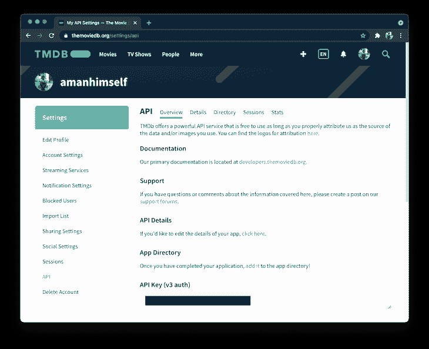
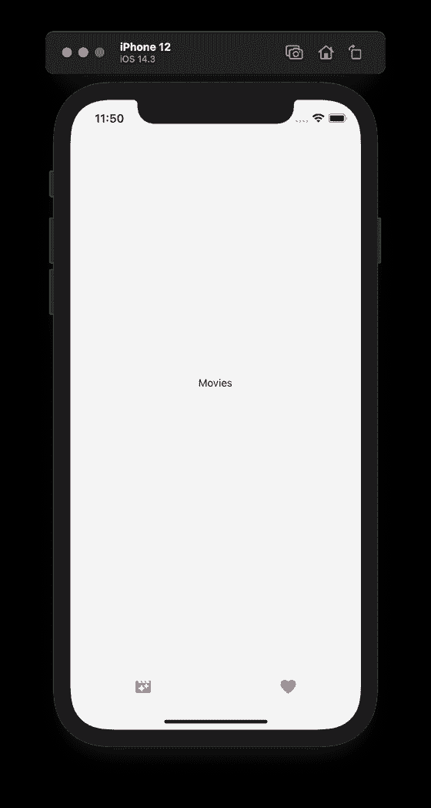
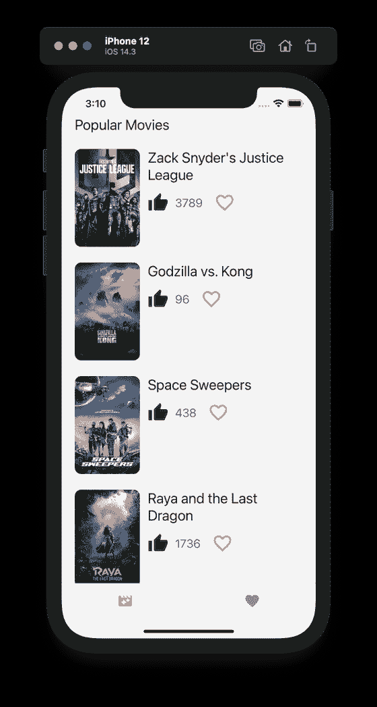
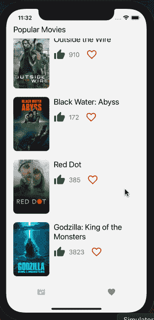

# React Native 中使用 Redux 的综合指南

> 原文：<https://blog.logrocket.com/comprehensive-guide-to-using-redux-in-react-native/>

React 本机应用程序是使用内部管理状态的组件构建的。React Native 的内置状态管理非常适用于组件很少且未来没有扩展空间的应用程序。然而，对于具有大量组件的应用程序，或者对于那些将来有可能增加范围的应用程序，在组件之间共享状态变得很复杂。

像 [Redux](https://blog.logrocket.com/why-use-redux-reasons-with-clear-examples-d21bffd5835/) 这样的状态管理库的存在就是为了解决这个问题。Redux 为应用程序的所有状态提供了一个中心位置，其中每个组件都可以访问存储在状态中的值。“中心位置”在 Redux 术语中称为商店。

在本教程中，我们将了解如何在 React 本机应用程序中使用 Redux 管理状态。本文涵盖:

*   动作类型和异步动作
*   定义减速器
*   配置 Redux 存储
*   使用 React 挂钩在 React 本机组件中调度操作

为了理解这些概念，让我们创建一个示例应用程序，从电影数据库 (TMDB API)中获取电影项目列表。这个项目的源代码可以在这个 [GitHub 仓库](https://github.com/amandeepmittal/react-native-examples/tree/master/reduxWithHooks)获得。应用程序用户可以从列表中喜欢任何电影项目，并将其存储在应用程序的状态中，以便从单独的屏幕上观看。

## 我们不只是写 Redux，我们也谈论它。现在听着:

或者以后订阅

### **先决条件**

### 开始之前，请确保在本地环境中安装了以下软件:

[Node.js](https://nodejs.org/en/) 版本> = `14.x.x`已安装

*   访问包管理器，如 npm、Yarn 或 npx
*   [`react-native-cli`](https://www.npmjs.com/package/react-native-cli) 安装(或使用 npx)
*   [TMDB](https://www.themoviedb.org/settings/api) 账户和访问 API 密钥
*   登录 TMDB 账户后，进入**设置** > **API** 部分，在 **API 密匙(v3 auth)** 部分下查找密匙，获取 API 密匙。



为了演示，我将使用一个 iOS 模拟器。如果你更喜欢使用 Android 设备或模拟器，这篇文章中分享的代码片段也可以运行。

使用 Redux 和 React Native

## 入门指南

### 要开始创建新的 React Native 项目，请使用 React Native CLI 并在项目目录中导航。我们将安装一些依赖项，包括实现底部选项卡导航器的`react-native-vector-icons`和`react-navigation/bottom-tabs`，然后我们将创建一个 Redux store。

要安装 React 导航库，请参见官方文档中的这些[说明](https://reactnavigation.org/docs/getting-started)。这些依赖关系可能会随着时间而改变。

要设置 react-native-vector-icons，请遵循这些说明。

安装好这些程序后，打开终端窗口并运行以下命令:

如果您正在为 iOS 开发，您需要安装 pods 来完成使用 CocoaPods 链接这些外部库:

```
npx react-native init reduxExample
cd reduxExample
yarn add @react-navigation/native @react-navigation/bottom-tabs react-native-gesture-handler react-native-reanimated react-native-screens react-native-safe-area-context @react-native-community/masked-view react-native-vector-icons axios [email protected] [email protected] [email protected]

```

创建选项卡和选项卡导航器

```
npx pod-install ios

```

### 安装过程结束后，我们将创建一个选项卡导航器，它将显示在屏幕底部。第一个选项卡将使用从 TMDB API 端点收集的数据显示电影列表。第二个将显示应用程序用户保存为收藏夹的电影列表。

我们将从创建两个模拟屏幕开始。创建一个名为`screens/`的新目录，并在其中创建两个新文件:

将相应的代码片段添加到每个文件中:

然后创建一个名为`navigation`的目录，并在其中创建一个名为`RootNavigator.js`的新文件。添加以下代码片段以创建底部选项卡:

```
// screens/Favorites.js
import React from 'react';
import {View, Text, StyleSheet} from 'react-native';
const Favorites = () => {
  return (
    <View style={styles.container}>
      <Text>Favorites</Text>
    </View>
  );
};
const styles = StyleSheet.create({
  container: {
    flex: 1,
    justifyContent: 'center',
    alignItems: 'center',
  },
});
export default Favorites;

// screens/Movies.js
import React from 'react';
import {View, Text, StyleSheet} from 'react-native';
const Movies = () => {
  return (
    <View style={styles.container}>
      <Text>Movies</Text>
    </View>
  );
};
const styles = StyleSheet.create({
  container: {
    flex: 1,
    justifyContent: 'center',
    alignItems: 'center',
  },
});
export default Movies;

```

修改`App.js`文件以渲染`RootNavigator`:

```
import React from 'react';
import {NavigationContainer} from '@react-navigation/native';
import {createBottomTabNavigator} from '@react-navigation/bottom-tabs';
import MaterialIcons from 'react-native-vector-icons/MaterialIcons';
// import screens
import Movies from '../screens/Movies';
import Favorites from '../screens/Favorites';
const Tab = createBottomTabNavigator();
const tabBarOptions = {
  showLabel: false,
  activeTintColor: '#9381ff',
  style: {
    height: '10%',
  },
};
const RootNavigator = () => {
  return (
    <NavigationContainer>
      <Tab.Navigator tabBarOptions={tabBarOptions}>
        <Tab.Screen
          name="Movies"
          component={Movies}
          options={{
            tabBarIcon: ({color, size}) => (
              <MaterialIcons name="movie-filter" color={color} size={size} />
            ),
          }}
        />
        <Tab.Screen
          name="Favorites"
          component={Favorites}
          options={{
            tabBarIcon: ({color, size}) => (
              <MaterialIcons name="favorite" color={color} size={size} />
            ),
          }}
        />
      </Tab.Navigator>
    </NavigationContainer>
  );
};
export default RootNavigator;

```

构建应用程序

```
import React from 'react';
import RootNavigator from './navigation/RootNavigator';
const App = () => {
  return <RootNavigator />;
};
export default App;

```

### 设置完成后，我们将构建应用程序并在 iOS 模拟器上运行它。要为 iOS 构建应用程序，请执行命令`npx react-native run-ios`。要在 Android 模拟器上运行它，请执行`npx react-native run-android`。

下面是 iOS 模拟器上的输出显示方式:



添加获取数据的操作

### Redux 中的动作是从应用程序发送到触发事件的存储的信息负载。当发生与应用程序的状态直接相关的事情时，可以描述为改变应用程序的状态。

Redux 中的状态由一个 JavaScript 对象表示，这个对象可以被认为是一个只读对象。它只能通过操作来更改。

构建示例应用程序的第一项任务是从 API 获取数据。然后，我们将这些数据添加到应用程序的状态中，然后可以在组件屏幕中使用这些数据来显示电影项目列表。

动作由具有两个属性的对象构成:

描述要触发的操作类型的普通字符串。例如，如果你想得到所有的电影项目，这里的动作类型是`GET_MOVIES`

*   包含数据或信息的有效负载
*   首先创建一个名为`redux`的新目录，并在其中创建一个名为`actions.js`的新文件。添加以下操作类型:

在上面的代码片段中，使用一个`const`变量定义了一个动作类型，以保持事情的可维护性。在现实场景中，在 Redux 应用程序中可以有各种动作来触发不同的事件。

```
export const GET_MOVIES = 'GET_MOVIES';

```

动作类型`GET_MOVIES`是一种负责发出 HTTP 请求以从 API 端点获取数据的动作。这是通过定义动作创建者来完成的。在 Redux 中，这是返回动作对象的函数的术语。

HTTP 请求由一个`BASE_URL`和一个`API_KEY`组成。对于示例应用程序，让我们获取热门电影列表。添加下面的代码来构建一个`BASE_URL`，并从您的帐户添加密钥来代替`API_KEY`。

为了从 API 获取数据，让我们使用 Axios。它有一个类似于`get`和`put`的方法 API 来发出 HTTP 请求。在文件顶部导入 Axios，然后定义一个名为`getMovies`的动作创建器。

```
const API_URL = 'https://api.themoviedb.org/3/movie/popular';
const API_KEY = '<your-api-key>';
const PARAMS = 'page=1';
const BASE_URL = `${API_URL}?api_key=${API_KEY}&${PARAMS}`;

```

添加电影减压器

```
export const getMovies = () => {
  try {
    return async dispatch => {
      const res = await axios.get(`${BASE_URL}`);
      if (res.data) {
        dispatch({
          type: GET_MOVIES,
          payload: res.data,
        });
      } else {
        console.log('Unable to fetch');
      }
    };
  } catch (error) {
    // Add custom logic to handle errors
  }
};

```

### 动作本身不能更新应用程序的状态。当状态发生变化时，它由一个名为 reducer 的纯函数处理，该函数根据初始或当前状态计算应用程序的更新状态。由于减速器是纯函数，如果状态保持不变，它们总是产生相同的输出。

缩减器接受两个参数:当前状态和一个动作。reducer 函数的一般语法可以描述为:

创建一个名为`reducers.js`的新文件。从`actions.js`文件中导入动作`GET_MOVIES`。现在，用两个空数组定义一个初始状态对象。第一个数组表示从 API 端点获取的电影项目，第二个数组存储应用程序用户喜欢的项目。

```
function Reducer(currentState, action) {
  return newState;
}

```

接下来，定义一个带有参数`initialState`和`action`的`moviesReducer`函数。它使用一个`switch`语句在不同的动作类型之间切换。每个动作类型由其自己的`case`定义。目前，只有一种动作类型，那就是获取电影列表。如果状态保持不变，`default`格返回当前状态。

创建商店

```
import {GET_MOVIES} from './actions';
const initialState = {
  movies: [],
  favorites: [],
};
function moviesReducer(state = initialState, action) {
  switch (action.type) {
    case GET_MOVIES:
      return {...state, movies: action.payload};
    default:
      return state;
  }
}
export default moviesReducer;

```

### 存储是一个对象，它在全局级别而不是在单个组件中保存应用程序的状态。它是由一个名为`createStore`的函数定义的，该函数将`rootReducer`作为第一个参数。

更多来自 LogRocket 的精彩文章:

* * *

### A `rootReducer`是所有 reducers 的对象。一个状态由 Redux 管理的 app 可能有不止一个 reducer。Redux 库提供了一个名为`combineReducers`的特殊函数，将所有的 reducers 合并到一个对象中。

* * *

当创建一个商店时，配置`redux-thunk`库是很重要的，它提供了对一个叫做`thunk`的中间件的访问。它允许 Redux store 发出异步 AJAX 请求，比如从 API 端点获取数据。默认情况下，使用 Redux 调度的任何动作都是同步的。

中间件函数作为第二个参数传递给`createStore`。为了使用一个中间件，Redux 提供了一个名为`applyMiddleware`的函数。每个中间件函数都作为参数传递给这个函数。

创建一个名为`store.js`的新文件，并复制以下代码片段:

要使用这个存储来管理 React 本机应用程序的状态，请将其导入到`App.js`文件中。还从`react-redux`库中导入`Provider`组件。它包装 React 本机应用程序的根组件，并将存储传递给应用程序的其余部分。

```
import {createStore, combineReducers, applyMiddleware} from 'redux';
import thunk from 'redux-thunk';
import moviesReducer from './reducers';
const rootReducer = combineReducers({
  moviesReducer,
});
export const store = createStore(rootReducer, applyMiddleware(thunk));

```

现在，任何属于`RootNavigator`的 React 本地组件都可以访问应用程序的状态。

```
import React from 'react';
import {Provider} from 'react-redux';
import {store} from './redux/store';
import RootNavigator from './navigation/RootNavigator';
const App = () => {
  return (
    <Provider store={store}>
      <RootNavigator />
    </Provider>
  );
};
export default App;

```

显示电影列表

### 为了显示从 API 端点获取的电影列表，让我们在屏幕组件`Movies.js`中显示它。

首先导入以下语句:

在上面的代码片段中，我们使用 Redux 的`useSelector`钩子从应用程序的全局状态访问电影数组。

```
import React, {useEffect} from 'react';
import {View, Text, FlatList, Image, TouchableOpacity} from 'react-native';
import {useSelector, useDispatch} from 'react-redux';
import MaterialIcons from 'react-native-vector-icons/MaterialIcons';
import {getMovies} from '../redux/actions';

```

这类似于在`connect()` HOC 内部传递的`mapStateToProps`参数的旧语法。新语法允许您使用选择器函数从 Redux 状态中提取数据。

使用`useDispatch`钩子分派动作`getMovies`从 Redux 商店获取电影项目。修改`Movies`组件如下:

为了渲染电影项目，我们将使用 React Native 中的`FlatList`组件。它接受`movies`数组作为`data`道具的值，而`renderItem`道具用于显示数组中的每个电影项目。

```
export default function BooksList() {
  const {movies} = useSelector(state => state.moviesReducer);
  const dispatch = useDispatch();
  const fetchMovies = () => dispatch(getMovies());
  useEffect(() => {
    fetchMovies();
  }, []);
  //...
}

```

每个电影条目都有一个海报图像，使用一个`Image`组件和一些电影标题和投票数形式的元信息显示。使用`TouchableOpacity`组件，创建一个“添加到收藏夹”按钮。我们将定义逻辑来更新 movies reducer 的状态，并稍后在“Favorites”选项卡中显示它们。

这是完成此步骤后您将得到的输出:

```
return (
  <View style={{flex: 1, marginTop: 44, paddingHorizontal: 20}}>
    <Text style={{fontSize: 22}}>Popular Movies</Text>
    <View style={{flex: 1, marginTop: 12}}>
      <FlatList
        data={movies}
        keyExtractor={item => item.id.toString()}
        renderItem={({item}) => {
          const IMAGE_URL =
            'https://image.tmdb.org/t/p/w185' + item.poster_path;
          return (
            <View style={{marginVertical: 12}}>
              <View style={{flexDirection: 'row', flex: 1}}>
                <Image
                  source={{
                    uri: IMAGE_URL,
                  }}
                  resizeMode="cover"
                  style={{width: 100, height: 150, borderRadius: 10}}
                />
                <View style={{flex: 1, marginLeft: 12}}>
                  <View>
                    <Text style={{fontSize: 22, paddingRight: 16}}>
                      {item.title}
                    </Text>
                  </View>
                  <View
                    style={{
                      flexDirection: 'row',
                      marginTop: 10,
                      alignItems: 'center',
                    }}>
                    <MaterialIcons color="green" name="thumb-up" size={32} />
                    <Text
                      style={{
                        fontSize: 18,
                        paddingLeft: 10,
                        color: '#64676D',
                      }}>
                      {item.vote_count}
                    </Text>
                    <TouchableOpacity
                      onPress={() => console.log('Added!')}
                      activeOpacity={0.7}
                      style={{
                        marginLeft: 14,
                        flexDirection: 'row',
                        padding: 2,
                        borderRadius: 20,
                        alignItems: 'center',
                        justifyContent: 'center',
                        height: 40,
                        width: 40,
                      }}>
                      <MaterialIcons
                        color="orange"
                        size={32}
                        name="favorite-outline"
                      />
                    </TouchableOpacity>
                  </View>
                </View>
              </View>
            </View>
          );
        }}
        showsVerticalScrollIndicator={false}
      />
    </View>
  </View>
);

```



创建添加和删除收藏夹的操作

### 在`actions.js`文件中，我们将创建另外两个动作类型及其创建者。这两种操作类型都允许应用程序用户在收藏夹列表中添加或删除电影项目。

接下来，为上述每种操作类型定义操作创建者。

```
export const ADD_FAVORITE_ITEM = 'ADD_FAVORITE_ITEM';
export const REMOVE_FAVORITE_ITEM = 'REMOVE_FAVORITE_ITEM';

```

现在，更新`reducers.js`文件中的`moviesReducer`。

```
export const addFavorite = movie => dispatch => {
  dispatch({
    type: ADD_FAVORITE_ITEM,
    payload: movie,
  });
};
export const removeFavorite = movie => dispatch => {
  dispatch({
    type: REMOVE_FAVORITE_ITEM,
    payload: movie,
  });
};

```

在`Movies.js`文件中，每个电影项目都有一个按钮，可以在将项目添加到收藏夹或将其移除之间切换。让我们导入这两个动作创建者:

```
import {GET_MOVIES, ADD_FAVORITE_ITEM, REMOVE_FAVORITE_ITEM} from './actions';
const initialState = {
  movies: [],
  favorites: [],
};
function moviesReducer(state = initialState, action) {
  switch (action.type) {
    case GET_MOVIES:
      return {...state, movies: action.payload};
    case ADD_FAVORITE_ITEM:
      return {...state, favorites: [...state.favorites, action.payload]};
    case REMOVE_FAVORITE_ITEM:
      return {
        ...state,
        favorites: state.favorites.filter(
          movie => movie.id !== action.payload.id,
        ),
      };
    default:
      return state;
  }
}
export default moviesReducer;

```

更新下面一行以访问`favorites`状态:

```
// Update the following line
import {getMovies, addFavorite, removeFavorite} from '../redux/actions';

```

分派以下操作以在收藏夹列表中添加或删除项目。这里的收藏夹列表由状态中的`favorites`数组表示:

```
const {movies, favorites} = useSelector(state => state.moviesReducer);

```

让我们创建另一个处理程序方法，根据上面触发的动作动态地改变 UI。该方法将检查一个电影项目是否存在于`favorites`数组中，并将根据该值触发 UI 更改。我们要做的 UI 更改是，当用户将按钮添加到收藏夹列表时，使用实心收藏夹按钮，而不是轮廓。

```
//  after fetch movies dispatch function, add:
const addToFavorites = movie => dispatch(addFavorite(movie));
const removeFromFavorites = movie => dispatch(removeFavorite(movie));
const handleAddFavorite = movie => {
  addToFavorites(movie);
};
const handleRemoveFavorite = movie => {
  removeFromFavorites(movie);
};

```

修改`TouchableOpacity`按钮:

```
const exists = movie => {
  if (favorites.filter(item => item.id === movie.id).length > 0) {
    return true;
  }
  return false;
};

```

显示收藏夹

```
<TouchableOpacity
  onPress={() =>
    exists(item) ? handleRemoveFavorite(item) : handleAddFavorite(item)
  }
  // other props remain the same
>
  <MaterialIcons
    color="orange"
    size={32}
    name={exists(item) ? 'favorite' : 'favorite-outline'}
  />
</TouchableOpacity>

```

### 添加到收藏项目列表中的任何电影项目也将显示在**收藏夹**选项卡中。要实现这一点，打开`Favorites.js`文件，通过导入以下语句开始:

由于**收藏夹**屏幕只显示添加的条目列表，让我们使用`useSelector`钩子从状态中取出`favorites`数组。

```
import React from 'react';
import {Text, View, FlatList, TouchableOpacity, Image} from 'react-native';
import {useSelector, useDispatch} from 'react-redux';
import MaterialIcons from 'react-native-vector-icons/MaterialIcons';
import {removeFavorite} from '../redux/actions';

```

使用`useDispatch`钩子将触发从列表中删除一个项目的动作。一旦一个项目从收藏夹列表中删除，它就不再显示在这个特定的屏幕上。

当没有要显示的项目时，或者换句话说，当状态中的`favorites`数组为空时，我们可以显示一个占位符消息。

将以下代码片段添加到`Favorites`组件中:

UI 组件与`Movies`屏幕相同。这是此步骤后的最终输出:

```
const Favorites = () => {
  const {favorites} = useSelector(state => state.moviesReducer);
  const dispatch = useDispatch();
  const removeFromFavorites = movie => dispatch(removeFavorite(movie));
  const handleRemoveFavorite = movie => {
    removeFromFavorites(movie);
  };
  return (
    <View style={{flex: 1, marginTop: 44, paddingHorizontal: 20}}>
      <Text style={{fontSize: 22}}>Favorites</Text>
      <View style={{flex: 1, marginTop: 8}}>
        {favorites.length === 0 ? (
          <Text style={{color: '#010101', fontSize: 18}}>
            Add a movie to the list.
          </Text>
        ) : (
          <FlatList
            data={favorites}
            keyExtractor={item => item.id.toString()}
            showsVerticalScrollIndicator={false}
            renderItem={({item}) => {
              const IMAGE_URL =
                'https://image.tmdb.org/t/p/w185' + item.poster_path;
              return (
                <View style={{marginVertical: 12}}>
                  <View style={{flexDirection: 'row', flex: 1}}>
                    <Image
                      source={{
                        uri: IMAGE_URL,
                      }}
                      resizeMode="cover"
                      style={{width: 100, height: 150, borderRadius: 10}}
                    />
                    <View style={{flex: 1, marginLeft: 12}}>
                      <View>
                        <Text style={{fontSize: 22, paddingRight: 16}}>
                          {item.title}
                        </Text>
                      </View>
                      <View
                        style={{
                          flexDirection: 'row',
                          marginTop: 10,
                          alignItems: 'center',
                        }}>
                        <MaterialIcons
                          color="green"
                          name="thumb-up"
                          size={32}
                        />
                        <Text
                          style={{
                            fontSize: 18,
                            paddingLeft: 10,
                            color: '#64676D',
                          }}>
                          {item.vote_count}
                        </Text>
                        <TouchableOpacity
                          onPress={() => handleRemoveFavorite(item)}
                          activeOpacity={0.7}
                          style={{
                            marginLeft: 14,
                            flexDirection: 'row',
                            padding: 2,
                            borderRadius: 20,
                            alignItems: 'center',
                            justifyContent: 'center',
                            height: 40,
                            width: 40,
                          }}>
                          <MaterialIcons
                            color="orange"
                            size={32}
                            name="favorite"
                          />
                        </TouchableOpacity>
                      </View>
                    </View>
                  </View>
                </View>
              );
            }}
          />
        )}
      </View>
    </View>
  );
};
export default Favorites;

```



结论

## 使用 Redux 中的存储机制将应用程序的所有状态保存在一个全局对象中可能会导致在使用许多组件时出现性能问题。也就是说，在 React Native 世界中没有一个通用的解决方案来解决所有这些问题。它归结为一个组件应该在本地保持什么状态，以及应用程序状态的哪些方面应该在组件之间共享。在 Redux 中使用钩子使得理解和使用函数组件中的状态变得简单。

要了解更多关于高级 Redux 的信息，请点击这里查看官方文档。

[LogRocket](https://lp.logrocket.com/blg/react-native-signup) :即时重现 React 原生应用中的问题。

## [LogRocket](https://lp.logrocket.com/blg/react-native-signup) 是一款 React 原生监控解决方案，可帮助您即时重现问题、确定 bug 的优先级并了解 React 原生应用的性能。

[](https://lp.logrocket.com/blg/react-native-signup)

LogRocket 还可以向你展示用户是如何与你的应用程序互动的，从而帮助你提高转化率和产品使用率。LogRocket 的产品分析功能揭示了用户不完成特定流程或不采用新功能的原因。

开始主动监控您的 React 原生应用— [免费试用 LogRocket】。](https://lp.logrocket.com/blg/react-native-signup)

Start proactively monitoring your React Native apps — [try LogRocket for free](https://lp.logrocket.com/blg/react-native-signup).