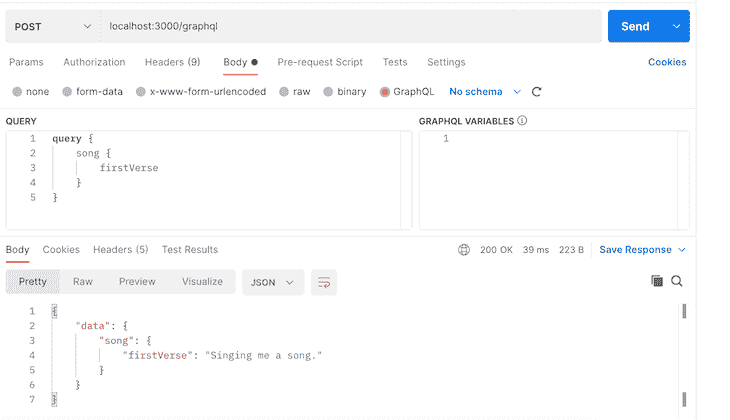

# 用信封日志博客配置任何 GraphQL 服务器

> 原文：<https://blog.logrocket.com/configuring-any-graphql-server-envelop/>

[envelope](https://www.envelop.dev/)是一个轻量级的 GraphQL 插件库，允许您向 GraphQL 执行层添加定制的特性，而不管您使用的是什么 GraphQL 服务器。

像 [Apollo GraphQL](https://apollographql.com/) 和 [Graphite](https://www.graphile.org/) 这样的 GraphQL 服务器已经有了运行良好的特定平台插件系统。不利的一面是，如果您出于任何原因选择迁移到 GraphQL 的不同实现，您将需要修改插件以与该特定实现一起工作。

## 什么是信封？

这就是信封的由来。Envelop 不是 GraphQL 服务器——它是 GraphQL 上的一个包装器，允许开发人员编写平台无关的插件。这意味着你只需要写一次你的插件就可以和 Envelop 一起工作并集成到任何 GraphQL 服务器中。

为了了解如何实现这一点，我们将把 Envelop 与 [Fastify](https://www.fastify.io/) 和 Apollo GraphQL 集成在一起。

以下是您在本教程中需要遵循的内容:

## 设置节点应用程序

运行以下命令来安装我们需要的所有依赖项:

```
npm install  @envelop/core fastify graphql graphql-helix --save

```

接下来，我们需要创建一个服务器。创建一个`server.js`文件并添加以下代码:

```
const { envelop, useSchema, useLogger } = require('@envelop/core');
const fastify = require('fastify');
const { processRequest, getGraphQLParameters } = require('graphql-helix');

```

在上面的代码中，我们导入了`envelop`及其插件。如果你使用过 React 钩子，你会对插件的命名约定很熟悉。信封插件以前缀和关键字`use`命名。在这个例子中，我们将添加`useSchema`和`useLogger`插件。

首先，我们将使用 [GraphQL Helix](https://github.com/contrawork/graphql-helix) 来构建我们的 GraphQL 服务器，以捕获和处理对 [Fastify](https://github.com/fastify/fastify) 服务器的请求。

## 创建 GraphQL 模式

接下来，我们将创建一个`schema.js`文件，在这里我们将定义我们的模式类型、突变和解析器，这样我们就可以创建一个歌曲库。该文件应包含以下内容:

```
const {
 GraphQLObjectType,
 GraphQLSchema,
 GraphQLString,
} = require("graphql");
const schema = new GraphQLSchema({
 mutation: new GraphQLObjectType({
   name: "Mutation",
   fields: () => ({
     echo: {
       args: {
         text: {
           type: GraphQLString,
         },
       },
       type: GraphQLString,
       resolve: (_root, args) => {
         return args.text;
       },
     },
   }),
 }),
 query: new GraphQLObjectType({
   name: "Query",
   fields: () => ({
     song: {
       type: new GraphQLObjectType({
         name: "Song",
         fields: () => ({
           firstVerse: {
             type: GraphQLString,
             resolve: () => "Singing me a song is lovely.",
           },
           secondVerse: {
             type: GraphQLString,
             resolve: () =>
               new Promise((resolve) =>
                 setTimeout(
                   () => resolve("You never wanted to sing with me?"),
                   5000
                 )
               ),
           },
         }),
       }),
       resolve: () => ({}),
     },
   }),
 }),
});

module.exports = schema

```

## 创建 Fastify 服务器

我们将导入刚刚创建的模式，并在`server.js`中的螺旋库导入之后使用它，如下所示:

```
const { envelop, useSchema, useLogger } = require('@envelop/core');
const fastify = require('fastify');
const { processRequest, getGraphQLParameters } = require('graphql-helix');
const mySchema = require("./mySchema"); //here

```

## 将信封与我们的模式集成

无论您使用什么样的 GraphQL 服务器和集成过程，下一步都相当简单。在我们的例子中，我们使用了两个插件，`[useSchema()](https://github.com/dotansimha/envelop/blob/main/packages/core/src/plugins/use-schema.ts)`和`[useLogger()](https://github.com/dotansimha/envelop/blob/main/packages/core/src/plugins/use-logger.ts)`。您可以使用任意多的插件——您只需要将插件添加到`plugins`数组中，就像这样:

```
const getEnveloped = envelop({
 plugins: [useSchema(mySchema), useLogger()],
});

```

这是集成的一个关键部分，因为它为您提供了一个高层次的抽象，并允许您解耦所需的组件以供使用。

接下来，我们需要创建一个 Fastify 应用程序并集成 Envelop。

```
const fastifyApp = fastify();
const port = 3000;

fastifyApp.route({
 method: ['POST'],
 url: '/graphql',
 async handler(req, res) {
   const { parse, validate, contextFactory, execute, schema } = getEnveloped({
     req,
   });
   const request = {
     body: req.body,
     headers: req.headers,
     method: req.method,
     query: req.query,
   };
   const { operationName, query, variables } = getGraphQLParameters(request);
   const result = await processRequest({
     operationName,
     query,
     variables,
     request,
     schema,
     parse,
     validate,
     execute,
     contextFactory,
   });
   if (result.type === 'RESPONSE') {
     res.status(result.status);
     res.send(result.payload);
   } else {
     res.send({ errors: [{ message: 'Not Supported' }] });
   }
 },
});
fastifyApp.listen(port, () => {
 console.log(`GraphQL server is running on port:`, port);
});

```

让我们来分解这个代码。我们首先设置服务器并配置 GraphQL 端点。然后我们从信封实例中导入`parse`、`contextFactory`、`execute`和`schema`，如下图所示:

```
const { parse, validate, contextFactory, execute, schema } = getEnveloped({req});

```

这些是来自 Envelop 的一些参数，我们将传递给 Helix 来处理我们的 GraphQL 请求。

```
 const result = await processRequest({
     operationName,
     query,
     variables,
     request,
     schema,
     parse,
     validate,
     execute,
     contextFactory,
   });

```

现在我们可以用`node server.js`命令运行 API 来启动节点服务器。

## 用 Postman 测试应用程序

我们应该使用 [Postman](https://www.postman.com/) 测试我们的应用程序。



Screenshot from Postman GraphQL request.

就是这样！我们已经成功地集成了 Envelop，并为一个节点应用程序添加了一个自定义插件。

## 集成信封和阿波罗图

就像我前面提到的，你可以将 Envelop 与任何 GraphQL 服务器集成。让我们看看用 [Apollo GraphQL](https://www.apollographql.com/) 的实现。

在一个单独的目录中，通过运行以下命令安装 GraphQL、Apollo 和 [GraphQL 工具](https://www.graphql-tools.com/docs/introduction):

```
npm install @apollo/client graphql @graphql-tools/schema 

```

创建一个名为`app.js`的单独的 JavaScript 文件，并向其中添加以下代码。

```
import { ApolloServer } from 'apollo-server';
import { envelop, useSchema, useLogger } from '@envelop/core';
import { makeExecutableSchema } from '@graphql-tools/schema';

const schema = makeExecutableSchema({
  typeDefs: /* GraphQL */ `
    type Query {
      hello: String!
    }
  `,
  resolvers: {
    Query: {
      hello: () => 'World',
    },
  },
});

const getEnveloped = envelop({
  plugins: [useSchema(schema), useLogger()],
});

const server = new ApolloServer({
  executor: async requestContext => {
    const { schema, execute, contextFactory } = getEnveloped({ req: requestContext.request.http });

    return execute({
      schema: schema,
      document: requestContext.document,
      contextValue: await contextFactory(),
      variableValues: requestContext.request.variables,
      operationName: requestContext.operationName,
    });
  },
});

server.listen(3000);

```

在上面的代码片段中，我们用 GraphQL 工具创建了一个可执行模式，用 Envelop 创建了一个实例，并添加了`useSchema()`和`useLogger()`插件。

```
const getEnveloped = envelop({
  plugins: [useSchema(schema), useLogger()],
});

```

请注意，`useSchema`和`useLogger`都预先包装了信封。

最后，在 Apollo 服务器对象中，用信封对象中的参数覆盖 executor 对象。这就是将 Envelop 与您的 Apollo GraphQL 服务器集成所需的全部内容。

## 结论

如果您使用 GraphQL 构建应用程序，您会发现 Envelop 对您的项目是一个很好的补充。如果你喜欢保持你的代码[干燥](https://en.wikipedia.org/wiki/Don%27t_repeat_yourself)，这一点尤其正确，因为 Envelop 允许你编写模块化的 GraphQL 插件，可以在所有的 GraphQL 服务器实现上工作。感谢阅读！

## 监控生产中失败和缓慢的 GraphQL 请求

虽然 GraphQL 有一些调试请求和响应的特性，但确保 GraphQL 可靠地为您的生产应用程序提供资源是一件比较困难的事情。如果您对确保对后端或第三方服务的网络请求成功感兴趣，

[try LogRocket](https://lp.logrocket.com/blg/graphql-signup)

.

[](https://lp.logrocket.com/blg/graphql-signup)[https://logrocket.com/signup/](https://lp.logrocket.com/blg/graphql-signup)

LogRocket 就像是网络和移动应用的 DVR，记录下你网站上发生的每一件事。您可以汇总并报告有问题的 GraphQL 请求，以快速了解根本原因，而不是猜测问题发生的原因。此外，您可以跟踪 Apollo 客户机状态并检查 GraphQL 查询的键值对。

LogRocket 检测您的应用程序以记录基线性能计时，如页面加载时间、到达第一个字节的时间、慢速网络请求，还记录 Redux、NgRx 和 Vuex 操作/状态。

[Start monitoring for free](https://lp.logrocket.com/blg/graphql-signup)

.