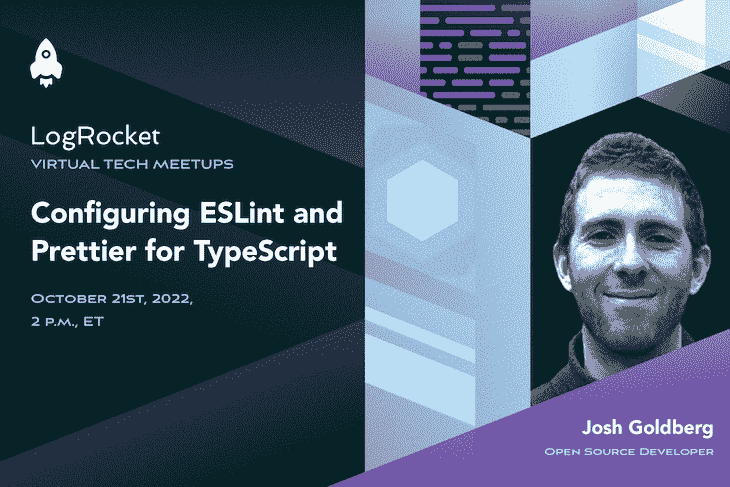

# 为 TypeScript 配置 ESLint 和 appellister

> 原文：<https://blog.logrocket.com/configuring-eslint-and-prettier-for-typescript/>

加入乔希·戈德堡

**October 21st at 2 p.m. EDT**

并了解如何为 TypeScript 编译配置 ESLint 和 Prettier。无论是格式化还是林挺，为一个现代的 TypeScript 项目设置过多的必备工具感觉像是一项永无止境的任务。在本次会议中，您将清楚地了解以下内容的用途和正确用法:

*   TypeScript:向代码中添加类型安全
*   更漂亮:应用和检查空白格式
*   ESLint: stylistic(非格式化！)代码规则

#### 您的主持人:

Josh Goldberg
Josh Goldberg 是一名作者、演讲者和 TypeScript 生态系统项目的开源维护者，如 Learning TypeScript、typescript-eslint 和 TypeStat。

#### 注册 meetup:

10 月 21 日|美国东部时间下午 2 点

之后要发送的录音

### 谢谢大家！

我们已经收到你的活动注册。