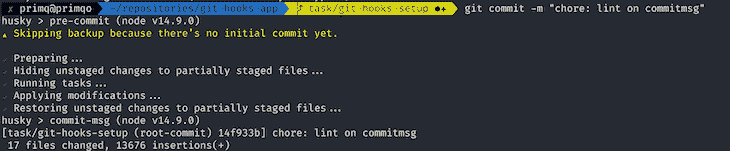

# 为 win 配置 Git 挂钩

> 原文：<https://blog.logrocket.com/configuring-git-hooks-for-the-win/>

拥有一个好的反馈回路对于开发者来说是极其重要的。正确配置的项目具有 CI/CD 管道，通过运行必要的检查(如静态代码分析和测试)来确保代码不会破坏应用程序逻辑或代码库本身中的任何内容。

这里的问题是，检查产生的错误只有在代码进入存储库后才能看到，可能是在打开一个 pull 请求之后。在看到失败的管道后，开发人员必须在本地修复代码，并再次将代码推送到存储库，这最终会消耗比实际需要更多的时间。

在管道上执行的许多检查可以在开发人员的计算机上本地运行。然而，没有一个理智的人会期望开发人员在每次要提交东西的时候执行一组命令。

相反，这个过程应该是自动化的，以便不中断开发人员的工作流程，并确保每个开发人员在他们的机器上运行相同的检查。

如果我们有某种机制可以在提交时通知我们，那么这个过程的自动化就很容易实现。令人欣慰的是，这种机制已经存在，并被称为 Git 挂钩。

## 什么是 Git 挂钩？

Git 挂钩是预先配置的定制脚本，在 Git 中执行一个动作之前执行。默认情况下，所有安装的钩子都在`.git/hooks`目录中，每个文件名都是一个钩子名。

有很多钩子，比如`post-merge`和`pre-rebase`，可以用来配置真正高级的设置。然而，在我们的例子中，我们只对`pre-commit`钩子感兴趣。所有可用的钩子都可以在这里找到[。](https://git-scm.com/docs/githooks#_hooks)

## 向项目添加 Git 挂钩

本教程的演示库可以在 GitHub 上找到[。](https://github.com/maciejcieslar/git-hooks)

### 强壮的

通过在`.git/hooks`目录中添加一个正确命名的文件，可以将钩子添加到项目中。然而，我们可以通过使用一个名为 [Husky](https://github.com/typicode/husky) 的库来自动化这个过程，而不是手动安装它们。

哈斯基将确保每次安装项目的依赖项时，挂钩都按照`package.json`配置进行正确配置。这样，开发人员就不必自己在机器上配置钩子了。

为了安装 Husky，请运行以下程序:

```
npm install --save-dev husky
```

然后将以下配置添加到`package.json`:

```
{
  // ...
  "husky": {
    "hooks": {
      "pre-commit": "<command>",
    }
  }
}
```

配置就绪后，Husky 将在每次提交时执行提供的`<command>`。

### 皮棉阶段

我们还将使用一个名为 [lint-staged](https://github.com/okonet/lint-staged) 的库，它让我们可以对 staged 文件执行命令。因此，举例来说，如果我们有一个包含数百或数千个文件的大项目，但只更改了一个小文件，那么对每个文件进行检查将是多余和耗时的。相反，只会检查已更改的文件。

```
npm install --save-dev lint-staged
```

并将`package.json`修改成这样:

```
{
  // ...
  "husky": {
    "hooks": {
      "pre-commit": "lint-staged"
    }
  },
  "lint-staged": {
    "*.ts": "<command>"
  }
}
```

所以现在我们已经配置了 Husky 在`pre-commit`钩子上运行`lint-staged`命令。

Lint-staged 配置支持 glob 模式作为键，因此，作为一个例子，我们提供了 glob 模式，通过使用`"*.ts"` glob 模式来匹配所有的 TypeScript 文件。

现在，在执行提交之前，Husky 将执行`lint-staged`命令，该命令将依次对所有 Typescript 文件执行指定的`<command>`。一旦它以一个肯定的结果结束，它将让提交通过。否则，它将失败，并将错误消息记录到控制台。

### lint-staged 是如何工作的？

假设我们有以下配置:

```
{
  // ...
  "husky": {
    "hooks": {
      "pre-commit": "lint-staged"
    }
  },
  "lint-staged": {
    "*.ts": "eslint"
  }
}
```

有人可能想知道 lint-staged 如何确保 ESLint 只在 staged 文件上运行，而配置只不过是`eslint`命令本身。

与许多其他 CLI 工具一样，ESLint 的调用格式如下:

```
eslint [options] [file|dir|glob]*
```

Lint-staged 假设所提供的命令期望在末尾有一个以空格分隔的绝对文件路径列表。因此，它采用暂存文件的所有绝对路径，并通过在末尾附加路径来执行命令。

因此，如果我们更改两个文件——`main.ts`和`app.ts`——lint-staged 将执行以下脚本:

```
eslint project/main.ts project/app.ts
```

假设两个文件都在根目录下，我们的项目名称是“`project`”。

这样，ESLint 或任何其他具有类似命令格式的工具不需要任何额外的配置就可以很好地与 lint-staged 一起工作。

### 将最流行的工具与 lint-staged 集成

在安装了必要的工具并理解了它们的工作原理之后，让我们添加三个最流行的工具，看看它们是如何与 lint-staged 集成的。

#### 运行棉绒机

从[代码风格指南](https://github.com/airbnb/javascript/tree/master/packages/eslint-config-airbnb)不一致到[安全问题](https://github.com/nodesecurity/eslint-plugin-security)，linter 是最有用的工具。最好在每次提交之前运行它，最后一次检查是否一切正常。JavaScript/Node.js 项目最流行的 linter 是 ESLint，所以让我们看看如何将它与 lint-staged 集成。

由于根据所使用的技术和语言，有许多方法可以将 ESLint 添加到项目中，所以我们不会关注如何安装 ESLint 本身。如果你想学习如何自己设置，请参考这篇[文章](https://eslint.org/docs/user-guide/getting-started)。

在上面的例子中使用了 ESLint，所以希望清楚如何将它添加到配置中。

* * *

### 更多来自 LogRocket 的精彩文章:

* * *

```
  "lint-staged": {
    "*.ts": [
      "eslint --fix",
    ]
  }
```

与上面的例子唯一不同的是，我们添加了`--fix`参数，允许 ESLint 在检查文件时自动修复它遇到的任何规则验证。如果无法修复，该命令将被中止。

注意，glob 模式现在接受一组命令；这样，我们可以在以后添加更多的命令。这些命令是按顺序执行的，所以最好先提供那些最有可能失败的命令。

#### 运行代码格式化程序

代码格式一致性的重要性怎么强调都不为过。它极其重要，所以把它配置成一个`pre-commit`钩子是个好主意。

如果你想在你的项目中设置得更漂亮，请参考这篇[文章](https://prettier.io/docs/en/install.html)。

有了更漂亮的配置，让我们把它加到钩子上。

```
  "lint-staged": {
    "*.ts": [
      "eslint --fix",
      "prettier --write"
    ]
  }
```

漂亮的命令非常类似于 ESLint 的行为。它接受要执行的文件列表。通过提供`--write`参数，我们可以确定 Prettier 将覆盖暂存文件中发现的任何不一致。

#### 运行测试

单元测试最好在每次提交之前运行。它们速度很快，不需要特殊设置。集成和端到端测试应该在专用的 CI/CD 管道上运行，因为它们需要预先设置特定的环境，并且通常需要很长时间来运行。

我们可以使用许多库来编写单元测试。这里，我们用 [Jest](https://jestjs.io/) 。这里有一篇关于如何配置 Jest 的[文章](https://jestjs.io/docs/en/getting-started)。

为了使 Jest 的命令与 lint-staged 集成，我们必须提供几个参数:

```
  "lint-staged": {
    "*.ts": [
      "npm run lint -- --cache",
      "jest --bail --passWithNoTests --findRelatedTests",
      "prettier --write"
    ]
  }

```

首先我们设置`--bail`参数，让 Jest 在发现错误后立即退出。

然后我们提供`--passWithNoTests`参数，因为一些提交可能实际上不包含与单元测试相关的变更。Jest 期望至少运行一个测试，否则它会抛出一个错误。

最后一个参数`--findRelatedTests`，是最重要的一个。它接受由 lint-staged 提供的以空格分隔的文件列表。因此，如果我们改变了`main.ts`文件，所有依赖于来自这个文件的代码的测试都将被执行。

请注意，`--findRelatedTests`参数必须是最后一个，因为 lint-staged 将在命令末尾提供暂存文件的路径。

还要注意，执行单元测试实际上是序列中第二个执行的命令，因为当我们不确定代码是否通过测试时，没有必要运行得更漂亮。

### 额外收获:验证提交消息

提交消息是对提交所包含的更改的描述。出于多种原因，让它们以统一的方式编写总是一个好主意，这些原因在这里[解释](https://www.conventionalcommits.org/en/v1.0.0-beta.2/#why-use-conventional-commits)。

有一个叫做[commit lit](https://github.com/conventional-changelog/commitlint)的工具可以帮我们完成所有繁重的工作；我们要做的就是把它集成到我们现有的设置中。

要安装该软件包，请运行:

```
npm install --save-dev @commitlint/config-conventional @commitlint/cli
```

安装完成后，创建一个名为`commitlint.config.js`的配置文件，内容如下:

```
module.exports = {
  extends: ['@commitlint/config-conventional']
};
```

这一次，我们将使用`commit-msg` Git 钩子。我们必须在我们的`package.json`文件中编辑 Husky 配置，就像这样:

```
{
  // ...  
  "husky": {
    "hooks": {
      "pre-commit": "lint-staged",
      "commit-msg": "commitlint -E HUSKY_GIT_PARAMS"
    }
  },
}
```

有许多[规则](https://github.com/conventional-changelog/commitlint/blob/master/docs/reference-rules.md)可供团队选择他们的提交消息模式。有了这个配置，每次我们提交东西时，提交的消息都会被验证。

### 测试设置

在设置好一切之后，我们可以提交我们的更改，看看是否一切都如预期的那样工作。



由于每次检查都是成功的，所以提交已经通过，现在可以推送到远程存储库了。

#### 跳过检查

无论出于什么原因，如果你需要跳过检查，有一个选项`--no-verify`可以做到这一点。一个例子:

```
git commit -m "Quick fix" --no-verify
```

## 结论

通过设置 Git 挂钩，我们可以确保推送到存储库的代码符合预期的标准。当然，有一种方法可以跳过所有本地运行的检查，所以当涉及到代码质量时，Git 钩子不能被依赖。它们不是 CI/CD 管道的替代品，而是一种在提交代码之前接收关于代码的反馈的方式，从而大大减少了修复发现的问题所需的时间。

## 使用 [LogRocket](https://lp.logrocket.com/blg/signup) 消除传统错误报告的干扰

[](https://lp.logrocket.com/blg/signup)

[LogRocket](https://lp.logrocket.com/blg/signup) 是一个数字体验分析解决方案，它可以保护您免受数百个假阳性错误警报的影响，只针对几个真正重要的项目。LogRocket 会告诉您应用程序中实际影响用户的最具影响力的 bug 和 UX 问题。

然后，使用具有深层技术遥测的会话重放来确切地查看用户看到了什么以及是什么导致了问题，就像你在他们身后看一样。

LogRocket 自动聚合客户端错误、JS 异常、前端性能指标和用户交互。然后 LogRocket 使用机器学习来告诉你哪些问题正在影响大多数用户，并提供你需要修复它的上下文。

关注重要的 bug—[今天就试试 LogRocket】。](https://lp.logrocket.com/blg/signup-issue-free)