# 为 Rust 开发配置 Vim

> 原文：<https://blog.logrocket.com/configuring-vim-rust-development/>

如果你和我一样，你是 Rust 的粉丝，喜欢使用根据你的需求量身定制的精益工具。这就是为什么我从一开始就用 [Vim](https://www.vim.org/) 作为 Rust 的主要编辑。

起初，Vim 的支持和工具稳定性并不十分理想。然而，在过去的几年里，这些工具已经成熟。随着语言服务器协议(LSP)的出现，大多数编程语言的 ide 和编辑器集成都有了很大的改进。有了一个标准化的协议，完全相同的工具现在可以用于所有不同的 ide 和编辑器，只需要在移动部分之间有一点点粘合代码。

在这篇文章中，我们将讨论如何为 Rust 开发配置 Vim。我们将坚持一个相当简单的设置，涵盖所有基础知识，并为您提供 [rust-analyzer](https://rust-analyzer.github.io/) 的强大功能，这是为编辑提供 IDE 支持的最广泛使用的、最先进的工具。

我们将首先看看我建议的一些插件作为基线，它们做什么，以及如何定制它们。然后，我们将创建一个示例配置，并测试我们在这个设置中实现的一些特性。

如果您已经是 Vim 用户，但还没有为 Rust 开发设置 Vim，您也可以在这里找到一些提示和技巧。至少，这篇文章将是构建你自己的定制的一个起点。

本指南适用于使用以下配置的 Vim8 和 NeoVim。至少以我的经验来看，你想做的任何定制或者你想添加的其他插件都可以在 NeoVim 上运行。然而，Vim8 可能有不同的配置选项——只需查看插件的文档，您通常会在那里找到您需要的东西。

首先，让我们先回顾一下我们将要使用的插件和工具。

### 铁锈分析仪

让我们来看看这个设置的核心部分:rust-analyzer。

rust-analyzer 本质上是 ide 的前端编译器。换句话说，它是一个 ide 和编辑器可以用来询问 Rust 代码信息的工具，也可以以自动化的方式与之交互。

rust-analyzer 实现了 LSP，并且从一开始就巩固了自己作为 rust 工具事实上的标准基线的地位。

除了智能自动完成，[它还提供了许多你可能从其他 ide 中了解到的其他高级特性](https://rust-analyzer.github.io/manual.html#features)，比如自动导入、转到定义、类型声明和实现、查找引用、树折叠、运行程序和运行测试，以及代码辅助。

虽然我个人很少使用 magic 功能，但我更喜欢直接控制我编写的代码。在使用`sed`进行批量更改时，我确信有很多人习惯了生活质量特性，并且会非常感激将它们添加到 rust-analyzer 中所做的大量工作。

你到底想用这些过剩的选项做什么取决于你自己。正如您将在下面看到的，您还将能够根据您的需要完全配置 rust-analyzer。

然而，从我个人的经验来看，即使没有任何配置或深入研究功能，rust-analyzer 和使用它的 Vim 插件默认提供了您需要的一切。

### rust.vim

rust.vim 提供了在 vim 中使用 rust 所需的最基本功能，比如语法高亮、格式化和文件检测。没什么好说的——这只是 GitHub 上 rust-lang 官方小组的默认 Rust 配置。这是一个非常好的基线和起点，所以如果您正在寻找一个绝对最小的设置，这可能就是它。

### coc.nvim

Completion 的征服，或 coc，本质上是一个 VS 代码风格的专门的完成插件。它提供了为不同语言加载扩展的可能性，然后这些语言可以与 LSP 服务器一起工作。

这是一个考虑到性能和灵活性的用户友好插件。我使用 coc 已经有一段时间了，并且非常满意。有一个丰富的生态系统，其中的[语言服务器插件](https://github.com/neoclide/coc.nvim/wiki/Language-servers#contents)可用于许多不同的语言，coc 使用户能够完全定制补全应该如何工作。

### COC-铁锈分析仪

[coc-rust-analyzer](https://github.com/fannheyward/coc-rust-analyzer) 本质上是前面提到的从我们的 LSP 工具(rust-analyzer)到 coc 的桥梁。这是一个官方支持的 coc 插件，您可以在 Vim 中使用以下代码安装它:

```
:CocInstall coc-rust-analyzer
```

这将下载并安装最新的 rust-analyzer 二进制文件，并为您将一切连接起来。

在将来编辑 Rust 文件时，如果有新版本的 rust-analyzer 可用，系统会询问您是否要安装更新:

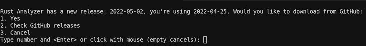

有几个配置选项，您可以在`$HOME/.config/nvim/coc-settings.json`中进行编辑(您也可以通过在 Vim 中执行`:CocConfig`来访问该文件)。

我个人觉得没有必要改变太多的配置。由于有相当多的选项，特别是当涉及到定制完成如何工作和显示时，可能值得检查一下可能的配置的[列表。](https://github.com/fannheyward/coc-rust-analyzer#configurations)

您选择的选项直接映射到 rust-analyzer 上，甚至包括定制货物等功能。

### 麦芽酒

ALE 本身就是一个非常强大的插件。如果你愿意，你可以试着用 ALE 作为一个主插件来统治他们！由于 ALE 能够与 rust-analyzer 等 LSP 工具进行通信，因此它可以处理语法检查、自动修复文件、自动完成，甚至一些与代码相关的功能。

就个人而言，我不太喜欢庞大的单一工具解决方案。然而，ALE 的异步语法检查非常棒，我已经在几种不同的语言中使用了一段时间，包括 Rust。我用它来实现特定的功能，并可以选择为其他插件缺乏特定功能的语言启用其他功能。

无论如何，如果你是 Vim 用户并且没有听说过 ALE，一定要去看看！如果你正在考虑转而使用 Vim 进行一些编码，ALE 可能会给你很多东西，而不需要配置任何东西。它与其他广泛使用的插件和 LSP 服务器集成得非常好。

## Vim 中的配置示例

在这个配置中，我将使用 [vim-plug](https://github.com/junegunn/vim-plug) ，但是您可以使用您喜欢的任何一个。大多数插件包括安装字符串和所有广泛使用的指南。对于这一个，简单地遵循 vim-plug 的[安装说明](https://github.com/junegunn/vim-plug#installation)。

```
set nocompatible
filetype off
set encoding=utf-8

call plug#begin('~/.vim/plugged')

Plug 'rust-lang/rust.vim'
Plug 'neoclide/coc.nvim', {'branch': 'release'}
Plug 'dense-analysis/ale'

call plug#end()

let g:rustfmt_autosave = 1
let g:rustfmt_emit_files = 1
let g:rustfmt_fail_silently = 0

inoremap <silent><expr> <TAB>
      \ pumvisible() ? "\<C-n>" :
      \ <SID>check_back_space() ? "\<TAB>" :
      \ coc#refresh()
inoremap <expr><S-TAB> pumvisible() ? "\<C-p>" : "\<C-h>"

function! s:check_back_space() abort
  let col = col('.') - 1
  return !col || getline('.')[col - 1]  =~# '\s'
endfunction

if has('nvim')
  inoremap <silent><expr> <c-space> coc#refresh()
else
  inoremap <silent><expr> <[email protected]> coc#refresh()
endif

nmap <silent> gd <Plug>(coc-definition)
nmap <silent> gy <Plug>(coc-type-definition)
nmap <silent> gi <Plug>(coc-implementation)
nmap <silent> gr <Plug>(coc-references)

```

这个最小配置只是在我们的 vim-plug 开始/结束调用的顶部添加插件。

然后，我们配置我们的自动`rustfmt`设置。这很好，因为它会在保存时自动将`rustfmt`应用到你的文件中。您所有的文件将总是基于您的`rustfmt`配置或默认设置被正确格式化。

下面是来自 [coc 示例 vim 配置](https://github.com/neoclide/coc.nvim/#example-vim-configuration)的一些配置。

这些基本上是关于自动完成的配置，以及不同的键绑定，如`Control + Space`、`Tab`或`Control + N`，如何与您的完成菜单一起工作。这里我就不赘述了，因为我只是简单地使用了 coc 提供的默认设置。

在那下面，你可以看到一些定义调用之类的绑定。好的一面是，这些绑定可以在任何使用 coc 的语言中工作(只要该语言的 LSP 插件支持它)。

* * *

### 更多来自 LogRocket 的精彩文章:

* * *

如果你想认真尝试一下 coc，我建议你从他们的示例配置开始。之后，您可以删除不需要的东西，添加插件、定制和其他配置。

当使用这种配置启动 Vim 时，首先需要执行以下命令:

```
:PlugInstall

```

如果您使用不同的插件管理器，请使用任何一个安装命令(或者手动下载并安装所有插件)。

另外，如上所述，不要忘记在 Vim 中执行以下命令来安装 rust-analyzer plugin for coc:

```
:CocInstall coc-rust-analyzer

```

反正我们的最低配置到此为止！让我们看看它是做什么的，接下来会是什么样子。

此外，如果你对我的具体设置感兴趣，可以在我的点文件库中随意查看我的 Vim 配置。作为免责声明，我经常修改它，而且除了 Rust 之外，我还在很多地方使用 Vim，所以可能会有一些无用的东西。

### 评估我们的示例配置

首先，让我们看看一个简单的代码文件以及语法突出显示是如何工作的:

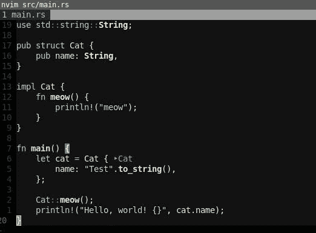

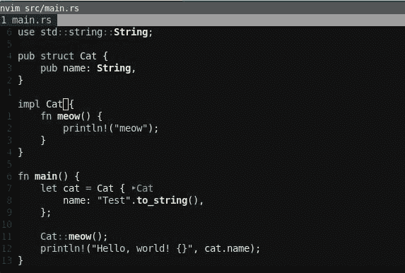

如您所见，rust.vim 为我们提供了漂亮、易读的默认高亮显示。另外，注意结构体初始化旁边的`>Cat`。这是 rust-analyzer，它为我们的`Cat`型号提供了一个提示。显然，这对于推断类型更有用，但这就是它看起来的样子。

让我们来看看一些自动完成功能:

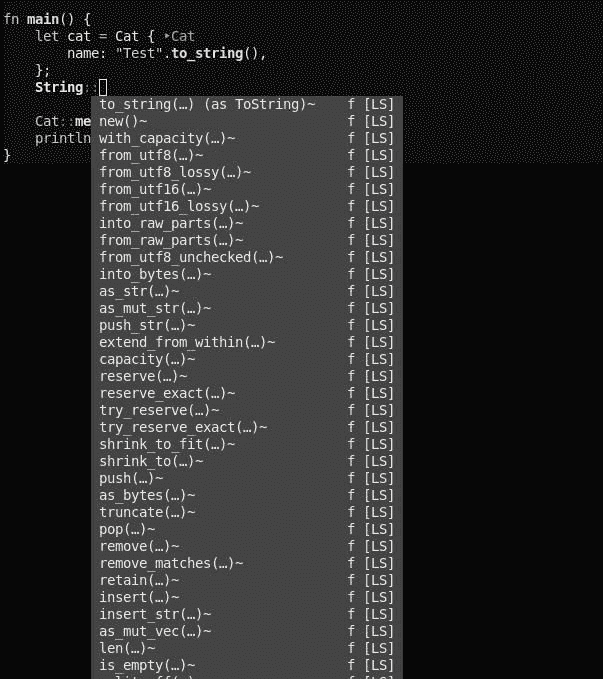

Autocomplete `string::`.

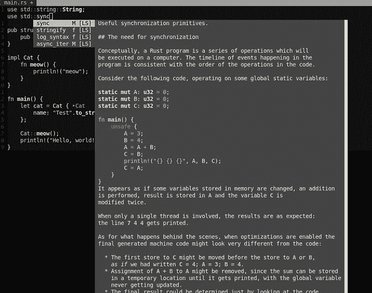

Autocomplete `std::sync::`.


Autocomplete `println!` macro.

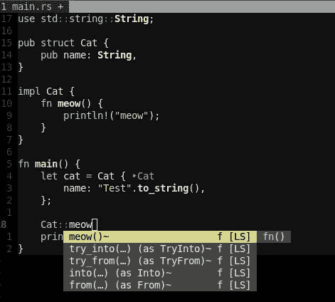

Autocomplete function names.

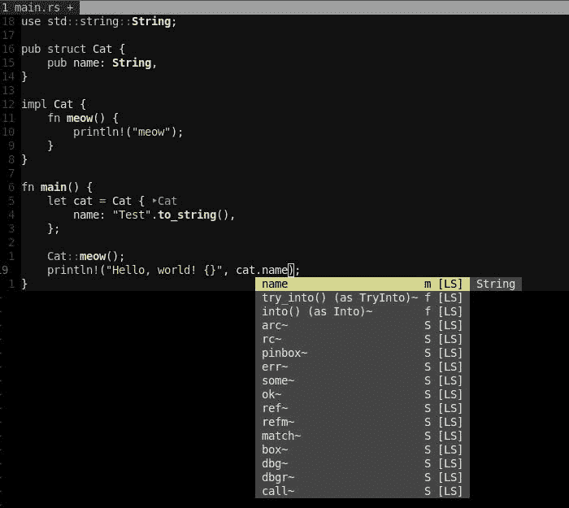

Autocomplete members.

上面，您可以看到关于导入、宏、函数名、结构成员和静态函数的自动完成示例。如上所述，这个覆盖图和显示的信息可以根据您的需要进行大量定制。不过，我的设置基本上是默认的。

让我们看看 rust-analyzer 如何显示错误和警告以及 ALE:

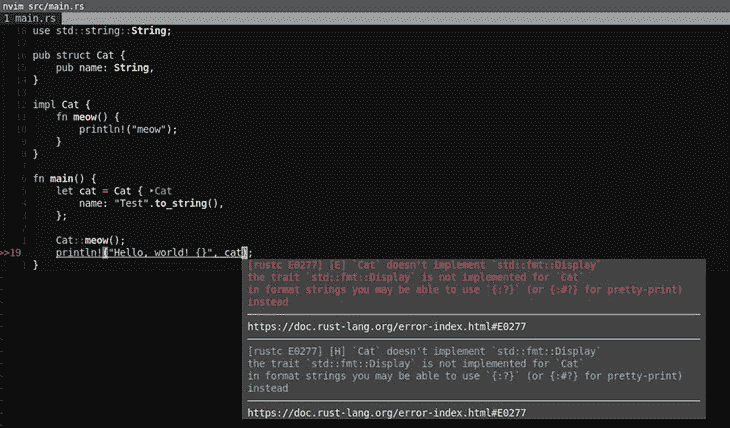

An error.

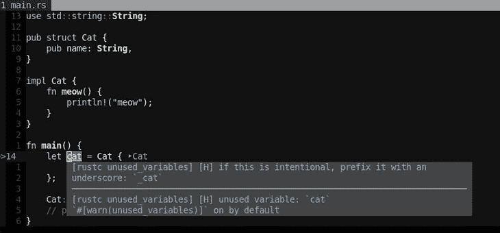

A warning.

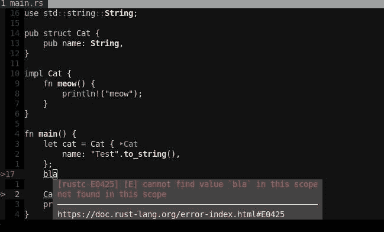

Another error.

而且，如上所述，我们可以在保存时检查自动`rustfmt`:

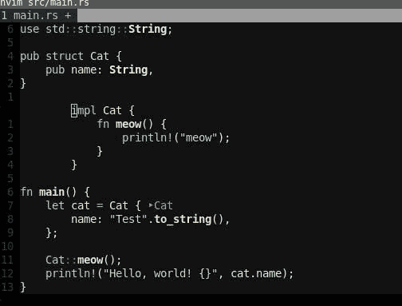

Create invalid formatting.

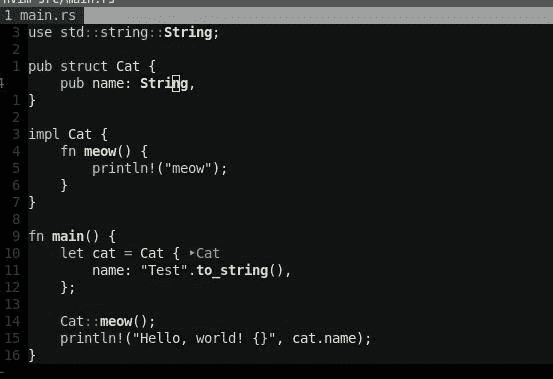

Save the file using `:w` and set it to automatically reformat correctly.

同样，如果我们的光标在`String`上面，就像上面的截图一样，我们可以使用 go to definition 绑定来跳转到 Rust source 中的`String`的定义:

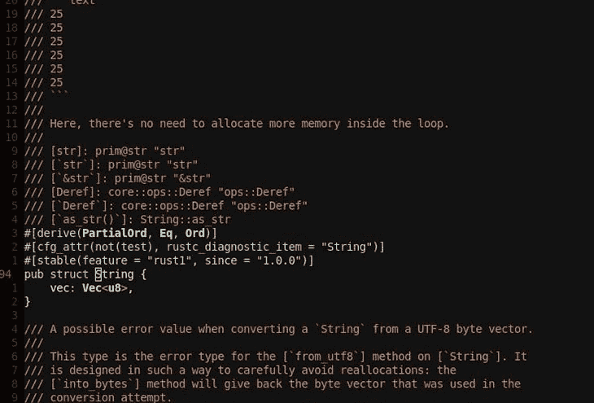

String in the Rust source.

这也适用于我们自己的定制类型。另一个很好的东西是`Find References`函数，它向我们显示了某种类型的所有引用:

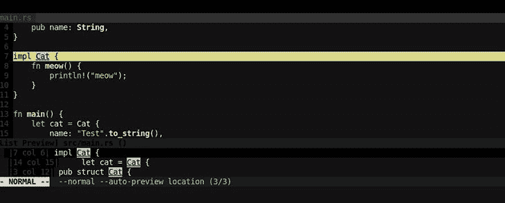

All references of type Cat.

相当不错！所有这些都只需要很少的配置和很少的插件。

## 结论

如您所见，Vim 是一个高效编辑 Rust 代码的精简、健壮的设置。它允许我们在没有缓慢的 UI 或高资源使用率的情况下启用花哨的 IDE 特性。

正如文章中提到的，这只是创建这种设置的一种可能方式。Vim，凭借其完全无限的生态系统，使积极的用户能够根据自己的喜好定制一切。

然而，并不是每个人都喜欢花几个小时摆弄他们的工具。幸运的是，本文中使用的工具的默认配置开箱即用，对于许多其他选项也是如此。在大多数情况下，相关的插件都有很好的文档，如果你想实现更复杂的东西，可以参考一些社区。

## [log rocket](https://lp.logrocket.com/blg/rust-signup):Rust 应用的 web 前端的全面可见性

调试 Rust 应用程序可能很困难，尤其是当用户遇到难以重现的问题时。如果您对监控和跟踪 Rust 应用程序的性能、自动显示错误、跟踪缓慢的网络请求和加载时间感兴趣，

[try LogRocket](https://lp.logrocket.com/blg/rust-signup)

.

[](https://lp.logrocket.com/blg/rust-signup)

LogRocket 就像是网络和移动应用程序的 DVR，记录你的 Rust 应用程序上发生的一切。您可以汇总并报告问题发生时应用程序的状态，而不是猜测问题发生的原因。LogRocket 还可以监控应用的性能，报告客户端 CPU 负载、客户端内存使用等指标。

现代化调试 Rust 应用的方式— [开始免费监控](https://lp.logrocket.com/blg/rust-signup)。