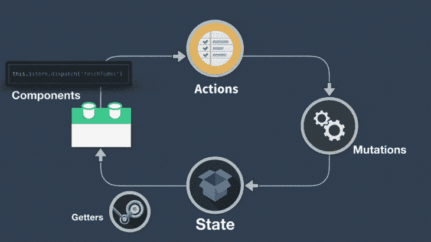
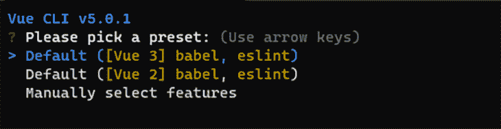
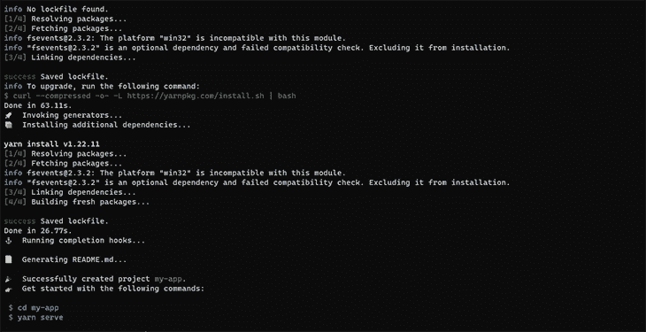
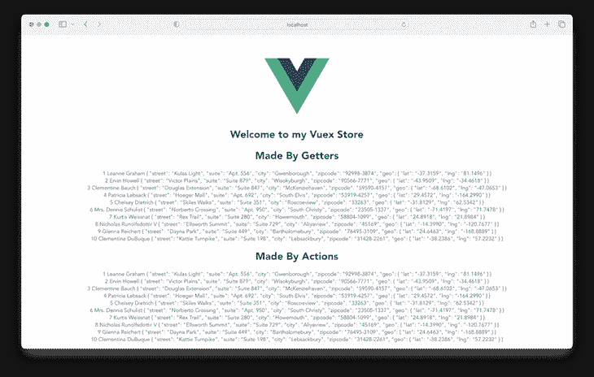

# 如何使用 Vuex、Pinia 和 Axios 使用 API

> 原文：<https://blog.logrocket.com/consume-apis-vuex-pinia-axios/>

***编者按:*** *本帖最后一次更新于 2022 年 11 月 2 日，增加了关于用 Vuex 和 Axios 消费 API 的信息，并根据 Vuex 的最新版本(v5，撰写时)回答了关于使用 Pinia 和 Vuex 的热门搜索查询。*

应用程序编程接口(API)是一组用于访问应用程序的编程标准。这意味着有了 API，你的后端和前端应用程序可以在用户不知情的情况下互相通信。

“使用”API 意味着通过 API 接收请求和发送响应。在本文中，您将了解如何使用 Vuex、Pinia 和 Axios 从服务器消费 API。我们将涵盖以下部分:

## 将 Axios 与 Vue 配合使用

有些框架，比如 Angular、JQuery、 [Vue.js](https://vuejs.org/) 的 1.0 版本，自带了内置的 HTTP APIs。从 Vue 2.0 开始，开发者已经决定内置的 HTTP 客户端模块， [Vue-resource](https://github.com/pagekit/vue-resource) 不再是必不可少的，可以被第三方库取代。现在最推荐的库是 [Axios](https://github.com/axios/axios) 。

Axios 是一个灵活的 HTTP 客户端库，默认情况下使用 promises，同时在客户端和服务器端运行，这使得它适合在服务器端呈现期间获取数据。用 Vue.js 很好用。

## 了解状态管理如何工作

状态管理是一种设计模式的实现，用于管理将在给定应用程序的各个组件之间共享的数据，这有助于确保呈现给用户的数据的一致性。

在 Vue.js 单页应用程序(SPA)中，在将数据发送回服务器之前，多个组件可以在任何给定的时间与数据交互并更改数据。因此，开发人员需要一种方法来管理这些变化——“状态”——这可以通过状态管理库来完成，如 [Vuex 或 Pinia](https://blog.logrocket.com/pinia-vs-vuex/) 。

状态管理库允许你从组件中提取共享状态，在一个全局单例中管理它，或者提供组件对状态的访问，或者触发动作，不管它们在树中的什么位置。

### 何时使用状态管理库

如果你从来没有建过大规模的 SPA，用库来进行状态管理可能会觉得太复杂，没必要。但是，如果您正在构建一个中型到大型的 SPA，那么您可能会遇到这样的情况，即您必须再三考虑如何更好地处理和共享组件之间的状态。如果是这样，Vuex 或 Pinia 就是适合你的工具！

**为什么应该使用状态管理库**
通常，在以下情况下，您会希望使用库来管理状态:

*   您的组件需要共享和更新状态
*   它们为数据/状态提供了单一的真实来源
*   有了状态管理，就不需要将事件从一个组件传递到多个组件
*   全局状态是反应性的，这意味着改变状态允许它在使用它的每个其他组件中被更新

## 什么是 Vuex？

对于深度嵌套的组件来说，传递属性可能很困难，甚至几乎不可能。使用对父/子实例的直接引用，或者试图通过事件改变和同步状态的多个副本，这可能很有诱惑力。但是这两个选项都不推荐，因为它们可能会产生不可维护的代码和错误。

Vuex 是 Vue.js 应用程序的状态管理模式和库。它充当应用程序中所有组件的集中存储:



## 皮尼亚是什么？

与 Vuex 类似， [Pinia](https://blog.logrocket.com/complex-vue-3-state-management-pinia/) 是另一个设计用于 Vue 框架的状态管理库。Pinia 的一些基本概念和原则与 Vuex 的非常相似，只有几个概念区分了这些库，例如开箱即用的模块化和语法上的微小差异。有了足够的 Vuex 知识，如果你刚刚开始，学习使用 Pinia 应该是一件容易的事情。

事实上，Pinia 现在被认为是 Vuex 5，是推荐给 Vue 应用的默认状态管理库。然而，这并不意味着不再支持 Vuex。此外，尽管设计时考虑了组合 API 和 Vue 3，但 Pinia 与 Vue 2 和 Vue 3 都兼容，不管您打算使用组合 API 还是选项 API。

## pinia 诉 Vuex 案

Vuex 的一个主要缺点是创建动作和突变的复杂性和重复性；例如，当处理大规模应用程序时，您需要创建触发突变的动作，这变成了一个费力且重复的过程。Pinia 受到这种 Vuex 限制的启发，这种限制通常会消除突变，同时也为全局状态管理提供了一种更加模块化的方式。

## 用 Axios 建立一个新的 Vue 项目

对于本教程，我们将使用最新的默认 Vue 版本 3.0 和复合 API。如果您尚未安装 Vue CLI，请在您的终端中运行以下命令:

```
npm install -g @vue/cli

```

要查看您的系统上是否已经安装了 Vue CLI，请执行以下代码。如果已经安装了 Vue，应该会出现 Vue CLI 版本:

```
vue --version
// 5.0.1

```

现在，通过在终端中运行以下代码来创建一个 Vue 项目:

```
vue create my-app

```

接下来，您将收到选择 Vue 版本的提示。选择 Vue 3:



一旦我们的应用程序准备就绪，按照命令进入应用程序目录并启动服务器:



然后，您可以安装和设置 Axios，我们将使用以下代码从 API 获取数据:

```
yarn add axios
# OR
npm install axios

```

## 安装并设置 Vuex 商店

使用以下代码安装和设置 Vuex:

```
yarn add vuex
# OR
npm install vuex

```

接下来，在您的`src`文件夹中创建一个文件夹，并将其命名为`store`。在您的`store`文件夹中，创建一个新的`index.js`，这样您的项目文件夹将具有类似于下面的结构:

```
├── index.html
└── src
    ├── components
    ├── App.vue
    └──store
       └── index.js        # where we assemble modules and export the store

```

接下来，在您的`store/index.js`文件中，输入以下代码:

```
//import the createStore object from Vuex
import { createStore } from 'vuex'
// Import axios to make HTTP requests
import axios from "axios"
export default createStore({
    state: {},
    getters: {},
    actions: {},
    mutations: {}
})
/** we have just created a boiler plate for our vuex store module**/

```

通过更新您的`main.js`文件来注册您的商店，以匹配以下内容:

```
import { createApp } from "vue";
import App from "./App.vue";
import store from "./store";

createApp(App).use(store).mount("#app");

```

## 使用 Vuex 和 Axios 使用 API

在我们继续之前，如果您想进一步了解 Vuex 中的动作、突变和 getters，我建议查看 LogRocket 关于这个主题的非常简洁的文章。

为了正确理解如何使用 Vuex 动作、状态、突变和 getters 创建 Vuex 存储和使用 Axios 的 API，我们将创建一个简单的 Vuex 应用程序，它从我们的假 JSON 后端获取用户信息并填充我们的模板。要继续，用以下代码更新`store/index.js`文件:

```
// store/index.js

import { createStore } from "vuex";
import axios from "axios";
export default createStore({
  state: {
    users: [],
  },
  getters: {
    getUsers: (state) => state.users,
  },
  actions: {
    async fetchUsers({ commit }) {
      try {
        const data = await axios.get(
          "https://jsonplaceholder.typicode.com/users"
        );
        commit("SET_USERS", data.data);
      } catch (error) {
        alert(error);
        console.log(error);
      }
    },
  },
  mutations: {
    SET_USERS(state, users) {
      state.users = users;
    },
  },
});

```

我们使用 async/await 格式从端点获取数据，并使用 Axios 发出 HTTP 请求。

我们将向`actions`对象内部的 API 表单发出请求。在`try`块中，我们将一个`data`变量赋给我们的 HTTP 请求。当返回一个响应时，提交一个变异，更新应用程序的状态。

我们还可以在控制台的`catch`块中警告错误或记录错误。

在您的`HelloWorld.vue`文件中，粘贴以下代码:

```
<template>
  <div class="hello">
    <h1>{{ msg }}</h1>
    <h1>Made By Getters</h1>
    <div v-for="user in getUsers" :key="user.id">
      {{ user.id }} {{ user.name }} {{ user.address }}
    </div>
    <h1>Made By Actions</h1>
    <div v-for="user in users" :key="user.id">
      {{ user.id }} {{ user.name }} {{ user.address }}
    </div>
  </div>
</template>

<script setup>
import { ref, onMounted, computed } from "vue";
import { useStore } from "vuex";
const store = useStore();
const msg = ref("Welcome to my Vuex Store");
const getUsers = computed(() => {
  return store.getters.getUsers;
});
const users = computed(() => {
  return store.state.users;
});
onMounted(() => {
  store.dispatch("fetchUsers");
});
</script>

```

在您的浏览器上导航回`localhost:8080`，查看我们所做的更改:



## 安装和设置 Pinia 商店

要安装和设置 Pinia，请遵循以下步骤:

```
yarn add pinia
# OR
npm install pinia

```

接下来，将 Pinia 导入到应用程序的根文件`main.js`中，并将其实例化如下:

```
import { createApp } from 'vue'
import App from './App.vue'

//Import Pinia into your config file
import { createPinia } from 'pinia'

createApp(App)
//Add the line below to the file to instantiate it
.use(createPinia())
.mount('#app')

```

接下来，在`src`文件夹的根目录下创建一个`stores`文件夹，并添加一个名为`users.js`的文件。

```
// stores/users.js
import { defineStore } from 'pinia'
// Import axios to make HTTP requests
import axios from "axios"

export const useUserStore = defineStore("user",{
    state: () => ({}),
    getters: {},
    actions: {},
})

```

我们已经成功建立了我们的 Vuex 和 Pinia 商店！现在，让我们使用我们的存储从 API 获取数据来填充我们的模板。

## 使用 Pinia 和 Axios 消费 API

我们将使用 Pinia 和 Axios 复制 Vuex 示例中的输出。用下面的代码更新我们之前创建的`users.js`文件:

```
//stores/users.js

import { defineStore } from 'pinia'
// Import axios to make HTTP requests
import axios from "axios"
export const useUserStore = defineStore("user", {
    state: () => ({
        users: [],
    }),
    getters: {
      getUsers(state){
          return state.users
        }
    },
    actions: {
      async fetchUsers() {
        try {
          const data = await axios.get('https://jsonplaceholder.typicode.com/users')
            this.users = data.data
          }
          catch (error) {
            alert(error)
            console.log(error)
        }
      }
    },
})

```

将`HelloWorld.vue`文件中的代码替换为:

```
<template>
  <div class="hello">
    <h1>{{ msg }}</h1>
    <h1>Made By Getters</h1>
    <div v-for="user in getUsers" :key="user.id">
      {{ user.id }} {{ user.name }} {{ user.address }}
    </div>
    <h1>Made By Actions</h1>
    <div v-for="user in users" :key="user.id">
      {{ user.id }} {{ user.name }} {{ user.address }}
    </div>
  </div>
</template>

<script setup>
import { ref, onMounted, computed } from "vue";
import { useUserStore } from "../store/users";
const store = useUserStore();
const msg = ref("Welcome to my Vuex Store");
const getUsers = computed(() => {
  return store.getUsers;
});
const users = computed(() => {
  return store.users;
});
onMounted(() => {
  store.fetchUsers();
});
</script>

```

在 Pinia，商店默认是模块化的。对于每个创建的商店，我们需要将它导入到要使用的组件中。因此，我们导入了我们的`useUserStore`并将其赋给了`store`变量，这样就可以在整个组件中轻松地访问它。

与 Vuex 中的`store.dispatch("fetchUsers")`方法不同，在 Pinia 中，动作被视为一个函数，可以使用`store.fetchUsers()`方法从声明的`store`变量中访问。

## 不同的 Vuex 商店结构

下面是最简单的 Vuex 存储结构，其中动作、getters、状态和突变在`index.js file`中被调用和导出。

***NB*** : Pinia 是开箱即用的模块化产品，因此这些 Vuex 示例可能不适用:

```
├── index.html
└── src
    ├── components
    ├── App.vue
    └──store
       └── index.js         # where we assemble modules and export the store

```

随着您的应用程序变得越来越大，您可能需要将您的操作、变异、getters 和状态模块分离到它们自己的不同文件中:

```
├── index.html
└── src
    ├── components
    ├── App.vue
    └──store
       ├── index.js        # where we assemble modules and export the
       ├── actions.js      # root actions
       ├── mutations.js    # root mutation
       ├── getters.js      # root getters
       └── state

```

应用程序中的所有状态都包含在一个大对象中，因为我们使用的是单个状态树。这并不理想，因为我们的应用程序随着我们的动作、突变和状态变得更大而增长，使得存储变得更大成为可能，以至于我们可能无法跟上它。

* * *

### 更多来自 LogRocket 的精彩文章:

* * *

一个很好的解决方案是将我们的商店分成模块。每个模块都可以包含自己的状态、突变、动作和 getter——它们甚至可以包含嵌套模块，为可伸缩性提供了更多的选择:

```
├── index.html
├── main.js
├── api
│   └── ... # abstractions for making API requests
├── components
│   ├── App.vue
│   └── ...
└── store
    ├── index.js          # where we assemble modules and export the store
    ├── actions.js        # root actions
    ├── mutations.js      # root mutations
    └── modules
        ├── cart.js       # cart module
        └── products.js

```

## 常见问题

### 皮尼亚会取代 Vuex 吗？

Pinia 被认为是 Vuex5 的替代品，现在是 Vue 应用程序的推荐状态管理库。然而，这并不意味着旧版本的 Vuex 不能正常工作。

### 我可以一起使用 Pinia 和 Vuex 吗？

可以在同一个应用中使用 Vuex 和 Pinia 但是，不建议这样做，因为最好坚持使用单一的状态管理库。使用多个可能会导致性能问题。

根据我们之前的配置，以下是如何在 entry `main.js`文件中初始化 Pinia 和 Vuex 存储:

```
import { createApp } from "vue";
import App from "./App.vue";

import store from "./store";
import { createPinia } from "pinia";

createApp(App).use(createPinia()).use(store).mount("#app");

```

然后，您可以像我们之前所做的那样，继续在您的组件中使用存储。

## 结论

在本教程中，我们已经了解了什么是状态管理，以及为什么需要像 Vuex/Pinia 这样的库来处理 Vue 应用程序的状态。

此外，我们创建了一个简单的 Vue 应用程序来演示 Vuex/Pinia，并学习了不同的商店结构，以便您可以决定哪一个最适合您的应用程序。

## 像用户一样体验您的 Vue 应用

调试 Vue.js 应用程序可能会很困难，尤其是当用户会话期间有几十个(如果不是几百个)突变时。如果您对监视和跟踪生产中所有用户的 Vue 突变感兴趣，

[try LogRocket](https://lp.logrocket.com/blg/vue-signup)

.

[](https://lp.logrocket.com/blg/vue-signup)[https://logrocket.com/signup/](https://lp.logrocket.com/blg/vue-signup)

LogRocket 就像是网络和移动应用程序的 DVR，记录你的 Vue 应用程序中发生的一切，包括网络请求、JavaScript 错误、性能问题等等。您可以汇总并报告问题发生时应用程序的状态，而不是猜测问题发生的原因。

LogRocket Vuex 插件将 Vuex 突变记录到 LogRocket 控制台，为您提供导致错误的环境，以及出现问题时应用程序的状态。

现代化您调试 Vue 应用的方式- [开始免费监控](https://lp.logrocket.com/blg/vue-signup)。