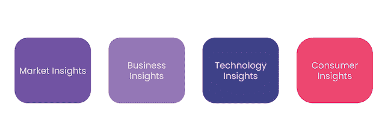
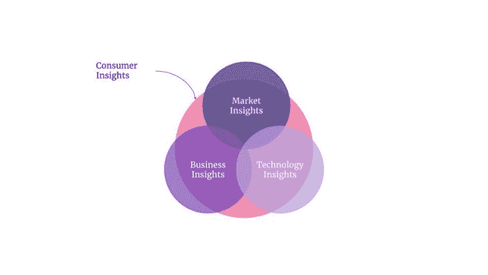
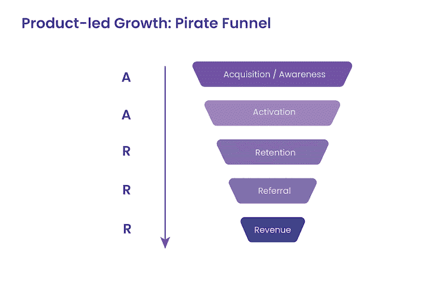
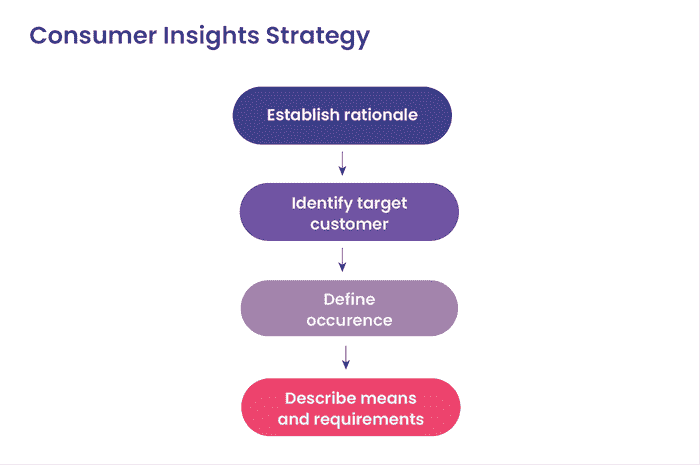

# 什么是消费者洞察以及如何使用它们(举例)

> 原文：<https://blog.logrocket.com/product-management/consumer-insights-how-to-use-examples/>

认识一下 Milla，她是一个平台的联合创始人兼首席产品官(CPO ),该平台旨在革新餐厅预订体验。

基于她的[竞争分析](https://blog.logrocket.com/product-management/what-is-competitive-analysis-template-examples-tutorial/)，米拉有了一个新功能的想法，她希望将现有客户转化为该产品的拥护者。她希望新用户的注入能够帮助她实现年度增长目标。

开发和发布过程虽然漫长而乏味，却完美无缺。但是一个月后，她的所有产品指标都朝着错误的方向发展。

米拉想知道她本可以做些什么。还有办法让这部电影成功吗？

如果你已经站在米拉的立场上，请继续阅读，获得一份全面的指南，了解消费者洞察的奇妙世界。

* * *

## 目录

* * *

## 什么是消费者洞察？

上面描述的例子是一个典型的例子，许多初创公司和公司都可以联系到这个例子:理解和验证消费者的需求和愿望是一个面向未来的功能成功的关键，但这一任务经常被忽视。

你的产品的成功取决于它如何通过出色的客户体验来满足客户的需求。这就是为什么作为产品经理，拥有客户驱动的思维模式是至关重要的。

你需要从客户数据、行为和反馈(也称为消费者或客户洞察)中理解、解释并得出可以进一步改进产品的结论。

## 消费者洞察在产品管理中的位置？

作为一名产品经理，你需要不断地寻找使产品符合客户需求的方法。

洞察力是实现这一目标的关键。有四个洞察类别来评估这些客户需求的合意性、可行性和可行性:

### 市场洞察

市场洞察力是通过市场研究获得的。他们帮助你了解市场潜力以及如何进入市场以获得竞争优势。

市场洞察旨在回答以下问题:

*   潜在市场有多大？
*   目前市场上有哪些参与者？
*   他们表现如何？
*   入市有多容易？
*   市场的趋势是什么？

### 商业洞察力

尽管这一步涉及到对主要竞争对手的评估，但业务洞察力更侧重于内部。它们旨在阐明公司追求的目标、实现目标的能力以及如何进一步改进。

业务洞察旨在回答以下问题:

*   公司的愿景、使命和关键目标是什么？
*   主要的成本驱动因素是什么？
*   主要的利润驱动力是什么？
*   为哪些客户群提供服务？
*   该公司在市场上的表现如何？

### 技术洞察

技术洞察也是内部关注的焦点，提供关于公司技术堆栈和交付方法的信息。

技术洞察旨在回答以下问题:

*   使用的是哪种技术？
*   路线图是如何管理的？
*   如何管理实验和发现？
*   如何实现持续改进和创新？
*   使用了哪些交付方法？
*   交付和产品生命周期的有效性如何？

### 消费者洞察

消费者洞察使您能够做出以消费者为导向的决策。他们帮助你了解消费者的需求和行为。

消费者洞察旨在回答以下问题:

*   谁是消费者，他们的特征是什么？
*   他们的需求是什么？
*   是什么促使他们采取行动？
*   他们使用哪些渠道？

您可能已经注意到，消费者洞察在所有洞察类别中都扮演着重要角色。可见钉钉你的消费策略的重要性。

但在此之前，让我先告诉你为什么你现在需要进入消费者洞察游戏。

## 消费者洞察的好处是什么？

现在，这听起来像是一项巨大的投资，以不断参与和收集消费者的见解。那么，收集、分析和评估消费者洞察有什么好处呢？

简而言之，消费者洞察有助于巩固您的客户导向型增长战略，并优化您的端到端客户体验。

收集消费者见解的主要好处包括:

1.  降低客户获取成本
2.  增加新客户的目标和销售
3.  减少客户流失
4.  增加对现有客户的追加销售
5.  提高客户忠诚度
6.  提高营销投资回报

所有这些好处都提高了客户的终身价值(CLV)、收入和利润。这就是为什么消费者驱动的决策和跟随客户的心态对任何公司的成功都至关重要。

## 消费者洞察如何推动产品增长

为了理解消费者洞察的真正力量，我们需要看看消费者洞察在产品管理流程中的应用。

* * *

订阅我们的产品管理简讯
将此类文章发送到您的收件箱

* * *

让我们来看看戴夫·麦克卢尔开发的《海盗漏斗》。海盗漏斗拼出 AARRR。海盗漏斗之所以如此命名，是因为它的组成部分在被记忆时拼出 Aarrr，这在发音时听起来像海盗在喊(例如，“AARRR，matey！”).

AARRR 代表认知/获得、激活、保留、收入和推荐。它旨在通过跟踪用户行为、收集用户数据、分析和评估数据来影响所有步骤中的行为，从而帮助实现业务增长:

让我们更详细地探索海盗漏斗的每个阶段:

### 获得/认知

数据洞察是漏斗的第一步，围绕理解消费者如何发现和评估产品展开。他们用什么标准来寻找一个产品，他们如何评估几个产品？在定义人物角色和创建客户旅程图时，您将获得许多这些见解。

### 激活

激活中的数据洞察提供了关于消费者在产品中采取的行动的信息，以及您如何影响他们采取您希望他们采取的行动。

### 保留

[保持度](https://blog.logrocket.com/product-management/what-is-customer-retention-rate-how-to-calculate/)是关于理解消费者与产品和特定功能互动的原因、方式和频率。这也是关于理解消费者流失的原因以及如何防止他们流失。

### 收入

为什么你的消费者愿意为你的产品付费，当产品可用时，他们愿意为什么功能付费，为了不流失，他们需要什么样的可用性改进？从消费者洞察的角度来看，收入完全是为了增加消费者的终身价值。

### 介绍

消费者是否非常喜欢该产品，以至于主动告诉他人？怎样才能让他们成为产品的积极倡导者/拥护者？

以上要求你通过销售、使用事件跟踪、消费者调查、访谈、焦点小组等收集大量的消费者数据。你不仅要关注自己的产品，还要关注消费者对你在这些领域的主要竞争对手的评价。

如果你还没有弄清楚谁是你的竞争对手，进行一次[竞争分析](https://blog.logrocket.com/product-management/what-is-competitive-analysis-template-examples-tutorial/)，并以此为起点。

## 如何创建消费者洞察战略

你希望进行消费者研究是一个一致的、可重复的过程，以确保它能为你提供运行一个成功的产品所需的所有见解。你需要的是消费者洞察策略。

创建消费者洞察战略的框架包括四个步骤:

1.  [建立基本原理](#establish-the-rationale)
2.  [确定谁是你的客户](#identify-who-your-customer-is)
3.  [确定你想获得洞察力的时间](#establish-when-you-want-to-acquire-insights)
4.  [描述你想收集哪些见解](#describe-what-insights-you-want-to-collect)

### 建立基本原理

首先描述你的产品想要达到的目标，以及消费者洞察如何帮助你实现这个目标。换句话说，你为什么需要消费者的洞察力？

有了清晰的认识，你就可以确定所需的消费者洞察类型，以及如何实现消费者洞察战略。

### 确定谁是你的客户

明显队长再次罢工(漫威，你在读这封信吗？这是一个免费的数百万美元的电影名称的想法。不客气！).

一个伟大的消费者洞察战略需要你定义这个战略的目标是谁。请记住，你最有可能瞄准多个消费群体。这不仅限于现有客户群，还包括潜在客户。

他们每个人都有不同的需求，因此需要不同的方法来获得有价值的见解。

### 确定你想获得洞察力的时间

不要只考虑收集消费者见解的时间背景下的“何时”,还要考虑获取见解的最佳形式。话虽如此，但这并不意味着收集消费者意见是一次性的。要真正了解你的消费者并建立持久的关系，消费者洞察必须是一项持续的活动。

### 描述你想收集什么样的见解

描述收集哪种数据，以及如何收集。在这一部分中，还要考虑如何确保数据质量，以及什么会阻止您收集数据。

## 消费者洞察行动:3 个闪亮的例子

我希望通过描述三个我个人最喜欢的成功实现消费者洞察的公司来激励你:

### 奈基

在希腊神话中，耐克是任何领域胜利的化身——向耐克致敬，并向这一化身致敬！耐克始终以顾客为中心，并通过他们引起共鸣的、引人入胜的品牌讲述方式出色地做到了这一点。

该公司还明白，要提高客户忠诚度，它需要了解客户，这意味着获取大量的客户数据。利用其 SNKRS 应用程序、Nike 应用程序、Nike training club 和 Nike Run club 应用程序，Nike 设法持续增加其直接销售额。收集的数据用于提供独特和个性化的产品、奖励和忠诚度计划。

### 扎兰多

在线零售商(电子商务平台)Zalando 从另一个角度来看是一个有趣的例子。该公司有一个雄心勃勃的 2025 年增长目标，并正在实现这一目标。是什么推动了这种飞速增长？

Zalando 通过其 Zalando 营销服务获取大量消费者洞察，并提供广告和分析服务组合。他们为 17 个欧洲市场的商业客户提供洞察，帮助他们优化决策能力。

### 乐高牌塑料锁定式积木

如果你看过乐高之家纪录片《砖块之家》，你就会知道乐高是高度创新和创造力的。

乐高的营销策略促成了这一现象。通过与教育部门的强大合作伙伴关系，参与社交媒体活动，与针对更多成年消费者的在线社区互动，或者通过其电视节目*乐高大师*。

乐高收集信息，从不断增长的消费者群中学习并影响每一个角色。

## 结论/关键要点

消费者洞察是真正了解你的客户是谁、他们做什么、他们的需求和行为的关键。它们是产品管理中收集的更广泛的洞察力的一部分，用于评估合意性、生存力和可行性。消费者洞察支持您开发和改进您的产品，使其更有效，从而增加产品增长和销售。

*精选图片来源:[icon scout](https://iconscout.com/icon/customer-satisfaction-2047186)*

## [LogRocket](https://lp.logrocket.com/blg/pm-signup) 产生产品见解，从而导致有意义的行动

[LogRocket](https://lp.logrocket.com/blg/pm-signup) 确定用户体验中的摩擦点，以便您能够做出明智的产品和设计变更决策，从而实现您的目标。

使用 LogRocket，您可以[了解影响您产品的问题的范围](https://logrocket.com/for/analytics-for-web-applications)，并优先考虑需要做出的更改。LogRocket 简化了工作流程，允许工程和设计团队使用与您相同的[数据进行工作](https://logrocket.com/for/web-analytics-solutions)，消除了对需要做什么的困惑。

让你的团队步调一致——今天就试试 [LogRocket](https://lp.logrocket.com/blg/pm-signup) 。

[Klaas Hermans Follow](https://blog.logrocket.com/author/klaashermans/) Lifetime in digital and innovation, ensuring value delivery. I enjoy energizing and motivating teams that create and exceed product expectations.