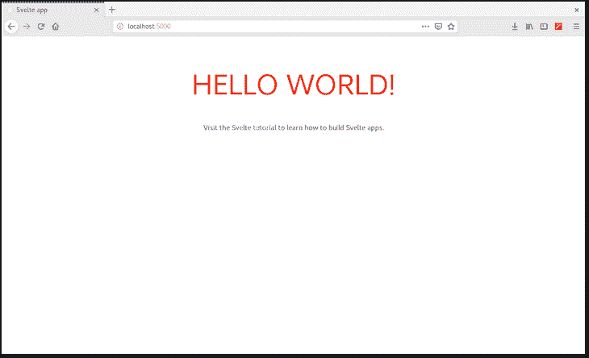
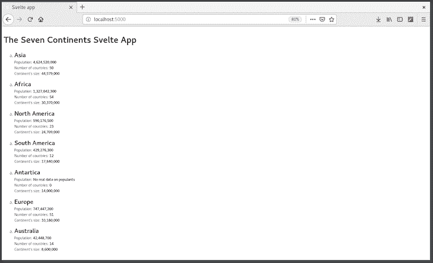
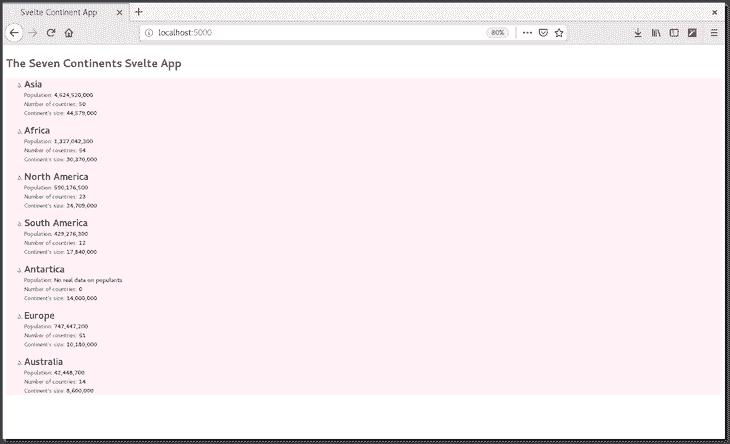

# 在 Svelte 中使用 REST APIs

> 原文：<https://blog.logrocket.com/consuming-rest-apis-in-svelte/>

从最新一期的年度“JavaScript 现状”调查来看，由于其现代风格和简单性，Svelte 是 2020 年最值得关注的前端库。

Svelte 是一个现代的反应式组件框架，在构建时运行，将组件转换成高效的命令式代码，以外科手术的方式更新 DOM。

## 我们将会建造什么

在本文中，我们将通过构建一个简单的应用程序来探索 Svelte 如何从 API 消费和呈现数据。我们将首先编写一个简单的后端来存储我们的数据，然后编写我们的苗条组件。

我假设你对 JavaScript、CSS、Node.js 以及 Svelte 本身的工作原理有所了解。如果你刚刚开始减肥，在继续减肥之前，你应该先看一看[这篇](https://blog.logrocket.com/how-to-build-a-simple-svelte-js-app/) [教程](https://blog.logrocket.com/how-to-build-a-simple-svelte-js-app/)。你也可以在[这个 GitHub repo](https://github.com/Youngestdev/svelte-continent-app) 中找到本文使用的代码。

## 设置

我们要做的第一件事是建立一个工作目录，我们将在其中存储应用程序的代码。有很多方法可以让一个苗条的项目开始运行，因为这不是一个关于苗条的介绍性教程，我们将使用 [degit](https://github.com/Rich-Harris/degit) ，一个脚手架工具来克隆一个苗条的模板。

为了搭建我们的应用程序，我们称之为`continent-app`，从您的首选工作目录在您的终端中运行以下命令:

```
npx degit sveltejs/template continent-app
```

接下来是导航到新创建的目录并安装依赖项:

```
cd continent-app && npm install
```

依赖项安装完成后，我们创建两个组件文件`Continents`和`Continent`，然后启动应用程序:

```
touch src/{Continent,Continents}.svelte
npm run dev
```

您应该会看到下面的屏幕:



## 构建 API

既然我们已经建立并运行了我们的苗条应用程序，我们将在为苗条应用程序编写组件之前构建 API。我们的 API 是一个简单的 API，它保存了关于七大洲的硬编码信息，一旦调用它就可以检索到这些信息。

接下来，在应用程序的目录中创建一个新文件夹`api`，并安装以下依赖项:

```
mkdir api && cd api
npm init -y // Quick initialisation of directory
npm install express cors body-parser
```

安装完成后，创建一个新文件`app.js`，它将保存简单的后端，然后将下面的代码复制到其中:

```
touch app.js
```

### `app.js`

我们从导入依赖项并初始化它们开始:

```
const express = require("express");
const bodyParser = require("body-parser");
const cors = require('cors')

const app = express();
app.use(bodyParser.json());
app.use(cors())
```

接下来，我们创建一个 JSON 格式的数据数组，其中包含姓名、人口、非洲国家的数量以及以公里为单位的面积

```
const continents = [
  {
    id: 1,
    name: "Asia",
    population: "4,624,520,000",
    no_of_countries: 50,
    area: "44,579,000"
  },
  {
    id: 2,
    name: "Africa",
    population: "1,327,042,300",
    no_of_countries: 54,
    area: "30,370,000"
  },
  {
    id: 3,
    name: "North America",
    population: "590,176,500",
    no_of_countries: 23,
    area: "24,709,000"
  },
  {
    id: 4,
    name: "South America",
    population: "429,276,300",
    no_of_countries: 12,
    area: "17,840,000"
  },
  {
    id: 5,
    name: "Antartica",
    population: "No real data on populants",
    no_of_countries: 0,
    area: "14,000,000"
  },
  {
    id: 6,
    name: "Europe",
    population: "747,447,200",
    no_of_countries: 51,
    area: "10,180,000"
  },
  {
    id: 7,
    name: "Australia",
    population: "42,448,700",
    no_of_countries: 14,
    area: "8,600,000"
  }
]
```

既然我们已经将大洲的数据存储在大洲变量中，我们将为 API 编写处理程序，它允许我们检索数据并启动后端:

```
app.get("/", (req, res) => {
  res.send(continents);
});

app.listen(8081, () => {
  console.log("App's running on port 8081");
});
```

我们已经成功完成了后端应用程序！我们可以用以下命令启动它:

```
node app.js
```

我们得到一条运行中的消息，导航到 url `localhost:8081`返回一个大陆及其数据的列表。

接下来，我们将编写 Svelte 应用程序的组件来检索和呈现数据。

## 编写苗条的组件

正如我们在上面看到的，苗条的应用程序显示了它的默认登陆页面，我们已经完成了后端。下一步是编写我们的细长组件，并重新设计应用程序来呈现我们的大陆数据。我们将编写两个组件:

*   `Continent`:该组件呈现从`Continents`组件作为道具传递给它的大陆数据
*   `Continents`:该组件从后端获取大陆列表，并通过`Continent`组件呈现出来

我们将从编写`Continent`组件开始，该组件呈现从`Continents`组件传递给它的大洲数据。

### `Continents.svelte`

我们将从在组件的`<script>`部分创建一个道具`continent`开始。

```
<script>
  // create a prop
  export let continent;
</script>
```

就像在 React 和 Vue 等其他库中一样，`continent` prop 将用于呈现数据。

接下来，我们渲染道具中的数据。请记住，从我们的 API 中，我们有以下数据:名称、人口、国家数量和面积。我们将在脚本标签下面呈现它:

```
<article>
    <h1>{continent.name}</h1>
    <small>
      Population: <b>{continent.population}</b>   
    </small><br/>
    <small>
      Number of countries: <b>{continent.no_of_countries}</b>
    </small><br/>
    <small>
      Continent's size: <b>{continent.area}</b>
    </small>
</article>
```

太好了！接下来，我们将添加一些样式:

```
<style>
  article {
    margin: 0 0 1em 0;
  }
  h1 {
    font-size: 1.4em;
    margin: 0;
    display: block;
  }
</style>
```

我们已经成功地完成了我们的 Continent 组件，这比在其他库中你必须为一个组件编写大量代码要简单得多。接下来，我们编写大陆组件。

### `Continents.svelte`

在这个组件中，我们从后端检索大陆列表，对其进行迭代，并将每个大陆作为道具传递给`Continent`组件进行渲染。我们将从导入`onMount()`方法和`Continent`组件开始。

```
<script>
  import { onMount } from "svelte";
  import Continent from "./Continent.svelte";
  // define the data holding variable
  let continents;
```

接下来，我们定义一呈现出`Continents`组件就执行的`onMount`方法。

```
onMount(async () => {
    await fetch(`http://localhost:8081/`)
      .then(r => r.json())
      .then(data => {
        continents = data;
      });
  })

</script>
```

下一件事是迭代检索到的大陆数据，并将每个数据作为道具传递给`Continent`。这是通过 Svelte 内置的条件支持来完成的。

```
{#if continents}
  {#each continents as continent }
    <ul>
      <li>    
        <Continent {continent} />
      </li>
    </ul>
  {/each}
{:else}
  <p class="loading">loading...</p>
{/if}
```

在上面的代码中，我们首先检查数据是否已被检索。如果是，则通过`Continent`组件迭代并呈现数据，如第 2–8 行所示。否则，它会显示一条加载消息。

### `onMount()`构件法

就像我们在 React 中有`componentDidMount()`一样，我们在 Svelte 中也有`onMount()`方法。
这个方法是一个在组件被渲染时执行的函数。它可以将一个预定义的函数作为参数，或者可以在其中定义一个函数，如上所示。

接下来，我们添加一些样式:

```
<style>
  .loading {
    opacity: 0;
    animation: 0.4s 0.8s forwards fade-in;
  }
  @keyframes fade-in {
    from { opacity: 0; }
    to { opacity: 1; }
  }
  li {
    list-style-type: georgian;
  }
</style>
```

## 渲染应用程序

我们已经成功编写了组件，下一步是通过应用程序的主要组件呈现数据。我们将重写`App`组件:

```
<script>
  import { onMount } from "svelte";
  import Continent from "./Continent.svelte";
  import Continents from "./Continents.svelte";
  let continents;
  let continent;
</script>

<h1>The Seven Continents Svelte App</h1>
<main>
    <Continents {continents} />
</main>
```

Svelte 有一个预建的热重装功能，所以如果我们通过`[http://localhost:5000](http://localhost:5000)`导航到我们的应用程序，我们会看到这样一个屏幕:



接下来，我们将更改我们的应用程序标题，并对我们的应用程序进行一些风格化处理(如果你想保持黑白效果，可以跳过这一步😊).

```
<svelte:head>
  <title>Svelte Continent App</title>
</svelte:head>

<style>
  main {
    background-color: lavenderblush;
    font-size: 15px;
  }
  h1 {
    font-size: 25px;
  }
</style>
```

保存后，应用程序会重新加载，我们会看到这个屏幕:



## 结论

在本文中，我们讨论了如何在后端使用和呈现数据，定义和导出属性，以及将属性传递给组件。我们还简要地看了一下什么是`onMount()`方法。

内置的模板系统对于构建简单的应用程序也是一个很大的优势，因为这个函数消除了我们通常在 React 中需要的过多 JavaScript 条件。阅读完本教程后，我相信您现在应该能够编写组件并从 API 消费和呈现消费的数据——继续编码，同样，您可以在这里找到本文中使用的代码。

## 使用 [LogRocket](https://lp.logrocket.com/blg/signup) 消除传统错误报告的干扰

[](https://lp.logrocket.com/blg/signup)

[LogRocket](https://lp.logrocket.com/blg/signup) 是一个数字体验分析解决方案，它可以保护您免受数百个假阳性错误警报的影响，只针对几个真正重要的项目。LogRocket 会告诉您应用程序中实际影响用户的最具影响力的 bug 和 UX 问题。

然后，使用具有深层技术遥测的会话重放来确切地查看用户看到了什么以及是什么导致了问题，就像你在他们身后看一样。

LogRocket 自动聚合客户端错误、JS 异常、前端性能指标和用户交互。然后 LogRocket 使用机器学习来告诉你哪些问题正在影响大多数用户，并提供你需要修复它的上下文。

关注重要的 bug—[今天就试试 LogRocket】。](https://lp.logrocket.com/blg/signup-issue-free)