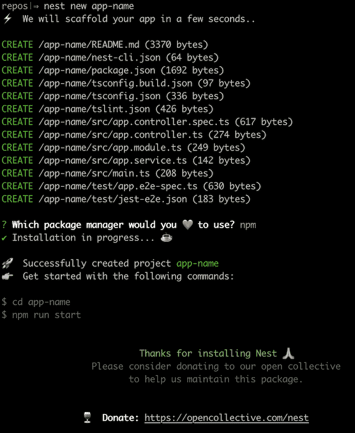
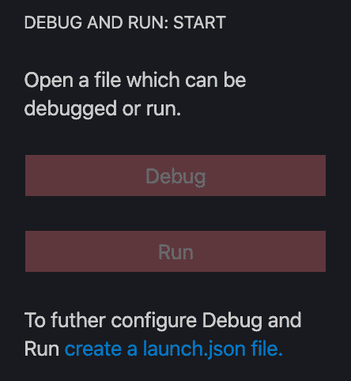
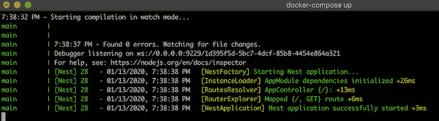
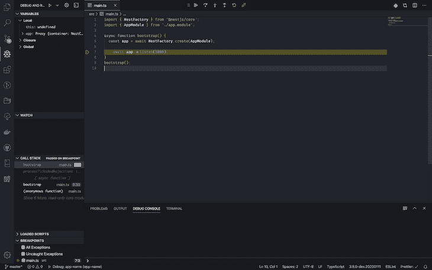

# 使用 NestJS 和 Docker 进行容器化开发

> 原文：<https://blog.logrocket.com/containerized-development-nestjs-docker/>

由于其出色的 CLI，创建一个全新的 NestJS 应用程序变得轻而易举。只需一个命令`nest new app-name`，我们就有了一个功能齐全、随时可用的应用程序。

对于一个简单的应用程序来说，生成的设置很好，但是随着它变得更加复杂，并且开始依赖外部服务，如 Postgres 或 Redis，由于他们使用的机器的差异或者他们是否已经安装了所有必要的服务，开发人员可能需要花费相当长的时间来自己设置一切。

理想情况下，我们的应用程序应该从一个命令开始，该命令保证它将按预期工作，而不管开发人员选择的机器/环境如何。应用程序还应该确保它所依赖的一切，比如前面提到的外部服务，都是在启动过程中创建的。这就是码头集装箱化变得不可或缺的地方。

> **注:**本文假设 Docker 基础知识。

## 创建新项目

我们可以用其专用的 [CLI](https://docs.nestjs.com/cli/overview) 轻松创建一个新的 NestJS 应用程序。

要全局安装 CLI，请运行:

```
npm install -g @nestjs/cli
```

现在，为了创建应用程序，我们可以执行:

```
nest new app-name
```

很自然地，`app-name`被替换为应用程序的实际名称。请记住，应用程序将在当前目录的`app-name`文件夹中生成。

CLI 向导将要求我们在 npm 和 yarn 之间进行选择；在本指南中，我们将使用 npm。



现在我们的应用程序已经设置好了，让我们继续添加 Docker。

## 使用多阶段构建添加 Docker

用 Docker 容器化我们的应用程序有很多优点。对我们来说，最重要的两个因素是，应用程序无论在什么环境下都会按照预期的方式运行，并且可以在启动应用程序时自动安装所有的外部依赖项(在我们的例子中是 Redis 和 PostgreSQL)。

此外，Docker 映像可以轻松部署在 Heroku 等平台上，并与 CircleCI 等 CI 解决方案配合使用。

作为奖励，我们将使用一个最近添加的称为多阶段构建的特性。它通过将所有开发依赖项保留在中间层，帮助我们将构建的生产映像保持得尽可能小，这反过来可能会导致更快的部署。

也就是说，在我们应用程序的基础上，让我们创建一个利用多阶段构建特性的 Dockerfile:

```
FROM node:12.13-alpine As development

WORKDIR /usr/src/app

COPY package*.json ./

RUN npm install --only=development

COPY . .

RUN npm run build

FROM node:12.13-alpine as production

ARG NODE_ENV=production
ENV NODE_ENV=${NODE_ENV}

WORKDIR /usr/src/app

COPY package*.json ./

RUN npm install --only=production

COPY . .

COPY --from=development /usr/src/app/dist ./dist

CMD ["node", "dist/main"]
```

让我们一行一行地看一下:

```
FROM node:12.13-alpine As development
```

首先，我们告诉 Docker 使用在[公共存储库](https://hub.docker.com/)中可用的官方 Node.js 映像。

我们指定了 Node 的 12.13 版本，并选择了一个 Alpine 映像。阿尔卑斯山的图像更亮，但是使用它们会有意想不到的行为。

因为我们使用多阶段构建特性，所以我们也使用 AS 语句来命名图像`development`。这里的名称可以是任何名称；这只是为了以后参考图像。

```
WORKDIR /usr/src/app
```

设置`WORKDIR`后，Docker 执行的每个命令(在`RUN`语句中定义)将在指定的上下文中执行。

```
COPY package*.json ./

RUN npm install --only=development

COPY . .
```

首先，我们只复制`package.json`和`package-lock.json`(如果存在的话)。然后，我们在`WORKDIR`上下文中运行`npm install`命令。一旦完成，我们就将应用程序的其余文件复制到 Docker 容器中。

这里我们只安装`devDependencies`,因为容器被用作“构建器”,它需要所有必要的工具来构建应用程序，然后将一个干净的`/dist`文件夹发送到生产映像。

由于 Docker 缓存层的方式，语句的顺序在这里非常重要。docker 文件中的每个语句都会生成一个新的图像层，该图像层会被缓存。

如果我们一次复制所有文件，然后运行`npm install`，每个文件的改变都会导致 Docker 认为它应该重新运行`npm install`。

通过首先只复制`package*.json`文件，我们告诉 Docker，只有当`package.json`或`package-lock.json`文件改变时，它才应该运行`npm install`和所有随后出现的命令。

```
RUN npm run build
```

最后，我们确保应用程序构建在`/dist`文件夹中。因为我们的应用程序使用 TypeScript 和其他构建时依赖项，所以我们必须在开发映像中执行这个命令。

* * *

### 更多来自 LogRocket 的精彩文章:

* * *

```
FROM node:12.13-alpine as production
```

通过再次使用`FROM`语句，我们告诉 Docker，它应该创建一个新的、新鲜的图像，与之前的图像没有任何联系。这次我们将其命名为`production`。

```
ARG NODE_ENV=production
ENV NODE_ENV=${NODE_ENV}
```

这里我们使用`ARG`语句来定义`NODE_ENV`的默认值，尽管默认值只在构建时可用(不是在我们启动应用程序时)。

然后我们使用`ENV`语句将其设置为默认值或用户设置的值。

```
WORKDIR /usr/src/app

COPY package*.json ./

RUN npm install --only=production

COPY . .
```

现在这一部分与上一部分完全相同，但是这一次，我们通过使用`--only=production`参数来确保只安装在`package.json`的`dependencies`中定义的依赖项。这样我们就不会安装诸如 TypeScript 之类的会导致最终图像大小增加的包。

```
COPY --from=development /usr/src/app/dist ./dist
```

在这里，我们从`development`图像中复制构建的`/dist`文件夹。这样，我们只能得到安装在最终映像中的`/dist`目录，而没有`devDependencies`。

```
CMD ["node", "dist/main"]
```

这里我们定义了运行映像时要执行的默认命令。

多亏了多阶段构建特性，我们可以通过在`development`图像中保留所有不必要的膨胀来保持我们的最终图像(这里称为`production`)尽可能的苗条。

Dockerfile 已经可以用来在容器中运行我们的应用程序了。我们可以通过运行以下命令来构建映像:

```
docker build -t app-name .
```

(`-t`选项用于给我们的图像命名，即标记。)

然后运行它:

```
docker run app-name
```

一切都很好。

但是这不是一个适合开发的解决方案。热重装呢？如果我们的应用程序依赖于像 Postgres 和 Redis 这样的外部工具会怎么样？我们不想让每个开发人员在他们的机器上单独安装它们。

所有这些问题都可以使用 docker-compose 来解决，这是一种为本地开发而将所有东西包装在一起的工具。

## 添加 docker-compose

Docker-compose 是 Docker 预装的工具。它是专门用来帮助开发者进行本地开发的。既然我们的应用程序是容器化的，并且在每台机器上都是一样的，为什么我们的数据库要依赖于开发者的机器呢？

我们将创建一个 docker-compose 配置，它将为我们启动并连接三个服务。服务将负责运行我们的应用程序。顾名思义，`postgres`和`redis`服务将经营集装箱化的邮政快递和 Redis。

在应用程序根目录下，创建一个名为`docker-compose.yml`的文件，并用以下内容填充它:

```
version: '3.7'

services:
  main:
    container_name: main
    build:
      context: .
      target: development
    volumes:
      - .:/usr/src/app
      - /usr/src/app/node_modules
    ports:
      - ${SERVER_PORT}:${SERVER_PORT}
      - 9229:9229
    command: npm run start:dev
    env_file:
      - .env
    networks:
      - webnet
    depends_on:
      - redis
      - postgres
  redis:
    container_name: redis
    image: redis:5
    networks:
      - webnet
  postgres:
    container_name: postgres
    image: postgres:12
    networks:
      - webnet
    environment:
      POSTGRES_PASSWORD: ${DB_PASSWORD}
      POSTGRES_USER: ${DB_USERNAME}
      POSTGRES_DB: ${DB_DATABASE_NAME}
      PG_DATA: /var/lib/postgresql/data
    ports:
      - 5432:5432
    volumes:
      - pgdata:/var/lib/postgresql/data
networks:
  webnet:
volumes:
  pgdata:
```

首先，我们指定我们的文件使用 docker-compose 版本 3.7。我们特别使用这个版本，因为它支持多阶段构建。

然后我们定义三个服务:`main`、`redis`和`postgres`。

### 服务

#### `main`

服务负责运行我们的应用程序。

```
container_name: main
build:
  context: .
  target: development
command: npm run start:dev
volumes:
  - .:/usr/src/app
  - /usr/src/app/node_modules
ports:
  - ${SERVER_PORT}:${SERVER_PORT}
  - 9229:9229
env_file:
  - .env
networks:
  - webnet
depends_on:
  - redis
  - postgres
```

让我们一行一行地看一下它的配置:

```
container_name: main
```

`container_name`告诉 docker-compose 我们将在各种 docker-compose 命令中使用名称`main`来引用该服务。

```
build:
  context: .
  target: development
```

在构建配置中，我们定义了`context`，它告诉 Docker 哪些文件应该发送到 Docker 守护进程。在我们的例子中，这是我们的整个应用程序，所以我们传入`.`，这意味着当前目录的全部。

我们还定义了一个`target`属性，并将其设置为`development`。由于这个属性，Docker 现在将只构建我们 Dockerfile 的第一部分，而完全忽略我们构建的生产部分(它将在第二个`FROM`语句之前停止)。

```
command: npm run start:dev
```

在我们的 docker 文件中，我们将命令定义为`CMD ["node", "dist/main"]`，但这不是我们希望在开发环境中运行的命令。相反，我们希望运行一个进程来监视我们的文件，并在每次更改后重新启动应用程序。我们可以通过使用`command`配置来做到这一点。

这个命令的问题是，由于 Docker 的工作方式，在我们的主机(我们的计算机)上更改文件不会反映在容器中。一旦我们将文件复制到容器中(使用 Dockerfile 中的`COPY . .`语句)，它们就保持不变。然而，有一个利用`volumes`的技巧。

```
volumes:
  - .:/usr/src/app
  - /usr/src/app/node_modules
```

卷是在容器中挂载主机目录的一种方式，我们定义了其中的两种。

第一个将我们当前的目录(`.`)安装到 Docker 容器(`/usr/src/app`)中。这样，当我们改变主机上的文件时，容器中的文件也会改变。现在，该进程虽然仍在容器内运行，但会在每次文件更改时重新启动应用程序。

第二卷是黑客。通过在容器中挂载第一个卷，我们可能会意外地用本地的目录覆盖`node_modules`目录。由于 Visual Studio 代码所依赖的开发工具，开发人员通常在他们的主机上有`node_modules`——例如像`eslint`或`@types`这样的包。

记住这一点，我们可以使用匿名卷来防止容器中的`node_modules`被覆盖。

```
ports:
  - ${SERVER_PORT}:${SERVER_PORT}
  - 9229:9229
```

`ports`配置是不言自明的。

Docker 的容器有自己的网络，所以通过使用端口，我们将它们暴露给我们的主机。语法是`HOST_PORT:CONTAINER_PORT`。

`${SERVER_PORT}`语法意味着将从环境变量中检索值。

我们还添加了用于调试目的的`9229`端口，如下所述。

```
env_file:
  - .env
```

当使用 Node.js 应用程序时，我们通常使用`.env`文件将环境变量保存在一个地方。由于我们在配置中使用了环境变量(就像我们在上面的`ports`中所做的那样)，我们也从文件中加载变量，以防它们在那里被定义。

```
networks:
  - webnet
```

由于每个服务都有自己的内部网络(由于它们是不同的容器)，我们也创建了自己的网络，使它们能够进行通信。

注意，网络是在文件的底部定义的；这里我们只是告诉 docker-compose 在这个特定的服务中使用它。

```
depends_on:
  - redis
  - postgres
```

我们的另外两个服务名为`redis`和`postgres`。当我们的应用程序启动时，我们希望 Postgres 数据库和 Redis 存储都可以使用。否则，我们的应用程序可能会崩溃。

#### `redis`

```
redis:
  container_name: redis
  image: redis:5
  networks:
    - webnet
```

`redis`配置非常简单。首先，我们定义它的`container_name`。然后我们指定`image`名，它应该从[库](https://hub.docker.com/)中获取。我们还必须定义用于与其他服务通信的网络。

#### `postgres`

```
postgres:
  container_name: postgres
  image: postgres:12
  networks:
    - webnet
  environment:
    POSTGRES_PASSWORD: ${DB_PASSWORD}
    POSTGRES_USER: ${DB_USERNAME}
    POSTGRES_DB: ${DB_DATABASE_NAME}
    PG_DATA: /var/lib/postgresql/data
  volumes:
    - pgdata:/var/lib/postgresql/data
  ports:
    - 5432:5432
```

`postgres`映像使用了一些在映像的[文档](https://hub.docker.com/_/postgres)中描述的环境变量。当我们定义指定的变量时，Postgres 将使用它们(当启动容器时)来做某些事情。

像`POSTGRES_PASSWORD`、`POSTGRES_USER`和`POSTGRES_DB`这样的变量用于创建默认数据库。如果没有它们，我们将不得不自己编写 SQL 代码，并将其复制到容器中来创建数据库。

`PG_DATA`变量用于告诉 Postgres 应该在哪里保存所有与 Postgres 相关的数据。我们将其设置为`/var/lib/postgresql/data`。

如果您看一下`volumes`配置，您会看到我们在`/var/lib/postgresql/data`目录中挂载了这个卷。

```
volumes:
  - pgdata:/var/lib/postgresql/data
```

可能让你感到困惑的是，卷的第一部分不是一个目录，而是一个叫做`pgdata`的东西。

`pgdata`是一个被命名为卷的[，它被定义在我们文件的底部:](https://docs.docker.com/storage/volumes/)

```
volumes:
  pgdata:
```

通过使用命名值，我们可以确保即使容器被移除，数据也保持不变。它将一直存在，直到我们自己删除该卷。

此外，知道我们将数据保存在哪里总是好的，而不是存储在容器中的某个随机位置。

```
ports:
  - 5432:5432
```

最后，我们必须公开默认的 Postgres 端口`5432`,以便能够使用诸如 pgadmin 之类的工具从我们的主机连接到数据库。

### 在开发中运行应用程序

要运行该应用程序，我们现在必须使用以下命令:

```
docker-compose up
```

多克会为我们处理好一切。谈论伟大的开发者体验。

### 额外收获:添加 npm 包

在`main`服务配置中，我们将`node_modules`定义为匿名卷，以防止我们的主机文件覆盖目录。因此，如果我们使用`npm install`添加一个新的 npm 包，这个包在 Docker 上下文中就不可用，应用程序就会崩溃。

即使您运行`docker-compose down`然后再运行`docker-compose up`来重新开始，音量也会保持不变。它不起作用，因为匿名卷只有在其父容器被删除后才会被删除。

要解决这个问题，我们可以运行以下命令:

```
docker-compose up --build -V
```

`--build`参数将确保 npm 安装正在运行(在构建过程中)，而`-V`参数将删除任何匿名卷并重新创建它们。

## 在 Visual Studio 代码中设置调试器

许多 Node.js 开发人员使用`console.logs`来调试他们的代码。至少可以说，大多数时候这是一个乏味的过程。Visual Studio 代码有自己的调试器，可以轻松集成到我们的应用程序中。

### 创建 VSC 任务

在 VS 代码的左侧面板，点击**调试运行**面板，点击**创建一个 launch.json 文件**，在模态中选择 **Node.js** 。



然后，将`.vscode/launch.json`文件的内容替换为:

```
{
 "version": "0.2.0",
 "configurations": [
   {
     "type": "node",
     "request": "attach",
     "name": "Debug: app-name",
     "remoteRoot": "/usr/src/app",
     "localRoot": "${workspaceFolder}",
     "protocol": "inspector",
     "port": 9229,
     "restart": true,
     "address": "0.0.0.0",
     "skipFiles": ["<node_internals>/**"]
   }
 ]
}
```

我们确保`remoteRoot`被设置为`/usr/src/app`(Docker 容器中的路径)，`port`被设置为`9229`，`address`被设置为`0.0.0.0`。

### 添加`--debug`参数

用以下内容替换`package.json`中的`start:debug`脚本:

```
"start:debug": "nest start --debug 0.0.0.0:9229 --watch",
```

我们指定 URL `0.0.0.0:9229`，我们将在其上附加调试器。这就是为什么当我们为`main`服务定义 docker-compose 配置时，我们公开了`9229`端口。

### 更改`docker-compose.yml`文件

为了使用调试器功能，我们必须将主服务的命令从:

```
command: npm run start:dev
```

到

```
command: npm run start:debug
```

启动应用程序后，应该会有一个日志:

```
Debugger listening on ws://0.0.0.0:9229/3e948401-fe6d-4c4d-b20f-6ad45b537587
```



下面是 VS 代码中的调试器视图:



调试器将在每次应用程序重启后重新连接自己。

## 摘要

NestJS CLI 在为我们设置项目的基本样板方面做得很好。然而，为了得到一个完全成熟的开发环境，我们必须添加像 Docker 和 docker-compose 这样的工具。最重要的是，通过配置 Visual Studio 代码内部调试器与 Docker 一起工作，我们提高了开发人员的生产率。

## 200 只显示器出现故障，生产中网络请求缓慢

部署基于节点的 web 应用程序或网站是容易的部分。确保您的节点实例继续为您的应用程序提供资源是事情变得更加困难的地方。如果您对确保对后端或第三方服务的请求成功感兴趣，

[try LogRocket](https://lp.logrocket.com/blg/node-signup)

.

[](https://lp.logrocket.com/blg/node-signup)[https://logrocket.com/signup/](https://lp.logrocket.com/blg/node-signup)

LogRocket 就像是网络和移动应用程序的 DVR，记录下用户与你的应用程序交互时发生的一切。您可以汇总并报告有问题的网络请求，以快速了解根本原因，而不是猜测问题发生的原因。

LogRocket 检测您的应用程序以记录基线性能计时，如页面加载时间、到达第一个字节的时间、慢速网络请求，还记录 Redux、NgRx 和 Vuex 操作/状态。

[Start monitoring for free](https://lp.logrocket.com/blg/node-signup)

.