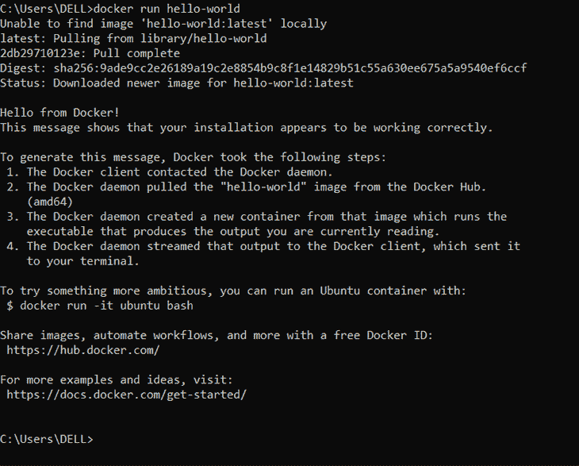
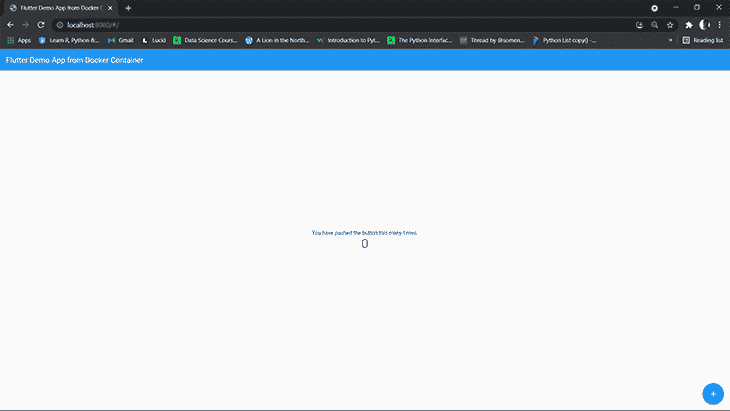

# 用 Docker 容器化 Flutter web 应用程序

> 原文：<https://blog.logrocket.com/containerizing-flutter-web-apps-with-docker/>

许多软件工程师面临的一个难题是部署。工程师可以构建和测试一个依赖于 Windows 操作系统的应用程序，而不会出错。然而，将同一个应用程序部署到不同的操作系统，比如 Linux 或 Mac，可能会导致错误和错误。

在容器技术出现之前，虚拟机(VM)是处理这种情况的首选解决方案。事实证明，虚拟机速度慢，内存效率低，部分原因是它们必须为每个应用程序设置和启动。

容器化应用的技术[弥补了虚拟机的低效](https://www.ibm.com/cloud/blog/containers-vs-vms)；容器是轻量级的包，使应用程序能够在任何操作系统或基础设施上一致地运行。

本教程将深入探讨应用程序容器化的含义及其好处。我们将通过在我们的机器上设置 Docker 并封装一个 Flutter web 应用程序来研究这个问题。

## 先决条件

*   安装在您机器上的 Dart、Android 和 Flutter SDKs
*   [Docker 工具包](https://www.docker.com/get-started)

在这个演示中，我将使用 [Visual Studio 代码](https://code.visualstudio.com/)。要在 Windows 上高效运行 Docker，请确保您的机器:

*   在 Windows v10 上运行
*   至少有 4GB 的内存

## 什么是容器？

容器技术使得在分布式环境中一致地运行应用程序成为可能。这些环境可以包括:

*   通过开发人员的笔记本电脑过渡到测试、试运行和生产环境
*   从物理机迁移到云中的虚拟机

通常不能保证应用程序在这些环境中使用一致的运行时协议。例如，您可能使用 Flutter v2.2.3 构建和测试一个应用程序，但是在生产阶段，应用程序最终运行在 Flutter v2.5.1 上，结果，出现了一些问题。

容器确保应用程序维护其配置的运行时协议，而不管主机服务器的操作配置如何。

它通过将应用程序及其依赖项、设置、库和其他运行时协议打包在一个隔离状态中来实现这一点。这意味着应用程序独立于主机服务器配置运行，没有任何不兼容性。

## Docker 是什么？

Docker 是一个用于构建、测试、部署和管理容器化应用程序的开源工具。在我看来，它是实现应用程序容器化的标准，因为它易于移植，并且是为现代微服务架构设计的。

Docker 通过它的`docker`命令简化了编排容器的过程。

## 用 Docker 容器化你的应用的好处

### 成本效率

在三台虚拟机中托管三个应用程序的服务器需要由虚拟机管理程序管理的三个虚拟操作系统副本才能在服务器上运行。这需要大量资源，因为运行这三个应用的虚拟机将非常繁重，并将消耗大量 CPU 资源。

使用容器，容器引擎管理所有三个应用程序并共享同一个主机操作系统。单个基础设施可以支持不同数量的容器。

### 远程服务

开发人员可以将 Docker 图像推送到存储库或从存储库中取出。任何机器都可以托管这些映像来运行其容器。这意味着无论在哪里，您都可以在 Docker 映像中检索和运行容器。这个过程类似于您通常如何检索驻留在远程 Git 存储库中的应用程序。

### 自动设置

Docker 抽象了每次更改应用程序环境时手动设置应用程序依赖关系的过程。由于 Docker 容器的独立性和隔离性，您不需要设置您的应用程序运行时配置。容器已经包含了应用程序自给自足所需的依赖项。

一旦构建了映像，Docker 就会使用所提供的配置来支持应用程序。

### 可量测性

与虚拟机相比，使用容器扩展应用程序更易于管理。Docker 容器可以扩展应用程序以承受更重的负载。当应用程序负载的重量下降时，它还可以减少处理工作。

### 安全性

容器的配置是不可变的。当对映像的配置进行更改时，整个容器被替换，映像被重建。

## 设置 Docker

让我们继续用 Docker 封装一个 [Flutter web 应用程序](https://blog.logrocket.com/how-to-create-desktop-applications-with-flutter/)。

正如我在本文开头提到的，我将在 Windows 操作系统上演示这个过程。在系统上安装 Docker 后，以管理员身份打开命令 shell。

运行以下命令检查安装的 Docker 版本:

```
sh
docker --version

```

您应该得到一个显示您安装的 Docker 版本的输出，格式如下:

```
sh
Docker version 20.10.8, build 3967b7d

```

接下来，让我们通过在终端上运行一个基本的 Docker 命令来测试安装。

```
sh
docker run hello-world

```

该命令的预期输出是:



第一次运行时，上面的命令从 Docker hub 中提取映像，并作为容器运行它的一个实例。

如果您使用的是 Linux 操作系统，您必须授予 Docker root 访问权限，以便在您的 IDE 中使用它。您可以通过运行以下命令来实现这一点:

创建码头工人组:

```
sh

sudo groupadd docker

```

将您的用户添加到群组:

```
sh

sudo usermod -a -G $USER

```

激活对组所做的更改:

```
sh

newgrp docker

```

现在，验证您可以在不使用`sudo`命令的情况下从 shell 中运行 Docker 命令。

```
sh
docker run hello-world

```

## 创建 Docker 容器

打开您想要用首选 IDE 进行容器化的 Flutter web 应用程序。在根应用程序文件夹中，创建一个名为`Dockerfile`的文件。确保文件名以大写字母“D”开头。

现在，在`Dockerfile`中添加以下代码:

```
sh

# Install Operating system and dependencies
FROM ubuntu:20.04

RUN apt-get update 
RUN apt-get install -y curl git wget unzip libgconf-2-4 gdb libstdc++6 libglu1-mesa fonts-droid-fallback lib32stdc++6 python3
RUN apt-get clean

# download Flutter SDK from Flutter Github repo
RUN git clone https://github.com/flutter/flutter.git /usr/local/flutter

# Set flutter environment path
ENV PATH="/usr/local/flutter/bin:/usr/local/flutter/bin/cache/dart-sdk/bin:${PATH}"

# Run flutter doctor
RUN flutter doctor

# Enable flutter web
RUN flutter channel master
RUN flutter upgrade
RUN flutter config --enable-web

# Copy files to container and build
RUN mkdir /app/
COPY . /app/
WORKDIR /app/
RUN flutter build web

# Record the exposed port
EXPOSE 5000

# make server startup script executable and start the web server
RUN ["chmod", "+x", "/app/server/server.sh"]

ENTRYPOINT [ "/app/server/server.sh"]

```

在上面的 Dockerfile 文件中，我们从安装操作系统(Ubuntu)和所需的依赖项开始。

接下来，我们下载了 Flutter SDK，并在环境路径中设置 SDK 路径(如果您在本地机器上设置 Flutter，这也是您应该做的)。

之后，我们将应用程序复制到容器中，并用`Dockerfile`构建它。

最后，我们公开了一个`port=5000`，通过它我们将从容器中提供应用程序。然后我们使用`server.sh`脚本启动 HTTP 服务器。

接下来，在根应用程序文件夹中创建一个子文件夹。将文件夹命名为`server`，然后在`server`文件夹中创建一个`server.sh`文件，并添加以下代码。

```
sh

#!/bin/bash

# Set the port
PORT=5000

# Stop any program currently running on the set port
echo 'preparing port' $PORT '...'
fuser -k 5000/tcp

# switch directories
cd build/web/

# Start the server
echo 'Server starting on port' $PORT '...'
python3 -m http.server $PORT

```

在`server.sh`文件中，我们将端口设置为`5000`，与我们在`Dockerfile`中公开的一样。

然后，我们使用`fuser`命令终止当前在端口 5000 上运行的任何其他进程，使其对我们的应用程序可用。最后，我们启动服务器。

## 建立 Docker 形象

从应用程序根文件夹打开终端，并运行以下命令:

`docker build . -t flutter_docker`

这将构建一个名为`flutter_docker`的 Docker 映像。您可以从已安装的 Docker 桌面应用程序中查看此图像。您也可以使用命令`docker images`查看图像。


### 运行图像容器

运行以下命令:

`docker run -i -p 8080:5000 -td flutter_docker`

该命令将容器中配置的`port 5000`绑定到可从浏览器访问的`TCP port 8080`。

当您完成配置时，您的项目结构应该是这种格式:


继续在浏览器上查看`localhost:8080`上的应用程序。


## 结论

在本教程中，我们了解了应用程序容器化的好处。我们演示了如何在我们的机器上设置 Docker，并继续从 Docker 容器运行我们现有的应用程序。

使用 Docker，您不必担心您的应用程序由于其主机环境的不兼容性而崩溃。你可以从官方文档中了解更多关于 Docker 的信息。

目的是确保您的应用程序足够灵活，能够在其主机上独立运行。正如我们用一个 Flutter 应用程序所展示的，你也可以[容器化用其他工具](https://blog.logrocket.com/tag/docker)构建的应用程序。

## 使用 [LogRocket](https://lp.logrocket.com/blg/signup) 消除传统错误报告的干扰

[](https://lp.logrocket.com/blg/signup)

[LogRocket](https://lp.logrocket.com/blg/signup) 是一个数字体验分析解决方案，它可以保护您免受数百个假阳性错误警报的影响，只针对几个真正重要的项目。LogRocket 会告诉您应用程序中实际影响用户的最具影响力的 bug 和 UX 问题。

然后，使用具有深层技术遥测的会话重放来确切地查看用户看到了什么以及是什么导致了问题，就像你在他们身后看一样。

LogRocket 自动聚合客户端错误、JS 异常、前端性能指标和用户交互。然后 LogRocket 使用机器学习来告诉你哪些问题正在影响大多数用户，并提供你需要修复它的上下文。

关注重要的 bug—[今天就试试 LogRocket】。](https://lp.logrocket.com/blg/signup-issue-free)