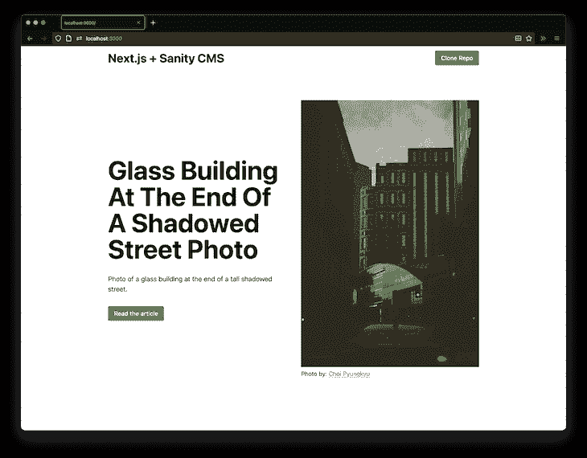
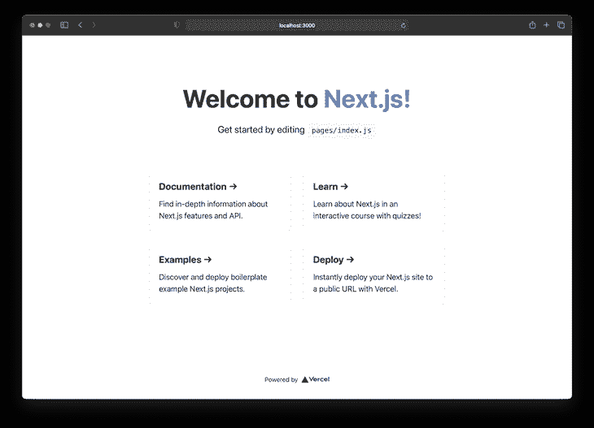
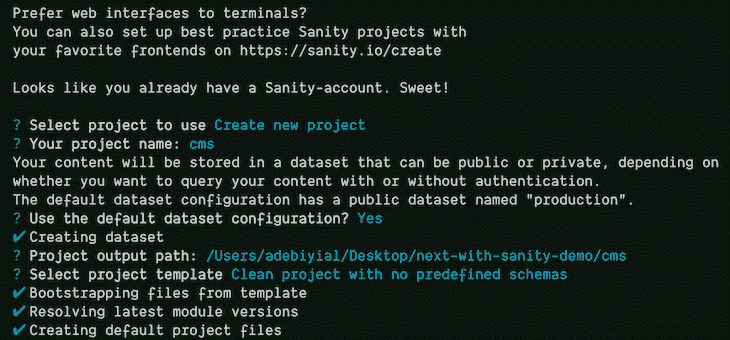
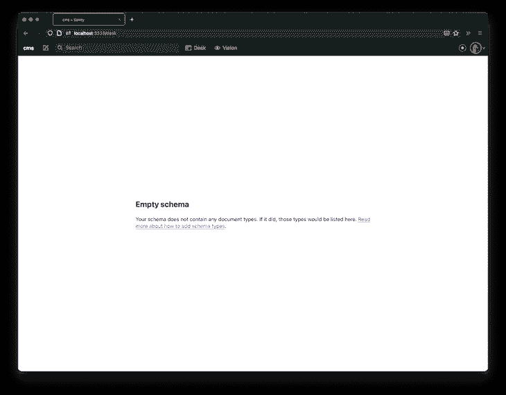
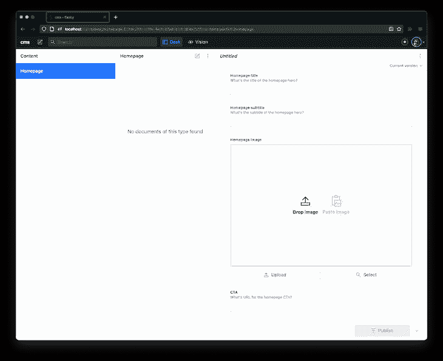
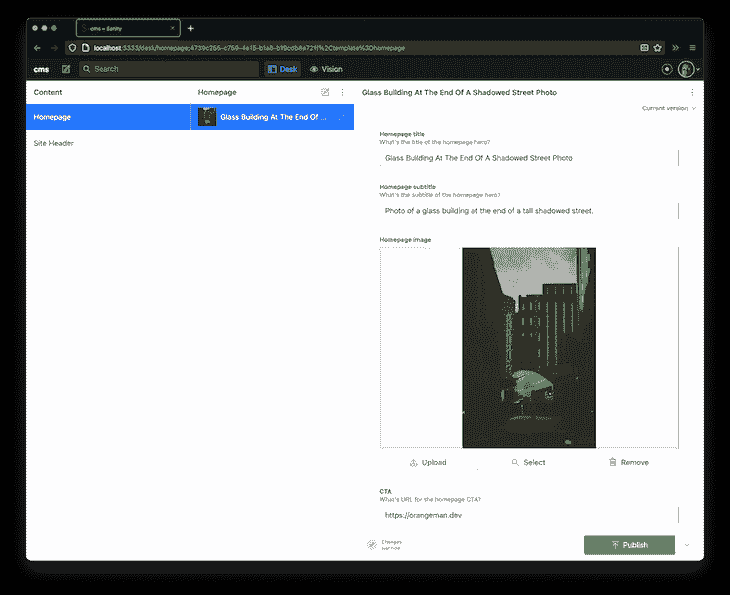
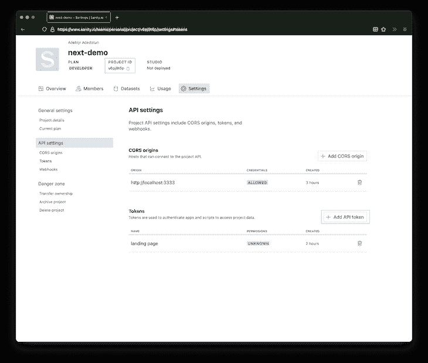

# Next.js 中的内容管理与 Sanity CMS 

> 原文：<https://blog.logrocket.com/content-management-in-next-js-with-sanity-cms/>

Next.js 是一个 React 框架，旨在通过内置功能扩展 React 的功能，如路由、类型脚本支持以及网站和应用程序的混合静态和服务器呈现。

虽然 Next.js 应用程序中的内容可以硬编码、从 JSON 文件中读取或从数据库中使用，但从内容管理系统(CMS)如 Sanity CMS 中获取内容可以为开发人员提供更灵活的创作。

在这篇文章中，我们将看看如何使用 Next.js 和 Sanity CMS，一个 headless CMS，在一个基于 Jamstack 的 web 应用程序或网站中提供更好的内容管理。

## 什么是神智 CMS？

[Sanity CMS](https://blog.logrocket.com/sanity-cms-for-content-management-in-gatsby/) 是一个 headless CMS，它是一个与表示层或客户端分离的内容创作后端系统。它通过 API 将存储的内容公开为数据，供网站、移动应用程序和物联网等不同平台使用，与 WordPress 等传统内容管理系统截然不同。

Sanity CMS 采用结构化的方法进行内容创作，通过其[图像管道](https://www.sanity.io/docs/asset-pipeline)，通过[可移植文本](https://www.sanity.io/guides/introduction-to-portable-text)和设计，提供了一些简洁的功能来管理图像。它还提供了 [Sanity Studio](https://sanity.io/studio) ，一个用 React 构建的全功能、可定制、可扩展的编辑器。

### 无头 CMS 的好处

Headless CMS 忠实地体现了 Jamstack 架构的解耦方法，具有如下优点:

#### 安全性

因为后端系统与表示层分离，所以暴露于安全威胁的区域较小。

#### 数据可重用性

无头内容通过 API 作为数据公开，因此是平台不可知的。

#### 结构化内容

[内容建模](https://www.sanity.io/docs/content-modelling)是 headless CMS 的核心，要求内容描述是一等公民，这意味着它们可以针对任何应用程序的特定需求进行构建。

#### 更容易编辑

内容和代码的分离使得内容编辑者更容易专注于内容编辑，开发者更容易专注于代码。

#### 开发者体验

在无头 CMS 生态系统中，被称为头部的是头部中消费内容的地方。它与主体无关，内容是在主体中创作和存储的，可以由开发人员自行选择。

#### 缩短构建时间

众所周知，当 Jamstack 站点包含大量内容时，构建时间会很长。虽然有像[增量静态再生(ISR)](https://blog.logrocket.com/incremental-static-regeneration-with-next-js/) 、[增量构建](https://blog.logrocket.com/gatsby-incremental-builds/)和[分布式持久渲染(DPR)](https://github.com/jamstack/jamstack.org/discussions/549) 这样的解决方案，但是将内容从头中分离出来解决了无头 CMS 中构建时间长的问题。

## 使用 Sanity CMS 管理内容

为了说明如何在 Jamstack 架构中将 [Next.js](https://blog.logrocket.com/whats-new-in-next-js-10-1/) 与 Sanity CMS 一起使用，我们将构建一个简单的登录页面来理解 Sanity 的基本内容管理流程，包括在 Next.js 中使用其命令行界面(CLI)和操纵其模式。

跟随[一起提交](https://github.com/adebiyial/next-with-sanity-demo/commit/e55bdcebe27b61f9924db0fdd1db5865645d74ec),其中包括硬编码的样式和默认登录页面内容。我们的最终产品将如下图所示:



我们疯狂的方法是:

1.  在 Sanity Studio 上创建和发布内容
2.  在我们的 Next.js 应用程序中获取无头内容作为动态内容的数据

## 创建并运行 Next.js 应用程序

首先，创建一个内容硬编码的 Next.js 应用程序。

首先用`create-next-app`创建一个 Next.js 应用程序，然后运行这个命令:

```
yarn create next-app client

```

接下来，使用以下命令运行 Next.js 应用程序:

```
cd client
yarn dev

```

在 [http://localhost:3000](http://localhost:3000) 访问 Next.js app。



Default Next.js App running on [http://localhost:3000](http://localhost:3000).

既然我们已经成功地创建了一个包含硬编码内容的 Next.js 应用程序，那么是时候在 Sanity Studio 中创建并运行一个项目了。

## 创建并运行一个 Sanity Studio 项目

在进行下一步之前，请确保您有一个[健全性帐户](https://manage.sanity.io/)，如果没有，请创建一个。

接下来，使用以下命令全局安装 [Sanity CLI](https://www.sanity.io/docs/cli) :

```
yarn add @sanity/cli --global

```

这将为通过 CLI 正常工作安装必要的工具。

安装 Sanity CLI 后，使用以下内容创建一个新的 Sanity 项目:

```
sanity init

```

当这个命令运行时，会出现一个交互式问答会话，用于创建一个 Sanity Studio 项目。我们可以为该项目的相应问题输入以下答案:

*   对于`Select project to use`输入`Create new project`
*   对于`Your project name:`输入`cms`
*   对于`Use the default dataset configuration?`输入`Yes`
*   对于`Select project template`输入`Clean project with no predefined schemas`



Answers to the question and answer prompt when setting up a Sanity Studio project

虽然我们用 Sanity CLI 创建了一个 Sanity Studio 项目，但是我们也可以使用其中一个[启动器](https://www.sanity.io/create)。

要运行 Sanity 项目，请使用以下命令在端口 3333 上启动 Sanity Studio:

```
cd cms
sanity start -p 3333

```

然后在`[http://localhost:3333](http://localhost:3333)`访问 Next.js 应用程序，并在提示时登录 Sanity.io。



我们目前有一个空的模式，它必须更新。

## 编辑 Sanity.io 模式

[模式](https://www.sanity.io/docs/schema-types)是 Sanity.io 中结构化内容建模的核心，指的是组成文档的字段类型，如[文档](https://www.sanity.io/docs/document-type)、[图像](https://www.sanity.io/docs/image-type)、[对象](https://www.sanity.io/docs/object-type)或[引用](https://www.sanity.io/docs/reference-type)。这些类型使用元数据属性如`name`、`type`和`description`来设计 Sanity.io 上的内容。

我们可以跟随这个提交来添加所需的模式。

登录页面需要两个模式，所以我们将在 Sanity.io 项目的根目录下的`schemas`目录中创建模式`homepage.js`和`siteheader.js`。

用以下内容更新`schemas/homepage.js`:

```
// sanity/schemas/homepage.js
export default {
  name: 'homepage',
  title: 'Homepage',
  type: 'document',
  fields: [
    {
      name: 'title',
      title: 'Homepage title',
      type: 'string',
      description: "What's the title of the homepage hero?",
    },
    {
      name: 'subtitle',
      title: 'Homepage subtitle',
      type: 'string',
      description: "What's the subtitle of the homepage hero?",
    },
    {
      name: 'image',
      title: 'Homepage image',
      type: 'image',
    },
    {
      name: 'cta',
      description: "What's URL for the homepage CTA?",
      title: 'CTA',
      type: 'slug',
      options: {
        maxLength: 200,
      },
      validation: (Rule) => [Rule.required().error('Field cannot be empty')],
    },
  ],
};

```

我们现在已经创建了一个包含字段`title`、`subtitle`、`image`和行动号召(`CTA`)的`document`模式。`CTA`字段还包括一个`validation`功能，确保该字段不能为空**。**

我们可以看到`name`、`title`、`type`的重复模式来描述内容。`type`决定了在 Sanity Studio 编辑器中会生成什么样的字段，如下所示:



另外，更新`schemas/siteheader.js`:

```
// schemas/siteheader.js
export default {
  name: 'siteheader',
  title: 'Site Header',
  type: 'document',
  fields: [
    {
      name: 'title',
      title: 'Site header title',
      type: 'string',
    },
    {
      name: 'repoURL',
      title: 'Repo URL',
      type: 'slug',
    },
  ],
};

```

接下来，将`homepage`和`siteheader`模式导入并添加到`schema.js`中的模式列表中:

```
// schemas/schema.js
import createSchema from 'part:@sanity/base/schema-creator';
import schemaTypes from 'all:part:@sanity/base/schema-type';

// Import both schemas
import homepage from './homepage';
import siteheader from './siteheader';

export default createSchema({
  // We name our schema
  name: 'default',
  types: schemaTypes.concat([
    /* Append to the list of schemas */
    homepage,
    siteheader,
  ]),
});

```

Sanity.io 项目应该更新以反映模式，此时可以为`homepage`和`siteheader`模式创建和发布内容。



现在我们已经在 Sanity Studio 上创建并发布了内容，是时候使用 Next.js 中的数据了。

## 从 Next.js 中的 Sanity CMS 获取数据

这就是我们在无头内容和表示层(也分别称为头和体)之间架起的桥梁**。**

通过从 Sanity.io 获取作为 API 上的数据公开的创作内容，我们可以使用它来动态填充登录页面上的相关部分。我们可以跟随[这个提交](https://github.com/adebiyial/next-with-sanity-demo/commit/5eaafdfb7e26b69be85a28868a86d9ff554ad9aa)。

通过 [@sanity/client](https://yarnpkg.com/package/@sanity/client) 包连接 Next.js 应用程序，我们可以获取 Sanity.io 上发布的数据。

```
yarn add @sanity/client

```

有了这个包，我们可以与 Next.js 中的 Sanity.io 接口。

在 Next.js 项目中，用新文件`sanity.js`创建一个新的`lib`文件夹:

```
// /lib/sanity.js
import sanityClient from '@sanity/client';

// See the image above on how to get your projectId and add a new API token
// I added one called "landing page"
const client = sanityClient({
  projectId: 'your-project-id',
  dataset: 'production',
  token: 'api-token', // or leave blank to be anonymous user
  useCdn: false, // `false` if you want to ensure fresh data
  ignoreBrowserTokenWarning: true,
});

export default client;

```

这些配置值应作为[环境变量](https://nextjs.org/docs/basic-features/environment-variables)存储和访问:



## 用 GROQ 获取 Next.js 中的 Sanity.io 数据

现在我们必须用`@sanity/client`到`[getStaticProps](https://nextjs.org/docs/basic-features/data-fetching#getstaticprops-static-generation)`用[图-关系对象查询(GROQ)](https://www.sanity.io/docs/overview-groq) 获取数据，这是 Sanity 的开源查询语言。我们可以跟随[这个 commit](https://github.com/adebiyial/next-with-sanity-demo/commit/c2f1631943fe46c06e773bad97fc9028d2b04af3) 。

为了继续，我们必须在`pages/index.js`中做两个更新。

首先，在`lib/sanity.js`中导入`sanityClient`返回的`client`对象:

```
import client from '../lib/sanity';

```

接下来，将下面的代码添加到`pages/index.js`:

```
// Create a query called siteHeaderQuery
const siteHeaderQuery = `*\[_type == "siteheader"\][0] {
  title,
  repoURL {
    current
  }
}`;

// Create a query called homepageQuery
const homepageQuery = `*\[_type == "homepage"\][0] {
  title,
  subtitle,
  "ctaUrl": cta {
    current
        },
  image {
    ...asset->
  }
}`;

export async function getStaticProps() {
  const homepageData = await client.fetch(homepageQuery);
  const siteHeaderData = await client.fetch(siteHeaderQuery);

  const data = { homepageData, siteHeaderData };

  return {
    props: {
      data,
    },
    revalidate: 1,
  };
}

```

从`getStaticProps`返回的`data`将作为道具出现在`Home`组件上:

```
export default function Home({ data }) {
  const { siteHeaderData, homepageData } = data;

  // Check your browser console for output
  console.log({siteHeaderData, homepageData});

  // rest of component
}

```

如果一切顺利，我们应该准备好动态更新`Home`组件中的登录页面内容。

登录页面图像最初来源于`public`文件夹中的[静态资产](https://nextjs.org/docs/basic-features/static-file-serving):

```


```

但现在它已经更新为从 Sanity.io 获取数据:

```


```

## 通过 Sanity.io 和 Next.js 向前发展

这篇文章中分享的主题和想法是使用 Sanity.io 进行结构化内容管理以及它如何与 Next.js 集成的基础。在这篇文章中，完整的存储库被分成单独的提交，但是您可以在 GitHub 上查看[完整的最终演示存储库。](https://github.com/adebiyial/next-with-sanity-demo)

Sanity.io 还提供了比本文更多的特性和功能，官方文档是开始了解更多的好地方。

## [LogRocket](https://lp.logrocket.com/blg/nextjs-signup) :全面了解生产 Next.js 应用

调试下一个应用程序可能会很困难，尤其是当用户遇到难以重现的问题时。如果您对监视和跟踪状态、自动显示 JavaScript 错误、跟踪缓慢的网络请求和组件加载时间感兴趣，

[try LogRocket](https://lp.logrocket.com/blg/nextjs-signup)

.

[](https://lp.logrocket.com/blg/nextjs-signup)[](https://lp.logrocket.com/blg/nextjs-signup)

LogRocket 就像是网络和移动应用的 DVR，记录下你的 Next.js 应用上发生的一切。您可以汇总并报告问题发生时应用程序的状态，而不是猜测问题发生的原因。LogRocket 还可以监控应用程序的性能，报告客户端 CPU 负载、客户端内存使用等指标。

LogRocket Redux 中间件包为您的用户会话增加了一层额外的可见性。LogRocket 记录 Redux 存储中的所有操作和状态。

让您调试 Next.js 应用的方式现代化— [开始免费监控](https://lp.logrocket.com/blg/nextjs-signup)。