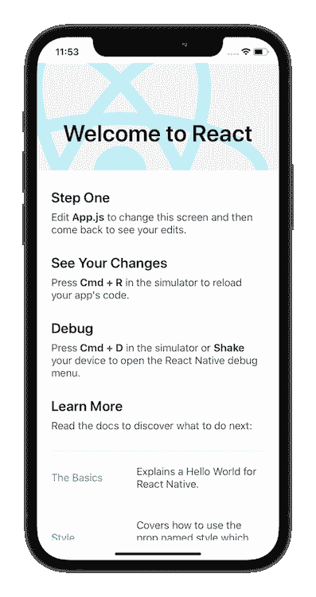
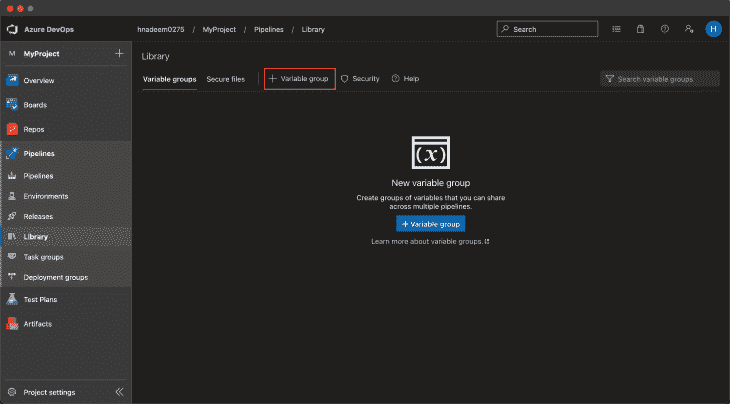
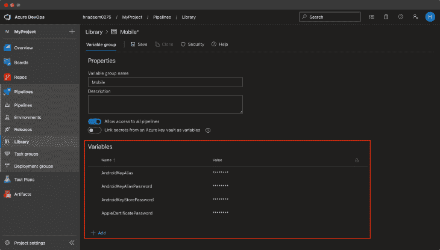
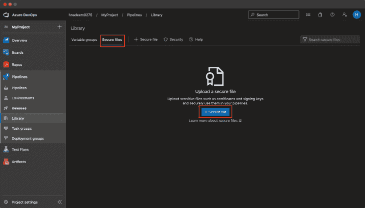
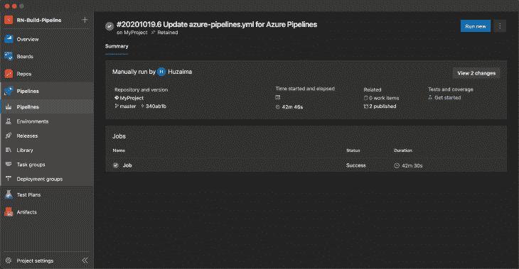

# 使用 Azure DevOps 持续部署 React 原生应用程序

> 原文：<https://blog.logrocket.com/continuous-deployment-of-react-native-app-with-azure-devops/>

## 在 React Native 中部署您的应用

部署是软件开发工作流程的一部分，很容易实现自动化。自动化部署可以消除许多错误，让您专注于重要的事情。

在 React Native 中，你通常必须在两个平台上部署应用程序:Android 和 iOS。两个平台使用不同的语言和构建工具。在本教程中，我们将通过 [Azure DevOps](https://azure.microsoft.com/en-us/services/devops/) 在 [App Center](https://appcenter.ms/) 上构建一个 React 原生应用的持续部署管道。

## 设置您的 React 本地项目

首先，您需要设置一个 React 原生项目。遵循 [React Native 的官方安装指南](https://reactnative.dev/docs/environment-setup)并使用以下命令引导项目:

```
npx react-native init MyProject

```

以上命令完成后，使用以下命令导航到新创建的项目目录:

```
cd MyProject

```

然后，使用`yarn android`构建项目——如果你安装了 Android 或者如果你想在 iOS 上测试它，使用`yarn ios`。构建完成后，您应该会看到以下屏幕:



现在我们需要将代码推送到 Azure DevOps。前往 Azure DevOps，在那里使用官方指南创建一个新项目。

我们需要将项目代码推送到这个项目的 Git repo。在项目目录中，运行以下命令:

```
git remote add origin <YOUR_AZURE_DEVOPS_REPO_URL>
git push -u origin --all

```

一旦您的代码被推送到 Azure DevOps，我们需要在编写部署脚本之前注意一些事情。首先，我们需要更改 Android 的 gradle 文件，以便它可以将来自命令行的构建参数作为参数。然后，我们需要将所有的 Android/iOS 证书和密钥上传到 Azure DevOps。在回购中保守秘密从来都不是一个好的做法。

## 在 Android 中更改 gradle 文件

在您的`android/build.gradle`文件中执行以下更改:

```
diff --git a/android/build.gradle b/android/build.gradle
index ed5a568..5cfd558 100644
--- a/android/build.gradle
+++ b/android/build.gradle
@@ -1,11 +1,25 @@
 // Top-level build file where you can add configuration options common to all sub-projects/modules.

 buildscript {
+
+    def getMyVersionCode = { ->
+        def code = project.hasProperty('versionCode') ? versionCode.toInteger() : 1
+        println "VersionCode is set to $code"
+        return code
+    }
+
+    def getMyVersionName = { ->
+        def name = project.hasProperty('versionName') ? versionName : "1.0"
+        println "VersionName is set to $name"
+        return name
+    }
     ext {
         buildToolsVersion = "29.0.2"
         minSdkVersion = 16
         compileSdkVersion = 29
-        targetSdkVersion = 29
+        targetSdkVersion = 29       
+        versionName = getMyVersionName()
+        versionCode = getMyVersionCode()
     }
     repositories {
         google()

```

接下来，在您的`android/app/build.gradle`文件中添加以下更改:

```
diff --git a/android/app/build.gradle b/android/app/build.gradle
index 64f4347..5774b17 100644
--- a/android/app/build.gradle
+++ b/android/app/build.gradle
@@ -132,8 +132,8 @@ android {
         applicationId "com.myproject"
         minSdkVersion rootProject.ext.minSdkVersion
         targetSdkVersion rootProject.ext.targetSdkVersion
-        versionCode 1
-        versionName "1.0"
+        versionCode rootProject.ext.versionCode
+        versionName rootProject.ext.versionName
     }
     splits {
         abi {

```

## 向 Azure DevOps 添加秘密

首先，按照 [React Native 的官方指南创建一个生产签名密钥](https://reactnative.dev/docs/signed-apk-android#generating-an-upload-key)，并获得一个`.keystore`文件和凭证。其次，使用您的 Apple 帐户生成 iOS 凭据(预置描述文件和签名证书)。进入 **Azure DevOps →您的项目→管道→库**，创建一个新的变量组，如下图所示:





接下来进入 **Azure DevOps →你的项目→ Pipelines →库**上传 iOS 签名证书和 provision profile，以及 Android 的签名密钥，如下图截图所示:



## 编写 Azure 部署管道脚本

现在，我们都设置了必要的配置。让我们开始编写 Azure 管道脚本。

在项目的根目录下，创建一个新文件:

```
touch azure-pipelines.yml

```

在这个文件中，首先，我们将告诉脚本应该何时执行。我将在主分支上的每次提交时触发它。有许多方法可以触发脚本。基于分支名称，或者当新标签被推送时，等等。可能性是无穷的。在官方文件中有一个你可以使用的触发器的综合[列表。将以下几行添加到文件中:](https://docs.microsoft.com/en-us/azure/devops/pipelines/build/triggers?view=azure-devops)

```
trigger:
  branches:
    include:
      - master

```

之后，我们需要定义我们将使用我们刚刚在**管道→库**中设置的环境变量和安全文件。在当前文件的末尾添加以下几行:

```
variables:
  - group: Mobile # change it to the name you have set

```

现在让我们告诉操作系统我们想要运行这个脚本。因为 iOS 只能在 MacOS 上构建，而 Android 可以在所有平台上构建，所以最好只使用 MacOS，因为它可以适应两种平台。在当前文件的末尾添加以下几行:

```
pool:
  vmImage: 'macos-latest'

```

请一个接一个地遵循这些步骤:

1.  **结帐**:回购的结帐代码。

    ```
    - checkout: self     persistCredentials: true     clean: true
    ```

2.  **安装节点**:安装所需版本的 [Node.js](https://nodejs.org/) 。

    ```
    - task: [email protected]     displayName: 'Install Node'     inputs:       versionSpec: '12.19.0' # you can use your desired version here
    ```

3.  **安装依赖项**:安装`package.json`中列出的依赖项。

    ```
    - script: yarn install     displayName: Install Dependencies
    ```

4.  **碰撞版本并设置变量**:碰撞`package.json`中的`version`，并将该版本设置为环境变量，作为构建版本在后面的步骤中使用。

    ```
    - script: |       # Disable autocommit on version bump        yarn config set version-sign-git-tag false       yarn config set version-git-tag false       yarn config set version-commit-hooks false       # Checkout branch where the build is triggered       git checkout $(Build.SourceBranchName)       # Extract existing version of package.json       oldVer=$(jq -r ".version" package.json)       # Bump version       yarn version --patch       # Add bumped version to staging       git add *       # Extract new version of package.json       newVer=$(jq -r ".version" package.json)       # Set environment variables       echo "##vso[task.setvariable variable=OLD_VERSION]$oldVer"       echo "##vso[task.setvariable variable=NEW_VERSION]$newVer"     displayName: 'Bump version and set variables'
    ```

5.  **凹凸 iOS 版本**:iOS 项目中的凹凸版本。

    ```
    - task: [email protected]     displayName: 'Bump iOS version'     inputs:       sourcePath: 'ios/MyProject/Info.plist'       versionCodeOption: 'buildid'       versionCode: '$(Build.BuildId)'       versionName: '$(NEW_VERSION)'       printFile: false
    ```

6.  **构建未签名的 APK** :构建未签名的 APK。签名将在下一步完成。您可以看到我们是如何将`NEW_VERSION`作为参数传递给 Gradle 构建脚本的。

    ```
    - task: [email protected]     displayName: 'Build APK'     inputs:       gradleWrapperFile: 'android/gradlew'       workingDirectory: 'android/'       options: '-PversionName=$(NEW_VERSION) -PversionCode=$(Build.BuildId)'       tasks: 'assembleRelease'       publishJUnitResults: false       javaHomeOption: 'JDKVersion'       jdkVersionOption: '1.8'       gradleOptions: '-Xmx3072m'       sonarQubeRunAnalysis: false
    ```

7.  **签署 APK** :使用我们存储在**管道→库**中的密钥库文件和密码签署 APK。`AndroidKeyStorePassword`、`AndroidKeyAlias`、`AndroidKeyAliasPassword`来自图书馆。确保这些名称与您在库中设置相匹配。

    ```
    - task: [email protected]     displayName: 'Sign APK'     inputs:       apkFiles: 'android/app/build/outputs/apk/release/*.apk'       apksignerKeystoreFile: 'mobile-prod.keystore'       apksignerKeystorePassword: '$(AndroidKeyStorePassword)'       apksignerKeystoreAlias: '$(AndroidKeyAlias)'       apksignerKeyPassword: '$(AndroidKeyAliasPassword)'       zipalign: true
    ```

8.  **将 APK 发布到工件**:对于前面步骤中生成的 APK，我们需要将其发布到工件，因为我们需要在后面的步骤中访问它，以便将其上传到应用程序中心。

    ```
    - task: [email protected]     displayName: 'Publish APK to artifacts'     inputs:       PathtoPublish: 'android/app/build/outputs/apk/release'       ArtifactName: 'android'       publishLocation: 'Container'
    ```

9.  **上传 APK 到应用中心**:上传 APK 到应用中心。在这里，`appSlug`可以在 app Center 上从你的 App 的网址中找到，`distributionGroupId`可以在 App Center 上从你的 App 的分发组中找到。

    ```
    - task: [email protected]     displayName: 'Upload APK to AppCenter'     inputs:       serverEndpoint: 'App Center'       appSlug: 'hnadeem/MyProject-Android'       appFile: 'android/app/build/outputs/apk/release/app-release-unsigned.apk'       releaseNotesOption: 'file'       isMandatory: true       destinationType: 'groups'       distributionGroupId: 'f940ccde-a812-4ade-98d8-76c3ab1d0c2e'       isSilent: true
    ```

10.  **Bump commit** :目前为止，我们已经在`package.json`、Android、iOS 项目中更新了版本。现在我们需要提交这些更改。

    ```
    - script: |       tag="mobile_$(NEW_VERSION)"       echo "New tag $tag"       git add *       git commit -m "Update version from $(OLD_VERSION) to $(NEW_VERSION)"       git tag $tag       git pull --rebase origin $(Build.SourceBranchName)       git push origin $(Build.SourceBranchName)       git push --tags     displayName: Bump commit
    ```

11.  **安装苹果证书**:从我们在**管道→库**上传的证书来看，我们需要在构建 iOS app 之前安装签名证书。`AppleCertificatePassword`来自图书馆。请确保此名称与您在资源库中设置的名称相匹配。

    ```
    - task: [email protected]     displayName: Install Apple Certificate     inputs:       certSecureFile: 'MobileProd.p12'       certPwd: '$(AppleCertificatePassword)'       keychain: 'temp'       deleteCert: true
    ```

12.  **安装苹果预置描述文件**:根据我们在**管道→库**上传的证书，我们需要在构建 iOS 应用之前安装预置描述文件。

    ```
    - task: [email protected]     displayName: 'Install Apple Provisioning Profile'     inputs:       provisioningProfileLocation: 'secureFiles'       provProfileSecureFile: 'MyProject.mobileprovision'       removeProfile: true
    ```

13.  **安装 CocoaPods** :安装完前面步骤中的所有依赖项后，我们还需要安装 pod。

    ```
    - task: [email protected]     displayName: 'Install CocoaPods'     inputs:       workingDirectory: 'ios'
    ```

14.  **构建 IPA** :对于构建 iOS，您可以看到我们如何使用`APPLE_CERTIFICATE_SIGNING_IDENTITY`和`APPLE_PROV_PROFILE_UUID`，它们是由 Azure DevOps 基于我们之前提供证书的步骤自动填充的。

    ```
    - task: [email protected]     displayName: 'Build IPA'     inputs:       actions: 'build'       configuration: 'Release'       sdk: 'iphoneos'       xcWorkspacePath: 'ios/MyProject.xcworkspace'       scheme: 'MyProject'       packageApp: true       exportPath: 'output'       signingOption: 'manual'       signingIdentity: '$(APPLE_CERTIFICATE_SIGNING_IDENTITY)'       provisioningProfileUuid: '$(APPLE_PROV_PROFILE_UUID)'
    ```

15.  **复制 IPA** :在发布到工件之前，我们需要将 IPA 复制到暂存目录。

    ```
    - task: [email protected]     displayName: 'Copy IPA'     inputs:       contents: '**/*.ipa'       targetFolder: '$(build.artifactStagingDirectory)'       overWrite: true       flattenFolders: true
    ```

16.  **将 IPA 发布到工件**:对于前面步骤中生成的 IPA，我们需要将其发布到工件，因为我们需要在后面的步骤中访问它，以便将其上传到 App Center。

    ```
    - task: [email protected]     displayName: 'Publish IPA to artifacts'     inputs:       PathtoPublish: '$(build.artifactStagingDirectory)'       ArtifactName: 'ios'       publishLocation: 'Container'
    ```

17.  **上传 IPA 到应用中心**:上传 APK 到应用中心。在这里，`appSlug`可以在 app Center 上从你的 App 的网址中找到，`distributionGroupId`可以在 App Center 上你的 App 的分发组中找到。

    ```
    - task: [email protected]     displayName: 'Upload IPA to AppCenter'     inputs:       serverEndpoint: 'App Center'       appSlug: 'hnadeem/MyProject-iOS'       appFile: 'output/MyProject.ipa'       releaseNotesOption: 'file'       isMandatory: true       destinationType: 'groups'       distributionGroupId: '058a4704-ea24-4877-a2f0-bdfaff9335dc'       isSilent: true
    ```

脚本部分大概就是这样！这是本教程的完整`azure-pipelines.yml`:

```
trigger:
  branches:
    include:
      - master
variables:
  - group: Mobile # change it to the name you have set
pool:
  vmImage: 'macos-latest'
steps:
  - checkout: self
    persistCredentials: true
    clean: true
  - task: [email protected]
    displayName: 'Install Node'
    inputs:
      versionSpec: '12.19.0' # you can use your desired version here
  - script: yarn install
    displayName: Install Dependencies
  - script: |
      # Disable autocommit on version bump 
      yarn config set version-sign-git-tag false
      yarn config set version-git-tag false
      yarn config set version-commit-hooks false
      # Checkout branch where the build is triggered
      git checkout $(Build.SourceBranchName)
      # Extract existing version of package.json
      oldVer=$(jq -r ".version" package.json)
      # Bump version
      yarn version --patch
      # Add bumped version to staging
      git add *
      # Extract new version of package.json
      newVer=$(jq -r ".version" package.json)
      # Set environment variables
      echo "##vso[task.setvariable variable=OLD_VERSION]$oldVer"
      echo "##vso[task.setvariable variable=NEW_VERSION]$newVer"
    displayName: 'Bump version and set variables'
  - task: [email protected]
    displayName: 'Bump iOS version'
    inputs:
      sourcePath: 'ios/MyProject/Info.plist'
      versionCodeOption: 'buildid'
      versionCode: '$(Build.BuildId)'
      versionName: '$(NEW_VERSION)'
      printFile: false
  - task: [email protected]
    displayName: 'Build APK'
    inputs:
      gradleWrapperFile: 'android/gradlew'
      workingDirectory: 'android/'
      options: '-PversionName=$(NEW_VERSION) -PversionCode=$(Build.BuildId)'
      tasks: 'assembleRelease'
      publishJUnitResults: false
      javaHomeOption: 'JDKVersion'
      jdkVersionOption: '1.8'
      gradleOptions: '-Xmx3072m'
      sonarQubeRunAnalysis: false
  - task: [email protected]
    displayName: 'Sign APK'
    inputs:
      apkFiles: 'android/app/build/outputs/apk/release/*.apk'
      apksignerKeystoreFile: 'mobile-prod.keystore'
      apksignerKeystorePassword: '$(AndroidKeyStorePassword)'
      apksignerKeystoreAlias: '$(AndroidKeyAlias)'
      apksignerKeyPassword: '$(AndroidKeyAliasPassword)'
      zipalign: true
  - task: [email protected]
    displayName: 'Publish APK to artifacts'
    inputs:
      PathtoPublish: 'android/app/build/outputs/apk/release'
      ArtifactName: 'android'
      publishLocation: 'Container'
  - task: [email protected]
    displayName: 'Upload APK to AppCenter'
    inputs:
      serverEndpoint: 'App Center'
      appSlug: 'hnadeem/MyProject-Android'
      appFile: 'android/app/build/outputs/apk/release/app-release-unsigned.apk'
      releaseNotesOption: 'file'
      isMandatory: true
      destinationType: 'groups'
      distributionGroupId: 'f940ccde-a812-4ade-98d8-76c3ab1d0c2e'
      isSilent: true
  - script: |
      tag="mobile_$(NEW_VERSION)"
      echo "New tag $tag"
      git add *
      git commit -m "Update version from $(OLD_VERSION) to $(NEW_VERSION)"
      git tag $tag
      git pull --rebase origin $(Build.SourceBranchName)
      git push origin $(Build.SourceBranchName)
      git push --tags
    displayName: Bump commit
  - task: [email protected]
    displayName: Install Apple Certificate
    inputs:
      certSecureFile: 'MobileProd.p12'
      certPwd: '$(AppleCertificatePassword)'
      keychain: 'temp'
      deleteCert: true
  - task: [email protected]
    displayName: 'Install Apple Provisioning Profile'
    inputs:
      provisioningProfileLocation: 'secureFiles'
      provProfileSecureFile: 'MyProject.mobileprovision'
      removeProfile: true
  - task: [email protected]
    displayName: 'Install CocoaPods'
    inputs:
      workingDirectory: 'ios'
  - task: [email protected]
    displayName: 'Build IPA'
    inputs:
      actions: 'build'
      configuration: 'Release'
      sdk: 'iphoneos'
      xcWorkspacePath: 'ios/MyProject.xcworkspace'
      scheme: 'MyProject'
      packageApp: true
      exportPath: 'output'
      signingOption: 'manual'
      signingIdentity: '$(APPLE_CERTIFICATE_SIGNING_IDENTITY)'
      provisioningProfileUuid: '$(APPLE_PROV_PROFILE_UUID)'
  - task: [email protected]
    displayName: 'Copy IPA'
    inputs:
      contents: '**/*.ipa'
      targetFolder: '$(build.artifactStagingDirectory)'
      overWrite: true
      flattenFolders: true
  - task: [email protected]
    displayName: 'Publish IPA to artifacts'
    inputs:
      PathtoPublish: '$(build.artifactStagingDirectory)'
      ArtifactName: 'ios'
      publishLocation: 'Container'
  - task: [email protected]
    displayName: 'Upload IPA to AppCenter'
    inputs:
      serverEndpoint: 'App Center'
      appSlug: 'hnadeem/MyProject-iOS'
      appFile: 'output/MyProject.ipa'
      releaseNotesOption: 'file'
      isMandatory: true
      destinationType: 'groups'
      distributionGroupId: '058a4704-ea24-4877-a2f0-bdfaff9335dc'
      isSilent: true

```

现在是时候将我们的提交推送到主分支，以查看这个部署脚本的运行情况。

这里您可以看到作业在主分支上运行，并且发布了两个工件。



## 结论

这是一篇关于如何在 Azure DevOps 上为 React 原生项目建立持续部署管道的简短教程。使用持续部署，您将摆脱人为错误并节省大量时间。任何新的开发人员都将能够开始项目工作，而不必担心部署问题。

## [LogRocket](https://lp.logrocket.com/blg/react-native-signup) :即时重现 React 原生应用中的问题。

[](https://lp.logrocket.com/blg/react-native-signup)

[LogRocket](https://lp.logrocket.com/blg/react-native-signup) 是一款 React 原生监控解决方案，可帮助您即时重现问题、确定 bug 的优先级并了解 React 原生应用的性能。

LogRocket 还可以向你展示用户是如何与你的应用程序互动的，从而帮助你提高转化率和产品使用率。LogRocket 的产品分析功能揭示了用户不完成特定流程或不采用新功能的原因。

开始主动监控您的 React 原生应用— [免费试用 LogRocket】。](https://lp.logrocket.com/blg/react-native-signup)