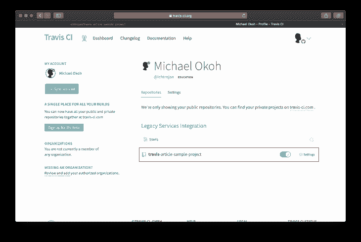
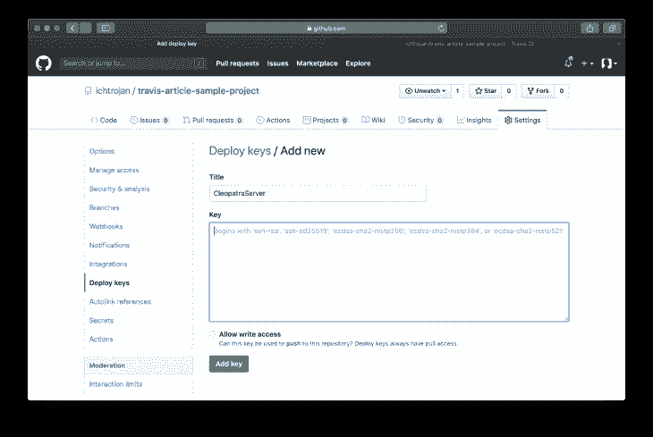
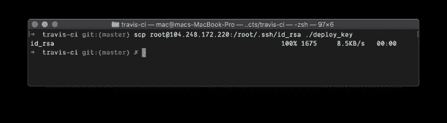
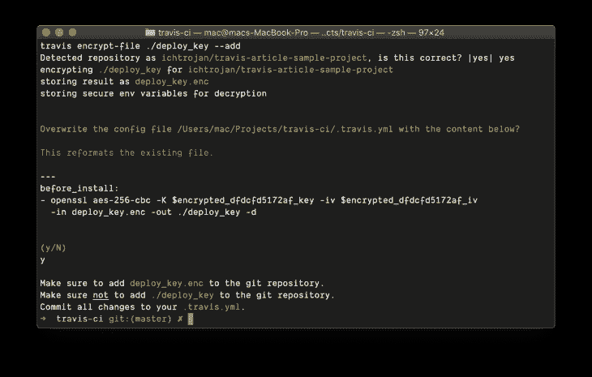
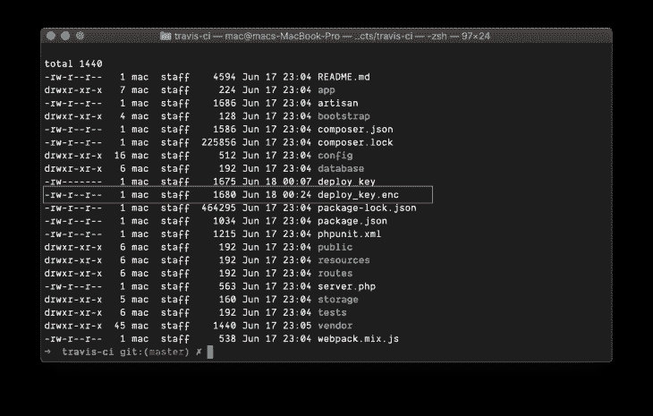
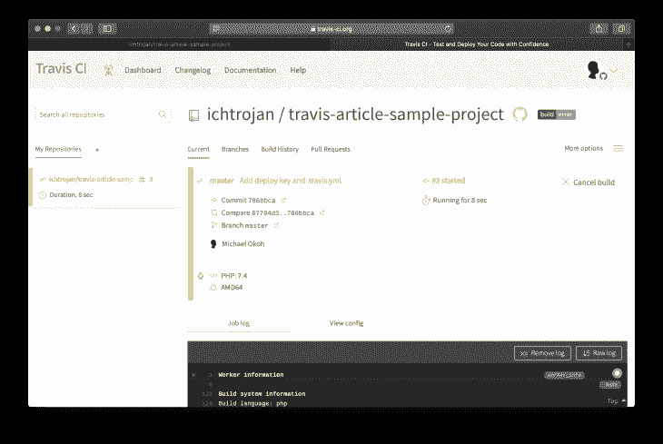
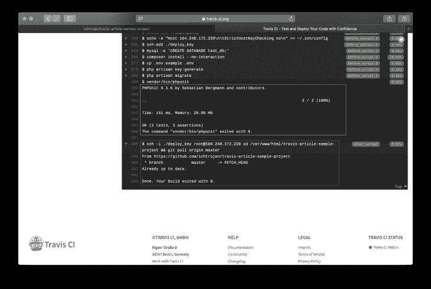
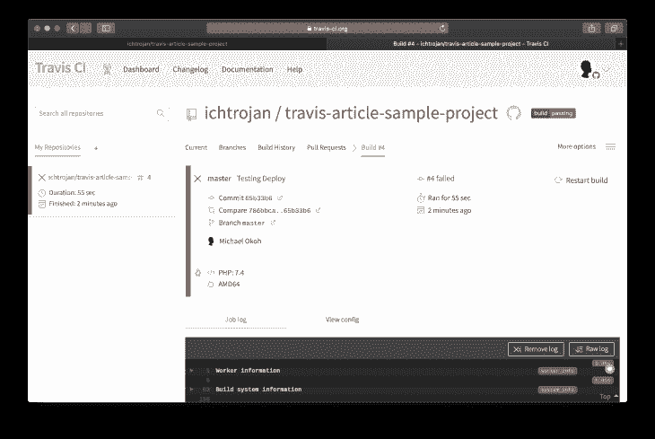
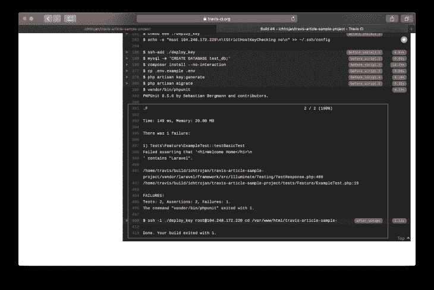
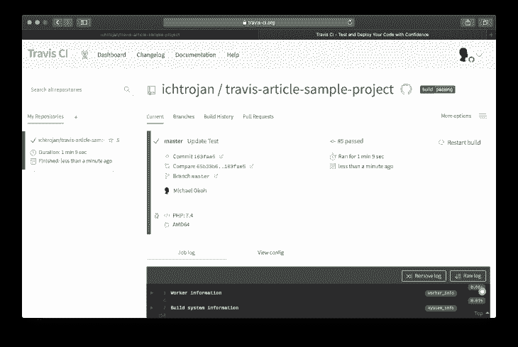

# 与 Travis CI 的持续集成和部署

> 原文：<https://blog.logrocket.com/continuous-integration-and-deployment-with-travis-ci/>

[Travis CI](https://travis-ci.org) 是一款流行的[持续集成和持续部署工具](https://www.mabl.com/blog/what-is-cicd)，用于构建、测试和部署应用程序的代码库。在本文中，我们将部署一个 Laravel 应用程序，它具有正确模拟代码集成和解释 Travis CI 的线性过程的测试。

## 先决条件

要关注这篇文章，你需要:

## 陷害特拉维斯

在您的浏览器上，访问 [Travis CI](https://travis-ci.com/) 并使用您的 GitHub 帐户创建一个帐户。您必须将您的存储库与 Travis CI 同步，当您这样做时，您将看到一个存储库列表。从存储库列表中，选择要为其启用 Travis CI 的存储库:


单击“设置”以查看此存储库的 Travis CI 定制:


您可以使用设置来配置触发 CI/CD 流程的不同活动，默认设置对我们来说很好。

## 生成并保存主机的 SSH 密钥

要生成 SSH 密钥，请通过 SSH 登录到您的服务器:

```
ssh {SERVER_USER}@{SERVER_IP}
```

> 注意:`{SERVER_USER}`是授权登录的服务器用户。`{SERVER_IP}`是服务器的 IP 地址。

进入主机后，我们要做的第一件事是为当前用户设置一个 SSH 密钥，稍后我们将下载并保存在本地机器上。

要开始，请运行:

```
cd ~/.ssh && ssh-keygen -t rsa -b 4096 -C "TravisArticle"
```

您将得到一系列提示，您可以一直点击`enter`来接受默认值，之后，您应该将您的 SSH 密钥保存在`~/.ssh/`目录中。

接下来，将该密钥作为授权密钥添加到服务器上。这是必要的，以便允许使用我们生成的密钥连接到主机。要添加密钥，请运行:

```
cat id_rsa.pub >> authorized_keys
```

该命令应该在`~/.ssh`目录下执行。之后，输出`id_rsa.pub`中存储的公钥内容:

```
cat id_rsa.pub
```

上面的命令将在您的控制台上输出公钥的内容。你会在你的控制台上看到随机的文本，从头到尾标记它并复制它，你会在下一个阶段需要它。

## 将公钥添加到 GitHub 存储库中

转到 GitHub 上的存储库设置页面，将刚才复制的文本添加为该存储库的部署密钥。这是为了确保不需要用户名或密码就可以将更改从 repo 提取到服务器:



返回到服务器终端窗口，将目录更改为`/var/www`:

```
cd /var/www
```

接下来，克隆存储库。我们将使用 SSH 来克隆存储库，以避免被提示输入凭证。这是必要的，因为当 Travis CI 流程运行时，我们没有机会交互式地键入凭据:

```
git clone [email protected]:ichtrojan/travis-article-sample-project.git
```

这将克隆存储库。作为一个 Laravel 应用程序，我将继续使用 [composer](https://getcomposer.org) 安装依赖项，并设置我的环境变量，确保网站按预期运行。这超出了本文的范围，所以我们今天不讨论它。

## 下载私钥

为了确保 Travis 可以连接到我们的服务器并启动更新服务器上内容的拉进程，我们将使用`scp`命令。

将目录更改为在本地计算机上设置项目的位置。接下来，执行:

```
scp {SERVER_USER}@{SERVER_IP}:/home/{SERVER_USER}/.ssh/id_rsa ./deploy_key
```



This will download the `id_rsa` private key to your current directory as `deploy_key`. Immediately the download is done, add `deploy_key` to `.gitignore` by executing:

```
echo 'deploy_key' > .gitignore
```

这将确保您不会意外地将文件提交给存储库。将私钥提交给源代码可能会暴露私钥，任何有权访问它的人都可以访问主机。

## 使用 Travis CLI 工具加密下载的私钥

我们要做的第一件事是创建一个`.travis.yml`文件，定义 Travis 将如何处理我们的集成和部署过程。在项目目录中运行以下命令:

```
touch .travis.yml
```

接下来，通过运行以下命令登录 Travis CLI:

```
travis login --org
```

运行上面的命令时，会出现一个提示，要求您输入用户名和密码，输入所需的凭证，然后按 enter。通过执行以下命令来加密在上一步中下载的私钥:

```
travis encrypt-file ./deploy_key --add
```



这个命令一执行，`.travis.yml`文件就会被更新，内容如下:

```
before_install:
  - openssl aes-256-cbc -K $encrypted_db82b94960d2_key -iv $encrypted_db82b94960d2_iv
    -in deploy_key.enc -out ./deploy_key -d
```

这条线负责解密我们加密的私钥。这一行将在我们的部署过程开始之前运行，以便我们可以访问私钥。

另外，在同一个目录中会生成一个`deploy_key.enc`文件。此文件将被添加到您的存储库中:



## 测试 Travis 构建和部署流程

我们接下来要做的是测试特拉维斯。在这种情况下，我要做的第一件事是更新项目目录根目录下的`.travis.yml`文件。

这个更新将定义 Travis 在测试和部署我们的应用程序时将使用的所有流程。以下是新内容的外观:

```
language: php
php:
  - 7.4
services:
  - mysql
before_script:
  - mysql -e 'CREATE DATABASE test_db;'
  - composer install --no-interaction
  - cp .env.example .env
  - php artisan key:generate
  - php artisan migrate
addons:
  ssh_known_hosts:
    - {SERVER_IP}
branches:
  only:
  - master
script:
  - vendor/bin/phpunit
after_script:
  - ssh -i ./deploy_key {SERVER_USER}@{SERVER_IP} cd /var/www/travis-ci-article && git pull origin master
before_install:
  - openssl aes-256-cbc -K $encrypted_240bf24cdcde_key -iv $encrypted_240bf24cdcde_iv -in deploy_key.enc -out ./deploy_key -d
  - eval "$(ssh-agent -s)"
  - chmod 600 ./deploy_key
  - echo -e "Host {SERVER_IP}\n\tStrictHostKeyChecking no\n" >> ~/.ssh/config
  - ssh-add ./deploy_key

```

让我们来看看这些附加功能将会做什么，有些是 PHP 特有的，而有些则是为了本文的目的。这第一行表示我们打算部署的语言以及我们首选的版本号:

```
language: php
php:
  - 7.4
...
```

下一步定义我希望 Travis 在我们的构建过程中包含的服务。在这种情况下，我们将 MySQL 作为我们的数据库:

```
...
services:
  - mysql
...

```

该部分定义了我们希望在运行`script`部分中的动作之前执行的命令，这些命令是 PHP/Laravel 特定的。如果您正在部署用另一种语言编写的应用程序，您可以用特定于语言的设置命令来替换这些命令:

```
...
before_script:
  - mysql -e 'CREATE DATABASE test_db;'
  - composer install --no-interaction
  - cp .env.example .env
  - php artisan key:generate
  - php artisan migrate
...
```

该命令创建一个名为`test_db`的新数据库:

```
mysql -e 'CREATE DATABASE test_db;'
```

此命令使用 composer 安装所有软件包和依赖项，无需交互:

```
composer install --no-interaction
```

该命令会将`.env.example`的内容复制到`.env`中:

```
cp .env.example .env
```

该命令将生成 Laravel 应用程序安全密钥:

```
php artisan key:generate
```

最后，该命令将运行数据库迁移:

```
php artisan migrate
```

将您的服务器 IP 地址添加到 Travis 的已知主机中，这对我们要部署到的服务器非常有用，并允许 Travis 安全地进行通信:

```
...
addons:
  ssh_known_hosts:
    - {SERVER_IP}
...
```

这一部分指示 Travis 只注意`master`分支，这样所有的构建过程将只针对主分支执行。您可以有一个特殊的部署过程，该过程仅在推送特定分支时发生，在这种情况下，这一部分非常有用:

```
...
branches:
  only:
  - master
...

```

这是我们正在运行的脚本，它的作用是运行测试。如果该脚本以非`0`的代码退出，即失败，部署过程将不会启动:

```
...
script:
  - vendor/bin/phpunit
...

```

Travis 完成设置我们的构建运行所在的容器后，它立即运行，如果您注意的话，这是我们的`Deploy Process`的所有准备工作发生的地方。我们在那里设置了一切，使我们的部署过程能够成功:

```
before_install:
  - openssl aes-256-cbc -K $encrypted_240bf24cdcde_key -iv $encrypted_240bf24cdcde_iv -in deploy_key.enc -out ./deploy_key -d
  - eval "$(ssh-agent -s)"
  - chmod 600 ./deploy_key
  - echo -e "Host {SERVER_IP}\n\tStrictHostKeyChecking no\n" >> ~/.ssh/config
  - ssh-add ./deploy_key
```

这一部分展示了我们的部署流程。重要的是要注意，这个部分只有在`after_script`部分声明的所有内容都完成并以`0`退出时才运行，失败的测试不会以`0`结束部署过程而退出。

这就是持续集成的力量所在。它线性地遵循*构建、测试、部署*周期。如果一个失败，下一个将不被处理。如果任何测试失败，部署过程将不会发生。有了这个，您可以严密地监控您的发布，并确保您发布的是您想要的。这使您能够在软件中发现错误，从而最大限度地减少错误:

```
after_script:
  - ssh -i ./deploy_key {SERVER_USER}@{SERVER_IP} cd /var/www/travis-ci-article && git pull origin master

```

通过 SSH 可以立即访问目标服务器，我们运行一系列命令，如下所示:

```
cd /var/www/travis-ci-article && git pull origin master
```

这两个命令基本上进入`/var/www/travis-ci-article`目录并运行`git pull origin master`,它从项目的主分支提取变更。

为了完成这个过程并测试我们的*构建、测试和部署*过程，在如上所示更新您的`.travis.yml`文件后提交您的更改并推送到您的主分支。

当您推送 Github 时，Travis 会立即收到关于您的推送的信息，并开始构建和部署过程:



如果一切顺利，您将看到绿色指示:



在上面的图片中，红框显示了运行测试的部分，它显示所有的测试都通过了，并以代码`0`退出。如果测试失败，退出代码将不是`0`，这将把构建过程标记为`failed`。

## 故障测试

我们可以进行一些更改，这些更改将导致测试失败并暂停 CI 流程，这将阻止部署过程的进行。

为此，我们需要修改位于`resources/views`目录中的`home.blade.php`。将那里的`Welcome Home`文本改为`Laravel`。

```
<div class="title m-b-md">
    Laravel
</div>
```

我们的测试将会失败，因为它期望文本在`div`到`Laravel`之间。当这样的失败发生时，你会得到类似这样的东西:


如果您向下滚动查看细节，您将看到构建以一个`Non-zero`退出代码退出，这是测试失败的结果。对于上面的失败，状态如下所示:



添加变更以更新失败的测试，然后使其通过，导致构建过程再次通过。这导致再次获得成功的构建屏幕:



## 结论

至此，您应该对如何使用 Travis CI 设置持续集成和持续部署管道有了清晰的了解，按照本教程，我们在最佳条件下测试了我们的设置，并且在出现问题时测试了故障。

Travis 为软件提供强大的持续集成。我们能够在本文中涵盖一个简单的过程，尽管不同的构建过程可能会根据您想要实现的目标而变得更加复杂。我希望您能够对如何使用 Travis 执行基本的构建、测试和部署过程有所了解。确保你不只是读了这篇文章而没有尝试你的，我相信你会喜欢它。

## 使用 [LogRocket](https://lp.logrocket.com/blg/signup) 消除传统错误报告的干扰

[](https://lp.logrocket.com/blg/signup)

[LogRocket](https://lp.logrocket.com/blg/signup) 是一个数字体验分析解决方案，它可以保护您免受数百个假阳性错误警报的影响，只针对几个真正重要的项目。LogRocket 会告诉您应用程序中实际影响用户的最具影响力的 bug 和 UX 问题。

然后，使用具有深层技术遥测的会话重放来确切地查看用户看到了什么以及是什么导致了问题，就像你在他们身后看一样。

LogRocket 自动聚合客户端错误、JS 异常、前端性能指标和用户交互。然后 LogRocket 使用机器学习来告诉你哪些问题正在影响大多数用户，并提供你需要修复它的上下文。

关注重要的 bug—[今天就试试 LogRocket】。](https://lp.logrocket.com/blg/signup-issue-free)