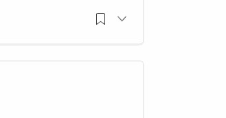
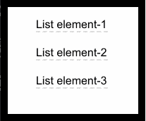

# 用 React 中的组件控制工具提示和弹出菜单

> 原文：<https://blog.logrocket.com/controlling-tooltips-pop-up-menus-using-compound-components-in-react-ccedc15c7526/>

***编者按:**本帖更新于 2021 年 2 月 1 日。*

在与图标、按钮或文本的交互背后隐藏更多的信息是一个让你的界面干净整洁的好方法。这就是 React 工具提示和弹出菜单发挥作用的地方。

本文将向您介绍我在 React 中实现工具提示控制器组件所遵循的方法。虽然我称之为 tooltip，但它可以是当 DOM 中的元素通过单击或悬停进行交互时，您想要显示的任何内容。



一个从中等弹出菜单的例子。

我在这里将只涉及基本原理。但是，如果您有兴趣查看详细的功能，请查看完整项目的 [GitHub 资源库。](https://github.com/dbilgili/React-Tooltip-Controller)

## 工具提示控制器组件的要求是什么？

让我们首先列出工具提示控制器组件的一些基本要求。

#### 您的工具提示组件应该无缝集成到现有的 JSX 标记中

能够将组件集成到您现有的 JSX 中而不引入额外的 HTML 元素(如`<span>`)是很重要的，因为它不会影响 JSX 的输出和样式。

#### 你的工具提示应该出现在所有其他元素之上

很明显，工具提示不应该出现在 DOM 中任何其他元素的下面。在某些情况下，使用 z-index 可能对您没有帮助，因为它的使用并不像看起来那么简单。因此，工具提示应该出现在`<span>`的最底部，以保证它在 DOM 树顶部的层次结构。

#### 你的工具提示应该是交互式的

被动的工具提示只显示文本或图像，通常不需要任何交互。它甚至可能会在被点击时关闭。但是上面显示的例子，举例来说，要求工具提示在被点击使用按钮/链接时保持活动状态。

考虑下面的代码块，并假设我们想要在一个`<li>`元素上创建一个交互。

```
// vim: syntax=JSX

render() {
  return (
    <div className="App">
      <div>
        <ul>
          <li>List element-1</li>
          <li>List element-2</li>
          <li>List element-3</li>
        </ul>
      </div>
    </div>
  )
}
```

将这个特定的`<li>`元素与我们想要控制的工具提示组件包装在一起，是我们将遵循的方法。

```
// vim: syntax=JSX

render() {
  return (
    <div className="App">
      <div>
        <ul>
          <li>List element-1</li>
          <Controller>
            <Select><li>List element-2</li></Select>
            <Tooltip/>
          </Controller>
          <li>List element-3</li>
        </ul>
      </div>
    </div>
  )
}
```

这将使我们能够灵活地完全控制所选的元素和工具提示组件或包含在`<Controller>`组件中的 JSX 标记。

我们可以添加事件监听器、控制样式、获取位置信息等等。当一个或几个组件被另一个组件包装时，这种设计模式通常被称为复合组件。

## 创建复合组件

我们将创建两个组件:`<Controller>`和`<Select>`。

将保存我们想要相互交流的代码部分:工具提示和选中的元素。`<Select>`另一方面，组件将只处理选中的 DOM 元素，它将控制工具提示。

## 使用 React APIs

由于`<Controller>`组件将包装两个子组件，我们将使用下面的 React APIs 来处理这些子组件。

### `React.Children`

`React.Children`是 React APIs 之一，用于处理组件的子道具，这意味着组件包装的任何东西都可以作为组件内的道具来访问。用`this.props.children`调用`React.Children`上的`map`方法有助于我们迭代它并从中创建一个新的修改过的子数组。

### `React.cloneElement`

这个 API 创建一个输入的克隆，并返回一个新的 react 元素。将此与`React.Children`结合起来，我们就能够操作将要实现的`<Controller>`组件的子组件。

### `ReactDOM.createPortal`

由于我们的目标是将工具提示组件安装在`body`的最底部，我们需要以某种方式防止 React 在默认情况下将它附加到最近的父节点。门户是 React 提供的原生解决方案。我们可以指定在 DOM 中的什么位置安装哪个元素。

## `Controller`组件的基本结构

在我们开始实现详细的功能之前，让我们快速看一下`<Controller>`组件的基本结构。

```
// vim: syntax=JSX

import React from 'react'
import ReactDOM from 'react-dom'

class Controller extends React.Component{
  render(){
    const { children } = this.props

    const inputChildren = React.Children.map(children, child => {
      if(child.type.displayName === "Select"){
        return React.cloneElement(child)
      }
      else{
        return ReactDOM.createPortal(React.cloneElement(child), document.body)
      }
    })
    return inputChildren
  }
}

export default Controller
```

注意使用带有`map`函数的`React.Children`来迭代所有子节点，并返回带有`React.cloneElement`的每个子节点的克隆。

另外，`React.createPortal`的使用很简单，它获取克隆的孩子并将其呈现给`document.body`，后者返回 DOM 中的`<body>`元素。

注意，为了区分`<Controller>`的子元素，我使用了`displayName`属性，稍后它将被定义为`<Select>`组件中的静态属性。

## React 中工具提示组件的功能

下一步是添加以下功能。

1.  将事件侦听器添加到所选元素，以便控制工具提示
2.  相对于选定元素定位工具提示
3.  检测在工具提示组件外部单击以关闭它
4.  防止工具提示冒泡事件，这样当点击它时它不会关闭

### 1.打开工具提示


Connecting the tooltip component to an element.

首先创建`<Controller>`的状态:

```
// vim: syntax=JSX

state = {
  isOpen: false,
  style: {
    position: "absolute",
    top: 0,
    left: 0,
  }
}
```

`isOpen`用于安装和卸载工具提示组件/JSX 标记，`style`用于相对于*选中元素*定位工具提示。默认情况下，工具提示相对于正文绝对定位。因此，通过获取*所选元素*的位置和大小信息，我们可以相对于它定位工具提示。

现在，创建控制工具提示状态的函数:

```
// vim: syntax=JSX

open = () => {
  this.setState({isOpen: true})
}

close = () => {
  this.setState({isOpen: false})
}
```

接下来，使用`isOpen`和`style`状态分别显示/隐藏和定位工具提示组件。此外，还需要将`open()`函数作为道具传递给`<Select>`组件，这样当选中的元素被单击时，我们可以显示工具提示。

```
// vim: syntax=JSX

render(){
  const { children } = this.props
  const { isOpen, style } = this.state

  const inputChildren = React.Children.map(children, child => {
    if(child.type.displayName === "Select"){
      return React.cloneElement(child, {open: this.open})
    }
    else{
      return (
        isOpen && ReactDOM.createPortal(
          <span style={style}>{React.cloneElement(child)}</span>, document.body
        )
      )
    }
  })
  return inputChildren
}
```

`React.cloneElement`的第二个参数是我们传递给`<Select>`组件的新道具。

让我们看看`<Select>`组件，看看我们如何处理克隆的孩子和道具。

* * *

### 更多来自 LogRocket 的精彩文章:

* * *

```
// vim: syntax=JSX

import React from 'react'

class Select extends React.Component{
  static displayName = "Select"

  render(){
    const { children, open } = this.props
    return React.cloneElement(children, {onClick: open})
  }
}

export default Select
```

注意我们之前在`<Controller>`中使用的`displayName`的静态定义。

虽然我们可以简单地在`<Select>`组件的渲染方法中做`return children`，但是`cloneElement` API 的使用让我们能够用`onClick`事件处理程序创建子道具的新克隆。

我们将`open`属性分配给这个`onClick`事件处理程序来调用`<Controller>`组件中的`open()`函数，其结果是，在屏幕的左上角显示工具提示。

现在，是时候获取`<Select>`组件中克隆的子元素的位置和大小信息了，并将这些数据传递回`<Controller>`，以便与`style`状态一起使用来定位工具提示。

### 2.定位工具提示


Positioning the tooltip relative to an element.

获取元素在`<Select>`组件中的位置需要使用`ref`属性。ReactJS 有自己的创建 refs 的方法。一旦使用`React.createRef()`定义了一个`ref`，并将其附加到一个元素上，就可以在整个组件中引用它。

```
// vim: syntax=JSX

constructor(){
  super()
  this.selectedElement = React.createRef()
}

render(){
  const { children, open } = this.props
  return React.cloneElement(children, {ref: this.selectedElement, onClick: open})
}
```

在`selectedElement` ref 上调用`getBoundingClientRect()`方法会返回元素的位置和大小信息。我们将通过在`<Select>`上部署一个函数作为道具，把这个信息从`<Select>`组件传递给`<Controller>`组件。

```
// vim: syntax=JSX

getPos = (left, top, height) => {
  this.setState(prevState => ({style: {...prevState.style, left, top: top + height}}))
}

// return React.cloneElement(child, {open: this.open, getPos: this.getPos})
```

一旦`getPos()`函数作为道具可用于`<Select>`组件，在`componentDidMount`生命周期挂钩内调用它将更新`<Component>`的`style`状态变量，并将工具提示定位在所选元素的左下方。

```
// vim: syntax=JSX

state = {
  isOpen: false,
  style: {
    position: "absolute",
    top: 0,
    left: 0,
  }
}
```

### 3.关闭工具提示


Toggling the tooltip.

到目前为止，我们通过一个*选择的元素*来控制工具提示，并相对于这个元素来定位它。现在，下一件事是实现当在工具提示之外单击时关闭工具提示的机制。

监听`window`对象上的点击事件并切换`isOpen`状态变量非常简单。然而，这种方法需要一些小技巧才能正常工作。

考虑下面来自`<Controller>`组件的片段。

```
// vim: syntax=JSX

componentDidUpdate(){
  if(this.state.isOpen){
    window.addEventListener('click', this.close)
  }
  else{
    window.removeEventListener('click', this.close)
  }
}
```

当组件更新时，我们根据工具提示的状态为`window`对象添加或删除一个事件监听器。但是，这种尝试会导致工具提示几乎同时打开和关闭。

对于这个问题，我想到了两种不同的解决方案:

1.  不是同时监听`open()`和`close()`函数的`click`事件，而是分别监听`close()`和`open()`函数的`mousedown`和`mouseup`来阻止调用`close()`函数，因为它监听的是在工具提示打开之前发生的`mousedown`事件。然而，如果您试图通过点击选中的元素来关闭工具提示，这种方法就会失败。
2.  就其背后的推理而言，第二种方法更先进一些。使用具有`0`毫秒延迟或没有定义任何时间延迟的`setTimeout`方法，将下一个事件循环要执行的新任务排队。虽然使用`0`毫秒通常描述了一个应该立即执行的任务，但 JavaScript 的单线程同步特性并非如此。当使用`setTimeout`时，它只是创建一个异步回调。您可以参考具体的 [MDN web 文档](https://developer.mozilla.org/en-US/docs/Web/JavaScript/EventLoop#Zero_delays)了解关于该主题的详细说明。

下面的代码片段确保在执行了与*所选元素*的交互任务后，将添加或删除事件监听器。

```
// vim: syntax=JSX

componentDidUpdate(){
  setTimeout(() => {
    if(this.state.isOpen){
      window.addEventListener('click', this.close)
    }
    else{
      window.removeEventListener('click', this.close)
    }
  }, 0)
}
```

虽然点击*选中的元素*会调用`open()`函数，但是`window`对象上的事件监听器会在此之后调用`close()`函数并关闭工具提示。

### 4.防止事件冒泡



防止事件在工具提示上冒泡。

如前所述，在某些特定情况下，您可能需要防止工具提示在被点击时关闭。点击工具提示调用`close()`函数的原因是**事件冒泡**的结果。

当一个事件(比如`onClick`)发生在一个元素上时，它也会在父元素和所有其他祖先元素上被调用。在我们的例子中，由于 tooltip 是`body`的子节点，并且`body`附加了一个 click 事件，单击 tooltip 最终会调用附加到`body`上的 click 事件的函数。

为了防止这种现象，我们需要在子元素的 click 处理程序上明确指定事件不应该向上冒泡到祖先。

我们需要在`onClick`事件处理程序上使用`event.stopPropagation()`方法来阻止`onClick`事件在 DOM 中进一步传播。

```
// vim: syntax=JSX

return (
  isOpen && ReactDOM.createPortal(
    <span onClick={e => e.stopPropagation()} style={style}>{React.cloneElement(child)}</span>, document.body
  )
)
```

## 结论

通读本文后，您应该熟悉提到的 React APIs，并对如何利用和组合它们来构造复合组件以完成更具体的任务有一个总体的想法。让不同的组件在内部相互交流可以让你的代码更加结构化和有目的。

## 使用 LogRocket 消除传统反应错误报告的噪音

[LogRocket](https://lp.logrocket.com/blg/react-signup-issue-free)

是一款 React analytics 解决方案，可保护您免受数百个误报错误警报的影响，只针对少数真正重要的项目。LogRocket 告诉您 React 应用程序中实际影响用户的最具影响力的 bug 和 UX 问题。

[ ](https://lp.logrocket.com/blg/react-signup-general) [  ](https://lp.logrocket.com/blg/react-signup-general) [LogRocket](https://lp.logrocket.com/blg/react-signup-issue-free)

自动聚合客户端错误、反应错误边界、还原状态、缓慢的组件加载时间、JS 异常、前端性能指标和用户交互。然后，LogRocket 使用机器学习来通知您影响大多数用户的最具影响力的问题，并提供您修复它所需的上下文。

关注重要的 React bug—[今天就试试 LogRocket】。](https://lp.logrocket.com/blg/react-signup-issue-free)