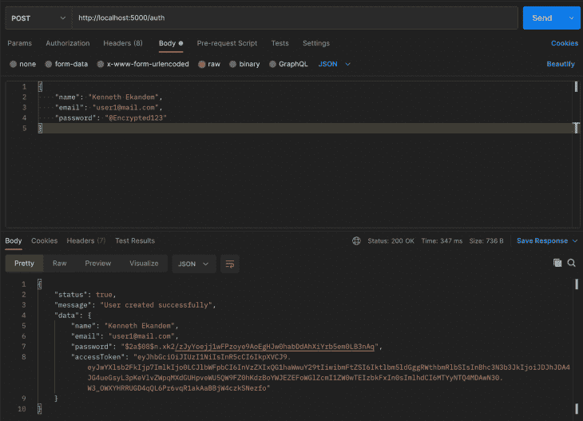
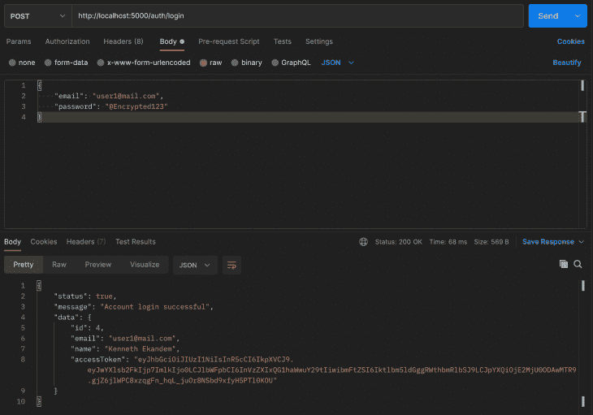
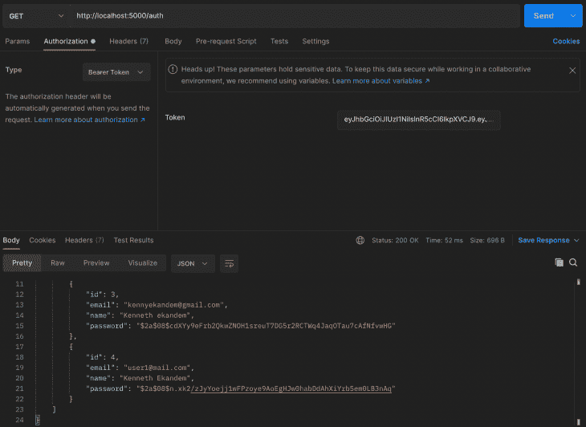

# 在 Express 中用 Prisma 设计认证方案

> 原文：<https://blog.logrocket.com/crafting-authentication-schemes-with-prisma-in-express/>

在我们开始本教程之前，我们首先要了解 Prisma 是什么，以及为什么它是新手开发者的好选择。我们还将讨论 PostgreSQL，以及如何将它用于数据库模式和结构化。

我们还将了解 Prisma 的有效性，以及如何使用它进行基本的身份验证，还有代码示例和测试示例来帮助您完成本教程。

## Prisma 是什么？

Prisma 是一个开源的 ORM，可以让你轻松地管理你的数据库并与之交互。这是通过 [Prisma schema](https://www.prisma.io/docs/concepts/components/prisma-schema) 完成的，在这里你可以使用 Prisma schema 语言定义你的数据库模型和关系。

您可以从头开始运行您的模式，或者通过自省现有数据库来生成它。然后，您可以使用 Prisma Client 与您的数据库进行交互，并使用 Prisma Migrate 将您的模式迁移到数据库。

Prisma 支持 PostgreSQL、MySQL、SQLite 和 Microsoft SQL Server。Prisma 与每个 Node.js 后端框架交互，使数据库管理和迁移变得容易。

## 用 Prisma 在 Express 中构建认证方案

首先，我们将设置一个 Express 应用程序并添加 Prisma。然后，我们将使用 JWT 等第三方包进行基于令牌的身份验证，以创建一个身份验证方案。最后，我们将介绍如何运行测试，并确保我们的身份验证方案正确运行。

### 先决条件

要学习本教程，您应该具备这些技术的应用知识，以及安装在您计算机上的最新版本:

## 设置 Express

要安装 Express，我们必须首先使用 npm 初始化我们的应用程序。为此，请在您的终端中运行以下代码:

```
mkdir express-prisma
cd express-prisma

npm init -y

```

然后，我们可以在新创建的应用程序中使用 npm 安装 Express，代码如下:

```
npm install express

```

接下来，我们使用 Docker 设置 PostgreSQL。

为此，我们将使用以下 composer 命令创建一个新的 Docker 文件:

```
nano docker-compose.yml

```

然后在我们的`docker-compose.yml`文件中，我们可以添加下面的代码来连接数据库:

```
version: '3.8'
services:
  postgres:
    image: postgres:10.3
    restart: always
    environment:
      - POSTGRES_USER=sammy
      - POSTGRES_PASSWORD=your_password
    volumes:
      - postgres:/var/lib/postgresql/data
    ports:
      - '5432:5432'
volumes:
  postgres:

```

请注意，`POSTGRES_USER`和`POST_PASSWORD`是预设的用户名和密码，将用于访问数据库。

## 安装和配置 Prisma

当我们的 Express 应用程序的安装和配置完成后，我们现在可以继续使用 npm 将 Prisma 安装到我们的应用程序中。为此，只需使用下面的命令:

```
npx prisma init

```

这将创建一个包含`schema.prisma`文件的新 Prisma 文件夹，如果不存在的话，还会创建一个`.env`文件。

文件生成后，打开`.env`文件并添加一个到数据库的链接:

```
DATABASE_URL="postgresql://<NAME_OF_DATABASE>:<DATABASE_PASSWORD>@localhost:5432/express-prisma?schema=public"

```

确保使用您定制的数据库名称和密码。

现在我们已经完成了 Prisma 配置，我们可以创建一个 Prisma 模式并添加我们的身份验证方案。

## 创建 Prisma 模式

我们将从创建一个模式开始，该模式将包含将要迁移到数据库的用户参数。这些将使我们能够与他们互动，以完成认证。

要添加模式，转到`prisma/schema.prisma`文件并添加以下代码:

```
model User {
  id       Int     @id @default(autoincrement())
  email    String  @unique
  name     String?
  password String?
}

```

一旦完成，我们就可以运行我们的迁移，这将在数据库中创建表`user`并为其添加列。

要运行迁移，请将以下代码添加到您的终端并运行它:

```
npx prisma migrate dev --name "init" --preview-feature

```

如果迁移成功，将在之前创建的`prisma`文件夹中创建一个`migrations`文件夹。该文件夹将被称为`migrations`，并将包含一个 SQL 文件。

我的输出为`20210613163752_init/migration.sql`，文件`migration.sql`包含在模式中创建的 SQL 结构:

```
-- CreateTable
CREATE TABLE "User" (
    "id" SERIAL NOT NULL,
    "email" TEXT NOT NULL,
    "name" TEXT,
    "password" TEXT,
    PRIMARY KEY ("id")
);
-- CreateIndex
CREATE UNIQUE INDEX "User.email_unique" ON "User"("email");

```

## 使用 Prisma 客户端

Prisma Client 是一个自动生成的类型安全查询生成器，您可以使用它从 Node.js 或 TypeScript 应用程序中以编程方式读写数据库中的数据。您将在 REST API 路由中使用它进行数据库访问，取代传统的 ORM、普通 SQL 查询、定制数据访问层或任何其他与数据库对话的方法。

要在项目中安装 Prisma Client，只需在终端中输入以下命令并运行它:

```
npm install @prisma/client

```

这将使您能够在项目的任何地方使用 Prisma Client，从而允许您与数据库进行交互。

## 索引要求

Prisma 客户端设置完成后，我们可以继续添加控制器，它将与我们的路由(指向控制器中的指定功能)进行交互。我们还将添加我们的服务，这些服务与数据库或 Prisma 交互。

首先，我们将创建几个文件和文件夹来存放它们。首先是路线——我们将创建一个名为`routes`的文件夹，并添加我们的文件`index.js`和`auth.js`。

* * *

### 更多来自 LogRocket 的精彩文章:

* * *

然后，我们在根文件`index.js`中启动我们的 Express 服务器，并将路由指向`routes/index.js`。

接下来，我们要求 Prisma 客户端位于根文件`index.js`中:

```
const express = require('express');
require('@prisma/client');
const app = express();
require('dotenv').config();
const route = require('./routes');
const bodyParser = require('body-parser');
const multer = require('multer');
app.use(bodyParser.urlencoded({ extended: true }))
app.use(bodyParser.json())

// redirect to routes/index.js
const route = require('./routes');
app.use('/', route);

const port = process.env.PORT || 5000;
app.listen(port, () => {
    console.log(`server is running on port ${port}`);
});

```

## 索引路由

完成后，我们可以在`routes/index.js`文件中将我们的路线指向他们的各个目的地:

```
const express = require('express');
const router = express.Router();
const auth = require('./auth');
const createError = require('http-errors')
router.get('/', (req, res) => {
    res.send('Hello World!');
});
router.use('/auth', auth);
router.use( async (req, res, next) => {
    next(createError.NotFound('Route not Found'))
})
router.use( (err, req, res, next) => {
    res.status(err.status || 500).json({
        status: false,
        message: err.message
    })
})
module.exports = router;

```

如果您注意到了，我需要我的`index.js`文件中的`http-errors`包。这是因为我将使用它来拦截错误，并将其作为消息正确地传递给客户端。

要使用`http-errors`，您可以使用以下命令进行安装:

```
npm install http-errors

```

## 创建授权服务

我们需要创建一个服务文件，以便在数据库和控制器之间进行通信。在服务文件中，我们将创建三个函数:`register`、`login`和`all`，它们将向数据库注册一个新用户，获取用户的信息，并让用户登录。

`all`函数将获取所有用户，这只有在请求具有登录或注册期间生成的有效令牌时才会发生。

首先，我们将创建一个名为`services`的文件夹，然后在`services`文件夹中创建一个名为`auth.services.js`的文件。接下来，我们可以创建我们的`register`函数并安装 bcrypt 和 JWT，用于密码散列和生成令牌。

要安装 bcrypt 和 JWT，请在您的终端上输入以下命令并运行它:

```
npm install bcryptjs jsonwebtoken

```

安装完成后，我们将创建一个名为`utils`的文件夹，以便添加我们的 JWT 函数，稍后我们将使用它来生成令牌。

在我们的`utils`文件夹中，创建一个名为`jwt.js`的文件，并添加以下函数:

```
const jwt = require('jsonwebtoken')
const createError = require('http-errors')
require('dotenv').config()
const accessTokenSecret = process.env.ACCESS_TOKEN_SECRET
module.exports = {
    signAccessToken(payload){
        return new Promise((resolve, reject) => {
            jwt.sign({ payload }, accessTokenSecret, {
            }, (err, token) => {
                if (err) {
                reject(createError.InternalServerError())
                }
                resolve(token)
            })
        })
    },
    verifyAccessToken(token){
        return new Promise((resolve, reject) => {
            jwt.verify(token, accessTokenSecret, (err, payload) => {
                if (err) {
                    const message = err.name == 'JsonWebTokenError' ? 'Unauthorized' : err.message
                    return reject(createError.Unauthorized(message))
                }
                resolve(payload)
            })
        })
    }
}

```

然后在我们的`.env`文件中，我们添加我们的`ACCESS_TOKEN_SECRET`:

```
ACCESS_TOKEN_SECRET=<CUSTOM_ACCESS_TOKEN>

```

然后我们可以返回到`auth.service.js`并要求我们的 JWT 文件以及 bcrypt 和 Prisma:

```
// services/auth.service.js

const { PrismaClient } = require('@prisma/client');
const prisma = new PrismaClient();

require('dotenv').config();
const bcrypt = require('bcryptjs');
const jwt = require('../utils/jwt');

```

接下来，创建我们的`register`函数，向数据库添加一个新用户:

```
class AuthService {
  static async register(data) {
        const { email } = data;
        data.password = bcrypt.hashSync(data.password, 8);
        let user = prisma.user.create({
            data
        })
        data.accessToken = await jwt.signAccessToken(user);

        return data;
    }
}

module.exports = authService;

```

同时，我们还可以添加我们的`login`和`all`函数:

```
// services/auth.service.js

static async login(data) {
        const { email, password } = data;
        const user = await prisma.user.findUnique({
            where: {
                email
            }
        });
        if (!user) {
            throw createError.NotFound('User not registered')
        }
        const checkPassword = bcrypt.compareSync(password, user.password)
        if (!checkPassword) throw createError.Unauthorized('Email address or password not valid')
        delete user.password
        const accessToken = await jwt.signAccessToken(user)
        return { ...user, accessToken }
    }
    static async all() {
        const allUsers = await prisma.user.findMany();
        return allUsers;
    }

```

## 创建授权控制器

为了从我们的路由中获取请求体，我们将创建一个名为`controllers/auth.controller.js`的控制器，并添加我们的`register`、`login`和`all`函数来与我们各自的服务通信:

```
const auth = require('../services/auth.service');
const createError = require('http-errors');
class authController {
    static register = async (req, res, next) => {
        try {
            const user = await auth.register(req.body);
            res.status(200).json({
                status: true,
                message: 'User created successfully',
                data: user
            })
        }
        catch (e) {
            next(createError(e.statusCode, e.message))
        }
    }
    static login = async (req, res, next) => {
         try {
            const data = await auth.login(req.body)
            res.status(200).json({
                status: true,
                message: "Account login successful",
                data
            })
        } catch (e) {
            next(createError(e.statusCode, e.message))
        }
    }
    static all = async (req, res, next) => {
        try {
            const users = await auth.all();
            res.status(200).json({
                status: true,
                message: 'All users',
                data: users
            })
        }
        catch (e) {
            next(createError(e.statusCode, e.message))
        }
    }
}
module.exports = authController;

```

## 创建授权保护

在添加了控制器之后，我们可以添加我们的 guard，它将保护一些像`all`这样的路由免受未登录用户的攻击。这个安全措施将验证我们发布的 jwt，如果有效，将允许用户访问这些路由。

创建一个名为`middlewares/auth.js`的文件，并添加以下代码:

```
const jwt = require('../utils/jwt')
const createError = require('http-errors')
const auth = async (req, res, next) => {
    if (!req.headers.authorization) {
        return next(createError.Unauthorized('Access token is required'))
    }
    const token = req.headers.authorization.split(' ')[1]
    if (!token) {
        return next(createError.Unauthorized())
    }
    await jwt.verifyAccessToken(token).then(user => {
        req.user = user
        next()
    }).catch (e => {
        next(createError.Unauthorized(e.message))
    })
}
module.exports = auth;

```

上述代码将从`routes`中添加的`headers`中获取传递的令牌来验证 JWT，并返回一个`true`或`false`。

## 创建授权路线

现在，我们已经完成了控制器、服务和防护。我们现在可以打开我们的`routes/auth.js`文件并添加我们的路线:

```
const router = require('express').Router();
const user = require('../controllers/auth.controller');
const auth = require('../middlewares/auth');
// register
router.post('/', user.register);
// login
router.post('/login', user.login);
// all users
router.get('/', auth, user.all);
module.exports = router;

```

将`auth`保护添加到`all`路由中，以限制没有 jwt 的用户使用该路由。

## 测试

现在我们已经完成了应用程序的构建，我们可以测试它是否正常工作。我们将使用[邮递员](https://www.postman.com/)测试`register`、`login`和`all`路线。

### `Register`



正如上面的邮差截图所示，一旦你输入了你的邮箱、名字和密码，你就成功注册为新用户了。

### `Login`



当用户提供正确的电子邮件和密码时，他们将获得一个用于登录的访问令牌。这在请求中作为头传递，请求头中需要 jwt。

### `All users`



`all`路由是一个受保护的路由，仅适用于拥有有效令牌的用户。正如您在上面的屏幕截图中看到的，令牌被添加到带有属性`BearerToken`的头中。

## 包扎

在本教程中，我们已经完成了使用 Prisma 为数据库模式和迁移构建经过验证的服务器端应用程序的过程。然后，使用迁移的数据，我们可以注册并登录一个用户，并创建接受有效令牌的受保护路由。

对于更详细的代码库，您可以克隆[存储库](https://github.com/Kennethekandem/express-prisma.git)并对其进行配置。

## 使用 [LogRocket](https://lp.logrocket.com/blg/signup) 消除传统错误报告的干扰

[](https://lp.logrocket.com/blg/signup)

[LogRocket](https://lp.logrocket.com/blg/signup) 是一个数字体验分析解决方案，它可以保护您免受数百个假阳性错误警报的影响，只针对几个真正重要的项目。LogRocket 会告诉您应用程序中实际影响用户的最具影响力的 bug 和 UX 问题。

然后，使用具有深层技术遥测的会话重放来确切地查看用户看到了什么以及是什么导致了问题，就像你在他们身后看一样。

LogRocket 自动聚合客户端错误、JS 异常、前端性能指标和用户交互。然后 LogRocket 使用机器学习来告诉你哪些问题正在影响大多数用户，并提供你需要修复它的上下文。

关注重要的 bug—[今天就试试 LogRocket】。](https://lp.logrocket.com/blg/signup-issue-free)