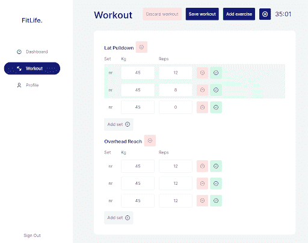
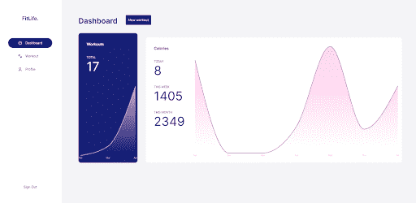

# 用 React 和 Firebase - LogRocket 博客创建一个健身追踪器

> 原文：<https://blog.logrocket.com/create-a-fitness-tracker-with-react-and-firebase/>

在本文中，我们将使用 React 和 Firebase 构建一个健身跟踪器 web 应用程序，这两种技术使我们能够高效地开发 web 应用程序。

这篇文章将使你能够用 React 和 Firebase 自己构建全栈应用。如果你知道 React 的基本知识，你就可以开始了。否则，我建议先解决这些问题。

注意，你可以在这里找到[完成的应用程序，在这里](https://fitlife-app.netlify.app/sign-in)找到这个项目的[源代码。](https://github.com/sanderdebr/FitLife/)


## 设置项目

让我们从用 [craco npm 包](https://www.npmjs.com/package/@craco/craco)覆盖一个新的 Create React 应用程序设置开始。 [Tailwind](https://www.npmjs.com/package/tailwindcss) 需要 craco 包来覆盖默认的 Create React 应用程序配置。

让我们也设置路由。我们将为我们的路由提供一个名为`layout`的额外参数，以便它们可以用正确的布局包装页面:

```
function RouteWrapper({ page: Page, layout: Layout, ...rest }) {
  return (
    <Route
      {...rest}
      render={(props) => (
        <Layout {...props}>
          <Page {...props} />
        </Layout>
      )}
    />
  );
}
```

我们将在本文后面添加身份验证和其他路由。在`App.js`里面，我们将归还我们的路由器。让我们继续用户会话。

## 使用 React 上下文验证用户会话

我们想知道用户是否在我们的应用程序中的任何地方被认证，而不必通过多个组件传递该信息。为此，我们将使用 React 的上下文 API。我们将用身份验证上下文包装我们的整个应用程序，以便我们可以从应用程序中的任何地方访问当前经过身份验证的用户。

首先，让我们创建 auth 上下文。

我们可以通过调用以下命令来创建新的上下文:

```
const AuthContext = createContext()
```

然后，我们将它提供给其他组件，就像这样:

```
<AuthContext.Provider value={user}>{children}</AuthContext.Provider>
```

在我们的例子中，我们希望订阅经过身份验证的 Firebase 用户。我们通过在导出的 Firebase auth 函数上调用`onAuthStateChanged()`方法来实现这一点:

```
 auth.onAuthStateChanged(user => { … });
```

这将为我们提供当前经过身份验证的用户。如果用户状态发生变化，比如登录或注销，我们希望相应地更新我们的上下文提供者。为了处理这个变化，我们将使用`useEffect`钩子。

我们的`AuthContext.jsx`看起来是这样的:

```
...
export function AuthProvider({ children }) {
  const [user, setUser] = useState(null);
  const [loading, setLoading] = useState(true);

  useEffect(() => {
    const unsubscribe = auth.onAuthStateChanged((user) => {
      setUser(user);
      setLoading(false);
    });

    return unsubscribe;
  }, []);

  const value = {
    user,
  };

  return (
    <AuthContext.Provider value={value}>
      {!loading && children}
    </AuthContext.Provider>
  );
}
```

我们可以调用`useAuth()`钩子从应用程序的任何地方返回当前的上下文值。我们现在提供的上下文值将在以后包含更多的功能，比如登录和注销。

### 创建登录和注册表单

为了能够登录用户，我们需要使用一个名为`signInWithEmailAndPassword()`的方法，它位于我们在 Firebase 文件中导出的 auth 对象上。

我们可以将它添加到我们的`AuthContext`提供者中，而不是直接访问这个方法，这样我们就可以轻松地将认证方法与被认证的用户结合起来。我们将把`signIn()`函数添加到我们的`AuthContext`提供者中，就像这样:

```
function signIn(email, password) {
    return auth.signInWithEmailAndPassword(email, password);
  }

  const value = {
    user,
    signIn,
  };

  return (
    <AuthContext.Provider value={value}>
      {!loading && children}
    </AuthContext.Provider>
  );
```

在我们的登录页面上，我们现在可以用我们的`useAuth()`钩子轻松访问`signIn()`方法:

```
const { signIn } = useAuth();
```

如果用户成功登录，我们会将他们重定向到位于家庭路由器路径上的仪表板。为了检查这一点，我们将使用一个 try-catch 块。

您应该会收到一条错误消息，说没有找到用户，因为我们还没有注册。如果是这样，太好了！这意味着我们的 Firebase 连接工作正常。

### 启用 Google 身份验证

首先，在 Firebase 控制台中启用 Google 身份验证。然后，将`signInWithGoogle`函数添加到认证上下文中:

```
function signInWithGoogle() {
    return auth.signInWithPopup(googleProvider);
}
```

接下来，我们将从 Firebase 文件导入`googleProvider`:

```
export const googleProvider = new firebase.auth.GoogleAuthProvider();
```

回到我们的登录页面，我们将添加以下代码来实现这一点:

```
const handleGoogleSignIn = async () => {
    try {
      setGoogleLoading(true);
      await signInWithGoogle();
      history.push("/");
    } catch (error) {
      setError(error.message);
    }

    setGoogleLoading(false);
  };
```

让我们继续构建我们的锻炼应用程序。

## 在健身应用程序中创建锻炼选项

### 选择练习

让我们创建实际的组件，称为`SelectExercise`。我们希望在这个组件中完成两件事。首先，我们想要呈现用户已经创建的锻炼列表，他们可以将该列表添加到他们的锻炼中。其次，我们希望给用户创建新练习的选项。

锻炼缩减器用锻炼状态包装我们的整个应用程序，以便我们可以从应用程序的任何地方访问它。每次用户更改健身程序时，`localStorage`都会更新，订阅该状态的所有组件也会更新。

我们将健身程序与派遣提供商分开，因为有些组件只需访问状态或派遣:

```
const WorkoutStateContext = createContext();
const WorkoutDispatchContext = createContext();

export const useWorkoutState = () => useContext(WorkoutStateContext);
export const useWorkoutDispatch = () => useContext(WorkoutDispatchContext);

export const WorkoutProvider = ({ children }) => {
  const [workoutState, dispatch] = useReducer(rootReducer, initializer);

  // Persist workout state on workout update
  useEffect(() => {
    localStorage.setItem("workout", JSON.stringify(workoutState));
  }, [workoutState]);

  return (
    <WorkoutStateContext.Provider value={workoutState}>
      <WorkoutDispatchContext.Provider value={dispatch}>
        {children}
      </WorkoutDispatchContext.Provider>
    </WorkoutStateContext.Provider>
  );
};
```

现在我们可以向我们的 reducer 分派动作了。这是 Redux 的一个概念，意思是我们希望锻炼状态随着我们提供的值而改变。

我们的`addExercise`函数看起来像这样:

```
const exercise = {
      exerciseName,
      sets: { [uuidv4()]: DEFAULT_SET },
    };

    dispatch({
      type: "ADD_EXERCISE",
      payload: { exerciseId: uuidv4(), exercise },
    });
```

它将`ADD_EXERCISE`动作分派给我们的 reducer，后者将给定的练习添加到我们的状态中。使用 [Immer](https://www.npmjs.com/package/immer) ，我们的减速器将看起来像这样:

```
 export const rootReducer = produce((draft, { type, payload }) => {
  switch (type) {
    ...
    case ACTIONS.ADD_EXERCISE:
      draft.exercises[payload.exerciseId] = payload.exercise;
      break;
    …
```

在我们的练习中，我们将使用对象的*对象，而不是使用对象数组。*

```
 case ACTIONS.UPDATE_WEIGHT:
      draft.exercises[payload.exerciseId].sets[payload.setId].weight =
        payload.weight;
      break;
```

这比我们每次更新状态时过滤一个数组要有效得多，因为 reducer 确切地知道要更新哪一项。

`SelectExercise`还必须能够添加一个练习到数据库中。所以，我们首先需要访问我们的 Firestore 数据库。

* * *

### 更多来自 LogRocket 的精彩文章:

* * *

以下是将新练习保存到数据库的功能:

```
const { user } = useAuth();
...
const saveExercise = async () => {
    if (!exerciseName) {
      return setError("Please fill in all fields");
    }

    setError("");

    try {
      await database.exercises.add({
        exerciseName,
        userId: user.uid,
        createdAt: database.getCurrentTimestamp(),
      });

      toggleShowCreateExercise();
    } catch (err) {
      setError(err.message);
    }
};
```

我们还想检索用户创建的数据库中存储的练习列表。我们不想用这些练习来包装我们的整个应用程序，所以我们将把它保存在我们的`SelectExercise`组件中。

为了检索数据库练习，我们不需要上下文 API。为了便于学习，我们将创建一个使用`useReducer`钩子来管理状态的定制钩子。这样，我们就有了有效的状态管理，可以在每次用户请求时检索最新的练习列表。

```
function useWorkoutDb() {
  const [workoutDbState, dispatch] = useReducer(reducer, initialState);

  const { user } = useAuth();

  useEffect(() => {
    dispatch({ type: ACTIONS.FETCHING_EXERCISES });

    return database.exercises
      .where("userId", "==", user.uid)
      .onSnapshot((snapshot) => {
        dispatch({
          type: ACTIONS.SET_EXERCISES,
          payload: snapshot.docs.map(formatDocument),
        });
      });
  }, [user]);

  useEffect(() => {
    dispatch({ type: ACTIONS.FETCHING_WORKOUTS });

    return database.workouts
      .where("userId", "==", user.uid)
      .onSnapshot((snapshot) => {
        dispatch({
          type: ACTIONS.SET_WORKOUTS,
          payload: snapshot.docs.map(formatDocument),
        });
      });
  }, [user]);

  return workoutDbState;
}
```

你可能会注意到我们的另一个`useReducer`的不同，我们使用对象的对象和 Immer 来改变状态。

现在，您应该能够添加一个练习，并在列表中看到它们。厉害！让我们继续锻炼计时器。

## 构建健身程序计时器

对于计时器，我们将创建一个名为`useTimer`的定制钩子。我们将设置每秒更新`secondsPassed`数字变量的时间间隔。我们的停止和暂停功能清除了从`0`重新开始的间隔。每一秒钟，我们都会更新用户的`localStorage`中的时间，这样用户就可以刷新屏幕，同时计时器仍能正常运行。

```
function useTimer() {
  const countRef = useRef();
  const [isActive, setIsActive] = useState(false);
  const [isPaused, setIsPaused] = useState(false);
  const [secondsPassed, setSecondsPassed] = useState(
    persist("get", "timer") || 0
  );

  useEffect(() => {
    const persistedSeconds = persist("get", "timer");
    if (persistedSeconds > 0) {
      startTimer();
      setSecondsPassed(persistedSeconds);
    }
  }, []);

  useEffect(() => {
    persist("set", "timer", secondsPassed);
  }, [secondsPassed]);

  const startTimer = () => {
    setIsActive(true);
    countRef.current = setInterval(() => {
      setSecondsPassed((seconds) => seconds + 1);
    }, 1000);
  };

  const stopTimer = () => {
    setIsActive(false);
    setIsPaused(false);
    setSecondsPassed(0);
    clearInterval(countRef.current);
  };

  const pauseTimer = () => {
    setIsPaused(true);
    clearInterval(countRef.current);
  };

  const resumeTimer = () => {
    setIsPaused(false);
    startTimer();
  };

  return {
    secondsPassed,
    isActive,
    isPaused,
    startTimer,
    stopTimer,
    pauseTimer,
    resumeTimer,
  };
}
```

计时器现在应该工作了。让我们继续实际的锻炼计划。

## 在 React 中创建健身方案

在我们的应用中，我们希望用户能够:

*   添加和删除练习
*   添加和移除集合
*   对于每组，增加重量和重复次数
*   对于每套器械包，标记为已完成或未完成



我们可以通过将动作分派到我们之前制作的减压器来更新我们的锻炼。为了更新权重，我们将调度以下操作:

```
dispatch({
      type: "UPDATE_WEIGHT",
      payload: {
        exerciseId,
        setId,
        newWeight,
      },
});
```

然后，我们的减速器将相应地更新状态:

```
case ACTIONS.UPDATE_WEIGHT:
      draft.exercises[payload.exerciseId].sets[payload.setId].weight =
        payload.weight;
```

reducer 知道要更新哪个记录，因为我们给了它`exerciseId`和`setId`:

```
<Button
                      icon="check"
                      variant={isFinished ? "primary" : "secondary"}
                      action={() =>
                        dispatch({
                          type: "TOGGLE_FINISHED",
                          payload: {
                            exerciseId,
                            setId,
                          },
                        })
                      }
/>
```

## 创建仪表板

仪表板由两个图表组成:总锻炼量和每天消耗的卡路里。我们还想显示今天、本周和本月的锻炼总量和卡路里。



这意味着我们想从数据库中检索所有的锻炼数据，这可以从我们的自定义`useWorkoutDb()`挂钩中获得:

```
const { isFetchingWorkouts, workouts } = useWorkoutDb();
```

我们已经可以显示锻炼的总量:

```
{isFetchingWorkouts ? 0: workouts.length}
```

### 每天、每周和每月燃烧的卡路里

如果健身程序已经更改，并且至少有一项运动，我们希望重新计算卡路里:

```
useEffect(() => {
  if (!isFetchingWorkouts && workouts.length) {
    calcCalories();
  }
}, [workouts])
```

对于每次锻炼，我们将检查日期是否与今天、本周或本月相同。

```
const formattedDate = new Date(createdAt.seconds * 1000);
const day = format(formattedDate, "d");
```

如果是这样，我们将相应地更新卡路里，方法是将其乘以该锻炼的分钟数:

```
const newCalories = CALORIES_PER_HOUR * (secondsPassed / 3600);

    if (dayOfYear === day) {
      setCalories((calories) => ({
        ...calories,
        today: calories.today + newCalories,
      }));
    }
} 

```

### 锻炼图表

我们想要一个简单的折线图，x 轴表示月份，y 轴表示卡路里数。给线下的区域设置样式也很好，所以我们将使用 [recharts](https://www.npmjs.com/package/recharts) `AreaChart`组件。我们简单的传递给它一个数据数组:

```
 <AreaChart data={data}>
```

接下来让我们格式化数据数组。为了让 recharts 知道它需要使用 x 轴的月份，我们将在我们的`AreaChart`中添加`<XAxis dataKey="month" />`。

为此，我们需要使用以下格式:

```
 [{ month: "Feb", amount: 13 }, ...]
```

我们希望显示过去三个月的锻炼量，即使这三个月没有锻炼。因此，让我们用过去三个月的数据填充一个数组，使用`date-fns`并将数量设置为`0`。

```
const [data, setData] = useState([]);
let lastMonths = [];

    const addEmptyMonths = () => {
      const today = new Date();

      for (let i = 2; i >= 0; i--) {
        const month = format(subMonths(today, i), "LLL");
        lastMonths.push(month);
        setData((data) => [...data, { month, amount: 0 }]);
      }
    };
```

### 创建卡路里图表

对于卡路里图表，我们希望显示上周每天的卡路里数。与`WorkoutChart`类似，我们用一个数组填充上周的数据，其中包含每天的`0`卡路里。

```
 let lastDays = [];

    const addEmptyDays = () => {
      const today = new Date();

      for (let i = 6; i >= 0; i--) {
        const day = format(subDays(today, i), "E");
        lastDays.push(day);
        setData((data) => [...data, { day, calories: 0 }]);
      }
    };
```

对于每次锻炼，我们将检查是否发生在过去七天内。如果是这样，我们将计算该锻炼消耗的卡路里数，并将其添加到我们的数据阵列中:

```
    const addCaloriesPerDay = () => {
      for (const { createdAt, secondsPassed } of workouts) {
        const day = format(new Date(createdAt.seconds * 1000), "E");
        const index = lastDays.indexOf(day);
        if (index !== -1) {
          const calories = CALORIES_PER_HOUR * (secondsPassed / 3600);

          setData((data) => {
            data[index].calories = data[index].calories + parseInt(calories);
            return data;
          });
        }
      }
    }; 

```

如果您保存了一个新的锻炼项目，现在您应该可以看到您的仪表盘统计数据和图表正在更新。

恭喜你，你已经建立了你的 React 健身应用程序！感谢您遵循本教程。

你可以在这里找到完成的应用: [fitlife-app.netlify.app](https://fitlife-app.netlify.app/) 。源代码可以在这里找到:【github.com/sanderdebr/FitLife/】T2

## 使用 LogRocket 消除传统反应错误报告的噪音

[LogRocket](https://lp.logrocket.com/blg/react-signup-issue-free)

是一款 React analytics 解决方案，可保护您免受数百个误报错误警报的影响，只针对少数真正重要的项目。LogRocket 告诉您 React 应用程序中实际影响用户的最具影响力的 bug 和 UX 问题。

[ ](https://lp.logrocket.com/blg/react-signup-general) [  ](https://lp.logrocket.com/blg/react-signup-general) [LogRocket](https://lp.logrocket.com/blg/react-signup-issue-free)

自动聚合客户端错误、反应错误边界、还原状态、缓慢的组件加载时间、JS 异常、前端性能指标和用户交互。然后，LogRocket 使用机器学习来通知您影响大多数用户的最具影响力的问题，并提供您修复它所需的上下文。

关注重要的 React bug—[今天就试试 LogRocket】。](https://lp.logrocket.com/blg/react-signup-issue-free)