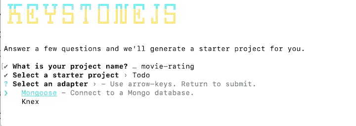
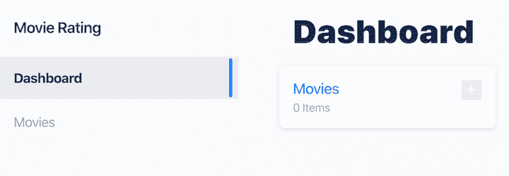
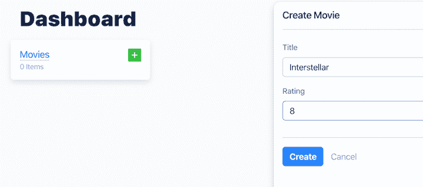
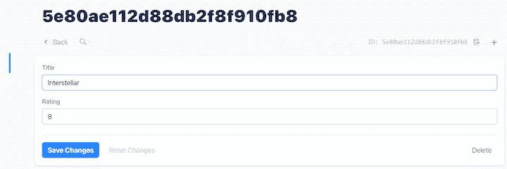
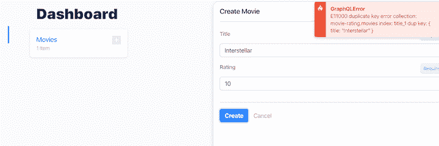
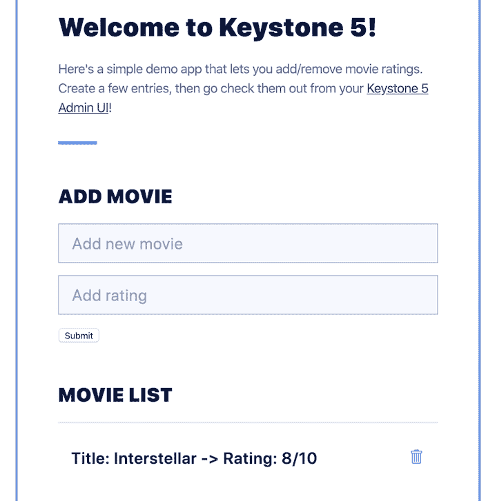

# 使用 Keystone.js 创建电影分级应用程序

> 原文：<https://blog.logrocket.com/create-a-movie-rating-app-with-keystone-js/>

WordPress 的一个有趣的替代品是一个用 Node.js 构建的内容管理系统(CMS ),它使用 T2 express . js 作为后端，使用 MongoDB 或 PostgreSQL 数据库作为存储层。它很灵活，使你能够在保持轻量级代码库的同时定制你的 CMS，除非 WordPress。

Keystone.js 提供了非常强大的 GraphQL 支持。您可以快速定义模式，GraphQL 引擎将负责与 PostgreSQL 或 MongoDB 的集成。

此外，Keystone.js 允许您选择想要使用的底层数据库。它本身支持 PostgreSQL 和 MongoDB，这使您能够在关系数据库和非关系数据库之间进行选择。GraphQL 将生成一组与 CRUD 操作相关的有用查询，因此您不必编写这些查询的代码。这是一个很棒的功能，可以节省你很多时间。

此外，Keystone Admin UI 会根据您定义的模式自动更改。所有数据都可以通过管理员用户界面创建、更新和删除。例如，如果您添加一个关于书籍的模式，Keystone.js 将生成一个完整的管理面板来管理您的书籍。另一个强大的功能，使开发人员的生活更容易。

在本教程中，我们将演示如何使用 Keystone.js 构建一个电影分级应用程序。您可以从这个 [GitHub 资源库](https://github.com/michielmulders/keystonejs-movie-rating-app)下载该项目的完整代码。

## 要求

在你[开始使用 Keystone.js](https://www.keystonejs.com/quick-start/#requirements) 之前，你需要以下内容。(注意:对于本教程，我们将使用 MongoDB)。

接下来，确保您的 MongoDB 实例正在运行。一旦你有了所有的依赖，是时候开始了。

您可以从一个 Keystone.js 模板开始，比如一个示例待办事项应用程序或一个身份验证示例。然而，出于本教程的目的，我们将从头开始。

## 步骤 1:项目设置

首先，使用`keystone-app`命令创建一个新的 Keystone 应用程序。您可以在 CLI 中直接使用这个命令和 Yarn。

```
yarn create keystone-app movie-rating

```

系统会提示您回答三个问题:

1.  项目名称是什么？输入`movie-rating`
2.  您希望使用哪个初学者模板？选择`blank`生成一个空模板
3.  您想使用哪个适配器？选择`Mongoose`。



该命令会将正确的项目文件复制到一个名为`movie-rating`的新文件夹中。您将得到下面的应用程序结构。

```
/movie-rating
- /node_modules
- index.js
- package.json
- README.md

```

现在让我们创建存储电影评级的数据模型。

## 步骤 2:创建数据模型

在这一步，我们将创建我们的数据模式。目前，我们的`index.js`文件看起来像下面的代码片段。既然已经连接了`MongooseAdapter`,我们可以专注于编写我们的模式。

```
const { Keystone } = require('@keystonejs/keystone');
const { GraphQLApp } = require('@keystonejs/app-graphql');
const { AdminUIApp } = require('@keystonejs/app-admin-ui');
const { MongooseAdapter: Adapter } = require('@keystonejs/adapter-mongoose');

const PROJECT_NAME = "movie-rating";

const keystone = new Keystone({
  name: PROJECT_NAME,
  adapter: new Adapter(),
});

module.exports = {
  keystone,
  apps: [new GraphQLApp(), new AdminUIApp({ enableDefaultRoute: true })],
};

```

查看[要点](https://gist.github.com/michielmulders/00853641fb7fb56aab51cf8d77351bae)上的源代码。

首先，我们需要安装`@keystonejs/fields`依赖项，它包含我们在模式中定义新字段所需的所有支持的字段类型。

通过 Yarn 安装此依赖关系:

```
yarn add @keystonejs/fields

```

现在我们已经将这个依赖项添加到了我们的项目中，我们可以导入所需的类型，`Text`和`Integer`。

```
const { Text, Integer } = require('@keystonejs/fields');

```

现在我们可以创建电影分级模式。模式将由两个属性组成:`title`，它接受一个`Text`类型，和`rating`，它接受一个`Integer`类型。

```
keystone.createList('Movie', {
  fields: {
    title: { 
      type: Text,
      isRequired: true,
      isUnique: true
    },
    rating: { 
      type: Integer,
      isRequired: true,
      defaultValue: 10
    }
  },
});

```

您可以为每个[字段](https://www.keystonejs.com/keystonejs/fields/)添加额外的属性。例如，您可以将`Integer`类型与`defaultValue` 属性结合起来。您还可以使用`isUnique`属性，该属性强制输入是唯一的。

对于这一步，您的代码应该如下所示。

## 第三步:开始你的项目并探索

使用以下命令启动项目。

```
yarn run dev

```

这将旋转以下元素:

首先，在[打开管理 UI http://localhost:3000/admin](http://localhost:3000/admin)。您将看到新创建的电影列表。



如果您点按“电影”卡片上的加号图标，您可以将新电影添加到列表中。例如，让我们添加“星际”，并将其评级为 8。



点击 create 按钮，将记录存储在 MongoDB 实例中。您将看到新创建记录的概述。



让我们再次尝试添加相同的记录。如果已经正确配置了`isUnique`属性，admin UI 应该会抛出一个错误。



### 图的力量

Keystone.js 将处理每个已定义的模式，例如电影模式。对于每个模式，它创建 [GraphQL CRUD 操作](https://www.keystonejs.com/guides/schema#lists)和相关的查询。我们可以使用所有这些查询来更改或访问 MongoDB 中的数据。

下面是为电影模式生成的操作的概述。

```
type Mutation {
  createMovie(..): Movie
  updateMovie(..): Movie
  deleteMovie(..): Movie
}

type Query {
  allMovies(..): [Movie]
  Movie(..): Movie // query single movie
  GetMovies(..): [Movie]
}

type Movie {
  id: ID
  title: String
  rating: Integer
}

```

关于 [GraphQL 模式定义语言(SDL)](https://graphql.org/learn/schema/) 的更多内容，请看官网。

后端部分完成后，下一步是创建一个与电影分级模式交互的接口。

## 步骤 4:创建接口

下一步是构建一个简单的静态 HTML 网站，允许您通过位于[http://localhost:3000/admin/API](http://localhost:3000/admin/api)的 GraphQL API 端点与数据进行交互。

要连接到静态页面，添加`@keystonejs/app-static`依赖项。

```
yarn add @keystonejs/app-static 

```

不要忘记在`index.js`文件的顶部导入依赖关系。

```
const { StaticApp } = require('@keystonejs/app-static');

```

可以看到，Keystone.js 将静态页面依赖定义为一个应用程序。这意味着我们可以将`StaticApp`对象添加到 apps 数组中，该数组在`index.js`文件的底部导出。

注意我们是如何配置`StaticApp`对象的:我们告诉该对象在`public`文件夹中寻找我们的静态页面，我们将在下一步中创建这个文件夹。这个文件夹存放我们将要创建的 HTML 文件。

```
module.exports = {
  keystone,
  apps: [
    new GraphQLApp(), 
    new StaticApp({ path: '/', src: 'public' }),
    new AdminUIApp({ enableDefaultRoute: true })
  ],
};

```

现在让我们在项目的根目录下创建`public`文件夹。

```
mkdir public

```

接下来，创建以下三个文件。

1.  `index.html` —保存所有的 HTML 代码
2.  `styles.css` —静态网站的基本样式
3.  `script.js` —保存与 GraphQL 端点交互和加载数据的逻辑

您的项目文件夹应该如下所示:

```
/movie-rating
- /node_modules
- /public
- index.html
- styles.css
- script.js
- index.js
- package.json
- README.md

```

### 添加样式

这不是绝对必要的一步，但是有一个漂亮的界面总是好的。你所要做的就是用下面的内容创建一个`styles.css`文件。

添加 HTML

### 将 HTML 添加到`index.html`文件中。一定要看一下`body`标签，在这里我们定义了我们的`script`元素。这个脚本充当了我们动态加载数据和获取静态 HTML 所需的所有逻辑的钩子。

接下来，将以下 HTML 内容复制到您的`index.html`文件中。

```
<body>
    <script type="text/javascript" id="movie-app" src="/script.js"></script>
 </body>

```

添加脚本逻辑

最重要的一步是添加逻辑。确保将全部内容复制到您的`script.js`文件中。

### Add script logic

步骤 5:理解 script.js 的逻辑

让我们从`script.js`文件的底部开始，试着理解上面的逻辑是如何工作的。这个逻辑替换了我们在`index.html`文件中定义的脚本标签的内容。下面的代码片段创建了一个简单的网站，该网站带有一个允许用户创建新的电影评级并显示所有提交的评级的表单。

## 呈现的界面将如下所示:



```
document.getElementById('movie-app').parentNode.innerHTML = `
  <div class="app">
    <h1 class="main-heading">Welcome to Keystone 5!</h1>
    <p class="intro-text">
      Here's a simple demo app that lets you add/remove movie ratings. Create a few entries, then go
      check them out from your <a href="/admin">Keystone 5 Admin UI</a>!
    </p>
    <hr class="divider" />
    <div class="form-wrapper">
      <h2 class="app-heading">Add Movie</h2>
      <div>
        <form class="js-add-movie-form">
          <input required name="add-item-movie" placeholder="Add new movie" class="form-input add-item" />
          <input required name="add-item-rating" placeholder="Add rating" class="form-input add-item" />
          <input type="submit" value="Submit">
        </form>
      </div>
      <h2 class="app-heading">Movie List</h2>
      <div class="results">
        <p>Loading...</p>
      </div>
    </div>
  </div>`;

```

用户可以通过表单提交电影。当您单击提交按钮时，将触发以下代码。

代码试图通过 id`add-item-movie`和`add-item-rating`访问表单输入字段中输入的数据。如果已经输入了电影标题和分级，我们将使用正确的数据调用我们的 GraphQL 端点。

注意，我们将`ADD_MOVIE`作为第一个参数传递。该常量表示使用 GraphQL SDL 开发的查询。该查询接受标题和评级。因为它以突变关键字为前缀，所以它可以向数据库添加新数据。

```
function addMovie(event) {
    event.preventDefault();
    const form = event.target;

    // Find inputted data via 'add-item-movie' and 'add-item-rating' input elements
    const movie = form.elements['add-item-movie'];
    const rating = form.elements['add-item-rating'];

    if (movie && rating) {
        graphql(ADD_MOVIE, { title: movie.value, rating: Number(rating.value) }).then(fetchData);
    }

    // Clear the form
    form.reset();
}

```

`GET_MOVIES`查询有助于检索所有电影。当我们读取数据时，我们使用查询关键字而不是突变关键字。该查询显示静态网站上的所有电影。

最后，`REMOVE_MOVIE`常量保存一个删除电影分级的查询。

```
const ADD_MOVIE = `
    mutation AddMovie($title: String!, $rating: Int!) {
      createMovie(data: { title: $title, rating: $rating }) {
        title
        rating
        id
      }
    }
  `;

```

但是我们实际上如何访问 GraphQL 端点呢？`script.js` 文件包含一个 helper 函数，用于向我们的 GraphQL 端点发送 POST 请求。

```
const GET_MOVIES = `
    query GetMovies {
      allMovies {
        title
        rating
        id
      }
    }
  `;

```

第六步:最终测试

```
const REMOVE_MOVIE = `
    mutation RemoveMovie($id: ID!) {
      deleteMovie(id: $id) {
        title
        rating
        id
      }
    }
  `;

```

为了验证一切工作正常，让我们开始我们的应用程序。如果应用程序仍在运行，请按 CTRL+C (Windows)或 CMD+C (Linux/Mac)退出。接下来，重启应用程序，访问位于 [http://localhost:3000](http://localhost:3000) 的界面。

```
function graphql(query, variables = {}) {
    return fetch('/admin/api', {
        method: 'POST',
        headers: {
            'Content-Type': 'application/json',
        },
        body: JSON.stringify({
            variables,
            query,
        }),
    }).then(function (result) {
        return result.json();
    }).catch(console.error)
}

```

## 尝试添加新电影，并验证它们是否被添加到输入表单下方的电影分级列表中。接下来，尝试通过单击电影分级上的垃圾箱图标来删除电影。评级应该会消失。

如果一切正常，您就用 Kestone.js 构建了您的第一个电影分级应用程序。祝贺您！

```
yarn run dev

```

监控生产中失败和缓慢的 GraphQL 请求

虽然 GraphQL 有一些调试请求和响应的特性，但确保 GraphQL 可靠地为您的生产应用程序提供资源是一件比较困难的事情。如果您对确保对后端或第三方服务的网络请求成功感兴趣，

## .

LogRocket 就像是网络和移动应用的 DVR，记录下你网站上发生的每一件事。您可以汇总并报告有问题的 GraphQL 请求，以快速了解根本原因，而不是猜测问题发生的原因。此外，您可以跟踪 Apollo 客户机状态并检查 GraphQL 查询的键值对。

[try LogRocket](https://lp.logrocket.com/blg/graphql-signup)

LogRocket 检测您的应用程序以记录基线性能计时，如页面加载时间、到达第一个字节的时间、慢速网络请求，还记录 Redux、NgRx 和 Vuex 操作/状态。

[](https://lp.logrocket.com/blg/graphql-signup)[https://logrocket.com/signup/](https://lp.logrocket.com/blg/graphql-signup)

.

LogRocket instruments your app to record baseline performance timings such as page load time, time to first byte, slow network requests, and also logs Redux, NgRx, and Vuex actions/state.

[Start monitoring for free](https://lp.logrocket.com/blg/graphql-signup)

.