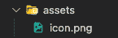
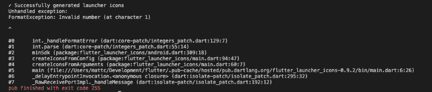
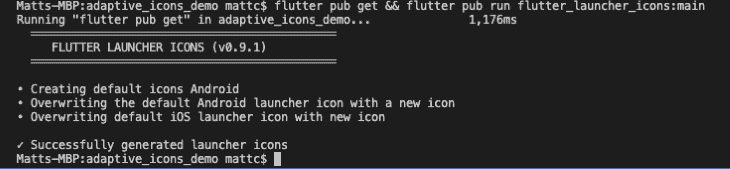
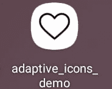
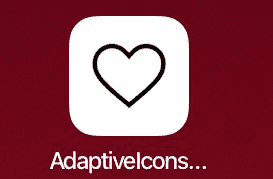
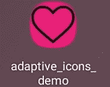
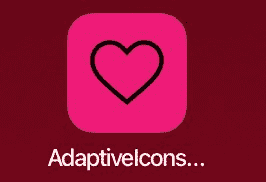

# 用 flutter_launcher_icons 在 Flutter 中创建自适应图标

> 原文：<https://blog.logrocket.com/create-adaptive-icons-flutter-launcher-icons/>

开发者知道他们为应用程序使用的图标至关重要，尤其是在不同平台上渲染图标时。这些被称为[启动器图标](http://www.dre.vanderbilt.edu/~schmidt/android/android-4.0/out/target/common/docs/doc-comment-check/guide/practices/ui_guidelines/icon_design_launcher.html)，并且，由于 Flutter 包 [flutter_launcher_icons](https://pub.dev/packages/flutter_launcher_icons) ，创建它们比以往任何时候都更容易。在本教程中，你将学习如何使用这个包创建 Flutter 启动器图标。

## 在 flutter 中使用 Flutter launcher 图标

在我们进入开发之前，请确保您首先有一个图像。我从谷歌图片中拉出了一个心形图标(包含在 GitHub 上)。当你自己制作‌use 时，比例为 1:1(我的是 714×714)，因为这将确保你的图标看起来最好，而且居中最均匀。最大 1024×1024。

现在你有了一个图像，如果你还没有的话，在你的 Flutter 应用程序中创建一个名为`assets`的目录。创建完`assets`目录后，将你的图标图片移入其中。



下一件你需要做的事情是转到你的`pubspec.yaml`文件，在 dependencies 下，添加`flutter_launcher_icons`。这里有一个小问题，我稍后会谈到。现在，让我们进入下一部分。

接下来，您需要将`flutter_icons`属性添加到`pubspec.yaml`的`dev_dependencies`上面。在这个属性下面，你会有三个属性:`image_path`、`android`和`ios`。

1.  `Image_path`:这是您包含对 `/assets/icon.png`的引用的地方。
2.  这里你可以为 Android 指定一个不同的文件。否则，将`true`默认为`image_path`
3.  `iOS`:您可以在这里为 iOS 指定不同的文件。否则，将`true`默认设置为`image_path`(我在这里也遇到了一个问题。我稍后会介绍这一点)

将以下代码放入`pubspec.yaml`开始。

```
flutter_icons:
 image_path: "assets/icon.png"
 android: true
 ios: true

```

完美。现在您可以运行`flutter pub get`来获取并更新`pubspec.yaml`中提到的所有依赖项。下一步是运行命令。

```
flutter pub run flutter_launcher_icons:main

```

如果您按照 `pub.dev`上的安装说明进行操作，您会看到它告诉您参考最新版本。通常，这很好，对你们中的一些人来说，这就足够了。但是由于某些原因，当我得到下面的错误。



这是我之前提到的问题，这让我困惑了一段时间。我跟着`README`试着跟着这个[教程](https://www.youtube.com/watch?v=elBYrfnJEHo)，清空缓存等。看起来可能会有一个与颤振版本和最新版本的`flutter_launcher_icons` (0.9.2)冲突的问题。看起来这个问题似乎与`minSdkVersion`有关，它基本上指定了使用该包所需的最低 Android SDK 版本。

*注意，flutter_launcher_icons 在 2022 年 6 月发布了一个新版本(0.9.3 ),似乎包含了我将在下面概述的解决方案。你可以[在 GitHub](https://github.com/fluttercommunity/flutter_launcher_icons/pull/322) 上看到合并请求。如果出于某种原因，您无法升级到 0.9.3，请继续阅读解决方法。*

如果你仍然打算使用 0.9.2，我在这里找到了一个解决方案[。解决方法是通过引用](https://github.com/fluttercommunity/flutter_launcher_icons/issues/324) [Git 库](https://dart.dev/tools/pub/dependencies#git-packages)直接依赖包。我们可以将下面的代码添加到`dependencies`下的`pubspec.yaml`中。

```
flutter_launcher_icons: 
   git:
     url: https://github.com/Davenchy/flutter_launcher_icons.git
     ref: fixMinSdkParseFlutter2.8

```

这里，我们直接引用包的 Git 存储库，以及特定的提交、分支或标记。看起来解决方案直接依赖于分叉的 Git 回购和分支`flutter_launcher_icons`。此处见[。](https://github.com/Davenchy/flutter_launcher_icons/tree/fixMinSdkParseFlutter2.8)

现在我们已经准备好了，让我们运行`flutter_clean`，然后重新运行`flutter pub get && flutter pub run` `flutter_launcher_icons:main`。



完美！看起来没有突出的问题。现在我们可以试着看看我们的图标是否反映在各自的平台上。

为此，在你想使用的任何模拟器或设备上运行应用程序，然后等待它打开。然后，您可以退出应用程序，并查看应用程序图标的外观。如果这工作正常，默认的颤动图标应该被替换为你指定的图标。

这是我们的应用程序，带有新的启动器图标。



Samsung Galaxy Tab A 8”, Android 11



iPad (6th Generation), iOS 15.4.1

如您所见，基于操作系统和物理设备，这两种图标布局看起来不同，但我们的图标反映正确！这是一个很好的开始。现在，让我们试着让我们的图标更有趣一点。

## 给你的颤动图标添加一个自定义背景

要做到这一点，我们可以用更多属于`flutter_launcher_icons`的属性进行实验。假设你正在为 Android 开发，你想为你的图标创建一个自定义的透明背景色。你可以用`adaptive_icon_foreground`和`adaptive_icon_background`来做这件事。

对于`adaptive_icon_foreground`,您可以使图像路径与`image_path`属性相同。对于`adaptive_icon_background`，你可以添加你想要的背景颜色，比如`"#ed1e79"`。您也可以让这个属性引用一个图像，但是为了简单起见，让我们坚持使用纯色。

下面是您更新后的`flutter_icons` `pubspec.yaml`代码。

```
flutter_icons:
 image_path: "assets/icon-ios.png"
 adaptive_icon_foreground: "assets/icon-android.png"
 android: true
 ios: true
 adaptive_icon_background: "#ed1e79"

```

这是我们的三星 Galaxy Tab A 8”上的结果。



正如你所看到的，图标图像不适合启动空间，因为它以前在这个设备上。这是因为当我们使用`adaptive_icon_foreground`属性时，我们还需要考虑填充。

然而，我们能够改变图标的背景颜色，并且仍然使用原始图像。填充问题应该在你第一次创建你的图标的时候就解决了。你可以利用各种工具来设计你的图标，特别是考虑到这一点。

[这篇文章](https://medium.com/google-design/designing-adaptive-icons-515af294c783)讲述了如何设计这些图标来适应尺寸和填充的要求。它由三个基本要素组成:尺寸和形状、关键线和层次。

### 尺寸和形状

就大小和形状而言，自适应图标的大小为 108dp 乘 108dp，但被屏蔽的最大大小为 72dp 乘 72dp。不同的设备可以提供不同的掩模，这些掩模必须是凸形的，并且在某些地方可以从中心达到最小 33dp。

由于面具的最小范围，你可以考虑一个中心 66dp 直径的圆作为安全区，保证不会被夹住。

* * *

### 更多来自 LogRocket 的精彩文章:

* * *

### 关键词

[关键线](https://rosecity.wordkeeper.net/keyline/)形状是图标网格的基础，帮助您的图标的视觉比例与其他应用程序的图标保持一致。

关键线形状有:

*   圆形:52dp 和 36dp 直径
*   正方形:44dp 乘 44dp，4dp 角半径
*   矩形:52dp 乘 36dp 和 36dp 乘 52dp，4dp 角半径

### 层

如果你还记得前面的内容，自适应图标可以由两层组成，一个前景和一个背景。背景需要不透明，而前景可以透明。包含独立的背景和前景可以为图标动画或交互式效果提供更多的灵活性。

网上有可用的模板(如[this does XD one](https://github.com/faizmalkani/adaptive-icon-template-xd))。xd 来查看和优化图标的大小、填充和整体显示，并查看它在各种遮罩下的外观。关于设计适应性图标的更多信息，请查看尼克·布彻之前引用的[的帖子。你也可以使用在线工具，如已经共享的模板或](https://medium.com/google-design/designing-adaptive-icons-515af294c783) [Figma](https://www.figma.com/community/file/938712838317973976) 为你的 iOS 和 Android 应用程序生成图标。

关于平台差异需要注意的是，iOS 不允许带有 alpha 通道的图标。一个 [alpha 通道](https://www.techopedia.com/definition/1945/alpha-channel)本质上是一个颜色组件，用来显示图像的透明度。

一些移除了背景的图像包含 alpha 通道，以显示移除背景后图像的外观。如果您的图标有 alpha 通道，并且您尝试运行该命令，您将会得到以下警告:

```
    WARNING: Icons with alpha channel are not allowed in the Apple App Store. 
    Set "remove_alpha_ios: true" to remove it.

```

如果你不是为 iOS 开发，那么这个可以忽略不计。然而，如果你想让你的图标具有适应性，并且在多个平台上都能很好地工作，那么你就需要考虑这些差异。

我想指出的是，添加`remove_alpha_ios: true`并没有帮助解决 iOS 上启动器图标显示为黑色方块的问题。这只是删除上面记录的警告。

iOS 不喜欢透明的图像，而[更喜欢不透明的图标](https://stackoverflow.com/questions/24876791/app-icon-displays-a-black-square)。为了解决黑色方形启动器图标，我简单地改变了图标图像的背景，以匹配 iOS 上的背景颜色，然后利用了`image_path_ios`属性。此属性允许您专门为 iOS 启动程序图标指定一个单独的路径。

最初，我认为我可以像文档中所说的那样在`ios`属性中指定路径。但是当我在`ios`中指定路径而不是简单地添加`true`时，我会得到一个 XCode 错误，说应用程序无法构建。

我发现这很奇怪，因为我没有使用 XCode 编辑器，也没有更改任何 XCode 项目设置。

事实证明，我可以通过将`ios`属性设置为`true`并在`image_path_ios`属性中指定`ios`图像路径来解决这个问题。下面是我在`pubspec.yaml`更新的`flutter_icons`代码。

```
flutter_icons:
 image_path: "assets/icon-ios.png"
 adaptive_icon_foreground: "assets/icon-android.png"
 android: true
 ios: true
 image_path_ios: "assets/icon-ios.png"
 adaptive_icon_background: "#ed1e79"

```

这里，我们需要用`image_path_ios`指定`image_path`，或者分别指定`image_path_android`和`image_path_ios`，而不是`image_path`。

完成这些配置后，新的 iOS 启动器图标可以在 iPad 上正确显示。它还包括与 Android 自适应启动器图标相关的属性。见下文。



## 摘要

当尝试使用一个自适应图标作为你的启动图标时，要注意很多配置。它提供了几个属性来允许你基于平台引用资产，以及允许在 Android 上多层的属性。

尽管如此，我确实遇到了一些没有明确解决或根本没有解决的问题，特别是关于`minSdkVersion`、风格和属性冲突。

然而，社区已经提供了大量的解决方案和变通方法，并且，只要你能事先考虑图标样式，你应该能够相对容易地实现你各自的平台图标。

这篇文章的附带代码在 [GitHub](https://github.com/macro6461/adaptive-icons-demo) 上。

## 参考