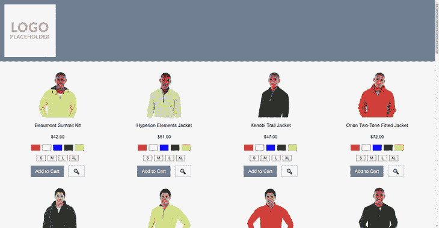
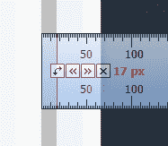
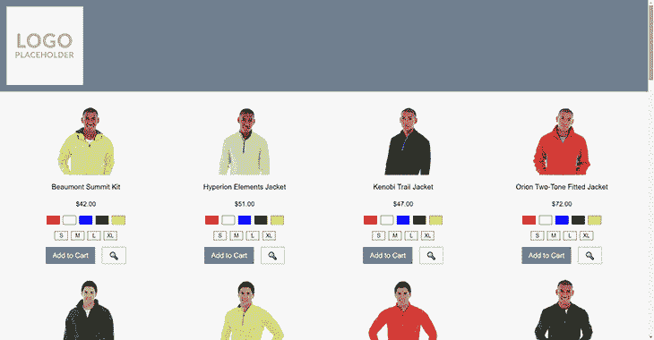
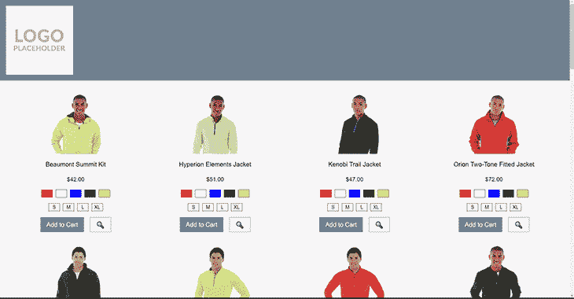
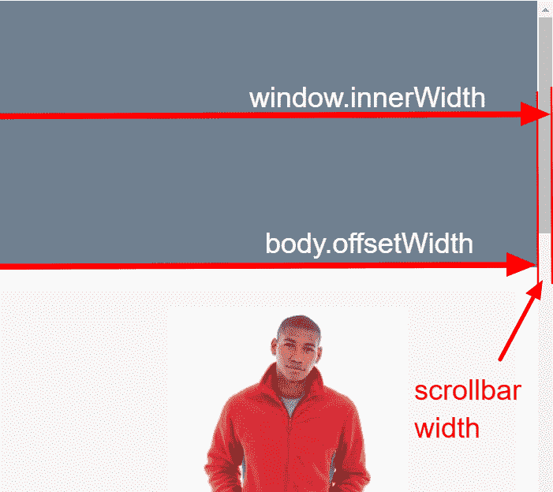
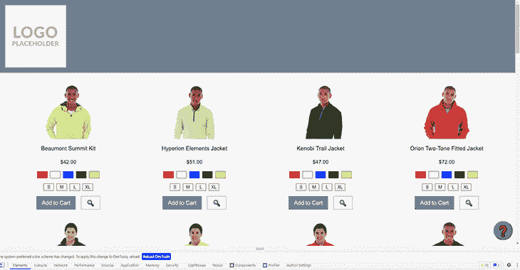
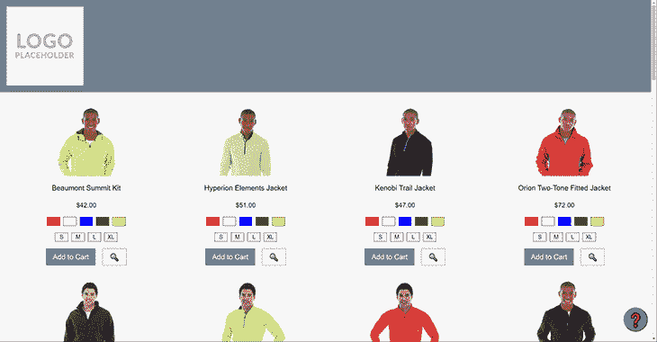
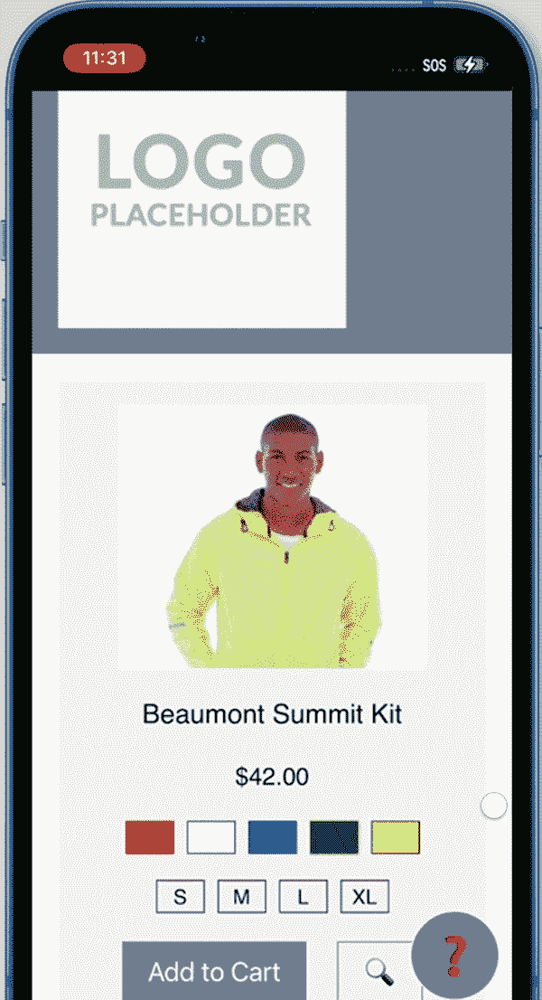
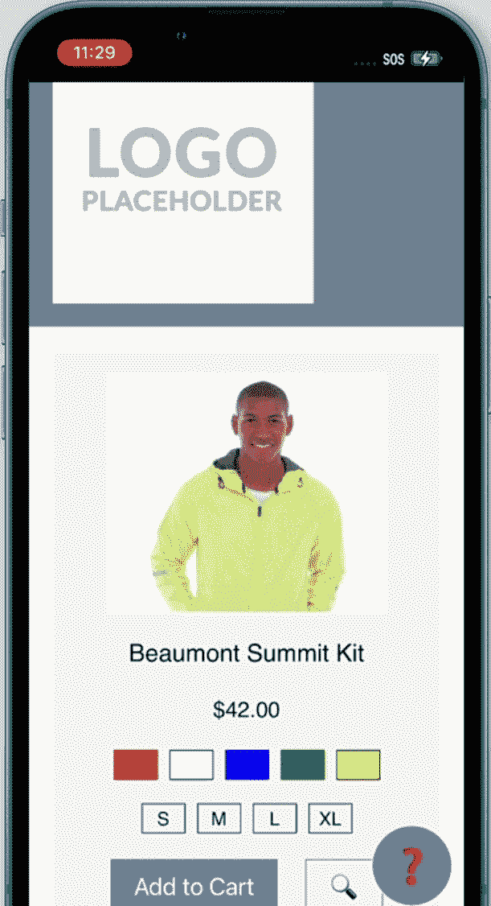

# 创建一个高级的滚动锁 React Hook - LogRocket 博客

> 原文：<https://blog.logrocket.com/create-advanced-scroll-lock-react-hook/>

## 介绍

当我们不希望用户滚动页面时，滚动锁是网站上使用的一种技术。这听起来违反直觉；我们为什么要阻止用户滚动我们的网页来查看内容呢！？

在本文中，我们将探索滚动锁，并尝试创建一个跨设备的 React 钩子来处理应用它所导致的布局偏移。当我们浏览没有滚动锁定的网页的演示时，我们会清楚什么时候以及为什么要阻止用户滚动我们的页面。

欣赏滚动锁定的最佳方式是展示当不考虑滚动锁定时用户将获得的体验:


在上图中，我们可以看到一个用户正在打开一个快速查看模式。当模式打开时，用户将光标放在模式内容上，滚动鼠标滚轮；背景页动了！这对用户来说可能是非常迷惑的，因为这不是他们所期望发生的。

如果快速查看容器本身有一些长内容，并且有自己的滚动条，会发生什么？：


在上面的截图中，我们可以看到模式被打开，模式中的可滚动内容被滚动。当我们到达该内容的底部时，背景页面开始滚动。

尝试向上滚动只会向上滚动背景页面，而不是鼠标悬停的内容。直到滚动暂停一秒钟，浏览器才会允许光标滚动模式中的内容。

在处理移动菜单时，滚动背景也是一个麻烦。通常，移动菜单会完全位于内容的顶部，或者占据 90%的视窗。

正如我们上面演示的，浏览器仍然允许元素下的页面滚动，这意味着用户很容易打开菜单，意外地滚动背景页面，关闭菜单而不做任何选择，并显示完全不同的内容。

## 实现滚动锁定

让我们更新我们的应用程序，当我们不希望用户滚动时，考虑用户滚动。我们将首先创建一个钩子，将其导入到组件中，然后设置滚动锁实现。

首先，我们的钩子的结构:

```
import React from 'react';
export const useScrollLock = () => { 
  const lockScroll = React.useCallback(() => { 
    /* ... */
  }, [])

  const unlockScroll = React.useCallback(() => { 
    /* ... */
  }, []);

  return {
    lockScroll,
    unlockScroll
  };  
}

```

接下来，让我们将该挂钩导入到组件中:

```
const PLP = () => {
  const [quickViewProductId, setQuickViewProductId] = React.useState(0);
  const { lockScroll, unlockScroll } = useScrollLock();

  const displayQuickView = (productId) => {
    lockScroll();
    setQuickViewProductId(productId);
  }

  const hideQuickView = () => {
    unlockScroll();
    setQuickViewProductId(0);
  }

  return (
    /* Products list and conditionally rendered quickview modal */
  );
};

```

现在我们已经有了应用程序的框架，让我们实现`lockScroll`和`unlockScroll`函数:

```
const lockScroll = React.useCallback(() => {
  document.body.style.overflow = 'hidden';
}, [])

const unlockScroll = React.useCallback(() => {
  document.body.style.overflow = '';
}, [])

```

就是这样！我们的滚动锁定功能已经设置好了，并按预期工作。我们可以称之为完成，并开始在我们的应用程序中使用它。但是仍然有一些细节需要解决。



上面，当调用`lockScroll`函数时，您可能会注意到一个小问题。仔细看看下图的右边，你会注意到滚动条消失了。它消失并没有错，这正是我们想要的，因为这告诉浏览器用户不能滚动。

然而，随着滚动条的消失，页面的宽度增加了，因此任何居中的内容不再居中，需要稍微移动。这种轻微的移动对于用户来说是非常明显的。

## 固定布局偏移

为了防止布局偏移的发生，让我们补偿浏览器滚动条的宽度。

从测量浏览器滚动条的宽度开始。我们将拉出一个像素标尺，检查滚动条有多宽:



我的浏览器窗口宽度为 17px。很好，让我们在钩子中使用这个值:

```
const lockScroll = React.useCallback(() => {
  document.body.style.overflow = 'hidden';
  document.body.style.paddingRight = '17px'
}, [])

const unlockScroll = React.useCallback(() => {
  document.body.style.overflow = '';
  document.body.style.paddingRight = ''
}, [])

```

结果是:



看起来相当不错！我们可以看到滚动条消失了，内容一点也没有移动。

让我们在另一个浏览器中快速检查一下，在这里是 Opera:



啊，看来这在 Opera 里行不通，内容又转移了，反方向！这肯定意味着滚动条宽度在不同浏览器之间是不一致的，即使是在同一个操作系统上。我相信大多数人已经知道了这一点，但是仍然值得证明这一点。

现在，当我提到 macOS、iOS 和 Android 可能会有非常不同的默认滚动条宽度时，可以更容易地理解，我们不能只是硬编码一个补偿值。我们需要计算滚动条的宽度，并将结果用作 body 元素的填充值。

## 计算滚动条宽度

为了动态地计算滚动条的宽度，我们可以使用浏览器窗口的内部宽度(内部宽度是因为我们需要考虑到用户正在浏览的视窗没有最大化到他们的显示器上)，以及 body 元素的宽度。这两个宽度之间的差异就是滚动条本身的宽度:



让我们更新我们的钩子，将这个值用于应用于 body 元素的填充，然后在 Opera 中重新检查我们的应用程序:

```
const lockScroll = React.useCallback(
  () => {
    const scrollBarCompensation = window.innerWidth - document.body.offsetWidth;
    document.body.style.overflow = 'hidden';
    document.body.style.paddingRight = `${scrollBarCompensation}px`;
  }, [])

```


那就好多了！Opera 中默认使用的滚动条的不同宽度现在得到了适当的补偿。我也检查了 Chrome，它和以前一样工作。你必须相信我的话，或者你可以从 [GitHub](https://github.com/denno020/useScrollLock) 下载代码并自己测试！

这个钩子看起来很棒，我们已经准备好生产了！然而，我们还需要考虑一些东西，比如 iOS Safari 和 sticky 元素。

## 粘性元素的滚动锁定

电子商务网站一直在使用粘性元素:标题、推广栏、过滤器、模态、页脚、实时聊天或浮动动作按钮(FAB)。

让我们看看扩展我们的滚动锁实现的 FAB。一、晶圆厂如何定位？

```
.button--help {
  position: fixed;
  right: 10px;
  top: 90vh;
  /* ... */
}

```

我们已经把 FAB 放在了视口的右下角。我们希望它总是可见的，因为我们希望我们的用户能够尽快访问帮助。

当我们打开快速查看模式并启用滚动锁定时，这个按钮会发生什么情况？



应用滚动锁定时，按钮似乎在移动！由于元素不再位于 body 元素的文档流中，滚动条补偿没有任何效果。

在这一点上，我们需要从我们的钩子中分支出来，以防止这种布局偏移，以及任何粘性元素都会发生的布局偏移。

为此，我们将使用钩子在 body 元素上设置一个 CSS 自定义属性，该属性将用于我们给定固定位置的任何元素的样式中，作为乘坐侧的偏移。

一些代码将使描述更加清晰:

```
export const useScrollLock = () => {
  const lockScroll = React.useCallback(
    () => {
      // ...
      document.body.style.paddingRight = 'var(--scrollbar-compensation)';
      document.body.dataset.scrollLock = 'true';
    }, [])

  const unlockScroll = React.useCallback(
  () => {
    // ....
    delete document.body.dataset.scrollLock;
  }, []);

  React.useLayoutEffect(() => {
    const scrollBarCompensation = window.innerWidth - document.body.offsetWidth;
    document.body.style.setProperty('--scrollbar-compensation', `${scrollBarCompensation}px`);
  }, [])

  // ...
}

```

我们在钩子中添加了一个`useLayoutEffect`,它将设置 body 元素的 CSS 自定义属性，看起来我们现在有了可用的补偿值，我们在向 body 添加填充时使用它，而不是再次计算它。我们还在 body 元素上添加了一个数据属性，我们可以用它作为触发器来有条件地使用`--scrollbar-compensation`变量。

如果呈现的多个组件使用了`useScrollLock`钩子，那么有可能在 body 元素上多次设置`--scrollbar-compensation`值，但是在元素上设置 CSS 自定义属性似乎不会导致浏览器重画，所以性能损失应该很小。

既然我们已经有了可用于 body 元素(即每个元素)的任何子元素的`--scrollbar-compensation`，我们就可以在设计这些元素的样式时使用它了！

这是我们再次为 FAB 设计的样式，使用 CSS 自定义属性，以及应用滚动锁定时的结果:

```
[data-scroll-lock] .button--help {
  margin-right: var(--scrollbar-compensation);
}

```



晶圆厂哪儿也去不了！我们的模态是打开的，滚动锁被应用，并且用户界面根本没有移动。我们现在非常接近终点线了！我们已经完成了跨浏览器检查，现在我们必须做一个快速的跨设备检查。

## iOS 的滚动锁定

iOS 上的滚动锁定功能似乎不起作用。



打开模态确实应用了我们到目前为止开发的滚动锁，但是那个滚动锁在 iOS 中没有任何效果。

正如我们多年来不得不克服的所有浏览器怪癖一样，有许多方法可以解决 iOS 的问题。我们将专门处理 iOS，使用用户代理 sniff，并对最初由 [Markus Oberlehner](https://markus.oberlehner.net/blog/simple-solution-to-prevent-body-scrolling-on-ios/) 提出的方法进行修改:

```
const lockScroll = React.useCallback(
  () => {
    document.body.dataset.scrollLock = 'true';
    document.body.style.overflow = 'hidden';
    document.body.style.paddingRight = 'var(--scrollbar-compensation)';

    if (isiOS) {
      scrollOffset.current = window.pageYOffset;
      document.body.style.position = 'fixed';
      document.body.style.top = `-${scrollOffset.current}px`;
      document.body.style.width = '100%';
    }
  }, [])

const unlockScroll = React.useCallback(
  () => {
    document.body.style.overflow = '';
    document.body.style.paddingRight = '';

    if (isiOS) {
      document.body.style.position = '';
      document.body.style.top = ``;
      document.body.style.width = '';
      window.scrollTo(0, scrollOffset.current);
    }
    delete document.body.dataset.scrollLock;
  }, []);

```

该方法的思想是将主体设置为`position` `=` `'fixed'`，然后以编程方式偏移主体以匹配当前滚动距离，这将补偿想要在视口顶部显示主体内容顶部的浏览器。

当滚动锁定被禁用时，我们使用滚动偏移量值将浏览器窗口向下跳转到用户打开模式之前的位置。所有这些变化都会产生一种效果，类似于在其他浏览器中更容易实现的滚动锁定。



## 结论

好了，我们现在有了完整的钩子，我们已经尽力确保它能在尽可能多的设备上工作。希望现在你能更好地理解我们希望阻止用户滚动网页的次数——以避免用户迷失方向。

我们可能会认为，当滚动条明显在末尾时，用户不会试图继续滚动模态的一部分，或者当没有明显迹象表明还有更多内容要滚动时，用户不会试图滚动菜单。然而，用户以怪异和奇妙的方式使用我们的网站，我们所能做的就是帮助他们不要陷入迷失、迷失方向或沮丧的境地，因为这可能会直接导致他们离开网站并找到另一个网站。

## 使用 LogRocket 消除传统反应错误报告的噪音

[LogRocket](https://lp.logrocket.com/blg/react-signup-issue-free)

是一款 React analytics 解决方案，可保护您免受数百个误报错误警报的影响，只针对少数真正重要的项目。LogRocket 告诉您 React 应用程序中实际影响用户的最具影响力的 bug 和 UX 问题。

[ ](https://lp.logrocket.com/blg/react-signup-general) [  ](https://lp.logrocket.com/blg/react-signup-general) [LogRocket](https://lp.logrocket.com/blg/react-signup-issue-free)

自动聚合客户端错误、反应错误边界、还原状态、缓慢的组件加载时间、JS 异常、前端性能指标和用户交互。然后，LogRocket 使用机器学习来通知您影响大多数用户的最具影响力的问题，并提供您修复它所需的上下文。

关注重要的 React bug—[今天就试试 LogRocket】。](https://lp.logrocket.com/blg/react-signup-issue-free)