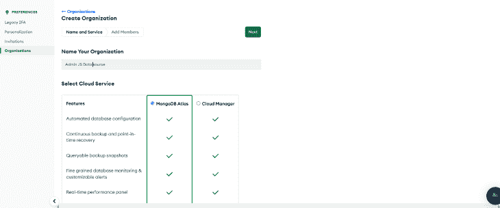
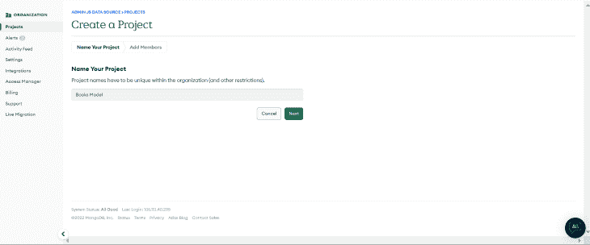
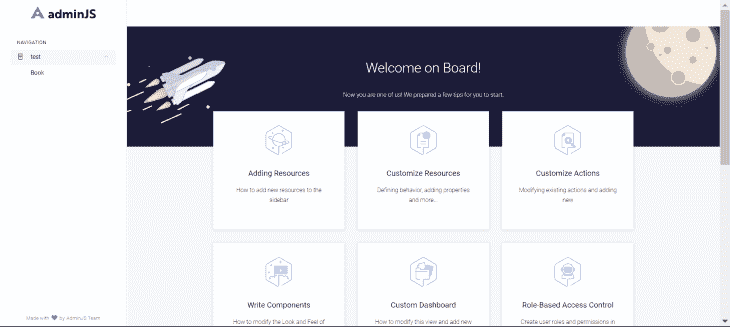
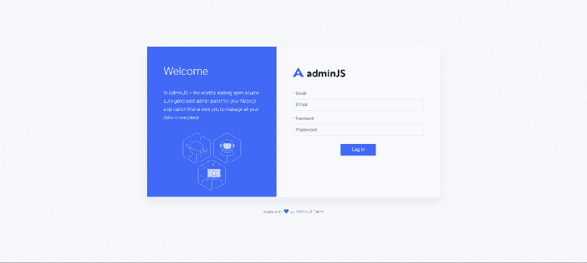
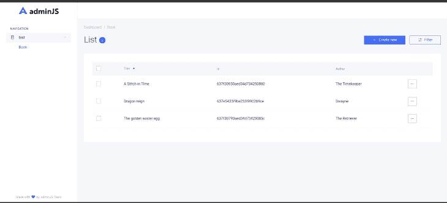
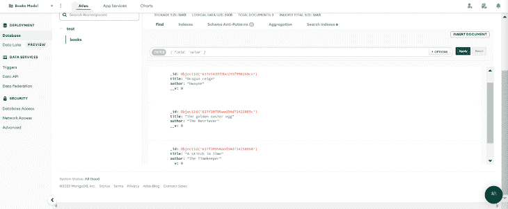
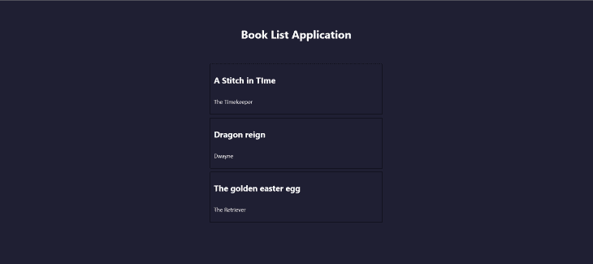

# 用 AdminJS - LogRocket 博客构建全栈应用

> 原文：<https://blog.logrocket.com/create-an-admin-panel-with-node-js-and-adminbro/>

对于开发人员来说，为每个 Node.js 项目构建定制管理面板可能是一项耗时的任务，尤其是考虑到他们要处理的项目数量。因此，对旨在减轻开发人员工作量的替代工具的需求日益增长。

本文重点介绍了一个开源 Node.js 管理面板的特性，该面板承诺做到这一点: [AdminJS](https://adminjs.co) 。本文的教程部分将演示如何使用 AdminJS 构建一个全栈应用程序。

*向前跳转:*

## 什么是 AdminJS？

AdminJS，以前称为 AdminBro，是一个开源的管理面板接口，旨在满足 Node.js 应用程序的需求。这个界面消除了开发定制管理页面所需的时间和精力。相反，用户可以使用 AdminJS UI 轻松查看和管理内容。

AdminJS 是用 React 构建的，提供了一系列可定制性，它还提供了一个可以集成到其他应用程序中的 REST API。

## 为什么要用 AdminJS？

使用 AdminJS，用户可以快速构建和设置管理仪表板和应用程序。为了帮助您评估是否应该考虑使用 AdminJS 来满足您的应用程序需求，下面是对其特性的总结:

*   与其他应用程序的轻松集成:AdminJS 可以轻松集成到许多其他应用程序中，比如 SQL 和 NoSQL 数据源，以及 Express.js、NestJS 和 Fastify 等框架
*   不将其数据库模式强加给用户:AdminJS 支持各种 ORM 和 ODM，使用户能够连接到他们选择的数据库
*   与后端无关:用户可以创建、读取、更新和删除内容，而不考虑数据源的选择
*   高级过滤功能:用户可以通过应用多个标准来快速过滤掉不需要的结果，从而轻松跟踪特定的搜索查询
*   灵活的用户管理:可以为用户设置不同的授权级别。此功能还可以创建角色，并可以将特定的操作(如数据修改)限制到特定的用户
*   轻松定制:可以修改 AdminJS UI 的视觉外观以满足用户需求
*   可定制的特性:一些标准特性，如文件上传、批量编辑、导出、用户配置文件和密码散列，可以应用于数据源；用户也可以根据需要创建独特的特性

## 设置新项目

从 AdminJS 开始，我们需要安装 AdminJS 核心包，并使用我们选择的插件和适配器进行设置。对于本教程，我们将使用 Express.js 插件和 MongoDB 适配器。

要在本地计算机上安装 AdminJS 核心包，请导航到您选择的目录并打开 CLI。在命令行中，使用以下命令之一安装带有 npm 或 Yarn 的 AdminJS:

```
npm init
//select default options and fill out fields as desired
npm i adminjs

```

```
yarn init
//select default options and fill out fields as desired
yarn add adminjs

```

### 添加 Express.js 插件

要添加 Express 插件，我们将在 CLI 中使用以下命令之一:

```
npm i @adminjs/express                # for Express server

```

```
yarn add @adminjs/express                # for Express server

```

### 添加 MongoDB 适配器

接下来，我们将使用以下命令之一将 MongoDB 适配器添加到我们的应用程序中:

```
npm i @adminjs/mongoose mongoose              # for Mongoose

```

```
yarn add @adminjs/mongoose mongoose               # for Mongoose

```

安装完成后，我们可以通过将安装的插件和适配器连接到 AdminJS 包来完成设置。首先，我们将安装 Express.js:

```
//npm
npm i express tslib express-formidable express-session

//yarn
yarn add express tslib express-formidable express-session

```

接下来，我们将使用 Express 设置一个简单的应用程序。在文件目录中，我们将创建一个新文件`App.js`，并添加以下内容:

```
const AdminJS = require('adminjs')
const AdminJSExpress = require('@adminjs/express')
const express = require('express')

const PORT = 3000

const startAdminJS = async () => {
  const app = express()

  const admin = new AdminJS({})

  const adminRouter = AdminJSExpress.buildRouter(admin)
  app.use(admin.options.rootPath, adminRouter)

  app.listen(PORT, () => {
    console.log(`Listening on port ${PORT}, AdminJS server started on URL: http://localhost:${PORT}${admin.options.rootPath}`)
  })
}

startAdminJS()

```

这里我们创建了一个简单的 AdminJS 接口。在本教程中，我们将添加一个 MongoDB 数据源，将身份验证添加到 AdminJS UI 中，并使用数据库创建一个简单的应用程序。

## 创建博客模型

我们将使用 MongoDB 作为 AdminJS 面板的数据源。作为先决条件，我们需要在 MongoDB 上创建一个数据库，并用 Mongoose 适配器将我们的应用程序连接到它。

首先，登录 MongoDB 并选择**创建组织**:



这里我们创建了一个名为“AdminJS data source”的组织。接下来，我们将向我们的组织添加一个新项目；我们将这个项目命名为“图书模型”:



接下来，我们将被提示创建一个新的数据库。在本教程中，我们将构建一个名为“Books”的共享集群。

现在，我们将为集群创建管理员凭据，并将本地主机 URL 添加到 **IP 地址**字段。要获得连接凭证，点击**连接**，并选择**连接 MongoDB 本地适配器**。在全栈应用中，我们可以找到唯一的 URI 来将我们的应用连接到数据库。

在应用程序的工作目录中，我们将创建一个`bookModel`文件夹和一个`book.model.js`文件。在`book.model.js`文件中，我们将为数据库定义模式:

```
const mongoose = require('mongoose');
const BookSchema = new mongoose.Schema({
    title: { type: String },
    author: { type: String },
});
const Book = mongoose.model('Book', BookSchema);

module.exports = {
    BookSchema,
    Book,
}

```

`BookModel`定义的模式将具有以下字段:`title`和`author`。

### 创建资源

接下来，我们将把上一节中创建的模型添加到我们的`app.js`文件中，将我们的应用程序连接到 MongoDB，并创建一个 AdminJS 实例。

为此，对`app.js`文件进行如下修改:

```
//previous libraries import
const mongoose = require("mongoose");
const AdminJSMongoose = require("@adminjs/mongoose");
const { Book } = require("./bookModel/book.model.js");

AdminJS.registerAdapter({
  Resource: AdminJSMongoose.Resource,
  Database: AdminJSMongoose.Database,
})

//port

const startAdminJS = async () => {
  const app = express();
  const mongooseDB = await mongoose
    .connect(
      "mongodb+srv://ZionDev:[email protected]/?retryWrites=true&w=majority",
      {
        useNewUrlParser: true,
        useUnifiedTopology: true,
      }
    )
    .then(() => console.log("database connected"))
    .catch((err) => console.log(err));

  const BookResourceOptions = {
    databases: [mongooseDB],
    resource: Book,
  };

  const adminOptions = {
    rootPath: "/admin",
    resources: [BookResourceOptions],
  };

  const admin = new AdminJS(adminOptions);
    //other code

```

在这里，我们将`Book`模型作为资源添加到 AdminJS 中。我们还添加了 MongoDB 数据库，这样当我们在 AdminJS 中执行 CRUD 操作时，它会自动更新。

如果我们用`node App.js`命令运行应用程序，我们将得到 AdminJS 默认屏幕，并且`Book`模型将出现在导航部分:



## 创建操作处理程序

AdminJS 提供了以下操作:列表、搜索、新建、显示、编辑、删除和批量删除。它还允许用户在需要时定义自定义操作。要创建的操作可以分为两类:

*   在后端运行且不显示可视用户界面的操作
*   呈现组件的操作

这两个动作是相似的，因为它们是以相同的模式创建的。两种模式的显著区别是增加了一个`component`道具。让我们来看看我们如何能够做出这两种类型的动作。

### 后端操作

为了创建这些操作，我们将使用以下语法:

```
const BookResourceOptions = {
    resource: Book,
    options: {
      actions: {
        GetJsonData: {
          actionType: "record",
          component: false,
          handler: (request, response, context) => {
            const { record, currentAdmin } = context;
            console.log("record", record);
            return {
              record: record.toJSON(currentAdmin),
              msg: "Hello world",
            };
          },
        },
      },
    },
  };

```

这里，我们向`BookResourceOption`添加了一个自定义动作。上面的命令将`component`属性设置为`false`。因此，不会呈现任何组件，操作将在后端运行。结果输出将是所选记录的数据。

### 具有可视用户界面的操作

接下来，我们需要创建一个组件，该动作将呈现该组件。然后，我们将把设计好的组件添加到`component`属性字段。

例如，假设我们有以下自定义 React 组件:

```
import React from 'react'
import { ActionProps } from 'adminjs'

const ShowRecord = (props) => {
  const { record } = props

  return (
    <Div>
      <h1>This is a simple component</h1>
    <p>Below are our records</p>
    <span>
      {JSON.stringify(record)}
    </span>
    </Div>
  )
}

export default ShowRecord

```

一旦它被创建，我们就可以把它添加到`component`属性中，就像这样:

```
component: AdminJS.bundle('./ShowRecord'),

```

## 添加用户验证

AdminJS 可以添加用于查看和管理内容的用户身份验证；这有助于更好地保护数据并限制不必要的访问。我们可以使用`express`插件向 AdminJS 应用程序添加身份验证。为此，我们将对`App.js`文件进行如下修改:

```
//other code

//login details
const DEFAULT_ADMIN = {
  email: '[email protected]',
  password: 'administrator',
}

// handle authentication
const authenticate = async (email, password) => {
  //condition to check for correct login details
  if (email === DEFAULT_ADMIN.email && password === DEFAULT_ADMIN.password) {
    //if the condition is true
    return Promise.resolve(DEFAULT_ADMIN)
  }
  //if the condition is false
  return null
}

```

最后，我们将用`buildAuthenticatedRouter`替换 AdminJS `buildRouter`，并向其传递认证凭证:

```
const adminRouter = AdminJSExpress.buildAuthenticatedRouter(
    admin,
    {
      authenticate,
      cookieName: "AdminJS",
      cookiePassword: "Secret",
    },
    null,
    {
      store: mongooseDB,
      resave: true,
      saveUninitialized: true,
      secret: 'Secret',
      name: 'adminjs',
    }
  );

```

这样，我们得到一个登录页面来访问 AdminJS 实例:



## 设置前端

接下来，我们将使用 Next.js 和 Axios 构建一个图书列表应用程序，将 AdminJS 接口连接到应用程序，并显示存储的内容。为了访问 AdminJS 内容，我们将创建一个对运行在后端的 URL 实例的 API 请求。

在`api`目录中，我们将创建一个文件:`getBooks.js`。接下来，我们将对该文件中的`Books`资源发出一个 API 请求。资源的 API 端点采用以下语法:

```
.../api/resources/{resourceId}/actions/{action}

```

在这种情况下，我们的资源`id`是`Book`，要执行的动作是`list`。此操作将返回存储在资源中的所有数据。将以下代码添加到`getBooks.js`文件中:

```
import axios from "axios";

export default async function handler(req, res) {
  await axios
    .get("http://localhost:3000/admin/api/resources/Book/actions/list")

    .then((response) => {
      return res.status(200).json(response.data.records);
    })
    .catch((error) => {
      console.log(error);
    });
}

```

上面的代码返回一个包含我们的资源数据的响应。我们可以在前端的`index.js`文件中以`static props`的形式访问这些数据:

```
export default function Home(props) {
  console.log(props);
  return (
    <div style={{display:"flex", alignItems:"center", height:"100vvh", paddingTop:"55px", flexDirection:"column"}}>
      <h1>Book List Application</h1>
      <div style={{marginTop:"34px"}} >
        {/* book List container */}
        {props.books.map((book) => {
          return (
            <div style={{display:"flex", flexDirection:"column", border:"1px solid black", width:"500px", padding:"10px", margin:"10px"}}>
              <h2>{book.params.title}</h2>
              <p>{book.params.author}</p>
            </div>
          );
        }
        )}
      </div>
    </div>
  )
}

export const getStaticProps = async () => { 
  const res = await fetch('http://localhost:3001/api/getBooks');
  const data = await res.json();
  return {
    props: { books: data }
  }
}

```

我们使用`getStaticProps`从 API 路由获取数据，并将其作为`props`传递。然后，我们可以在前端访问这个`prop`，并在响应中返回每个数组元素的`title`和`author`。

## 测试应用程序

为了测试我们的应用程序，我们将使用 AdminJS 实例创建条目:



在上面的仪表板列表中有三个条目，每个条目包含一个书名和作者。如果我们导航到 MongoDB Atlas 上的 MongoDB `Books`集合，我们可以看到在 AdminJS 实例中执行的`Create`操作产生的数据:



现在，当我们运行 Next.js 应用程序时，我们得到以下结果:



## 结论

在本教程中，我们介绍了 AdminJS，回顾了它的许多特性，然后使用它用 Express.js 和 MongoDB 构建了一个全栈 Node.js 应用程序。你将如何在你的下一个项目中使用 AdminJS？

## 200 只显示器出现故障，生产中网络请求缓慢

部署基于节点的 web 应用程序或网站是容易的部分。确保您的节点实例继续为您的应用程序提供资源是事情变得更加困难的地方。如果您对确保对后端或第三方服务的请求成功感兴趣，

[try LogRocket](https://lp.logrocket.com/blg/node-signup)

.

[](https://lp.logrocket.com/blg/node-signup)[https://logrocket.com/signup/](https://lp.logrocket.com/blg/node-signup)

LogRocket 就像是网络和移动应用程序的 DVR，记录下用户与你的应用程序交互时发生的一切。您可以汇总并报告有问题的网络请求，以快速了解根本原因，而不是猜测问题发生的原因。

LogRocket 检测您的应用程序以记录基线性能计时，如页面加载时间、到达第一个字节的时间、慢速网络请求，还记录 Redux、NgRx 和 Vuex 操作/状态。

[Start monitoring for free](https://lp.logrocket.com/blg/node-signup)

.