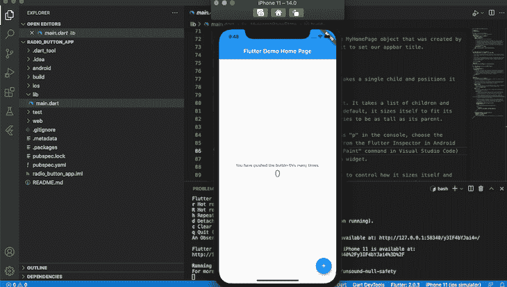
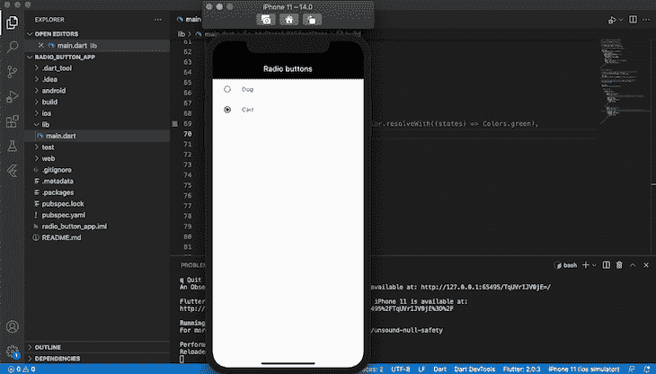
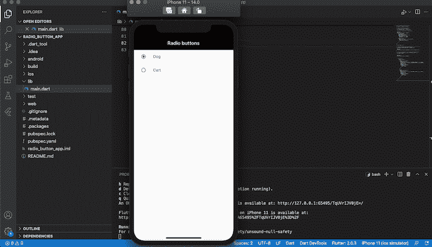
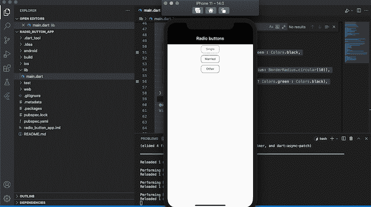

# 创建和定制 Flutter 单选按钮

> 原文：<https://blog.logrocket.com/create-and-customize-flutter-radio-buttons/>

收集用户数据时经常遇到的一个挑战是格式化答案选项，以便问题的说明对用户来说是隐含的。单选按钮是一个图形用户界面元素，它提供了一个预定义的互斥答案选项列表，通过其设计解决了问题。

单选按钮通常简洁且易于浏览，这使得它们成为移动应用程序的绝佳选择。在 Flutter 中，[默认单选按钮](https://api.flutter.dev/flutter/material/Radio-class.html)不保持任何状态。相反，每次选择一个选项时，它都会调用`onChange`回调函数。

在本教程中，我们将使用 Flutter 的内置方法构建一个简单的单选按钮，然后构建我们自己的用于定制单选按钮的 Flutter 小部件。要跟随本教程，您需要:

*   安装在您机器上的颤振
*   颤振的基本知识
*   熟悉 Dart
*   您机器上安装的 Xcode 或 Android Studio
*   用于测试的 iOS 模拟器或 Android 模拟器
*   代码编辑器，即 VS 代码

我们开始吧！

## 入门指南

首先，我们将建立一个新的颤振项目。导航到您的工作目录，然后复制并粘贴下面的代码:

```
flutter create radio_button_app

```

初始化完成后，打开 Android 模拟器或 iOS 模拟器。导航到`stripe_app`文件夹，使用下面的命令运行应用程序:

```
cd radio_button_app && flutter run 

```

您的应用程序应该类似于下面的屏幕截图，表明您的应用程序安装成功:



## 在抖动中构建单选按钮

首先，让我们使用 Flutter [材质组件 widgets](https://flutter.dev/docs/development/ui/widgets/material) 构建一个单选按钮。通过将下面的代码添加到`main.dart`文件的顶部来导入包:

```
import 'package:flutter/material.dart';

```

### 创建无状态小部件

接下来，我们需要[创建一个无状态的小部件，它是不可变的](https://blog.logrocket.com/difference-between-stateless-stateful-widgets-flutter/)，允许我们在它的基础上构建其他应用。让我们创建一个名为`MyApp`的无状态小部件，它将充当根小部件并保存我们的应用程序的支架。将下面的代码添加到`main.dart`:

```
void main() => runApp(const MyApp());

class MyApp extends StatelessWidget {
  const MyApp({Key key}) : super(key: key);
  static const String _title = 'Radio buttons';

  @override
  Widget build(BuildContext context) {
    return MaterialApp(
      title: _title,
      debugShowCheckedModeBanner: false,
      theme: ThemeData(
        primaryColor: Colors.black, 
        accentColor: Colors.black,
        ),
      home: Scaffold(
        appBar: AppBar(title: const Text(_title)),
        body: const Center(
          child: MyStatefulWidget(),
        ),
      ),
    );
  }
}

```

在上面的代码中，我们将`MyApp`小部件传递给`runApp`函数，使其成为小部件树的根:

```
void main() => runApp(const MyApp());

```

`MyApp`小部件不保存任何状态。因此，要构建像单选按钮这样的可变或有状态小部件，我们需要创建一个有状态小部件，并将其作为子部件传递给根小部件:

```
child: MyStatefulWidget(),

```

### 创建有状态的小部件

接下来，让我们通过将下面的代码添加到`main.dart`来创建`MyStatefulWidget`:

```
class MyStatefulWidget extends StatefulWidget {
  const MyStatefulWidget({Key key}) : super(key: key);
  @override
  State<MyStatefulWidget> createState() => _MyStatefulWidgetState();
}

```

`MyStatefulWidget`依赖于私有状态，由`createState`触发，这是一个立即调用的函数(IIF)。因此，`MyStatefulWidget`称之为`_MyStatefulWidgetState`私有状态。

为了建立`_MyStatefulWidgetState`私有状态，让我们将下面的代码添加到我们的`main.dart`文件中:

```
class _MyStatefulWidgetState extends State<MyStatefulWidget> {
  Pet _pet = Pet.dog;

  @override
  Widget build(BuildContext context) {

    return Column(

      children: <Widget>[
        ListTile(
          title: const Text('Dog'),
          leading: Radio<Pet>(
            fillColor: MaterialStateColor.resolveWith((states) => Colors.green),
            focusColor: MaterialStateColor.resolveWith((states) => Colors.green),
            value: Pet.dog,
            groupValue: _pet,
            onChanged: (Pet value) {
              setState(() {
                _pet = value;
              });
            },
          ),
        ),
        ListTile(
          title: const Text('Cart'),
          leading: Radio<Pet>(
            fillColor: MaterialStateColor.resolveWith((states) => Colors.green),
            value: Pet.cat,
            groupValue: _pet,
            onChanged: (Pet value) {
              setState(() {
                _pet = value;
              });
            },
          ),
        ),
      ],
    );
  }
}

```

在这个例子中，我们将创建一个简单的单选按钮，要求用户在猫或狗之间进行选择。首先，我们将`Pet`的值设置为`Pet.dog`，这是一个在`main.dart`的全局上下文中声明的枚举:

```
enum Pet { dog, cat }

```

您可以在`main.dart`的任何地方添加枚举值的代码，只要它可以通过全局上下文访问。

每个单选按钮都是用`ListTile`材质类构建的，允许文本、图标和按钮的组合。

每个选中选项的值被传递给`groupValue`，由`MyStatefulWidget`维护。每当选择一个单选按钮时，按钮状态就会更新，将`_pet`的值更改为当前选择的选项。

这一部分的完整代码如下:

```
import 'package:flutter/material.dart';
void main() => runApp(const MyApp());
/// This is the main application widget.
class MyApp extends StatelessWidget {
  const MyApp({Key key}) : super(key: key);
  static const String _title = 'Radio buttons';

  @override
  Widget build(BuildContext context) {
    return MaterialApp(
      title: _title,
      debugShowCheckedModeBanner: false,
      theme: ThemeData(
        primaryColor: Colors.black, 
        accentColor: Colors.black,
        ),
      home: Scaffold(
        appBar: AppBar(title: const Text(_title)),
        body: const Center(
          child: MyStatefulWidget(),
        ),
      ),
    );
  }
}
enum Pet { dog, cat }
/// This is the stateful widget that the main application instantiates.
class MyStatefulWidget extends StatefulWidget {
  const MyStatefulWidget({Key key}) : super(key: key);
  @override
  State<MyStatefulWidget> createState() => _MyStatefulWidgetState();
}
/// This is the private State class that goes with MyStatefulWidget.
class _MyStatefulWidgetState extends State<MyStatefulWidget> {
  Pet _pet = Pet.dog;

  @override
  Widget build(BuildContext context) {

    return Column(

      children: <Widget>[
        ListTile(
          title: const Text('Dog'),
          leading: Radio<Pet>(
            value: Pet.dog,
            groupValue: _pet,
            onChanged: (Pet value) {
              setState(() {
                _pet = value;
              });
            },
          ),
        ),
        ListTile(
          title: const Text('Cart'),
          leading: Radio<Pet>(
            value: Pet.cat,
            groupValue: _pet,
            onChanged: (Pet value) {
              setState(() {
                _pet = value;
              });
            },
          ),
        ),
      ],
    );
  }
}

```

当您运行您的应用程序时，它应该类似于下面的屏幕截图:



## 设置单选按钮的样式

现在我们已经在 Flutter 中完成了单选按钮的构建，我们可以使用样式属性来改变它的外观，比如`activeColor`、`focusColor`、`fillColor`和`hoverColor`。

让我们用在`Start copy`和`End copy`之间的代码更新我们的两个`ListTile`组件:

```
ListTile(
          title: const Text('Dog'),
          leading: Radio<Pet>(
//Start copy
            fillColor: MaterialStateColor.resolveWith((states) => Colors.green),
            focusColor: MaterialStateColor.resolveWith((states) => Colors.green),
// End copy
            value: Pet.dog,
            groupValue: _pet,
            onChanged: (Pet value) {
              setState(() {
                _pet = value;
              });
            },
          ),
        ),

```

现在，你的应用程序应该看起来像下面的截图:



## 在 Flutter 中自定义单选按钮

尽管默认单选按钮很实用，但根据您构建的应用程序类型，它可能过于简单，不符合您的需要。现在我们知道了如何使用默认的 Flutter 单选按钮小部件来构建单选按钮，让我们为更高级的用例构建我们自己的自定义单选按钮。

首先，让我们创建自己的小部件`CustomRadioButton`:

```
int value = 0;
Widget CustomRadioButton(String text, int index){
      return OutlineButton(onPressed: (){
        setState(() {
          value = index;
        });
      },
      child: Text(
        text,
        style: TextStyle(
          color: (value == index) ? Colors.green  : Colors.black,
        ),
      ),
      shape: RoundedRectangleBorder(borderRadius: BorderRadius.circular(10)),
      borderSide: BorderSide(color: (value == index) ? Colors.green  : Colors.black),
      );
  }

```

在上面的代码中，我们使用`OutlineButton`构建单选按钮，类似于我们在上一节中使用`ListStyle`的方式。

`CustomRadioButton`小部件有两个参数，`text`和`index`。`text`是收音机的名称，而`index`包含当前选择的收音机的索引号。

当用户选择一个按钮时，`index`的`value`将根据`CustomRadioButton`上设置的值进行更新，导致`Radio`按钮以新的状态重新呈现。

让我们构建一个单选按钮，要求用户在单身、已婚或其他之间进行选择:

```
import 'package:flutter/material.dart';
void main() => runApp(const MyApp());
/// This is the main application widget.
class MyApp extends StatelessWidget {
  const MyApp({Key key}) : super(key: key);
  static const String _title = 'Radio buttons';
  @override
  Widget build(BuildContext context) {
    return MaterialApp(
      title: _title,
      debugShowCheckedModeBanner: false,
      theme: ThemeData(
        primaryColor: Colors.black,
        accentColor: Colors.black,
      ),
      home: Scaffold(
        appBar: AppBar(title: const Text(_title)),
        body: const Center(
          child: MyStatefulWidget(),
        ),
      ),
    );
  }
}
/// This is the stateful widget that the main application instantiates.
class MyStatefulWidget extends StatefulWidget {
  const MyStatefulWidget({Key key}) : super(key: key);
  @override
  State<MyStatefulWidget> createState() => _MyStatefulWidgetState();
}
/// This is the private State class that goes with MyStatefulWidget.
class _MyStatefulWidgetState extends State<MyStatefulWidget> {
  int value = 0;
  Widget CustomRadioButton(String text, int index) {
    return OutlineButton(
      onPressed: () {
        setState(() {
          value = index;
        });
      },
      child: Text(
        text,
        style: TextStyle(
          color: (value == index) ? Colors.green : Colors.black,
        ),
      ),
      shape: RoundedRectangleBorder(borderRadius: BorderRadius.circular(10)),
      borderSide:
          BorderSide(color: (value == index) ? Colors.green : Colors.black),
    );
  }
  @override
  Widget build(BuildContext context) {
    return Column(
      children: <Widget>[
        CustomRadioButton("Single", 1),
        CustomRadioButton("Married", 2),
        CustomRadioButton("Other", 3)
      ],
    );
  }
}

```

上面代码的输出应该类似于下面的屏幕截图:



## 结论

单选按钮因其简单和有效而成为流行的 UI 元素，尤其是在移动应用程序中。在本教程中，我们使用默认的 Flutter 单选按钮小部件构建了一个简单的单选按钮，并构建了自己的小部件来定制和样式化一个复杂的单选按钮。我希望你喜欢这个教程！

## 使用 [LogRocket](https://lp.logrocket.com/blg/signup) 消除传统错误报告的干扰

[](https://lp.logrocket.com/blg/signup)

[LogRocket](https://lp.logrocket.com/blg/signup) 是一个数字体验分析解决方案，它可以保护您免受数百个假阳性错误警报的影响，只针对几个真正重要的项目。LogRocket 会告诉您应用程序中实际影响用户的最具影响力的 bug 和 UX 问题。

然后，使用具有深层技术遥测的会话重放来确切地查看用户看到了什么以及是什么导致了问题，就像你在他们身后看一样。

LogRocket 自动聚合客户端错误、JS 异常、前端性能指标和用户交互。然后 LogRocket 使用机器学习来告诉你哪些问题正在影响大多数用户，并提供你需要修复它的上下文。

关注重要的 bug—[今天就试试 LogRocket】。](https://lp.logrocket.com/blg/signup-issue-free)