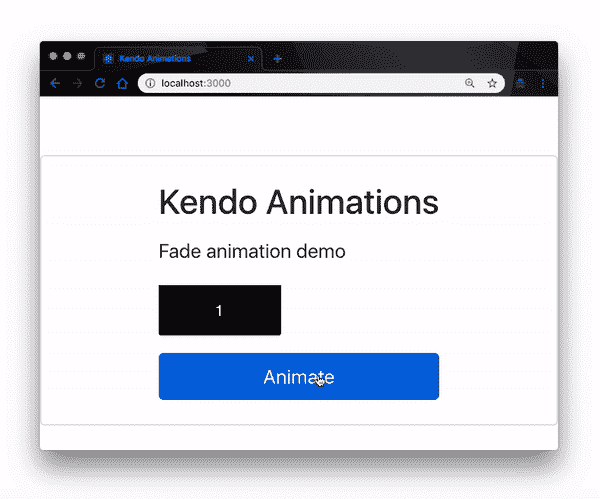
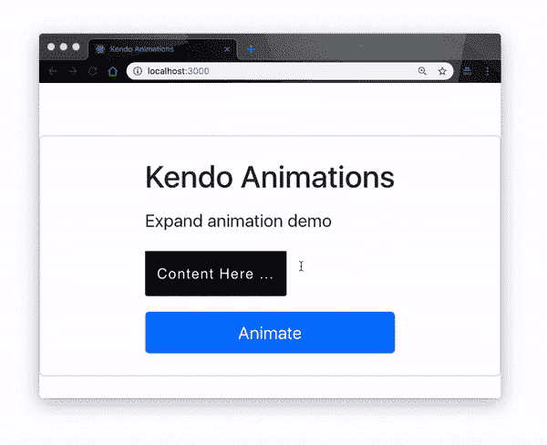
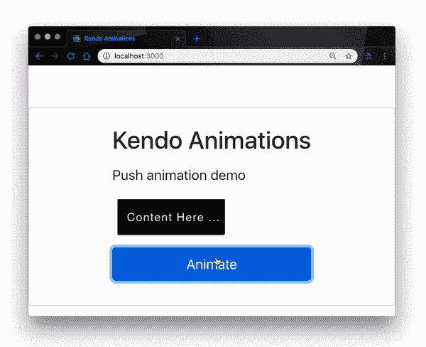
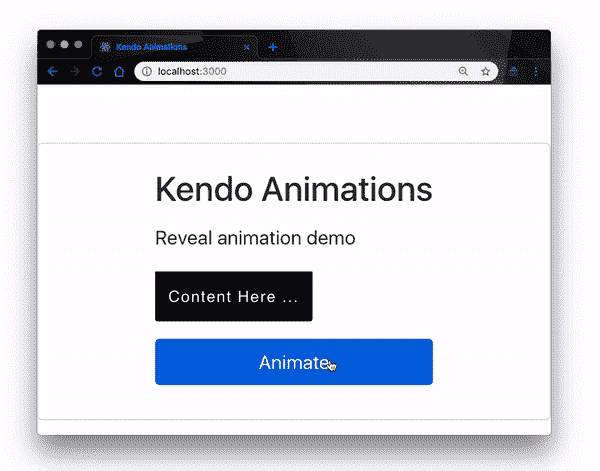
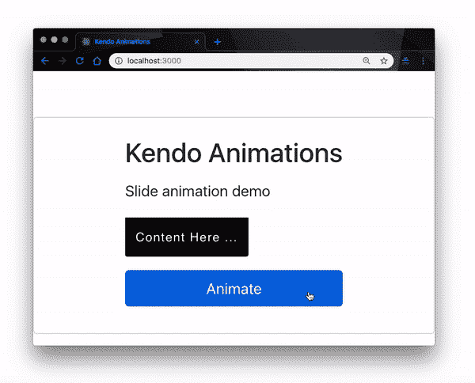
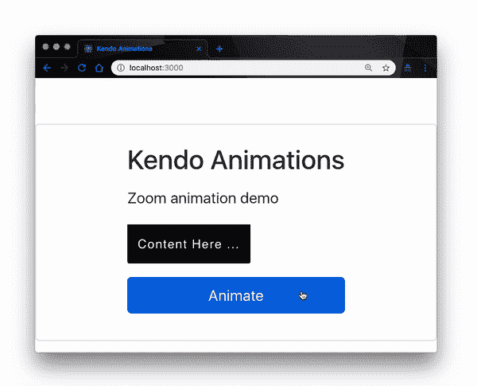
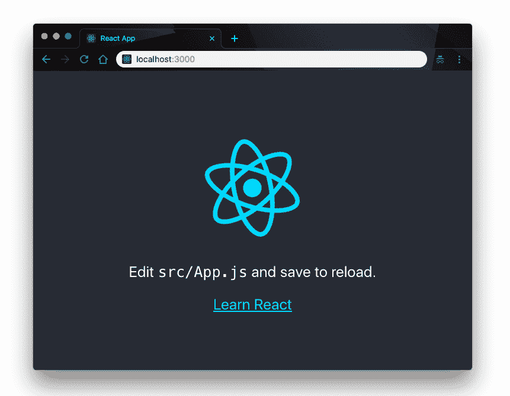
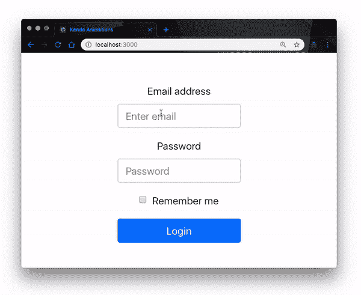

# 如何用剑道 UI 创建动画 React 组件

> 原文：<https://blog.logrocket.com/create-animated-react-components-with-kendo-ui-d16e65ddcf7b/>


动画是现代 web 开发组件的主要部分。它们为 web 应用程序呈现给用户的方式增加了美感和视觉吸引力，并提高了可用性和整体体验。

因此，对动画 web 页面的需求正在增长，但是在不引起主要性能或可用性问题的情况下，使某些 web 组件动画变得越来越复杂。

Kendo UI 在创建可重用的动画组件方面做得很好，我们可以在这些组件的基础上为我们的 web 应用程序定制无缝动画。在这篇文章中，我将演示我们如何快速开始使用 React 的剑道 UI 动画组件，将预定义的动画添加到 React 应用程序中。

### 剑道 UI 动画组件

在幕后，Kendo UI React 动画使用 React `[TransitionGroup](https://github.com/reactjs/react-transition-group)`组件来制作出现、进入或退出视图的元素的动画。因此，当 React 组件进入或退出时，它使用`[ReactTransitionGroup](https://github.com/reactjs/react-transition-group)`附加组件来执行 CSS 转换和动画。

[](https://logrocket.com/signup/)

### 动画类型

剑道 UI 动画组件提供了一组可定制的动画类型，您可以根据需要使用它们。它提供以下类型的动画:

*   淡化动画
*   展开动画
*   推送动画
*   显示动画
*   幻灯片动画
*   缩放动画

#### 淡化动画

淡入动画通过使用淡入效果使新添加的子对象进入视图来制作动画。下面是一个简单的演示，它在每次单击按钮时向组件添加一个新的子组件:

```
import { Fade } from '@progress/kendo-react-animation';
class App extends Component {
  constructor(props) {
      super(props);
      this.state = { index: 1 };
  }
  onClick = () => {
    this.setState({
        index: this.state.index + 1
    });
  }
  render(){
    const { index } = this.state;
    return(
      <div>
        <Fade><div> {index} </div></Fade>
        <button onClick={this.onClick}>Animate</button>
      </div>
    )
  }
}
```

这里，我们呈现了 Fade Animation 组件，并传入了一个计数器，以便在每次单击按钮时更新子组件。`TransitionGroup`生命周期钩子将自动检测元素的`enter`和`exit`状态，并适当地制作动画。下面是运行中的输出动画:



#### 展开动画

下一个是扩展动画。它激活了容器元素的`scaleY()`和`scaleX()` CSS 属性。考虑下面的例子:

```
  import { Expand } from '@progress/kendo-react-animation';
  class App extends Component {
    constructor(props) {
      super(props);
      this.state = { show: true };
    }
    onClick = () => {
      this.setState({
          show: !this.state.show
      });
    }
    render() {
      const { show } = this.state;
      const children = show ? (<div>Content Here ...</div>) : null;
      return (
        <div>               
          <Expand>
              {children}
          </Expand>
          <button onClick={this.onClick}>Animate</button>
        </div>
      )}
  }
```

就像前面一样，我们将一个定制的子组件传递给父动画组件，当按钮被单击时，父动画组件将使用 state 对象中的`show`变量来制作元素的动画。这是浏览器上的输出:



#### 推送动画

推动动画只是通过推出旧组件来滑入新组件。当组件进入和退出视图时，`TransitionGroup`钩子相应地添加动画效果。

```
import { Push } from '@progress/kendo-react-animation';
...
  <Push>
     {children}
  </Push>
...

```

Push Animation 组件是少数几个在屏幕上滑动子组件的组件之一，这为它提供了视觉吸引力。事情是这样的:



#### 显示动画

就像扩展动画一样，Reveal 动画显示容器元素的高度和宽度 CSS 属性。

```
import { Reveal } from '@progress/kendo-react-animation';
...
  <Reveal>
     {children}
  </Reveal>
...
```

显示动画对父零部件产生影响。这使得您可以随心所欲地定义子组件。父元素中元素的组成、属性和特征对显示动画本身没有影响。下面是上面片段中的一个演示:



#### 幻灯片动画

幻灯片动画与展开动画没有太大的不同。然而，与扩展不同，幻灯片动画以预定义的方向滑动单个内容。

```
import { Slide } from '@progress/kendo-react-animation';
...
  <Slide>
     {children}
  </Slide>
...
```

幻灯片和扩展动画之间的主要区别是能够预定义动画效果的方向。使用 Slide，默认情况下组件从顶部滑入和滑出，但是您可以自定义进入和退出位置。这里有一个演示:



#### 缩放动画

最后，剑道 UI 有一个缩放动画组件，它的工作方式类似于渐变动画。它通过应用放大和缩小过渡效果来显示其内容。

```
import { Zoom } from '@progress/kendo-react-animation';
...
  <Zoom>
     {children}
  </Zoom>
...

```

缩放动画对父组件产生放大或缩小效果。它类似于揭示动画；但是，这一次，它放大或缩小，而不是对高度和宽度属性施加显示效果。这里有一个演示:



### 管理动画持续时间

不管你选择实现哪种类型的动画，它们都是完全可定制的。对于每种动画类型，您可以控制进入和退出动画效果的持续时间。例如，我们可以通过重新定义代码来添加转场持续时间值，从而加速缩放动画的效果，如下所示:

```
import { Zoom } from '@progress/kendo-react-animation';
...
<Zoom 
  transitionEnterDuration={500} 
  transitionExitDuration={800}>
      {children}
</Zoom>
...
```

转场持续时间越短，动画效果越快。这适用于我们在这里讨论的所有其他类型的动画。

### 制作 React 登录组件的动画

已经看到了剑道 UI 提供的所有不同的动画类型，让我们把它们放在一起，使用剑道 UI 动画组件创建一个带有动画登录页面的迷你 React 项目。首先，让我们创建一个 React 项目。打开终端窗口并运行以下命令:

```
create-react-app animations-demo
cd animations-demo && npm start
```

*注意，您需要全局安装* [*React CLI*](https://github.com/facebook/create-react-app) *工具来运行上面的命令。*

这将创建`animations-demo`项目，并在默认浏览器中的`localhost:3000`上启动开发服务器。打开该端口的浏览器，您应该可以看到项目正在运行:



#### 安装剑道用户界面

接下来，我们安装剑道 UI 动画组件。在项目的根目录中打开一个终端，并运行以下命令:

```
npm install --save @progress/kendo-react-animation
```

这将在您的项目中安装动画包。接下来，添加剑道 UI 默认主题包。打开`public`目录下的`index.html`文件，在`<head/>`标签内添加这个链接:

```
<link rel="stylesheet" href="https://unpkg.com/@progress/[email protected]/dist/all.css" />
```

#### 创建动画登录组件

接下来，我们创建我们的登录组件。在`src`目录中，创建一个名为`components`的新目录。在新的`components`目录中，创建一个名为`Login.js`的新文件。

我们想做的是实现一个简单的登录页面，用户将提供他们的登录细节。如果它们的凭证是正确的，那么组件会显示为一个新页面；如果凭证是错误的，我们用 Kendo UI 对话框组件抛出一个错误对话框。

也就是说，让我们开始吧。打开我们之前创建的`Login.js`文件，用下面的代码更新它:

```
<!-- src/components/Login -->
import React, { Component } from "react";
import { Push } from "@progress/kendo-react-animation";
import { Dialog, DialogActionsBar } from "@progress/kendo-react-dialogs";
class Login extends Component {
  constructor(props) {
    super(props);
    this.state = {
      email: "",
      password: "",
      show: true,
      visibleDialog: false
    };
    this.handleEmailChange = this.handleEmailChange.bind(this);
    this.handlePasswordChange = this.handlePasswordChange.bind(this);
    this.loginUser = this.loginUser.bind(this);
    this.toggleDialog = this.toggleDialog.bind(this);
  }
  ...
}
```

这里，我们定义了一个构造函数，并用整个应用程序中需要的值初始化了状态对象。我们还将所有事件处理程序绑定到这个上下文中。

接下来，我们来定义一下。用下面的代码片段更新文件:

```
  <!-- src/components/Login -->
  ...
  toggleDialog = () => {
    this.setState({
      visibleDialog: !this.state.visibleDialog
    });
  };
  handleEmailChange(e) {
    this.setState({ email: e.target.value});
  }
  handlePasswordChange(e) {
    this.setState({ password: e.target.value});
  }
  loginUser(e) {
    e.preventDefault();
    if (this.state.email === "[email protected]" && this.state.password === "1234"){
      this.setState({
        show: !this.state.show
      });
    } else {
      this.toggleDialog();
    }
  }
  ...
```

这里我们定义了事件处理程序的功能:

*   `toggleDialog()`功能帮助我们在提交错误凭证时显示对话框组件
*   `handleEmailChange()`和`handlePasswordChange()`帮助我们用登录输入字段的值更新状态对象中的电子邮件和密码变量
*   `loginUser()`函数帮助我们在凭证匹配时激活登录组件，或者在不匹配时抛出对话框。

接下来，我们定义我们的`render()`方法，使用我们在状态对象中定义的`show`变量的值有条件地显示我们的登录组件:

```
  <!-- src/components/Login -->
  ...
  render() {
    const { show } = this.state;
    const children = show ? (
      <div>
        <form>
          <div class="form-group">
            <label for="exampleInputEmail1">Email address</label>
            <input
              value={this.state.email}
              onChange={this.handleEmailChange}
              type="email"
              class="form-control"
              id="exampleInputEmail1"
              aria-describedby="emailHelp"
              placeholder="Enter email"/>
          </div>
          <div class="form-group">
            <label for="exampleInputPassword1">Password</label>
            <input
              value={this.state.password}
              onChange={this.handlePasswordChange}
              type="password"
              class="form-control"
              id="exampleInputPassword1"
              placeholder="Password"
            />
          </div>
          <div class="form-group form-check">
            <input
              type="checkbox"
              class="form-check-input"
              id="exampleCheck1"
            />
            <label class="form-check-label" for="exampleCheck1">
              Remember me
            </label>
          </div>
          <button onClick={this.loginUser} class="btn btn-primary form-control">
            Login
          </button>
        </form>{" "}
      </div>
    ) : null;
  ...
}
```

这里我们先检查一下`show`变量是否为`true`；如果是，我们将呈现登录表单，让用户提供他们的详细信息。在`render()`函数的`return()`方法中，我们将定义我们的对话框，并在推送动画组件中呈现登录表单。

```
  <!-- src/components/Login -->
  ...  
  return (
      <div>
        <div>
          {!this.state.visibleDialog}
          {this.state.visibleDialog && (
            <Dialog title={"Login Error"} onClose={this.toggleDialog}>
              <p style={{ margin: "25px", textAlign: "center" }}>
                Wrong credentials, try again?
              </p>
              <DialogActionsBar>
                <button className="k-button" onClick={this.toggleDialog}>
                  No
                </button>
                <button className="k-button" onClick={this.toggleDialog}>
                  Yes
                </button>
              </DialogActionsBar>
            </Dialog>
          )}
        </div>
        <div class="text-center mt-5">
          <Push transitionEnterDuration={500} transitionExitDuration={800}>
            {children}
          </Push>
        </div>
      </div>
    );
  }
}
export Default Login
```

最后，我们用刚刚创建的新登录组件更新 App.js 文件。打开它，用下面的代码更新它:

```
// src/App.js
import React, { Component } from 'react';
import './App.css';
import Login from './components/Login' 
  class App extends Component {
    render() {
      return(
      <Login/>
      );
    }
 }

export default App;
```

下面是我们实现背后的逻辑:我们定义了一个用户，他可以用电子邮件`[[email protected]](/cdn-cgi/l/email-protection)`和密码`1234`登录我们的应用程序。显然，您应该在生产中执行适当的认证和验证；我们只是出于演示的目的使用了这种技术。

因此，如果没有提供这些确切的凭证，我们将抛出错误对话框；如果是，我们就用剑道 UI 推送动画组件将登录组件动画化。如果您运行我们刚刚设置的应用程序，您应该具有以下功能:



### 结论

在这篇文章中，我们已经了解了剑道 UI 反应动画组件。我们已经展示了使用剑道 UI 可以实现的动画类型，并继续构建一个迷你动画 React 登录页面来将文字付诸行动。

你可以用剑道用户界面做更多的事情，你可以在官方文档中找到。我觉得有必要提一下，你不能用剑道用户界面处理扩展的、复杂的动画，但是如果你要构建的东西在剑道用户界面的能力范围之内，这是一个很好的选择。

## [LogRocket](https://lp.logrocket.com/blg/react-signup-general) :全面了解您的生产 React 应用

调试 React 应用程序可能很困难，尤其是当用户遇到难以重现的问题时。如果您对监视和跟踪 Redux 状态、自动显示 JavaScript 错误以及跟踪缓慢的网络请求和组件加载时间感兴趣，

[try LogRocket](https://lp.logrocket.com/blg/react-signup-general)

.

[ ](https://lp.logrocket.com/blg/react-signup-general) [](https://lp.logrocket.com/blg/react-signup-general) 

LogRocket 结合了会话回放、产品分析和错误跟踪，使软件团队能够创建理想的 web 和移动产品体验。这对你来说意味着什么？

代替猜测错误发生的原因，或者要求用户提供截图和日志转储，LogRocket 允许您重放问题，就像它们发生在您自己的浏览器中一样，以快速了解出了什么问题。

不再有嘈杂的警报。智能错误跟踪允许您对问题进行分类，然后从中学习。获得有影响的用户问题的通知，而不是误报。警报越少，有用的信号越多。

LogRocket Redux 中间件包为您的用户会话增加了一层额外的可见性。LogRocket 记录 Redux 存储中的所有操作和状态。

现代化您调试 React 应用的方式— [开始免费监控](https://lp.logrocket.com/blg/react-signup-general)。

* * *