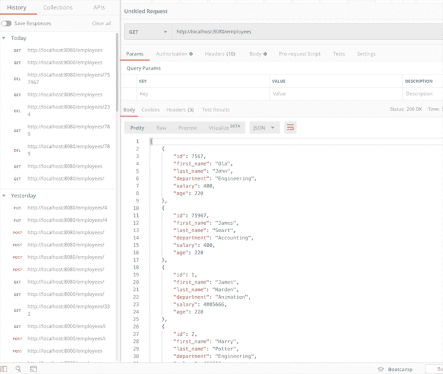

# 如何用 Rust 和 Postgres 创建后端 API

> 原文：<https://blog.logrocket.com/create-backend-api-with-rust-postgres/>

***编者按*** *:本帖更新于 2022 年 2 月 22 日，修复了与 Diesel 的连接并做了其他改进。*

有相当多的框架使得创建 REST API 变得容易，同时减少了您必须编写的样板文件的数量。我个人更喜欢 Rust，因为它简单、类型强、[速度极快、](https://benchmarksgame-team.pages.debian.net/benchmarksgame/fastest/rust-go.html)[比几乎任何语言都安全。](https://msrc-blog.microsoft.com/2019/07/22/why-rust-for-safe-systems-programming/)

要继续学习本教程，您需要对 API 开发有一个基本的了解。你至少要明白 [CRUD](https://blog.logrocket.com/crud-with-node-graphql-react/) 的概念。

我们将涵盖:

## 项目要求

在我们深入编码之前，让我们确定我们将构建什么，并回顾一些基本的需求和假设来完成演示。

我们将为一个样本员工管理应用程序创建所有的 CRUD API 端点。这将是一个基本项目，旨在展示用 Rust 编写 API 的所有基本构件。

我选择了 Actix web 3.0 框架，因为它是最流行的框架之一，有很好的文档，并且使用了类似于 Node.js 中的 [Express 的模式。其他受欢迎的替代品包括](https://blog.logrocket.com/build-rest-api-node-express-mysql/)[火箭](https://rocket.rs/)和[塔](https://github.com/carllerche/tower-web)。

我们的数据层将由 Postgres 和 Diesel 组成，用 [Diesel](https://diesel.rs/) 作为 ORM 和查询构建器。

### 要知道的术语

我写这个指南是为了让对 Rust 语言有基本了解的人容易理解，但是为了清楚起见，这里有一些你应该熟悉的术语。

*   Spawn blocking:这是一种试图对抗执行繁重/长时间调用任务的线程(例如，从数据库中检索大量记录)。这个过程有助于产生新级别的线程，以避免异步函数中的延迟
*   异步(async/await):一个内置函数，用作编写异步行为的`async` / `await`工具

## Rust 项目设置和结构

首先，让我们看看如何建立一个基本的 Rust 项目，构建文件夹，并安装依赖项。如果您来自 Node.js 背景，您应该已经熟悉使用`npm`进行包管理和注册。Rust 中的对等物称为`cargo`。

不幸的是，在撰写本文时，`cargo`还没有自动更新依赖项的方法，除了使用一个名为 [`cargo-update`](https://crates.io/crates/cargo-update%22) 或`cargo install --force crate-name`的箱子，您也可以决定在`cargo.toml`文件中写出依赖项的名称和版本。

如果您没有安装 Rust，请遵循[安装指南](https://www.rust-lang.org/tools/install)。否则，创建一个新项目。

```
cargo new emply

```

### 项目结构

以下是该项目的文件夹结构；你也可以选择你想要的结构。这意味着文件的命名约定是不言自明的。

```
employee/
  - src/
    - employees/
      - mod.rs
      - model.rs
      - routes.rs
    - db.rs
    - error_handlers.rs
    - main.rs
  - .env
  - Cargo.toml

```

我们的`mod.rs`文件有助于管理`employees`目录中文件的相对路径，如下所示:

```
mod model;
mod routes;
pub use model::*;
pub use routes::init_routes;

```

这是我们的应用程序的`Cargo.toml`文件:

```
[package]
name = "employee"
version = "0.1.0"
authors = ["Ola John <[email protected]>"]
edition = "2018"
# See more keys and their definitions at https://doc.rust-lang.org/cargo/reference/manifest.html
[dependencies]
actix-web = "3.0"
actix-rt = "1.0"
chrono = { version = "0.4", features = ["serde"] }
dotenv = "0.11"
diesel = { version = "1.4", features = ["postgres", "r2d2", "uuid", "chrono"] }
diesel_migrations = "1.4"
env_logger = "0.6"
lazy_static = "1.4"
listenfd = "0.3"
serde = "1.0"
serde_json = "1.0"
r2d2 = "0.8"
uuid = { version = "0.6", features = ["serde", "v4"] }

```

这是我们的主程序，包含一些板条箱和配置:

*   [listenfd](https://crates.io/crates/listenfd) :当检测到文件有变化时重启服务器
*   dotenv :帮助管理我们的环境变量
*   `db::init()`:启动数据库连接的函数，从另一个名为`db.rs`的文件中引用
*   `employees::init_routes`:抽象出本项目中使用的所有路线的函数

代码的另一部分是关于`listenfd`机箱的`actix-web`服务器设置。

```
#[actix_rt::main]
async fn main() -> std::io::Result<()> {
    dotenv().ok();
    db::init();
    let mut listenfd = ListenFd::from_env();
    let mut server = HttpServer::new(|| App::new().configure(employees::init_routes));
    server = match listenfd.take_tcp_listener(0)? {
        Some(listener) => server.listen(listener)?,
        None => {
            let host = env::var("HOST").expect("Please set host in .env");
            let port = env::var("PORT").expect("Please set port in .env");
            server.bind(format!("{}:{}", host, port))?
        }
    };
    server.run().await
}

```

## 创建 API 端点

我们的端点是在名为`routes.rs`的文件中创建的。我们的路由也需要返回 JSON 响应，这就是为什么我们添加了 [serde crate](https://serde.rs/) 来处理服务器上数据的序列化和反序列化。

我们 CRUD 操作的终点包括:

*   *   获取所有员工:`/employees`
    *   获取单个员工:`/employees/{id}`
    *   添加员工:`/employees`
    *   更新员工:`/employee/{id}`
    *   删除员工:`/employee/{id}`

```
#[get("/employees")]
async fn find_all() -> Result<HttpResponse, CustomError> {
    let employees = web::block(|| Employees::find_all()).await.unwrap();
    Ok(HttpResponse::Ok().json(employees))
}
#[get("/employees/{id}")]
async fn find(id: web::Path) -> Result<HttpResponse, CustomError> {
    let employee = Employees::find(id.into_inner())?;
    Ok(HttpResponse::Ok().json(employee))
}
#[post("/employees")]
async fn create(employee: web::Json) -> Result<HttpResponse, CustomError> {
    let employee = Employees::create(employee.into_inner())?;
    Ok(HttpResponse::Ok().json(employee))
}
#[put("/employees/{id}")]
async fn update(
    id: web::Path,
    employee: web::Json,
) -> Result<HttpResponse, CustomError> {
    let employee = Employees::update(id.into_inner(), employee.into_inner())?;
    Ok(HttpResponse::Ok().json(employee))
}
#[delete("/employees/{id}")]
async fn delete(id: web::Path) -> Result<HttpResponse, CustomError> {
    let deleted_employee = Employees::delete(id.into_inner())?;
    Ok(HttpResponse::Ok().json(json!({ "deleted": deleted_employee })))
}
pub fn init_routes(config: &mut web::ServiceConfig) {
    config.service(find_all);
    config.service(find);
    config.service(create);
    config.service(update);
    config.service(delete);
}
```

创建异步函数是为了将我们所有的 CRUD 操作抽象成一个名为`Employees`的实现类型。它们返回`Result<HttpResponse, CustomError>`，其中`CustomError`在我们的`error_handler.rs`文件中声明，这更像是拥有一个定制的异常处理程序。

如上所述，我们在一个名为`init_routes()`的函数中注册了我们的路线，以获得一个更清晰、更模块化的代码。

注意，我们添加了`spawn blocking`来获取所有雇员的端点，以便在我们从数据库中查询大量记录的情况下，该流程不会阻塞其他任务的执行。

```
let employees = web::block(|| Employees::find_all()).await.unwrap();

```

## 设置我们的 Postgres 连接

`db.rs`文件包含到我们的 PostgreSQL 数据库的连接池，`connection()`和`init()`被用作其他文件中可访问性的公共函数。我们还使用 [`lazy_static`机箱](https://crates.io/crates/lazy_static)来要求静态代码在运行时执行，以便进行初始化；在这种情况下，它是我们的数据库连接。

```
use crate::error_handler::CustomError;
use diesel::pg::PgConnection;
use diesel::r2d2::ConnectionManager;
use lazy_static::lazy_static;
use r2d2;
use std::env;
type Pool = r2d2::Pool<ConnectionManager<PgConnection>>;
pub type DbConnection = r2d2::PooledConnection<ConnectionManager<PgConnection>>;
embed_migrations!();
lazy_static! {
    static ref POOL: Pool = {
        let db_url = env::var("DATABASE_URL").expect("Database url not set");
        let manager = ConnectionManager::<PgConnection>::new(db_url);
        Pool::new(manager).expect("Failed to create db pool")
    };
}
pub fn init() {
    lazy_static::initialize(&POOL);
    let conn = connection().expect("Failed to get db connection");
    embedded_migrations::run(&conn).unwrap();
}
pub fn connection() -> Result<DbConnection, CustomError> {
    POOL.get()
        .map_err(|e| CustomError::new(500, format!("Failed getting db connection: {}", e)))
}

```

## 使用柴油来建立我们的 ORM

Diesel 被用作我们的对象关系映射器(ORM ),方便查询和数据库表的对象映射。查看 [diesel.rs](https://diesel.rs/) 获取设置和安装的完整指南。

```
#[derive(Serialize, Deserialize, AsChangeset, Insertable)]
#[table_name = "employees"]
pub struct Employee {
    pub first_name: String,
    pub last_name: String,
    pub department: String,
    pub salary: i32,
    pub age: i32,
}

#[derive(Serialize, Deserialize, Queryable)]
pub struct Employees {
    pub id: i32,
    pub first_name: String,
    pub last_name: String,
    pub department: String,
    pub salary: i32,
    pub age: i32,
}

impl Employees {
    pub fn find_all() -> Result<Vec<Self>, CustomError> {
        let conn = db::connection()?;
        let employees = employees::table.load::<Employees>(&conn)?;
        Ok(employees)
    }
    pub fn find(id: i32) -> Result<Self, CustomError> {
        let conn = db::connection()?;
        let employee = employees::table.filter(employees::id.eq(id)).first(&conn)?;
        Ok(employee)
    }
    pub fn create(employee: Employee) -> Result<Self, CustomError> {
        let conn = db::connection()?;
        let employee = Employee::from(employee);
        let employee = diesel::insert_into(employees::table)
            .values(employee)
            .get_result(&conn)?;
        Ok(employee)
    }
    pub fn update(id: i32, employee: Employee) -> Result<Self, CustomError> {
        let conn = db::connection()?;
        let employee = diesel::update(employees::table)
            .filter(employees::id.eq(id))
            .set(employee)
            .get_result(&conn)?;
        Ok(employee)
    }
    pub fn delete(id: i32) -> Result<usize, CustomError> {
        let conn = db::connection()?;
        let res = diesel::delete(employees::table.filter(employees::id.eq(id))).execute(&conn)?;
        Ok(res)
    }
}
impl Employee {
    fn from(employee: Employee) -> Employee {
        Employee {
            first_name: employee.first_name,
            last_name: employee.last_name,
            department: employee.department,
            salary: employee.salary,
            age: employee.age,
        }
    }
}

```

Diesel 模型映射用于标识表中的列。宏`AsChangeset`、`Insertable`和`Queryable`被指定执行诸如查询记录和在我们的表上插入的操作。`serde` crate 还可以序列化和反序列化注释，并用于将我们的模型与 JSON 相互转换。

```
// Insertion and other operation
#[derive(Serialize, Deserialize, AsChangeset, Insertable)]
#[table_name = "employees"]
pub struct Employee {
    pub first_name: String,
    pub last_name: String,
    pub department: String,
    pub salary: i32,
    pub age: i32,
}
// Diesel ORM object mapping for to query table
#[derive(Serialize, Deserialize, Queryable)]
pub struct Employees {
    pub id: i32,
    pub first_name: String,
    pub last_name: String,
    pub department: String,
    pub salary: i32,
    pub age: i32,
}

```

## 运行我们的 Rust API 演示应用

让我们测试一下一切是否如预期的那样工作。如果您运行`cargo watch`命令，您应该能够通过您的 API 端点从数据库中创建、读取、更新和删除(CRUD)一个雇员。



在 [GitHub](https://github.com/olajohn-ajiboye/Rust-Rest-API) 上查看本教程引用的完整代码。

## 结论

您现在应该理解了如何使用 Actix 在 Rust 中创建 API 端点和处理简单的请求响应周期。我们讨论了如何构建端点来处理基本的 CRUD 操作，用 Diesel ORM 管理数据。

我真正喜欢用 Rust 构建 API 的地方是，它通过让你批判性地思考你的代码来实施良好的实践。如果你的代码可以编译，那么实际上就可以保证它能完成预期的任务。

如需深入了解，请参考已完成的 [GitHub repo](https://github.com/iamhabbeboy/rest-api-actix-web) 。

## [log rocket](https://lp.logrocket.com/blg/rust-signup):Rust 应用的 web 前端的全面可见性

调试 Rust 应用程序可能很困难，尤其是当用户遇到难以重现的问题时。如果您对监控和跟踪 Rust 应用程序的性能、自动显示错误、跟踪缓慢的网络请求和加载时间感兴趣，

[try LogRocket](https://lp.logrocket.com/blg/rust-signup)

.

[](https://lp.logrocket.com/blg/rust-signup)

LogRocket 就像是网络和移动应用程序的 DVR，记录你的 Rust 应用程序上发生的一切。您可以汇总并报告问题发生时应用程序的状态，而不是猜测问题发生的原因。LogRocket 还可以监控应用的性能，报告客户端 CPU 负载、客户端内存使用等指标。

现代化调试 Rust 应用的方式— [开始免费监控](https://lp.logrocket.com/blg/rust-signup)。