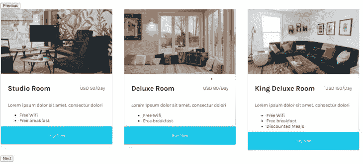

# 用 React Slick - LogRocket 博客创建一个旋转木马

> 原文：<https://blog.logrocket.com/create-carousel-react-slick/>

经常需要将传送带集成到我们的 web 应用程序中。旋转木马是在单个空间中显示多个项目的 UI 组件。

它们是网页上最具美感的组件之一，但通常很难从头开始创建，尤其是在 React 这样的框架中。

React Slick 是一个创建旋转木马的伟大的库。它提供了可访问性和响应性，以及其他功能，来帮助您创建高性能的旋转木马。在本文中，您将学习如何使用 React Slick 创建一个简单的 carousel 组件，并探索它的一些主要特性。

## 先决条件

要跟上，您应该对有一个基本的了解

*   反应
*   ES6(扩展运算符，可选链接)

## 设置项目

在本教程中，我们将创建一个显示酒店可用房间的旋转视图。

打开您的终端并运行以下命令来安装 React:

```
npx create-react-app react-carousel

```

接下来进入 react-carousel 目录:

```
cd react-carousel

```

并安装以下依赖项:

```
npm install react-slick slick-carousel react-icons

```

React Slick 是为我们提供 carousel 组件的主库。slick-carousel 为这个组件提供了样式，而 react-icons 将用于导入图标。

该应用程序的所有样式都位于[源代码](https://github.com/Chinwike1/react-slick-carousel)中的`src/index.css`中。查看[直播项目](https://chinwike1.github.io/react-slick-carousel/)。

## 创建转盘组件

从根目录创建路径`components/Carousel.js`并将该组件导入`App.js`:

```
//App.js
import Carousel from "../components/Carousel";

export default function App() {
  return <Carousel />;
}

```

通常，轮播的每个项目中显示的内容都是相似的。因此，我们可以将这些内容存储在一个数组中，如下所示:

```
// Carousel.js
import 'slick-carousel/slick/slick.css'
import 'slick-carousel/slick/slick-theme.css'

export default function Carousel() {
  const hotelCards = [
    {
      imageSrc:
        'https://images.unsplash.com/photo-1559508551-44bff1de756b?ixid=MnwxMjA3fDB8MHxwaG90by1wYWdlfHx8fGVufDB8fHx8&ixlib=rb-1.2.1&auto=format&fit=crop&w=387&q=80',
      title: 'Studio Room',
      description: 'Lorem ipsum dolor sit amet, consectur dolori',
      pricingText: 'USD 50/Day',
      features: ['Free Wifi', 'Free breakfast'],
    },
    {
      imageSrc:
        'https://images.unsplash.com/photo-1616940844649-535215ae4eb1?ixlib=rb-1.2.1&ixid=MnwxMjA3fDB8MHxwaG90by1wYWdlfHx8fGVufDB8fHx8&auto=format&fit=crop&w=387&q=80',
      title: 'Deluxe Room',
      description: 'Lorem ipsum dolor sit amet, consectur dolori',
      pricingText: 'USD 80/Day',
      features: ['Free Wifi', 'Free breakfast'],
    },
    {
      imageSrc:
        'https://images.unsplash.com/photo-1599619351208-3e6c839d6828?ixlib=rb-1.2.1&ixid=MnwxMjA3fDB8MHxwaG90by1wYWdlfHx8fGVufDB8fHx8&auto=format&fit=crop&w=872&q=80',
      title: 'King Deluxe Room',
      description: 'Lorem ipsum dolor sit amet, consectur dolori',
      pricingText: 'USD 150/Day',
      features: ['Free Wifi', 'Free breakfast', 'Discounted Meals'],
    },
    {
      imageSrc:
        'https://images.unsplash.com/photo-1461092746677-7b4afb1178f6?ixlib=rb-1.2.1&ixid=MnwxMjA3fDB8MHxwaG90by1wYWdlfHx8fGVufDB8fHx8&auto=format&fit=crop&w=774&q=80',
      title: 'Royal Suite',
      description: 'Lorem ipsum dolor sit amet, consectur dolori',
      pricingText: 'USD 299/Day',
      features: [
        'Free Wifi',
        'Free breakfast',
        'Discounted Meals',
        "MacBook for work use (hotel's property)",
      ],
    },
  ]

  return (
    <div className='content'></div>
  )
}

```

注意，我还从组件顶部的 slick-carousel 导入了两个样式表。

## 使用`Slider`和配置`Slider`设置

有了我们需要的内容，让我们开始绘制 Carousel 组件的结构。React Slick 有一个负责显示传送带的`Slider`组件:

```
// Carousel.js
import Slider from 'react-slick'

import 'slick-carousel/slick/slick.css'
import 'slick-carousel/slick/slick-theme.css'

export default function Carousel() {

  const sliderSettings = {
    slidesToShow: 3,
    slidesToScroll: 1,
    infinite: false,
  }

  const hotelCards = [
    // ...
  ]

  return (
    <div className='content'>
      <Slider {...sliderSettings}>
        {hotelCards.map((card, index) => (
          <div key={index}>
            <h2>{card.title}</h2>
            
            <p>{card.description}</p>
            <ul>
              {card.features.map((feature, index) => (
                <li key={index}>{feature}</li>
              ))}
            </ul>
            <button className='btn'>Buy Now</button>
          </div>
        ))}
      </Slider>
    </div>
  )
}

```

在上面的代码块中，我们创建了一个`sliderSettings`变量来存储轮播设置。然后我们将这个对象扩展到`Slider`组件中。

`sliderSettings`到目前为止有三种配置:

*   `slidesToShow` —数字，用于确定要保留在视图中的幻灯片数量
*   `slidesToScroll` —数字，用于确定浏览转盘时要移动的载玻片数量
*   `infinite` —用于确定到达最后一个项目时转盘是否继续循环的布尔值

此时的最终结果应该是这样的:



*注意:React Slick 有更多的旋转木马配置，我们稍后会介绍。*

## 自定义**下一个**和**上一个**按钮

React Slick 给出的默认控制按钮可以完成这项工作，但是可能没有通过 UI 测试。

因此，让我们创建自己的自定义按钮，并使用 React Slick 的 API 来使它们发挥作用。我们将从移除按钮开始:

```
// Carousel.js
import {useState} from 'react'
import Slider from 'react-slick'
import {FaChevronLeft, FaChevronRight} from 'react-icons'

import 'slick-carousel/slick/slick.css'
import 'slick-carousel/slick/slick-theme.css'

export default function Carousel() {
  const [sliderRef, setSliderRef] = useState(null)

  const sliderSettings = {
    // removes default buttons
    arrows: false,
    slidesToShow: 3,
    slidesToScroll: 1,
    infinite: false,
  }

  const hotelCards = [
    // ...
  ]

  return (
    <div className='content'>
      <div className='controls'>
        <button>
          <FaChevronLeft />
        </button>
        <button>
          <FaChevronRight />
        </button>
      </div>
      <Slider ref={setSliderRef} {...sliderSettings}>
        {pricingCards.map((card, index) => (
          <div key={index}>
            <h2>{card.title}</h2>
            <p>{card.description}</p>
            <ul>
              {card.features.map((feature, index) => (
                <li key={index}>{feature}</li>
              ))}
            </ul>
            <button>Buy Now</button>
          </div>
        ))}
      </Slider>
    </div>
  )
}

```

为了访问 React Slick 的 API，我们必须通过将`Slider`的 ref 值链接到 state——其初始值设置为`null`,将`Slider`的实例存储在变量(state)中。当组件呈现时，我们可以通过这个状态访问 API。

我们想从 API 中使用的两个函数是`slickPrev`和`slickNext`，它们分别按照`slidesToScroll`中指定的数量来回移动转盘。将这个应用到按钮上，我们的返回函数应该是这样的:

```
return (
    <div className='content'>
      <button onCLick={sliderRef?.slickPrev}>
        <FaChevronLeft />
      </button>
      <button onCLick={sliderRef?.slickNext}>
        <FaChevronRight />
      </button>
      <Slider ref={setSliderRef} {...sliderSettings}>
        {pricingCards.map((card, index) => (
          <div key={index}>
            <h2>{card.title}</h2>
            <p>{card.description}</p>
            <ul>
              {card.features.map((feature, index) => (
                <li key={index}>{feature}</li>
              ))}
            </ul>
            <button>Buy Now</button>
          </div>
        ))}
      </Slider>
    </div>
  )

```


## 响应设置

React Slick 还让我们通过`responsive`属性控制响应。

`responsive`属性是一个有两个值的数组:`breakpoint`和`settings`。

*   `breakpoint` —我们希望后续设置生效的数字(以像素为单位)
*   `settings` —包含到达断点时要应用的转盘设置的对象

将以下配置添加到`sliderSettings`:

```
const sliderSettings = {
  // ...
  responsive: [
    {
      breakpoint: 1024,
      settings: {
       slidesToShow: 2,
      }
    },
    {
      breakpoint: 600,
      settings: {
       slidesToShow: 1,
      }
     }
  ]
};

```

这样，在不损坏 UX 的情况下，在多个设备上控制我们的旋转木马的视图变得更加容易。

除了响应性，React Slick 还将其`accessibility`选项默认设置为`true`。这允许箭头键和在转盘上拖动鼠标的手势来移动转盘。

下面是一些你可以尝试的其他设置。在他们的[页面](https://react-slick.neostack.com/docs/example/simple-slider/)上查看所有示例:

```
const settings = { 
    fade: true ,
    speed: 500, // ms
    autoplay: false,
    initialSlide: 2,
    lazyLoad: true,
    autoplaySpeed: 3000,
}

```

## 结论

React Slick 是一个库，其中充满了可以轻松融入您的 web 项目的好选项。凭借在 [npm](https://www.npmjs.com/package/react-slick) 上超过 80 万的下载量，React Slick 可能真的是你需要的最后一个 React carousel。

## [LogRocket](https://lp.logrocket.com/blg/react-signup-general) :全面了解您的生产 React 应用

调试 React 应用程序可能很困难，尤其是当用户遇到难以重现的问题时。如果您对监视和跟踪 Redux 状态、自动显示 JavaScript 错误以及跟踪缓慢的网络请求和组件加载时间感兴趣，

[try LogRocket](https://lp.logrocket.com/blg/react-signup-general)

.

[ ](https://lp.logrocket.com/blg/react-signup-general) [](https://lp.logrocket.com/blg/react-signup-general) 

LogRocket 结合了会话回放、产品分析和错误跟踪，使软件团队能够创建理想的 web 和移动产品体验。这对你来说意味着什么？

LogRocket 不是猜测错误发生的原因，也不是要求用户提供截图和日志转储，而是让您回放问题，就像它们发生在您自己的浏览器中一样，以快速了解哪里出错了。

不再有嘈杂的警报。智能错误跟踪允许您对问题进行分类，然后从中学习。获得有影响的用户问题的通知，而不是误报。警报越少，有用的信号越多。

LogRocket Redux 中间件包为您的用户会话增加了一层额外的可见性。LogRocket 记录 Redux 存储中的所有操作和状态。

现代化您调试 React 应用的方式— [开始免费监控](https://lp.logrocket.com/blg/react-signup-general)。