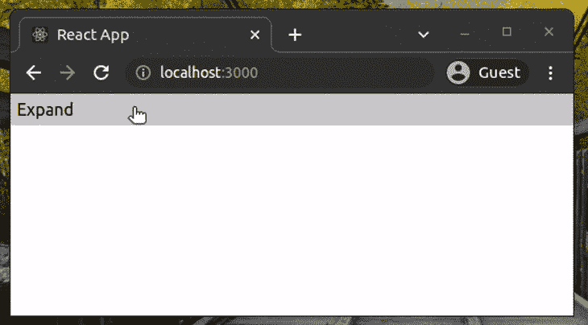
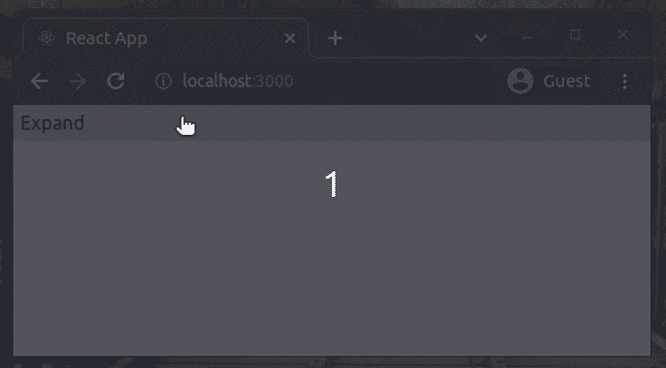
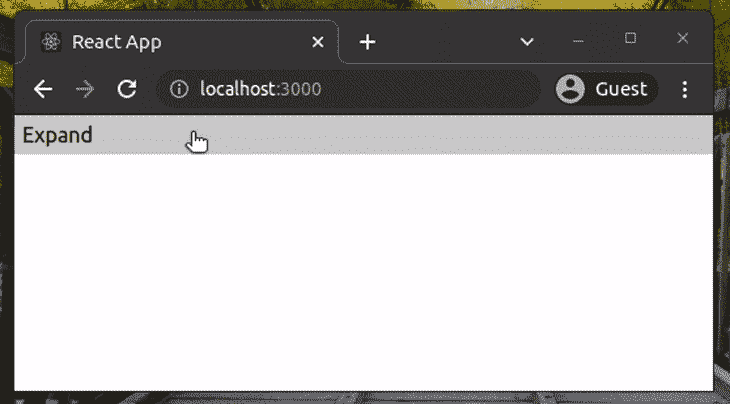
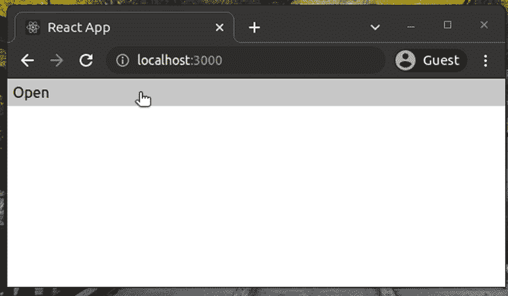
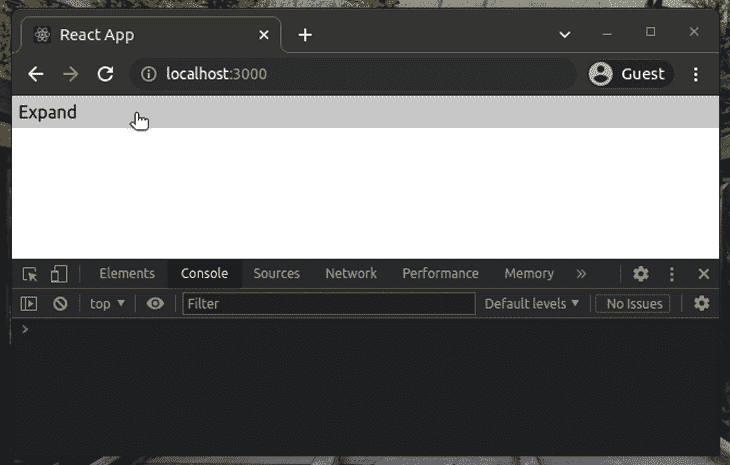
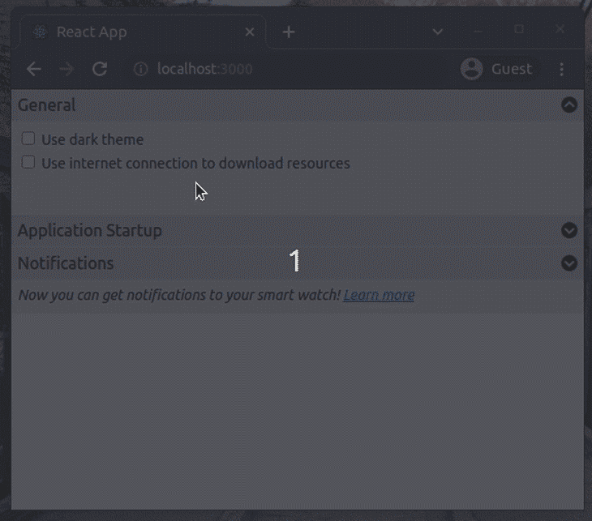

# 使用 react-collapsed 创建可折叠的 React 组件

> 原文：<https://blog.logrocket.com/create-collapsible-react-components-react-collapsed/>

现代的 React web 应用程序由选项卡、进度条、图表、可拖动元素、可折叠组件等组成。—所有这些都是由组件构建的。我们将关注可折叠组件，它有两种状态:折叠和展开。

当可折叠组件处于折叠状态时，通常不会显示其全部内容，但用户可以通过单击鼠标或点击屏幕来展开它，从而查看全部内容。前端开发人员使用可折叠组件来创建动作流、可编辑表单和首选项部分。

可折叠的设计有助于我们隐藏不直接相关的内容。例如，您可以使用一个可折叠的组件，在特定的、以设置为中心的页面上的基本设置列表之后显示更多的高级设置。

在本教程中，我将解释如何使用 [react-collapsed 库](https://github.com/roginfarrer/react-collapsed)创建可折叠组件，该库为您提供了将 react 组件转换为可折叠组件所需的所有 API。此外，我们将使用这个库作为基础来构建一个首选项页面。

## react-collapsed 的突出特性

### 定制风格的自由

许多 UI 工具包，如 MUI、Bootstrap 和其他库，都提供了预构建的可折叠组件，但是这些组件带有难以定制的样式和内部元素。另一方面，react-collapsed 只提供所需的道具，并允许您实现自己的 UI。

### 简单的基于 CSS 的动画

这个库既不使用动画框架也不使用 JavaScript 来制作动画。它使用原生的基于 CSS 的动画。你可以用[三次贝塞尔曲线](https://cubic-bezier.com/)自由构建和使用自定义动画。

### 简单的设置和灵活性

您确实可以用最少努力将任何 React 组件转换或扩展为可折叠组件。此外，react-collapsed 公开了您需要的每个定制选项，如动画速度、动画类型、事件处理程序等。

## 创建基本的可折叠组件

创建一个新的 React 项目或打开现有的 React 项目，开始学习教程。如果您要试验一个新项目，使用下面的命令创建一个。

```
npx create-react-app react-collapsed-example
cd react-collapsed-example

```

现在，将 [react-collapsed 库](https://www.npmjs.com/package/react-collapsed)添加到您的项目中。

```
yarn add react-collapsed
# or
npm i react-collapsed

```

将以下代码添加到您的`App.js`

```
import React from 'react';
import useCollapse from 'react-collapsed';
import './App.css';
function Collapsible() {
    const { getCollapseProps, getToggleProps, isExpanded } = useCollapse();
return (
    <div className="collapsible">
        <div className="header" {...getToggleProps()}>
            {isExpanded ? 'Collapse' : 'Expand'}
        </div>
        <div {...getCollapseProps()}>
            <div className="content">
                Now you can see the hidden content. <br/><br/>
                Click again to hide...
            </div>
        </div>
    </div>
    );
}
function App() {
    return (
    <Collapsible/>
    );
}
export default App;

```

上面的代码定义了使用 react-collapsed 道具实现可折叠动画的`Collapsible`组件。这里，我们使用了`getToggleProps`函数将所需的道具添加到可点击区域。此外，我们需要使用`getCollapseProps`功能将所需的道具添加到折叠的面板中。

现在，将下面的 CSS 添加到`App.css`

```
.collapsible .content {
    padding: 6px;
    background-color: #eeeeee;
}
.collapsible .header {
    background-color: #dddddd;
    padding: 6px;
    cursor: pointer;
}

```

确保不要在添加`getCollapseProps`的元素中添加任何 CSS 填充，因为这会破坏平滑的动画。

现在，用`yarn start`命令运行你的应用程序。您将看到以下结果。



在上面的例子中，`getToggleProps`函数调用自动绑定点击事件处理程序来切换可折叠面板。但是，如果您需要对点击事件进行更多的控制，比如防止基于自定义逻辑的展开或折叠，您可以使用下面的代码手动切换面板。

```
import React, { useState } from 'react';
import useCollapse from 'react-collapsed';
import './App.css';
function Collapsible() {
    const [ isExpanded, setExpanded ] = useState(false);
    const { getCollapseProps, getToggleProps } = useCollapse({ isExpanded });
function handleOnClick() {
        // Do more stuff with the click event!
        // Or, set isExpanded conditionally 
        setExpanded(!isExpanded);
    }
return (
        <div className="collapsible">
            <div className="header" {...getToggleProps({onClick: handleOnClick})}>
                {isExpanded ? 'Collapse' : 'Expand'}
            </div>
            <div {...getCollapseProps()}>
                <div className="content">
                    Now you can see the hidden content. <br/><br/>
                    Click again to hide...
                </div>
            </div>
        </div>
    );
}
function App() {
    return (
    <Collapsible/>
    );
}
export default App;

```

## 自定义动画类型和速度

如前所述，react-collapsed 是一个非常灵活的库——它通过`useCollapse`钩子接受各种配置参数。所以，让我们改变动画速度。将以下代码添加到`App.js`:

```
import React from 'react';
import useCollapse from 'react-collapsed';
import './App.css';
function Collapsible() {
    const config = {
        duration: 2000
    };
    const { getCollapseProps, getToggleProps, isExpanded } = useCollapse(config);
return (
    <div className="collapsible">
        <div className="header" {...getToggleProps()}>
            {isExpanded ? 'Collapse' : 'Expand'}
        </div>
        <div {...getCollapseProps()}>
            <div className="content">
                Now you can see the hidden content. <br/><br/>
                Click again to hide...
            </div>
        </div>
    </div>
    );
}
function App() {
    return (
    <Collapsible/>
    );
}
export default App;

```

默认情况下，库根据内容高度计算动画持续时间。但是现在，我们让动画变慢了，如下图所示。



我们还可以自定义默认的动画类型。下面的配置使用了用[三次贝塞尔曲线](https://cubic-bezier.com/#.93,.12,.42,.25)构建的自定义 CSS 动画。用以下对象更新以前的 react-collapsed 配置。

```
{
    duration: 1000,
    easing: 'cubic-bezier(.93,.12,.42,.25)'
}

```

现在我们可以看到一个有点不同的动画，如下所示。



可能很难注意到这两个 gif 在高度和时间移动上的差异，但是特别是如果你将它们并排比较，并观察扩展阶段的结束，你会发现它是不同的。此外，如果在本地运行代码，这种差异可能更容易看出来。

## 默认情况下展开组件

以前的可折叠组件在我们单击标题时显示隐藏的内容。在某些场景中，我们需要默认显示隐藏的内容，并让用户根据需要折叠它。请看下面的配置对象示例。

```
{
    defaultExpanded: true
}

```

这里，我们将`defaultExpanded`选项设置为`true`,以初始显示展开的组件。

## 嵌套的可折叠组件

可以将一个可折叠组件添加到另一个可折叠组件中。使用以下代码更新 React 应用程序，查看嵌套的可折叠组件的运行情况。

```
import React from 'react';
import useCollapse from 'react-collapsed';
import './App.css';
function InnerCollapsible() {
    const { getCollapseProps, getToggleProps, isExpanded } = useCollapse();
return (
    <div className="collapsible">
        <div className="header" {...getToggleProps()}>
            {isExpanded ? 'Collapse' : 'Expand'}
        </div>
        <div {...getCollapseProps()}>
            <div className="content">
                Now you can see the hidden content. <br/><br/>
                Click <i>Collapse</i> to hide this content...
            </div>
        </div>
    </div>
    );
}
function Collapsible() {
    const { getCollapseProps, getToggleProps, isExpanded } = useCollapse();
return (
    <div className="collapsible">
        <div className="header" {...getToggleProps()}>
            {isExpanded ? 'Close' : 'Open'}
        </div>
        <div {...getCollapseProps()}>
            <div className="content">
                Now you can see the hidden content. <br/><br/>
                Click <i>Close</i> to hide everything... <br/><br/>
                <InnerCollapsible/>
            </div>
        </div>
    </div>
    );
}
function App() {
    return (
    <Collapsible/>
    );
}
export default App;

```

这里，我们在`Collapsible`组件中创建了一个名为`InnerCollapsible`的嵌套可折叠组件，并使用了 react-collapsed 钩子中相同的 API 函数。当父组件折叠时，子组件自动保存可折叠状态。



您可以实现任何嵌套级别的可折叠功能。此外，您可以创建自己的可重用可折叠组件来简化上面的代码，如下所示。

```
import React from 'react';
import useCollapse from 'react-collapsed';
import './App.css';
function Collapsible(props) {
    const { getCollapseProps, getToggleProps, isExpanded } = useCollapse();
return (
    <div className="collapsible">
        <div className="header" {...getToggleProps()}>
            {isExpanded ? 'Collapse' : 'Expand'}
        </div>
        <div {...getCollapseProps()}>
            <div className="content">
                {props.children}
            </div>
        </div>
    </div>
    );
}
function App() {
    return (
    <Collapsible>
        Now you can see the hidden content. <br/><br/>
        Click <i>Collapse</i> to hide everything... <br/><br/>
        <Collapsible>
            Now you can see the hidden content. <br/><br/>
            Click <i>Collapse</i> to hide this content...
        </Collapsible>
    </Collapsible>
    );
}
export default App;

```

现在我们可以将任何子元素传递到`Collapsible`组件中，因为它呈现了`props.children`。上面的代码通过在另一个`Collapsible`组件实例中呈现一个`Collapsible`组件来创建一个嵌套的可折叠组件。

尝试在上面的源代码中添加更多的嵌套组件，看看会发生什么！

## 为动画设置事件处理程序

react-collapsed 库为动画提供了事件处理程序支持。动画由四个步骤组成:开始展开、结束展开、开始塌陷和结束塌陷。我们可以将回调绑定到这些步骤，如下所示。

```
import React from 'react';
import useCollapse from 'react-collapsed';
import './App.css';
function Collapsible(props) {
    const config = {
        duration: 2000,
        onExpandStart: () => {
            console.log('INFO: onExpandStart triggered.');
        },
        onExpandEnd: () => {
            console.log('INFO: onExpandEnd triggered.');
        },
        onCollapseStart: () => {
            console.log('INFO: onCollapseStart triggered.');
        },
        onCollapseEnd: () => {
            console.log('INFO: onCollapseEnd triggered.');
        }
    };
    const { getCollapseProps, getToggleProps, isExpanded } = useCollapse(config);
return (
    <div className="collapsible">
        <div className="header" {...getToggleProps()}>
            {isExpanded ? 'Collapse' : 'Expand'}
        </div>
        <div {...getCollapseProps()}>
            <div className="content">
                {props.children}
            </div>
        </div>
    </div>
    );
}
function App() {
    return (
    <Collapsible>
        Now you can see the hidden content. <br/><br/>
        Click again to hide ...
    </Collapsible>
    );
}
export default App;

```

上面的代码在每个动画步骤将文本记录到浏览器控制台。看下面的预告。



## 展开和折叠期间应用样式

如果您需要在动画过程中对可折叠面板应用一些样式，该怎么办？你可以通过配置对象发送一些 CSS。用下面的代码更新以前的源代码配置。

```
{
    duration: 2000,
    expandStyles: {
        opacity: 0.5
    },
    collapseStyles: {
        opacity: 0.5
    }
};

```

您可能已经注意到，在动画过程中，可折叠面板的不透明度会降低。看下面的预告。


## 高级示例:创建首选项部分

现在，我们已经用上面的示例代码检查了 react-collapsed 的几乎所有特性，让我们为更高级的场景编写一些代码。我们将实现一个包含几个可折叠组件的首选项页面。

首选项部分有三个部分:常规设置、启动配置和通知设置。

首先，在`index.html`文件中添加以下字体 Awesome 样式表引用；我们需要使用一些图标来表示可折叠组件的状态。

```
<link rel="stylesheet" href="https://cdnjs.cloudflare.com/ajax/libs/font-awesome/6.0.0-beta3/css/all.min.css" integrity="sha512-Fo3rlrZj/k7ujTnHg4CGR2D7kSs0v4LLanw2qksYuRlEzO+tcaEPQogQ0KaoGN26/zrn20ImR1DfuLWnOo7aBA==" crossorigin="anonymous" referrerpolicy="no-referrer" />

```

将以下代码添加到您的`App.js`文件中。

```
import React from 'react';
import useCollapse from 'react-collapsed';
import './App.css';
function Section(props) {
    const config = {
        defaultExpanded: props.defaultExpanded || false,
        collapsedHeight: props.collapsedHeight || 0
    };
    const { getCollapseProps, getToggleProps, isExpanded } = useCollapse(config);
return (
    <div className="collapsible">
        <div className="header" {...getToggleProps()}>
            <div className="title">{props.title}</div>
            <div className="icon">
                <i className={'fas fa-chevron-circle-' + (isExpanded ? 'up' : 'down')}></i>
            </div>
        </div>
        <div {...getCollapseProps()}>
            <div className="content">
                {props.children}
            </div>
        </div>
    </div>
    );
}
function App() {
    return (
        <div className="preferences">
             <Section title="General" defaultExpanded="true">
                <label>
                    <input type="checkbox"/> Use dark theme
                </label>
                <label>
                    <input type="checkbox"/> Use internet connection to download resources
                </label>
                <br/><br/>
            </Section>
             <Section title="Application Startup">
                <label>
                    <input type="checkbox"/> Open the application when you log into the computer
                </label>
                <br/><br/><br/><br/>
            </Section>
            <Section title="Notifications" collapsedHeight="32">
                <i>Now you can get notifications to your smart watch!&nbsp;
                    <a href="#">Learn more</a>
                </i>
                <br/><br/>
                <label>
                    <input type="checkbox"/> Notify me task statuses via SMS
                </label>
                <br/><br/>
            </Section>
       </div>
    );
}
export default App;

```

在这里，我们创建了一个名为`Section`的可重用可折叠组件。该组件接受三个关键属性:`defaultExpanded`设置初始状态，`collapsedHeight`设置折叠高度，`title`设置标题标题。组件标题根据当前组件状态显示一个字体醒目图标。

现在，我们需要添加 CSS 样式来正确设置首选项部分的样式。将下面的 CSS 添加到您的`App.css`文件中。

```
.collapsible .content {
    padding: 6px;
    background-color: rgb(240, 240, 240);
    font-size: 14px;
}
.collapsible .header {
    background-color: rgb(200, 200, 200);
    padding: 6px;
    cursor: pointer;
    display: flex;
    justify-content: space-between;
    border-bottom: 2px solid rgb(220, 220, 220);
}
.collapsible .header .title {
    font-weight: 400;
}
.preferences label {
    display: block;
    padding-bottom: 4px;
}

```

参见下面的首选项页面，它看起来有点类似于 [Bootstrap 的手风琴](https://getbootstrap.com/docs/4.0/components/collapse/#accordion-example)。



完整的源代码可以在我的 GitHub [库](https://github.com/codezri/react-collapsed-example)中找到。

## 与其他图书馆的比较

每个流行的 web UI 库都提供了可折叠的组件。Bootstrap 有[折叠](https://getbootstrap.com/docs/4.0/components/collapse/)，MUI 有[展开面板](https://material.angular.io/components/expansion/overview)，语义 UI 有[手风琴](https://semantic-ui.com/modules/accordion.html)。此外，许多流行的 React 库都提供了预构建的可折叠组件。例如， [react-animate-height](https://github.com/Stanko/react-animate-height) 提供了基于 CSS 动画的可折叠特性。

但是这些解决方案都没有提供一种灵活的方法来使我们自己的 React 组件可折叠。

react-collapsed 库给了我们一个 react 钩子，我们可以在任何组件内部使用它。您可以随心所欲地设计 UI，因为该库不提供预构建的、可定制性较差的组件。

## 结论

在本教程中，我们通过几个示例源代码了解了 react-collapsed。该库没有为我们提供预构建的可折叠组件——您必须围绕它构建自己的视觉效果——但它为我们提供了使自己的 React 组件可折叠所需的一切。

此外，您可以将 react-collapsed 与您喜欢的 UI 库的原子元素集成在一起。如果您已经使用了一个全功能的 UI 库，并且需要一个简单的可折叠组件，那么您可能不需要用这个库从头实现一个组件。但是，如果您需要根据特定的设计构建一个可折叠的组件，react-collapsed 是最好的解决方案。

## 使用 LogRocket 消除传统反应错误报告的噪音

[LogRocket](https://lp.logrocket.com/blg/react-signup-issue-free)

是一款 React analytics 解决方案，可保护您免受数百个误报错误警报的影响，只针对少数真正重要的项目。LogRocket 告诉您 React 应用程序中实际影响用户的最具影响力的 bug 和 UX 问题。

[ ](https://lp.logrocket.com/blg/react-signup-general) [  ](https://lp.logrocket.com/blg/react-signup-general) [LogRocket](https://lp.logrocket.com/blg/react-signup-issue-free)

自动聚合客户端错误、反应错误边界、还原状态、缓慢的组件加载时间、JS 异常、前端性能指标和用户交互。然后，LogRocket 使用机器学习来通知您影响大多数用户的最具影响力的问题，并提供您修复它所需的上下文。

关注重要的 React bug—[今天就试试 LogRocket】。](https://lp.logrocket.com/blg/react-signup-issue-free)