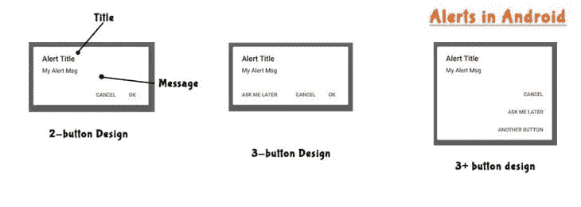
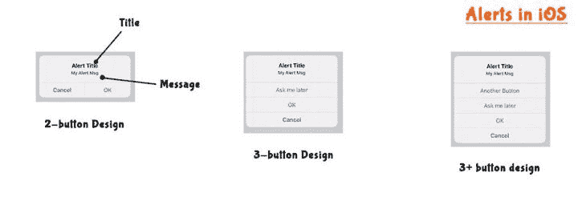
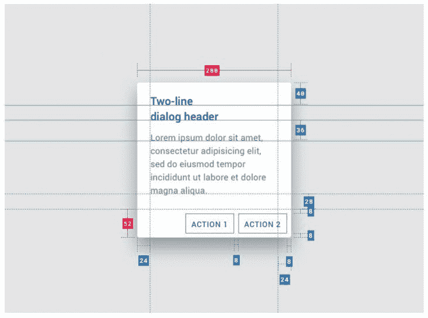
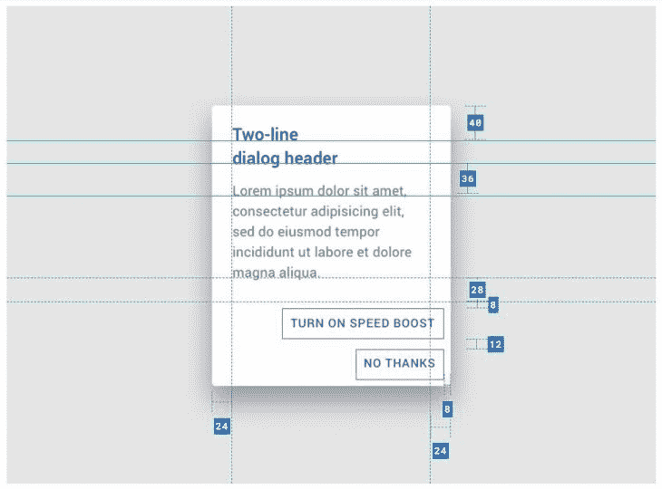
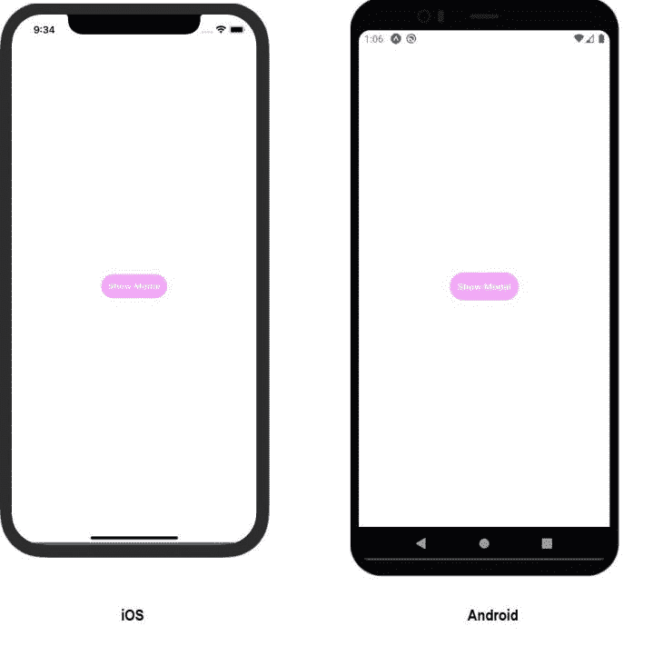
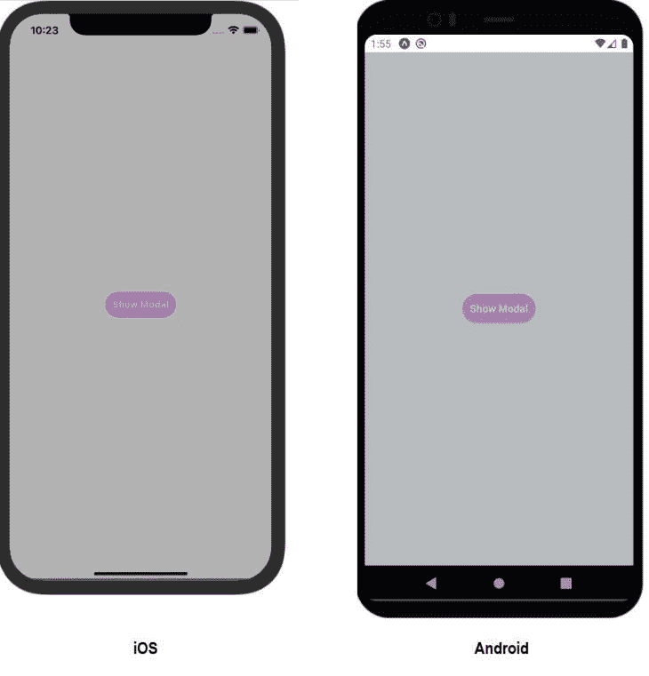
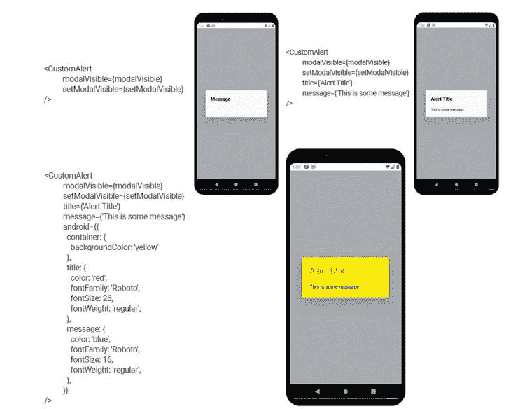
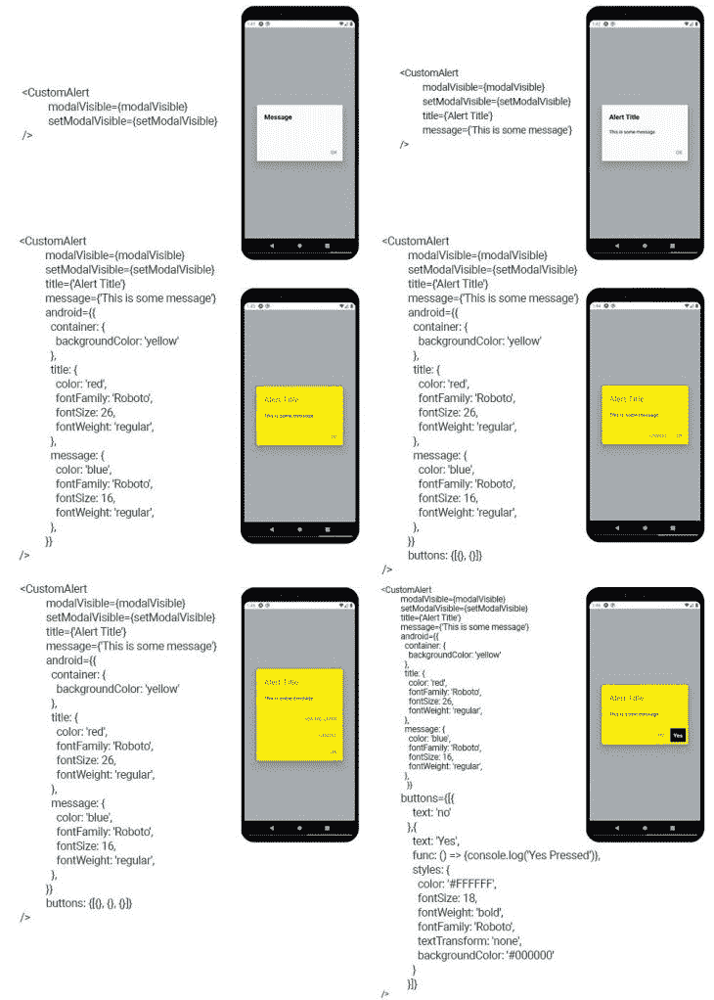
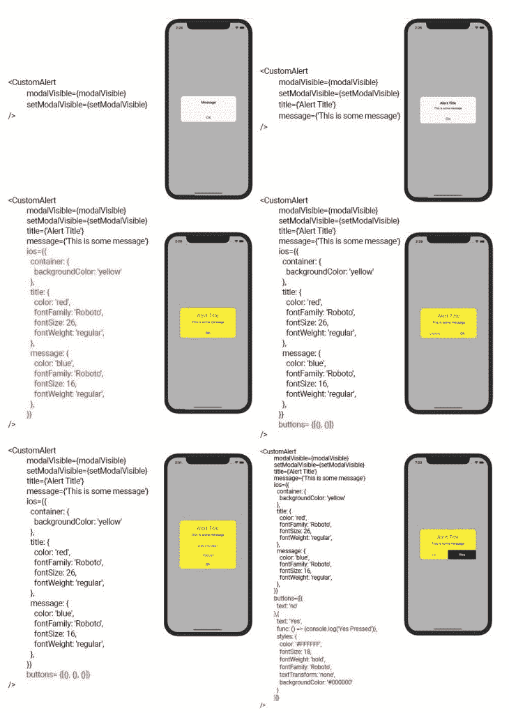

# 如何在 React Native - LogRocket 博客中创建自定义警告对话框

> 原文：<https://blog.logrocket.com/create-custom-alert-dialog-react-native/>

警告框是 web 的一个固有组件，它们的效用随着用例的不同而不同。它们用于显示消息、警告、提醒和确认同意。

对于警告对话框，用户通常会得到同意、不同意和取消的按钮选项。有时，警报也用于记录用户的输入，但这取决于平台。

在本文中，我们将学习如何在 React Native 中创建一个定制的警报对话框来满足您的项目需求。

## 介绍

React Native 提供了一个 Alert API，可以用来在 Android 和 iOS 上显示原生的 Alert 对话框。但是本地警报对话框有一些限制。

例如，在 Android 上，我们不能显示超过三个按钮，并且没有提供选项来捕捉用户的输入。虽然 iOS 允许我们有许多按钮，并让用户输入数据，但我们仍然不能显示图像、图表，或者除了文本之外的任何类型的定制。

为了处理这些限制，我们需要创建自定义的警告对话框。自定义警告对话框可以像模态对话框一样工作，并且可以支持组件。

## 警告框的属性

在定制任何原生组件之前，我们应该清楚地了解它的架构和事件处理。

例如，一个按钮拥有多个属性，如标签和凸出。按钮还保存事件，如按下、按住、释放、悬停等。当我们定制它时，我们需要考虑所有这些属性。否则，我们将失去外观、感觉和功能。

本机警报框具有以下属性:

1.  标题—指示警报目的的文本标题。受 Android 和 iOS 支持
2.  消息—解释通知或警告的文本消息。受 Android 和 iOS 支持
3.  按钮——Android 最多支持三个按钮，而 iOS 支持无限个按钮
4.  外部点击 Android 上的警报可以通过点击警报外部来关闭
5.  `onPress` —按下按钮时调用的功能。Android 和 iOS 都支持这一点
6.  `onDismiss` —警报关闭时调用的函数。只有安卓支持这个
7.  提示—允许用户在输入字段中输入数据。只有 iOS 支持这一点
8.  后退按钮——默认情况下，在 Android 中，当按下后退按钮时，警告关闭

在定制警告框时，我们需要考虑所有这些属性。

### 警报对话框的用户界面和体系结构

让我们看看原生警告是什么样子，以及不同元素在上面的位置。Android 和 iOS 提醒在外观和感觉上都有所不同:





#### Android 规格

根据[材料设计理念](https://material.io/components/dialogs)，Android 警告对话框的字体和颜色如下:

| **元素** | **类别** | **属性** | **值** |
| 容器 | 最大宽度
边框半径
背景颜色 | 280
2
#发发发 | 标题文本 |
| 在表面上 | 颜色
不透明度
字体粗细
大小
大小写 | #000000
100%
加粗
22
宣判案件 | 支持文本 |
| 在表面上 | 颜色
不透明度
字体粗细
大小
大小写 | #000000
100%
常规
15
宣判案件 | 按钮文本 |
| 主要的 | 颜色
不透明度
字体粗细
大小
大小写 | # 387 ef5
100%
500
16
大写 | 平纹棉麻织物 |
| 在表面上 | 颜色
不透明度 | 32% | 其他属性，如高度、宽度、填充、边距等。如下所示: |

对于小按钮操作:

对于长按钮操作:



Source: [material.io](https://material.io/components/dialogs)

其他属性包括:
标高— 24dp
位置—中心
距离两侧的最小边距— 48dp



Source: [material.io](https://material.io/components/dialogs)

iOS 规格

#### 同样，对于 iOS，我们有以下规格:

**元素**

| **类别** | **属性** | **值** | 容器 |
| 表面 | 边框半径
最大宽度
背景颜色
z 索引 | 13px
270px
#f8f8f8
10 | 标题文本 |
| 在表面上 | 颜色
填充
页边距顶端
对齐
字体
大小
大小写 | # 000000
12px 16px 7px
8px
中心
600
17px
判案 | 支持文本 |
| 在表面上 | 颜色
对齐
填充
字体
大小
大小写 | #000000
中心
0px 16px 21px
常规
13
宣判案件 | 按钮容器 |
| 通用属性
Ok 按钮
单排多按钮
–通用
–非 Ok 按钮 | 右边距
最小高度
边框顶部
字体大小
颜色
行高
字体粗细
最小宽度
边框右边 | -0.55px
44px
0.55px 固体# dbdbdf
17px
# 387 ef5
20px
700
50%
0.55 px 固体# dbdbdbdf | 平纹棉麻织物 |
| 在表面上 | 颜色
不透明度 | #000000
30% | 该信息收集自[离子](https://ionicframework.com/docs/v3/api/components/alert/AlertController/)文档。 |

自定义警报库和包

## GitHub 上很少有允许你创建自定义警告框的库。其中一些是 react-native-awesome-alerts、react-native-dialog 和 react-native-modal。您可以尝试这些库，但是在本文中，我们将定制没有它们的警告框。

警报和模式的区别

## Alert 和 Modal 在语义上是相同的，只是复杂性和可用性不同。

创建警告对话框是为了以尽可能简单的方式显示短消息，这就是为什么它们的功能有限的原因。

另一方面，模态用于复杂的显示。他们要求我们自己定义整个内容。默认情况下，它们提供类似后退按钮处理程序的事件侦听器。

自定义警报对话框

## 让我们先看看我们将定制的东西。我们应该记住，警告是用来显示重要信息的。这可能是错误、警告或通知。它们不是用来显示图像或填写表格的。为此，你应该使用情态动词。

在警报中，我们将自定义:

对话框的背景色

1.  字体颜色、大小、粗细等。标题和信息
2.  按钮的字体颜色、背景颜色和边框样式
3.  由于 React Native 调用 Android 和 iOS 的原生警报组件，所以它没有提供直接的方法来定制它们。提醒是有明确目的的固定组件，因此在 Android 和 iOS 中不可定制。Android 开发人员使用`Dialog`类来实现这一点。

在我们的例子中，我们将使用 React Native 的模态 API。使用该 API 的优点是:

我们不必担心自定义警报的位置。它将停留在整个应用程序的顶部

1.  Android 上的后退按钮事件和 Apple TV 上的菜单按钮都会被它自动处理
2.  React Native Modal 简介

### React 本机模态 API 提供了一个容器，该容器显示在其封闭的`View`之上。布尔属性`visible`被传递给`Modal`组件来显示或隐藏它。还有其他的道具，但是我们不关心它们，因为它们对警报没有用。

这是`Modal`的工作方式:

`modalVisible`是用于显示或隐藏`Modal`的状态变量。你可以把模型放在一个页面上，或者把整个应用放在它的父页面`View`中。最好使用像 Redux 这样的存储和状态管理库，因为它将帮助您在应用程序的任何地方更改`modalVisible`变量。

```
import React, { useState } from 'react';
import { Modal, Text, Pressable, View } from 'react-native';

const App = () => {
  const [modalVisible, setModalVisible] = useState(false);
  return (
    <View>
      <Modal
        animationType="fade"
        transparent={true}
        visible={modalVisible}
        onRequestClose={() => {
          setModalVisible(!modalVisible);
        }}
      >
        <View>
          /**
          * Anything here will display on Modal.
          * We need to create background overlay and Alert box.
          */
        </View>
      </Modal>

      <View>
        /**
        * Main App content. This will get hidden when modal opens up
        */
      </View>
    </View>
  );
};

export default App;

```

创建一个按钮来打开`Alert`

### 首先，我们需要一个事件来改变`modalVisible`的值。在我们的代码中，我们将使用一个按钮。按下此按钮，`modalVisible`将变为真，并显示一个`Modal`。为了创建按钮，我们将使用`Pressable`组件:

在这段代码中，我们添加了一些样式来改善按钮和应用程序其他部分的外观和感觉。目前，它会显示一个按钮。点击此按钮将打开模式。渲染输出将如下所示:

```
import React, { useState } from 'react';
import { Modal, Text, Pressable, View } from 'react-native';

const App = () => {
  const [modalVisible, setModalVisible] = useState(false);
  return (
    <View>
      <Modal
        animationType="fade"
        transparent={true}
        visible={modalVisible}
        onRequestClose={() => {
          setModalVisible(!modalVisible);
        }}
      >
        <View>
          /**
          * Anything here will display on Modal.
          * We need to create background overlay and Alert box.
          */
        </View>
      </Modal>

      <View>
        <Pressable
          style={[styles.button, styles.buttonOpen]}
          onPress={() => setModalVisible(true)}
        >
          <Text style={styles.textStyle}>Show Modal</Text>
        </Pressable>
      </View>
    </View>
  );
};

const styles = StyleSheet.create({
  centeredView: {
    flex: 1,
    justifyContent: "center",
    alignItems: "center",
    marginTop: 22
  },

  button: {
    borderRadius: 20,
    padding: 10,
    elevation: 2
  },
  buttonOpen: {
    backgroundColor: "#F194FF",
  },
  textStyle: {
    color: "white",
    fontWeight: "bold",
    textAlign: "center"
  },

});

export default App;

```



创建警报对话框用户界面

### 下一步是创建模态 UI。但是首先，我们需要定义一种方法来区分两种操作系统的默认 UI。iOS 与 Android 的观点不同。为了识别操作系统，React Native 提供了平台 API。

让我们从创建背景开始。正如我们在 UI 和架构部分讨论的，Android 上的背景色和不透明度分别是#232F34 和 0.32。对于 iOS，这些值分别是#000000 和 0.3:

渲染输出将如下所示:

```
import React, { useState } from 'react';
import { Modal, Text, Pressable, View, Platform } from 'react-native';

const App = () => {
  const [modalVisible, setModalVisible] = useState(false);
  return (
    <View>
      <Modal
        animationType="fade"
        transparent={true}
        visible={modalVisible}
        onRequestClose={() => {
          setModalVisible(!modalVisible);
        }}
      >
        <Pressable style={[Platform.OS === "ios" ? styles.iOSBackdrop : styles.androidBackdrop, styles.backdrop]} onPress={() => setModalVisible(false)} />
        <View>
          /**
          * Anything here will display on Modal.
          * We need to create background overlay and Alert box.
          */
        </View>
      </Modal>

      <View>
        <Pressable
          style={[styles.button, styles.buttonOpen]}
          onPress={() => setModalVisible(true)}
        >
          <Text style={styles.textStyle}>Show Modal</Text>
        </Pressable>
      </View>
    </View>
  );
};

const styles = StyleSheet.create({
  centeredView: {
    flex: 1,
    justifyContent: "center",
    alignItems: "center",
    marginTop: 22
  },

  button: {
    borderRadius: 20,
    padding: 10,
    elevation: 2
  },
  buttonOpen: {
    backgroundColor: "#F194FF",
  },
  textStyle: {
    color: "white",
    fontWeight: "bold",
    textAlign: "center"
  },

  iOSBackdrop: {
    backgroundColor: "#000000",
    opacity: 0.3
  },
  androidBackdrop: {
    backgroundColor: "#232f34",
    opacity: 0.32
  },
  backdrop: {
    position: 'absolute',
    top: 0,
    left: 0,
    right: 0,
    bottom: 0,
  }
});

export default App;

```



注意，我们使用了`Pressable`组件来创建背景。这是因为我们想添加在按下背景时关闭模态的功能。

接下来，我们将在这个背景上创建一个警告对话框。但是首先，我们应该把`Modal`放到一个单独的组件中。这将有助于用不同的样式调用我们的定制`Alert`:

我们创建了一个名为`CustomAlert`的不同组件，并将我们的`Modal`放入其中。

```
import React, { useState } from "react";
import { Alert, Modal, StyleSheet, Text, Pressable, View, Platform } from "react-native";
const CustomAlert = (props) => {
  return (
    <Modal
        animationType="fade"
        transparent={true}
        visible={props.modalVisible}
        onRequestClose={() => {
          props.setModalVisible(false);
        }}
      >
        <Pressable style={[Platform.OS === "ios" ? styles.iOSBackdrop : styles.androidBackdrop, styles.backdrop]} onPress={() => props.setModalVisible(false)} />
        <View>

        </View>
      </Modal>
  )
}
const App = () => {
  const [modalVisible, setModalVisible] = useState(false);

  return (
    <View style={styles.centeredView}>
      <CustomAlert modalVisible={modalVisible} setModalVisible={setModalVisible} />
      <View>
        <Pressable
          style={[styles.button, styles.buttonOpen]}
          onPress={() => setModalVisible(true)}
        >
          <Text style={styles.textStyle}>Show Modal</Text>
        </Pressable>
      </View>
    </View>
  );
};
const styles = StyleSheet.create({
  centeredView: {
    flex: 1,
    justifyContent: "center",
    alignItems: "center",
    marginTop: 22
  },

  button: {
    borderRadius: 20,
    padding: 10,
    elevation: 2
  },
  buttonOpen: {
    backgroundColor: "#F194FF",
  },
  textStyle: {
    color: "white",
    fontWeight: "bold",
    textAlign: "center"
  },

  iOSBackdrop: {
    backgroundColor: "#000000",
    opacity: 0.3
  },
  androidBackdrop: {
    backgroundColor: "#232f34",
    opacity: 0.32
  },
  backdrop: {
    position: 'absolute',
    top: 0,
    left: 0,
    right: 0,
    bottom: 0,
  }
});
export default App;

```

`modalVisible`状态保持在`App.js`，但是记住更好的方法是使用像 Redux 这样的中央存储管理库。Redux 将使整个应用程序中的所有组件都可以访问`modalVisible`状态，并且不需要将`modalVisible`作为道具传递。

是时候为`Modal`设置默认值了。这些值将设计类似于 Android 和 iOS 的原生警告框的框。

我们已经在 UI 和架构部分定义了所有的值。先说安卓。

Android 自定义提醒对话框

### 默认值为:

**样式属性**

| **值** | *框*
背景颜色
最大宽度
边距
高程
边框半径 |
| 透明
280
48
24
2 | *标题*
边距
颜色
字号
字体粗细 |
| 24
#000000
22
大胆 | *消息*
左边距
右边距
下边距
颜色
字体大小
字体粗细 |
| 24
24
24
# 000000
15
正常 | *按钮组*
页边距 |
| 0 0 8 24 | *按钮*
页边距顶端
右边距
填充
颜色
字体大小
字体粗细
文本变换
背景颜色 |
| 12
8
10
# 387 ef5
16
500
大写
透明 | 这些默认值在`CustomAlert`组件中定义。这些在用户不提供值的情况下使用。 |

`CustomAlert`组件的不同道具有:

**道具**

| **值** | **使用** | 模态可视 | 真&#124;假 |
| 需要 | 显示/隐藏模态 | setModalVisible | 功能 |
| 需要 | 更改 modalVisible 的值 | 标题 | 线 |
| 可选择的 | 设置警告框的标题 | 消息 | 线 |
| 可选择的 | 设置消息 | 机器人 | 

```
{     container: {         backgroundColor: String     },     title: {         color: String,         fontFamily: String,         fontSize: Number,         fontWeight: String,     },     message: {         color: String,         fontFamily: String,         fontSize: Number,         fontWeight: String     }, }
```

 |
| 所有字段可选 | 为 Android 应用程序设置警告框、标题和消息的样式 | ios | 

```
{     container: {         backgroundColor: String     },     title: {         color: String,         fontFamily: String,         fontSize: Number,         fontWeight: String,     },     message: {         color: String,         fontFamily: String,         fontSize: Number,         fontWeight: String     }, }
```

 |
| 所有字段可选 | 为 iOS 应用程序设置警告框、标题和消息的样式 | 按钮 | 

```
[   {       text: String,       func: Function,       styles: {         color: String,         fontSize: Number,         fontWeight: String,         fontFamily: String,         textTransform: String,         backgroundColor: String       }   } ]
```

 |
| 所有字段可选 | 设置按钮的属性。有几点: | Android 最多支持三个按钮 | 如果没有提供按钮文本，它将使用“确定”、“取消”、“稍后询问我”

1.  所有按钮将关闭警告框并运行提供的功能
2.  如果没有提供一个按钮，那么它将默认显示 OK 按钮
3.  查看这段代码，了解`CustomAlert`是如何定义默认值的:
4.  一些样式是为了布局，这就是为什么我们不提供改变它们的选项。这些在`StyleSheet`对象中声明:

 |

如果我们使用不同的设置来运行它，我们会得到以下输出:

```
const CustomAlert = (props) => {

  const [androidDefaults, setAndroidDefaults] = useState({
    container: {
      backgroundColor: (props.android && props.android.container && props.android.container.backgroundColor) || '#FAFAFA',
    },
    title: {
      color: (props.android && props.android.title && props.android.title.color) || '#000000',
      fontFamily: (props.android && props.android.title && props.android.title.fontFamily) || 'initial',
      fontSize: (props.android && props.android.title && props.android.title.fontSize) || 22,
      fontWeight: (props.android && props.android.title && props.android.title.fontWeight) || 'bold',
    },
    message: {
      color: (props.android && props.android.message && props.android.message.color) || '#000000',
      fontFamily: (props.android && props.android.message && props.android.message.fontFamily) || 'initial',
      fontSize: (props.android && props.android.message && props.android.message.fontSize) || 15,
      fontWeight: (props.android && props.android.message && props.android.message.fontWeight) || 'normal',
    },
    button: {
      color: '#387ef5',
      fontFamily: 'initial',
      fontSize: 16,
      fontWeight: '500',
      textTransform: 'uppercase',
      backgroundColor: 'transparent',
    },
  });

  return (
    <Modal
        animationType="fade"
        transparent={true}
        visible={props.modalVisible}
        onRequestClose={() => {
          props.setModalVisible(false);
        }}
      >
        <Pressable style={[Platform.OS === "ios" ? styles.iOSBackdrop : styles.androidBackdrop, styles.backdrop]} onPress={() => props.setModalVisible(false)} />
        <View style={styles.alertBox}>
        {
          Platform.OS === "ios" ? 
          null
          :
          <View style={[styles.androidAlertBox, androidDefaults.container]}>
            <Text style={[styles.androidTitle, androidDefaults.title]}>{props.title || 'Message'}</Text>
            <Text style={[styles.androidMessage, androidDefaults.message]}>{props.message || ''}</Text>
          </View>
        }
        </View>

      </Modal>
  )
}

```



```
const styles = StyleSheet.create({
  centeredView: {
    flex: 1,
    justifyContent: "center",
    alignItems: "center",
    marginTop: 22
  },

  button: {
    borderRadius: 20,
    padding: 10,
    elevation: 2
  },
  buttonOpen: {
    backgroundColor: "#F194FF",
  },
  textStyle: {
    color: "white",
    fontWeight: "bold",
    textAlign: "center"
  },

  iOSBackdrop: {
    backgroundColor: "#000000",
    opacity: 0.3
  },
  androidBackdrop: {
    backgroundColor: "#232f34",
    opacity: 0.4
  },
  backdrop: {
    position: 'absolute',
    top: 0,
    left: 0,
    bottom: 0,
    right: 0
  },
  alertBox: {
    flex: 1,
    justifyContent: 'center',
    alignItems: 'center'
  },
  androidAlertBox: {
    maxWidth: 280,
    width: '100%',
    margin: 48,
    elevation: 24,
    borderRadius: 2,
  },
  androidTitle: {
    margin: 24,
  },
  androidMessage: {
    marginLeft: 24,
    marginRight: 24,
    marginBottom: 24,
  },
  androidButtonGroup: {
    marginTop: 0,
    marginRight: 0,
    marginBottom: 8,
    marginLeft: 24,
  },
  androidButton: {
    marginTop: 12,
    marginRight: 8,    
  },
  androidButtonInner: {
    padding: 10,

  }
});

```

是时候将按钮添加到警告对话框中了。Android 规范很少:

一个按钮总是可以的

两个按钮是“取消”和“确定”

1.  三个按钮是“稍后问我”、“取消”和“确定”
2.  最多支持三个按钮
3.  两个按钮浮动在框的右侧，而第三个按钮浮动在左侧
4.  长按钮显示在单独的行中
5.  为了满足所有这些条件，我们决定为按钮组声明一个单独的组件。姑且称之为`AndroidButtonBox`。查看代码:
6.  在这段代码中，我们声明了一个状态变量`buttonLayoutHorizontal`。这将用于将按钮组布局从列更改为行。如果所有按钮都很短，那么它们将显示在一行中。

`onLayout`事件用于确定是否需要改变该状态变量。然后，我们对通过 props 提供的按钮数组运行一个循环，并创建具有适当样式的按钮。

```
const AndroidButtonBox = () => {
    const [buttonLayoutHorizontal, setButtonLayoutHorizontal] = useState(1);
    const buttonProps = props.buttons && props.buttons.length > 0 ? props.buttons : [{}]

    return (
      <View style={[styles.androidButtonGroup, {
        flexDirection: buttonLayoutHorizontal === 1 ? "row" : "column",
      }]} onLayout={(e) => {
        if(e.nativeEvent.layout.height > 60)
          setButtonLayoutHorizontal(0);
      }}>
        {
          buttonProps.map((item, index) => {
              if(index > 2) return null;
              const alignSelfProperty = buttonProps.length > 2 && index === 0 && buttonLayoutHorizontal === 1 ?  'flex-start' : 'flex-end';
              let defaultButtonText = 'OK'
              if(buttonProps.length > 2){
                if(index === 0)
                  defaultButtonText = 'ASK ME LATER'
                else if(index === 1)
                  defaultButtonText = 'CANCEL';
              } else if (buttonProps.length === 2 && index === 0)
                defaultButtonText = 'CANCEL';
              return (
                <View style={[styles.androidButton, index === 0 && buttonLayoutHorizontal === 1 ? {flex: 1} : {}]}>
                  <Pressable onPress={() => {
                    props.setModalVisible(false)
                    if(item.func && typeof(item.func) === 'function')
                      item.func();
                  }} style={[{
                    alignSelf: alignSelfProperty, 

                  }]}>
                    <View style={[styles.androidButtonInner, {backgroundColor: (item.styles && item.styles.backgroundColor) || androidDefaults.button.backgroundColor}]}>
                      <Text
                        style={{
                          color: (item.styles && item.styles.color) || androidDefaults.button.color,
                          fontFamily: (item.styles && item.styles.fontFamily) || androidDefaults.button.fontFamily,
                          fontSize: (item.styles && item.styles.fontSize) || androidDefaults.button.fontSize,
                          fontWeight: (item.styles && item.styles.fontWeight) || androidDefaults.button.fontWeight,
                          textTransform: (item.styles && item.styles.textTransform) || androidDefaults.button.textTransform,
                        }}
                      >{item.text || defaultButtonText}</Text>
                    </View>
                  </Pressable>
                </View>
              )
            })

        }
      </View>
    );
  }

```

整个代码(针对 Android)将如下所示:

`CustomAlert`不同值的渲染输出为:



```
import React, { useState } from "react";
import { Alert, Modal, StyleSheet, Text, Pressable, View, Platform } from "react-native";
const CustomAlert = (props) => {

  const [androidDefaults, setAndroidDefaults] = useState({
    container: {
      backgroundColor: (props.android && props.android.container && props.android.container.backgroundColor) || '#FAFAFA',
    },
    title: {
      color: (props.android && props.android.title && props.android.title.color) || '#000000',
      fontFamily: (props.android && props.android.title && props.android.title.fontFamily) || 'initial',
      fontSize: (props.android && props.android.title && props.android.title.fontSize) || 22,
      fontWeight: (props.android && props.android.title && props.android.title.fontWeight) || 'bold',
    },
    message: {
      color: (props.android && props.android.message && props.android.message.color) || '#000000',
      fontFamily: (props.android && props.android.message && props.android.message.fontFamily) || 'initial',
      fontSize: (props.android && props.android.message && props.android.message.fontSize) || 15,
      fontWeight: (props.android && props.android.message && props.android.message.fontWeight) || 'normal',
    },
    button: {
      color: '#387ef5',
      fontFamily: 'initial',
      fontSize: 16,
      fontWeight: '500',
      textTransform: 'uppercase',
      backgroundColor: 'transparent',
    },
  });
  const AndroidButtonBox = () => {
    const [buttonLayoutHorizontal, setButtonLayoutHorizontal] = useState(1);
    const buttonProps = props.buttons && props.buttons.length > 0 ? props.buttons : [{}]

    return (
      <View style={[styles.androidButtonGroup, {
        flexDirection: buttonLayoutHorizontal === 1 ? "row" : "column",
      }]} onLayout={(e) => {
        if(e.nativeEvent.layout.height > 60)
          setButtonLayoutHorizontal(0);
      }}>
        {
          buttonProps.map((item, index) => {
              if(index > 2) return null;
              const alignSelfProperty = buttonProps.length > 2 && index === 0 && buttonLayoutHorizontal === 1 ?  'flex-start' : 'flex-end';
              let defaultButtonText = 'OK'
              if(buttonProps.length > 2){
                if(index === 0)
                  defaultButtonText = 'ASK ME LATER'
                else if(index === 1)
                  defaultButtonText = 'CANCEL';
              } else if (buttonProps.length === 2 && index === 0)
                defaultButtonText = 'CANCEL';
              return (
                <View style={[styles.androidButton, index === 0 && buttonLayoutHorizontal === 1 ? {flex: 1} : {}]}>
                  <Pressable onPress={() => {
                    props.setModalVisible(false)
                    if(item.func && typeof(item.func) === 'function')
                      item.func();
                  }} style={[{
                    alignSelf: alignSelfProperty, 

                  }]}>
                    <View style={[styles.androidButtonInner, {backgroundColor: (item.styles && item.styles.backgroundColor) || androidDefaults.button.backgroundColor}]}>
                      <Text
                        style={{
                          color: (item.styles && item.styles.color) || androidDefaults.button.color,
                          fontFamily: (item.styles && item.styles.fontFamily) || androidDefaults.button.fontFamily,
                          fontSize: (item.styles && item.styles.fontSize) || androidDefaults.button.fontSize,
                          fontWeight: (item.styles && item.styles.fontWeight) || androidDefaults.button.fontWeight,
                          textTransform: (item.styles && item.styles.textTransform) || androidDefaults.button.textTransform,
                        }}
                      >{item.text || defaultButtonText}</Text>
                    </View>
                  </Pressable>
                </View>
              )
            })

        }
      </View>
    );
  }
  return (
    <Modal
        animationType="fade"
        transparent={true}
        visible={props.modalVisible}
        onRequestClose={() => {
          props.setModalVisible(false);
        }}
      >
        <Pressable style={[Platform.OS === "ios" ? styles.iOSBackdrop : styles.androidBackdrop, styles.backdrop]} onPress={() => props.setModalVisible(false)} />
        <View style={styles.alertBox}>
        {
          Platform.OS === "ios" ? 
          null
          :
          <View style={[styles.androidAlertBox, androidDefaults.container]}>
            <Text style={[styles.androidTitle, androidDefaults.title]}>{props.title || 'Message'}</Text>
            <Text style={[styles.androidMessage, androidDefaults.message]}>{props.message || ''}</Text>
            <AndroidButtonBox />
          </View>
        }
        </View>

      </Modal>
  )
}
const App = () => {
  const [modalVisible, setModalVisible] = useState(false);

  return (
    <View style={styles.centeredView}>
      <CustomAlert 
          modalVisible={modalVisible} 
          setModalVisible={setModalVisible}
          title={'Alert Title'}
          message={'This is some message'} 
          android={{
            container: {
              backgroundColor: 'yellow'
            },
            title: {
              color: 'red',
              fontFamily: 'Roboto',
              fontSize: 26,
              fontWeight: 'regular',
            },
            message: {
              color: 'blue',
              fontFamily: 'Roboto',
              fontSize: 16,
              fontWeight: 'regular',
            },
          }}
          buttons={[{
            text: 'no'
          },{
            text: 'Yes',
            func: () => {console.log('Yes Pressed')},
            styles: {
              color: '#FFFFFF',
              fontSize: 18,
              fontWeight: 'bold',
              fontFamily: 'Roboto',
              textTransform: 'none',
              backgroundColor: '#000000'
            }
          }]}
      />
      <View>
        <Pressable
          style={[styles.button, styles.buttonOpen]}
          onPress={() => setModalVisible(true)}
        >
          <Text style={styles.textStyle}>Show Modal</Text>
        </Pressable>
      </View>
    </View>
  );
};
const styles = StyleSheet.create({
  centeredView: {
    flex: 1,
    justifyContent: "center",
    alignItems: "center",
    marginTop: 22
  },

  button: {
    borderRadius: 20,
    padding: 10,
    elevation: 2
  },
  buttonOpen: {
    backgroundColor: "#F194FF",
  },
  textStyle: {
    color: "white",
    fontWeight: "bold",
    textAlign: "center"
  },

  iOSBackdrop: {
    backgroundColor: "#000000",
    opacity: 0.3
  },
  androidBackdrop: {
    backgroundColor: "#232f34",
    opacity: 0.4
  },
  backdrop: {
    position: 'absolute',
    top: 0,
    left: 0,
    bottom: 0,
    right: 0
  },
  alertBox: {
    flex: 1,
    justifyContent: 'center',
    alignItems: 'center'
  },
  androidAlertBox: {
    maxWidth: 280,
    width: '100%',
    margin: 48,
    elevation: 24,
    borderRadius: 2,
  },
  androidTitle: {
    margin: 24,
  },
  androidMessage: {
    marginLeft: 24,
    marginRight: 24,
    marginBottom: 24,
  },
  androidButtonGroup: {
    marginTop: 0,
    marginRight: 0,
    marginBottom: 8,
    marginLeft: 24,
  },
  androidButton: {
    marginTop: 12,
    marginRight: 8,    
  },
  androidButtonInner: {
    padding: 10,

  }
});
export default App;

```

iOS 自定义警报对话框

iOS 警告框的代码将类似于 Android，只是样式有所变化。

### 在 iOS 中，标题、消息和按钮等所有实体都是居中对齐的。可以有任意数量的按钮。iOS 和 Android `CustomAlert`盒子的完整代码是:

不同`CustomAlert`值的渲染输出为:



```
import React, { useState } from "react";
import { Alert, Modal, StyleSheet, Text, Pressable, View, Platform } from "react-native";
const CustomAlert = (props) => {

  const [androidDefaults, setAndroidDefaults] = useState({
    container: {
      backgroundColor: (props.android && props.android.container && props.android.container.backgroundColor) || '#FAFAFA',
    },
    title: {
      color: (props.android && props.android.title && props.android.title.color) || '#000000',
      fontFamily: (props.android && props.android.title && props.android.title.fontFamily) || 'initial',
      fontSize: (props.android && props.android.title && props.android.title.fontSize) || 22,
      fontWeight: (props.android && props.android.title && props.android.title.fontWeight) || 'bold',
    },
    message: {
      color: (props.android && props.android.message && props.android.message.color) || '#000000',
      fontFamily: (props.android && props.android.message && props.android.message.fontFamily) || 'initial',
      fontSize: (props.android && props.android.message && props.android.message.fontSize) || 15,
      fontWeight: (props.android && props.android.message && props.android.message.fontWeight) || 'normal',
    },
    button: {
      color: '#387ef5',
      fontFamily: 'initial',
      fontSize: 16,
      fontWeight: '500',
      textTransform: 'uppercase',
      backgroundColor: 'transparent',
    },
  });
  const [iOSDefaults, setIOSDefaults] = useState({
    container: {
      backgroundColor: (props.ios && props.ios.container && props.ios.container.backgroundColor) || '#F8F8F8',
    },
    title: {
      color: (props.ios && props.ios.title && props.ios.title.color) || '#000000',
      fontFamily: (props.ios && props.ios.title && props.ios.title.fontFamily) || 'initial',
      fontSize: (props.ios && props.ios.title && props.ios.title.fontSize) || 17,
      fontWeight: (props.ios && props.ios.title && props.ios.title.fontWeight) || '600',
    },
    message: {
      color: (props.ios && props.ios.message && props.ios.message.color) || '#000000',
      fontFamily: (props.ios && props.ios.message && props.ios.message.fontFamily) || 'initial',
      fontSize: (props.ios && props.ios.message && props.ios.message.fontSize) || 13,
      fontWeight: (props.ios && props.ios.message && props.ios.message.fontWeight) || 'normal',
    },
    button: {
      color: '#387ef5',
      fontFamily: 'initial',
      fontSize: 17,
      fontWeight: '500',
      textTransform: 'none',
      backgroundColor: 'transparent',
    },
  });
  const AndroidButtonBox = () => {
    const [buttonLayoutHorizontal, setButtonLayoutHorizontal] = useState(1);
    const buttonProps = props.buttons && props.buttons.length > 0 ? props.buttons : [{}]

    return (
      <View style={[styles.androidButtonGroup, {
        flexDirection: buttonLayoutHorizontal === 1 ? "row" : "column",
      }]} onLayout={(e) => {
        if(e.nativeEvent.layout.height > 60)
          setButtonLayoutHorizontal(0);
      }}>
        {
          buttonProps.map((item, index) => {
              if(index > 2) return null;
              const alignSelfProperty = buttonProps.length > 2 && index === 0 && buttonLayoutHorizontal === 1 ?  'flex-start' : 'flex-end';
              let defaultButtonText = 'OK'
              if(buttonProps.length > 2){
                if(index === 0)
                  defaultButtonText = 'ASK ME LATER'
                else if(index === 1)
                  defaultButtonText = 'CANCEL';
              } else if (buttonProps.length === 2 && index === 0)
                defaultButtonText = 'CANCEL';
              return (
                <View style={[styles.androidButton, index === 0 && buttonLayoutHorizontal === 1 ? {flex: 1} : {}]}>
                  <Pressable onPress={() => {
                    props.setModalVisible(false)
                    if(item.func && typeof(item.func) === 'function')
                      item.func();
                  }} style={[{
                    alignSelf: alignSelfProperty, 

                  }]}>
                    <View style={[styles.androidButtonInner, {backgroundColor: (item.styles && item.styles.backgroundColor) || androidDefaults.button.backgroundColor}]}>
                      <Text
                        style={{
                          color: (item.styles && item.styles.color) || androidDefaults.button.color,
                          fontFamily: (item.styles && item.styles.fontFamily) || androidDefaults.button.fontFamily,
                          fontSize: (item.styles && item.styles.fontSize) || androidDefaults.button.fontSize,
                          fontWeight: (item.styles && item.styles.fontWeight) || androidDefaults.button.fontWeight,
                          textTransform: (item.styles && item.styles.textTransform) || androidDefaults.button.textTransform,
                        }}
                      >{item.text || defaultButtonText}</Text>
                    </View>
                  </Pressable>
                </View>
              )
            })

        }
      </View>
    );
  }
  const IOSButtonBox = () => {
    const buttonProps = props.buttons && props.buttons.length > 0 ? props.buttons : [{}]
    const [buttonLayoutHorizontal, setButtonLayoutHorizontal] = useState(buttonProps.length === 2 ? 1 : 0);

    return (
      <View style={[styles.iOSButtonGroup, {
        flexDirection: buttonLayoutHorizontal === 1 ? "row" : "column",
      }]} onLayout={(e) => {
        if(e.nativeEvent.layout.height > 60)
          setButtonLayoutHorizontal(0);
      }}>
        {
          buttonProps.map((item, index) => {
              let defaultButtonText = 'OK'
              if(buttonProps.length > 2){
                if(index === 0)
                  defaultButtonText = 'ASK ME LATER'
                else if(index === 1)
                  defaultButtonText = 'CANCEL';
              } else if (buttonProps.length === 2 && index === 0)
                defaultButtonText = 'CANCEL';
              const singleButtonWrapperStyle = {}
              let singleButtonWeight = iOSDefaults.button.fontWeight;
              if(index === buttonProps.length - 1){
                  singleButtonWeight = '700';
              }
              if(buttonLayoutHorizontal === 1){
                singleButtonWrapperStyle.minWidth = '50%';
                if(index === 0){
                  singleButtonWrapperStyle.borderStyle = 'solid';
                  singleButtonWrapperStyle.borderRightWidth = 0.55;
                  singleButtonWrapperStyle.borderRightColor = '#dbdbdf';
                }

              }
              return (
                <View style={[styles.iOSButton, singleButtonWrapperStyle]}>
                  <Pressable onPress={() => {
                    props.setModalVisible(false)
                    if(item.func && typeof(item.func) === 'function')
                      item.func();
                  }}>
                    <View style={[styles.iOSButtonInner, {backgroundColor: (item.styles && item.styles.backgroundColor) || iOSDefaults.button.backgroundColor}]}>
                      <Text
                        style={{
                          color: (item.styles && item.styles.color) || iOSDefaults.button.color,
                          fontFamily: (item.styles && item.styles.fontFamily) || iOSDefaults.button.fontFamily,
                          fontSize: (item.styles && item.styles.fontSize) || iOSDefaults.button.fontSize,
                          fontWeight: (item.styles && item.styles.fontWeight) || singleButtonWeight,
                          textTransform: (item.styles && item.styles.textTransform) || iOSDefaults.button.textTransform,
                          textAlign: 'center'
                        }}
                      >{item.text || defaultButtonText}</Text>
                    </View>
                  </Pressable>
                </View>
              )
            })

        }
      </View>
    );
  }
  return (
    <Modal
        animationType="fade"
        transparent={true}
        visible={props.modalVisible}
        onRequestClose={() => {
          props.setModalVisible(false);
        }}
      >
        <Pressable style={[Platform.OS === "ios" ? styles.iOSBackdrop : styles.androidBackdrop, styles.backdrop]} onPress={() => props.setModalVisible(false)} />
        <View style={styles.alertBox}>
        {
          Platform.OS === "ios" ? 
          <View style={[styles.iOSAlertBox, iOSDefaults.container]}>
            <Text style={[styles.iOSTitle, iOSDefaults.title]}>{props.title || 'Message'}</Text>
            <Text style={[styles.iOSMessage, iOSDefaults.message]}>{props.message || ''}</Text>
            <IOSButtonBox />
          </View>
          :
          <View style={[styles.androidAlertBox, androidDefaults.container]}>
            <Text style={[styles.androidTitle, androidDefaults.title]}>{props.title || 'Message'}</Text>
            <Text style={[styles.androidMessage, androidDefaults.message]}>{props.message || ''}</Text>
            <AndroidButtonBox />
          </View>
        }
        </View>

      </Modal>
  )
}
const App = () => {
  const [modalVisible, setModalVisible] = useState(false);

  return (
    <View style={styles.centeredView}>
      <CustomAlert 
          modalVisible={modalVisible} 
          setModalVisible={setModalVisible}
          title={'Alert Title'}
          message={'This is some message'} 
          android={{
            container: {
              backgroundColor: 'yellow'
            },
            title: {
              color: 'red',
              fontFamily: 'Roboto',
              fontSize: 26,
              fontWeight: 'regular',
            },
            message: {
              color: 'blue',
              fontFamily: 'Roboto',
              fontSize: 16,
              fontWeight: 'regular',
            },
          }}
          ios={{
            container: {
              backgroundColor: 'yellow'
            },
            title: {
              color: 'red',
              fontFamily: 'Roboto',
              fontSize: 26,
              fontWeight: 'regular',
            },
            message: {
              color: 'blue',
              fontFamily: 'Roboto',
              fontSize: 16,
              fontWeight: 'regular',
            },
          }}
          buttons={[{
            text: 'no'
          },{
            text: 'Yes',
            func: () => {console.log('Yes Pressed')},
            styles: {
              color: '#FFFFFF',
              fontSize: 18,
              fontWeight: 'bold',
              fontFamily: 'Roboto',
              textTransform: 'none',
              backgroundColor: '#000000'
            }
          }]}
      />
      <View>
        <Pressable
          style={[styles.button, styles.buttonOpen]}
          onPress={() => setModalVisible(true)}
        >
          <Text style={styles.textStyle}>Show Modal</Text>
        </Pressable>
      </View>
    </View>
  );
};
const styles = StyleSheet.create({
  centeredView: {
    flex: 1,
    justifyContent: "center",
    alignItems: "center",
    marginTop: 22
  },

  button: {
    borderRadius: 20,
    padding: 10,
    elevation: 2
  },
  buttonOpen: {
    backgroundColor: "#F194FF",
  },
  textStyle: {
    color: "white",
    fontWeight: "bold",
    textAlign: "center"
  },

  iOSBackdrop: {
    backgroundColor: "#000000",
    opacity: 0.3
  },
  androidBackdrop: {
    backgroundColor: "#232f34",
    opacity: 0.4
  },
  backdrop: {
    position: 'absolute',
    top: 0,
    left: 0,
    bottom: 0,
    right: 0
  },
  alertBox: {
    flex: 1,
    justifyContent: 'center',
    alignItems: 'center'
  },
  androidAlertBox: {
    maxWidth: 280,
    width: '100%',
    margin: 48,
    elevation: 24,
    borderRadius: 2,
  },
  androidTitle: {
    margin: 24,
  },
  androidMessage: {
    marginLeft: 24,
    marginRight: 24,
    marginBottom: 24,
  },
  androidButtonGroup: {
    marginTop: 0,
    marginRight: 0,
    marginBottom: 8,
    marginLeft: 24,
  },
  androidButton: {
    marginTop: 12,
    marginRight: 8,    
  },
  androidButtonInner: {
    padding: 10,

  },

  iOSAlertBox: {
    maxWidth: 270,
    width: '100%',
    zIndex: 10,
    borderRadius: 13,
  },
  iOSTitle: {
    paddingTop: 12,
    paddingRight: 16,
    paddingBottom: 7,
    paddingLeft: 16,
    marginTop: 8,
    textAlign: "center",
  },
  iOSMessage: {
    paddingTop: 0,
    paddingRight: 16,
    paddingBottom: 21,
    paddingLeft: 16,
    textAlign: "center"
  },
  iOSButtonGroup: {
    marginRight: -0.55
  },
  iOSButton: {

    borderTopColor: '#dbdbdf',
    borderTopWidth: 0.55,
    borderStyle: 'solid',
  },
  iOSButtonInner: {
    minHeight: 44,
    justifyContent: 'center'
  }
});
export default App;

```

现场演示


## Live Demo

结论

在本文中，我们了解了 Android 和 iOS 中的警告对话框。我们还看到了它们的 UI、规范和属性之间的差异。

## 这些警告对话框有明确的用途，不应该过度使用。只有当消息对用户不可避免时才使用它们，因为它们会阻塞用户界面。

在我们的自定义警报中有许多增强的范围。您可以更改填充、边距、添加背景图像、图标、SVG 等。如果你在你的项目中尝试这个代码，那么请通过评论让我知道它是如何工作的。谢谢你。

[LogRocket](https://lp.logrocket.com/blg/react-native-signup) :即时重现 React 原生应用中的问题。

[LogRocket](https://lp.logrocket.com/blg/react-native-signup) 是一款 React 原生监控解决方案，可帮助您即时重现问题、确定 bug 的优先级并了解 React 原生应用的性能。

## LogRocket 还可以向你展示用户是如何与你的应用程序互动的，从而帮助你提高转化率和产品使用率。LogRocket 的产品分析功能揭示了用户不完成特定流程或不采用新功能的原因。

[](https://lp.logrocket.com/blg/react-native-signup)

开始主动监控您的 React 原生应用— [免费试用 LogRocket】。](https://lp.logrocket.com/blg/react-native-signup)

LogRocket also helps you increase conversion rates and product usage by showing you exactly how users are interacting with your app. LogRocket's product analytics features surface the reasons why users don't complete a particular flow or don't adopt a new feature.

Start proactively monitoring your React Native apps — [try LogRocket for free](https://lp.logrocket.com/blg/react-native-signup).