# 如何在 SwiftUI 中创建自定义的可折叠侧边栏

> 原文：<https://blog.logrocket.com/create-custom-collapsible-sidebar-swiftui/>

**目录**

我们在移动应用程序中使用侧边栏，为用户提供应用程序中最常用和最重要的屏幕的顶级导航。在本文中，您将学习如何使用 SwiftUI 创建一个自定义侧栏。我们开始吧！

## 创建新的 SwiftUI 项目

在本教程中，我们将从头开始创建一个新的 SwiftUI 项目，但是您也可以在现有项目中实现它。

要创建一个新的 SwiftUI 项目，打开 Xcode 并点击**创建一个新的 Xcode 项目**。

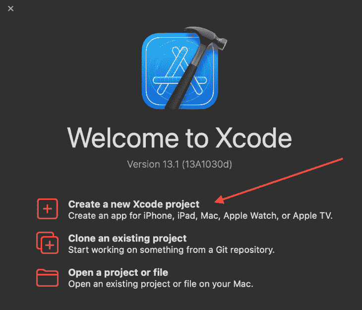

系统会提示您为项目选取模板。选择 **iOS > App** ，点击**下一步**。

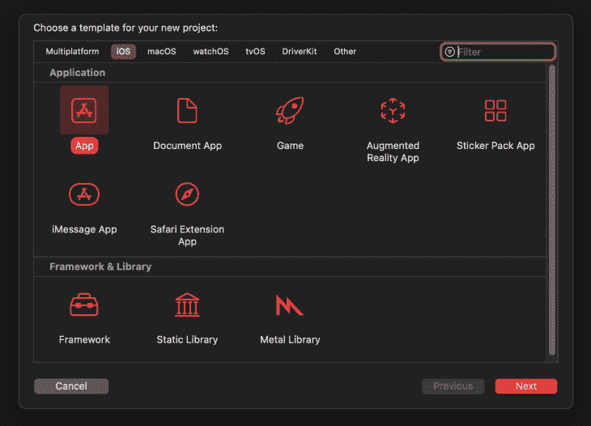

现在，输入您的项目名称以及您想要使用的语言和框架。在`Product Name`字段输入项目名称，并选择一个相关的**团队**。

因为我们将使用 Swift 创建我们的 iOS 应用程序，所以我们将在界面下拉菜单中选择 **SwiftUI** 。

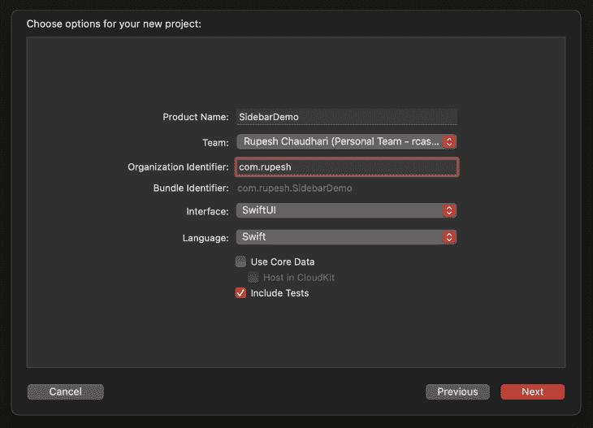

点击**下一个**后，Xcode 会询问在哪个路径上创建项目，所以选择你喜欢的位置，点击**创建**。现在，让我们为 SwiftUI 应用程序创建自定义侧栏。

## 在 Swift 中设计主屏幕

我们正在设计的应用程序由主屏幕和同一屏幕上的侧边栏组成。它有各种链接供用户点击。

最终的用户界面将如下所示:


注意:本文的完整代码可以在这个[存储库](https://github.com/hrupesh/SwiftUISidebar)中找到。

让我们专注于构建主屏幕。我们将有一个使用[asyn image](https://developer.apple.com/documentation/swiftui/asyncimage)通过网络加载的图像列表。

将以下代码添加到`ContentView.swift`:

```
struct ContentView: View {

    var body: some View {
          NavigationView {
              List {
                  ForEach(0..<8) { _ in
                      AsyncImage(
                              url: URL(
                                string: "https://picsum.photos/600"
                                )) { image in
                          image
                              .resizable()
                              .scaledToFill()
                              .frame(height: 240)
                      } placeholder: {
                          ZStack {
                              RoundedRectangle(cornerRadius: 12)
                                  .fill(.gray.opacity(0.6))
                                  .frame(height: 240)
                              ProgressView()
                          }
                      }
                      .aspectRatio(3 / 2, contentMode: .fill)
                      .cornerRadius(12)
                      .padding(.vertical)
                      .shadow(radius: 4)
                    }
                  }
                  .listStyle(.inset)
                  .navigationTitle("Home")
                  .navigationBarTitleDisplayMode(.inline)
          }
    }
}

```

注意，我们已经将整个`View`包装在一个`[NavigationView](https://developer.apple.com/documentation/swiftui/navigationview)`中，它是从我们的`ContentView`的`body`变量返回的，然后使用一个`[List](https://developer.apple.com/documentation/swiftui/list)`视图来创建一个要显示的图像列表。

在这个列表中，我们循环通过一个从 0 到 8 的`[range](https://developer.apple.com/documentation/swift/range)`—`(0..<8)`——它将从`0`到`8`迭代八次。

在这个循环中，我们迭代一个`[AsyncImage](https://developer.apple.com/documentation/swiftui/asyncimage)`视图，这个视图用于加载和显示网络上的图像。然后，我们在`AsyncImage`视图上使用了一个定制的初始化方法来给出一个`placeholder`值，这个值将一直显示，直到图像从网络上被下载。出于样式的目的，我们还向视图添加了一些修改器。

然后，我们在`List`视图上添加了几个修饰符，从`listStyle`到`ListStyle.inset`，用于插入样式列表，而不是默认的 iOS 样式列表。我们还为这个屏幕的导航标题设置了`navigationTitle("Home")`，它显示在导航栏上。

最后一个修改器是`navigationBarTitleDisplayMode(.inline)`。它将导航条的显示模式设置为内嵌，也就是说，它将一直位于顶部，以保持我们的用户界面与侧边栏一致。

下面是上面代码的输出。

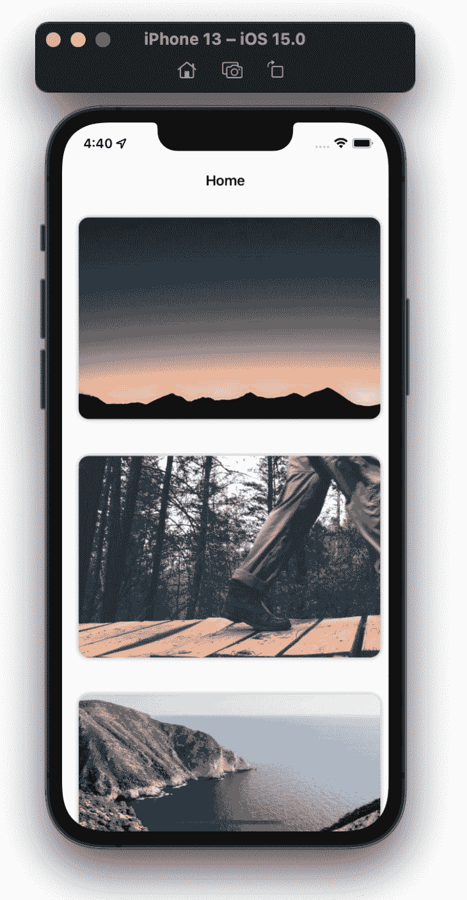

现在我们的主屏幕 UI 已经完成，让我们构建侧边栏视图。为了显示和隐藏侧边栏，我们需要一个`@State`变量，它将是我们的视图知道它应该显示还是隐藏侧边栏的真实来源。

让我们将`@State` var 添加到我们的`ContentView`中。

```
struct ContentView: View {

    // Add the below line
    @State private var isSidebarOpened = false

    var body: some View {

```

现在，让我们通过创建一个新的 SwiftUI 文件来创建侧栏视图。进入**文件→新建→文件**或按 **⌘ + N** 创建一个新文件。

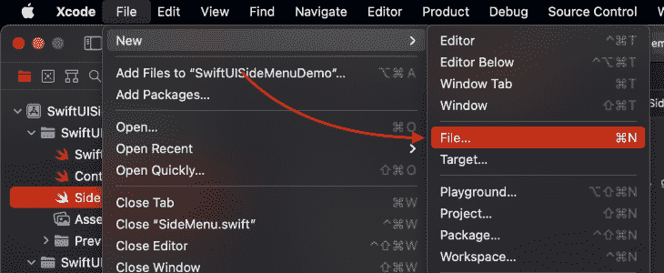

选择想要创建的文件类型，选择 **SwiftUI 视图**，点击**下一步**。

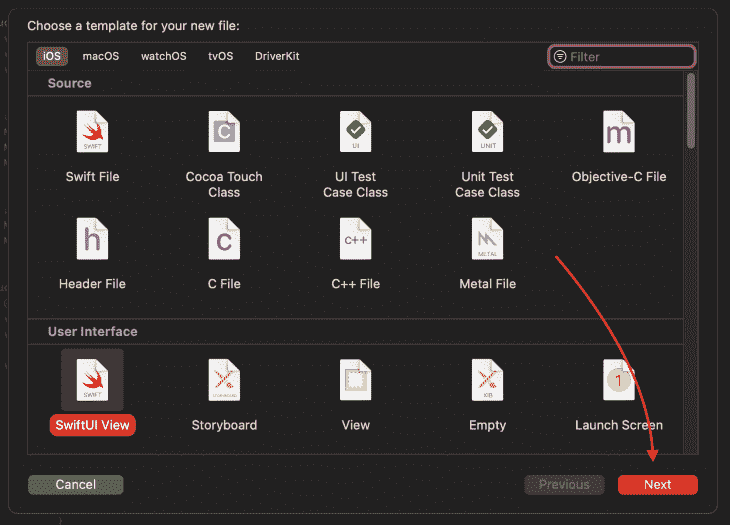

Xcode 会询问您想要创建的文件的名称。进入**工具条**，在**组**下拉列表中选择您的项目组，点击**创建。**

现在我们有了一个空白的 SwiftUI 视图，让我们开始设计侧栏。

我们将向我们的`Sidebar`视图添加一个`@Binding`变量，这样我们就可以从`Sidebar`视图本身更新我们的`@State`变量`isSidebarOpened,`的值。

将以下代码添加到`Sidebar.swift`:

```
struct Sidebar: View {
    @Binding var isSidebarVisible: Bool

    var body: some View {
        if isSidebarVisible {
            Text("Sidebar visible")
                .bold()
                .font(.largeTitle)
                .background(.purple)
        }
    }
}

```

在这里，我们添加了一个`@Binding`变量`isSidebarVisible`，它将来自于来自`ContentView`的变量`isSidebarOpened`。我们还添加了一个条件语句，说明如果`isSidebarVisible`的值是`true`，那么我们将显示`Text`视图，其中包含“侧栏可见”的文本

我们需要对我们的`ContentView`文件做一些修改。首先，用一个`ZStack`包装`NavigationView`，这样`Sidebar`视图就可以得到完整的屏幕边界区域。然后，添加一个`Button`到我们的导航栏来切换`isSidebarOpened` `@State`变量的值。我们将在`View`中添加`Sidebar`视图，并将绑定值传递给它。

在`ContentView.swift`中进行这些更改:

```
struct ContentView: View {
    @State private var isSideBarOpened = false

    var body: some View {
        ZStack {
            NavigationView {
                List {
                    ForEach(0..<8) { _ in
                        AsyncImage(
                          url: URL(
                            string: "https://picsum.photos/600"
                          )) { image in
                            image
                                .resizable()
                                .scaledToFill()
                                .frame(height: 240)
                            } placeholder: {
                                ZStack {
                                    RoundedRectangle(cornerRadius: 12)
                                        .fill(.gray.opacity(0.6))
                                        .frame(height: 240)
                                    ProgressView()
                                }
                            }
                        .aspectRatio(3 / 2, contentMode: .fill)
                        .cornerRadius(12)
                        .padding(.vertical)
                        .shadow(radius: 4)
                    }
                    }
                    .toolbar {
                        Button {
                            isSideBarOpened.toggle()
                        } label: {
                            Label("Toggle SideBar",
                          systemImage: "line.3.horizontal.circle.fill")
                        }
                    }
                    .listStyle(.inset)
                    .navigationTitle("Home")
                    .navigationBarTitleDisplayMode(.inline)
            }
            Sidebar(isSidebarVisible: $isSideBarOpened)
        }
    }
}

```

这是我们的应用程序目前的样子。

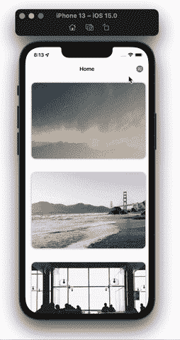

我们现在可以切换侧边栏的可见性了！让我们为它创建一些 UI，使它看起来像一个侧边栏。

我们先来添加一个打开侧边栏后出现的深色背景。将以下代码添加到`Sidebar.swift`文件中:

```
var body: some View {
    ZStack {
        GeometryReader { _ in
            EmptyView()
        }
        .background(.black.opacity(0.6))
        .opacity(isSidebarVisible ? 1 : 0)
        .animation(.easeInOut.delay(0.2), value: isSidebarVisible)
        .onTapGesture {
            isSidebarVisible.toggle()
        }
    }
    .edgesIgnoringSafeArea(.all)
}

```

我们将视图包装在一个`ZStack`中，并添加了一个`edgesIgnoringSafeArea`修饰符，然后赋予它一个值`all`。这将使我们的`ZStack`遍布可用屏幕，包括 iPhone 的凹口和底角下方的区域。

我们在`ZStack`中添加了一个`[GeometryReader](https://developer.apple.com/documentation/swiftui/geometryreader)`视图，这样我们就可以将所有可用的设备屏幕空间用于我们的背景视图，并为我们的`GeometryReader`视图添加了以下视图修改器:

*   `background`:设置视图的背景。在我们的例子中，我们将它设置为黑色，不透明度为 60%
*   `opacity`:设置视图本身的不透明度，如果侧边栏可见，我们通过一个三元表达式`1`计算它的值，如果不可见，则通过`0`计算它的值
*   将我们在这个视图上所做的改变动画化。在这种情况下，我们用延迟了`0.2`的`easeInOut`动画制作视图的`opacity`。我们还在动画中添加了一个`value`标签，告诉 Swift 当该值改变时，我们需要对视图进行动画处理(这一改变是在 iOS 15.0 中引入的)
*   当用户点击背景时，侧边栏应该关闭

侧边栏的背景将如下所示:

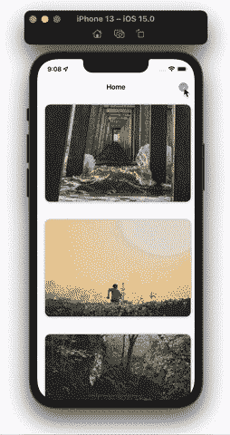

让我们确保我们的侧边栏可以滑动。在`Sidebar.swift`文件中进行以下突出显示的更改:

```
struct SideMenu: View {
    @Binding var isSidebarVisible: Bool
    var sideBarWidth = UIScreen.main.bounds.size.width * 0.7
    var bgColor: Color = 
          Color(.init(
                  red: 52 / 255,
                  green: 70 / 255,
                  blue: 182 / 255,
                  alpha: 1))

    var body: some View {
        ZStack {
            GeometryReader { _ in
                EmptyView()
            }
            .background(.black.opacity(0.6))
            .opacity(isSidebarVisible ? 1 : 0)
            .animation(.easeInOut.delay(0.2), value: isSidebarVisible)
            .onTapGesture {
                isSidebarVisible.toggle()
            }            
            content
        }
        .edgesIgnoringSafeArea(.all)
    }

    var content: some View {
        HStack(alignment: .top) {
            ZStack(alignment: .top) {
                bgColor
            }
            .frame(width: sideBarWidth)
            .offset(x: isSidebarVisible ? 0 : -sideBarWidth)
            .animation(.default, value: isSidebarVisible)

            Spacer()
        }
    }
}

```

我们引入了两个新的变量，名为`sideBarWidth`和`bgColor`。顾名思义，`sideBarWidth`存储显示侧边栏的宽度。注意，我们没有给这个变量赋予任何类型。这是因为 Swift 通过使用[类型推理](https://docs.swift.org/swift-book/LanguageGuide/TheBasics.html#:~:text=If%20you%20don't%20specify,examining%20the%20values%20you%20provide.)来处理这个问题。

第二个变量是`bgColor`，它是一个简单的`Color`，使用`RGB`值初始化。

为了简化`body`中的代码并使我们的代码更具可读性，我们创建了一个名为`content`的新变量，它返回一个`View`。`content`视图包含一个有两个视图的`HStack`:显示在屏幕上的实际侧边栏(`ZStack`)和在视图中占据最大空间的[间隔视图](https://developer.apple.com/documentation/swiftui/spacer)。这使得我们的蓝色侧边栏移动到左边。

在`ZStack`中，我们现在有一个变量`bgColor`，它给视图一个背景颜色。我们也为视图添加了重要的修饰符。使用`frame`，我们已经将视图的宽度设置为我们之前声明的变量的值，然后我们使用`[offset](https://developer.apple.com/documentation/swiftui/view/offset(x:y:))`，这使得侧边栏从左向右滑动到屏幕上。

`Offset`用于相对于 X 和 Y 坐标移动特定视图。如果侧边栏不可见，我们将侧边栏从 X 轴负向移动到它的宽度，如果侧边栏可见，将它设置为`0`。

最后，对于一个无缝的 UI，我们使用`animation`来制作动画，给它一个`default`值，并根据`isSidebarVisible`变量来制作动画。

进行上述调整后，我们的 Swift 侧边栏 UI 将如下所示。

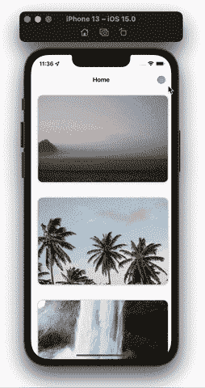

现在，将以下代码添加到`Sidebar.swift`:

```
var secondaryColor: Color = 
              Color(.init(
                red: 100 / 255,
                green: 174 / 255,
                blue: 255 / 255,
                alpha: 1))

var content: some View {
    HStack(alignment: .top) {
        ZStack(alignment: .top) {
            bgColor
            MenuChevron
        }
        .frame(width: sideBarWidth)
        .offset(x: isSidebarVisible ? 0 : -sideBarWidth)
        .animation(.default, value: isSidebarVisible)

        Spacer()
    }
}

var MenuChevron: some View {
    ZStack {
        RoundedRectangle(cornerRadius: 18)
            .fill(bgColor)
            .frame(width: 60, height: 60)
            .rotationEffect(Angle(degrees: 45))
            .offset(x: isSidebarVisible ? -18 : -10)
            .onTapGesture {
                isSidebarVisible.toggle()
            }

        Image(systemName: "chevron.right")
            .foregroundColor(secondaryColor)
            .rotationEffect(
              isSidebarVisible ?
                Angle(degrees: 180) : Angle(degrees: 0))
            .offset(x: isSidebarVisible ? -4 : 8)
            .foregroundColor(.blue)
    }
    .offset(x: sideBarWidth / 2, y: 80)
    .animation(.default, value: isSidebarVisible)
}

```

我们已经创建了新的变量`MenuChevron`，它包含一个有两个视图的`ZStack`，一个`RoundedRectangle`和一个`Image`。

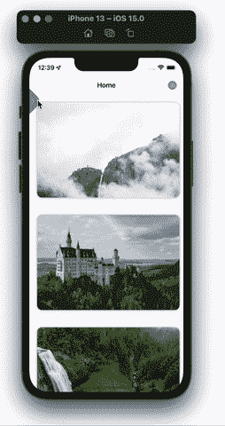

Tada！我们有一个工作侧边栏。我们给它加点内容吧！

最后一步是向侧边栏添加内容。

在我们的侧边栏中，有一个用户资料，其中包含应用程序不同部分的导航链接。让我们从用户概要视图开始。

要为用户配置文件部分创建 UI，请将下面的代码添加到`Sidebar.swift`文件中。

```
var content: some View {
    HStack(alignment: .top) {
        ZStack(alignment: .top) {
            bgColor
            MenuChevron

            VStack(alignment: .leading, spacing: 20) {
                userProfile
            }
            .padding(.top, 80)
            .padding(.horizontal, 40)
        }
        .frame(width: sideBarWidth)
        .offset(x: isSidebarVisible ? 0 : -sideBarWidth)
        .animation(.default, value: isSidebarVisible)

        Spacer()
    }
}

var userProfile: some View {
    VStack(alignment: .leading) {
        HStack {
            AsyncImage(
              url: URL(
                string: "https://picsum.photos/100")) { image in
                  image
                      .resizable()
                      .frame(width: 50, height: 50, alignment: .center)
                      .clipShape(Circle())
                      .overlay {
                          Circle().stroke(.blue, lineWidth: 2)
                      }
                  } placeholder: {
                      ProgressView()
                  }
                  .aspectRatio(3 / 2, contentMode: .fill)
                  .shadow(radius: 4)
                  .padding(.trailing, 18)

              VStack(alignment: .leading, spacing: 6) {
                  Text("John Doe")
                      .foregroundColor(.white)
                      .bold()
                      .font(.title3)
                  Text(verbatim: "[email protected]")
                      .foregroundColor(secondaryColor)
                      .font(.caption)
              }
          }
          .padding(.bottom, 20)
    }
}

```

注意，我们在侧边栏中添加了一个`VStack`，它有一个`userProfile`视图，包含以下内容:

*   一个`VStack`与`leading`对齐
*   一个包含两个以上视图的`HStack`
*   在`HStack`中，我们有用户配置文件图像，它是使用`AsyncImage`通过网络加载的
*   就在个人资料图片之后，我们有另一个`VStack`显示用户的姓名和电子邮件。电子邮件文本用`verbatim`初始化，因为 Swift 用默认强调颜色突出显示链接，所以，为了绕过这一点，我们使用`verbatim`

让我们转到菜单链接部分。为了创建链接，我们首先需要为一个包含所有商品信息的`MenuItem`创建一个`struct`。

```
struct MenuItem: Identifiable {
    var id: Int
    var icon: String
    var text: String
}

```

`MenuItem`只有三个属性:`id`、`icon`和`text`。让我们在 UI 中应用它。

```
import SwiftUI

var secondaryColor: Color = 
              Color(.init(
                red: 100 / 255,
                green: 174 / 255,
                blue: 255 / 255,
                alpha: 1))

struct MenuItem: Identifiable {
    var id: Int
    var icon: String
    var text: String
}

var userActions: [MenuItem] = [
    MenuItem(id: 4001, icon: "person.circle.fill", text: "My Account"),
    MenuItem(id: 4002, icon: "bag.fill", text: "My Orders"),
    MenuItem(id: 4003, icon: "gift.fill", text: "Wishlist"),
]

var profileActions: [MenuItem] = [
    MenuItem(id: 4004,
              icon: "wrench.and.screwdriver.fill",
              text: "Settings"),
    MenuItem(id: 4005,
              icon: "iphone.and.arrow.forward",
              text: "Logout"),
]

struct SideMenu: View {
    @Binding var isSidebarVisible: Bool
    var sideBarWidth = UIScreen.main.bounds.size.width * 0.7
    var bgColor: Color = Color(.init(
                                  red: 52 / 255,
                                  green: 70 / 255,
                                  blue: 182 / 255,
                                  alpha: 1))

    var body: some View {
        ZStack {
            GeometryReader { _ in
                EmptyView()
            }
            .background(.black.opacity(0.6))
            .opacity(isSidebarVisible ? 1 : 0)
            .animation(.easeInOut.delay(0.2), value: isSidebarVisible)
            .onTapGesture {
                isSidebarVisible.toggle()
            }

            content
        }
        .edgesIgnoringSafeArea(.all)
    }

    var content: some View {
        HStack(alignment: .top) {
            ZStack(alignment: .top) {
                menuColor
                MenuChevron

                VStack(alignment: .leading, spacing: 20) {
                    userProfile
                    Divider()
                    MenuLinks(items: userActions)
                    Divider()
                    MenuLinks(items: profileActions)
                }
                .padding(.top, 80)
                .padding(.horizontal, 40)
            }
            .frame(width: sideBarWidth)
            .offset(x: isSidebarVisible ? 0 : -sideBarWidth)
            .animation(.default, value: isSidebarVisible)

            Spacer()
        }
    }

    var MenuChevron: some View {
        ZStack {
            RoundedRectangle(cornerRadius: 18)
                .fill(bgColor)
                .frame(width: 60, height: 60)
                .rotationEffect(Angle(degrees: 45))
                .offset(x: isSidebarVisible ? -18 : -10)
                .onTapGesture {
                    isSidebarVisible.toggle()
                }

            Image(systemName: "chevron.right")
                .foregroundColor(secondaryColor)
                .rotationEffect(isSidebarVisible ? 
                    Angle(degrees: 180) : Angle(degrees: 0))
                .offset(x: isSidebarVisible ? -4 : 8)
                .foregroundColor(.blue)
        }
        .offset(x: sideBarWidth / 2, y: 80)
        .animation(.default, value: isSidebarVisible)
    }

    var userProfile: some View {
        VStack(alignment: .leading) {
            HStack {
                AsyncImage(
                  url: URL(
                      string: "https://picsum.photos/100")) { image in
                    image
                        .resizable()
                        .frame(width: 50,
                                height: 50,
                                alignment: .center)
                        .clipShape(Circle())
                        .overlay {
                            Circle().stroke(.blue, lineWidth: 2)
                        }
                } placeholder: {
                    ProgressView()
                }
                .aspectRatio(3 / 2, contentMode: .fill)
                .shadow(radius: 4)
                .padding(.trailing, 18)

                VStack(alignment: .leading, spacing: 6) {
                    Text("John Doe")
                        .foregroundColor(.white)
                        .bold()
                        .font(.title3)
                    Text(verbatim: "[email protected]")
                        .foregroundColor(secondaryColor)
                        .font(.caption)
                }
            }
            .padding(.bottom, 20)
        }
    }
}

struct MenuLinks: View {
    var items: [MenuItem]
    var body: some View {
        VStack(alignment: .leading, spacing: 30) {
            ForEach(items) { item in
                menuLink(icon: item.icon, text: item.text)
            }
        }
        .padding(.vertical, 14)
        .padding(.leading, 8)
    }
}

struct menuLink: View {
    var icon: String
    var text: String
    var body: some View {
        HStack {
            Image(systemName: icon)
                .resizable()
                .frame(width: 20, height: 20)
                .foregroundColor(secondaryColor)
                .padding(.trailing, 18)
            Text(text)
                .foregroundColor(.white)
                .font(.body)
        }
        .onTapGesture {
            print("Tapped on \(text)")
        }
    }
}

```

这里，我们介绍了两个新的视图，`MenuLinks`和`menuLink`。`MenuLinks`有`items`，它们在`MenuLinks`视图初始化时被赋值。视图遍历每个`items`实例，并为每个条目返回一个新视图`menuLink`。

`menuLink`有两个在视图创建时初始化的变量:`icon`和`text`，它们被包装在一个`HStack`中并显示出来。我们还在`menuLink`视图中捕捉点击手势。目前，我们正在将项目值打印到控制台，但是您可以添加一个`NavigationLink`并将用户导航到内部屏幕。

就是这样！我们现在有了一个工作侧边栏。

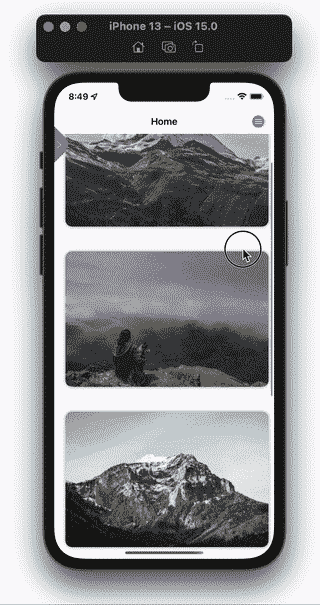

## 结论

在本教程中，您看到了在 SwiftUI 中创建自定义侧栏是多么容易。当然，你可以做很多改变来进一步定制你的侧边栏。感谢您的阅读！

## 使用 [LogRocket](https://lp.logrocket.com/blg/signup) 消除传统错误报告的干扰

[](https://lp.logrocket.com/blg/signup)

[LogRocket](https://lp.logrocket.com/blg/signup) 是一个数字体验分析解决方案，它可以保护您免受数百个假阳性错误警报的影响，只针对几个真正重要的项目。LogRocket 会告诉您应用程序中实际影响用户的最具影响力的 bug 和 UX 问题。

然后，使用具有深层技术遥测的会话重放来确切地查看用户看到了什么以及是什么导致了问题，就像你在他们身后看一样。

LogRocket 自动聚合客户端错误、JS 异常、前端性能指标和用户交互。然后 LogRocket 使用机器学习来告诉你哪些问题正在影响大多数用户，并提供你需要修复它的上下文。

关注重要的 bug—[今天就试试 LogRocket】。](https://lp.logrocket.com/blg/signup-issue-free)