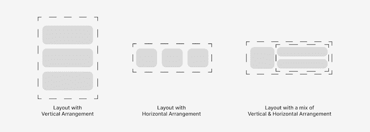
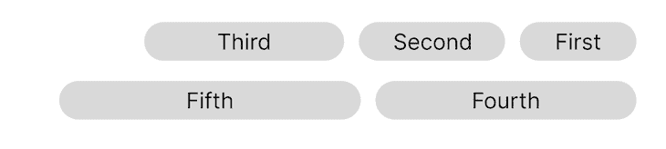
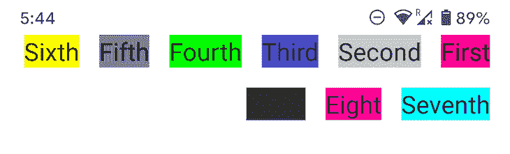

# 使用 Jetpack Compose 为 Android 应用程序创建自定义布局

> 原文：<https://blog.logrocket.com/create-custom-layouts-android-apps-jetpack-compose/>

布局可以被描述为容纳`View`对象的容器——比如按钮、文本字段、图像等等——我们在应用程序 UI 上看到的。它们定义了视图在应用程序 UI 上的排列和显示方式。



Android 的现代 UI 工具包 Jetpack Compose 提供了一些常见的布局类型供开发者使用。但是，您也可以使用 Jetpack Compose 根据自己的需要创建定制的布局。

让我们进一步了解 Android 应用程序的自定义布局，以及如何使用 Jsatisetpack Compose 创建它们。在本文中:

## 为什么您应该知道如何创建自定义布局

Jetpack Compose 为构建更快的 Android 应用提供了许多开发工具，包括各种布局选项。有时候，你可以使用这些现有的[布局在 Jetpack Compose](https://developer.android.com/jetpack/compose/layouts) 中实现应用程序 UI 的设计需求。

然而，这些现有的布局并不总是满足项目设计要求。在这种情况下，您应该知道如何创建自定义布局来满足项目的确切要求。

## Jetpack 撰写中的布局概述

Jetpack Compose 中的一些常见布局是:

*   将视图放在另一个之上的布局
*   `[Column](https://developer.android.com/reference/kotlin/androidx/compose/foundation/layout/package-summary?hl=en#Column(androidx.compose.ui.Modifier,androidx.compose.foundation.layout.Arrangement.Vertical,androidx.compose.ui.Alignment.Horizontal,kotlin.Function1)`:以垂直顺序放置视图的布局
*   `[Row](https://developer.android.com/reference/kotlin/androidx/compose/foundation/layout/package-summary?hl=en#Row(androidx.compose.ui.Modifier,androidx.compose.foundation.layout.Arrangement.Horizontal,androidx.compose.ui.Alignment.Vertical,kotlin.Function1)`:以水平顺序放置视图的布局
*   相对于其他视图放置其视图的布局

最近测试中的网格布局`[LazyVerticalGrid](https://developer.android.com/reference/kotlin/androidx/compose/foundation/lazy/grid/package-summary#LazyVerticalGrid(androidx.compose.foundation.lazy.grid.GridCells,androidx.compose.ui.Modifier,androidx.compose.foundation.lazy.grid.LazyGridState,androidx.compose.foundation.layout.PaddingValues,kotlin.Boolean,androidx.compose.foundation.layout.Arrangement.Vertical,androidx.compose.foundation.layout.Arrangement.Horizontal,androidx.compose.foundation.gestures.FlingBehavior,kotlin.Boolean,kotlin.Function1)`和`[LazyHorizontalGrid](https://developer.android.com/reference/kotlin/androidx/compose/foundation/lazy/grid/package-summary#LazyHorizontalGrid(androidx.compose.foundation.lazy.grid.GridCells,androidx.compose.ui.Modifier,androidx.compose.foundation.lazy.grid.LazyGridState,androidx.compose.foundation.layout.PaddingValues,kotlin.Boolean,androidx.compose.foundation.layout.Arrangement.Horizontal,androidx.compose.foundation.layout.Arrangement.Vertical,androidx.compose.foundation.gestures.FlingBehavior,kotlin.Boolean,kotlin.Function1)`全面发布。

随着这次更新而来的是令人兴奋的新布局[，叫做](https://developer.android.com/reference/kotlin/androidx/compose/foundation/lazy/layout/package-summary?hl=en#LazyLayout(androidx.compose.foundation.lazy.layout.LazyLayoutItemsProvider,androidx.compose.ui.Modifier,androidx.compose.foundation.lazy.layout.LazyLayoutPrefetchState,kotlin.Function2) `[LazyLayout](https://developer.android.com/reference/kotlin/androidx/compose/foundation/lazy/layout/package-summary?hl=en#LazyLayout(androidx.compose.foundation.lazy.layout.LazyLayoutItemsProvider,androidx.compose.ui.Modifier,androidx.compose.foundation.lazy.layout.LazyLayoutPrefetchState,kotlin.Function2)`。这是一种仅构成和布置当前需要的项目的布局，换句话说，就是在某个时间点可以在设备屏幕上看到的项目。

您可以使用惰性布局来构建高效的可滚动布局。`LazyLayout`变化包括:

*   `[LazyList](https://developer.android.com/jetpack/compose/lists#lazy)`，显示可滚动列表:
*   `[LazyGrid](https://developer.android.com/jetpack/compose/lists#lazy-grids)`，显示可滚动的网格:

我知道你经常看到“懒惰”这个词，不，这并不意味着这些布局不愿意执行它们的功能(就像我们中的一些人🙃).相反，它只是意味着一个懒惰的布局将只在必要的时候执行它的功能。换句话说，真的很高效。

这就是为什么惰性布局用于显示大量视图的布局，允许它们以列表和网格的形式容易地组织和滚动。

## 在 Jetpack Compose 中构建自定义布局的步骤

为了让您有效地理解构建自己的布局的过程，我将使用一个简单的示例。我们将构建一个我喜欢称之为`ReverseFlowRow`的布局。

这种布局只是将视图彼此相邻放置，当当前行填满时，移动到下一行。但是，它从屏幕的结束位置到开始位置开始排列视图，换句话说，从右到左:



这样的布局是我感觉应该用于 [Jetpack Compose 的](https://blog.logrocket.com/adding-alertdialog-jetpack-compose-android-apps/) `[AlertDialog](https://blog.logrocket.com/adding-alertdialog-jetpack-compose-android-apps/)` [按钮](https://blog.logrocket.com/adding-alertdialog-jetpack-compose-android-apps/)到[满足材质设计准则](https://material.io/components/dialogs#anatomy)的。

目前，正在使用类似的布局，但是它从屏幕的开始位置到结束位置，这不满足那些准则。你可以[找到我用 IssueTracker](https://issuetracker.google.com/issues/235454277) 提交的问题。

### Jetpack 背后的理论是为 Android 应用程序设计布局

为了在屏幕上显示视图，Jetpack Compose 组成了节点(表示视图)的 UI 树，在 UI 树中布局每个视图，并将每个视图绘制到屏幕上。

出于本文的目的，我们只对视图的布局感兴趣，因为我们可以在这个过程中创建一个定制的布局。在布局中布置视图的过程分三步进行:

1.  测量布局中的所有视图(即子视图)
2.  决定布局的大小
3.  将孩子放在布局的边界内

### 使用`Layout`可组合

在 Jetpack Compose 中，布局视图可以使用`Layout` composable 来实现，它被定义为:

```
@Composable inline fun Layout(
    content: @Composable @UiComposable () -> Unit,
    modifier: Modifier = Modifier,
    measurePolicy: MeasurePolicy
)

```

`content`参数指定您希望在该布局中出现的一个或多个视图(称为`Composable`)。`modifier`参数用于定义对布局的一些修改，这些修改可以从父视图或可组合视图中传递。

上面代码中最重要的部分是`MeasurePolicy`，它定义了子视图的度量、布局的大小以及子视图在布局中的位置。

所以我们的`ReverseFlowRow`将这样开始:

```
@Composable
fun ReverseFlowRow(
    content: @Composable () -> Unit
) = Layout(content) { measurables, constraints ->
    // measuring children, layout sizing, and placing children takes place here.
}

```

你可能会注意到我们把`MeasurePolicy`表示为λ。这是可能的，因为`[MeasurePolicy](https://kotlinlang.org/docs/fun-interfaces.html)` [是一个功能接口](https://kotlinlang.org/docs/fun-interfaces.html)。

同样在上面的代码中，`measurables`是需要测量的子元素列表，而`constraints`是来自父元素的布局边界。

### 测量自定义布局中的所有视图

我们通过对每个孩子调用`measure(constraints)`来度量每个孩子的约束。这将返回一个`Placeable`，它对应于一个可以被其父布局定位的子布局。

```
val placeables = measurables.map { measurable ->
    // Measure each child.
    measurable.measure(constraints)
}

```

请注意，我们在度量每个孩子时使用了父母的约束。如果可能的话，这使得每个孩子都能够占据父母的整个空间。

### 向自定义布局添加大小约束

接下来，我们通过调用`layout()`方法并至少指定其宽度和高度来定义布局的大小。

```
layout(constraints.maxWidth, constraints.maxHeight) {
   // Placement of children occurs here.
}

```

这里我们使用了父约束的最大宽度和高度。因此，根据父约束，该布局可能会也可能不会占据整个屏幕。

### 在布局中放置视图

最后，我们通过调用`placeRelative()`方法在布局中放置测量的子元素，也称为`Placeable`元素。

如果您想要在设备的布局方向改变时自动镜像您的布局，也就是说，从左到右到右到左，反之亦然，则应该使用此方法。

请注意，您可以在`layout()`接收器中获取当前的`LayoutDirection`。如果您不想在布局方向改变时自动镜像布局，而是决定如何在每个布局方向放置视图，这将非常有用。

如果不希望布局根据布局方向自动镜像，请使用`place()`方法。

```
// Track the x and y co-ordinates we have placed children up to.
var yPosition = 0
var xPosition = constraints.maxWidth

// Place children in the parent layout.
placeables.forEach { placeable ->
    if (placeable.width < xPosition) {
        // There is still enough space in the current row to add the next child.
        xPosition -= placeable.width
    } else {
        // Space left in the current row is not enough for the child. 
        // Move to the next row.
        yPosition += placeable.height
        xPosition = constraints.maxWidth - placeable.width
    }
    // Position child on the screen.
    placeable.placeRelative(xPosition, yPosition)
}

```

如您所见，我们需要跟踪用于指示每个孩子应该从哪里开始放置的`x`和`y`坐标。这将使我们能够将一个孩子放在另一个孩子旁边，并知道何时移动到下一行或下一行。

### 自定义 Android 应用程序布局的最终 Jetpack 合成项目代码

我们的完整布局将如下所示:

```
@Composable
fun ReverseFlowRow(
    mainAxisSpacing: Dp,
    crossAxisSpacing: Dp,
    content: @Composable () -> Unit
) = Layout(content) { measurables, constraints ->
    // 1\. The measuring phase.
    val placeables = measurables.map { measurable ->
        measurable.measure(constraints)
    }

    // 2\. The sizing phase.
    layout(constraints.maxWidth, constraints.maxHeight) {
        // 3\. The placement phase.
        var yPosition = 0
        var xPosition = constraints.maxWidth

        placeables.forEach { placeable ->
            if (placeable.width < (xPosition + mainAxisSpacing.roundToPx())) {
                xPosition -= (placeable.width + mainAxisSpacing.roundToPx())
            } else {
                yPosition += (placeable.height + crossAxisSpacing.roundToPx())
                xPosition = constraints.maxWidth - placeable.width - mainAxisSpacing.roundToPx()
            }
            placeable.placeRelative(xPosition, yPosition)
        }
    }
}

```

你注意到我添加了两个新属性:`mainAxisSpacing`和`crossAxisSpacing`了吗？它们分别用于在水平和垂直方向上增加布局中每个子元素之间的间距。

### 测试我们的定制布局

为了预览我们的布局，我们可以将它包装在一个用`@Preview`注释的可组合函数中。这使我们能够运行一个布局示例，而无需 Android 应用程序所需的额外配置。同样，让我们在布局中添加一些文本视图/组件，看看它是如何显示它们的:

```
@Preview
@Composable
fun ReverseFlowRowPreview() {
    ReverseFlowRow(mainAxisSpacing = 16.dp, crossAxisSpacing = 16.dp) {
        Text("First", fontSize = 20.sp, style = TextStyle(background = Color.Red))
        Text("Second", fontSize = 20.sp, style = TextStyle(background = Color.LightGray))
        Text("Third", fontSize = 20.sp, style = TextStyle(background = Color.Blue))
        Text("Fourth", fontSize = 20.sp, style = TextStyle(background = Color.Green))
        Text("Fifth", fontSize = 20.sp, style = TextStyle(background = Color.Gray))
        Text("Sixth", fontSize = 20.sp, style = TextStyle(background = Color.Yellow))
        Text("Seventh", fontSize = 20.sp, style = TextStyle(background = Color.Cyan))
        Text("Eight", fontSize = 20.sp, style = TextStyle(background = Color.Magenta))
        Text("Ninth", fontSize = 20.sp, style = TextStyle(background = Color.DarkGray))
    }
}

```

运行预览会产生以下结果:



虽然我们在这个示例中使用了文本视图/组件，但是这个自定义的 Jetpack 组合布局也可以与其他 Jetpack 组合组件一起使用。您还可以使用本教程中介绍的概念和步骤来创建自己的自定义布局。

## 结论

这就是创建你自己的布局所需要的。这个例子考虑了一个常规的案例场景，比如一个`AlertDialog`的按钮所需的布局，但是它可以被改进以迎合更多的案例场景，比如孩子有不同尺寸的情况。

如果你用我们创建的`ReverseFlowRow`布局来处理不同大小的孩子，他们之间会有一些重叠。需要一些额外的代码来适应这种情况。如果你想解决这个小问题，请在下面的评论中发布更新的代码！

我很高兴看到你们的解决方案。与此同时，你可以了解更多关于 [Jetpack Compose 主题的信息，比如主题化](https://blog.logrocket.com/exploring-theming-jetpack-compose/)来提高你的 Android 应用开发技能。

## 使用 [LogRocket](https://lp.logrocket.com/blg/signup) 消除传统错误报告的干扰

[](https://lp.logrocket.com/blg/signup)

[LogRocket](https://lp.logrocket.com/blg/signup) 是一个数字体验分析解决方案，它可以保护您免受数百个假阳性错误警报的影响，只针对几个真正重要的项目。LogRocket 会告诉您应用程序中实际影响用户的最具影响力的 bug 和 UX 问题。

然后，使用具有深层技术遥测的会话重放来确切地查看用户看到了什么以及是什么导致了问题，就像你在他们身后看一样。

LogRocket 自动聚合客户端错误、JS 异常、前端性能指标和用户交互。然后 LogRocket 使用机器学习来告诉你哪些问题正在影响大多数用户，并提供你需要修复它的上下文。

关注重要的 bug—[今天就试试 LogRocket】。](https://lp.logrocket.com/blg/signup-issue-free)

## LogRocket :即时重现你的安卓应用中的问题。

[](https://lp.logrocket.com/blg/kotlin-signup)

[LogRocket](https://lp.logrocket.com/blg/kotlin-signup) 是一款 Android 监控解决方案，可以帮助您即时重现问题，确定 bug 的优先级，并了解您的 Android 应用程序的性能。

LogRocket 还可以向你展示用户是如何与你的应用程序互动的，从而帮助你提高转化率和产品使用率。LogRocket 的产品分析功能揭示了用户不完成特定流程或不采用新功能的原因。

开始主动监控您的 Android 应用程序— [免费试用 LogRocket】。](hhttps://lp.logrocket.com/blg/kotlin-signup)