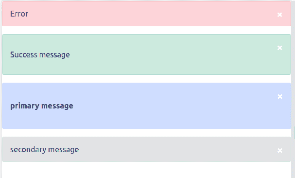

# 创建一个自定义的反应警报消息-日志火箭博客

> 原文：<https://blog.logrocket.com/create-custom-react-alert-message/>

警报消息是 web 的内置组件，通常在在线应用程序中用于显示状态消息，如警告、错误、成功消息、信息和确认同意。

在本教程中，我们将回顾一些在 React 中创建警报消息的流行框架，然后我们将创建我们自己的带有复杂样式和附加功能的定制警报消息。本教程的完整代码可从 GitHub 库获得。我们开始吧！

## 目录

## 警报消息功能

在我们构建我们的自定义警报消息之前，让我们先了解一下警报消息组件是什么样子的。

警报消息应该向用户动态显示一条消息。它还应该有一个带有事件处理程序的关闭按钮，以隐藏不同消息的组件和动态样式。

我们将创建一个具有以下功能的自定义警报消息:

*   `Type`:要显示的消息类型，即错误、成功、主要或次要。类型还决定了应用于警报消息元素的样式
*   `Message`:向用户解释错误或警告的文本消息
*   `Children`:包含要显示内容的元素
*   `HandleClose`:组件请求关闭时触发的函数

## React 警报消息框架

React 社区提供了各种各样的警报框架，您可以在项目中使用它们来简化开发过程。在我们构建自定义警报消息组件之前，让我们先来看看其中的一些框架。

## 反应迟钝

React-Toastify 是一个基于 [Toastify](https://aleab.github.io/toastify/) 的轻量级包，可以让你在 React 项目中添加个性化的提醒。您可以使用 React-Toastify 向 React 组件添加一条警告消息，代码如下:

```
import React from 'react';
import { ToastContainer, toast } from 'react-toastify';
import 'react-toastify/dist/ReactToastify.css';

function App(){
  const notify = () => toast("Wow so easy!");
  return (
    <div>
      <button onClick={notify}>Notify!</button>
      <ToastContainer />
    </div>
  );
}

```

## RC-通知

rc-notification 是另一个 React UI 组件库，允许您向 React 项目添加警告消息。下面的代码片段显示了使用 rc-notification 的警告消息。

从 rc 通知导入`Notification`:

```
Notification.newInstance({}, notification => {
  notification.notice({
    content: 'content'
  });
});

```

## 查克拉 UI `Alert`

[Chakra UI `Alert`](https://chakra-ui.com/docs/feedback/alert) 组件提供了简单、模块化、可访问、可重用和可组合的 React 组件，使得在 React 应用程序中创建和定制警报消息变得非常容易。

下面的代码片段是一个使用`@chakra-ui/alert`的警告消息的例子:

```
<Alert status='error'>
  <AlertIcon />
  <AlertTitle mr={2}>Your browser is outdated!</AlertTitle>
  <AlertDescription>Your Chakra experience may be degraded.</AlertDescription>
  <CloseButton position='absolute' right='8px' top='8px' />
</Alert>

```

还有一堆其他的 React 警报消息框架，你可以查看一下。我们将创建自己的定制警报消息，而不是使用这些框架。我们开始吧！

## 设置我们的 Create React 应用程序项目

使用以下命令为本教程中的演示创建一个 React 项目:

```
npx create-react-app custom-alert

```

一旦以上命令中的安装完成，使用以下命令进入项目目录:

```
cd custom-alert

```

然后，使用下面的命令启动服务器:

```
npm start

```

## 创建警报组件

设置好 React 项目后，让我们创建警报组件。在`src`目录中创建一个`component/Alert.jxs`文件夹，并添加以下代码片段:

```
export default function Alert() {
return (
    <div>
      <span> &times;</span>
        message
    </div>
  );
}

```

在上面的代码片段中，我们创建了一个警报组件。这个命令还没做多少事情；让我们通过添加一些样式来使它看起来更好。

## 设计组件的样式

要添加样式，首先，在`src/components`文件夹中创建一个`style.module.css`文件，并添加以下 CSS 样式:

```
/* The alert message box */
.alert {
  position: relative;
  padding: 1rem 1rem;
  margin-bottom: 1rem;
  border: 1px solid transparent;
  border-radius: 0.25rem;
}
.error {
  color: #842029;
  background-color: #f8d7da;
  border-color: #f5c2c7;
}

.success {
  color: #0f5132;
  background-color: #d1e7dd;
  border-color: #badbcc;
}

.warning {
  color: #664d03;
  background-color: #fff3cd;
  border-color: #ffecb5;
}
.primary {
  color: #084298;
  background-color: #cfe2ff;
  border-color: #b6d4fe;
}

.secondary {
  color: #41464b;
  background-color: #e2e3e5;
  border-color: #d3d6d8;
}

.info {
  color: #055160;
  background-color: #cff4fc;
  border-color: #b6effb;
}
/* The close button */
.closebtn {
  margin-left: 15px;
  color: white;
  font-weight: bold;
  float: right;
  font-size: 22px;
  line-height: 20px;
  cursor: pointer;
  transition: 0.3s;
}

/* When moving the mouse over the close button */
.closebtn:hover {
  color: black;
}
.hide {
  display: none;
}

```

在上面的样式表中，我们为呈现给用户的每种类型的消息定义了一些 CSS 样式。

修改`Alert.jsx`文件以使用我们上面定义的样式。我们根据用户选择的样式类型动态地应用样式，并对警报组件中的元素应用多种样式，因此我们需要安装一个名为 [classnames](https://www.npmjs.com/package/classnames) 的模块，命令如下:

```
npm install classnames

```

一旦模块安装完毕，修改`Alert`组件，使其看起来像下面的代码片段:

```
import style from "./style.module.css";
import css from "classnames";
import React from "react";

export default function Alert({ children, type, message }) {

  const renderElAlert = function () {
    return React.cloneElement(children);
  };

return (
    <div className={css(style.alert, style[type])}>
      <span className={style.closebtn}>
        &times;
      </span>
      {children ? renderElAlert() : message}
    </div>
  );
}

```

在上面的代码片段中，我们导入了刚刚安装的`style`和类名模块。

我们从组件中得到`children`、`type`和`message`道具。然后，我们创建一个`renderElAlert`，它将使用`React.cloneElement`函数呈现任何用于添加消息的子元素。我们检查用户的消息是否在 HTML 元素中，并呈现`children`属性，否则，我们显示`message`属性。

## 添加事件侦听器

我们需要给用户在阅读完内容后关闭消息的自由。

我们将向组件添加一个事件监听器，并通过点击**关闭**按钮来监听事件。当用户点击**关闭**按钮时，我们将修改组件的状态并将`hide`属性添加到`className`属性中。

您的`Alert`组件应该看起来像下面的代码:

```
import style from "./style.module.css";
import css from "classnames";
import React from "react";
import { useState } from "react";

export default function Alert({ children, type, message }) {
  const [isShow, setIsShow] = useState(true);

  const renderElAlert = function () {
    return React.cloneElement(children);
  };

  const handleClose = (e) => {
    e.preventDefault();
    setIsShow(false);
  };

  return (
    <div className={css(style.alert, style[type], !isShow && style.hide)}>
      <span className={style.closebtn} onClick={handleClose}>
        &times;
      </span>
      {children ? renderElAlert() : message}
    </div>
  );
}

```

## 测试我们定制的`Alert`组件

至此，我们已经成功创建了第一个定制的 React 警报。打开`App.js`文件，用下面的代码片段测试组件:

```
import Alert from "./components/Alert";
function App() {
  return (
    <div className="App">
      <Alert type="error" message="Error" />
      <Alert type="success">
        <p>Success message</p>
      </Alert>
      <Alert type="primary">
        <h4>primary message</h4>
      </Alert>
      <Alert type="secondary">
        <span>secondary message</span>
      </Alert>
    </div>
  );
}
export default App;

```

在上面的代码片段中，我们导入了我们的`Alert`组件并创建了一些警告消息。请注意，我们是如何在初始警报消息中提供一条消息，而没有将它包装在一个元素周围的。剩余的代码被包装在其他 HTML 元素中。您应该会看到屏幕上显示的警报，如下面的屏幕截图所示:



## 结论

在本教程中，我们回顾了警报消息的必要特性，探索了一些用于构建警报消息的流行库，最后从头开始构建了我们自己的定制版本。

请随意克隆或派生本教程的 GitHub 库，并向其中添加更多特性。或许你可以在评论区留下你的问题或建议，或者在推特上联系我。编码快乐！

## 使用 LogRocket 消除传统反应错误报告的噪音

[LogRocket](https://lp.logrocket.com/blg/react-signup-issue-free)

是一款 React analytics 解决方案，可保护您免受数百个误报错误警报的影响，只针对少数真正重要的项目。LogRocket 告诉您 React 应用程序中实际影响用户的最具影响力的 bug 和 UX 问题。

[ ](https://lp.logrocket.com/blg/react-signup-general) [  ](https://lp.logrocket.com/blg/react-signup-general) [LogRocket](https://lp.logrocket.com/blg/react-signup-issue-free)

自动聚合客户端错误、反应错误边界、还原状态、缓慢的组件加载时间、JS 异常、前端性能指标和用户交互。然后，LogRocket 使用机器学习来通知您影响大多数用户的最具影响力的问题，并提供您修复它所需的上下文。

关注重要的 React bug—[今天就试试 LogRocket】。](https://lp.logrocket.com/blg/react-signup-issue-free)