# 在 React Native 中创建自定义和可共享的日历

> 原文：<https://blog.logrocket.com/create-customized-shareable-calendars-react-native/>

移动应用程序开发人员在他们的应用程序中使用各种 GUI 元素，如按钮、列表、输入框和应用程序屏幕中的文本区域。有时，我们需要复杂的 GUI 元素，例如日历、时间表、议程视图等。

React Native framework 提供了用于添加主要 GUI 元素的内置组件，但对于设计复杂的 GUI 组件，我们必须使用内置核心元素从头开始构建它们，或者重用第三方库中预先实现的组件。

[`react-native-calendars`库](https://github.com/wix/react-native-calendars)提供预实现的、可定制的组件，用于向 React 本地应用添加日历。您可以使用这些日历组件来创建自定义的可共享日历，以显示基于日期的数据并从用户处获取日期值。

在本教程中，我将解释如何使用`react-native-calendars`创建定制的可共享日历，并让您了解几个用于创建定制日历的可选软件包。

*向前跳转:*

## `react-native-calendars`的突出特点

该日历库为添加可定制的高质量日历组件提供了以下突出功能:

### 满足您需求的多种组件

该库提供了用于创建日历、议程视图和时间线的各种组件。以下是创建日历的常用方法:

*   `Calendar`:呈现一个内置月份导航支持的日历组件
*   一个现代、时尚的组件，呈现一个半无限的、可滚动的日历列表
*   一个复杂的日历组件帮助开发人员实现时间表、约会表和日程安排表

### 跨平台支持和一致的外观

在选择 React 原生库时，跨平台支持确实是一个需要考虑的重要因素。这个包正式支持 Android 和 iOS 平台，并提供与主要 React 原生组件(`Text`、`TouchableOpacity`等)一致的外观和感觉。)在两种操作系统上看起来几乎一样。

### 广泛的定制和功能

每个库组件都公开了几个道具来定制特定组件的行为和特性。例如，这个包允许您通过提供一个主题对象来自定义日历组件的字体和颜色。此外，您可以使用内置的可自定义指示器和自定义形状来标记单个日期和日期范围。

通过覆盖样式表定义，可以实现高级样式定制。所以，如果你为你的应用程序使用你自己的主题，使用现有的主题颜色是很容易的。这个包还允许您为各种事件附加回调，因此构建一个定制的现代日期选择器是可行的。

## react-native-日历教程

现在，我们已经了解了日历包的概况。让我们开始在 React 原生应用程序中实际使用它，通过测试它的特性来变得更加熟悉。您可以在现有应用程序中直接使用即将推出的代码示例，或者创建一个新的实验性应用程序来继续学习教程。

如果您想开始一个新项目，请使用以下命令创建一个项目:

```
npx react-native init CalendarsExample
cd CalendarsExample

```

接下来，运行应用程序以确保一切正常:

```
npx react-native run-android
# --- or ---
npx react-native run-ios

```

输入以下命令并安装`react-native-calendars`:

```
npm install react-native-calendars
# --- or ---
yarn install react-native-calendars

```

让我们从`Calendar`组件开始，深入了解它的定制和特性！

### 创建基本日历

`Calendar`组件让您呈现支持月份导航的传统日历元素。这里没有强制属性——使用`App.js`中没有属性的组件创建一个默认设置的日历:

```
import React from 'react';
import {
  SafeAreaView,
  ScrollView,
  StyleSheet,
  View,
} from 'react-native';
import { Calendar } from 'react-native-calendars';

function App() {
  return (
    <SafeAreaView style={styles.container}>
      <Calendar />
    </SafeAreaView>
  );
};

const styles = StyleSheet.create({
  container: {
    flex: 1,
    justifyContent: 'center'
  },
});

export default App;

```

上述代码将使用默认功能和样式呈现一个日历组件，如下面的预览所示:

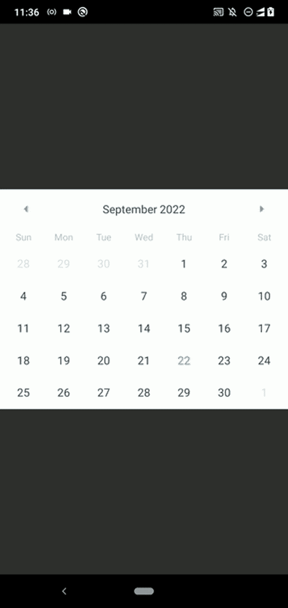

The calendar component in Android

**注意**:选择一个日期不会像每个人期望的那样作为一个内置功能呈现高亮背景样式——我们必须为它写一些代码。我将解释如何在[标记个别日期部分](#marking-individual-dates)突出显示所选日期。

### 附加触摸事件回调

日历组件是交互式的，因此用户可以通过按月导航箭头和日元素来执行操作。这个库公开了几个道具来为这些关键的用户操作附加回调。请看下面的回调实现示例:

```
<Calendar
  onDayPress={(day) => console.log('onDayPress', day) }
  onDayLongPress={(day) => console.log('onDayLongPress', day) }
  onMonthChange={(date) => console.log('onMonthChange', date) }
  onPressArrowLeft={(goToPreviousMonth) => {
    console.log('onPressArrowLeft'); goToPreviousMonth();
  }}
  onPressArrowRight={(goToNextMonth) => {
    console.log('onPressArrowRight'); goToNextMonth();
  }}
/>

```

对以下输入执行处理程序:

*   `onDayPress`:当用户点击特定的日元素时
*   `onDayLongPress`:当用户长按一个日元素时
*   `onMonthChange`:日历月份变更时
*   `onPressArrowLeft`:当用户点击左侧月份导航箭头时
*   `onPressArrowRight`:当用户点击右侧月份导航箭头时

运行上面的代码片段，检查代码，修改它，熟悉我们所有的回调。例如，您可以获得用户按下的日期，如下所示:

```
onDayPress={(day) => console.log('Selected date: ', day.dateString) }

```

通过附加函数实现来试验所有其他回调。

### 设置初始、最小和最大日期

在某些情况下，使用带有回调实现的默认日历不足以满足应用规范。有时，我们需要设置最初选择的月份和最小/最大结束日期。`Calendar`组件提供了设置初始、最小和最大日期的属性。

假设您需要创建一个日历组件，它最初显示 2022 年 12 月，并允许您只按 2022 年 12 月 1 日到 2023 年 1 月 30 日之间的某一天。以下代码片段符合此规范:

```
<Calendar
  initialDate="2022-12-01"
  minDate="2022-12-01"
  maxDate="2023-01-30"
  disableAllTouchEventsForDisabledDays={true}
/>

```

这里，`disableAllTouchEventsForDisabledDays`布尔属性帮助我们禁用禁用日期元素的触摸反馈。运行应用程序代码片段，并将结果与上述规范进行比较:

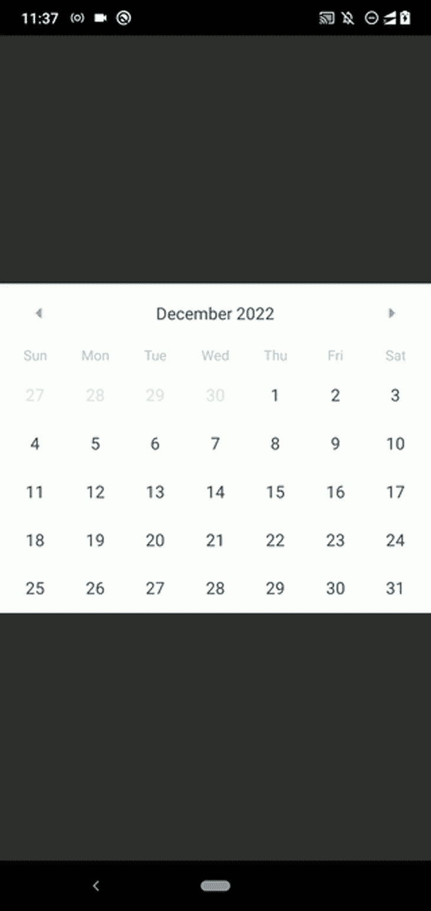

Setting initial, min, and max dates

### 使日历组件可重用

如果您需要在几个地方使用上面的日历，创建一个可重用的组件无疑是一个好的实践:

```
import React from 'react';
import {
  SafeAreaView,
  ScrollView,
  StyleSheet,
  View,
} from 'react-native';
import { Calendar } from 'react-native-calendars';

function CustomCalendar(props) {
  return (
    <Calendar
      initialDate="2022-12-01"
      minDate="2022-12-01"
      maxDate="2023-01-30"
      disableAllTouchEventsForDisabledDays={true}
      {...props}
    />
  );
}

function App() {
  return (
    <SafeAreaView style={styles.container}>
      <CustomCalendar onDayPress={(day) => console.log(`Date pressed: ${day.dateString}`)} />
    </SafeAreaView>
  );
};

const styles = StyleSheet.create({
  container: {
    flex: 1,
    justifyContent: 'center',
  },
});

export default App;

```

上面的`CustomCalendar`组件使用定制的初始、最小和最大日期。它还接受进一步定制的`Calendar`道具。我们将在下一节讨论如何开发一个可重用的日期选择器组件——然后，您可以了解更多关于创建可共享日历的信息。

## 支持的日历用户界面自定义

日历组件由类似`View`、`TouchableOpacity`和`Text`的内置框架组件组成，不同于 Android 和 iOS 中特定于平台的原生日期选择器组件。因此，它为广泛的 UI 定制提供了许多支持。

例如，在前面的`CustomCalendar`实现中，您可以使用`disableLeftArrow`和`disableRightArrow`布尔属性禁用左右箭头:

```
function CustomCalendar(props) {
  return (
    <Calendar
      initialDate="2022-12-01"
      minDate="2022-12-01"
      maxDate="2022-12-31"
      disableAllTouchEventsForDisabledDays={true}
      disableArrowLeft={true}
      disableArrowRight={true}
      {...props}
    />
  );
}

```

现在，您将只能看到 2022 年 12 月，因为逐月导航是不可能的:

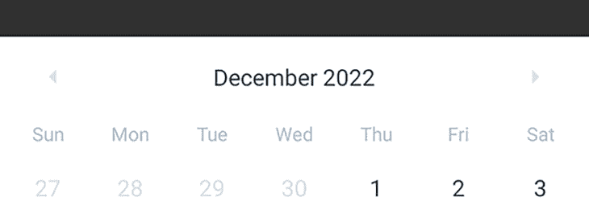

Disabling the month navigation icons

使用`hideArrows`布尔属性也可以隐藏两个箭头:

```
function CustomCalendar(props) {
  return (
    <Calendar
      initialDate="2022-12-01"
      minDate="2022-12-01"
      maxDate="2022-12-31"
      disableAllTouchEventsForDisabledDays={true}
      hideArrows={true}
      {...props}
    />
  );
}

```

默认情况下，周行从星期日开始。您可以从周一开始每周一行，并使用以下道具在日历上显示周数:

```
firstDay={1}
showWeekNumbers={true}

```

看下面的预告:

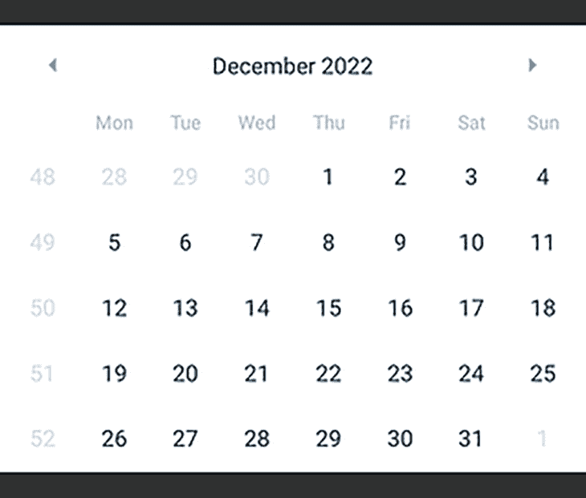

Changing the default first weekday and showing the week numbers

利用`dateFormat`属性也可以使用自定义的月份格式。例如，以下设置将呈现类似于`Dec/2020`的月份字符串:

```
monthFormat="MMM/yyyy"

```

浏览[官方文档](https://wix.github.io/react-native-calendars/docs/Calendar#api)并确定所有支持的日历属性，这些属性有助于定制日历 UI。

### 标记个别日期

看看你桌子上或墙上的纸质日历。你会看到几个日期框标有背景色或符号，以表示特殊的日子或国定假日。我们如何在`Calendar`组件中标记类似于物理组件的日元素？

`Calendar`组件允许您通过`markedDates`属性标记日期。让我们先来学习如何标记个别的日子！对`CustomCalendar`使用以下代码:

```
function CustomCalendar(props) {
  const marked = {
    '2022-12-10': { marked: true },
    '2022-12-12': { selected: true }
  };
  return (
    <Calendar
      initialDate="2022-12-01"
      minDate="2022-12-01"
      maxDate="2022-12-31"
      disableAllTouchEventsForDisabledDays={true}
      markedDates={marked}
      {...props}
    />
  );
}

```

如果`marked`布尔属性设置为`true`，组件将在特定日期渲染一个点；如果`selected`布尔属性被设置为`true`，组件将在特定的日期元素周围呈现一个实心圆。看下面的预告:

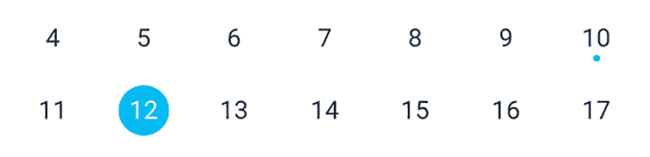

Marking day elements with a circle shape and a dot indicator

可以自定义上述指示器和形状，如下所示:

```
const marked = {
    '2022-12-10': { marked: true, dotColor: 'red' },
    '2022-12-12': { selected: true, selectedColor: '#aa2222', selectedTextColor: 'yellow' },
    '2022-12-13': {
      marked: true,
      selected: true,
      selectedColor: '#222222',
      selectedTextColor: 'yellow',
      dotColor: 'white'
    }
  };

```

一旦您对`marked`使用上述定义，您将看到以下结果:

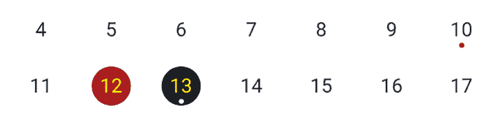

Using custom styles for default marking indicators

属性通过一个简单的实现帮助我们标记当前按下的 day 元素。我们可以在组件状态中存储当前日期，并相应地更新`markedDates`对象，如下面的代码所示:

```
import React, { useState, useMemo } from 'react';
import {
  SafeAreaView,
  ScrollView,
  StyleSheet,
  View,
} from 'react-native';
import { Calendar } from 'react-native-calendars';

function CustomCalendar(props) {
  const initDate = '2022-12-01';
  const [selected, setSelected] = useState(initDate);
  const marked = useMemo(() => ({
    [selected]: {
      selected: true,
      selectedColor: '#222222',
      selectedTextColor: 'yellow',
    }
  }), [selected]);
  return (
    <Calendar
      initialDate={initDate}
      markedDates={marked}
      onDayPress={(day) => {
        setSelected(day.dateString);
        props.onDaySelect && props.onDaySelect(day);
      }}
      {...props}
    />
  );
}

function App() {
  return (
    <SafeAreaView style={styles.container}>
      <CustomCalendar onDaySelect={(day) => console.log(`Date selected: ${day.dateString}`)}/>
    </SafeAreaView>
  );
};

const styles = StyleSheet.create({
  container: {
    flex: 1,
    justifyContent: 'center',
  },
});

export default App;

```

这里，我们使用了`useMemo`钩子来[记忆`marked`对象的](https://en.wikipedia.org/wiki/Memoization)，并且仅当`selected`被改变时才重新计算它(为了性能优化)。看看上面的代码是如何实现可选的日期元素的:

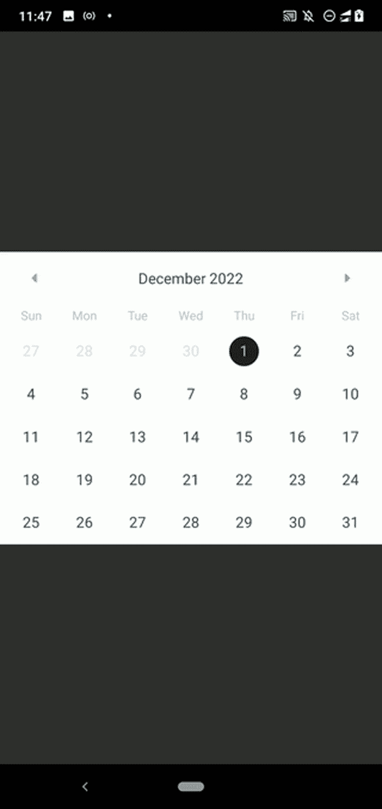

Implementing a date selection feature

布尔元素`marked`呈现一个带有几个预包含样式的圆形，但是这个库足够灵活，可以为构建开发人员定义的形状样式提供`customStyles`支持。以下代码片段在您按下 day 元素时呈现绿色矩形:

```
function CustomCalendar(props) {
  const initDate = '2022-12-01';
  const [selected, setSelected] = useState(initDate);
  const marked = useMemo(() => ({
    [selected]: {
      customStyles: {
        container: {
          backgroundColor: 'green',
          borderRadius: 0,
        },
        text: {
          color: 'white',
        }
      }
    }
  }), [selected]);
  return (
    <Calendar
      initialDate="2022-12-01"
      markingType="custom"
      markedDates={marked}
      onDayPress={(day) => {
        setSelected(day.dateString);
        props.onDaySelect && props.onDaySelect(day);
      }}
      {...props}
    />
  );
}

```

这里，我们使用`markingType="custom"`来打开自定义标记特性。`multi-dot`标记类型允许我们将多个点指示器添加到 day 元素中，就像指示特定日期的事件一样，如下面的代码所示:

```
import React from 'react';
import {
  SafeAreaView,
  ScrollView,
  StyleSheet,
  View,
} from 'react-native';
import { Calendar } from 'react-native-calendars';

function App() {
  const running = {key: 'running', color: 'blue'};
  const cycling = {key: 'cycling', color: 'green'};
  const walking = {key: 'walking', color: 'orange'};
  const marked = {
    '2022-12-01': {
      dots: [running, walking]
    },
    '2022-12-02': {
      dots: [running, walking, cycling]
    }
  };
  return (
    <SafeAreaView style={styles.container}>
      <Calendar
        initialDate="2022-12-01"
        markingType="multi-dot"
        markedDates={marked}
      />
    </SafeAreaView>
  );
};

const styles = StyleSheet.create({
  container: {
    flex: 1,
    justifyContent: 'center',
  },
});

export default App;

```

上面的代码生成了一个日历组件，在 day 元素中有多个点指示器:

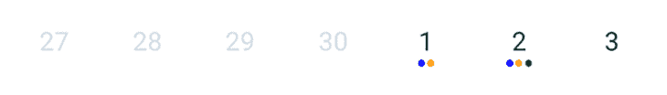

Adding multiple custom dot indicators

### 标记日期范围

我们可以自己用`customStyles`编写一些代码并实现日期范围标记样式，但是这个库通过提供内置的日期范围标记特性来提高开发人员的生产力。
例如，您可以使用内置的范围标记功能标记 2022 年 12 月的前十天，如下所示:

```
function App() {
  const getMarked = () => {
    let marked = {};
    for(let i = 1; i <= 10; i++) {
      let day = i.toString().padStart(2, '0');
      marked[`2022-12-${day}`] = {
        startingDay: i == 1,
        endingDay: i == 10,
        color: 'yellow',
        textColor: '#aaa',
        disabled: true,
      };
    }
    return marked;
  };

  return (
    <SafeAreaView style={styles.container}>
      <Calendar
        initialDate="2022-12-01"
        markingType="period"
        markedDates={getMarked()}
      />
    </SafeAreaView>
  );
};

```

这里，我们使用`getMarked`函数来生成一个 10 天的时间段。周期开始/结束边缘样式将根据`startingDay`和`endingDay`布尔值改变。运行上述代码片段后，您应该会看到以下结果:

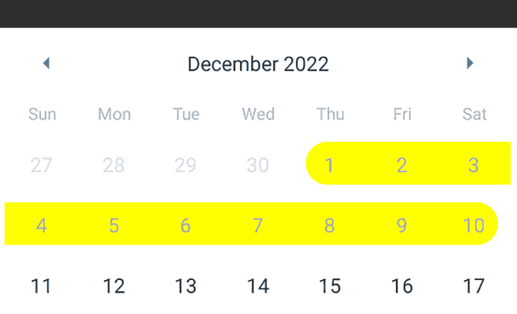

Marking a date range with a preferred background color

可以用这个周期标记特性构建一个日期范围选择器组件。您可以从我的 GitHub 库中看到一个示例实现。

这个库也提供了一个内置的多时期标记特性。请看下面的代码:

```
function App() {
  const getMarked = () => {
    let marked = {};
    for(let i = 1; i <= 10; i++) {
      let day = i.toString().padStart(2, '0');
      let periods = [
        {
          startingDay: i == 1,
          endingDay: i == 10,
          color: 'teal',
        },
        (i >= 2 && i <= 6) && {
          startingDay: i == 2,
          endingDay: i == 6,
          color: 'orange',
        }
      ];
      marked[`2022-12-${day}`] = {
        periods
      };
    }
    return marked;
  };
  return (
    <SafeAreaView style={styles.container}>
      <Calendar
        initialDate="2022-12-01"
        markingType="multi-period"
        markedDates={getMarked()}
      />
    </SafeAreaView>
  );
};

```

上面的`App`组件实现呈现了 2022 年 12 月 1 日和 10 日之间的两条日期周期线:

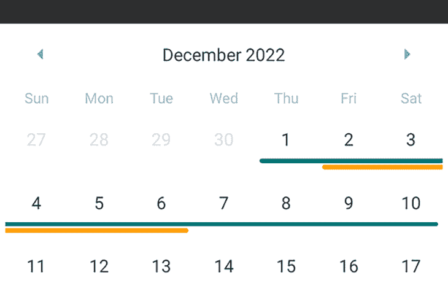

Using the multi-period marking feature

想要在日历中显示一些预订的快速摘要吗？尝试`multi-period`标记类型。

## 自定义日历主题

现在，我们已经知道如何进行基本的 UI 定制；我们更改了第一个工作日，禁用/隐藏了月份导航箭头，更改了月份格式，等等。如果我们需要更改 day 元素、标题、工作日名称颜色和字体，该怎么办？

正如突出显示的特性一节中提到的，这个库允许您通过传递自定义主题对象来更改外观。如果您觉得使用自定义主题对象有局限性，可以直接覆盖日历组件的样式表定义。此外，您可以定制日历组件的容器样式。

首先，看看下面的示例代码，了解如何通过`theme`属性定制日历的外观，以及如何使用`style`属性定制日历容器的样式:

```
<Calendar
  initialDate="2022-12-01"
  style={{
    borderRadius: 5,
    margin: 12,
    elevation: 5,
    borderWidth: 4,
    borderColor: 'rgba(100, 100, 100, 0.2)'
  }}
  theme={{
    calendarBackground: '#222',
    dayTextColor: '#fff',
    textDisabledColor: '#444',
    monthTextColor: '#888'
  }}
/>

```

上面的代码片段通过`theme`属性为日历应用了深色方案，并通过`style`属性为日历容器应用了一些样式增强。看下面的预告:

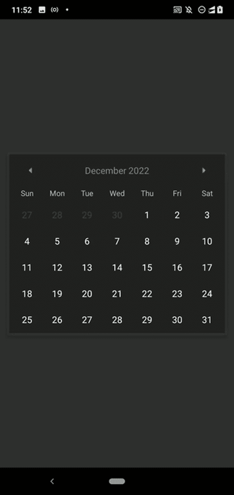

Implementing a custom dark color theme for the calendar

道具提供了一种定制文本样式和颜色的方法。但是，我们有时需要使用更多的样式定义进行高级定制。对于这种情况，可以覆盖样式表定义。例如，您可以按如下方式覆盖日历标题样式:

```
theme={{
  'stylesheet.calendar.header': {
    headerContainer: {
      flexDirection: 'row',
      backgroundColor: '#eee',
      borderRadius: 12
    },
  }
}}

```

通过浏览[源](https://github.com/wix/react-native-calendars/tree/master/src)查看您的`style.ts`文件，并确定您可以通过`theme`覆盖的所有样式定义。检查特定的`style.ts`文件的结尾，以找到样式表标识符(即`style.calendar.header`)。

我们可以在`theme` prop 中使用样式表覆盖来为周末标题应用不同的样式。例如，对于以下主题对象，我们可以将绿色用于周六标题，红色用于周日标题:

```
theme={{
  'stylesheet.calendar.header': {
    dayTextAtIndex0: {
      color: 'red'
    },
    dayTextAtIndex6: {
      color: 'green'
    }
  }
}}

```

以下是上述设置的预览:

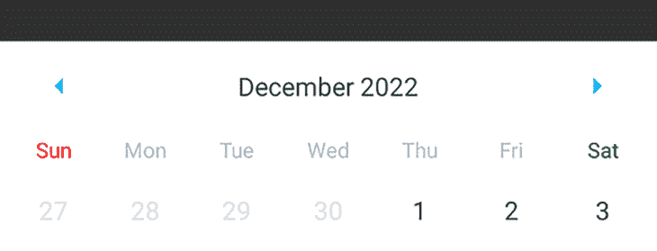

Changing weekend days’ header styles via the theme object

对周末数字使用两种不同的颜色也是一个很好的 UI/UX 改进。但是，该库不支持定制索引日元素样式，就像我们通过`theme` prop 定制日标题一样。因此，我们必须用`markedDates`来定义周末的数字，直到维护人员和贡献者开始处理[这个拉请求的想法](https://github.com/wix/react-native-calendars/pull/1495)。

现代移动应用通常比传统点击使用更多的滑动事件。例如，每个流行的社交媒体应用程序通常在用户向上滑动时加载更多帖子，而不是在用户点击加载更多帖子按钮时。`Calendar`组件被设计成用箭头导航，并且一次查看一个月，但是您可以使用`CalendarList`组件来创建一个现代的类似无限滚动条的日历组件。
运行下面的代码:

```
import React from 'react';
import {
  SafeAreaView,
  ScrollView,
  StyleSheet,
  View,
} from 'react-native';
import { CalendarList } from 'react-native-calendars';

function App() {
  return (
    <SafeAreaView style={styles.container}>
      <CalendarList/>
    </SafeAreaView>
  );
};

const styles = StyleSheet.create({
  container: {
    flex: 1,
    justifyContent: 'center',
  },
});

export default App;

```

现在，您可以看到一个可滚动的日历:

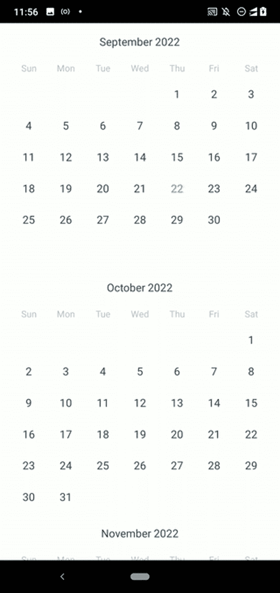

Using `CalendarList` to create a scrollable calendar

然而，`Calendar`组件是最小的、传统的和通用的，所以只有当屏幕是面向日历的(即显示在`Modal`中)并且用户需要一次看到多个月时，才考虑选择`CalendarList`。`CalendarList`组件接受所有的`Calendar`道具和[一些附加道具](https://github.com/wix/react-native-calendars#calendarlist)。

## 将`Agenda`组件用于高级用例

在某些场景中，我们需要在 React 本地应用中实现议程视图。`Calendar`和`CalendarList`组件支持通过`markedDates`属性添加多时段标记，但是日历组件没有足够的空间为每个标记行添加标题和描述。因此，用`Calendar`或`CalendarList`组件实现议程视图不是一个好的决定。

`Agenda`组件允许您通过在第二个视图中显示每天的记录来创建议程视图，该视图在点击 day 元素后打开。

运行以下代码以显示一个示例议程视图:

```
import React from 'react';
import {
  SafeAreaView,
  ScrollView,
  StyleSheet,
  Text,
  TouchableOpacity,
} from 'react-native';
import { Agenda } from 'react-native-calendars';

function App() {
  return (
    <SafeAreaView style={styles.container}>
      <Agenda
        selected="2022-12-01"
        items={{
          '2022-12-01': [{name: 'Cycling'}, {name: 'Walking'}, {name: 'Running'}],
          '2022-12-02': [{name: 'Writing'}]
        }}
        renderItem={(item, isFirst) => (
          <TouchableOpacity style={styles.item}>
            <Text style={styles.itemText}>{item.name}</Text>
          </TouchableOpacity>
        )}
      />
    </SafeAreaView>
  );
};

const styles = StyleSheet.create({
  container: {
    flex: 1,
    justifyContent: 'center'
  },
  item: {
    backgroundColor: 'white',
    flex: 1,
    borderRadius: 5,
    padding: 10,
    marginRight: 10,
    marginTop: 17,
  },
  itemText: {
    color: '#888',
    fontSize: 16,
  }
});

export default App;

```

这里，我们使用了`Agenda`组件，通过`items` prop 提供日项目。您可以使用`renderItem`回调为每天的项目设计一个 GUI。在这个 GitHub 库的官方文档中查看其他回调和支持的道具。

运行上述代码后，您将看到一个如下所示的最小议程视图:

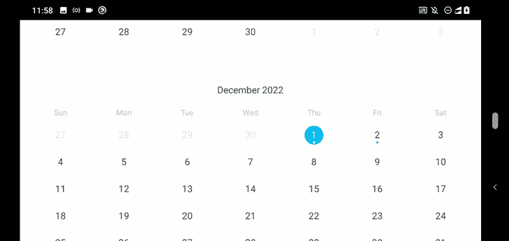

The `Agenda` component preview in Android

出于演示目的，我们硬编码了几个日程项目，但是您也可以使用远程 web 服务器为生产应用程序中的议程视图获取数据。

## 如何放置日历组件

在移动应用程序中呈现任何 GUI 元素有两种主要方式:在应用程序屏幕表面呈现或在弹出窗口中呈现。我直接在一个应用程序屏幕上演示了上面所有的日历组件定制。如果您使用日历组件作为用户输入元素，在弹出窗口中显示它可以节省当前应用程序屏幕的空间，并提高整体可用性。

请看下面的代码:

```
import React, { useState } from 'react';
import {
  SafeAreaView,
  ScrollView,
  StyleSheet,
  View,
  Modal,
  Button,
} from 'react-native';
import { Calendar } from 'react-native-calendars';

function DatePicker({visible, onDateSelected}) {
  return (
    <Modal visible={visible} transparent={true} animationType="fade">
      <View style={styles.overlay}>
        <Calendar onDayPress={onDateSelected}/>
      </View>
    </Modal>
  );
}

function App() {
  const [modalVisible, setModalVisible] = useState(false);
  return (
    <SafeAreaView style={styles.container}>
      <Button title="Show Modal" onPress={() => setModalVisible(true)}/>
      <DatePicker
        visible={modalVisible}
        onDateSelected={() => setModalVisible(false)}/>
    </SafeAreaView>
  );
};

const styles = StyleSheet.create({
  container: {
    flex: 1,
    justifyContent: 'center'
  },
  overlay: {
    flex: 1,
    justifyContent: 'center',
    padding: 40,
    backgroundColor: 'rgba(100, 100, 100, 0.6)',
  },
});

export default App;

```

这里，我们创建了可重用的`DatePicker`组件，并在`Modal`中显示了一个日历组件。点击该按钮后，模式将显示一个覆盖图和一个日历组件，如以下预览所示:

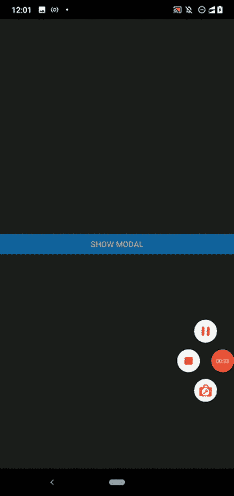

Showing the calendar within the Modal component

## `react-native-calendars`组件

在本教程中，我们讨论了`react-native-calendars`提供的三个流行组件:

1.  `Calendar`
2.  `CalendarList`
3.  `Agenda`

我们主要关注`Calendar`组件，因为它允许你在 React 本地应用中创建可定制和可共享的日历组件，但该库通过`WeekCalendar`提供了一个周历，通过`Timeline`提供了一个时间线实现，等等。

从官方文档中查看所有官方支持的组件。有一些未记录的组件，但你可以从来源的[处查看。](https://github.com/wix/react-native-calendars/blob/master/src/index.ts)

## `react-native-calendars`替代品

像任何其他流行的 React 原生包一样，`react-native-calendars`也有替代包，但这些替代包没有`react-native-calendars`包那么有竞争力。

其原因包括:

*   大多数备选包都专注于创建日期选择器，而不是日历视图
*   一些包没有被主动维护并且被弃用(即 [`react-native-calendar`](https://github.com/christopherdro/react-native-calendar) )
*   有些包是新的，在 React 本地社区中仍然很流行

然而，了解替代方案是值得的，因为它们可能会在未来变得流行，并可能为您的需求提供独特的功能。因此，请查看以下备选库:

## 结论

我们学习了如何使用`react-native-calendars`库创建可共享的定制日历。代码的可重用性提高了每个人的生产力并提高了软件质量，所以如果您在多个地方重复使用相同的日历属性和相同的值，一定要努力定义一个可共享的日历组件。

此外，通过为日历组件和其他 UI 元素使用匹配的颜色主题，始终关注应用程序的 UI/UX 因素。这个库提供了`Calendar`组件作为主要组件，但是在为你的需求选择一个之前，要检查`CalendarList`、`Agenda`和其他组件。

## [LogRocket](https://lp.logrocket.com/blg/react-native-signup) :即时重现 React 原生应用中的问题。

[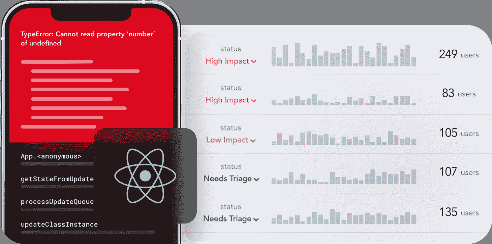](https://lp.logrocket.com/blg/react-native-signup)

[LogRocket](https://lp.logrocket.com/blg/react-native-signup) 是一款 React 原生监控解决方案，可帮助您即时重现问题、确定 bug 的优先级并了解 React 原生应用的性能。

LogRocket 还可以向你展示用户是如何与你的应用程序互动的，从而帮助你提高转化率和产品使用率。LogRocket 的产品分析功能揭示了用户不完成特定流程或不采用新功能的原因。

开始主动监控您的 React 原生应用— [免费试用 LogRocket】。](https://lp.logrocket.com/blg/react-native-signup)